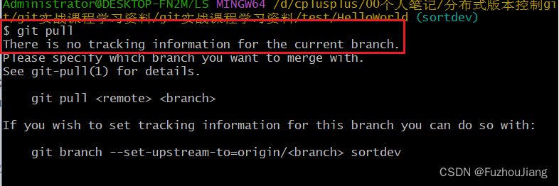
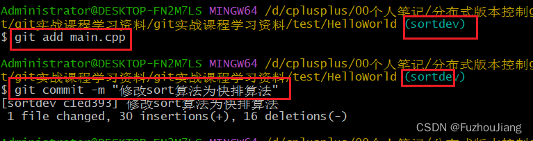
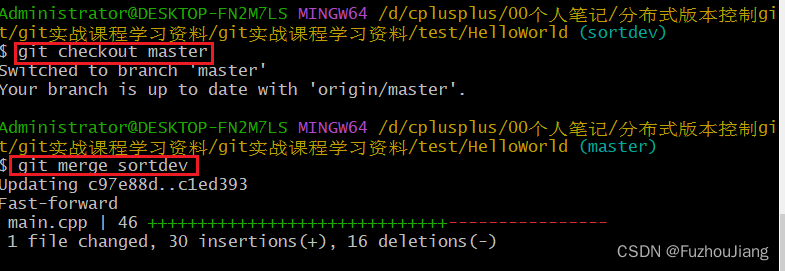
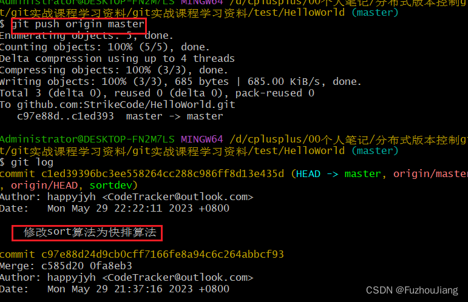
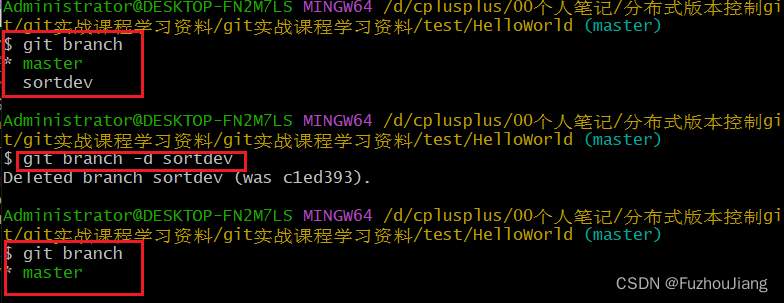
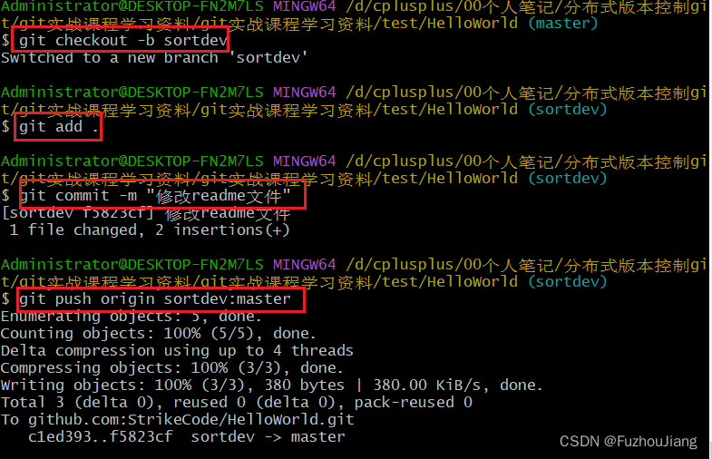

## 场景

我们希望能够不影响本地master分支的情况下自己单独开发一个功能，等开发完成后再合并到master分支中

## 操作

创建本地分支sortdev，并且切换到该分支上：

```sh
git checkout -b sortdev  
```


`git branch -vv` 可以查看到本地`master`分支**追踪**的是远程的`origin/master`分支，而 `sortdev`没有追踪任何远程分支，所以此时执行`git pull`失败



紧接着对本地的main.cpp做修改，注意此时分支在`sortdev`，然后进行`add` 和 `commit`操作



然后我们切换回本地master分支并进行合并



然后再进行`git push`即可



如果我们后面不需要sortdev分支，那么进行[删除分支](https://so.csdn.net/so/search?q=%E5%88%A0%E9%99%A4%E5%88%86%E6%94%AF&spm=1001.2101.3001.7020)



### 在没有追踪指定远程仓库的分支上进行push修改



最后一个红框，表明将本地的sortdev分支的修改推导远程仓库origin的master分支