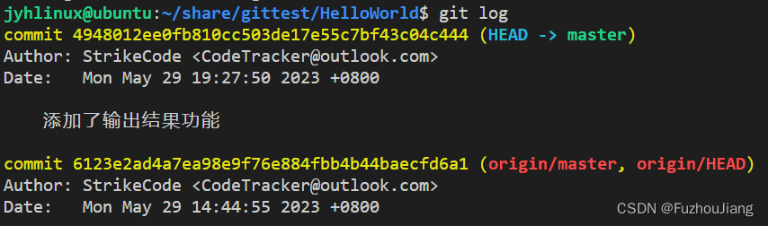
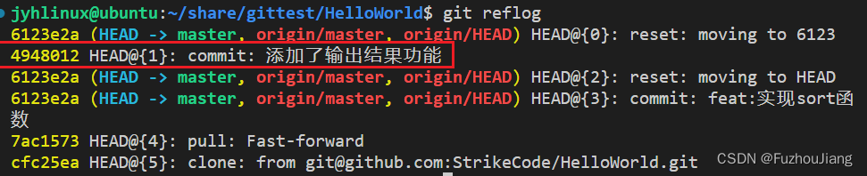
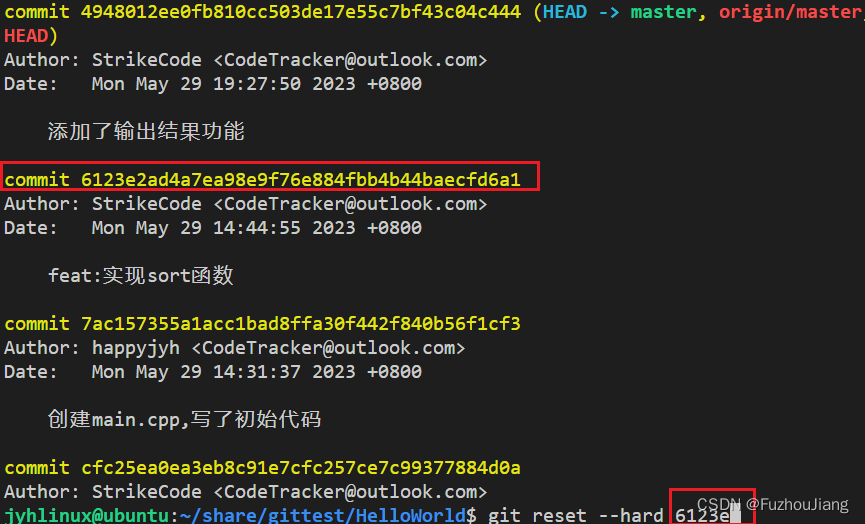
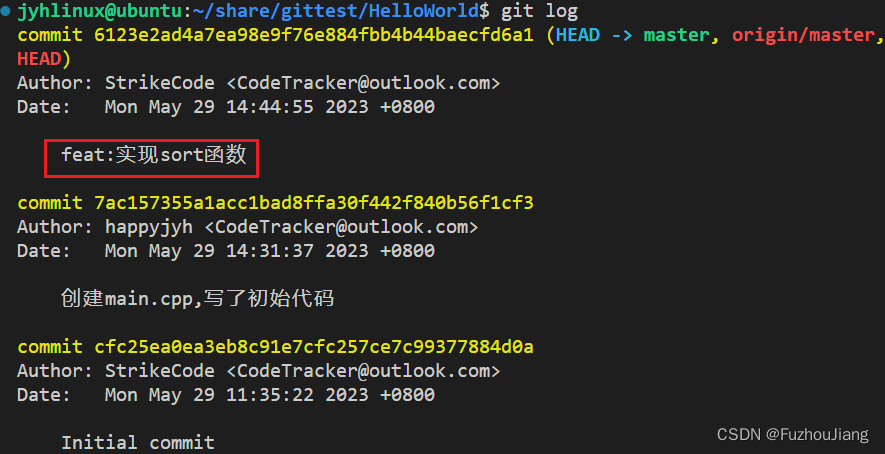

> git push origin master 的含义是将本地当前分支的提交推送到名为 origin 的远程仓库的 master 分支上。

## 各阶段代码修改回退撤销的操作

### case1

```sh
git checkout -- . 
```

修改了文件内容但没还有`git add` 或`git commit`时撤销当前目录下所有文件的修改

### case2

当完成了`git add` 之后，**要将修改回退到工作区**（`workspace`）可以使用git reset HEAD

### case3

当完成了`git commit`之后，查看`git log`



想要撤销掉修改（直接从`repository`到删除），可以使用`commit` 号，比方说回退到 commit 6123…的版本，可输入

```sh
git reset --hard 6123
```

> 注：commit号码不需要输入全部，只要能区分出来即可。

如果还想再修改回前面的版本可以使用`git reflog` 查看之前的版本号，再输入：

```sh
git reset --hard <commit>
```



### case4

如果已经`git push`之后还想回退的话，那么第一种办法就是修改成回退的版本代码，然后再做`git add .` 然后 `git commit` 然后 `git push`

第二种方法是，如果检查`git log` 确认前面没有其他人的修改，那么我们先在本地分支上退回到上一版本：

```sh
git reset --hard 6123e
```



然后使用 `-f` 参数强制push上去，即输入

```sh
git push -f origin master
```



可以看到回退成功