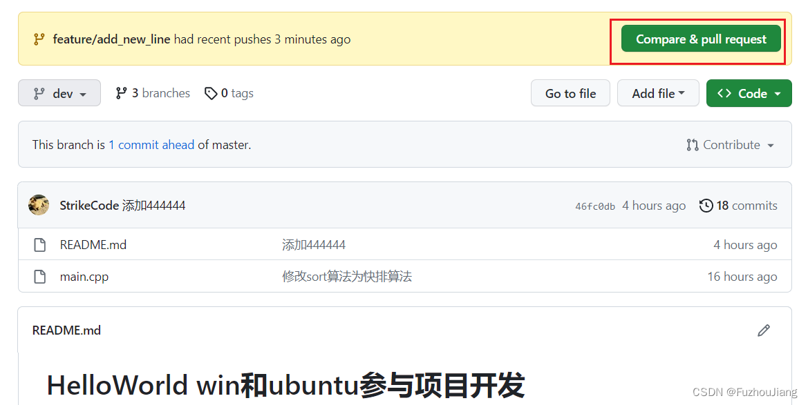

## 常见分支命名

**远程**仓库的分支：主干分支`master`, 开发分支`dev`，发布分支`release`

**个人**开发分支：特性分支`feature`, 缺陷修改分支`bugfix`， [热更新](https://so.csdn.net/so/search?q=%E7%83%AD%E6%9B%B4%E6%96%B0&spm=1001.2101.3001.7020)分支 `hotfix`

## 一般工作流如下

1.  创建个人本地开发分支： git checkout -b feature/add\_new\_line origin/dev
2.  个人本地分支推送到远程分支：git push origin feature/add\_new\_line:feature/add\_new\_line；
3.  提交个人远程代码分支和目标代码合入分支的MR，相关负责人进行CR
4.  相关负责人提出意见，本地修改相应的代码，推送到对应的远程代码分支上；
5.  代码CR意见处理完，相关负责人进行代码merge，代码修改从 feature/add\_new\_line 合入dev分支完成；
6.  删除个人远程代码分支；

## 杂项

```sh
git push origin feature/mydev
```

在**远程**仓库创建了一个名叫 feature/mydev的分支

```sh
git push origin :feature/mydev_v1.0
```

删除了个人推送的远程分支

## 实例演示

创建个人本地开发分支并切换过去：

创建一个名为feature/add\_new\_line的本地分支，追踪 远程仓库origin的dev分支


然后进行开发修改


然后进行提交到远程的个人开发分支上


可以看到github上能看到多出了一个远程分支


然后提交`pull request`



选择`pull requests`然后点击 `New pull request`


选择将`feature/add_new_line` 版本代码合并到 dev 版本的代码，然后点击`Create pull request`


点击下方红框


然后评审者可以选择merge这个pull request


然后在dev分支就能看到相应修改后的内容

