## 冲突情况一

首先甲和乙同时从远程仓库拉取v1版本的代码，然后乙先修改代码产出v3版本的代码进行提交并且成功，随后甲修改v1版本代码产出v2版本的代码，此时想要提交到`origin/master`,但是远程的最新版本并不是之前的v1了，这里就产生了冲突（红线标识）。

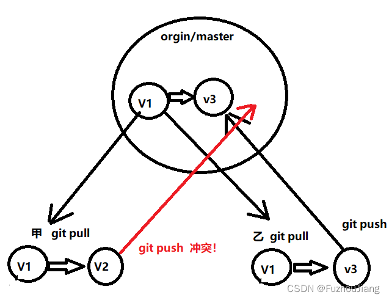

### 举例如下

win这边进行修改[排序算法](https://so.csdn.net/so/search?q=%E6%8E%92%E5%BA%8F%E7%AE%97%E6%B3%95&spm=1001.2101.3001.7020)为从大到小排序

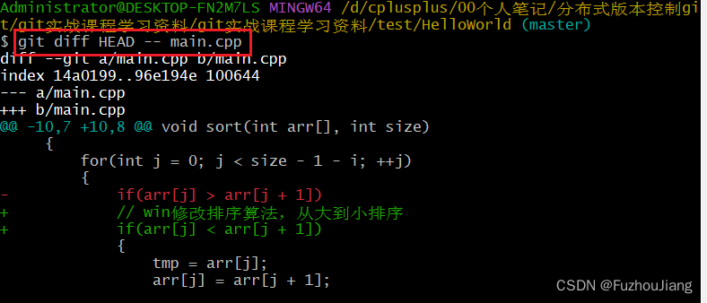

然后做`add` 和`commit`操作，但没`push`

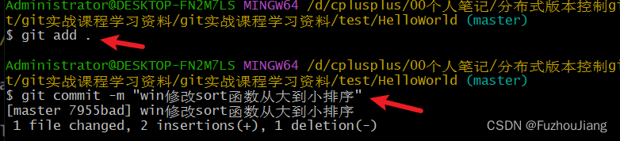

然后ubuntu这一方做出了如下修改

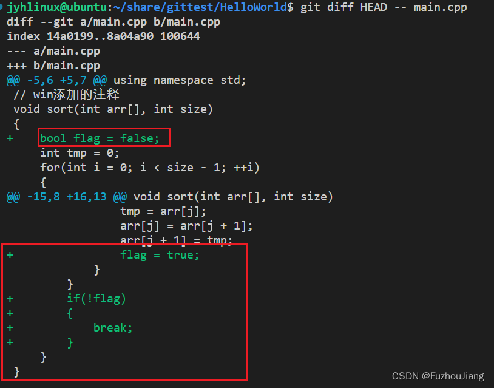

然后ubuntu这边做`add` 、`commit`和`push` 操作

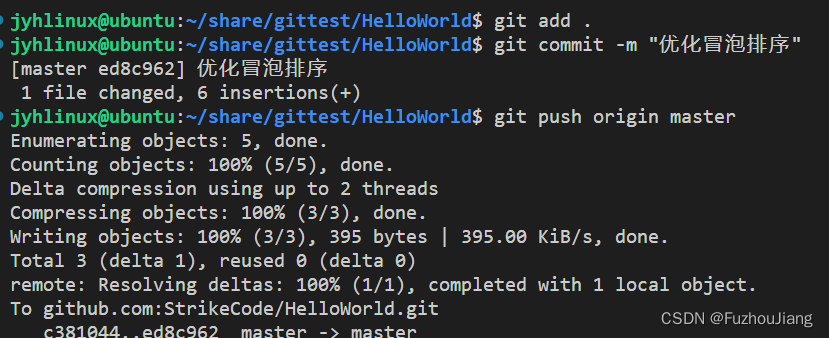

此时win这边做`push`操作则会出现冲突

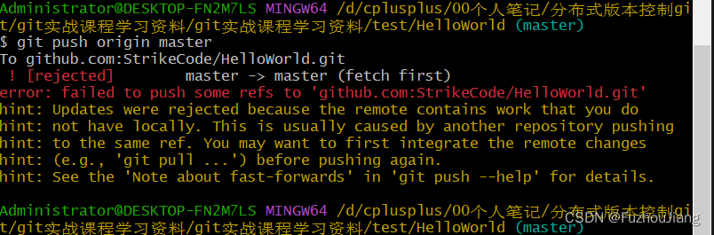

此时输入`git pull` 会自动帮我们进行合并到本地的`master`分支，然后我们再进行`push`即可

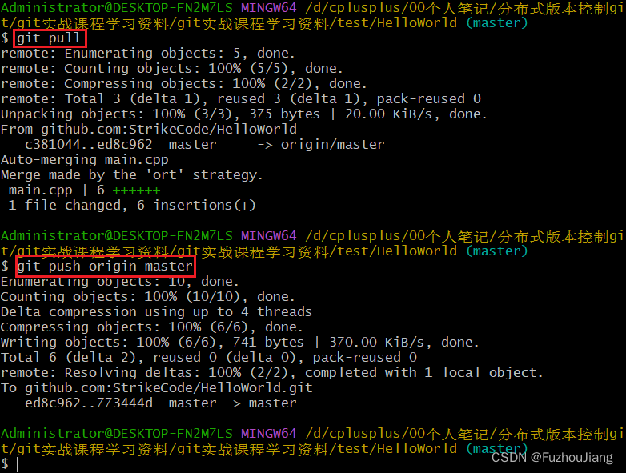

可以看到这是一次`merge`动作

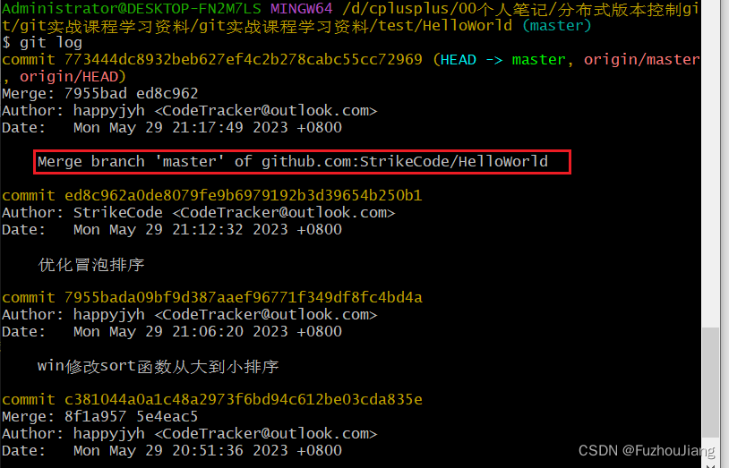

## 冲突情况二

首先在win这边对README文件进行修改

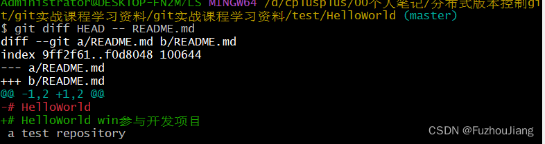

同时win这边进行 `add`和`commit`操作，但没有`push`

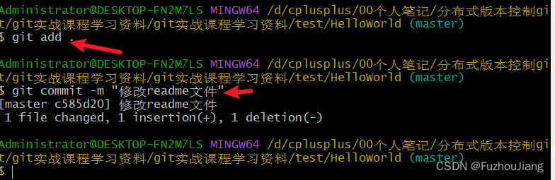

然后ubuntu这边对在README文件相同位置进行修改

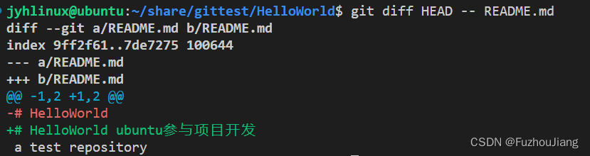

然后win这边再进行`push`操作，出现冲突

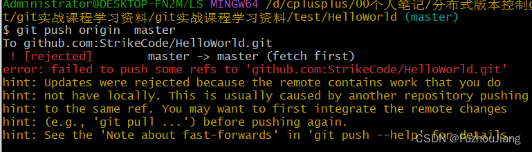

然后进行`pull`

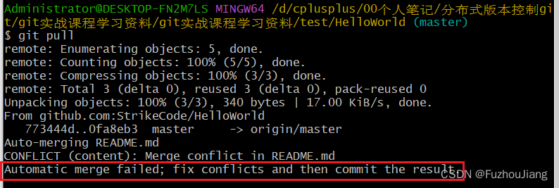

但是此时由于win修改的位置和pull下来的版本**在同一个位置进行了修改产生了冲突**，不能自动`merge`，要手动解决，此时冲突的README文件如下

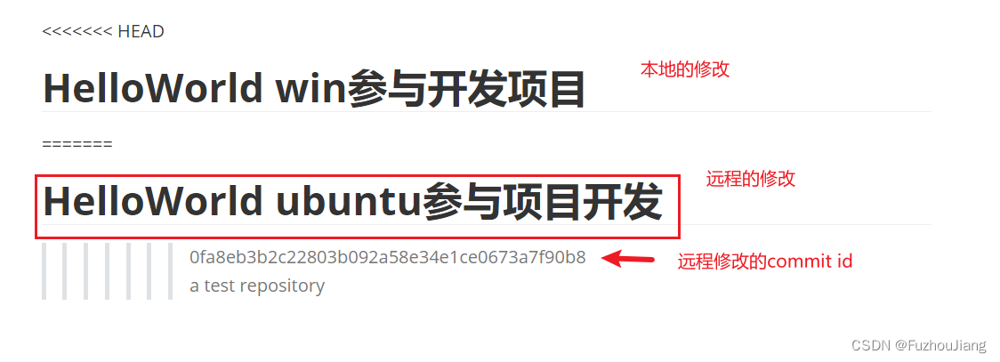

然后win这边再做 `add`和`commit`和`push`的操作解决冲突

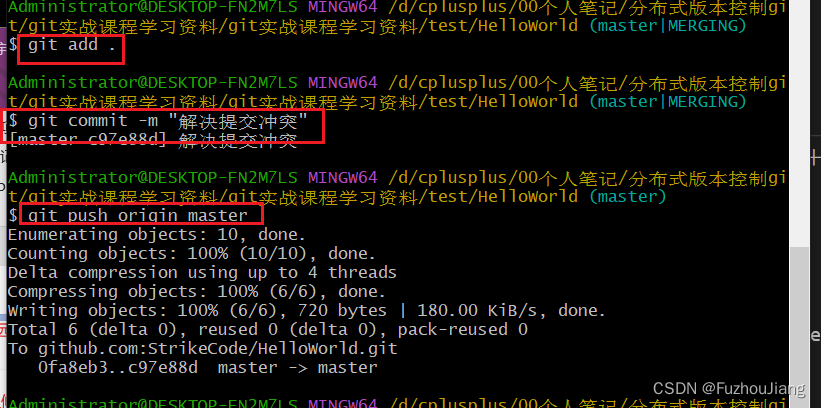