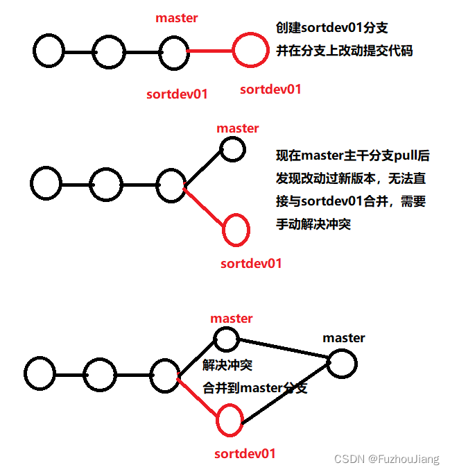
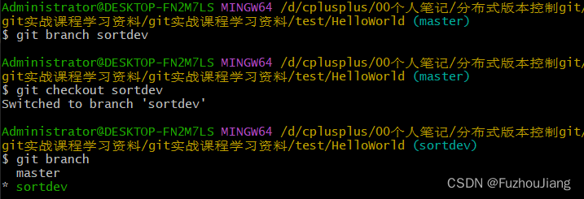
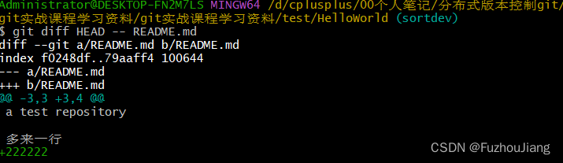
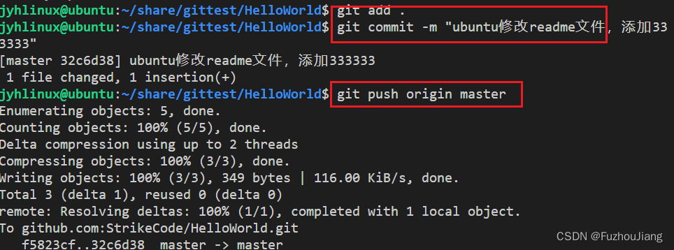
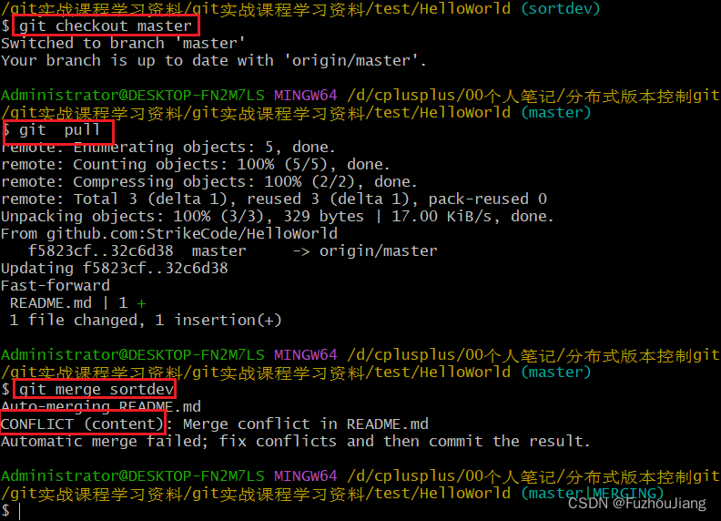
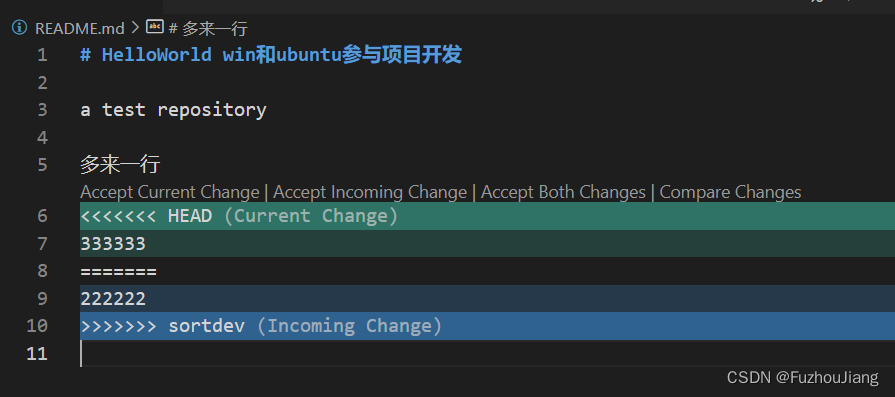

## 冲突情况描述



## 实例演示

有两个用户 win 和 ubuntu 进行协作开发

首先win方创建并[切换分支](https://so.csdn.net/so/search?q=%E5%88%87%E6%8D%A2%E5%88%86%E6%94%AF&spm=1001.2101.3001.7020)



然后win对内容修改



然后提交修改进行`add`和`commit`，但还没切换回master 合并

```sh
Administrator@DESKTOP-FN2M7LS MINGW64 /d/cplusplus/00个人笔记/分布式版本控制gitgit实战课程学习资料/git实战课程学习资料/test/HelloWorld (sortdev)
$ git add .

Administrator@DESKTOP-FN2M7LS MINGW64 /d/cplusplus/00个人笔记/分布式版本控制git/git实战课程学习资料/git实战课程学习资料/test/HelloWorld (sortdev)
$ git commit -m "win修改readme，添加222222"
[sortdev 7bac9ce] win修改readme，添加222222
 1 file changed, 1 insertion(+)

```

ubuntu在master修改readme文件与win中相同位置333333，并执行`add`、`commit`和`push`



然后win切换回master分支，并进行`pull`操作，然后执行与`sortdev`进行`merge`的操作，发生**冲突**：



手动解决冲突，冲突文件如下



修改完冲突后就再进行`add` 、`commit` 以及`push`即可