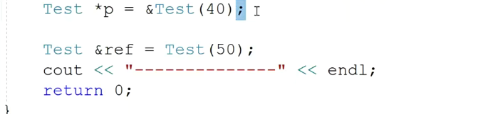
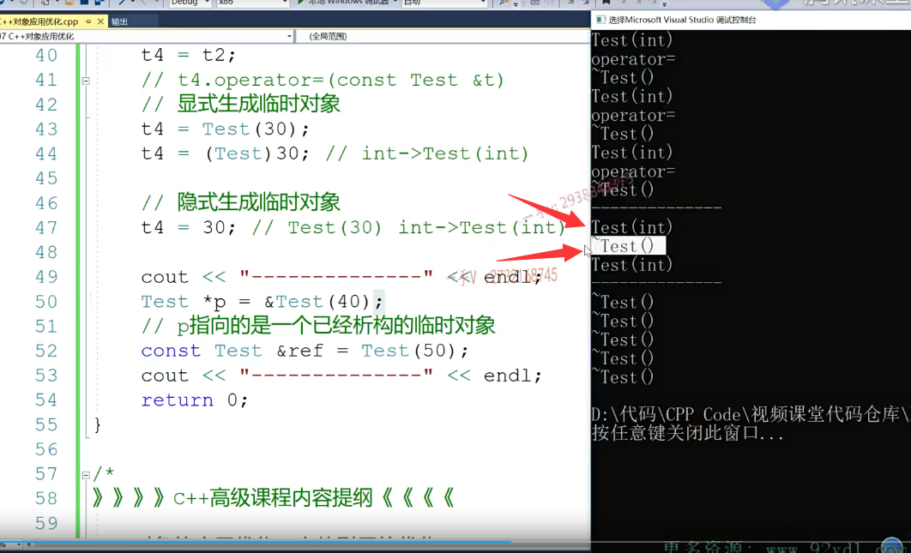

## 第一节课

大家好，从这一节课开始呢，我们就开始讲我们C++高级课程里边儿的第一部分啊，就是对象的一个应用优化啊。那么，对于对象的优化来说呢啊，我们为什么要设计对象的优化？首先呢，在我们这个校招中啊，对于我们。笔试面试的时候啊，对于我们对象啊，对象在我们代码编写过程中，==对于对象的构造函数，析构函数，拷贝构造以及。这个赋值运算符重载函数的一个背后的一个调用==呢，它有的时候是会出一些相关的题目去考察你啊，会考察你。

我们总是说呢啊C++代码呢嗯，有的有的人说啊C++代码呢没有C语言的代码效率高。其实并不是这样的c跟C++都属于本地编译型语言啊，代码要在我们本地系统上经过编辑编译链接产生，我们可执行文件才能去运行。我只能在这里边儿说一句C++的这个代码，从来没有说它的效率比C语言就低。这个在于我们开发者，我们开发者写的代码效率不高，并不是说C++语言本身的效率就比C语言低。

这一点是我们需要注意的，那么当我们写C++代码，其背后呢，会调用那么多的函数，那我们所要做的一点，所以对象的优化就是我们要尽量减少。==我们C++编译器给我们代码背后添加了那么些函数的调用，怎么能让那些函数少调用一点甚至不调用那些？不相关的函数==，那么我们面向对象代码的这个效率就一下子就上来了啊，好，那我们从这一页开始呢，就讲一下。==我们对象的这个优化过程到底是怎么优化？那么想要了解对象优化过程？==

首先我们要知道啊，我们类的成员方法啊。它那么一个调用的这个时机，那我们先来做一个简单的复习啊class test，我们在这里边定义一个。我们简单的类啊。大家来跟我看一下啊。在这呢，我们来定一个。

简单的成员变量啊，那么在这呢，我给它定一个构造函数。这是我们的这个拷贝，这是我们普通函数的一个普通构造函数的一个调用啊。一个打印。这是我们析构函数的一个打印。这也是我们。普通的拷贝构造函数啊的一个实现在这里边呢，我也是用它。外部引用对象的MA把我当前的。这个对象的MA给初始化一下啊，当前对象的MA常用变量给初始化一下，然后在这里边儿我也讲了一个。打印啊。加了一个打印好。这时候我再添加一个。这是赋值在这里边，我们也加一个打印啊。叫赋值重载对吧MA=t的MA啊return新的。

这个test定义的对象不会发生什么呃，发生浅拷贝不会产生什么问题对吧？因为这个对象呢，并没有占用外部的资源。这里边只需一个简单的，这个成员变量MA。

我们添加了这四个类，里边经典的函数构造析构。拷贝构造和赋值对吧？我们主要是为了看一下在我们面向对象代码编写过程中，我们对于这四个函数的调用过程是怎么样子的？啊，熟悉了我们成员这四个经典的成员方法的调用，

然后我们再反过头来再看一下对象的优化，我们就很自然而然的就能够了解啊。我们为什么要做那样的优化了啊？

调用过程：

1.这里边定义了一个对象t1啊，对象t1。那么这个t1的话呢，肯定是调用这个构造函数，这是毋庸置疑的，

2. t2t1.那么。这个掌握前边儿学习的这个前边儿学学过的内容，已经掌握的同学们呢？这个应该是利用拷贝构造函数。拷贝构造函数应该是也没有任何问题的啊。

3. 对于这个来说呢？不要把这儿认为成是一个写了个等号儿，就是赋值啊，==因为左边儿这个对象t3正在定义，==所以呢，它跟我们上边儿这个一样，也是调用什么呀？也是利用拷贝构造函数由t1呢？拷贝构造生成这个t3啊？==由t1拷贝构造生成这个t3==

### 显示生成临时对象的调用

4. 那我们再来写一个啊。大家来看一下这块的这个代码啊，这块的这个代码。那么，

   这是干什么事情呢啊？这个呢？叫做。test 20啊，叫做显示生成啊，临时对象。这个相当于就是告诉编辑，利用带有一个整形参数的构造函数啊，有没有有呢啊？调用带有一个整形参数的构造函数呢，来构造一个test对象。那么，==很多同学就认为在这里边呢？那就是啊，调用带整形参数的构造函数就有这么一个。这样的一个打印对吧？然后呢？这既然已经是一个生成的test对象，那么由这个对象再来拷贝构造t4。利用这个拷贝构造。==

   

那么，临时对象大家应该都知道，临时对象是没有名字的嘛，那没有名字的话，所以它的生存周期呢？它的生存周期就是所在的语句，因为你出了这个语句，因为这个临时对象没有名字，你出了这一条语句呢，你在其他地方也没有办法去使用它。

对的吧，所以呢，临时对象的生存周期就是它所在的语句，语句结束了以后呢，这个临时对象也就该吸够了。==所以呢，很多同学可能认为在这里边呢，这是临时对象构造，先有一个构造的调用。啊用，然后再用临时对象拷贝构造t4，还有一个拷贝构造函数的定要用，然后语句结束呢，有一个析构函数临时对象析构。啊，==

#### 演示：

那到底是不是这个样子呢？我们来看一下啊，我们来看我们加一个打印。来观察一下。这个代码运行的一个结果啊。好了，大家看看在这里边。这个是t1定义t1对象的时候，对应带有整形参数的。啊，构造函数这第二是t拷贝构造t2第三个是t1拷贝构造t3这两个是一样的，都调用了。拷贝构造函数。啊，那大家看到呢？

在这里边儿第四句话就是test 20临时对象来构造一个t4。它并没有像我们刚才说的，先调用构造生成临时对象，然后临时对象再给t4拷贝构造，最后出语句再析构临时对象。

所以这里只是一个普通的构造的地位，相当于呢，这一句话跟。这一句话是没有区别的啊，没有区别的。没有区别，这两句话是完全没有区别的。完全没有区别。大家注意一下啊，这是完全没有学，

所以呢，在这里边我们需要记住啊，不管是在哪个系统平台上，当我们采用CA加呢编辑器啊。来编译我们这个词学家代码的时候，他都有这么样一个优化啊对

与对象。构造的优化就是用临时对象啊，拷贝。构造或者是用临时对象生成新对象的时候啊。这个临时对象，我们把它放在这样的一个注释里边吧，表示一块的注释，对吧？这注释的内容都是说的是一个意思啊。

这个临时对象就不产生了，直接构造新对象就可以了。啊，因为这一句代码的目的，最终也就是把t4给它构造起来。对的吧哦，不用说是为了构造t4啊，既要调用构造，又要调用拷贝构造，最后出语句还要调用析构。那么这样一来呢，效率就非常非常的低了。所以注意，以后我们如果看到用临时对象。生成新对象的时候，

你要注意啊，临时对象就不产生了啊，就不产生了，就被优化掉了。这个临时对象就被优化，它不产生了，直接用。

临时对象生成新对象时，临时对象不产生，直接调用新对象

这个构造方式直接构造t4就可以了，相当于就是这个操作。啊，这个一定要记住，一定要记住。我们从这个代码的这个打印上啊，运行的打印上我们能看出来。对的吧，

构造跟机构跟构造的顺序刚好是相反的，所以析构就是t4t3t2t1。

5.

再来看。这个应该大家都知道，这是必要用那个==赋值运算符重载函数==，因为左边是一个已经。存在的对象，所以这里边并没有生成新对象，并==没有生成新对象OK==吧？这里边并没有生成新对象

6.

这还是一个临时对象。那么刚才也说了，临时对象现在也谈到临时对象，那么这个临时对象它生不生成呢？这个临时对象，它肯定是要生成的啊，它肯定是要生成的。

它不生成的话呢，都没法拿什么东西给t4赋值呢，

#### 调用了赋值运算符重载，形参需要传入一个对象

对吧？大家应该都知道啊，这应该是t4调用自己的，是不是赋值运算符重载函数啊？唉，它的形参变量有一个引语test的引用变量，又来引用一个对象，又来引用一个对象。所以这个临时对象是必须生成，它不像刚才刚才最终的目的是来构造一个新对象t4。啊，就是我目的是生成新对象t4。所以在这儿呢，

临时对象就直接优化掉了，直接生成t4对象就可以了。但是在这儿不行了，==在这是给t4赋值呢，你要给t4赋值，==我t4已经存在了，你要给我赋值好，你先拿一个东西过来。给我赋值。对吧，所以==这个临时对象是一定要产生的==啊，==大家注意在赋值的时候。它右边这个临时对象是一定要产生的==，它要给这个赋值的运算符，重载函数，

形参变量，这个==引用变量啊。要传递内容==。好吧。

在这一句代码中呢，它的这个打印过程啊，应该是这个样子的啊。先是调用构造呢，生成临时对象。然后呢，再用临时对象呢来给t次赋值，就是调用一次呢赋值函数。除了这个语句呢。这个临时对象就该虚构了。注意一下这一点。

那我们来再做一个测试。大家来看一下。在这儿呢，中间这一块儿我们调用了负值，这个是t2给t4赋值，相当于是t4调用了自己的赋值函数啊。t4调用了自己的复制函数。t4嘛，调用了自己的赋值函数，把t2呢当做我们的实参传进去了，所以呢，在赋值函数里边this指针指向的就是这个t4对象。对吧，这个。形参变量引用t啊，

这个引用变量t，它引用的就是这个。是参t2对象对了吧？这个构造构造谁呢？构造这个临时对象构造完了以后呢？是临时对象给t4赋值啊语句。除了语句，==这个临时对象呢，要进行析构==啊，除此之外t4t3t2t1依次进行一个提购。啊，大家注意一下这一点。注意一下这一点。那么再来看一下t 4=test啊，等于test。

7.

### 强转类型

但这两个有什么区别呢啊，这个应该大家能看清楚了，现在这是==隐式生成临时对象==。就是==调用带整形参数的构造函数==啊，给我==生成一个test对象==啊，这个对象没有名字啊，没有名字。

那这是把30啊，这个整数啊，把==整数给它强转成test类型==，

把其他类型强转成类类型。

那到底该怎么转呢啊？这个好转，把其他类型转成类类型的时候呢，编辑就要看。这个类呢，有没有一个合适的构造函数唉，你现在要把整形转成test，那它编译器就要看这个test这个类类类型啊，有没有带整形参数的构造函数有没有？有有有的有的话呢，

给你隐式。生成一个临时对象对吧啊，那在这里边儿呢，因为你看啊，因为在这里边儿，我们前边儿写了这个test类型。对的吧，写了test的类型，所以这相当于还是个显式，那怎么就叫隐式呢？就这个样子。

#### 还是相当于显式

#### 隐式

对于负值来说嘛，我们默认就是把右边儿类型转成左边儿类型，这个是不是还是呢？

把整型转成这个test类型啊？那到底能不能转呢？那编译器就看test这个类有没有带整型参数的构造函数，那再者你把一个叉二星转成test的类型啊test。那个编辑器就看test有没有带一个叉星参数的构造函数，那现在它肯定没有带叉星参数的构造函数，所以你要做这样的类型转换的话，那辑肯定会给你报错的。对不对啊？编辑肯定要给你报错的。但是呢，test有这样的带整形参数的构造函数，所以这样的类型转换是没有问题的啊。所以其实这三个一样。这三个一样都要生成临时对象，

然后调用赋值语句，调用赋值赋值函数啊，赋值函数，赋值运算和重载函数。然后出语句以后呢，这个临时立项细构。所以大家在这里边儿吧，这个应该要搞清楚啊，==前两个呢，因为出现了类名称，所以在这里边儿，很显然它叫显示生成临时对象==。啊啊，显示生成临时对象。这个叫什么呢？

这个叫。隐士。也是。生成临时对象。这是方式的式啊，显示跟演示生成临时对象，在这里边生相当于呢。啊，它演示的给你哎，做了个这样的事情，晓得吧？好了，来我们看一下我们

代码的一个运行啊。好，

大家来看看。在这里边儿，这个赋值刚说了，是t2给t4赋值这个构造唉，是test括号30。叫显示生成临时对象，然后临时对象给批次赋值赋值语句完了以后呢，这个临时对象析构，然后下边儿这个还是调用带整形参数的构造函数是这个也也是。啊，显示生成临时对象，就这个跟这个呢，没有任何的区别，它俩是完全一样的。然后呢，

临时对象给t4赋值出了语句，临时对象析构这个还是得用带整形参数的构造函数，这里边是显这个隐式生成临时对象，因为这里边没有出现test这个类型了是吧？临时对象给题词赋值啊，出语句临时对象析构。所以在这里边，希望大家呢？在赋值语句过程中啊，对于临时对象的这个把握。啊，大家好好理解一下。

8.

所以呢，就是我们要看一下啊，在指针变量跟引用变量使用过程中，

我们对于临时对象。这样的一个。构造析构过程是什么样子的？我们来再接着看一下啊。==在这呢，我定了一个指针。指向了这个临时对象==。

然后呢？==我又定义了一个引用变量。引用了一个临时对象==。啊，引用了一个临时对象。

==那在这里边这个临时对象肯定是要生成的==。啊，

==肯定是要生成你不生成的话，用这个指针里边存谁的地址==呢？

引用我们之前给大家讲过啊，指针跟引用的区别就是在我们CA加精品课程里边给大家讲过呢，指针跟引用的区别。在底层呢，引用表现出来是不是就是一个指针啊？所以这个临这这个临时对象肯定也是生成的，不生成的话。那引用都没法去，==在底层存储一块儿，存储一个地址是吧==？

嗯，关键是呢。如果你出了这个语句，

==你这个临时对象析构==了，那也就是说出了这个语句以后呢？我p啊指向的是。是一个已经析构的临时对象，那么在这里边我p就不能使用了。我这个指针呢，那就是一个相当于就是一个也指针了，对吧？因为它指向的这个对象呢，已经被吸够了。那就不能再通过这个指针间接访问这个对象了。还有这个引用变量出了这个语句，以后呢？那这个对象到底细不细构呢？我们来看一下。

这里面我们有一个。问题是吧啊，我们有一个问题OK，稍等一下，我们看一下这个是个什么问题呢？无法从test。转换成test的这个引用啊啊，那在这里边它。必须得让我们用一个。常引用是不是才可以呀啊？OK OK，好在这里我们看看啊，这个其实呢这个。这个只能说是什么情况呢？因为我们用的这个现在用的这个VS呢？

VS的版本比较新，是2017的啊，它支持CA加幺幺以及1417的一些新的这个标准啊，它的这个。代码编写呃，检查代码这个编写啊，这个代码检查机制更严格了，在以前的这个。呃1513上啊，用普通引用来引用这个对象呢，就临时对象是完全没有问题的啊，完全没有问题的。这是显示生成的一个临时对象，就是个普通对象啊，那现在需要我们用一个长引用来引用好了。

那我们加了一个const啊，在这我们主要还是要看一下，除了这个语句啊，这个对象还在不在？好，大家来跟我看一看。

首先。看看这儿这个构造构造这个。临时对象。你发现出了作用域以后啊，出了这个语句以后。这个临时对象吸够没吸够吸够了。所以呢，我们不应该用一个指针。去保留一个临时对象。

出了语句之后，临时对象会析构

### 引用临时对象安全

这个是没有问题的啊，除了语句呢，这个临时对象吸够吗？这个临时对讲不写作文。对吧，为什么呢？因为引用嘛，相当于就是别名啊，别名我们临时对象刚才说了，为什么出语句叫析构呢？就是==临时对象的这个生存周期就是它所在的语句是吧？因为呢，它没有名字嘛。你没有名字的话==，

你出了语句，在其他地方是不是也没有办法去引用你啊？所以呢，提示对象一般出了语句。它就不存在了，它就要吸垢了。生命周期就到。但是==用引用啊，不一样，引用我们之前讲过，相当于呢，通俗的理解就是相当于它给一块儿内存呢，又按了一个名字==。啊，==相当于给这个临时对象给了一个名字==，

所以用引用啊，==引用临时对象。是安全的==，这个==临时对象的生命周期呢，就变成引用变量的生命周期==了，==引用变量是这个函数的局部变量==，所以呢？他return完以后呢？它才吸购这个临时对象才吸购，然后接着是t3 TT 4t3t2t1再进行吸购。好在这儿我们就得到一个结论呢，

在这里边儿，希望通过呢？这么一个例子的讲解啊，希望大家对于我们代码在编写过程中包括。拷贝构造包括赋值，运算和重载函数调用，以及在这些函数中应用于。临时对象的时候，我们到底调用了哪些函数对象？到底它的生命周期是什么样子？希望通过这么一个简单的例子呢，把它搞清楚好吧好了，

## 第二节课

举个例子

常引用只能读不能写了

当我们写对象的时候，对象这个操作运算的时候，它背后掉的那些函数，如果你对它。背后调用的一些函数不明白，不知道的话呢？那我们就无法切出来高效的CA加代码了。自己思考一下，先给大家一些时间思考一下。大家可以暂停一下这个视频啊，自己思考一下，然后再听我们的讲解，那我们我们在这里边就直接给大家说了。

程序过程：

1.首先，程序运行以后呢？

首先是全局变量相构造，所以在这里边儿啊。是t1先构造，不要说t1构造到底调用了什么函数呢啊？调用了这个带两个整形参数的构造函数。这是第一个构造。

2.

全局变量一定是在main函数之前呢，我们做好初始化的对吧，然后第二个呢就是我们的t5。调用了，带两个整型参数的构造函数啊。那也就是说这里边是。paste in tint啊，这个也是paste in tint。

3.

静态局部变量

第三个。注意这个静态的成，静态的局部变量啊，有好多同学搞不清楚这个东西的构造跟析构的时机。静态局部变量程序运行时候呢，它的内存已经存在了，因为我们数据段的内存呢？是事先就分配好的，对吧？但是静态局部变量初始化是第一次运行到它的时候才初始化的，所以在这儿不要去构造t4。

真正的第三个：

吧t1跟t5构造完成以后，第三个就到这里边了。就到这儿。

4.

这也是调用这两个整形参数的构造函数。啊，那这个是定了什么呀？

5.

接下来到谁了？到第五个了，第五个到谁？第五个就是我们的t4了。在这儿是先生成临时对象，然后用临时对象给t4拷贝构造出了语句，再析构临时对象吗？那这个临时对象我们说了，用临时对象构造同类型新对象的时候呢，这个临时对象就被优化掉了。

优化掉，所以在这儿呢，相当于就是什么操作呀，在这儿相当于就是跟我这个样子写呢。没什么区别，一模一样的啊，一模一样的，所以呢，调用了带两个整形参数的构造，直接构造t4就行了，==只有。一次函数的调用。啊，没有生成这个临时对象==，一定要注意。

6.

第六个。先调用带两个整型参数的构造函数，是不是生成这==显示生成临时对象==啊？然后再调用什么函数啊？对，再调用复值函数。这个临时对象给谁赋值啊？给p2赋值。出了语句以后呢？还要调用什么对，除了语句，==以后还要调用析构函数来析构这个临时对象==。这个析构函数现在没做事情，但是我们现在不关心它做没做什么事情啊，这个函数里边我们现在关心的是这个oop代码，

它背后调用了哪些函数？这是我们要搞清楚的

7.

区的时候呢？有些同学可能有点恍惚啊，不知道这是在干啥？这是类型强转嘛，那剩下的这个东西是什么呀？剩下这个东西，它是逗号表达式嘛？啊括号表达式一逗号表达式二逗号表达式三逗号表达式四是不是那么逗号表达式最终的结果就是它最后一个？表达式n的这个结果嘛，所以这个跟50是一个意思的。这个就是个50逗号表达式，就是最后一个表达式的这个值嘛？所以呢，

下边这个相当于就是什么呀test。这是不是往50强转成test类类型啊？那么怎么把整型强转成test类类型呢？编辑就会看有没有带整型参数的构造函数。有的话就会给它在这里边显示生成一个临时对象。有没有带一个整形参数的？有些同学乍眼一看，没有肯定有嘛，这个构造函数虽然带了两个整形参数，但是两个整形参数都有默认值，相当于我写了这么一个构造函数就可以构造三种对象，一种是不带参数的，那a跟b。b都取默认值。一种是传一个参数，

那相当于这个就是给a传了，给a传了吃餐b没有传的话b取默认值。啊，还可以这样来构造一个对象，那就给AB都传至了，你看。这三种形式都可以构造的okay吧？好了，所以在这里边相当于呢，

#### （test）为强转

（50,50）为逗号表达式，就是代表最后一个 50

那就就是显式去调用构造函数，有没有一个的参数为int 的构造，没有，但是有2个int的，并且有默认值

那么就是第一个参数为50，第二个参数为默认值

然后再去调用赋值运算符，再去析构

8.

隐式生成

首先它这是第七个了是吧？首先调用test整齐int int构造函数构造了一个临时对象。==给a传了a传的是几啊？a传的是50。啊a传的是50那b没有b没有的话b就用默认值五==啦，对吧？

然后呢？是不是再调用赋值啊？这个临时对象给tr赋值出了语句，以后呢？谁析构啊？对临时对象析构。再继续，这是第八个。这60你又要把一个整型转成test类型，那怎么办呢？编译器就看有没有带整型参数的构造函数嘛？果然有。而且在这个语句中，没有出现任何的判词的类型啊，它是默认把等号右边类型转成左边类型，

所以在这里边应该是一个引式生成临时对象。调用带整型参数的构造函数啊，那么60给a穿了，那就是说MA最终得到了一六十。MB呢，最终得到形参b的默认值还是个五。

那接着呢，临时对象呢，给我们提而复之，最后呢，出语句，临时对象析构。好的吧，在这呢，注意一下。

9.

先有一个构造函数，带两个整形参数的构造函数的调用。new嘛new，==我们比malloc多了一个操作嘛，它不仅仅会先开辟内存，开辟完内存，它会根据我们对象定义的方式来调用合适的构造函数嘛==。对不对啊？但你注意，我们刚刚才说过啊，你出了语句以后呢？处理语句以后啊，

==处理语句以后那么这一个对象，它虚不虚构呢？注意析构不？它不析构。没问题吧==，不析构，因为在这儿，但这是不是临时对象啊啊？注意我们这里边儿可不是临时对象，这里边儿是用new。生成的在堆上构造一对象堆上。对上的对象什么时候释放呢？你注意，只有在late的时候，对上的对象是不是才释放啊对？

所以出了这个语句，以后呢，这个对象还在的啊

10.

第十个。你有了一个对象，数组那每一个对象都会调用默认构造嘛，也就是说在这里边会调用两次哎。会调用两次，这个带两个整形参数的构造函数，会调用两次。好的吧，注意一下，同样是new delete的时候才析构啊。

11.

第11个这就不好意思啦。

这个调用了。两个整形参数的构造函数，但是这是一个临时对象，哎，除了语句呢，指针指向临时对象，这个临时对象就要析构了。我们说==不要用指针指向临时对象==了

12.

对吧？引用变量没有关系，引用变量，引用临时对象相当于给临时对象按了一个名字，那临时对象就可以活下来了是吧？活到什么时候呢？==引用变量什么时候出作用域啊？这个它所引用的这个对象什么时候析构？==所以除了这个语句，这个对象是不析构的。

13.

第13个。delete p 1 delete比free多的一点是它要先调用指针指向对象的析构函数然，后呢才，从这个指针表示的内存地址开始释放内存，所以呢，p1指向的是堆上的这个test七十七十这个对象，不要把它叫做临时对象啊，它不是临时的。这是堆上的一个对象，所以在这呢，会调用一次。析构函数。

p1指向的是这个对象，对上对象，所以德列特的时候呢，先会吸够这个对象，然后再复位释放这个对象的内存

14。

第14个。给力的p2。p2指向呢是一数组，这数组里边有两个对象啊，所以这里边会调用几次析构啊，调用两次析构。把这对象数组里边两个对象先析构掉。提供完了以后呢，再来一个福瑞，把整个数组的内存呢释放掉。

一定要注意啊，

15.

好了。那这个函数完了以后呢？该怎么去继续虚构呢？接下来该到谁析构呢？给到p4引用变量引用的这个对象机构了。

16.

接下来该到谁析构呢？给到p4引用变量引用的这个对象机构了。没有问题吧，这到谁析构啊t3析构注意不是t4啊t4呢，人家是==在数据段上的程序结束才析构。==   ==t4==

引用的这个对象析构完了以后是t3t2。t4t5.题意，我们来运行一下代码。

17.

t5 t1 析构

