# 第二节课

大家好，上节课中呢？我们通过呢一个test类啊，定义的对象，那么这个对象在我们代码中的这个应用啊。啊，我们看到了啊，它什么时候会调用构造析构拷贝构造跟赋值运算符重载？这是我们啊，一个对象最基本的四个函数，当我们看到啊，上节课的代码啊，当我们看到呢。这个对象在应用过程中，我们一定要脑子里边儿要了解啊，

它背后到底调用了啊什么样的一个函数？对吧，包括我们上节课给大家重点讲的这个演演示跟显示生成的这个临时对象，包括堆上创建的对象，它背后呢？调用的都是什么样的成员方法？我们知道了对象背后调用的函数，我们才能去减少它们，优化它们，才能做对象应用的优化。那么这节课呢？我们再举一个事例，我们来看一下啊，那么我们这个对象在函数调用过程中。函数调用过程中，

那么有没有值得我们去优化的地方呢？

我们还是以一个test这么一个类呢，来举一个例子啊。咳咳。那么在这儿大家来看一下啊，这个是构造函数啊，构造函数。那么注意一下啊，注意一下我们大家在学习的时候呢，你注意这个带默认值参数的这个构造函数啊，这个就比较强大。你像你写的这么一个构造，它相当于可以默认构造一个对象啊，那这里边data就取形态默认值了十了，对吧？

另外呢，你还可以带一个整形参数的构造，就这两种呢，都可以构造一个test对象的，对吧？因为这带。这个默认值参数了啊。好在这呢，我们加一个打印，加一个打印就可以了，好，我们加一个打印就行了。好，再给出一个析构函数cout。再给一个析构的打印。

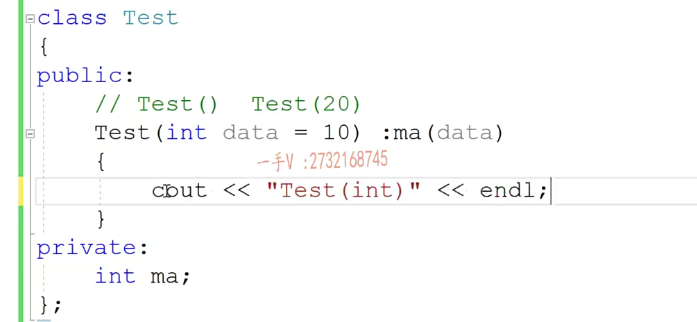

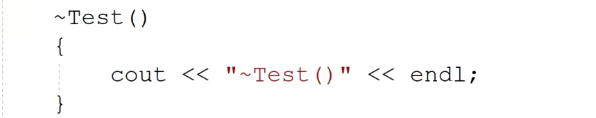

这个拷贝构造的这个打印啊，拷贝构造的话呢，在这里边也是通过啊。构造函数的初始化列表对成员变量的MA进行初始化，在这儿我们再加一个拷贝构造的这个打印啊，拷贝构造的打印。好，再给出一个。

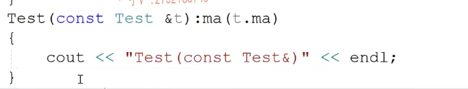

赋值运算符的重载。那么，给出一个赋值的打印啊？给出一个赋值的打印。在这呢，

所做的无非就是。啊，其实就是以前拷贝对吧？复制前拷贝情况下复制的操作，因为这个对象现在呢，没有占用外部资源，浅拷贝是没有问题的。对吧啊，其实呢，他做的默认做的事情就是这个事情，

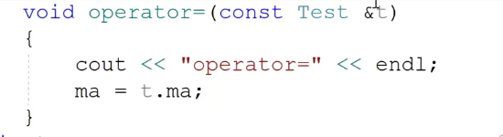

那在这儿呢，我们外部啊，在外部想访问test对象的MA是访问不了的，所以在这儿呢，我们提供一个方法，叫做get data。啊get data return，像这种方法，因为我们一般都实现成长方法，对吧？好在这我写了这么一个函数，就get object。test t.intvalue=t点get data啊，

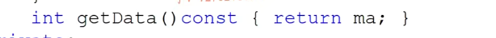

好在这我写了这么一个函数，就get object。test t.intvalue=t点get data啊，

再创建一个test tmp？value，然后再return tmp，这个方法很简单，这个方法呢，接收一个test对象。然后把探索对象里边儿的这个值取出来MA的值取出来，通过get data方法。然后呢，再通过这个值呢来构造一个函数，里边儿局部的态局部的一个对象对吧，然后再把这个对象返回去。注意在这里边不能返回指针或者引用。不能返回指针或者引用OK吧，

那大家应该知道呢，我们返回指针或者返回引用，返回引用也是返回一个指针对吧啊？那么，一定要保证啊，我们返回的这个对象啊，或者变量。当我们这个函数结束了以后，它还存在呢。举个例子啊，再举个例子。你把这个对象的地址返回，返回到我们调用方了，以后我们调用方就有可能通过你返回的这个指针间接的来访问你这个变量内存对象内存。但是呢，

由于这是一个函数局部的变量或者对象，这个函数运行完呢，这个对象就没了这个内存，随着整个儿函数的占被回收这个。变量或者对象，它的内存也就没了，所以你不能够返回局部的或者临时的地址或者引用。没问题吧，这是不能够返回的啊，这是不能够返回，

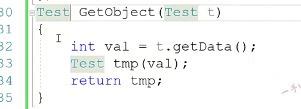

### static 修饰

那这个地方当然可以返回了，这在数据段呢，对吧？这在数据段呢？

啊，是我们程序运行开始，内存就有了。是不是第一次运行到它的时候，是不是构造这个对象啊？整个程序运行结束，它才进行一个析构。啊，才吸够完了，才释放内存。

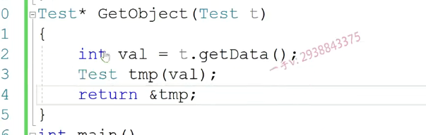

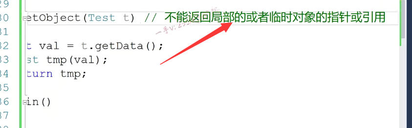

## 举例

我就写了这么一个简单的代码。这么一个简单的代码。

那么，大家思考一下，当我运行啊，当我运行。这个代码的时候呢？那肯定啊，随着代码的运行啊，这里边伴随有一些打印。有一些打印。就是对我们当前这个对象构造。析构拷贝构造以及赋值函数的一些打印。嗯，打印信息那么大家考虑一下啊，这些打印信息都有什么呢？它们的顺序是什么？

大家可以暂停一下视频，自己先思考一下啊，可以先在纸上去写一写。那么。在这里边儿呢，我们就直接来给大家去说这个问题了啊，去说这个问题了。大家来看一下啊。把这个呢，我们放到。画图板上来给大家说明一下，可能更直观一点。

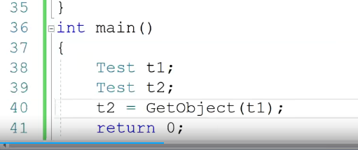

1.

第一个肯定是调用我们的。带整型参数的构造函数呗。啊，有些同学说这不是默认构造吗？是默认构造那么相当于我们这个参数data现在取默认值时嘛，对吧？

2.

那第二个呢？第二个是什么呀？第二个就是这个test。带整型参数的test构造函数来构造t2。

3.

第三个很多同学就一下子就跳到我们这个函数里边到tmp了。实参到形参。实参到形参。函数调用实参到形参。啊，==函数调用这个实参。传递给这个形参啊==，是初始化。还是负值呢？==是初始化还是赋值呢==？当然是==初始化==。以前大家可能对于初始化跟赋值可能不加以区分，因为对于我们编辑内置类型来说，初始化跟赋值确实没什么区别啊在。指令上都是一模一样，

实参到形参  拷贝构造

在汇编指令上都是一模一样，但是对我们对象不行，所以对象初始化那是调用构造函数的。呃，==所谓赋值==，那是==两个对象都已经存在==了，是在==调用左边儿对象的赋值运算符，重载函数==的。啊，所以它是不一样的，那么==函数调用实参到形参的传递过程啊，它是一个初始化==的过程。所以在这里边儿==t1是一个已经存在的定义过的test对象==，而==形参t是一个正在定义的test对象==，所以第三个。

应该是调用啊==test的。拷贝构造函数====由t1来拷贝构造形参t。这个要注意一下

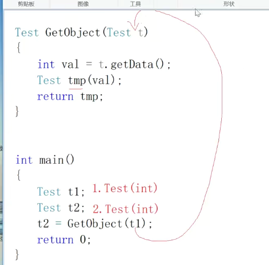

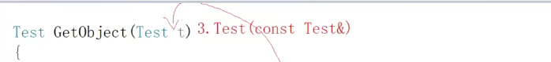

4.

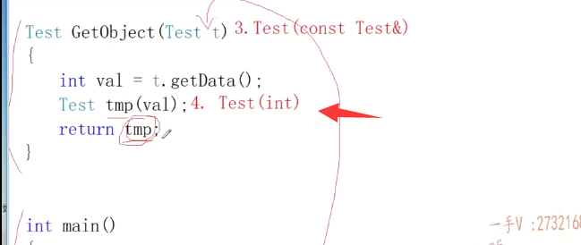

5.

第四个。我们就不说get data了啊，我们打印的只有构造机构拷贝构造等复制重载第四个。那就是调用啊，在整形参数的构造来构造tmp。然后呢，有的同学直接认为在这里边儿就用tmp给t2赋值，好家伙，这是两个不同函数战争上的变量对象。它是不能够直接进行赋值的，对吧啊？这是个不同的范围嘛，

不同的函数。你要对第二进行赋值，你这个函数必须得先执行完，把你返回去拿出来，但是很明显tmp能拿出来吗？==当get object函数完成以后，调用完成以后，这个dmp也没了==。因为它是属于我们这个函数的局部的一个对象嘛，对吧？所以呢，==为了把这个返回值带出来啊，返回值带出来tmp本身是出不来的啊，它出不了这个大括号儿==。所以呢，

在return tmp这里边，==首先呢，要在我们main函数战帧上。唉，main函数战争上。构造一个。临时对象啊，构造一个临时对象==，目的就是==把tmp这个对象呢带出来==，所以呢？这里边第五个就是调用用啊。拷贝构造函数。由tmp拷贝构造，内函数战争上的一个临时对象。啊，

那这个函数现在的任务呢？就是返回任务就完了啊，这个tmp的职能带出去了，这个对象能带出去了。

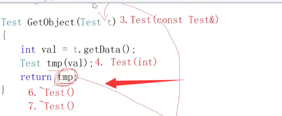

6.7.

好了，不要着急，直接到负值了，这个函数还没完呢。啊，第六个这个函数局部的对象都要进行析构，谁先析构啊？tmp吸垢在这，注意不要忘记还有一个形参t要吸垢呢。还有一个形参替要析构形参替啊，形参替也是我们函数的局务对象啊，

要析构好，这现在这个get object这个函数现在就处理完了啊。那完了，出来了以后呢？

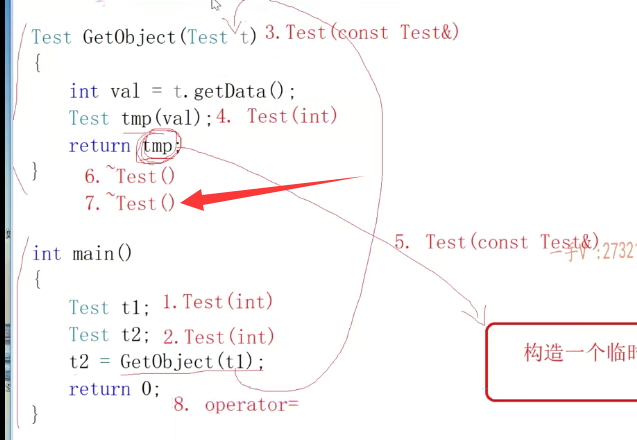

8.9

第八个第八个就是什么对第八个就是负值了。赋值哪个谁给谁赋值呢？就是刚才在内函数真正的这个临时对象，现在给谁赋值啊？给t2赋值。给p2复制。那么，大家知道==临时对象都是没名字的，出了语句是不是就要进行析构啊？所以呢，第九个就是一个析构函数。==

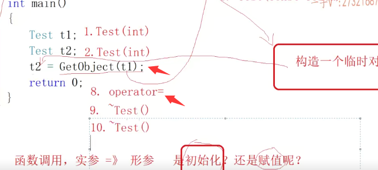

10.11.

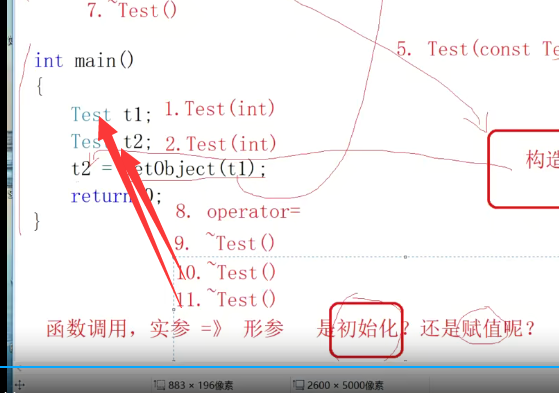

内函数结束。谁吸垢啊？t2吸垢。在谁析构啊？对t1析构。那么，这就是这个。函数调用过程中，对于我们对象使用啊，

其背后调用的函数，尤其是这个构造虚构拷贝构造和赋值运算符重载。一定要搞清楚啊，一定要搞清楚它背后呢。函数的这么一个调用的过程啊。大家看到这里边总共呢，简看着是。四五行简单的代码其实总共调用了背后调用了11个函数啊，==背后总共调用了11个函数==。11个函数。嗯。好，我们来运行一下，看到底是不是我们所考虑的这种情况啊？大家来看一下。

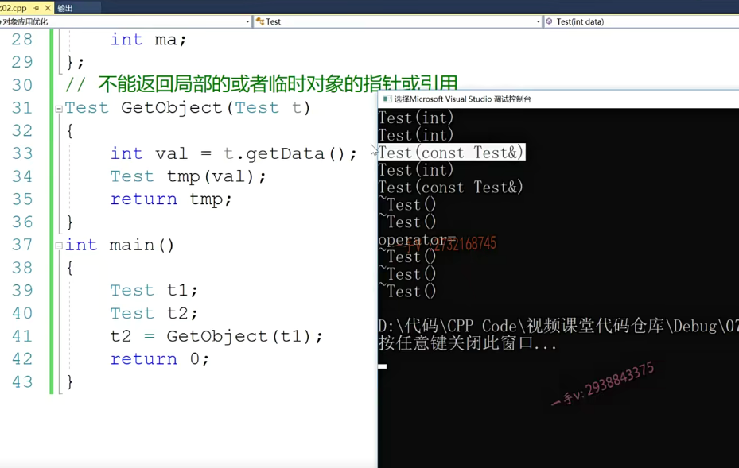

在这里边，这个构造是构造题一。这个构造是构造t2。这个拷贝构造是t1拷贝构造形参t。这个形参t这么一个对象啊，这个构造是在构造tmp。这个拷贝构造是由tmp tmp是局部对象，它无法把tmp带出来给t2赋值，对吧？所以在这里边儿啊，需要用tmp。拷贝构造唉，产生一个内函数战争上的一个临时对象就是新对象。没问题吧啊。这个函数完了以后，

析构tmp，这个析构函数析构tmp，这个对象再析构析构的是t这个对象。好了，这个函数现在处理完了，到内函数里边儿来了以后呢？是内函数战争上刚才那个产生的临时对象啊，给t2赋值。语句完成以后，临时对象析构。啊，完了以后呢？内函数战争上的t2细构再是t1细构。总共是。一二三四五六七八九十十一，

总共是11个函数调用，跟我们刚才说的没有问题。啊，那首先呢，希望大家呢，把这一块的这个。背后的这个函数调用呢，先给它搞清楚啊，先给它搞清楚，搞清楚了以后呢啊。我们下一小节。再给大家来说。==针对于我们这个函数调用，我们能获知哪些对象的优化？好，那我们这节课先到这里。==

