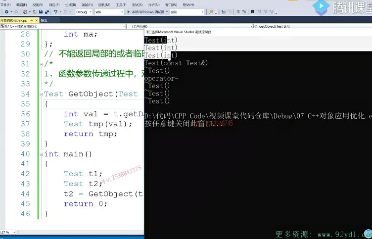
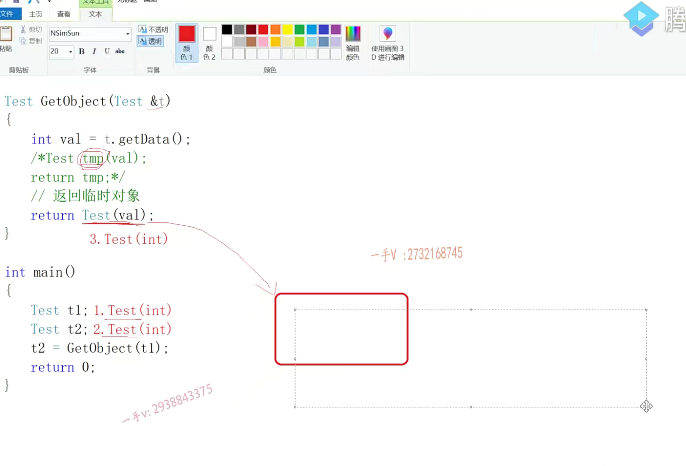

好，大家好！那这节课呢？我们基于上节课的内容呢？来主要说一下啊。那么，在我们函数调用过程中，我们对象该怎么优化？

# 函数调用过程中，对象该如何优化

对于这块儿代码呢，大家现在已经知道了。当我们代码运行以后呢？啊，其背后都有哪些函数的调用？总共是11个。啊，

我们上次都已经说过了啊。好了，

## 这个代码中，函数的调用有11个

## 写oop代码，遵循三句话

那在这里边儿，我们说第一个需要优化的地方啊，那么这节课我们会说出三句话，请同学们一定要把这三句话呢。记清楚了啊，我们在写代码的时候呢，尤其是oop代码，我们也去遵守一下这三句话。表达的意思。

## 首先

首先，在函数调用实参传递形参过程中啊，按值传递，这是按值传递对吧？

传递对象。这里边儿这个对象只有一个成员，变量对象四字节，但是实际使用中啊，对象的成员变量是很多很多的。对象的内存是很大的，在这里边儿呢，用实参对象拷贝构造形参一个对象。

1.函数参数传递过程中，对象优先按

啊，其实我们没有必要，其实我们没有必要，没有必要在这里边儿啊，那请大家记住我们第一句话啊。函数。参数传递过程中。

啊，对象。优先。按引用传递。不要按值传递。呃，我们应该按引用传递。按引用传递，按引用大家应该都知道啊，

这其实底层就是个指针，这相当于把实参的地址是不是传进来了？对，只不过呢，比指针呢，使用起来更简单一点啊，

更安全的一个指针嘛，因为引用变量是必须要初始化的，对吧？

## 换成引用后，没有拷贝构造，也没有对象的析构

那么这样一来呢，大家想一想，跟刚才比较来说，它会少几个函数的调用呢？会不会少函数的调用啊？首先形参。这里边儿没有新对象了，所以。肯定是没有t1拷贝构造，没有t1的拷贝构造，构造一个新对象没有了，那既然形参已经没有新的对象了，

所以它出作用域。也不需要吸垢了。所以这一下子就可以帮我们减少两个函数，一个是对于形参替的拷贝构造，一个就是形参替的。习构，那我们来看是不是这个样子的？

## 只有9个了

很明显，这个已经短了，对吧？一二三四五六七八九九个比刚才11个少两个函数啊。这是构造t1t2，这是直接构造tmp了，实参到行参现在没有任何函数产生了这个拷贝构造，这个是tmp拷贝构造内函数战争上的临时对象。

啊，除了作用域。除了这个get object函数作用域tmp，这个对象要细构。到主函数中啊，这是跟刚才还是一样，临时对象给t2赋值，临时对象析构t2t1依次析构。那么，希望大家以后在写代码过程中啊，对于我们函数调用参数传递对象的过程中啊，对象尽量是按引用来进行传递。好吧，按引用来进行传递啊，减少我们由于形参对象的这个构造，

以及它出函数的一个析构啊。

## 2.返回临时对象

好再来跟我看。我们第二个修改的点啊。这个大家应该是不陌生了啊，不陌生了，这是生成什么呀？临时对象的。这是不是生成临时对象了？这里边相当于直接返回了一个临时对象啊，返回临时对象。那你说这个跟上边儿这个区别到底在哪里呢？上上边这个呀，是把这个对象先一定义也是调用带整形参数的构造函数先定义。定义好了以后呢，

再把它返回，而这块儿呢，是什么操作呀？而这块儿呢，是直接返回一个临时对象。

## 第一个第二个都是调用带整形参数的构造函数

我们来考虑一下这种情况啊。那这块儿呢，应该还是第一个，第一个跟第二个都是调用带整形参数的，是不是构造函数啊啊？带整型参数的构造函数。

## 局部对象和临时对象是出不了函数的

那么。13到行三是传引用，

没有任何对象产生好了，我们继续按正常情况分析，这是一个临时对象。

那么，我们想着第三步应该是利用带整型参数的构造函数是不是生成这个临时对象啊？刚才我们已经说了，局部对象像这个局部对象，或者是这语句中的这个临时对象啊。或者处于函数作用域的这个局部对象。它是出不了这个函数的，这个函数用括号一出战争一回退他们的内存，也就交代了交换给系统了。所以为了把这个临时量带出去。临时对象带出去，只能在这里边儿。

怎么样啊？

## 临时对象拷贝构造新对象

用它拷贝构造。拷贝构造是不一个test新对象啊啊，在这里边儿。构造一个临时对象干嘛呢？构造这个临时对象。啊，就是为了呢，把返回值带出来。但是在这里边，我们突然分析到这，我们听到了一句话啊，==用临时对象拷贝构造一个啊，拷贝构造一个新对象==。

那这不就是我们之前。之前学习的时候呢，我们遇见了这种情况呢。嗯，是不是这种情况啊？用临时对象拷贝构造一个新对象。这里边儿会做先构造临时对象，然后用临时对象给题拷贝构造出语句，再析构临时对象呢？

## 临时对象不会被构造和析构

## 而是直接在main栈帧上构造了对象

会不会做这件事情？不会你不要忘了啊，你前面儿已经学过了，用临时对象拷贝构造一个新对象的时候呢，我们C++编译器都会去做一个优化。那就是说呢，

临时对象就不产生了，而用产生临时对象的方式直接构造我的新对象t就可以了。那么，这个相当于就是底下这个操作。所以呢，我们在分析问题的时候呢，我们按正常情况分析，但是呢，当你。听到这一句话的时候呢，你就一定要唉，脑子要能反应过来，

==该到优化的时候了，所以在这里边儿不可能说是先构造临时对象。然后再用临时对象拷贝构造一个同类型的test新对象，那么此时这个临时对象就被优化掉了==。

==没问题吧，所以呢，这个临时对象是不产生的，而这第三个这个构造是直接构造谁就行了是直接构造我们内函数战争上的临时对象就可以了。==

那么，出函数了以后。需不需要对于这个函数的？局局部对象进行一个析构呢，

需不需要没有？这个临时对象也没产生，不需要析构。没问题吧啊，这就是一个所谓的优化，

那么这个函数完了以后呢？那这个临时对象给t2进行赋值嘛？这还是一样，那第四个。就是进行赋值了。啊，第五个那语句完了以后呢？临时对象析构内函数战争上的这个临时对象析构。然后第六个。跟第七个。

那就是t2细构t1细构。比刚才的九个又少了两个函数，调用又少了两个函数，调用七个，大家来看看。

少了谁呀？其实就是少了这个tmp的构造跟析构。tmp刚才是已经定义过的对象，所以你return tmp的时候必须用tmp拷贝构造一个内函数战争上的临时对象。这个函数结束，伴随着tmp要析构，

## 直接构造我们想构造的这个对象

==但是现在这是一个临时对象，所以呢，它为了啊，最终为了在内函数阵列上再产生一个。test对象它不会去先构造这个临时对象的啊，因为用临时对象拷贝构造一个新对象，临时对象呢，都是要被优化掉的直接构造。你最终想构造的这个对象就可以了。==

## 函数返回对象的时候，应该优先返回一个临时对象，而不要返回一个定义过的对象

好的吧啊。希望大家好好在这里边儿思考一下，所以对于我们编程上有什么指导呢？就是当我们这个函数选择呀。返回一个对象的时候啊，就是我们在这说函数返回对象返返回一个对象的时候，我们尽量应该。啊，把它构造函数所需要的这些参数先计算出来，然后直接返回一个临时对象，

而不要呢，先把它定义出来。啊，然后再把它的成员变量呢，修改修改，通过它的公有方法修改修改，然后再返回这个已经定义的对象。我们尽量的通过临时对象来返回，这样呢，大家知道会少两个函数。会少了拷贝构造和一个析构，这么一个函数。对不对啊？一次调用少两个，那多次调用少的这个函数调用就非常可观了。

那为什么说呢？属于有有的人说CA加代码效率没有C语言高，我们之前给大家说过，那就是因为呢，你写的时候只注重功能，根本没有注重的对象背后到底标哪些函数？你写的代码背后调用的函数太多了，那每一个函数调用都有函数调用开销的，对吧？这样的效率肯定慢慢就下来了。所以呢，我们在编程这个oop编程的时候呢，那你要注意一下我们这些对象使用的一些注意事项啊，所以第二个我们写到给大家写到这儿。当函数。

返回对象的时候应该优先返回一个临时对象。啊，而不要返回。一个定义过的对象，这样是不是也是会少函数啊？会少函数少拷贝构造和析构啊？就是少定义过的这个对象，拷贝构造跟析构

好，那我们运行一下这块代码。大家来看一下一二三四五六七只有七个构造，前两个是构造t1t2，这个呢，是直接在return这个41行，这里边儿这个临时对象不产生，

是直接构造内函数战争上的这个临时对象就可以了。啊，那么出这个函数呢？因为没有产生任何对象，所以也不需要做什么对象的析构在内函数当中呢？这个临时对象给t2赋值。语句结束，临时对象析构，然后是t2t1依次进行析构，所以这个函数呢，比跟刚才来比的话。也是少了啊，也是少了。

好那么。注意一下啊，

注意一下我们刚才这里边给大家总结的这个内容。

## 3.

那我们现在需要再去改变一下啊，再去改变一下。我改变成这个样子。我改变成这个样子，大家来思考一下啊，大家来思考一下。我变成这个样子了，以后。在我们这个代码运行过程中。我们对象的这个背后调用的函数，尤其是这个构造析构拷贝构造跟赋值。又有什么变化呢？或者说是还是跟原来一样。大家可以暂停一下视频，

自己先思考一下啊。那么在这里边，我们直接给大家来讲。

首先第一个。肯定是先调用。构造函数来构造t1了。

## 给t2初始化

跟刚才不一样，刚才永远都是先定义了t2。那么t2就要构造对象，一定要构造对吧啊？是的，对象就一定要构造。

那么这块儿呢，是一个初始化的过程，给t2初始化的过程，

所以我们要先处理啊，我们初始化就这个右边儿这个函数调用。

## 函数调用过程分析

实参到形参没有产生对象。这里边儿临时对象对吧？这个临时对象大家知道它已经不产生，肯定不产生的，所以我们大家知道呢，跟刚才的分析来说的话。

第二个那就是在这里边。调用这个带整型参数的构造函数。已经不是这儿了，已经不是这块儿了，这个临时对象不产生，对吧？因为你要产生它的话，

用临时对象又拷贝构造同类型的新对象，这个临时对象就要被优化掉。

## 第二个是直接产生在main函数栈帧上

所以第二个应该是直接产生内函数战争上的，是不是这个临时对象啊？

## 那么现在我们又要用一个临时对象拷贝构造同类型

那么，这个函数运行完了以后，由于没产生过对象，所以不用做任何析构。然后在这里边儿，我们发现啊，它又要用一个临时对象。

这是初始化呀。不是赋值OK吧？初始化，它又要用临时对象拷贝构造同类型的。

新对象。啊，又出现这句话。用这个用上面这个临时对象啊，临时对象。拷贝构造同类型的新对象t2。新对象。t2所以我们看到这句话，我们知道哦，开始优化了，要开始优化了，

## 那么我们这个临时对象也不产生

所以这个临时对象呢？不产生了好了，连现在连这个临时对象都不产生，因为我们发现这句话对吧？

那也就是说，那就是这一步也省了。那也就是说在这儿呢，我们直接怎么样啊？直接是不是构造t2就可以啦？

## 直接构造t2

哎，对，在这里边儿呢，第二步。test.这个整形参数的构造函数啊，在这儿呢，是直接构造直接构造t2。就可以了。直接构造t2就可以了啊，

直接构造t2就可以了。所以这个就很强大了啊，这个就很强大，有的同学说呢，你这个t2在幂函数战争上，这是在get object这个函数里边，这怎么能知道t2在哪呢？对吧？当然了啊，

## 汇编分析

你看一看汇编就发现了，当它调用get object函数的时候，除了传入t1这个对象啊。他还把这形参式按引用接受，所以传的也是t1的地址。他还把t2的地址呢，也传进去了，也压到。函数战争上，所以在我们被调用函数里边呢，才能取到呢，这个t2的地址啊，就知道呢，在哪块内存上？去构造一个名字叫做t2的一个对象。

所以这个就很强大啊，

然后呢，出了这个函数，第三个就是析构t2。第四个呢，就是析构体。

画的吧，所以就最终只有四个函数构造题一。构造题二。除了内函数。西构t2，西构t1。大家在分析的时候还是可以按照正常的这个对象的产生过程去分析的啊，如果发现呢，用临时对象拷贝构造同类型的新对象的时候，你要注意啊，这个我们对象的优化条件。就达到了，就一定要进行一个优化。是不是大家可以根据我们刚才讲解的内容呢？好好思考一下，

那在这儿呢？我们要说一下这个。优化给我们带来的这个总结，你想我们该怎么总结呢？就是函数。返回的是。对象的值。那接收这个函数调用的返回值的时候呢？应该按初始化的方式结束，而不要先把对象先定义了，然后再以赋值的方式结束。要不然是肯定为了接收返回函数，返回值是一定要产生临时量。是一定要产生零失量。因为这是负值，

对吧？你得拿一个已经存在的东西，是不是给我替而复值啊啊？所以这时候呢，临时对象呢，就不可能被优化掉。

但是，以初始化的方式呢？因为我用临时对象拷贝构造同类型新对象，临时对象就要被优化掉。好在这我们这样去描述一下啊，

## 第三点。就是接收返回值是对象的函数。调用的时候。啊以优先按初始化的方式接收。

## 不要按。赋值的方式接收。

## 只有2个构造

啊，接受返回值是对象的函数调用的时候呢，优先按初始化的方式接收。少了内函数，战争上为了带临时链，为为了带这个函数返回值的这个临时对象的产生嘛啊，它的一个构造跟析构嘛，是不是又少了函数调用了？对，所以呢，当我运行一下这块代码的时候呢。我们会发现呢，在这儿。

只有构造两个，构造两个结构，也就是对应t1t2的构造以及t2t1的。析构

那我们从刚开始同样完成同样功能的代码段儿，我们从刚开始的11个函数调用，现在减到四个函数调用。啊，所以呢，希望大家呢，记住我们这节课给大家总结的这三句话。而且在我们编写OP代码的时候呢。啊，一定要逐渐的去锻炼自己，把这三句话呢，能够应用到啊，

我们的代码编写过程中来提高我们oop。

啊，对象的运行运这个运行效率好吧啊。那么，这节课对于对象的这个优化，希望大家好好理解一下，非常重要。对于我们呢，非常有重要的指导意义啊，我们在笔试面试呢，有一类题目就是呢，给出类常用的这些构造结构，拷贝构造跟赋值的。函数打印，然后呢？

给你一段呢？这个对象啊，对象之间的这个应用代码，然后让你去写这个代码，运行过程中。啊，这个成员方法的。打印顺序对吧？就有这么一类题，希望大家呢，以后再碰到这类题的时候不会再出错好，那我们这节课就到这里。

