大家好！我们这一节课呢，来继续看一下我们对象的优化啊，对象的优化。这是我们在之前基础课程里边呢，讲过的一个在运算符重载学习的时候呢，讲过的一个semi string就是。就是类似于我们的一个。CA加里边儿这个类对吧？我们写了一下呢，它的基本的方法还是构造结构，拷贝构造跟复制运算符重载函数。

## CMystring

它的成员变量就是一个叉形的一个指针啊。大家来看。这是构造，

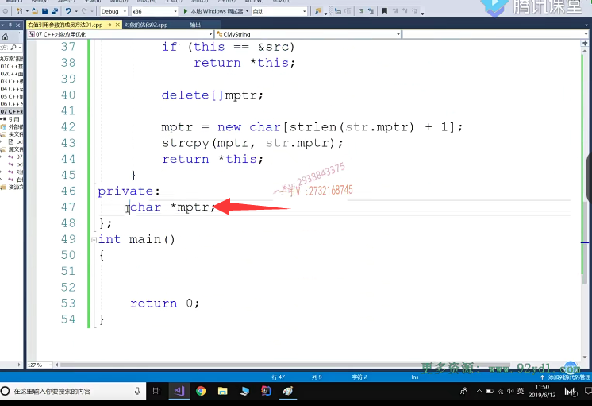

## 不会构造一个底层字符指针为空

这跟之前写的一样，回忆一下指针，如果不为空。根据呢，外边呢，传进来这个字符串。计算了一下有效字符的个数，再加个杠零，你有一块内存，然后进行数据拷贝，字符串拷贝。当外边儿指针为空的时候呢，我也给我底层的这个指针，你有一个空间的大小啊，你有一个叉类型空间的大小，

然后给它赋成杠铃。

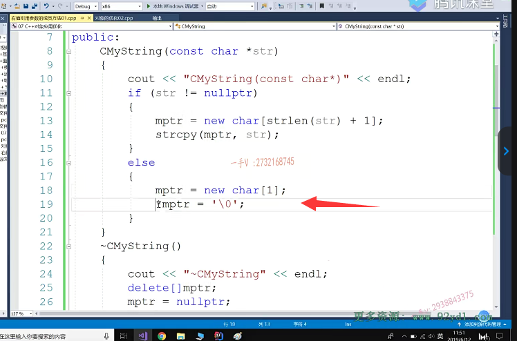

啊，也就是说我保证呢，通过我的这个构造函数构造起来的字符串对象呃，底层不可能为空，所以在其他方法写的时候呢，就不用判断字符串为空的情况。啊，因为我是不可能构造一个底层，这个字符指针是空的，这么一个对象。

这是构造析构加打印，这是拷贝构造啊，拷贝构造同样的根据外部的字符串的大小开辟空间，然后再拷贝字符串。

这是复制运算符重载。排除字符值，释放我原先的空间，然后再根据你的大小呢啊，开辟空间拷贝数据。好，这个类大家应该是比较清楚的，对吧啊？

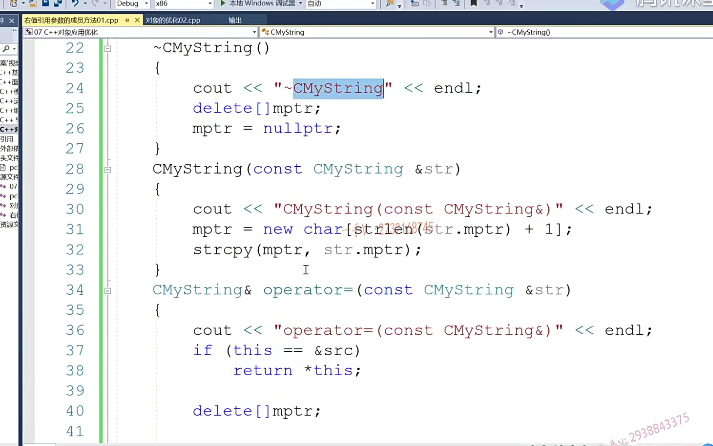

赋值

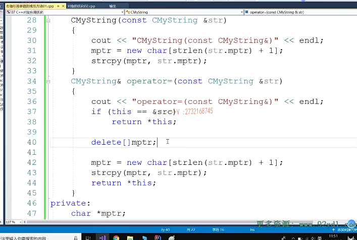

## c_str()

那么一样啊，一样我们写这样的一个方法吧。因为在外部可能想访问我这个字符串啊呃，但是呢，你可能无法直接访问哦，我们可以通过。有一个c杠STR嘛，

是不是我们CA加string也有这么一个方法呀？给他把底层维护的这个。字符串可能可以给它返回返回回去啊。

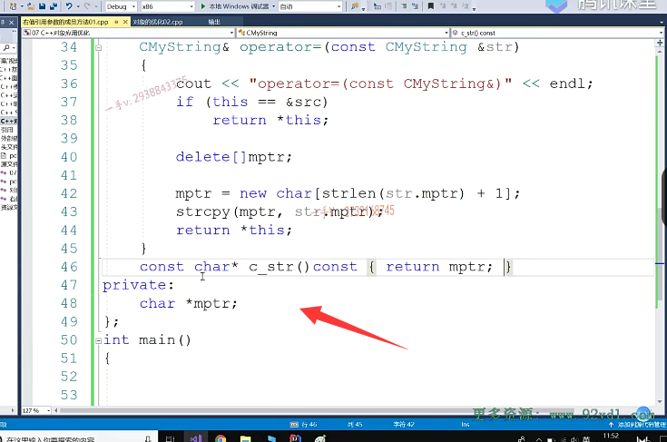

我们同样的也是写我们之前的类似的这样一段代码叫see my string。get stream.啊，那么cmy string。按引用来接收。那么，在这儿const const叉星啊pstr等于STR点c杠STR？然后呢，创建一个临时对象STR。啊，我们听成temps tr吧t STR构造起来，然后return temp STR。

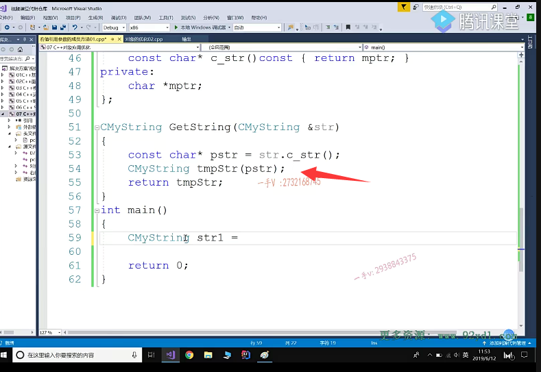

在这呢，我们先定一个cmy string STR一。啊哦，写成这个也也行，写成初始化等号也可以啊。那我们可以这样的一个对象啊。那么，在cmy string STR二默认构造对吧？然后STR二等于。get string这个函数把STR一当做参数呢，给它传进去啊，然后在这我们可以打印一下。打印一下谁呢？就是STR二底层的这个。字符串应该也是。

怎么一长串a了，对吧？大家注意啊，在实际使用中，这个字符串可能是很长很长的，我们在写一些服务器项目的时候呢，客户端跟服务器传递的这个数据呢。传递json字符串是非常非常长的，有可能是很大的，

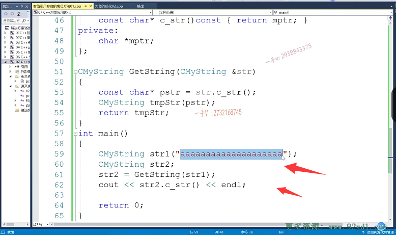

## new delete  字符串拷贝 

## 性能消耗

对吧？嗯，在这边儿说这一点就是说呢，在这里边儿我们不是有构造，有new内存嘛。析过有delete，

就是最终会free内存嘛，对吧？new内存delete free内存啊。内存的开辟。释放以及大量的字符串拷贝，也有可能不是字符串，而是其他类型的，是不是数据拷贝，所以说都是属于对我们代码来说，都是属于性能的一个消耗啊。

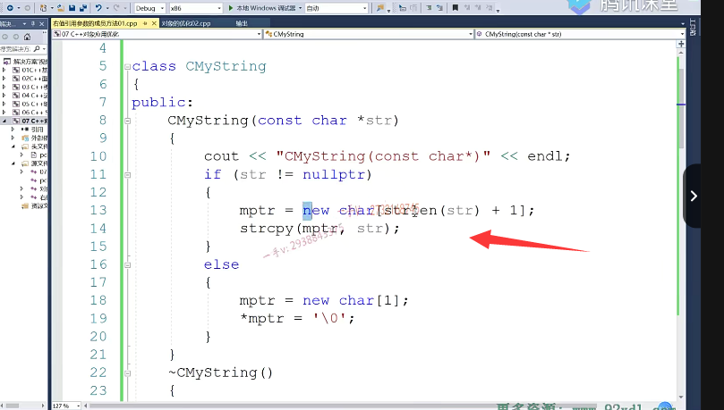

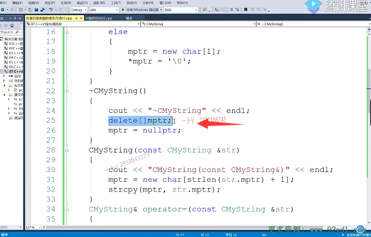

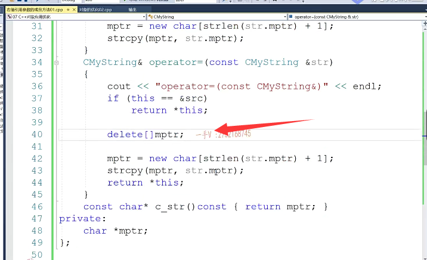

## 特殊情况

我们来看一下。那么在这里边。大家有可能说那好办吧，我们上节课不是说了三个吗？你看这个实参到形参按引用来接收这个，

我们是一般都要做的。但是有的时候啊，在这里边我们可能由于解决的问题，==场景呢，比较特殊，我们无法返回一个临时对象。或者在这儿，我们也只能以一个赋值的这个方式呢，来接收返回对象的这么一个函数的调用的返回值。==是不是啊？

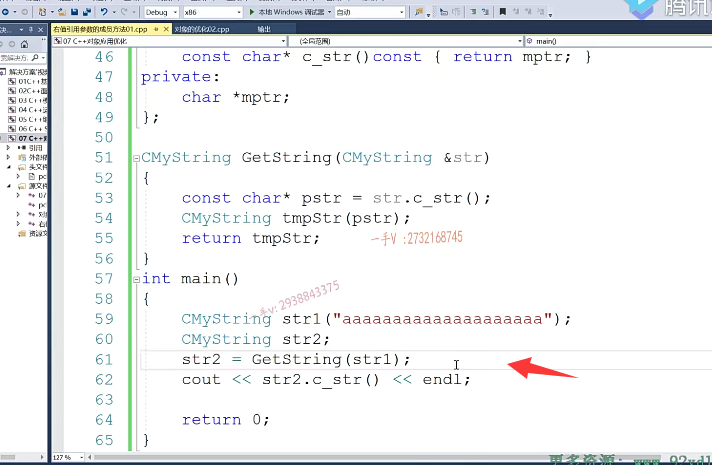

## 分析

那如果代码是这个样子，我们来先分析一下啊，以前边儿学过的知识来分析一下它的这个背后的函数调用是什么？

首先，这是一个构造，

这是一个构造。实参到形参没有产生对象，这是一个构造。对吧啊，我们。画一下吧啊，我们画一下吧。画一下，大家看的清楚一点啊。

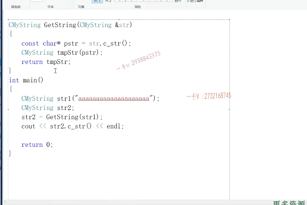

首先这儿肯定是第一个构造了，这是调用的这个。普通构造就是带叉形参数的，是不是构造函数啊？

对这个第二个肯定也是一个普通构造啦。啊

普通构造普通构造第三个十三道形参没有哎，这里边儿这个第三个这也是一个普通构造。

然后再看第四个。

大家现在应该知道啊。这个tmp STR呢？这个对象啊？这样四个字节里边有一个叉形指针嘛。这个指针呢？是不是指向了外部的一个new出来的堆内存啊？

诶，对内存对内存里边呢？是不是放的就是里边所存储的字符串啊？

你可以想象一下，这个内存是很庞大的啊。那为了带出来，

把这个返回值带出来，==这里边儿不可能返这个函数，不可能返回指针或者引用，因为这个对象是一个局部的对象==。

## 第四个只能通过拷贝构造函数

对吧，所以在这我们只能是干嘛呀？诶，通过拷贝构造函数。通过拷贝构造函数。也就是第四个。是拷贝。拷贝构造函数的调用。在这儿生成一个新的，是不是对象啊？字符串对象那么拷贝构造函数做什么事情呢？

## 拷贝构造做了哪些事

大家看看看你的拷贝构造做什么事情？先根据STR引用对对象的尺寸呢大小开辟空间，然后再拷贝数据，那也就是说呢？

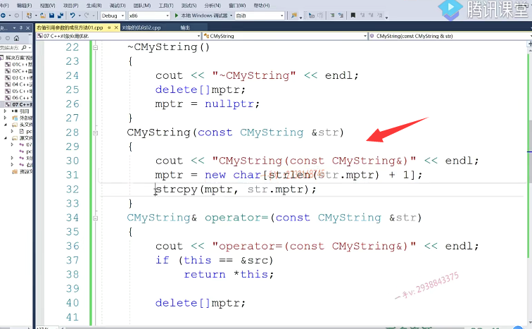

先根据你的大小。开辟空间。然后再把你这数据呢，一个一个怎么样？拷贝过来。对了吧，这就是我们拷贝构造是不是做的事情啊？

你别我们举的例子是用字符，你觉得字符拷贝很简单啊，那么实际上这任何类型都有可能。关键是很头疼的一件事情是什么呀？

大家看啊，这费了很大的劲啊。费了很大的劲main函数栈帧上的这个对象呢，按照你这个mtm pst二的尺寸呢，外部资源的尺寸也开辟一块儿资源。然后把数据拷贝过来，关键是刚拷贝完了。

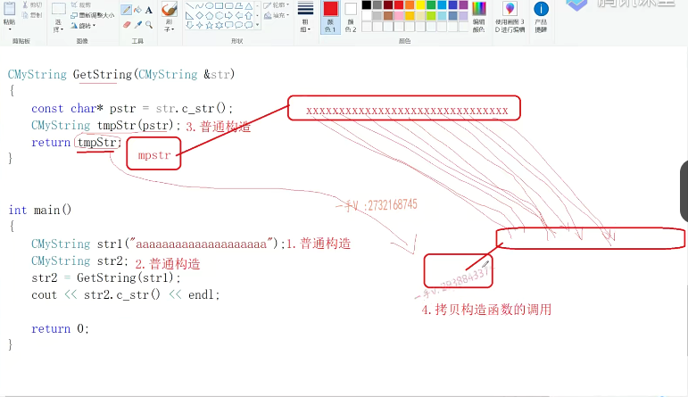

但是出函数会发生析构

第五个，你说你不要了。你说你不要了，你说我不要了。就析构是不是tmp STR啊？

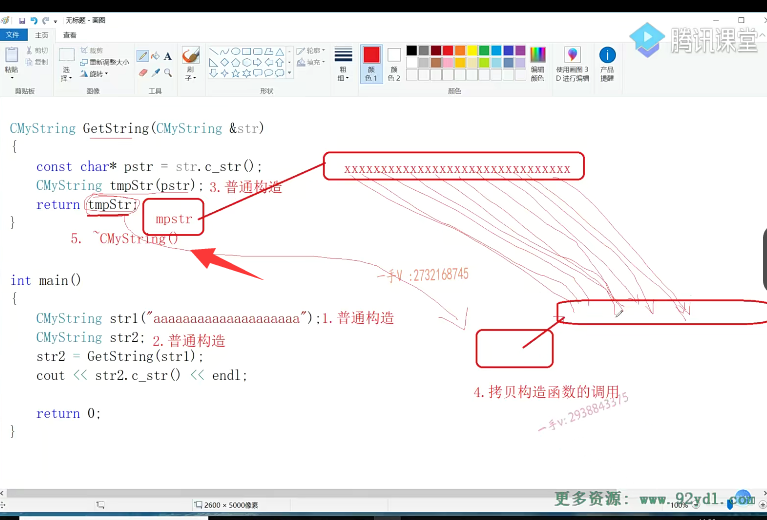

这就好比什么呢啊，这就好比什么，

这就好，这就好比呢啊，我们两个人之间唉，我说你那个东西挺好挺好玩儿的，或者挺好用的。啊，你说你那你你那东西呢？在哪儿买多少钱是吧？啊，一个一千块钱。啊，那我在网上也花了一千块钱买了同样的一个东西，哎，我也想用。但是我刚买回来以后呢，

你却跟我说哎，你早说嘛，早说你想要的话，我直接给你，我不用了，你看你这是不是？白让我是不是耗费资源，耗费精力了，这就相当于这儿这儿这儿一样。

在内函数真正是这个临时对象呢，根据你tmp STR呢来开辟的这个空，这个空间大小开辟空间，然后再把数据。费了费了很大的劲儿，拷贝过来，

你这个连日你这个tmp ST二这个函数的局部对象。却说你这个资源不要了，因为你该吸购了，吸购的时候做什么事情啊？哎，吸购的时候呢？它把它指向的外部的这块资源呢？这个释放掉。

## 能不能把资源直接给我呢

那你早知道这个样子，你不如直接把你的东西给我不就完了吗？省的我还要花钱，我还要花费精力，是不等还取快递之类的。对了，没有啊，

我就不用自己再买一份儿了，也就是说呢，你能不能你你要不要你早说你早说的话，把你的资源是不是直接给我啊？没问题吧，或者说是咱也如果不用给，这是堆上的空间嘛，你让我直接指向指向这个，再把你这个指针给你制成空。比如让我指向你，别指向了。这多好，然后你析构的时候，因为你是空指针delete或者free空指针什么也不做，是不是？

那你就算交代就就算完了。这个资源呢？还在这。这多好。

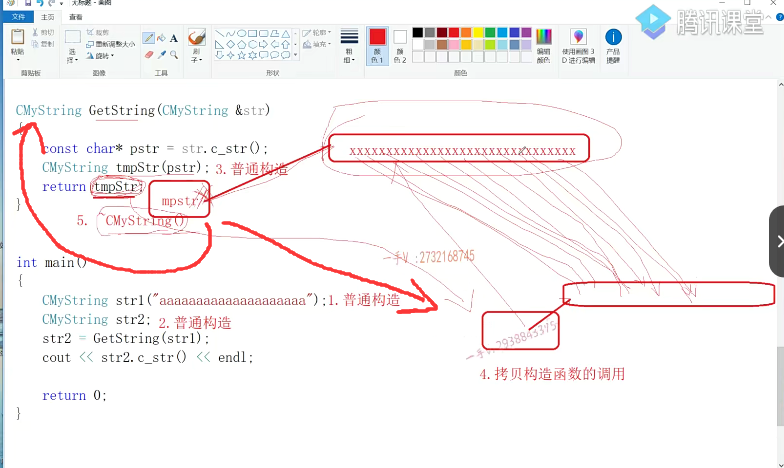

## 我们想让拷贝构造做这个事情

但是不可能。我们现在我们现有的这个拷贝构造呢，做的事情呢，它做的就是这件事情，其实我们想让它做什么事情呢，我们想让它做这个事情。ptr等于STR点mptr，然后再把STR的mptr呢？这mptr再制成一个n。我们想让他做这个事情。

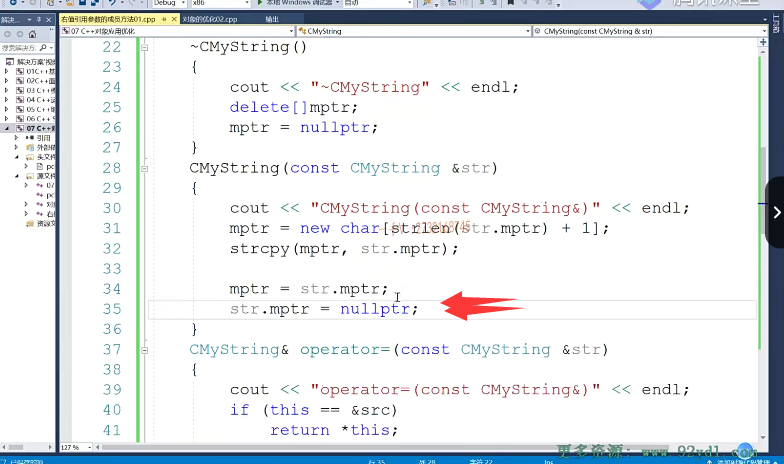

能不能理解意思啊？

你看我们写到这啊，我们写到这。

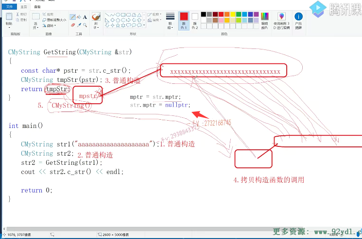

我们写到中间来。把这个放大一点。==那也就是说你现在tmp STR拷贝构造main函数战争上的这个临时对象对吧啊？你把你的这个资源直接让我指向。然后再把你织成一个空指针，那你吸购的时候什么也不做，到时候这个资源就归我了。==

那这个开销就很小啦，这个没有做任何的，没有做没有做任何的内存开辟以及数据拷贝。啊，就完全。没有内存，开辟内存释放和数据拷贝了。这些吸垢因为这个指针已经变成空的了，所以不存在任何内存释放，对吧？也没有内存开辟了这儿，你我也不需要重新按你的尺寸开辟，你不要了嘛？好，这是我们的愿望，==当然我们不可能这么改了，是不是不可能这么改了啊？==

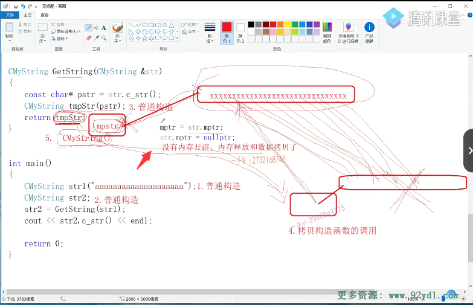

## 拷贝构造函数不能这么改

那么你要这样改的话，我们正常的啊，

正常的这个拷贝构造就没法做了，对不对？你比如说我买东西。那你那个东西你还用呢，那我只能是我新买一份儿了，按照你的这个物品，按照你的价格是不是重买一个了，因为你也要用，我也要用，所以。这外部资源，这俩个人有个人的一份儿啊。所以呢，这个普通的拷贝构造函数，你是不能这么改的。

那到底怎么样才能达到这个效果呢？我们后边再说，我们先把问题呢给大家列出来啊好。

这是这次拷贝构造的调用，对吧？然后这个函数呢？运行完了以后，第五个就是这个tmp STR的析构。

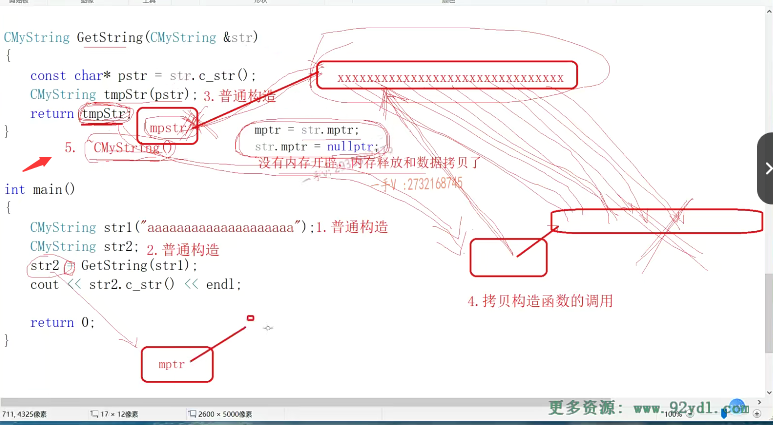

然后在这里边儿大家来看。这是一个赋值，这是一个赋值。用临时对象给我STR二赋值。STR二呢？大家知道啊，它是一个已经存在的对象，

对吧？它是一个已经存在的对象，那么它里边儿也有一个指针就mptr。那么，它呢？原先呢？可能也指向了一块儿什么？一块儿是空间啊？对于负值来说，怎么做的嘛？==首先排除自赋值，==当然这个临时对象跟我。STR二不是一个对象，所以自赋值排除了，然后呢，

把我原先的空间呢给释放掉。释放掉以后呢？

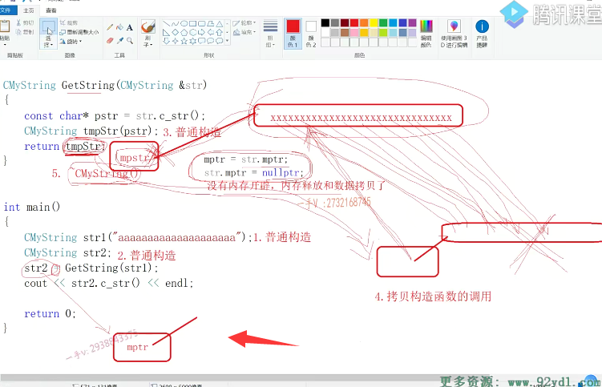

## 又是按照临时对象字符串的大小开辟空间

哎，再按照你看还是你的你的赋值按照呢STR引用对象的尺寸呢？开辟控件，然后再拷贝数据。也就是说呢，在这里边儿又是按照临时对象外外边儿的这个字，符串的大小呢，开辟空间。

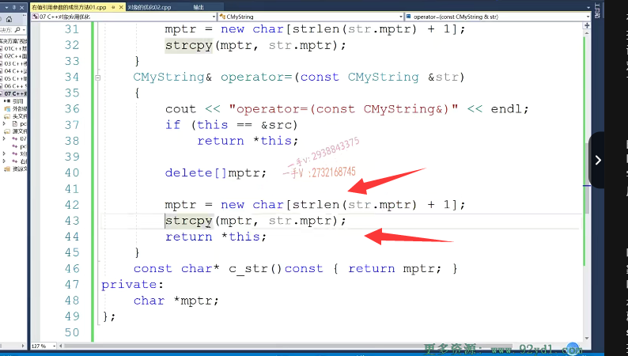

## 按照临时对象开辟好另一块内存后，临时对象的空间又释放了，那为什么不直接把临时对象空间直接给我们

开辟空间了，以后呢，这一块儿的数据一个一个的全部拷贝过来，全部拷贝过来。关键是费了半天的劲啊，我又是STR，又是开辟外部资源啊，又是拷贝数据啊。拷贝完成以后出这个语句，你说你这个临时对象虚构了虚构，是不是就要把它外部资源全释放掉啊？刚给STR赋完值，你说你不要了。你看你这不是瞎折腾吗？对吧，你要早知道你不要了，你把sta就是这个临时对象的外部资源直接给谁呀？直接给stn二不就完了吗？是不是然后再把你临时对象这个指针指掌控你虚构啥也不做，所以在这里边儿也不会涉及到什么内存，

开辟内存释放的数据考虑。多好，能不能想来？能不能想来

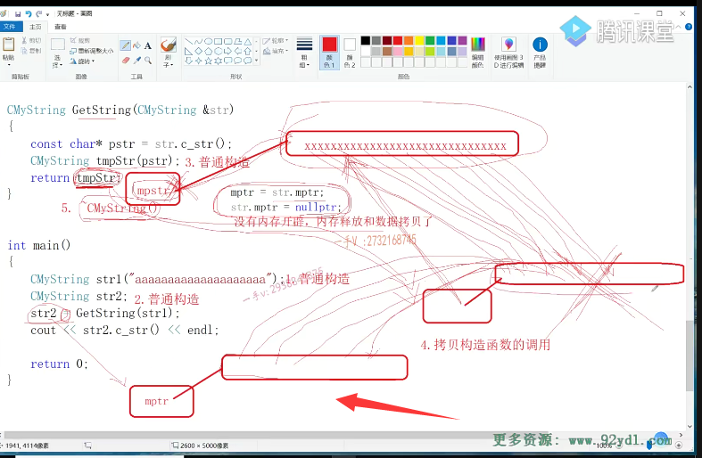

这里边啊？给STR赋值呢？按照你的代码，现在的逻辑呢？啊，又涉及了我STR，要根据你临时对象外部资源的尺寸开辟空间，要拷贝数据。关键是拷贝完数据出语句，你这个临时对象析构这个资源要释放。啊。

## 第六个是赋值操作

## 第7个是析构临时对象

所以第六个呢，就是赋值操作。第七个呢，就是析构，析构临时对象对吧，

## 继续析构str2，str1

然后第八个。第九个也都是细构啊，分别细构STR二，细构STR一。

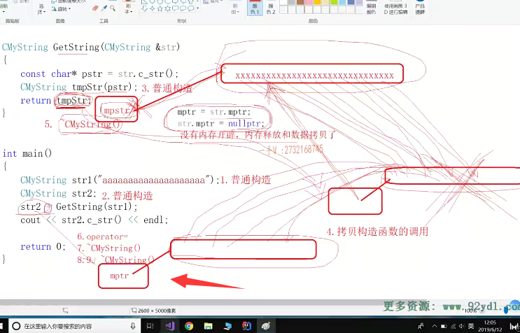

## 有一处错误

咳咳。我们来看一看这个最终的这个打印过程啊，是不是这个样子的？好。嗯，嫌我们这个函数不太安全是吧？不太安全的话，

我们把这个sdl检查呢，给它关闭掉啊。好，这里边还有啊。那么，未声明的标识符啊，这不是src，这是STR。

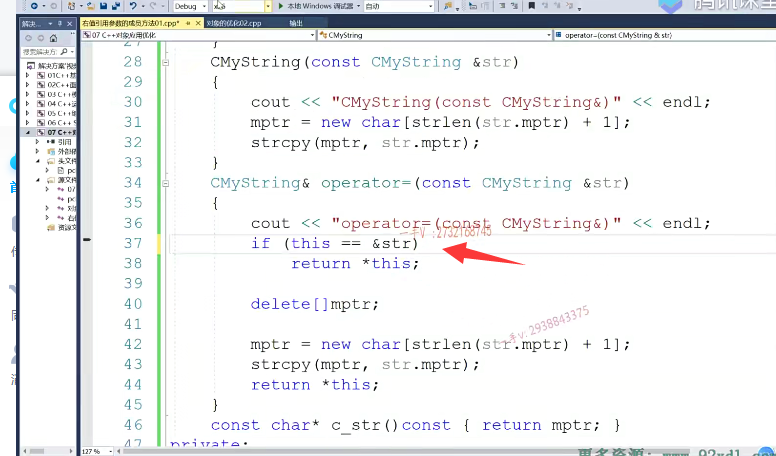

## 还有一处问题

## 默认构造没有，需要给默认值

这个没有合适的默认构造函数对吧啊，因为这带一个参数没关系，给它一个默认值就行。

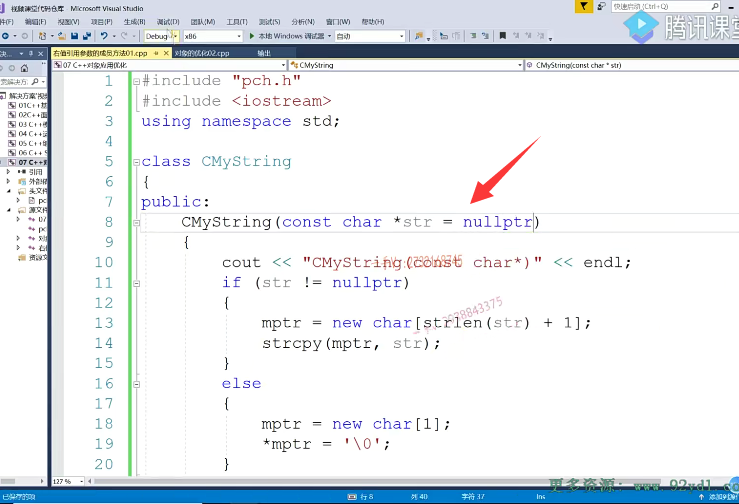

## 运行

好在这我们来看一下啊，我们来看一下。

这个函数的调用过程。先是调用构造，

这是构造STR一再调用普通构造，

这是构造STR二再是调用普通构造，

## 局部对象的构造

==这是构造我们这个get string这个函数的局部对象tmp STR==。

## main函数栈帧上临时对象的拷贝构造

==这个拷贝构造就是我们这里边儿tmp STR拷贝构造main函数栈帧上的临时对象==，因为tmp STR是这个函数的局部对象。它是出不了这个函数的，对吧？所以要得到这个函数get string，这个函数的返回值呢？是一定要在main函数栈帧中产生一个临时对象来接收这个函数的返回值。

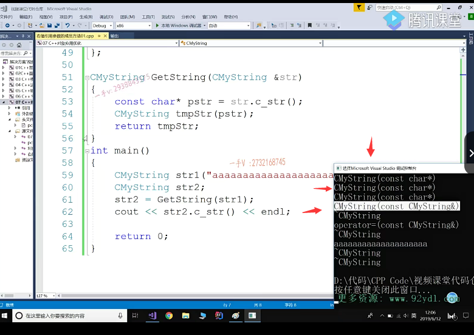

## 临时对象的析构

好了，那出这个函数作用域谁要析构啊？这个tmp STR临时对象要进行析构，

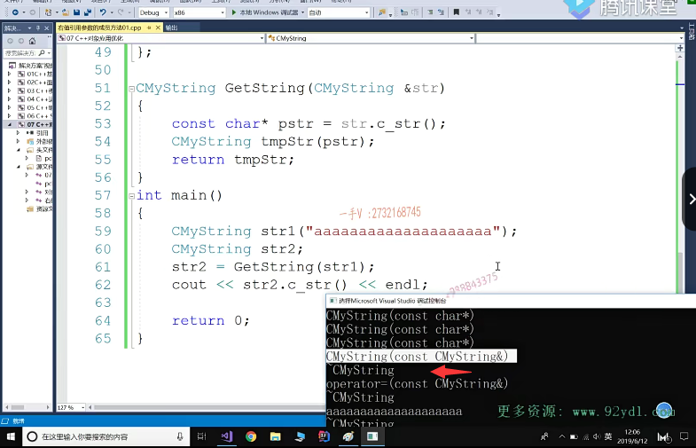

## 栈帧上临时对象拷贝完，就析构，效率很低

## 栈帧上出现的是临时对象

这就是我们刚说的。你这个拷贝构造呢，是在我main函数栈帧上产生临时对象，我临时对象呢，根据你tmp STR占用的堆上资源的这个尺寸。开辟空间拷贝数据。刚做完，你却说你不用了，你吸够你吸够的时候把你外部的资源是不是全部释放掉了对？没有必要啊，没有必要确实效率太低了啊，如果外部资源占的空间特别大，数据也特别庞大的话，这里边儿。光在我们函数调用过程中返回对象，

那这个造价已经是相当相当大了，那效率不能说啊，效率绝对是。非常低了啊，不能说你效率高了啊。

出来了以后，临时对象是不是给STR赋值啊啊？刚赋完值我STR STR费了半天劲，根据你的临时对象的尺寸开辟空间拷贝数据。啊，刚拷贝完，你却说你不用了，对吧？这是打印啊，那数据倒是拷贝过来了，

最后呢，再是析构STR二析构STR一。

## 临时对象析构

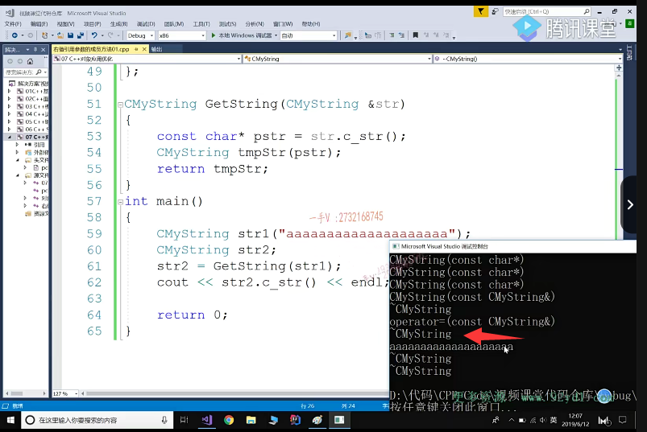

## str2 str1析构

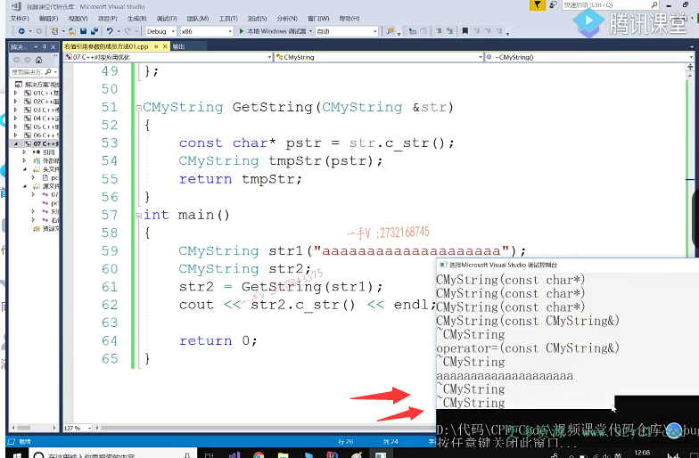

## 对于临时对象的处理是不是能简单点

这个函数调用呢，我们倒是没看出什么问题来，对吧？跟我们之前学的是一模一样的，关键呢就在于哪哪两个呀，就在于这两点上。这两个上。效率真的是太低了啊，效率是太低了，我们把这个拷呃拷贝下来吧啊，给大家放到这里。放在下边。这个是tmp STR。

拷贝构造内函数占帧上的临时对象。的临时对象啊。这个是内函数战争上的临时对象给。t二是不是负值啊？这两个操作都涉及了一个东西，就是临时对象。啊，临时对象。那么，对于临时对象，我们处理是不是应该可以简单一点啊？

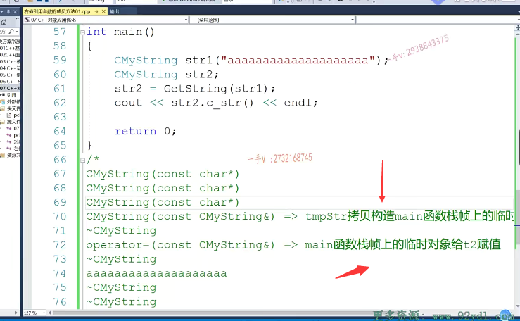

## C++11里边给我们提供了带右值引用参数的成员方法

因为临时对象是马上就要结束生命周期的对象。我们何必还要根据临时对象所占用外部资源的尺寸，给我当前要产生的对象或者赋值的对象。开辟空间拷贝数据。

刚做完，你临时对象。又不需要了。那么，到底如何去做这样的临时对象的优化呢？啊，那我们C++11里边给我们提供了。所谓的带右值引用参数的成员方法啊，那我们这节课还是同样的，先给大家把问题罗列出来，下节课我们来给大家讲。

==我们对于这个东西呢，该如何去做优化==？好，这节课先到这里。