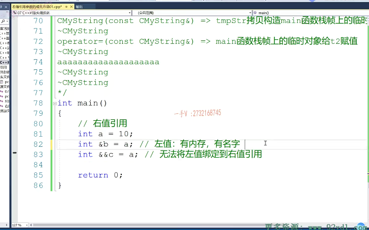
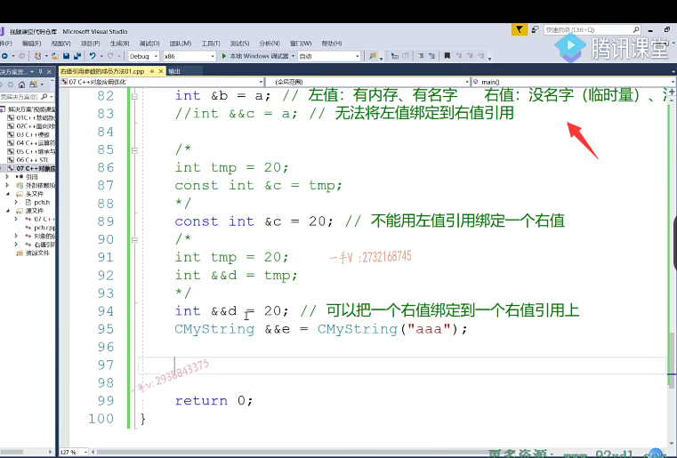
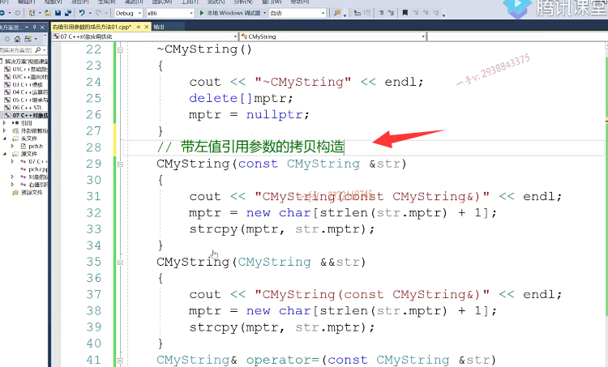

## 回顾和复习右值引用

大家好好，我们这节课呢，就来继续讨论这个CMS啊，这个类型呢，我们在刚才写的代码过程中呢，它的一个优化。该我们该怎么做啊？那么在说这个优化之前呢？我们得再回忆一下这个所谓的右值引用。啊，右值引用。幼稚应用呢，我们在基础的课程里边啊，已经给大家讲了一个就是。右值应用的概念对吧啊？

如果呢？记得不太清楚呢？希望回过头去再看一看，或者说是我们在这儿简单的复习一下啊，

## 左值的定义

## 右值引用无法绑定左值

## 左值无法绑定到右值

我们定义一个变量。我们定义我们所谓的左值引用啊，左值引用就是这个什么叫左值呢？左值呢？就是有内存。有名字啊，我们通俗来讲，但不一定是这个样子好吧，有内存有名字，你比如说呢，我们a。

是有内存的。有名字的嘛a嘛，对吧？我们就用左直引用来引用它，这是没有任何问题的，我们编译一下。这是编译成功OK吧，但是呢，你能不能在这画蛇添足的？唉，用一个又指引用来引用a呢？我们来变一下。我们看一下，没有成功失败，一个在这儿无法从int无法将左值绑定到是不是右值引用啊？

因为人家认为a是一个左值诶。a是一个左值对吧？在这我直接呢把这个。打印呢？错误打印给大家写到这无法将左值呢？绑定到这个右值引用上。明白了吧，就是这是我们左直引用啊，这个是左直引用这个叫右直引用，右直引用是来绑定右直的，左直引用是来绑定左直的。

## 右值的定义

## 没名字，没内存

那什么叫右值呢？右值是什么？右值呢？你就可以认为是。

没名字没名字那一般。临时量是不是都没名字呀啊？临时量都没名字，那另外一个就是没内存的啊，没内存。没内存。这个都是一个或的关系啊。货的关系没名字，没内存。

## 不能用左值引用绑定一个右值

那么，这个是错误的，我们把这个注释掉。好了，再来看你能不能用一个我们？的这个引用变来引引用一个20呢，

那20是一个左值还是右值？20有没有内存？没内存，它是在寄存器当中，那当然，它也没有名字了，对吧？所以呢，它是一个右值，用右值的话，你不能用左值引用来绑定一个右值。啊，不能用左值引用来绑定一个右值。大家来看，无法从int转换成是不是int引用啊？

没问题吧啊，好，这是不行的啊，不能用。这个左值引用绑定一个右值。

## 怎么解决？使用const

是不是所以这个也是不行的啊？不行的那怎么办才好呢？const.用const int引用啊const int。这是我们之前给大家讲过的，是不是？啊，那用const为什么就好了呢？那在这儿呢？

## 分析原因

因为呢，他做了一件什么事情啊？

唉，它是呢先生成了一个临时量，存了20，

然后再用这个什么东西啊，常饮用是不是引用了这个临时量啊？好

## 右值引用可以绑定右值

## 并且好处是可以通过右值引用变量来做修改

那么对于我这个来说。引用d。幼稚应用。又幼稚引用引用一个幼稚就把一个幼稚呢绑定到一个幼稚引用上，那是没有任何问题的。是没有任何问题的啊，没有任何问题。成功那就是说可以把一个右值右值。

绑定到一个右值引用上，从名字上能看出来吗？右值引用，右值引用，我就是引用右值的。很明显，这个好处是比跟上边儿比上边儿，你不能通过这个引用变量来修改临时量的值啊，但是呢，我这个是可以的啊，

## 汇编分析，其实2者做的操作是一样的

那么其实呢，我们一看汇编代代码呀，汇编指令你会发现呢，这是一模一样。的这个这俩操作是一模一样的，

也都是产生了临时量，把20存下来，然后这个引用变量d呢。应用的是这个临时量，但是呢，通过这个d是可以改临时量值的啊，这个是不行的。

## Cmystring临时对象无法绑定到左值引用

对了吧，还记不记得我们前边儿给大家说的呀？就是我们这个，你看see my string。引用应该到e了，能不能引用一个我们的临时对象呢？c买s。aaa你看一下啊，

我们看看这个操作可不可以？无法从CMS阵转换成这个啊，非常量引用，只能绑定到这个左值是吧？呃，那么注意。这是不行的。

## 右值引用绑定临时量

这其实在我们以前的这个编辑器上都是没有问题的啊，都是没有问题的，

==但是我们现在这个VS二零一七完全支持C++11标准嘛==，对吧？呃，再测一下幺幺里边，我们引入了右值引用，你既然引用了右值引用，

你就得跟左值区分区分。看看这个有名字没？

==这是一个临时量，对于临时量来说，我们我们编译器呢C加加编译器把这个临时量都当做右值==。来处理的啊，都当做右值来处理的。所以在这里边啊。我用一个幼稚引用来引用。你看这个就可以啦诶，用幼稚应用来引用，

## 常引用

或者是用什么呀，或者是用const常引用。也是没有问题的，

## 可以看看汇编指令

## 记住两句话，区分左值和右值

那在这里边儿呢，大家尽量就用我们k幺幺幺的这个釉质饮用啊，釉质饮用。这跟上边儿是一个意思。这都是右值临时量，都是右值好吧，临时量是右值啊，在这边一定要注意一下。那么，这是我们简单的说了一下，左值跟右值啊，大家其实呢，可以呃。

你就像这两句话啊，像这两句话呢呃嗯，是哪两句呢？这两句这两句啊，这两句。他们的这个汇编指令都是一模一样的，大家如果呢呃，可以的话，希望大家能打个断点，在这儿把他们指令看一看，也能更深入的去了解一下。啊，更深入去了解一下我们编译器呢，把什么当做左值，把什么当做右值，

我们可以通过这里边儿的这两句话呢，进行一个区分。好吧啊

## 右值引用变量能不能引用一个前面定义的右值引用变量？

## 不能

那么在这儿还得注意一个啊，怎么注意这么一句话呢啊？因为这是我们后边儿都要用到的，后边儿都要用到的啊。

那就是说呢。你看啊，这是一个我们的这个右值引用变量对吧？那右值引用变量。cdef到f了，那我能不能再定义一个右值引用变量？来引用一个。

前面定义过的右值引用呢？啊，无法从int转换成int的右值引用

## 右值引用变量本身是一个左值

## 有名字，有内存

## 得用左值引用来引用他

那也就是说这句话你记住啊，这句话那就是一个右值引用变量。本身是一个左值。人家这个相当于底层也是一块儿内存嘛，是不是底层也引引用的是一块儿内存，人家有有内存有名字，名字就叫做d嘛。人家是一个左值嘛，有内存有名字就叫做d嘛。好了吧啊，就叫做d嘛，

所以呢，这d虽然看着定义的时候是一个右值引用变量，对吧啊，但其实本身它是一个左值。所以你不能用另外一个右值引用表来引用它。得用左值引用来引用它。

# 总结

好吧啊，希望大家呢，对于优质引用啊，认识一下，那么从这几个代码示例呢，我们想给大家说说这么几句话，

首先第一句话就是我们刚说的。一个右值引用变量本身，它是一个左值，也就是说右值引用变量左在等号右边儿的时候呢，

左边儿只能是一个左值引用变量才能引用它。因为右值引用变量本身人家有内存，有名字，是一个左值。像这种常量数字，临时量这东西都是幼稚，你要去引用他们的话呢？就得用幼稚引用了。好吧，就这两句话。常量数字临时量都属于右值，需要用右值引用来引用，而右值引用变量本身呢？它是一个左值，因为它有内存，

有名字。需要用一个左值引用变量来引用。okay，那么我们把幼稚应用呢？我们简单的说到这里啊。

## 回顾CMystring 

## 带左值引用的拷贝构造

然后呢，我们反过头来，我们看一下我们刚才所说的这个c买string啊，所说的这个c买string。现在大家来看看啊，我给它提供了。相应的，这么一个方法，这是普通的拷贝构造。诶哎，

我提供了这么一个东西。这是带左值引用参数的拷贝构造。

## 带右值引用的拷贝构造

这个呢，是在右值引用参数的拷贝构造。那在这我打印一遍，需要改一改啦。好了吧，那在釉质引用参数的拷贝构造，

那同学们那你应该明白STR。诶，引用的就是一个。它把普通的对象啊，肯定是给我匹配到这个左值引用了，因为普通的对象人家有名字有内存嘛，是吧？

## 与临时对象有关的拷贝构造就会匹配到带右值引用的拷贝构造

是不是那么什么对象会给我匹配到这个上面啊？没名字的，或者是没内存的。是不是就可以匹配到这个上面了，在右值引用参数的拷贝工作函数上。临时对象嘛，刚才说过了嘛，临时对象嘛，临时对象。没名字嘛，是不是哎？没名字没名字，所以呢，编辑把它处理成这个右值了，所以当我们在这里边儿想用一个临时对象给一个对象拷贝构造的话。

## 临时对象马上就要没了

啊，或者说是。其他情况对吧啊，就是跟临时对象相关的。那在这里边儿就会给我们匹配到带有幼稚应用参数的拷贝构造。这个事情了。我们就不这样做了。临时对象吗？你马上是不是就完了，马上就没了。对准没有啊，马上就没了

## 编写带右值引用的拷贝构造函数

## 就是把临时对象资源给我

那么在这儿你看我做的事情呢，就是把你的资源直接给我，然后再把你制成什么呀？

置成空呢，这一句一定要有啊，这一句一定要有，要不然呢，你这样做的话就成浅拷贝了，是不是让两个对象的指针都指向同一块资源了？啊，他们析构的时候呢，后边儿析构的那个就成释放野指针

## 没有了对临时对象内存资源的拷贝

那这块儿什么意思？这块儿就是我们在这里边儿，你看刚才tmp ST 2就是一个。临时对象嘛啊，出这个函数就没了，是不是啊？

它相当于呢，就是我们刚才说的把这块儿资源直接让我这个幂函数战争上这个临时对象指针指向。然后呢？把你的这个。mps tr制成一个空。也就是说没有这里边儿的内存开辟，跟数据拷贝啦，这儿都没啦，这儿都没啦。都没了效率，还是很不错的，

## 带左值引用参数的赋值重载函数

对不对啊？好，那么这个是在左值引用参数的。赋值重载函数。

## 带右值引用参数的赋值重载函数

啊，我们再来提供一个。

## 临时对象也是马上就不要了

打印也改一改。那这块就不要这样做啦。不用再根据我们STR引用对象，因为它现在呢，这个是带什么呀啊？带右值引用参数的赋值重载啊，赋值重载函数说错了，哪种对象能够给我匹配到这个右值引用的这个形参变量上，当然是临时对象了嘛，临时对象。

马上你就不要了，不要那我就不不必要，没有必要这样做了。

## 编写带右值引用参数的赋值重载函数

## 去掉自赋值的情况，先把原来的释放掉，然后得到临时对象的资源，然后把临时对象指针置为空

## ==返回时，通过拷贝构造在main函数栈帧上生成临时对象==

我直接把你的资源怎么样啊？诶，我直接把你的资源拿过来就行了。把你的资源拿过来，然后再把你制成一个空。

没问题吧？那也就是说在这里边啊？当我们用这个临时对象。给STR 2赋值的时候呢，我STR把原先的空间释放掉，然后直接怎么样啊？

然后直接呢，是不是让我这个指针让我STR指针是不是指向这块资源啊？然后再把呢临时对象的这个指针呢，赋成一个nullptr。那相当于就没有这个指针了。

## 画图分析

## 让str2指向临时对象的指针指向的地方

没问题吧？那也就是说在这里边啊？当我们用这个临时对象。给STR 2赋值的时候呢，我STR把原先的空间释放掉，然后直接怎么样啊？

然后直接呢，是不是让我这个指针让我STR指针是不是指向这块资源啊？

## 临时对象指针赋成nullptr

然后再把呢临时对象的这个指针呢，赋成一个nullptr。那相当于就没有这个纸腔了。大家看这个啊，在函数调用过程中。我这块儿资源呢，原封不动，一直被别人直来直去，最终呢，漏到我STR 2头上了。在返回过程中，不像我们刚才有那么多无效的内存，开辟内存释放以及我们数据的拷贝。

所以这个相当于在函数返回过程中啊，接收函数返回值的过程中。没有做过任何的，其他的内存开辟内存释放数据拷贝效率相当的高了。啊，相当的高了，

## 运行结果

## 同样的代码，只是添加两个函数

大家看看。这是构造STR 1，这个是构造STR 2，

这个是构造ST tmp STR，

## 这个tmpstr调用拷贝构造的时候，tmpstr作为临时对象

这个你看啊，跟刚才不一样，刚才是匹配了带左值引用参数的拷贝构造

现在直接给我匹配到带右值引用参数的拷贝构造，为什么？因为这是个临时对象tmp sr。

你这个对象拷贝构造完，它是不是就不用了唉，直接在我main函数栈帧上拷贝构造临时对象的时候呢？直接就匹配到我们带右值引用参数的拷贝构造了做的事情呢，你看就是像刚才那个指针指向这儿。对吧，没有做其他的内存，

开辟数据拷贝。

## 析构tmpstr

然后析构tmp，析构tmp，析构tmp，因为右值引用参数的已经把tmp的底底层指针制成nullptr了，是不是所以析构的时候它相当于啥也没做？

## main上通过拷贝构造生成的对象也是临时对象

啊，看底下的这个赋值内函数站，这上临时对象给STR赋值的时候，你看直接匹配上了带釉质应用参数的赋值。所做的事情呢，也没有按照你临时对象的尺寸开辟空间拷贝数据直接呢。把你的资源让我指向了，把你制成难。对吧，

你临时对向西购的时候相当于啥也没做，空指针嘛delete或free空指针没有任何没有任何操作，

对不对？空操作最后再析构STR 2，析构STR 1。大家结合着这张图。就这么一块内存构造tmp stm的时候，在外部申请的这一块内存。函数调用接收函数返回过程，这返接收这个函数返回值的这个过程中啊，这块儿内存就没动过。也没有其他地方涉及内存，开辟内存释放以及数据拷贝没有效率，非常不错。所以呢，

这也就是我们说在这个问题中，我们引入的这个带右值引用参数的这个拷贝构造和带右值引用参数的这个赋值重载。给我们带来的效率的一个提升啊，给我们带来的效率的一个提升。

## 总结

希望大家在这里边。啊，能够注意一下啊，能够注意一下。好好理解一下。好那。这节课呢，我们先给大家说了一下啊，先说了一下我们如何通过啊，

给成员方法。提供相应的带右值引用参数的这个版本来提升我们在临时对象操作的过程中啊。我们代码的一个效率问题。

我们CA+stl里边儿容器呢？里边儿的常用方法啊，基本上啊，除了带左值引用参数的，

基本上都提供了带右值引用参数。甚至这两个可以合并，

## 可以通过模板来实现带左值引用和右值引用的拷贝函数和赋值重载

直接通过模板来提供一个就行了，那我们在后边儿的这个课程中给大家说啊，给大家说如何去做？

==那么，这节课就到这里下节课呢？我们还有两个问题点，围绕着CMystring的一个。笔试面试啊的这个考点，我们到时候下节课一起呢，给大家说一下。好，这节课我们就先到这里。==

# 总结：

有2个临时对象，局部变量tmpstr在调用拷贝构造生成时，它是临时对象，匹配带右值引用的拷贝构造

main栈帧上生成的对象也是临时对象，匹配带右值引用参数的赋值重载

# chatgpt补充

## 临时对象也是通过构造生成的，也有析构函数

