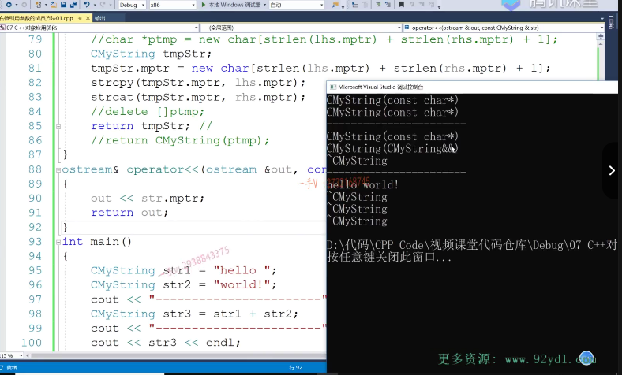
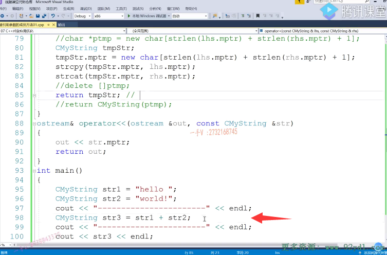

## 回顾Cmystring的加法重载运算符

大家好，那我们这节课继续呢，来说CMString。大家还记不记得呢？我们之前呢有写过这样的一个操作啊，就是Cmystring的加法运算符的重载函数啊

## operator + 函数实现

cons tc my string。lhs然后再count cmy string rhs啊，用引用来接收。那么，这个我们是怎么做来着呢？

它先是定了一个tmp new了一块内存，对吧啊？这内存多大呢？

那首先呢，是STR，这个是lhs的mptr，再加上string line。rhs的mptr再加个一，要开辟一块足够大小的空间，能容纳呢这两个字符串。

对的吧，然后呢？先进行一个strcpy，你不要把这个字符串直接接到这个字符串的后边儿，你现在开辟空间都是按原始的传进来的，这个原始的字符串的大小。

开辟空间的一个不多，一个不少啊，所以呢lhs跟lhs所引用的字符串底层根本没有。额外多余的空间，你要进行字符串合并。那么空间你必须得重新开辟。在这儿呢，我们做一个PT mp，然后在这里边儿呢，是lhs的mptr。

然后再接一个string cat PT mp，然后rhs的mptr。对吧，然后大家呢，直接写了这样子的一个操作PT mp嗯，

当然这个函数呢，我们需要定义成这个。塞马斯顿类的有缘因为访问了他的这个。私有成员变量嘛，是不是啊？

## main函数测试

好，我们来看看。你到底呢？能不能做一个正确的啊？作为正确的字符串的连接cmy strings tre=aaa呃等于hello吧？hello啊，see my string。这是STR 1，这是STR 2，等于word。然后再给一个STR 3=STR一加上。STR 2 cout一下。这个是。我们的谁呀c奥特一下STR 3对吧啊？那你要 cout STR 3

## cout str3  那么我们需要提供输出运算符的重载

## 将信息放入到输出流中返回，并定义成友元

这个还得给STR 3提供一个什么？哎，输出运算符的是不是重载啊？out count see my string。STR在这里边就用out来输出STR的mptr就可以了啊，然后再return out。在这呢，我们得定一个有缘了啊，我们得定一个有缘了好。

## 这里我思考了一下后置加加和前置++的重载运算符函数的编写

之后呢，我们现在开始运行呢，这一块代码看能不能？这个诶可以啊hello world hello world，然后我们可以呢进行字符串的连接。

## 这个重载函数的编写，每一次都会造成内存泄漏，因为我们没有delete

但是呢，你回过头来看一下这块儿，你的这块儿代码，你会发现你这个new啊，没有对应的delete。这个你又没有对应的delete内存泄露，你每做一次字符串的加法就泄露这么大一块儿内存，每做一次就泄露这么大一块儿内存。这是不行的，这是肯定有问题的。对的吧啊，那我们同学们呢？

思考一下就知道呢，

## 如何解决

## 问题分析

思考一下就知道呢，我们应该啊，在这里边没有办法直接返回一个临时对象了。啊，因为呢，这个临时对象呢，返回以后这个语句就完了，那我也没有办法，是不是去有机会把这个？tmp指向的堆内存给delete掉啊，

## 我们主动去delete ptmp

## 然后构造局部变量充当临时对象，来调用析构

所以在这儿呢，我们只能是tmp STR。只能是。把这个对象呢，先构造起来，

在这个构造函数里边呢，你看。又是又是这个样子，你看。开辟空间。拷贝数据对吧啊？相当于在我这个string cm string对象底层呢，又根据你的尺寸呢，开辟空间了，拷贝数据了，完了以后呢delete谁呀？delete PT mp，这是中括号，把这块new对应的delete我们写了。啊，

然后呢？我们再返回谁呀？return return PT mp。诶，是上面tmp STR。好吧，

## 运行结果

好吧，然后我们来运行一下这块儿的这个代码。啊，同样的可以做这个字符串的连接啊，字符串连接也是成功的。那么比比刚才好的是呢，这个new啊，对应的这个delete我们已经有了啊，我们已经有了。又对应的delete，

我们已经有了。

## 效率不高，想通过右值引用解决

好，那我们来继续看。那你在这里边这个效率问题呀。你觉得高还是不高呢？这个效率问题。不高吧，

这你有这么大一块内存？是不是你有这么大一块内存？唉，这个又。

通过这个构造tmp STR底层呢，又去开辟了一样同样大小的空间，是不是啊？不太好，

不太好拷贝数据完完了，你又不要了，是不是啊？

在这儿，所以我们这个代码，我觉得我们不应该这么写。对吧，我们之前是这么写，我们之前呢？没有涉及到右值引用。

## 直接定义对象，往对象分配内存

那么在这呢，我们来看啊，我们先定一个tmp STR，然后呢，给tmp STR的mptr呢？

去扭这么一块内存。你现在就直接往这里边拷贝呗。是不是这个样子的好，我们往这里边拷贝就行了。拷贝完了以后呢，大家看return tmp STR。

return tmp STR.那么在这里边啊，在这里边。你看一下。这个呢？最终要调用什么函数啊？这个最终呢？是不是要调用一个拷贝构造，

直接拷贝构造谁呀？这个直接拷贝构造是不是我们外边的这个STR 3啊？看一下啊。我们把这两个呢，就这句话呢，单独拿出来。大家来看一下。

嗯。在这儿呢，这个构造是构造谁呀？构造tmp STR就是tmp STR这个函数啊，

构造tmp STR就是tmp STR这个函数啊，加法运算不重载函数的这个局部对象的这个一个构造。最后出作用域是不是它还有一个析构啊？但是它的析构其实已经不做什么事情了，你看

这里主要是看这里。主要看这里。这里说明了你用tnpstr拷贝构造。我们外边的这个STR 3这个对象的时候呢，匹配的是带右值引用参数的。啊，拷贝一个总函数，

## 这里返回的是临时对象，但是是临时对象拷贝构造新对象，所以临时对象也不用生成了

## 所以就没有临时对象的拷贝和析构

所以这也相当于呢，==你把tmp stl这个堆资源呢，直接让我stl 3底层的指针指向了==。唉，就是STR 3底层的指针，直接指向这块资源了，然后呢，你把tmp stl的mptr呢，直接支成空了。

所以呢，当tmp STR析构的时候呢？什么也没做，delete 1控制帧什么也不做，==而STR 3直接使用了，享用了我们tmp STR==。底层指向的这个对资源没有涉及呢，就是在这个过程中啊，这个过程中函数返回过程中。接收函数返回值的过程中，没有设计任何的内存，开辟内存释放以及数据拷贝。效率是非常高的，

所以这也是对我们带右值引用参数的拷贝构造。的一个应用。对吧啊，说到这儿了，那我们最终呢？这个加法运算符重载函数，那我们应该写成这个样子才是比较好的。啊，效率越高也不会存在什么内存泄露啊

# 第二个

## 笔试题

好，我们再来看第二个啊，我们再来看第二个例子啊，再来看第二个例子。第二个例子呢，就是我们一道笔试题啊，

是一道这个笔试题。啊，这道笔试题里边儿呢，还涉及到了我们的一个容器的一个应用啊，大家来看一下。

我们先定一个vector啊，使用一下我们的这个vector。它是这样，它题目是这样出的啊，那在这里边。我先定了一个此准对象，用aaa这个字符串进行一个初始化。在在这里边啊，我们再定一个vector vector里边放see my strain的。啊vec呃，

由于vec我们当时讲过了啊，这个默认构造的这个vector容器底层没空间的啊，添加元素的话需要扩容，扩容的话呢？就会涉及重新构造对象，对吧？有很多这个干扰我们的打印出现，所以在这儿呢，我们先调用啊，这个reserve。啊，防止它扩容，给它先预留十个空间好吧啊，其实预留两个就行了，我们添加不了那么多。

那么vec点pushback strevec点push back啊。那么cmy string。ABB.

那人家问你啊，问的就是。这两个push back，因为你传的这个是CMystring 对象嘛。

那么，==vector底层是一个数组，它肯定要把你传的这个对象啊，在底层呢，再构造出来，在它的这个底层数组呢，再构造一个新的对象出来==，对吧？

啊，问你啊，这两个的打印是什么？

## 区分左值和右值

都是匹配左值引用的拷贝构造，还是都是匹配右值引用的拷贝构造，还是一人匹配一个呢？我们在这看一下。大家来看一下啊，看一下。

嗯，在这儿我想给大家再加个打印啊，看的更清楚一点，在这儿。我们加个。分割线啊，

大家看的更清楚一点。好，

## 第一个 在数组上拷贝构造新对象

这个构造嘛，这个构造是构造我们STR 1对吧啊？大家看一下这个在构造什么？这是拷贝构造，那STR 1就是你传的这个13 STR 1，在vector底层的那个数组啊，向量容器嘛，底层是个数组啊，在数组上拷贝构造产生一个新对象。对了吧啊。

## 先是临时对象的拷贝构造

啊，这是什么呢？这是个临时对象。

临时对象，首先呢，临时对象的构造。

## 再调用带右值引用的拷贝构造在底层生成新对象

诶，你看匹配到了底层在构建vector底层数组中，再去构建一个新对象的时候，你看它匹配到了带右值引用参数的拷贝构造，也就是说呢，把这个临时对象指向的外部的这个字符串。内存以及字符串数据bbb全部呢给到我们vector.容器底层的那个新对象，把资源直接给人家了啊，

这个临时量只是底层的这个mptr指针就被置成空了，析构的时候什么也没做。看到了吧？

## vector提供了带左值引用和右值引用的构造函数

看到了吧？唉，这就是我们说你看push back，你传了一个左直，它就给你匹配的是。普通的带左直引用参数的拷贝构造，你如果传来临时对响，这叫右直，它就匹配到了右直带右直引用参数的拷贝构造

所以呢，你在遇见这样的问题的时候呢，需要知道啊，我们该怎么答？

像我们的这个vector啊，它的拷贝构造啊。也都提供了啊，带左支引用的以及右支引用参数的拷贝构造都已经提供了啊，都已经提供了。所以呢呃，不要觉得在我们函数调用过程中返回一个容器呀，或者是传入一个容器呀呃，开销有多大其实？不大不大啊，自从CA加幺幺引入了带右制引用参数的啊，这么一个相应的成员方法。

## 移动语义概念

这相当于一种。呃，==移动语义啊，==

==移动语义把资源直接给别人，把资源直接给别人，再不会说是需要自己开启空间拷贝数据了。==

好吧啊，那么这是曾曾经出现过的问题，那么push back是怎么做到这一点的呢？对吧啊，我们之前呢也自己写过vector的这个代码push back是怎么做到这一点的？那还有包括我们的这个。

## move  forward  移动语义  完美转发

==右值引用参数里边儿涉及的两个，一个move，还有一个forward啊，移动语义函数以及类型的完美转发forward==。啊，

到底呢？又有什么作用啊？它们作用是什么？那我们这个放到下节课，我们来实实战。给大家写一个vector push vect用来解决我们今天所遇到的啊，看到的这个现象啊，看到的这个现象，它底层呢？到底是怎么实现好？那我们今天这节课就到这里。

