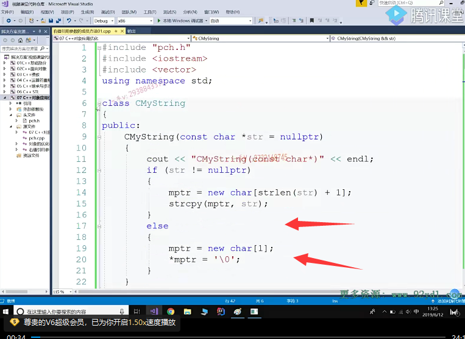
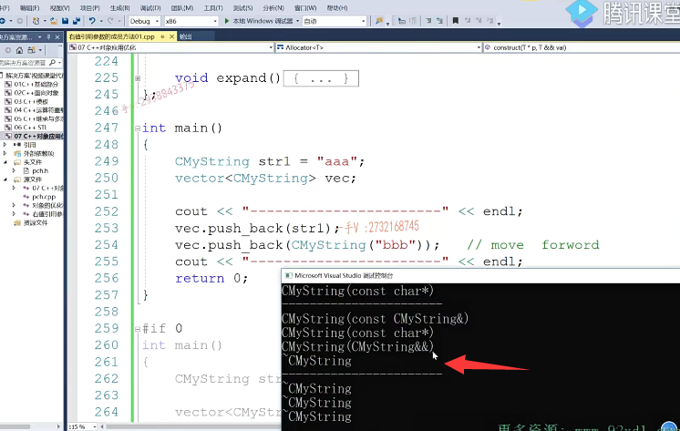
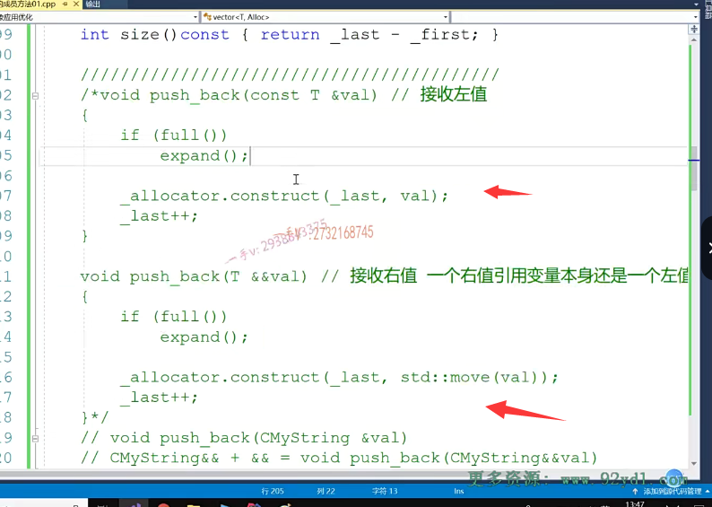
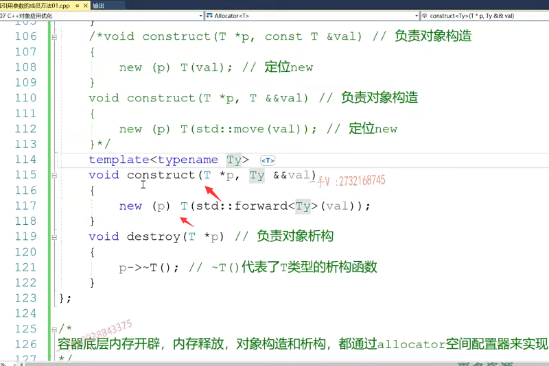

大家好，那我们这一节课呢，主要来看一下啊，我们上节课说的在我们vector容器应用过程中啊。我们的这个CMString到底在容器添加CMystring的时候呢？到底它是怎么做的？

适时的能够匹配我这个我们自己的这个对象呢带左值引用参数的成员方法跟带右值引用参数的这个成员方法啊，

怎么做的好CMstring就是还是原来的我们cm string各个函数都加了相应的打印，这个我们就不再。说了，

我们把这个直接代码合起来啊，代码直接合起来。

这是我们之前写的这个容器vector容器啊，这是它的空间配置器。

那么，它的构造函数size默认是十，相当于就是已经预留了十个大小的空间啊OK，

这是它的析构啊vector，

vector，这是拷贝构造。你看现在的拷贝构造呢，都是左着引用的，

我们应该呢，还可以给vector提供带右置应用参数的版本就不用。再按照原来的尺寸开辟空间了，右值应用参数的版本就是用一个临时的vector对象构造一个新对象，对吧啊？那么就可以直接把资源移移动过来啊，资源移动过来。我们暂时不考虑这个，

## 只考虑push_back()

我们主要考虑的就是这个push back啊，push back来，我们把这个切到最后啊。贴到最后。我们来看一看。我们的push back方法啊，push back方法。好。这是我们的扩容，都不需要了啊，我们把这代码合起来，就看这个push back。

## 解决办法

那么，首先我们第一个解决方案就是给这个成员方法呢？唉，给这个成员方法呢？添加相应的一个push back这样的一个重载方法。

上边儿呢，是接收左直引用，

这个底下呢，是接收右直的右直引用嘛，

对吧啊？这些呢，我们就先给它去掉了啊，去掉了。这个是左直左直。这是接收左支。

啊，这个是接收右直啊，这个是接收左直，这个是接受右直好吧？

啊，这个是接收啊，右值引用参数的push back对吧？那我们先来做这样的一件事情。你看在这里边push back。做的事情还是跟我们左值引用一样。

但是大家注意一下啊，注意一下这个construct啊，这我们就要越写越多了，对吧？因为库里把这些都实现了，这allocator的这个construct。

## 为空间配置器提供右值引用的构造

大家来看一下这空间配置器的啊，这个construct。专负责构造的，那你也得给它提供什么啦？这是专门接收什么的接收是不是左值的？

为他再提供一个接受什么接受右值的。您说这样每一个都要从一个变成两个了，分别匹配左支跟右支，岂不是很麻烦？

我们有更简单的解决办法。啊，通过模板来实现那么。我们先来看这个，我们普通的这个实现方法，大家逐渐的去深入的去理解它啊。

大家注意，在这里边看一下啊，看一下，看一下，跟我思考一下。

## 右值引用本身是左值，所以还是匹配到allocator左值

你注意我们之前给大家说过啊，一个右值引用变量本身还是一个左值。这句话应该大家都没有忘吧，所以。你这里边能够接收一个比如说临时对象。啊，引用一个临时对象，但是value本身呢？

value本身它是一个右值引用变量，它本身是个左值，所以这个construct在这儿呢。它匹配的还是我们左值引用变量的这个版本。我们想让它匹配哪个呀？我们想让它匹配是不是带右值引用参数的这个版本啊？你注意啊。右值运用变量本身还是个左值，所以它匹配的还是跟上面匹配的一样，这个value。这个value不管是左值引用变量还是右值引用变量，这个变量本身它还是一个左值。对吧，所以它匹配的呢？还是这个版本，

我们来看一下啊。

## 运行看一下

## 没有匹配到右值引用构造函数，而是匹配到左值构造

我们来看一下啊。呃，对了，我们应该把我们的这个库里边这个vector是不是给人家去掉啊啊？

来，我们把刚才的这个代码呢拷贝过来。这里边不用reserve啊，不用reserve，大家来看看。

我们运行一下。大家看这儿并没有像我们期望的，是不是匹配到就是这个254行匹配到在我们？做这个右值引用参数的，是不是拷贝构造啊？没有没有啊，

你在这里边儿这个匹配的push back是这个push back。但是呢，这里边儿左右值引用变量，本身还是个左值，所以匹配的construct呢，还是我们的左值引用的这个construct调用呢，还是我们普通的拷贝构造。

## 如何解决？

## std::move

所以那怎么办呢？唉，同学们，这就是我们给大家说的第一个啊，第一个Std::move.移动语义啊，移动语义相当于呢把value呢，在这儿给它强转成什么类型啊？给它强转成右值引用类型。

## 强制转换成右值引用的类型

你看你可以看一下木偶的这个。实现唉，它就是把我们传进来的木的传进来的变量给它强转成相应类型的一个什么呀？又指引用类型，对吧啊？好

## 但是这样改我们还是匹配的左值引用的拷贝构造

那这样一来呢，我们就。在这里边调用construct就可以匹配到谁了，就可以匹配到我们带釉质引用参数的，是不是construct了？

但是在这里边还是一样，你注意你。你右值引用变量本身，它还是一个左值，所以最终匹配到我们t类型，就是我们CMS柱类型的拷贝构造函数的时候，还是匹配的带左值引用参数的拷贝构造函数。

在construct中还需要加上std::move

是不是的啊？是的，所以在这里边儿，你看啊，我们这好麻烦啊，在这里边儿，我们也需要对它进行一个，是不是？move这么一个修饰啊，对，就是这里边啊。把它强转成一个右值引用类型，右值引用类型，

## 这里无法区别左值和右值，默认都是左值

我这是一个右值，所以你好像在这里边。看到啊，这里边缺一个功能就是无法区分是不是左值跟右值啊？唉，在这儿呢，不管是左值引用变量还是右值引用变量到这里边儿了，全部都是默认，都是左值了。

好，我们后边就来解决这个问题，先来看这个实现。现在看。大家看到这个区别了吧，现在我们是不是就跟库里边实现的？一样啦。是不是一样了？对，现在我们这个就匹配到了带右值引用参数的CMString拷贝构造。

## 实现过程

## push_back中allocator 调用移动语义

啊，主要是因为呢，在这里边儿，因为这个实参是一个临时对象，

所以它匹配了带右值引用参数的push back。啊，但是呢，在调用我们空间配置器的construct的时候呢，不能直接传value，因为右值引用变量本身还是一个左值，所以要采用移动语义函数move。

## construct 中也要move转为右值，然后才能匹配带右值引用构造函数

啊，莫不这样一来呢？他就变成一个右值用类型了，所以匹配到了我们带右值引用参数的construct。同样的，在这里边同样的道理好，我们要把它强转成右值引用类型，

才能匹配到我们底层t类型就是CMS重类型的。

带右值引用参数的拷贝构造函数，它就是这样处理的。他就是这样处理的。啊，大家能看到。这个它底层的这个实现原理吧。好，通过这么一个简单的实现呢，让大家可以知道呢，这个push back它到底是怎么实现？

## 总结

## 这样的实现方式太复杂了

啊，这里边儿匹配的是普通拷贝构造，对于临时量匹配的就是我们相应的釉质应用参数的拷贝构造，对吧啊？

那么，这样的实现方式我们说啊，它太复杂了，是不是太复杂了？太复杂了啊，包括上面这个。那我们怎么来？

## 怎么简单的去处理？

## 先屏蔽之前的

首先呢，我们把这刚才我们写的这个代码呢，我们先给它。屏蔽掉啊，屏蔽掉，

然后呢，我直接用一个成员方法的这个模板呢，来实现我的这个push back啊。这里边就是ty诶，又指引用value。但这个代码其实是没变的啊，大家来看看。我现在把这两个push bag就是左值跟右值引用参数的push bag，现在合并成一个了。合并成一个了，

## 去掉move

定了一个ty这个ty呢呃，定了一个右右引用的这个value。对吧啊，那这个move应该去掉了move肯定要去掉，不去掉的话，

这不管是左直右直，最后都成右直了是吧啊，这里边儿不能用move同学们。好看一下啊，

## 现在push_back可以传左值和右值

这个push back啊，看一下这个push back。在这里边，现在进行push back，我们可以传左值是不是也可以传右值啊？唉，也可以传右值。你看这是左直，这现在是左直类型。啊CMystring。这个呢，

现在是一个右值类型，是这么一个类型。对吧诶，这么一个类型。

## 第一次push_back推导出来是左值引用

## str1  推导出Ty为 CMystring&

那么，大家来看一下啊，来看一下。在这里边儿，如果我们第一次对我们push back，穿的是一个什么呀？传的是一个左值是吧？传的是一个左值唉，传的是一个左值，那在这里边你注意一下啊啊。

这里边我第一次我们传了一个str这个对象，你要用一个引用肯定是不是得用一个左值引用了？对，肯定用一个左值引用的，所以呢，在这里边儿，其实呢，我们可以通过实参，这是现在是一个方法模板，对吧？我们又没有指定模板的这个函数，模板的这个类型实参，所以它推导通过我们实参str。啊，

推导出来呢，我们引用类型。左值引用嘛CMString这个引用。

## 引用折叠概念

好吧，就是ty就是Cmystring左引用哎，你说这个东西是个啥意思嘛？ty是CMString左值引用后边儿再加两个引用唉，这就是。==在C++里边儿右值引用里边儿又引出来那个引用折叠啊==，

引用折叠就没有这三个引用的，就你就记住啊。

一个引用加两个引用，最终就还是一个左值引用啊，两个引用加就是右直引用加右直还是个右直？

左支加右支就成左值了。没问题吧？哎，就是这么一个简单的，这么一个操作。

## str1  推导出Ty为 CMystring&

## Cmystring& && 

## 两个引用+一个引用还是一个左值引用

## 两个引用+两个引用=右值引用 相当于右值+右值=右值引用

## 相当于我们传入一个左值引用

那也就是说呢，当我们传入STR 1这个左值的时候呢，最终啊，我们的push back。我们的push bag相当于就是什么呀？相当于就是这个样子的。say my string引用。相当于就是一个左支形参，就是一个左支引用。

CMS中引用加上。这两个引用符号儿，最后还是一个左值引用嘛，叫引用折叠了嘛，合并了是不是啊？所以这相当于就是一个带引这个左值引用参数的push back，就相当于我们刚才这个。

## 临时对象 Ty推导与Cmystring&& 

如果呢，在这里边儿是一个临时对象，临时对象，临时对象的一，这个是一个右值。啊，那推导出来ty是右值推导出来ty是右值的话，那右值ty是这个类型，再加上。

引用引用那这个引用折叠以后右值加右值还是个右值左值加右值？还是个右值对吧啊？

## 函数模板的类型推演+引用折叠 最终推导为

那这个相当于呢push back他的这个。形参呢，就是这个诶，

用来接受什么呢？用来接受右值的，所以你发现啊，根据我们的模板类型推演。就是函数模板的类型。推演再加上推演啊推演，再加上引用折叠。折叠是不是这个函数push back函数模板就可以啊？

分别得到我们这两个带左值跟带右值引用参数的push back了。

一下就被代替了。用这一个函数模板，就能够把我们刚才写的这两个方法全部给代替了。

## 但是问题是construct这里的value值不管是左值还是右值传进来，都是左值

代替了以后呢，关键问题是什么呀啊？问题是在construct这里边儿啊，因为你不管是左值引用变量还是右值引用变量啊。你你你这个变量本身，它还是个左值啊，是不是哎，这个变量本身，它还是一个左值？啊，所以在这里边儿construct呢？在这里边儿匹配的这个版本呢？

还是带左值引用参数的版本？因为你不管在这儿，你你你y6是个左支引用还是右支引用变量，你这y6永远是个左值嘛，对吧？

## 完美转发std::forward的概念

所以呢，这就引出来我们第二个叫做STD forward啊ty。forward大家如果去学习的话，你会看到它的解释就是类型的完美转发。你在这就可以理解了啊，什么叫类型的完美转发呀？forward可以最终返回呢，我们value。到底是一个左值还是右值？也就是说呢，

==它能够根据我们这个参数value本身的这个定义能够识别出来，这里边value是左值还是右值？==

==对吧，如果是左值的话，它会返回左值类型，那匹配的就是左值引用版本的construct。==

如果是釉质应用类型，它返回的就是一个右值，那匹配的就是右值应用参数的construct。

## 如果我们不加std::forward 来测试一下

## 还是匹配的带左值的construct

啊，你看我先不加forward。好，我先不加for。我先不给大家加forward，

大家发现了。这匹配的是不是还是我们带左支应用参数的CMS作用拷贝构造啊？唉，

传入construct的还是左值，然后new 对象 匹配的还是带左值的拷贝构造

## 加上forward< Ty >

##  

所以我们得把这个forward加上诶。for dt y啊。ty好了，现在我们来看。OK了吧啊，这儿就这儿就可以了，这儿就可以了啊，

## std::forward< Ty >通过我们这个模板的非完全特例化实现

这儿就可以了，你注意forward类型完美转发。在这儿呢，它能够通过forward它，其实呢，

在这里边儿啊，它的这个呃之所以能达到这样的功能，就是通过我们这个模板的非完全特例化来实现的。对于这个呢，大家如果有兴趣的话，可以研究一下它的源码，也比较简单啊，但是在这里边，我觉得对于大家来说，最重要的是要掌握它的这个功能啊功能。forward叫做类型完美转发。类型完美转发啊，类型完美转发就是能够。识别左值和右值类型，它能够识别的。

啊，最终返回的就是一个左值或者右值，

## forward功能

## move功能 类型强转为右值

那前面的这个move move我们是一个移动。语义啊，他做的事情是什么呢？就是直接是得到啊，右值类型。不管你是个不管你是左直还是右直，那当然右直本身就是右直类型，最重要的是你给木屋里边放一个左直。它就给你返回该值的一个右值。引用类型了，右值引用类型了，它是通过类型强转得到的，比如说a本身是一个左值，

哎，你在这里边呢？可以把它强转成啊，整形的一个釉质引用类型。它是做一个类型，强转是可以得到一个左直的右直类型的，

而forward是可以识别左直跟右直类型。所以在我们扩函数方法的开发过程中，唉，在这里边你到底要匹配到具体的哪个方法呢啊？没关系。啊，我也不知道用户传进来的到底是个什么东西？value在这儿只写个value呢？在这儿呢，只能是认为是左值了，所以通过forward我们就可以识别value是左值还是右值。进而呢，我们就能够识别到底我应该匹配左直引用的construct还是右直引用的construct了。

## 利用这个思想 重写 construct

好，这个刚才已经给大家执行过了是吧啊？执行过了。这个是没有问题的，完美的匹配到了第一个匹配到了左支引用第二个匹配到了右支引用。那当然了，有了这种思想呢，我们可以把这个construct是不是也可以直接优化一下呀？

就不用写两个了啊。ty.我们的void construct。

星PT value。我们直接做这个事情就可以啦，这儿呢，我们就给它。屏蔽掉了。啊，当然，你注意这里边儿不是move了啊，不是move了move只能得到左值的右值应用类型，但是我们这儿匹配的不一定是右值啊，我们现在呢？这个函数要带替这两个函数呢，就是是左值传进来是左值，你就给我匹配呢，这个类型的普通的左值引用参数的拷贝构造，

如果传进去是右值的话，你就给我匹配这个类型的右。值引用这个参数版本的这个拷贝构造对吧？所以在这儿我们不是move了啊，不是move了，你要注意，刚才我们在这儿写move是因为value，我们知道这匹配的是右值。value本身是左值，所以要把它强转成右值类型。在这儿呢，我们forward。ty还有我们在这儿呢forward可以完美的识别y的类型是左支还是右支，进而返回相应的左支类型或者右支类型右支，这个右支类型对吧？

就能匹配到我们c满string的相应的。拷贝构造了左直的拷贝构造还是右直的拷贝构造了，对吧啊？那我们再去执行一下。

## 运行一下

## 有一个错误，模板名字换一下

好，这里边我们有一些。错误啊，我们有一些错误，好，我们来看一下啊，里边儿的这个错误是哪儿呢？它是无法为找到匹配的，是不是重载函数啊？啊，来看一下这个construct。

啊，在这儿呢，我们现在这个类型都已经是我们现在定义的这个函数模板的，这个ty类型了啊，都是这个ty类型了。OK吧啊，都是这个ty类型，不是这个TT，是我们当前这个类模板类，这个t类型啊，我们现在也是函数模板，用我们自己定义的这个ty类型。

## 还有错误

## 指针的类型还是原来的T,不是Ty

啊，重新再运行一下。嗯。

还有错误是吧？还有错误我们再来看一看嗯，这里边儿呢？还有错误啊construct还是未找到匹配版本是吧？这个是我们传进来左支或者右支类型，这是我们的指针。啊，那我们错误呢？不对不对，我们刚改的那个不太正确啊，哎，大家来看啊，这里边儿这个ty主要是给我们这个引用变量来用的。对吧，通过引用折叠呢，

可以得到左值类型或者右值类型，但这个指针。哎，这个指针呢，不能是左支或者右支类型吧，是不是这个指针的类型哎，就说我们元素的类型还是t类型？这个ty只是对于我们的这个传进来的，这个外部的这个对象是左值还是右值应用类型做了一个这个抽象化。对不对？注意一下，注意一下啊。诶，好了，大家来看，现在我们解决了，注意一下，我们刚才这犯的错误啊。

## 运行结果

那在这呢，现在看一下我们就可以达到我们。最终的目的了。传的是普通对象，匹配的就是左直引用参数的拷贝构造，传的是临时对象，匹配的就是右直引用参数的拷贝构造啊。

在这呢，注意一下我们的实现方法，这也就是我们库里边实现的方法，注意在这里边move跟forward就是匹配的右值引用。啊类型我们添加了这两个非常重要的函数。

我们实际我们不用一个函数写两遍了，写个左支，写个右支代码几乎都一样。对吧，右值引用的，这还得都得添加个move，因为右值引用变量本身是个左值，我们都用函数模板呢。来代替就可以了，但是函数模板代替的时候呢，由于你无法识别左值跟右值，所以这里边儿一定要记住forward啊。我们类型转发函数。

## 也可以把左值转化为右值来做

对吧，当然在这里边儿，

你也可以给STR一套一个什么套一个木屋啊，这是把左值给它转成什么类型了，右值是不是类型了啊？转成右值类型了。

大家看这儿匹配的也是一个。右值引用参数呢，是不是拷贝构造啊啊？

## 总结

希望大家呢？把move跟forward。啊，一个移动语义函数，一个是类型转发函数。

搞清楚，通过我们这里边的一个实实践的一个例子，

搞清楚啊。好希望通过这个例子呢，大家能够彻底的明白右值引用参数啊，成员方法给我们带来的这个好处啊。然后我们在这里边儿通过victor的一个应用实践告诉大家，在我们库里边儿开发的时候，类库里边儿开发的时候，我们是如何？去应用啊，左值跟右值这个引用参数的函数来匹配用户传入的左值跟右值的。另外就是注意这里边的move跟for的函数。还是比较重要的，还是比较重要的，对吧？

在我们笔试面试的时候，对于C++研发岗相关的研发岗的话，对于C++1114的一些。呃，重要的这个。语言技术啊，还是问的比较多的，尤其是这个右值引用啊，好，那我们这节课就到这里。

