呃，好开始录制了啊。那个这个视频呢？是有关这个CA加里边智能指针的一个内容介绍。啊呃，通过智能指针的这个一些使用。应用场景，一些原。后面的东西呢呃，我们大家一起看一看这个。智能指针怎么用，以及在我们的这个。实际的校招过程中啊，智能指针都会问到哪些问题啊？在这里边儿，

我给大家列了一下。列了一下我们智能指针，这个大概我们讲上。呃，三部分，第一部分就是智能指针介绍啊，智能指针是干什么用的？我们呢，通过智能指针的一些应用，简单的应用，我们看一下我们。如果自己要实现一个。智能指针，我们怎么去实现啊？然后第二个部分跟第三部分，

我们分别介绍一下这个。不带引用技术的职能指针。等待引用技术的智能指针。不带引用技术的智能指针，这里边包含了这个auto ptr啊。这个scope ED啊，scope e dp tr。还有这个unique。unique uu ni qu unique ptr啊。带引用技术的智能指针是share的ptr跟web ptr。主要是把他们看一下，以及我们在这个智能指针的应用中啊。包括这个。他们在面试中，一些常问到的问题。

比如说这个智能指针的交叉引用，循环引用。用问题另外一个就是。多线程访问共享对象的问题。怎么去解决这些问题？我们都是通过智能指针来解决。啊，到后边儿讲的时候呢，专门再给大家进行。一个介绍啊。包括最后的这个自定义删除器。行，这个录屏呢？配套的这个。配套的，

我们的这个博客儿呢？就是。我的这个博客，大家有。这个可以关注我的博客，后边的这个。都在不断的更新中帮助大家进行一个学习，预习，复习，总结啊

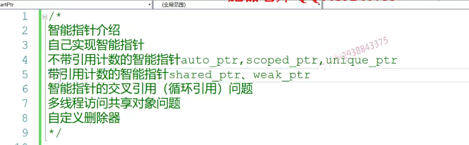

那么先说这个智能指针的这个第一部分啊。呃，我们在使用智能指针之前啊。一直使用的是裸指针，

什么叫裸指针呢？就像我们之前。这种代码都叫做。裸指针啊。裸指针是什么意思？裸指针你像我们这个指针p指向一个堆上的这么一个整形的，这个内存资源的话呢？我们可以对它进行一些操作，但是我们一定要注意，用完的时候一定要对这个堆内存进行一个delete。进行一个释放，那么如果不释放的话呢，这款堆内存就会被丢掉啊，会内存泄露，因为堆内存呢。

给我们内存分为三部分就是。数据段对吧？data段啊，还有我们的堆。还有这个。战啊战。只有堆的内存呢，是我们用户手动开辟，也必须是手动释放，如果你忘记释放了。c里边儿free可以加里边儿delete。那么，也就意味着这个内存就被丢掉了。给丢掉了，或者说是那在这里边儿就是我们写的时候把delete忘掉。

资源资源丢失了，或者是由于我们程序在运行过程中，我们代码中间呢？由于某些条件成立了，比如说==if语句，然后呢，我们程序给。return掉了。==也就是说，由于中间程序的逻辑执行顺序跟我们原来预想的不一样，==导致我们资源释放的代码写倒是写了的。但是根本就没有运行到==。所以这也是==导致我们这个资源泄露的主要问题==，这就是我们使用裸指针啊，使用裸指针不好的地方。

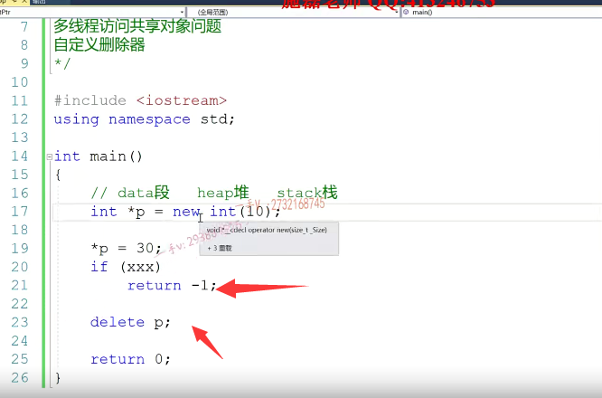

造成我们这个内存资源非法访问啊，资源泄露最根本的一个东西，所以用好它，我们必须在编码的时候。时时刻刻要留心。但是有没有什么办法能够帮助我们自动的去管理这些资源，包括。开辟资源以后呢，就是能够在某一时刻当我们不想用这个资源的时候呢，它能够自动的帮我们把这个资源设。啊，而不是说是必须得我们手动写代码，

而且还得保证这个代码必须运行得到。那么，程序运行过程中，任何时候，任何地点都有可能发生异常的。那我总不能说是正常执行的话，资源能释放异常执行，那我资源我就顾不上了啊。那么，有没有这种方式就是我们代码正常运行，或者是逻辑从中间return掉的，或者说甚至我们代码发生了异常？我们所开辟的资源都能够得到很好的释放呢，这就是我们今天要说的这个。==智能指针。==

他能做到啊，他能做到能做到什么呀？==资源的自动释放==。啊，而保证啊。保证能做到资源的。自动释放啊，这就是这个智能指针啊。它非常核心的一个功能，那这个到底是怎么做的呢？我们来一起看一下啊，我们来一起。==我们实现一个简单的这个智能指针==。

C加加的这个模板来实现啊class。c smart.ptr public.private那我定义一个指针，那么你可以看到，其实智能指针啊，其实就是对我们普通裸指针的一个封装啊，普通螺指针的一个封装。

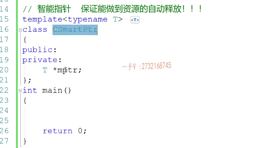

那么，给这个智能指针呢？提供一个构造函数。然后在构造函数的这个初始化列表里边儿，对于它的这个成员变量进行一个初始化。

那么，注意在这个。析构函数的时候。诶，析构函数的时候，对于这个指针所指向的资源。进行一个delete。那么，这就是一个非常非常简单的这个智能指针啊，智能指针。那么，它是什么意思呢？

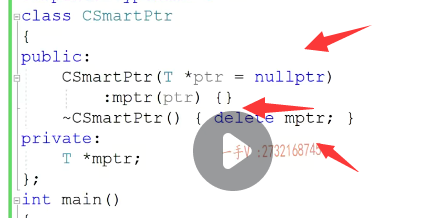

看一下。智能指针。我使用的时候，

我现在就可以这样去使用。跟我之前使用的这个罗指针来比较的话。其实呢，现在这个智能指针相当于就是一个面向对象的指针。我们还是new int，我们把这个堆内存的资源呢，给到这个智能指针对象进行一个初始化，其实也就是说在智能指针对象的成员变量mptr里边。保存的就是这个对内存资源的起始地址。没问题吧？那么。大家应该知道这个对象啊，出作用域。出自于比如说战胜的对象，出自于什么时候那个return to。

那么，栈上构造的对象呢？就要依次跟构造顺序相反进行，依次进行析构。这个析构是自动进行的。啊，不管是这个函数执行完了，还是说我们呢？这个函数从中间运行走掉了。啊，或者是我们从中间这一块儿怎么怎么样through？抛出异常，不管怎么样，不管是哪种情况，你正常执行return，

中间走掉了，还是抛异常总。总而言之，==你要出这个函数的作用域，你要出这个函数的栈帧，那么这个栈上已经生成好的对象。就会进行一次析构，这是我们编译器，给我们加上的。==它是一定会调用析构的==，那么也就是说在析构函数里边，我们就能够去deal用delete mptr。把它所管理的这个智能指针所管理的资源释放掉。

new int直接开辟了一个地址，基本数据类型

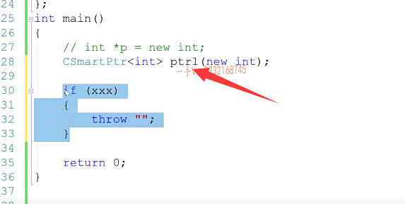

大家想一想，刚我们说了，

就是智能指针的这个核心就是保证做到的资源能够自动释放，那它是怎么做到这一点的？

==其实就是利用栈上的。利用这个栈上的。对象出作用域。自动析构的特征。==来做到。来做到资源的自动释放的。啊，它就是。这样的利用这个这样的一个特点啊，这样的一个特点。

那么，这个对象构造的时候呢？或这个在对象的成员变量，持有资源的地址，还有对象出作用域。啊，或者是呃。抛异常，反正只要是出面函数战争，只要出面函数的作用域，它就会。会定用智能指针的析构函数。来保证资源的释放啊，保证资源的释放。

## 下半节课

那曾经有这样的一个面试题啊。面试题就是说是。

智能指针能不能定义在堆上？大家想一想，就类似于这种东西。能否定义在堆上。

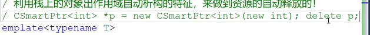

你这样写的话呢，这样使用智能指针在语法上是没有任何问题的，在语法上是没有任何问题的。但也就是说呢，智能指针怎么保证资源的自动释放？是在智能指针对象析构的时候。

### 智能指针不应该建立在堆上

但是现在这个智能指针对象被你放在堆上。那这个指针是智能指针呢，还是裸指针呢？==虽然这个指针的类型是个智能指针。但其实呢，它前面有星号，它就不是一个对象，它就是我们之前所见过的很普通的裸指针==，

所以要让我们堆上的这个智能指针对象进行析构，我们首先也得先。所以这就是跟我们以前碰见的。我指针的问题是一样的。我们不能够直接把这个智能。那就没有任何意义了，那我们不如直接使用裸指针算。这个需要注意注意的啊，因为站上的对象触中也会自动析构，这么一个特征来保证资源的。自动释放好，

那么既然呢，这个智能指针呢，要做到跟罗指针一样，那罗指针支持。常用的这个，比如建议用，比如说是指针指向，那么对于这样的运算和重载函数呢？我们。给这个智能指针，也是需要提供一下的，比如说呢，这新ptr 1=20对吧？那肯定默认情况下。==它是不能够对这个智能指针做解引用运算的编辑，==

根本不知道在干啥啊。那么，这个相当于就是把它智能指针所指向的这个。内存资源啊。改成了内内存里边儿，只改成20，所以这个。那就直接提供成这个样子了。

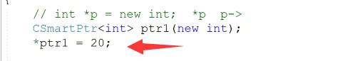

重载*号运算

这个重载和右边值没有关系

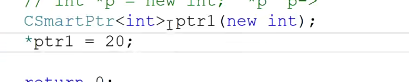

这样实现，并且返回的是这块内存值的引用，因为我们需要去改变这块值。

eturn新mptr。也就是说呢，表面看上是对智能指针对象做监狱，其实就是最底层的这个。智能指针的底层的成员变量mptr做一个建议。注意返回这里边儿，==返回的是一个引用==，

反而是引用，为啥呢？因为我们要改变这个指针指向内存。本身的职能，你不能把值返回回来。只返回回来的话，这用整形实例化，这都改不了，因为你返回一个整形，它是通过寄存器带出来的。是一个立即数，这个改都改不了。你可以测试一下。嗯，这里边儿是一个。

看到了吧，这个是说是这这这个必须是一个可以可以改变的，值注意返回。为这个引用啊。嗯，这一块儿的这个。这一块这个代码先不用哎呀，这个先删除掉啊。这是我们分享所用的代码啊。好，那么这样的话呢，我们应该就可以。编译运行一下。这里边儿还有点儿问题啊。啊，

这是刚才的这个代码。把这屏蔽一下。啊，没有任何问题

好那么如假如说呢？在这里边儿，比如说像我们。test呀。这个有一个test方法，对吧c这是靠我们test类里边儿的test方法啊。那么，对于这样的一个操作呢？那比如说呢？我建了一个智能指针，用test类型实例化ptr 2。

ptr 2这里边儿呢，你有一个test对象对吧？既然说这个智能指针呢，指向的就是一个test对象，那我通过。这样的方式我也理应能够访问test对象的成员方法。对不对？其实这个就跟我们。

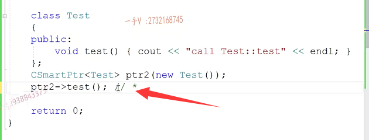

这个是一个意思，因为我们现在给智能指针提供了星号运算符的重载函数，它这个表达式。是是绝对没有问题的啊，那关键是呢是。这个呢？指向符呢？

注意呢，这个给指向符提供的这个。运算符重载。都是这样去解析的啊。就是智能指针对象调用指向符，运算符的重载函数。

CSmartPtr<Test> ptr (new Test())

这里面的Test是类型，代表传入的指针类型

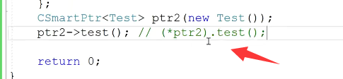

就是智能指针对象调用指向符，运算符的重载函数。返回的结果在调用后边儿这个方法。也就是说，指向符，运算符承载函数跟星号运算符的承载函数一样，都是不带参数的啊。它其实呢，就是返回智能指针底层管理的资源的指针。然后通过那个指针再调用它指向对象的方法，也就是说这样的。

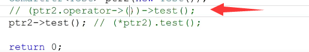

T * operator。指向符。return mp tr.mp点r。

就是这个样子的。嗯，就是这个样子。那一般呢？呃，那一般呢？我们对于智能指针的信号运算和重载跟。跟这个指向运算符的重载呢就就是。这样去提供了调用一下。啊，可以看到可以调用test对象的test方法啊。

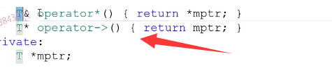

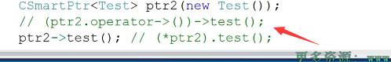

那弄到这里的话呢，那也就是说这个智能指针在使用起来表现的，跟我们罗指针就越来越像了啊。就越来越像了。