# 第二节课 

呃，刚才第一部分讲完了，这个对于智能指针的这个基础知识呢？呃，这这这一小小部分呢？主要讲解这个什么东西呢？主要就讲解这个。

啊，不带引用计数的智能指针。啊，那么下一部分就是讲带引用计数的智能指针，那引用这个智能指针带不带引用计数？跟什么东西有关呢？为什么说是非得带个引用计数？那我们看一下，

## 引用计数

我们刚才在第一部分写的这个智能指针，我们如果这样做的话。你发我们发现了，它会碰到什么样的这个问题？那我们写了一个定义了一个智能指针对象p1管理了一个整形一块儿整形资源，然后用p1拷贝构造p2。啊，那么好了，那么在这里边儿呢？我们运行一个这个代码，发现呢，这个程序运行崩溃了啊，那么。这个。大家稍微一看就能够明白这个类产生的对象呢，

每个对象都有一个指针，它==默认做拷贝构造函数的话呢，做的是一个浅拷贝，也就是说呢，在智能指针。析构的时候呢，把同一个资源释放了两次，第二次释放的时候就成野指针了啊==

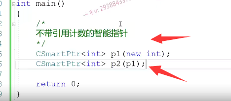

那有些同学说是把这个指针呢，再支成一个null。啊，其实呢，影响不大的，其实影响不大，因为这个指针置成null的话呢，

只是相当于把自己的。成员变量置成空，别人的的成员变量，那么在p2析构的时候没有问题。p1啊，先构造后析构嘛，对吧？析构的时候就剩delete一个野指针了。

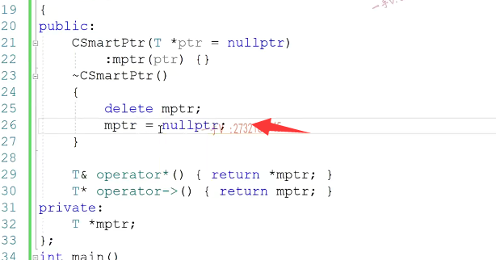

考虑解决浅拷贝

那也就是说，这事其实是呃智能指针对象的一个前拷贝发生的问题，那么大家可能一上来就是解决前拷贝，那好，我们。重新定义自己的这个拷贝构造函数，那么之前是怎么做的呢？之前做的事情呢？是这样子的事情。

啊，这样子的事情。啊，就是我给我当前对象呢，重新开pipper的空间对吧啊，那么用你的值。来初始化我那也就是说我们俩拥有的只是一模一样的。那么呃，咱们各自呢有不同的内存空间，那么在吸够的时候，你吸够你的，我吸够我的。啊，运行一下，看看这个代码会不会再次崩溃？

不会。

 

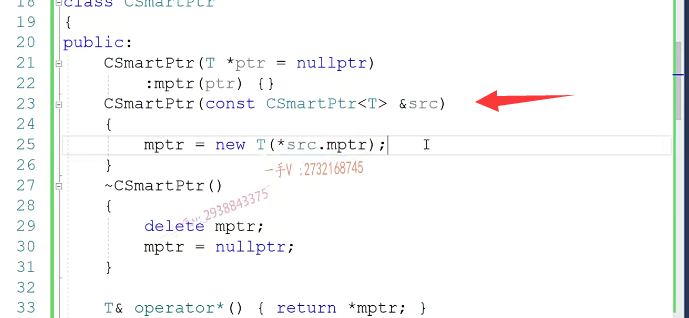

但是呢。大家想一想，能不能在智能指针这个应用场景里边，用我们之前使用的这种解决对象浅拷贝的问题的方式呢？来，在这里边解决智能指针的这个问题呢？

==作为用户来说，那么他在做这个拷贝构造的时候，对于指针的使用理所当然，用户会认为，当我用p1给p2的时候，相当于呢？此时p1和p2都管理了我们最开始的new in的这个资源。用户在做p1=20的时候，他认为把这个值呢，对内存改成20了，用户在做这个操作的时候，他依然认为是把我现在管理的这个new int的值改成30了。==

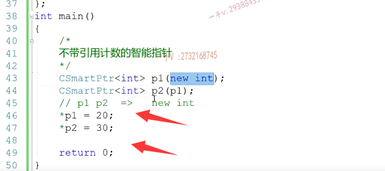

### 解决浅拷贝使用开辟新空间会导致与用户所理解的指针效果不同

其实是嘛。不是的，

因为我们在给p2拷贝构造的时候是给p2你重新开辟了一块儿空间。开辟了一块用户根本不知道那是什么东西的一块空间。那也就是说呢，其实呢，现在p1跟p2这两个智能指针所管理的资源是完全两块儿资源，但是用户如果不了解的话，==用户会认为。我想我就是想让他们管理同一块儿资源，你怎么给我搞成两块儿资源了==，

那个不是我想要的，所以我们之前的方式在智能指针这里边儿。嗯，它是代替裸指针的嘛，我们指向不同的指针，是不是可以指向同一块资源呢啊？就用户认为这两个智能指针应该是管理同一块资源，但是其实呢，让我们解决成每个智能指针指向一块资源。==那个根本不是用户所想想要的啊==，所以也就是说呢，也就是说呢。我们现在的这个智能指针面临的一个问题就是怎么解决？这个前拷贝问题哎，怎么解决前拷贝问题？

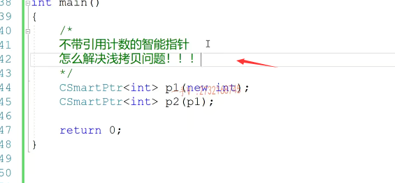

## 浅拷贝解决方案

### 不带引用计数的智能指针

怎么解决浅拷贝问题？那么，解决浅拷贝问题具有两种，一种是不带引用技术的，一种是带引用技术。那么，这一部分先看一下，不带引用技术的智能指针到底是怎么解决的？那么，在这里边儿不带引用技术的智能指针，先给大家呢说一下这三个auto ptr跟。scope e dp tr以及unique ptr，这个是那个原来的这个CC加加库里边啊，库里面本身就提供的。下边儿这两个相当于是CA加幺幺新标准。

里边提供的两个不带引用计数的智能指针。这个智能指针用的时候呢，我们只需要包含这个memory me ory memory头文件就可以了。那么，在这里边儿，我们分别使用一下，看看他们到底是怎么解决参考位问题的，

###  auto_ptr

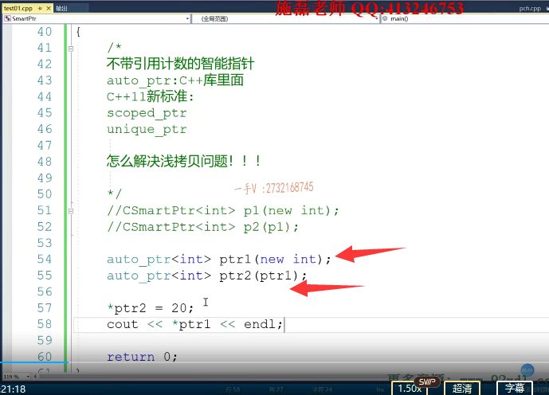

打印一下信号ptr 1指向的同一块儿空间是否被修改成了20？我们运行一下。

===程序崩溃==了，崩溃了，那原因是什么呢？那这就得找到我们auto ptl的这个拷贝构造函数。

去看一看啊，去看一看。我们转到定义，这是auto ptl在源码上的这么一个实现。大家可以看到，这是auto ptr的这个拷贝构造函数啊，拷贝构造函数当我们用ptr 1最right就是引用ptr 1，给ptr 2拷贝构造的时候呢，它首先会把ptr 1调用release方法。然后把release返回，结果呢，

再给这个mptr进行一个初始化。这个职能指针呢？这个底层的这个成员变量啊，跟我们自己写那个smart ptr是一样的，就是封装了一个裸指针。

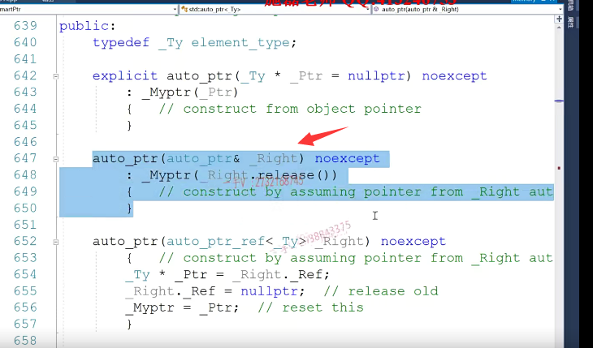

那么，刚才release做什么事情呢？release是哦，把当前指针的原来的值先记下来，然后把当前智能指针底层的这个裸指针改成null，然后把原来的这个资源的地址。返回回去。

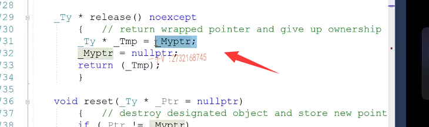

看到这儿，我们也就理解了这个东西做了啥事情了。这个东西做的事情呢，

就是这样的一个事情。啊，就是这样一个事情那么。new int呢。啊。unit是我们在堆上开辟的这个资源啊，那么这个ptr 1呢？首先呢？它是在站上，它刚开始指向了这块儿资源，它底层的那个罗指针呢？指向了这块儿资源

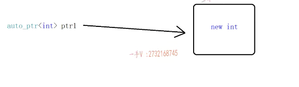

但是现在调用这个拷贝构造函数了，生成了一个ptr 2，这么一个智能指针啊，

这个智能指针在调用拷贝构造的函数的时候，你刚看到它首先调用了。它的release，它的release，做什么事情呢？它release把ptr 1底层的这个指针的值记下来了。给谁了？给ptr 2了？那也就是说呢啊。给ptr ptr 2指向这儿的在release方法里边儿呢，它刚才呢，又把ptr 1的这个指针呢。给置空了。给吃空了。我把这个拷贝过来。

看一下。

ptr1.release将ptr1的地址记录，然后ptr2指向地址，ptr1置空

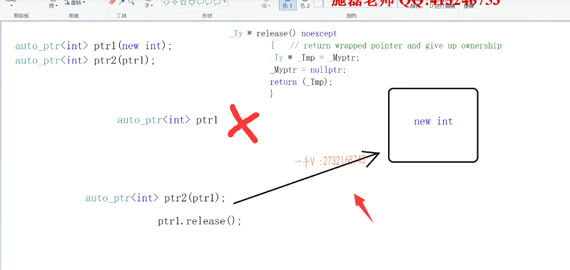

我把这个拷贝过来。

看一下。这个是ptr一把ptr 1原来的指针，记下来把ptr 1的底层指针指针呢？再把ptr 1原来所管理的资源的地址。返回回来，这个返回来以后呢？是不是就给了刚才的拷贝构造函数给了这个ptr 2的底层指针？那也就是说ptr 2指针指向这，这指这指向空了。那也就是说，凹凸ptr在这里边儿是怎么防止这个智能指针前拷贝问题的啊？智能指针前拷贝问题

#### auto_ptr特性

首先我们看到它的成员变量，除了一个裸指针，再也没有了它，就没有什么带引用计数这么一个东西，它不带引用计数。它所处理的处理这个浅考位问题，就是说是。

==永远让最后一个智能指针管理资源，前边儿的智能指针就全部被置成null了==。所以这个就很坑啊

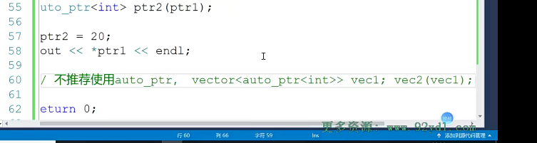

就说是我我我如果你把auto PR当做一个呃，就是不了解它的这么一个底层机制。你用ptr 1拷贝过作为ptr 2的话，你还在使用ptr 1，那就完蛋了。pdr 1底层相当于就是已已经成成一个空指针了，你不能再使用它了，所以呢，像这个。

嗯，基本上C加加规则里边是==不推荐使用这个auto ptr==，除非就是你的使用场景非常的简单，就是想在当前的这个局部作用域下，让auto pdr帮你。管理资源出等初衷于自动把资源释放一下，否则呢，不建议使用，尤其你像面试的时候问能不能在容器当中。去使用这个智能指针的，可不可以？尽量是不可以，而且说是或怎么说呢？不推荐你使用啊，不推荐你使用，

因为呢？我们容器在使用过程中呢，难免会做这个容器对象的，这个呃容器的这个拷贝构造。或容器之间的复制，容器的拷贝，构造和容器之间的复制呢，就会引起容器里边儿每一个元素。的拷贝和交通赋值，那如果说是你给容器里边放的全部是auto ptr，==因为VC1。构造一个新的vec 2，这个容器出来，那么也就是说vec 1里边儿所有的智能指针，底层的指针，底层的螺指针就全部被制成null了。全部被支撑了。这个我们在不知道的话，我们再去使用这个容器，一里边儿的这个智能指针的时候呢，那我们。就全部是在访问空指针了==，

所以呢，auto ptr不要去做过于复杂的操作，不要把它使用在。容器当中啊，这个是我们不推荐去使用它的，这是auto p呢，非常简单的，这么一个操作，

它其实呢在==有些资料上呢，就是说它会转移对象的所有权啊==，也就是说呢，刚ptr 1还在持有这个对象的所有权，现在通过一个拷贝构造。或者通过一个赋值，==它就把所这个资源的所有权转给这个最新的==，这个智能指针了，原来职能指针全部成空了。好行这个auto ptr呢？就介绍到这里。就介绍到这里。

### C++11新标准

### scoped_ptr

那么，在这儿来对比来比较一下scope的ptr啊，

scope的ptr scope的ptr这个。智能指针呢？其实跟auto ptr比起来，比auto ptr解决这个千拷贝的问题还暴力，因为它直接是这样去做的。

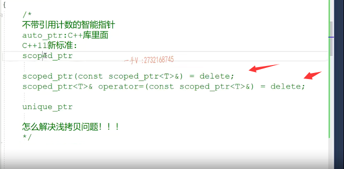

它是直接是把这两个函数给。这样子操作了。或者说和谐了。和谐了，这是C++11里边儿新语法，相当于把这个类的拷贝构造跟赋值呢，直接给delete删除掉了，就把这两个函数删除掉了。如果你在进行scope的ptr拷贝构造或者复制的时候呢，它就会给你直接编辑就报错啊报你。

引用了一个已经被删除的函数了啊，那是这个函数是不能调的，也就是说对于scope的pdr来说呢？

==那仅仅就是只能使用一个单个对象==。

想用拷贝构造在任何地方，如果使用拷贝构造和复制编辑，就会给你报错，所以呢，这个基本上来说呢。使用的也比较少啊。那么前面也说了，不推荐auto ptr使用，使用auto ptr ==scope的ptr使用的比较少==，那么在不带引用技术的智能指针里边儿，我们一般推荐使用谁呢对？

### 推荐使用

### unique_ptr

推荐使用下边这个unix pdr。unique ptr.大家看啊unique本身的含义也是唯一的，也就是说这种智能指针也是只剩一个智能指针管理资源。让一个智能指针管理资源，不会让多个智能指针管理资源。首先呢，unique ptr里边儿呢，也是做了这样子的一个操作。啊，我就直接在这里边说源码了，就不给大家打到源码，那个实现的地方了。用那个ptl把这个考虑工作跟赋值也进行了一个delete。那有的人说这个东西跟这个scope的ptr还又有什么区别呢？

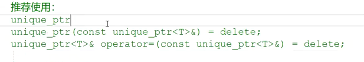

首先呢，我们看它能不能这样进行一个拷贝构造呢

那看这个是尝试引用已经删除的函数啊，尝试引用已经删除的函数拷贝构造，你调用不了。那怎么办呢？

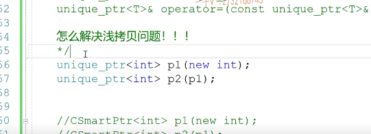

那这个st d move。是干什么用的呃？是干什么用的呢？

这个东西呢？是用在。就是C++11里边儿的右值引用相关的这个知识啊st d move呢？就是得到啊，当前这个变量的右值类型。其实呢，我们通过move的源码也可以看到它，其实就是对变量进行了一个右值引用的一个类型强转.

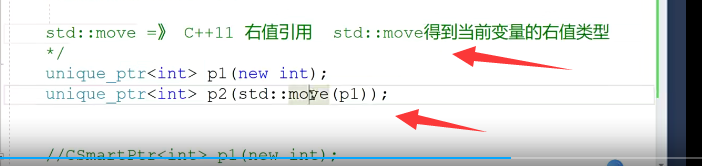

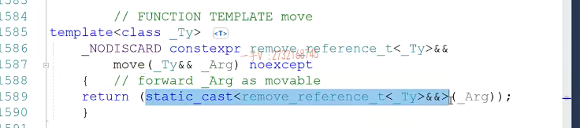

啊，右值引用类型的一个类型强转。那么，之所以这样能够实现，那是因为unique ptr呢？人家提供了这样子的实现。对人家提供了带右值引用参数的copy构造函数。和赋值运算符的重载函数。

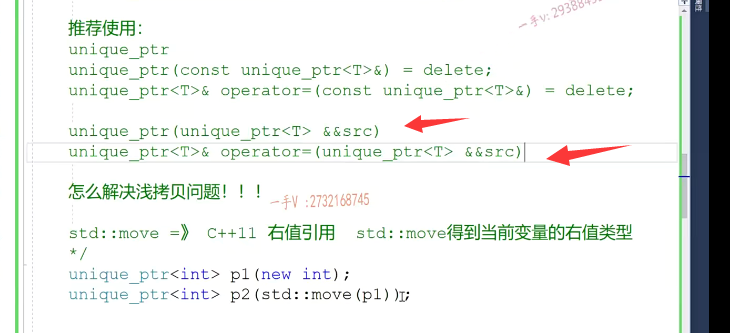

那么k相当于就是传了u值啊，匹配到带u值引用参数的这个unix ptr。那么这一点呢？还有什么好处呢？也那另外一点好处就是说是我们能够啊，直接在函数的使用过程中。你说get unique你，比如一个get smart，get smart ptr。我又获取了一个。资源啊，获取了一个资源。那么，

在这儿ptr。这个newt啊，newt在这里边return ptr那么使用的时候呢？嗯，比如说在这里边intptr=getsmart ptr。这种==整形来进行这个函数模板的实例化，==

那这个到底行不行呢？这个行不行呢？啊，这个可不可以

那如果说是没有带右值引用参数的拷贝构造，那么在这里边儿返回ptr的时候呢？由于这是一个战胜的对象，不可能返回引用的，所以在这里边儿ptr呢？

会拷贝构造。生成一个PT re。

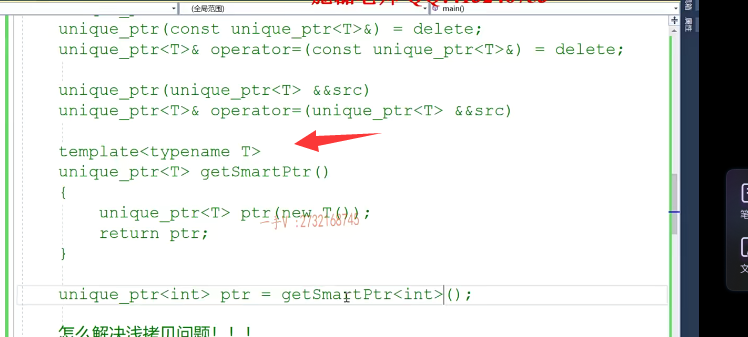

==使用unique_ptr<int>ptr = getSmartPtr<int>()  整形来完成参数模板的实例化。==

由于这是一个战胜的对象，不可能返回引用的，所以在这里边儿ptr呢？

会拷贝构造。生成一个PT r1

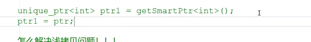

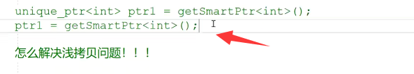

如果是这样的操作的话，那这里边ptr会首先在调用的这个函数的栈帧上拷贝构造，生成一个临时对象。然后临时对象再给pdr 1复制完了以后再析构临时对象，==但是很可惜，如果说是按原来这种方式。==

==这两个函数应该调不了。被delete掉了==。那现在呢，为之所以这样的代码还可以能够让unique ptr正常使用的，是因为啊==unique ptr提供了带右值引用参数的拷贝构造跟赋值重载。==

==这是临时对象。拷贝构造PT re。那么，直接匹配的就是带右值引用参数的拷贝构造，如果是这种赋值的情况呢？ptr调用带釉质应用参数的拷贝构造生成内函数战争上的临时对象。然后临时对象呢，给ptr 1复制这样呢，也是带右值引用参数的复制重载临时对象嘛，之前给大家讲过啊，给大家给大家这个讲右质应用的时候给大家讲过。临时对象呢，就在当前语句完了以后呢，马上就会去去析构，==

所以在他的资源呢，就没有必要去保持了，把他的资源。==直接移动哎，木偶直接移动给我的ptr 1 ptr 1==，啊，这样效率是非常高的，

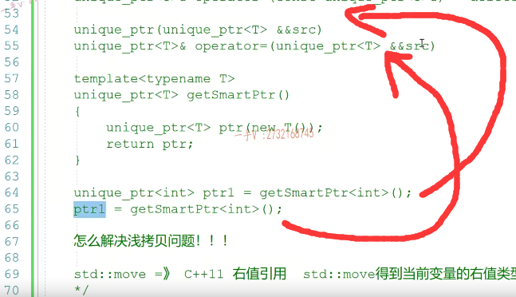

unix ptr区别于scope的ptr，不同的地方在于scope的ptr根本没法用在这个。普通的拷贝构造赋值以及函数的调用工种是不能够进行任何的scope ptl的传参或者返回的。而有你个bdr是完全没有问题的。因为人家提供了带釉质应用参数的拷贝工程，这是它跟scope ptr完全不一样的地方啊，之所以它名字也叫尤尼克ptr呢是。

是因为呢啊，它所谓的木偶的釉质引用参数，我们刚说了，它相当于把p1原来的资源呢，都移动给p2了啊，都移动给p2了。在这里边儿呢，也就是说呢，你再去访问p1 sorry不要访问啊，这个访问完全也是在。搬石头砸自己的脚，这个现在已经不持有资源了，已经不持有资源了。好处是什么？有你个ptr，

我们在写的时候，如果你想让它拷贝构造成功，用户是很用户的用意是很明显的，就是我知道。因为我现在自己调用了木屋了嘛，我把PE的资源现在要移动给PR，我已经言下之意就是说知道了。p1移动了以后p1就不再持有资源了，而如果你像之前使用auto PT啊，这个是完全在用户感知不到任何。仅够的前提下，用户一用完全把这个资源就转移了。这就很危险了，所以我们在使用不带引用技术的智能指针的时候，推荐大家使用unix pdr。

来进行资源的自动管理。行，那个不带引用技术的这个智能指针呢？就先讲到这里，后边儿还会讲一个unix ptr跟删除器有关的东西，那么在在在这个后边儿的这个。呃，部分再进行一个讲解。

#### 用户有意识的去调用move,直到p1已经不掌握资源了

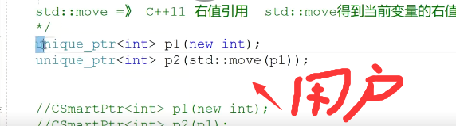