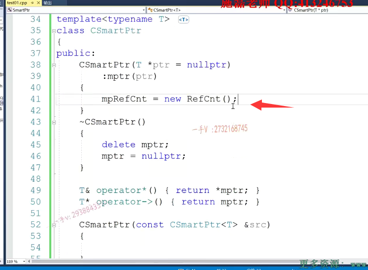
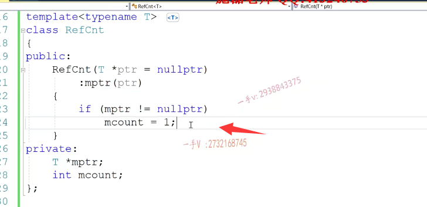

第三节课：

好，这个是智能指针的第三小部分啊，那在第三小部分刚接着刚才所讲的这个不带引用计数的智能指针在这里边儿，主要就是讲一下。带引用计数的智能指针，主要就讲一下shell的ptr和。week.ptr和这个wake ptr。那么在讲他们之前呢？我们先就着我们的这个，刚才最开始写的smart ptr来看一下啊。带引用计数的智能指针到底是怎么解决？多个智能指针持有同一个资源的啊。

就是带引用计数的好处，就是多个智能指针可以啊。

这个管理同一个资源。之前学的这个不带引用计数的智能指针呢？像auto ptr啊。scope的ptr unique ptr都是只有一个智能指针，可以管理资源。一个职能指针可以管理资源，其他的不行scope scope的ptr完全就是防止你进行考虑构造和复制。auto ptr跟unix ptr auto ptr比较坑一点，unix ptr呢？最起码当用户调用它的这个。呃，显示掉目录的时候，他还是知道我要把原先的unix ptr的这个资源转移到我最新的这个unix ptr。

那么，如果我想让多个智能指针呢？

管理同一个资源，那么这就必须。使用带引用计数的智能指针了。引用计数的智能指针，什么叫带引用计数呢？啊带引用计数呢？

带引用计数的意意思就是说呢。==给每一个对象资源在匹配一个引用计数==。哎，当一个智能指针，智能指针引用这个资源的时候。给这个资源相应的这个引用计数。就加一。当这个智能指针。出作用域。

不使用。啊不==不再使用这个资源的时候，那么这个引用计数就减一==。当==引用计数呢，减一不为零的时候，那么也就是说你这个智能指针不使用这个资源了，别的智能指针还在使用这个资源了，你不能够去析构==，你直接走得了。

当这个智能指针析构资源以后，发现这个资源的引用计数已经变为零了，那也就是说。当前，==这个指针指针是最后一个使用这个资源的只能指针，所以它在析构的时候呢？一定要记着把。资源释放。==

也就是说，它完美的解决了智能指针的前拷贝，就是多个智能指针多次释放同一个资源。现在引用计数给资源，给对象呢添加了一个引用计数。呃，通过引用计数呢来判断。哎，这个智能指针是最后一个使用该资源的智能指针呢？还是说是它不使用了？还有别人在使用。呃，那么引用计数就是这么一个概念，

引用计数就是这么一个概念。那么简单。简单简单来实现一下啊，简单来实现一下，就是我们完全可以这样做一个这个。智能指针的这个操作啊，来模拟实现一下。那么在这里边呢呃，打算使用一下这个。呃，这样的一个东西啊，这样一个东西。暂暂停一下，

在这里边儿可以模拟库里边儿的这个share的就是这个share的ptr，这个智能指针的带引用计数的实现我们来。

写一下好，我们来写一下，比如说这边是一个。对这个对资源进行引用计数。呃，对资源进行引用计后的类啊

那么，这是一个。reference cnt reference count啊，我们可以写这么一个类。那么，这么一个类的话呢？用模板来实现吧。呃，它底层呢？

也也可以再记录一下资源的地址，然后最重要的是它记录了一个。资源的这个引用计数啊，资源的引用计数。

T * ptr=n，那么对于这个mptr呢？用ptr初始化一下。你。我给这个m count呢，可以初始化为一，因为你在这个初始化这个reference count的时候呢啊，对于这个资源进行了一个初始化，

那其实呢？可以再写的更好一点，就是说呢。

在这里边儿判断一下mptr，如果不等于null的话呢？可以给这个mcount。初始化成一个1对吧？初始化成一个一啊？初始化成一个一。

好了，那么在这里边，我们来看一下啊，我们来看一下，那在这呢？我给我的智能指针呢，添加这么一个

Refcnt *mpRefCnt 增加这么一个成员变量。这个是指向资源的指针。这个是指向该资源引用计数对象的指针。。啊。

那么来看一下，在这里边呢，你构造的时候构造的时候在这里边，刚才对于。mptr进行了一个初始化，对吧？

那么在这儿呢？生成这个对象。

==生成这个智能指针对象的时候呢，就要生成一个相应的该资源的一个引用计数对象==。

生成一个该资源的一个引用计数对象，在这里边通过一个new操作。来进行这个，

现在是一个空的引用计数对象，在这边儿做的事情呢，其实就是把它底层指针指为空。呃，也没有去记录任何的这个资源，因为现在呢，它没有东西。它没有东西，

那在这儿呢，其实呢，我可以把这个mptr直接通过这个构造函数呢传进去。啊，相当于就是给这个资源。建立了一个引用计数对象，建立了一个引用计数对象啊，在这里边儿，如果呢，他不为空。不为空，那我给这个引用计数呢？资源的这个基数呢？就制成了一个一。从一开始。

## 重写拷贝构造函数

这个可以看一下。叫带引用计数嘛，它现在拷贝构造是不是有问题呢？我们重写拷贝构造，那重写拷贝构造都要做哪些事情呢？

首先在这里边把这个指针的值，我先记录一下src mptr。啊，那么。在这里边还有做这样的一件事情，就是把src。哎，你所记录的，因为你现在意思就是说是把你的资源让我当前智能指针对象也指向。那所以把你的这个资源的引用计数，这个对象呢，先给我，因为呢，我要在它上面儿进行一个。这样的一个操作指向add_preference.

## addRef()函数

看一下这个操作，那么也就是说呢，==拷贝构造的时候先把你的资源指针给我==，==再把你的这个资源的引用计数对象给我==，

就是给你所引用资源的这个相关的引用计数指针给我那么在这里面儿，

我可以判断一下啊，只要你不是空指针，那也就是说是mptr不等于null。就说明你现在引用了一个非常有效的资源，那么你src已经引用这个资源了，现在让我一个新的smart ptr也引用它，那我需要给这个资源的引用计数。不要加息at reference，那么在这就意味着这里边at reference。就给这个这个函数很简单，就直接写到这里边了count。进行一个加加操作，进行一个加加操作。啊，添加引用计数添加引用计数。增加就是增加资源的，就是这个指针所指向资源的引用计数。

好了，==其实并没有给我当前智能指针新开辟===，我指向的新的资源==还是指向同一个资源了==。

## 重写赋值运算符

那么在这儿呢，又有这个拷贝构造简化题。赋值。cost.csm art ptr.好了，

这是它的这个赋值，那赋值呢？首先呢，我防止这个自赋值return现this。这就是我现在要指向的跟src所引用的资源是一样的，那我现在我要把我原来的资源释放吗？不释放。不是说不释放，不一定要释放，因为你所指向的原来的资源呢，不一定就只有你一个使用，所以我要先做的事情呢，是什么事情呢就是？呃，我原先的这个资源首先要delete reference，

==这不像我们之前呢，在这个就。直接释放原先占用的资源，这也不释放==，

==你只是给原先占用的资源呢，去减少一个引用计数啊==，

减少引用计数以后呢，再==获取它引用计数的这个值。获取到了，如果是零。那也就意味着你是最后一个使用的，一个资源的智能指针。你有责任去把它去delete一下啊==，

你有责任把它去delete一下，那你就是说delete。mptr这个资源。

## delRef()函数

如果说当你去减少了一下那个资源的引用计数，发现减少了以后，那个资源的引用计数并不是零还在大于零，那就说明还有其他资源，还有其他智能指针在使用那个资源，你不能够去释放。==只有最后一个不使用这这个智能这个资源的，这个智能指针才能有权利有义务去释放那个资源==。啊，那delete reference我也写一下。这是int delete reference。这个是要先减return减减 count啊，是这样的一个操作。

好了，在这继续。第三部分呢？就是做这样的一个操作。等于src的。MPRf count相当于就是我当前智能指针指向的，跟你所指向的资源一样了，那么也就意味着要给你当前的这个。资源给你当前的这个资源要增加一个。要增加一个引用计数，要增加一个引用计数add reference，完了以后呢？return。相类似。

看一看，这就是我们智能指针的拷贝构造跟复制，我们并没有给用户开辟新的资源，只是给资源添加了引用计数来防止智能。多个智能指针引用同一个资源的时候呢？对。同一个资源进行多次释放。那么现在呢？我来把这个编译一下。使用类模板对这个需要用类型来进行一个。实例化不要忘了。

好了，那我们现在看看我们现在用的这个csm art ptr成型ptr 1。new int啊CS Martin tp tr 2用PT re进行一个拷贝构造。

那么在这儿呢，会不会说是对同一个资源释放多次呢？啊。哎，在这里边我们也得用t类型来初始化一下啊。

好，这里边儿还有问题，是因为我们这儿没改对析构函数没改，就说你这个职能指针不使用这个资源了，不是说是直接。不是说直接就要去delete，是要先。减少这个资源的引用计数。资源引用，计数牵扯到零的时候，

你才需要去释放不为零，轮不到你释放，你直接走你的就行了。

我们再来继续。这个现在就没有问题了。啊，这个现在没有问题了，我们这个资源最后仅仅就只释放一次而已。

## 过程分析

因为呢，我们这个拷贝构造对吧？对于同一个这个资源。诶，引用计数的。我们增加了。增加了。

引用计数增加。在这里边。引用计数增加了。啊，引用计数呢？谁析构的时候啊？当第一次pdr2析构的时候，它只是对这个资源的计数从二减到一。并不为零，所以ptr2并不释放资源。ptr 1再把资源的基数从一减到零的时候，它才去释放。它再去释放啊，我们再去创建更多的这个智能指针呢，也不相关了。

ptr GTR 3啊ptr。三=ptr二看一看这个怎么样？这都没有问题。现在我们可以多个智能指针都可以管理同一个资源了，比如说星ptr 1等于这个20的话。那我打印一下新ptr 2，再打印一下这个新ptr 3，看他们管理的资源是否？嗯。这也进行了更改，没有问题，他们指向同一个资源。这就是多个智能指针管理同一个资源了啊，管理同一个资源了。

那么其实呢？实际上啊，这个我们写的这个csm art ptr呢，也就是说我们库里边儿实现的shell的ptr，但是呢？那我们跟人家shared_ptr比起来呢，有一个不足的地方，就是说呢，同学们啊，大家在这个智能指针直接使用在多线程环境下是否可行呢？不行，因为明眼呢，大家都能看到这里边儿加加减减，并不是一个线程安全的操作。对吧，实际上呢，在库里边这个直接定义成atomic。

atomic int也就是一个原子的整形类。啊原子整形类是通过CS来保证呢，这个原子整形类呢？这个加加减减的一个线程，安全操作的，

所以库里边儿的这两个带引用计数的智能指针share的ptr跟weak ptr。都是线程安全的，都是线程安全的，都是线程可以直接使用在多线程环境下。可以使用直接使用在多线程环境下。啊，这就这这个我们现在写的这个呢，就是一个带引用计数的智能指针。大家看一下这个带引用计数的智能指针，

就是可以让多个智能指针管理同一个资源。而且我们使用。的时候呢，使用的是shell ptr跟weak的ptr，本身就是线程安全，可以直接使用在多线程环境中，非常安全啊，非常安全。好，这就是带引用计数的这个智能指针下一部分呢呃，我们对share的ptr跟weak_ ptr呢，那这个。常见的问题，我们再来说一下。

