## share_ptr  weak_ptr

那么，这一部分主要讲这个share的ptr和这个weak ptr，这两个是带引用计数的智能指针，我们一般把这个叫做强智能指针，把这个叫做弱智能指针。当然了，它们首先是智能指针。核心的功能就是可以自动的去释放资源，那么为什么一一他们跟其他之之前不同的是呢？他一是他们。带引用计数的智能指针，可以多个智能指针管理同一个资源，那么在这里边为什么要分一个强弱呢啊？

## 为什么分强弱？

呃，简单的可以这么理解，所以强智能指针就是可以改变资源的这个引用计数

弱智能指针就是不会改变资源的引用计数。啊，它不会改变资源的这个引用计数

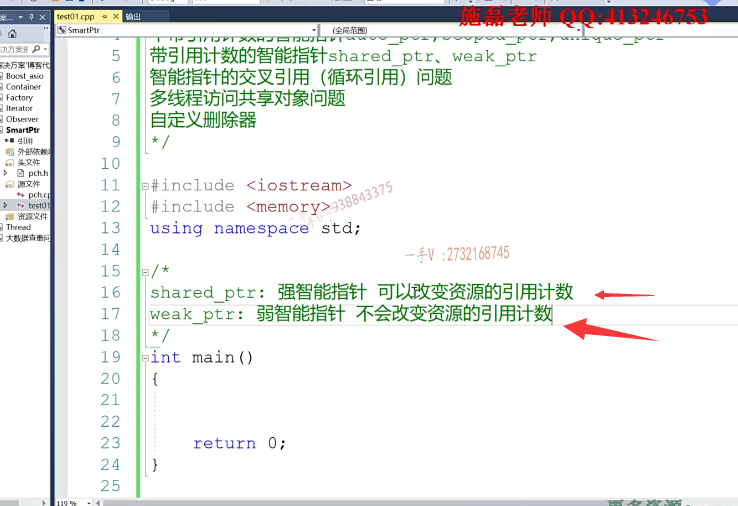

## 弱智能指针观察这个强智能指针。强智能指针再观察资源。

这个弱智能指针呢？啊，是这样理解的，对弱智能指针观察这个强智能指针。强智能指针再观察资源。

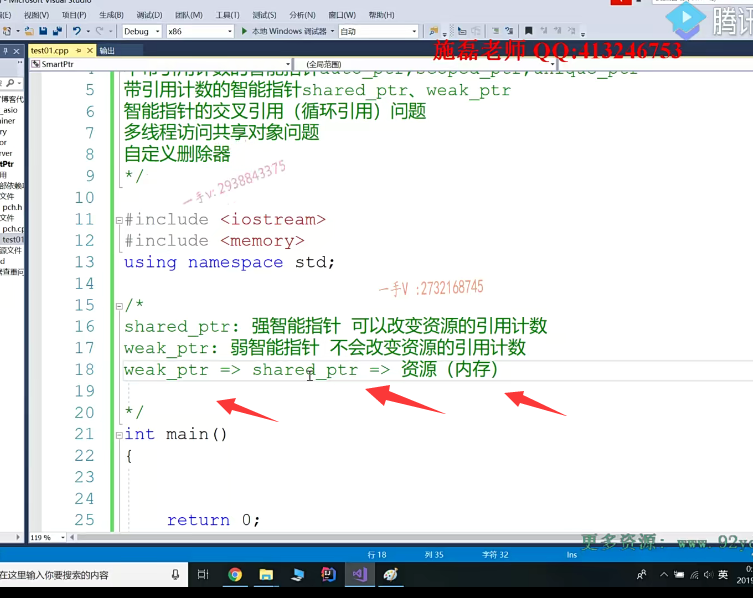

啊，或者就是我们常用的资源，就是我们的内存，对吧？

我们通常用智能指针来管理我们的堆内存，这是我们最常见的资源。

## 为什么要有强指针和弱指针？

那为什么在在引用计数的智能指针里边非得搞出来一个强弱智能指针，用强智能指针？不行吗？为什么非得搞出来一个弱智能指针？

## 强智能指针的循环引用（交叉引用）是什么问题？

这里边就是考察智能指针常见的一个问题就是。强智能指针这个循环引用是什么问题？造成什么结果？怎么解决啊？

我们来看一下，看一下这到底是个什么问题？这个是一个。举个智能指针，强智能指针的这个循环引用，也叫交叉引用，它到底是个什么问题呢啊？交叉引用。是个什么问题呢？

## 举个例子

这里边前置声明，一个b类型

定一个A类型啊，定一个A类型在这里边，

我们全部定义成公有的。啊给a提供了一个构造，大家知道构造函数一般是对对象的成员变量，做一个初始化用的。析构函数在这里边呢，打印一下a对象析构啊，析构函数一般是。

在对象内存释放之前。给对象把对象这样的外部资源进行一个释放的，这么一个函数能够自动的进行一个调用啊，那么在这里边儿大家看。我直接使用了这么一个share p tr a对象，里边有一个指向b类型的，一个指能指针。

## a对象，里边有一个指向b类型的，一个智能指针

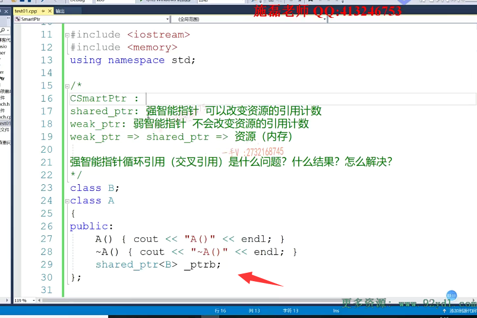

## 自己实现的智能指针也是强智能指针

大家想一想，这里边我们没有用。上一部分我们直接写的自己的这个csm art ptr，那个也是一个强智能指针，为啥呢？大家可以知道，这不是给定义嘛。我们那个也是可以改变资源的引用计数的。对吧啊，改变资源的引用计数的。好了，改变资源引用计数，

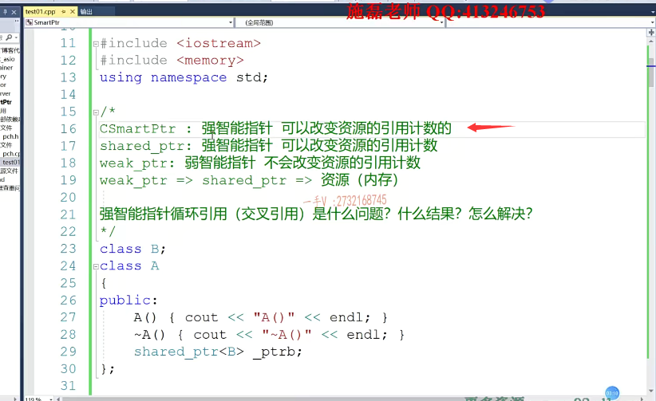

## 再定义一个类型B,里面有指向A的智能指针

那在这里边呢？我又来了一个class b。public.同样的，把这个我拷贝拷贝一下。这是b类的构造跟b类的析构b的构造跟b的析构啊，那在这里边儿呢，有一个指向A类型对象的智能指针p tra。

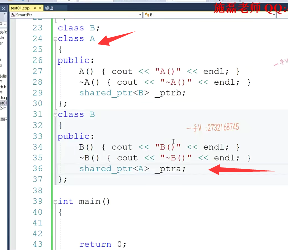

大家隐约感觉是不是互相引用啊？是吧？那么在这里边看一看啊，注意使用它们。

## 使用智能指针包含头文件，了解boost库

使用这些智能指针呢，包含memory头文件啊share的ptr跟w ptr呢，这两个也是C加加幺幺标准以后呢。他们原来都是。boost库也是。一个非常优秀的CA加库，但是没有纳入到CA加标准库里边来啊呃，现在呢？随着CA加幺幺幺四幺七。新标准的这个迭代很多，这些第三方的这些CA加的优秀的库里边儿的内容也在逐渐的纳入CA加标准库里边儿啊，非常的好用。这里边儿今天介绍的这个东西就是其实就是原来人家一个boost库里边儿的智能指针拿过来到我们的C加加标准库的。

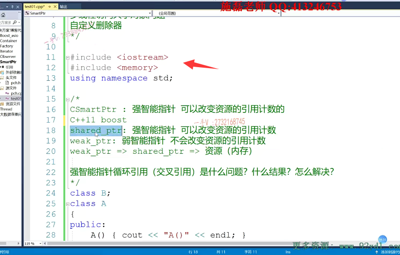

我现在用A类型实例换一个智能指针pa来让他去管理一个a对象。

现在呢，又用一个b类型实例化的一个PB，让他管理一个b对象。

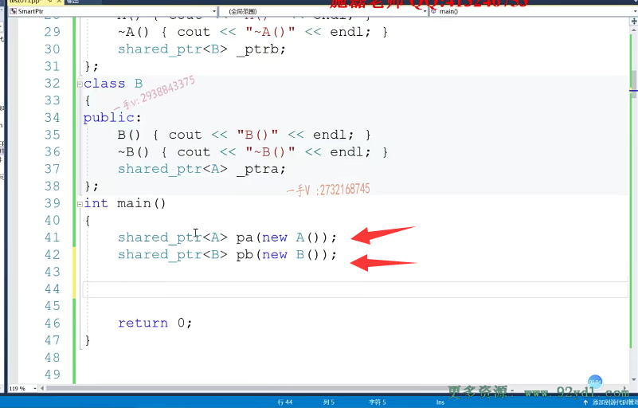

## use_count打印引用计数

那么，在这里边儿啊，做的这个事情呢，我可以在他们走人之前就是出作用域之前呢，

哎，这个强智能指针呢，提供了一个use count这么一个方法。啊PB可以打印一下它所引用资源的引用计数，

## 我们自己实现的智能指针没有考虑线程安全

这个其实呢？是这样的ptr底层是什么？跟我们刚才写的Smartptr模一样，只不过人家是线程安全的，我们没有考虑现场安全啊。

好，打印一下。

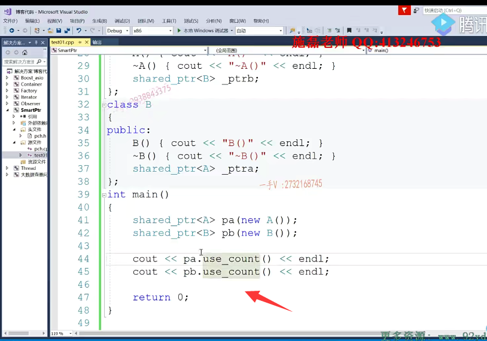

ab构造在main函数执行结束之前呢，资源的引用计数都是一，

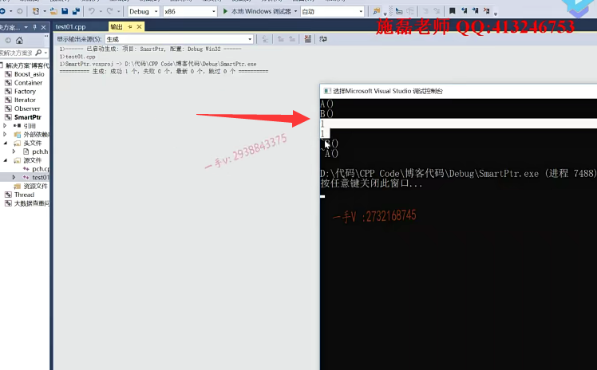

所以出main函数作用域呢BA依次进行析构。没有任何问题，资源分配了。你有了。最终也delete了，这是因为呢，智能指针随着栈上智能指针的析构，把对象的资源计数从一减到零。

那么，两个AB对象就都析构了？啊，都析构。

那我现在做这样的一件事情PA指向的PB，它是指向一个b对象的智能指针吗？有没有有这不是了？

PB指向的对象哎PB指向的b对象里边儿有一个成员变量指向A类型对象的一个智能指针有没有，有？

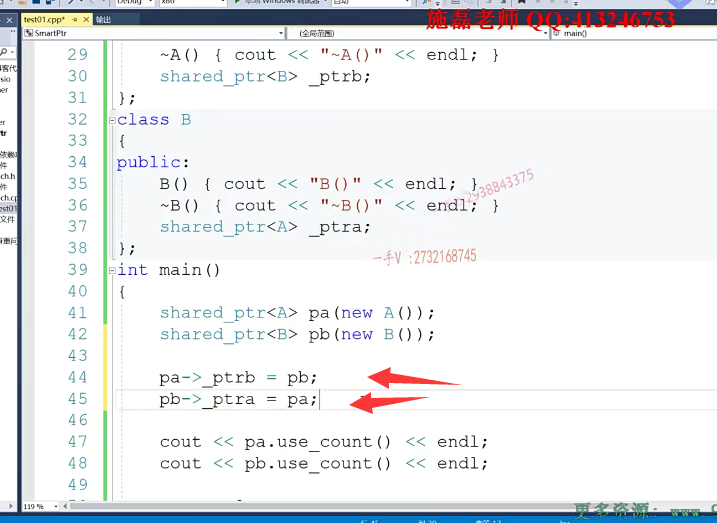

## 出现了问题，内存泄漏

添加了这两行代码。看一看。嗯AB构造了new了a  new 了b

ab构造了出作用域之前 AB两个对象的资源引用计数全都是二。出作用域，大家都是从二减到一，根本达不到系统AB对象的这个条件。引用计数。造成什么问题？

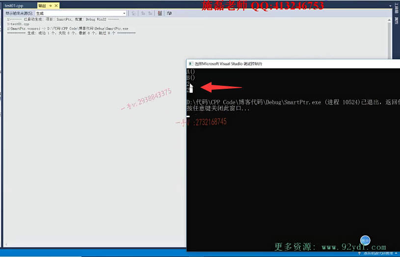

做成对象就new出来的资源无法释放啊，这可是严重的，这个资源泄露问题啊。非常严重，但这里边资源我们用的最多的坑就是堆内存的资源，当然不仅仅包含堆内存。啊，其他的资源也包括比如说文件资源等等。

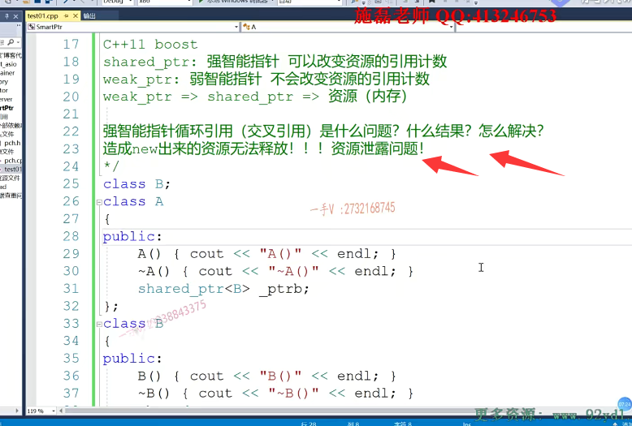

## 画图看一看

这个呢，把这个拿到这个图上去画一画。啊，图上去画一下。这个应该很好看来了。啊。这是首先你有了一个a。对上是扭了一个b。对上有AB两个对象。画两框。

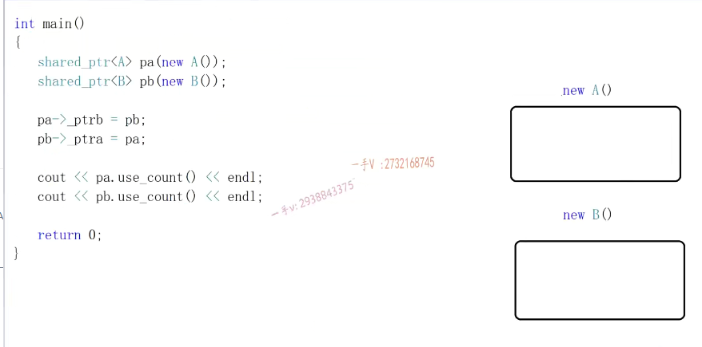

a里边有什么东西呢？呃a里边有一个指向b对象的智能指针。

那b里边有什么东西呢？b里边有一个指向a的智能指针，这是对象内部的。

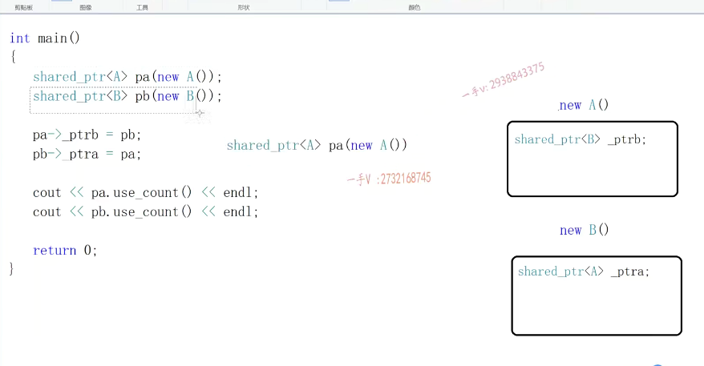

那么现在呢？==这里边有一个这个是栈上的智能指针B。==

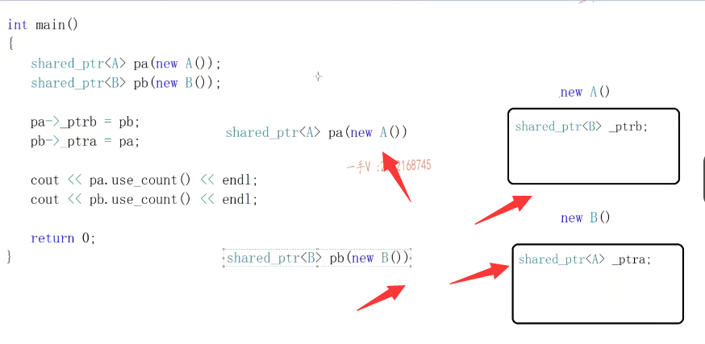

那也就是说呢，而它指向这个。那么，在这里边儿，它们俩的引用计数到目前为止都是1，

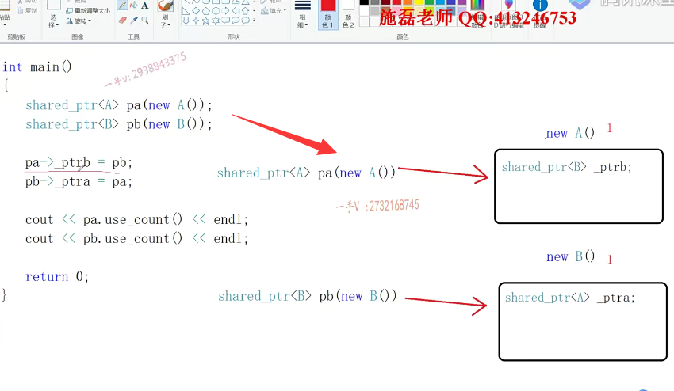

# 第二步

那现在做了这件事情。pa指向的a对象的ptrb。ptrB那也指向PB PB指向的资源，

那也就是这个智能指针。现在也指向b了。

啊，导致b对象的资源计数从一变成二。

在这里边儿，这个PB指向的AB对象，一个指向a对象的智能指针指向这儿。指向a了，所以a的引用系数从一也变成二了。

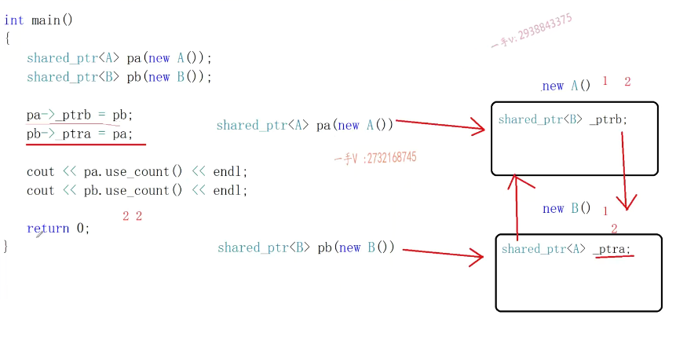

## 问题分析

在这里边儿打印也很能明显看出来，二跟二

所以出作用力的时候，谁先析构后构造，先析构PB，先析构PB析构呢？

只能说是把b对象的资源计数从二减一减到一没到零，析构不了。

这个ppa析构PA析构也使a的对象从资源计数从一从二减一减到一不到零。释放不了，所以这两个对内存就丢了。没有去delete。

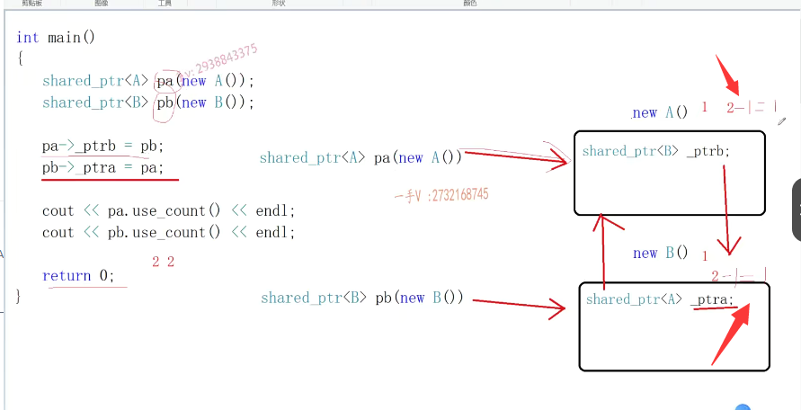

## 如何解决？

所以这是很明显强智能指针的循环引用问题，导致资源无法释放很严重。那如何去解决这个问题呢？

## 解决办法 

## 就是定义对象的时候用强智能指针啊。引用对象的地方使用弱智能指针

我们说啊，我们说我们总结出这一套。

就是定义对象的时候用强智能指针啊。引用对象的地方使用弱智能指针。这是定义对象new嘛，对吧？

这是引用的地方，这里边儿应该用弱智能指针，不要到处都使用强智能制成，小心循环引用。

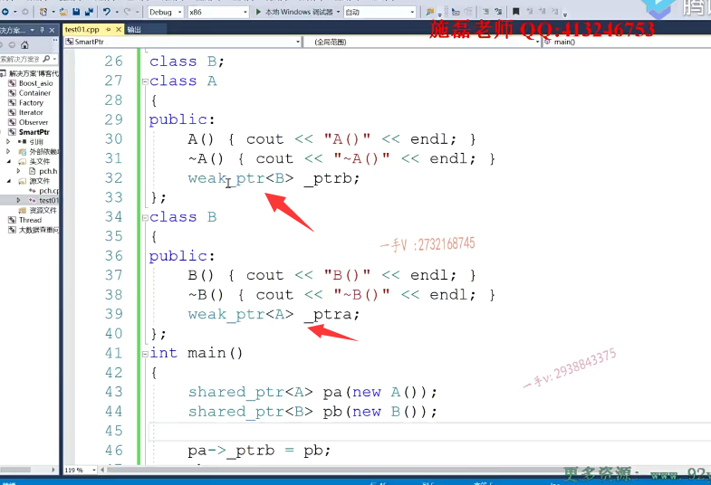

引用的地方，我改成弱智能体称okay再来看。完全没有问题AB对象扭出来AB对象也析构了，释放内存了，出作用域之前它们俩资源基础都是一，

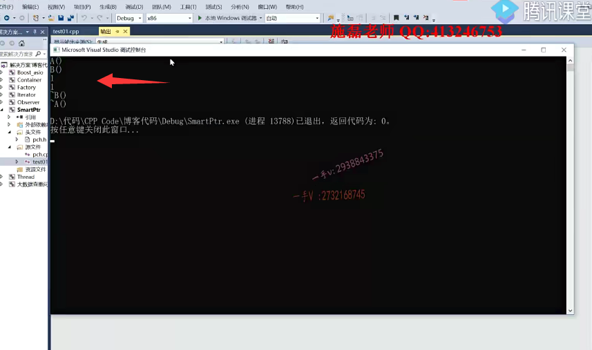

## 分析为什么

为什么会这个样子呢？那么在这里边，我们同样的来看一看，现在呢啊，不同的是这两个地方啊。嗯。

现在不同的是，这两个地方现在都变成了一个。弱智能指针不再是强智能指针了。

## 弱指针只有观察的作用，观察这个对象是否还活着，然后不会改变引用计数

刚才说呢，弱智能的指针有什么好处呢？弱智能指针是不会改变资源的引用计数的。

不会改变资源引用计数的。

那也就是说。在这里边。这是两个定义对象的强制能指针，分别是对象的资源计数为一嘛，这里边虽然说是PA指向的。a对象里边有个成员变量，这个让它指向b对象，但是由于呢，

这是个弱智能指针，弱智能指针只是一个观察的作用，观察这个资源还活着没？所谓的活着，就是资源，计数不不为零嘛，对吧？它不会造成引用计数改变的。啊，这也一样，所以就是说在这儿出作用域之前呢，我们发现它俩都是一和一，那也就是说在这里边儿呢？啊析构的时候PB

先析构PB析过呢，是b的资源就是从一减到零。

b析构释放内存释放PA析构的时候呢，从一减一到零来a析构内存释放。

资源完整的释放的没有任何问题。

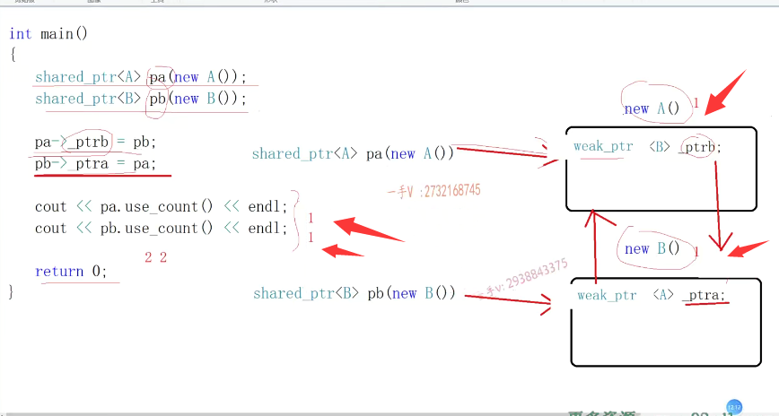

所以呢，在这里边注意这个。是什么问题？就是这这样的问题，造成什么结果？资源泄露，资源无法释放，怎么解决？我们引用对象的地方采用使用弱智能指针啊，

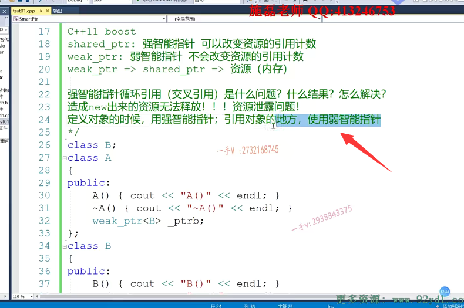

## 现在想通过B类中指向A类的智能指针来指向B类中的方法

## 但是调用不了

那有些同学说呢，弱智能指针OK，弱智能的指针行。

那在这里边呢，假如说我a里边有一个非常好用的方法，叫做test a啊，

啊，那我b这对象里边儿，它有了一个指向a对象的一个智能指针，我并不是白指向的，那也就是说在这里边儿，我可能有这么func一个方法。我想通过你这个指向你a对象的智能指针来调你这个你刚说的这个非常好用的方法。能调用吗？调不了。

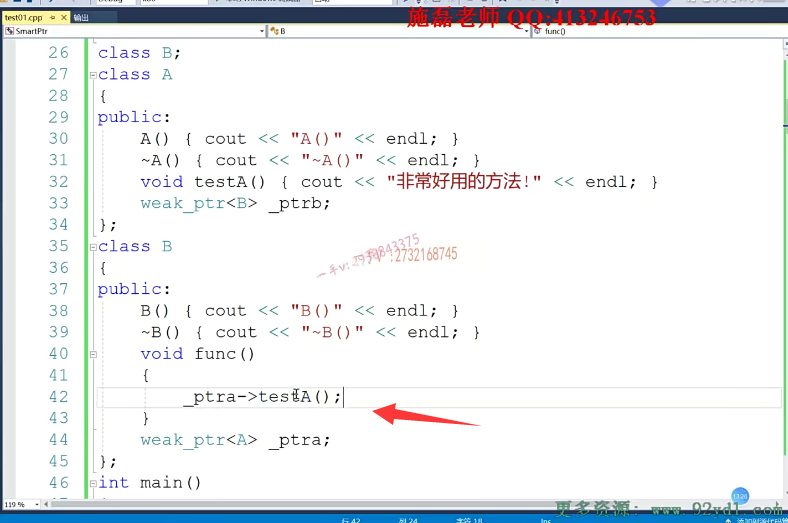

## 弱智能指针没法调用指向的类的函数

## 仅是观察者

没有办法调用。没有办法调用这个代码，我先放着啊，没有办法调用，那为什么呢？那么，

首先呢，搞清楚弱智能指针呢，只是一个观察者，他只会观察资源。

他只会观察资源，他是不能够去使用资源的，

所以呢，弱智能指针。根本就没有提供像 * 运算符重载以及指向符运算符的重载函数，

你不能把它当做一个裸指针来。呃，看待就是完全替代指向功能来看待他就是一个。就观察者一样，他智能观察资源，对资源不会做任何引用计数的改变，他也不能够去访问资源。那你说我拿这个做弱指针，这样干什么用的？又没有什么用处，

## 弱智能指针的使用

当然不如说它没什么用，你使用的时候你必须得这个样子。

## 调用lock()方法转化为强智能指针

==首先呢？得调用弱智能指针的这个就称作一个lock方法啊，不是锁方法啊，是提升方法，把它提升成一个强智能指针。==

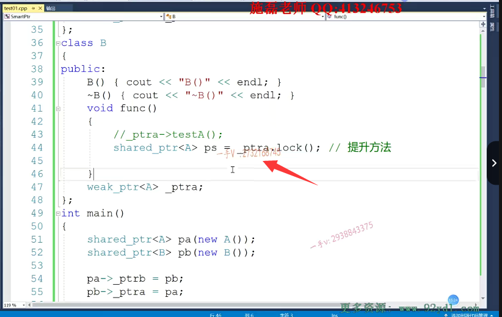

啊，为什么要这样做呢？那大家知道啊，这个过程其实呢，是我们强弱智能指针的第二个引用场景，第二个引用场景。

## 提升过程中可能提升失败，资源释放了，也有可能成功，指针不为空

==啊，第二种就是多线程环境当中，多线程环境当中==，

因为呢，我们弱智能指针呢？在他只是一个观察者，他随着程序的运行，他所观察的资源有可能已经被释放了，有可能没释放，那主要就是根据这个引用计数。是否为零而决定的，那有可能他在想使用这个对象的时候，他要先从一个观察者的角色变成一个强智能指针在这个提升的过程中，有可能提升失败。

资源已经释放了。那有可能提升成功资源还没释放，对吧？所以呢，提升完了以后呢？如果说是提升以后的强制能指针不为空。OK，这也表示提升成功，提升成功变成一个强智能指针，相当于就是给对象的引用计数加一了，相当于一个铁链子一样，把对象拽住了，所以现在也不能去细估它，因为我也是个强智能指针。我也能够去使用它，

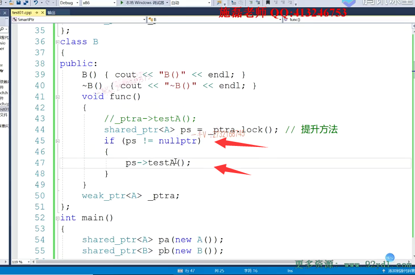

你们谁想吸购你们直接走就行了啊，直接走就行了，我还用它呢，你们不能去释放这个资源。那么shared pdr是提供了逻指针常用的星号运算符重载以及指向符运算符重载的函数，你在这里边就可以调用a对象一个非常好用的方法。

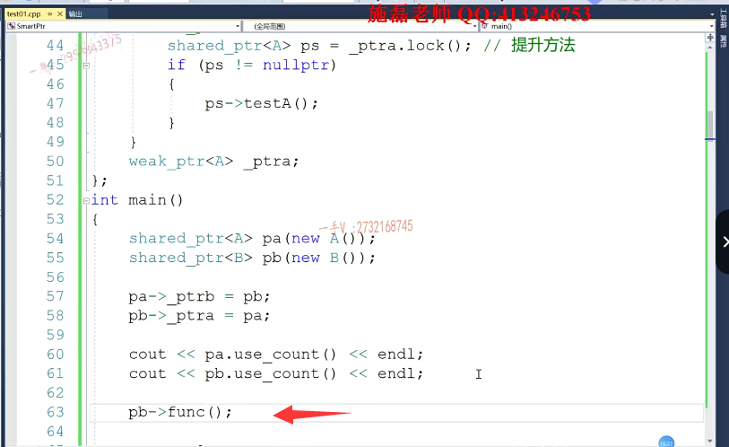

## 分析过程

啊，那比如说在这里讲。pb调用func里边又调用了a对象的一个好用的方法，但是由于你只持有了一个a对象的一个观察者，这个弱智能指针。你首先得提升成强智能指针。提升的过程有可能成功拥成失败，就看资源是否还在。通过提升以后的强制能指针跟空来比较，不为空提升成功，为空提升失败，就这样访问。

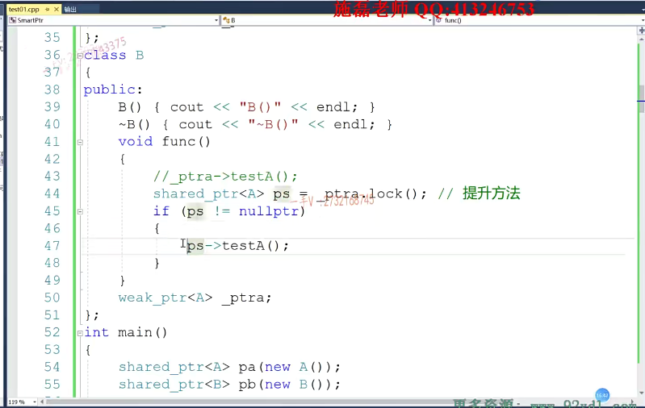

# 最后

这是强弱智能指针的一个经典的一个引用啊，非常好的方法被我们调用了。okay了。这就是强弱智能指针。循环引用的这个。啊，问题就这个案例。希望好好理解一下。

