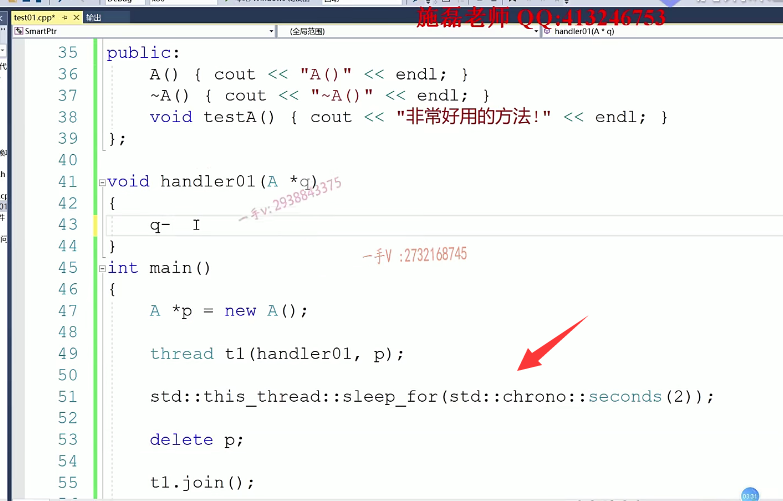

# 多线程访问共享对象的线程安全问题

那么，接下来这部分呢？要讲解这个强弱智能指针另外一个。非他莫属的应用场景啊，

那么。C++里边呢，用C++实现了一个非常著名的开源网络库。啊muduo库这在我的其他的这个博客上也有给大家一个介绍啊，给大家一个介绍非常好。

那在这里边muduo里边大量的使用了这个强化智能指针。

==因为这个muduo库的一个特点就是它是一个。基于reactor模型的一个多线程的一个高性能网络库。==

# 问题

在这里边涉及的一个问题是什么问题呢？

就是多线程，多线程访问共享对象的线程安全问题。

这到底是个什么问题呢？大家跟我来看一下啊，大家跟我来看一下这样一个东西呢，

首先呢，我们。引入一下，我们C++11里边给我们提供的这个threat线程库啊，其实如果这个程序放在linux下，其实用的就是我们系统底层的pthreat库啊。

一模一样。那假如说在这里边a。还是跟刚才一样，把刚才的代码拷贝过来。那在这里边非常简单啊，

非常简单这是a对象的构造，析构以及它一个非常好用的方法啊。

假设一下。我们在main函数里边定义了一个。对象，new a。

然后在这里边我启动了一个线程啊，启动了一个线程。thread.t1那么。

传一个线程函数，传一个线程函数进来啊，传一个线程函数进来，

然后在这儿就是就是一个thread 呃，这个handler 01吧？啊，需要结束一个指针啊，写个q吧。handler 01p传传过来定义线程对象，随着这个对象随随着这个对象的产生，线程也就直接启动了。啊，线程也就直接启动了，

那这里边做的事情呢？我是把这个资源给释放了。

那我在这里边直接模拟我们想要表达的这个主题，多线程访问共享对象线程安全问题啊。

然后在这呢，我来等待一下。这个线程结束handler，这个线程结束。

## 先调用函数让这个线程睡上2秒再删除

在这里边，我想模拟这样的一个问题啊，这样的一个问题，首先呢呃，那么在这个STD this threat，然后它里边的sleep full。stt chronic.clonal啊，然后里边的这个。seconds，我税上的两秒，

我先这样去描述一下，在这里边儿。我让先睡上两秒，再去释放这个资源。

## 运行看一下

那么在这里边，我访问这个a对象的这个好用的方法啊，我觉得呢，应该是比较放心的。

你看a对象。构造的地方非常好，用的方法没有问题，完了主线程睡眠两秒再析构，没有任何问题。在对象构造。跟虚构的这个之间，我调用了对象的方法，那没有任何问题。没问题，

这个new a对象就是线程，就是我们这是我们的main线程，相当于是这是我们的这个子线，子线程。这个a对象就是他们所共享，你把你把这个对象的地址传过去了。

## 不合理的情况

现在如果看看我们假设这样的情况。就是主线程。产生这个a对象。拉起这个线程以后，马上就释放这个a对象了，那么在这里边儿持有了a对象，已经释放了a对象的指针，释放两秒以后，还想访问这个已经析构的对象的一个。方法合适吗？

对象构造已经析构了完了以后，你在另外一个线程去访问这个对象的方法很明显，这个非常的不合理。

因为析构也就意味着我们把这个对象这样的外部资源呢，都已经释放了。你在这个方法里边儿，你有很很有可能你访问你原先的资源，那已经没有了，

因为对象已经析构了，啥也没有了。所以这是很不合理的。

# 解决办法

## 检测a对象是否存活

在这应该是我们q在访问。访问a对象的时候需要侦测一下a对象是否存活？如果a对象存活，那么调用它方法。没有任何非议，那如果a对象已经在其他线程被干掉了，就析构了，那你就不能够再再去调用他的方法了？不能再去调用它的方法了。

这也就是所说的这个多线程访问共享对象的线程安全问题。做线程你都访问共享对象了，

你哪知道这个对象在某一个线程里边儿是不是已经被吸购了？你在另外一个线程还访问他的方法呢？这是很不安全的，在多线程我访问共享对象，一定要侦测这个对象是否存活，

## 怎么检测对象是否存活？

## 强弱智能指针，不使用裸指针

那怎么监测对象是否存活呢？对引用计数。给对象添加引用计数，使用强弱智能指针。

OK，我们把这个问题我们来修改一下，也是我们的强弱智能指针，

首先我们肯定不会使用裸指针了，

在这里边儿。share的ptr用a实例化pi   new a。

大家记着，引用的时候呢，我用一个弱智能指针。哎，引用的时候我说用一个，如果只能就叫pw哎，

## 这里子线程，使用弱智能指针

注意啊，这也就意思是说是我子线程呢，就说是。在这个设计的时候呢，就是我的这个new a这个资源还是由主线程来控制的。我子线程只是引用它。这个对象到时候有的话，我就访问它这个对象，这个它我所观察的资源，到时候没有了，已经被释放析构了，我就不调用它，不访问它的方法。

## 构造的时候，线程就放进去弱智能指针

如果说你这个子线程也是一定要访问那个对象，那你就可以用强智能指针来接受，因为强制能指针会引起对象的引用技术改变。对吧啊，那单就这个问题，我们来这样子解决一下。那当然，这这这。要构造一个弱智能指针，哎，要给线程扔一个弱智能指针进来。

## 不需要delete，但是这里是等待子线程结束，那么我们这里加上一个作用域

好了。那你看一下这种情况，那在这我们当然不能delete个p了，

因为现在是智能指针，帮我们做这个资源释放，由于在这里边是等待子线程结束，那么shared ptr是出作用域才析构，那我们给它加一个作用域。

因为这里边是阻塞等待子线程结束了，对吧？阻塞等待子线程结束了啊，所以在这里边必须得出个作用域才能引起智能指针的析构啊。

## 弱智能指针调用方法代码编写，转化为强智能指针

看一下，在这里边。

我现在用弱智能指针，

首先想通过弱智能指针访问a对象，首先一定要把它先通过lock方法提升城墙智能指针提升的过程中，就是在监测资源的引用技术，如果。不为零资源还存活，如果为零资源已经释放，所以不等于难，咱们资源还存活，存活的话，我用强智能指针调用。一对象的好用的方法。就这样的一个过程，那么else表示什么呢？就是。a对象已经析构。不能再进行，不能再访问啊，就是这样的一个过程。这样的一个过程。

## 执行前，还需要改下，

我们来执行一下，看是否是我们预期产生的t1啊，这里边已经。好对，在这里边已经不是我们的。在这里边儿，已经是一个什么东线程结束，对吧？等待子线程结束的话，在这里边儿，

这现在是一个局部作用域。那是这样吧，在这里边我就嗯，首先呢，你不等待子线程结束了，没线程早就走了。

需要把子线程呢，这是我们呃，需要把这个主线程是不是要等一会儿啊？等会儿。别直接走了，等上个20秒吧，那也就是说在这里边相当于就是主线程。生成资源。生成资源，

然后启动线程，启动线程完了以后呢？在这等待20秒去观察一下运行的结果嘛，对吧？啊，这一上来就睡眠两秒。==那么，这个对象早已经析构了，看还会不会调用a对象的资源？==

## 没有join的话，需要设置detach分离线程，让子线程回收自己的资源

aboard呃，aboard being called这里，等一会说这个。哎，我看看这个是个什么问题啊，这个应该是要没有join的话，

就是要设置线程是一个detach分离线程看看。

好了，就是这个原因啊。

对象构造析构啊，已经析构了，不能再访问，这是幂函数在运行在在在等待20秒呃，等待二十二十秒啊，睡眠20秒。

okay，那你比如说呢？你的。让我这儿等，让我主线程等等二等两秒以后再出装与吸口a对象，那这子线程应该很快就能访问到a对象了。

## 如果让我们主线程再等2秒，来看看，这样我们a对象没有被析构，应该能调用函数

我们来看一下。A构造非常好用的方法，调用完方法以后呢，出现这种析构a对象，它在这里面说明它观察a对象还活着。

所以呢，这就是强弱智能指针解决的另外一个问题，就是在多线程访问共享对象的一个线程安全问题。它解决的非常的好，它非常适合这种场景的这个。应用啊，非常适合这种场景的这个应用。有兴趣的话可以留意这个后边儿的，我对C++非常这个好的一个muduo库的一个源码的剖析在里边儿，还可以看到很多对于强弱智能指针的一个应用。

啊，因为它就是一个基于这个多线程的一个高性能的网络库，所以呢，如何解决多线程访问，共享对待线程安全问题，用强化智能指针。shared_ptr和weak_ptr解决这个问题非常完美，因为它可以在线程里边儿通过对象的资源，技术来监测对象的设备。生存状态。好，这部分先到这里。