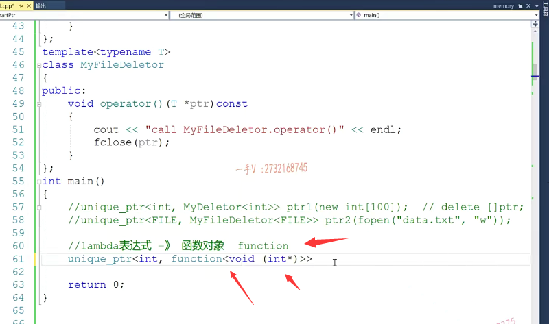

# 第四节课

## 智能指针的删除器

好了，那个同学们，最后这个智能指针呢？最后这一部分呢？我们就来看一下这个。

智能指针的这个删除器啊，智能指针的删除器。

呃，删除器就是delete对吧？什么叫智能指针的删除器呢？为什么要给这个智能指针要定义删除器？

那大家都知道啊。智能指针，==它本身的这个智能指针啊，它最重要的一个作用呢，就是能够啊，能够保证资源啊绝对的放啊？==

对，那么释放资源呢？我们前边儿这个包括自己实现的这个智能指针，还有库里边儿的这个智能指针，默认的这个释放资源的方式。都是。delete都是delete啊，都是delete，

==那么并不是所有的资源呢，都是通过delete。这个指针的方式来进行释放，==

比如说。数组的话，==我用智能指针来托管一个数组的资源的话呢delete跟这个指针中间就得加个中括号了==。

那又比如说我现在用智能指针管理的，并不是一块儿内存的资源，而是一个文件资源啊，或者说是其他资源。那么，释放文件的方式绝对也是不可能用delete来释放的，

所以呢，用我们智能指针再来管理，除了我们这个普通的，我们之前见到的这个堆内存之外的其他资源的时候。我们==如何给这个智能指针来自定义删除器来指导智能指针正确的去释放资源呢？==

这就是我们这一部分要看的这个删除器啊，要看的这个删除器，因为库里边儿呢。那么，同学们可以这个。看一下啊，看一下我们的这个库里边的这个。==unique ptr和这个share的ptr这两个智能指针呢？这是一个不带引用技术的，这是一个带引用技术的，它们都是可以提供这个自定义的这个删除器啊，自定义删除器。==

那么。如果呢，同学们去浏览一下它的这个源码呢啊，如果同学们能够浏览一下它的源码。你会看到呢，在它的这个==在这个智能指针的这个析构函数里边啊==，在智能指针的这个析构函数里边，

## 函数对象的定义

其实呢是对一个函数对象的调用啊，函数对象。带有小括号运算和重整函数的对象叫函数对象，

对吧？通过这个函数对象的调用就是deletor。哎，然后把我们的这个指针。传进去那么，这相当于deletor调用了。它的小括号运算符重整函数啊。这个指针转进去了，

## 默认的deletor编写

那么这个默认的这个deletor呢？是这个样子的，大家来看一下class。dele TOR啊，默认的这个deleter呢，它其实呢就是我们。刚才说的。

void operator t*ptr。那么。大家来看一下。ptr.大家来看，这就是我们这个C++标准库里边儿给这个智能指针定义的默认的这个删除器啊，

那么这个delet0r呢对象就是我们这个默认deletor类型啊，定义的一个。函数对象，这个对象呢，调用自己的小括号运算符重载呢啊，就是调用这个函数把指针传进来，它默认删除释放资源的方式。就是delete。对吧，就是delete啊，

当然了，如果说是我们呢，想要自定义我们资源的释放方式的话，我们可以给它提供一个相应的这么一个函数对象的类型就可以了。

## 整形的资源但是我们这里是整形的数组，资源不对等

比如说。unique ptr在这里边，我管理的是一个整形ptr1。new int.啊，在这里边呢。我让我的这个智能指针管理了一个整形的数组啊，整形的数组，

那对于数组的释放来说呢，是不是应该是这样的一个样子？

这样的一个方式，那么此时呢，它默认的这个释放方式呢，就跟我们资源的开辟呢？资源的分配跟资源的释放就不对等了，

## 如何解决？

对吧？那这时候呢？我们该怎么办呢啊？

我们方法之一，我们当然是可以提供这样的一个资源释放的my deletor的。我们定了一个public啊，void  operator T*ptr。

那么在这里边呢，我们给它去写一下，那这个应该是delete中括号ptr。释放资源的方式。

啊，那在这里边呢，我们就可以我们看一下unique ptr的源码，你看它有两个模板类型参数，一个是。它所管理的这个资源啊，所存储的元素的类型，第二个就是删除器，它默认的就是一个default。delete啊，

default delete用这么一个类型，就是我们在这里边给大家写的这个delete啊，

它里边是。default default .

default delete相当于是这么一个样子，那我们现在制定了一个这个东西，那我们给它传到它相应的这个类型里面去。啊，穿到相应的这个类型里边去。

那么在这儿，我们借助cout，我们打印一下，看是否调用了我们自定义的my deleter底下的这个。operator.小括号运算符的重载函数进行一个数组资源的释放呢，我们来看一下。

## 出了个小问题，忘记放入int类型，实例化mydeletor

嗯。在这里边。我们有一个啊，在这儿，我们这里边儿需要一个类型，我们不可能只给一个模板，对吧？既然在这里边儿，我们用整形来实例化这个智能指针，当然也要用一个整形来实例化这个my dilator。我们传一个函数对象的这个类型进来，是不是啊？因为这个尖括号里边需要的是类型。我们刚才只传了一个模板，连进去不正确。

好了，大家来看一下啊，此时呢？我们程序的这个运行结果有了，我们刚才加的这一句打印call my deleter operator小括号。

## 说明我们自定义删除器用到了

这什么意思呢？这就是说呢，当我们这个栈上的智能指针出作用域的时候，调用智能指针析构函数的时候，哎，再去看析构函数里边儿了。它现在这个函数对象类型就是我们传入的这个my deleter类型的，所以它在这里边调用了小括号运算符重载函数。调用的也是我们这里边买deleter的这个小括号运算符的重载函数。OK，

那么在这儿呢？我们证明我们这里边使用的这个东西呢，就被用到了啊，就被用到了。

## 使用智能指针管理文件资源

那么你当然也可以。嗯。unique ptr啊，这个unique ptr 

unique ptr的话，我们比如说我们管理一个文件啊ptr 2，那在这呢。我们是fopen啊！

==fopen f open的话呢？比如说data.txt。以写的方式进行打开，==

那么这是管理的，是一个文件资源，当然结果不能用delete来释放了。

所以在这儿呢，我可能要写一个自定义的这个my file delete。

==对吧，那在这当然就不是这个delete了，应该是用f close ptr.啊，释放于文件资源，因为我这个函数对象类型就是专门接收于文件指针类型的啊，对于文件的资源的释放，我们就是调用f close。==

那在这呢，当然我也需要自定义。删除器的类型了。对吧？啊，这个都是fail，那到时候用fail。来实例化，我们的这个my few day later。知道吧，那在这儿呢，就能够进行一个正确的文件资源的这个释放啊，我们也像上面这个呃一样，加一个打印。my few day later好了。

## 后构造的先析构，所以打印在前面

看一下这个运行的这个结果。

啊，没有问题，call my few dilator这个都打印到了吧？啊，这个一跟我们以前学的一样嘛，先构造的，后析构后构造的，先析构对吧，因为这里边ptr先析构。所以就我们这一句打印在上边儿，后来才是ptr 1析构，用我们这一句打印在下边。啊，在下边好了。

## 自定义删除器不太好

那么这个就是删除器的意思，写到这儿，大家应该都能明白啊，都能明白这个为什么要给智能指针去定义删除器？

但是呢，同学们很明显这种方式呢，好不好啊？不太好不太好。

首先呢，这个什么东西呢？就是我们为了在这里边儿自定义删除器，我们首先还得需要先定一个模板类型。啊，需要定一个类型。那么，

这个类型定义好了以后呢？我们仅仅就使用在。诶，这个智能指针定义的这个语句当中，其他地方我们再也使用不到这个my file delete或者是my deletor。啊，但是呢，我们把这两个类型写到这儿，以后呢，我们这两个类就一直存在到这儿，不管你用不用，它都存在到我们源码上，其实呢？这个东西呢，就跟我们的这个临时量一样，而我们它它的是应用呢，只出现在这条语句当中。啊。那么，

## 解决办法

## 

有没有什么方法可以让我们只在只直接在语句当中去指定？我们自定义的删除器而不用啰里啰嗦的定义这两个。这个类型出来看我这类型的名字，要是多了以后我都不知道该怎么起了，都是delete啊，都前面要加一个形容。加加一个形容词，这这这是文件的deleter，这个是我们数组资源的deleter啊。就比较混乱类太多了。那么。

## lambda表达式

同学们应该能想出来啊，在我们C++11标准以后呢，==我们提供了一个lambda表达式。==啊，非常强悍的==lambda表达式来定义我们这个之前标准中的这个函数对象==。

啊，函数对象非常的灵活啊，非常的灵活，那么;ambda这个表达式呢，它只是应用在这个语句当中。当然了，这个定义。智能指针的时候需要指定啊，删除器的类型，

但是我们只拥有兰布达表达式的对象，那兰布达表达式的对象的类型如何确定呢？当然，这也是我们。C++11标准里边儿给我们提供的方式，函数对象类型，所以我们通过这个方式，函数对象类型就可以留下我们。lambda表达式啊的类型了，

## 使用function  和 lambad表达式来描述

那么在这里边简单的给大家把上面的两个例子呢，给大家用这个function跟lambda表达式来重做一下。我们感受一下新标准给我们带来的一些好处啊。这是unique_ptr整形。function这个也需要，你要用这个函数对象就得包含functional函数对象的头文件啊。

function 这里边写函数的类型。函数的类型，

## lambda表达式 返回值 void 参数int*

其实呢，这个lambda表达式呢，就是我们刚才在这儿写的这些删除写的小括号运算和重载函数，对吧？那这一些。函数的类型是什么呢？当然是返回值是void。

啊，这个有参数，有几个参数呢有？一个参数有一个整形指针，

这么一个参数的。函数对象类型啊，那在这里边我们定义了这个ptr 1我们就可以new int中括号100哎，

## 对象传好了，传自定义的删除器

然后我们在第二个参数里边呢，就可以给它传入。我们自定义的删除器的对象，那么在这里边儿，我们来传一下星t啊void。好在这。那在这里边呢，就是delete。中括号p了。啊，delete中括号RP了就是。

这就是我们lambda表达式这个中括号。是获取外部变量的，这里边儿是它的这个参数列表，这个指向的后边儿呢，就是我们兰布达表达式呢，返回值，其实这里边儿兰布达表达式。本身就是函数对象啊，本身就是函数对象，你可以把这个lambda表达式呢，看作就是我们这里边儿小括号运算符重载。

## lambda表达式看作就是小括号运算符重载。

在里头好了，那在这我们同样的去打印一下啊，打印一下。打印下我们的这个。这是通过调用lamb d lambda的表达式。这个释放release。这个资源。对的吧啊那。运行一下。

好，大家看call lambda release哎，这就证明呢，在这里边儿资源这这个智能指针对象出作用，以后呢，资源的释放就是通过这样的方式释放的。那下边儿就是一模一样的啦，那在这里边儿ptr 2在这儿，

文件类型 lambda表达式

我们是传接触的是一个文件指针对吧？那在这里边呢，我们。哎，开辟的这个资源也是这个文件资源啊，文件资源这里边儿是一个file类型的一个指针。那么，这个资源呢？我们也得改一改fopen，我们这不是打印个f open就行了，一个文件资源啊。那当然，在这里边也就不是p了，是delete p了，是f close.大家看一下。就是这个样子，

出了个小问题，int 类型改为 file类型

我们。运行一下。嗯，在这里边有一点问题是吧？有一点问题。呃，这个是个什么问题呢？我们看一下这个打印啊。无法将参数一从f星转为int星啊，在这里边呢，我们的类型填错了，是file类型。

好了，大家看到都调用了，我们自定义的lambda表达式来去释放我们资源，

# 总结

## 使用lambda表达式构造函数对象，充当自定义删除器的好处

## 知道了智能指针后面也能加上删除器的操作

这个好处是我们不用定义这么啰里啰嗦的这么一些类型。很庞大。啊，很庞大，

定义了这么多东西了，写这么多代码，其实呢，其中呢，就是这么核心的，这个代码就是这么点儿，对吧？

那么，这个就达到我们刚才的目的了啊，我们使用了这个lambda这个函数对象啊，就从就在当前这个语句中使用一下就完了。啊，使用一下就完了，其他地方呢，我们也不需要用它，那也不用见着它，也不用事先定义好。啊啊，我们代码类太多呢，不见得是一件好事情啊，容易搞得乱七八糟的，非常难以管理啊，非常难以管理。

这也是用function和lambda表达式呢，在做这个。删除器的时候呢，就非常非常的灵活了啊。好了，这里边就给大家把这个智能指针的这个删除器给大家介绍了一下。