## 绑定器和函数对象的用法

大家好，从这一部分开始呢，我们主要说一下啊，就是这个C++里边比较高级的一些用法，就是绑定器啊，绑定器和函数对象。绑定器和函数对象啊。那么，我们先来了解一下啊，这个函数对象，我们在这个C++的这个精品课程啊，这个免费的精品课程部分呢，也给大家已经说了什么叫函数对象，就是这个对象呢？拥有小括号运算符重载函数，

那么这个对象呢？使用起来跟函数调用特别相似啊，拥有小括号运算符重载函数的对象，我们就称作函数对象，对吧？绑定器在CA将stl这个标注模板库中啊，人家绑定器已经给你提供了，就是办的first和办的second。啊，绑定器。对吧，这是呢，把这个函数对象的。相当于就是把这个小括号运算符重载函数。的的第一个形参变量绑定成一个确定的值。

那这个半的呢？相对应的啊，相对应的，这是把我们的这个小括号运算符重载函数啊的第二个参数。第二个参数，第二个形参变量绑定成一个确定的值。那么绑定器呢？有绑定器的好处啊，有绑定器的好处，我们一会儿来看，但是呢，这两个绑定器，毕竟他提供的功能啊，有一些简单。我们更复杂一些的应用场景的话呢，

他们根本起不了什么作用，帮不了忙啊

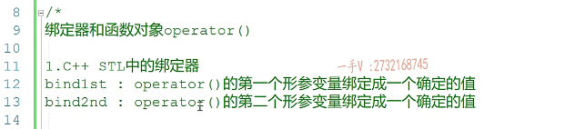

所以呢，在我们C++幺幺啊，我们c加111呢，是从这个一个CA。最佳的库boost的库中呢？库中引入了这个半个和方程机制，半个绑定器和方程函数对象。啊，函数对象函数对象。机制啊，那我们第二部分我们主要就看一下这个c++11，从boost库里边拿出来的这个半的绑定器跟方程函数对象啊。有什么不同的地方啊，

他们强带在哪哪里，然后呢，我们先应用，应用完了以后呢，我们再剖析一下他底层的一些原理。那么最后呢，我们会给大家再讲一下兰布达表达式啊，兰布达表达式呢，其实呢，底层啊。底层就是依赖函数对象的机制实现。啊，就是依赖函数对象的机制实现，只不过使用起来会更方便啊，更方便我们到时候讲的时候呢，

再给大家详细的去说一下啊，详细的去说一下。好，这就是呢，我们这一部分呢，大家需要掌握的内容就是我们能够熟悉函数对象绑定器的应用，以及我们能够通过我们自己写代码。实现他们的底层来了解一下他们底层的一个应用原理。好。

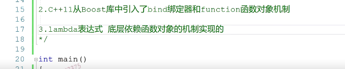

好。那么在这里边呢，我们先开始讲这个绑定器啊，要讲这个绑定器呢，我们呢就得用一下我们stl库里边的一些东西了。啊。那么，

还有我们的泛型算法，这是我包含了vector容器这里边呢，这个头文件里边有我们所有的C++库的函数对象。这个呢，包含了我们所有C++库里边的这个泛型算法啊，泛型算法。

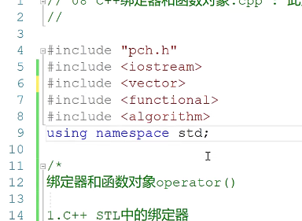

## 举个例子

我们看一下一个应用事例啊，我们看一下一个应用事例。在这儿呢，我们先定义一个vector啊，定义vector容器，我们可以呢，在这包含一下。

这个C盘头文件啊。在这种一个随机数的种子。然后呢，在这我们循环一下。循环20加加I啊20啊20。然后给vec里边呢放一些元素，随机数啊，摸上1到100之间的随机数。好。那么在这里边，他肯定是随机出来的，数字并不是有序的。是吧啊，并不是这个有序的，好在这儿呢，

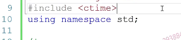

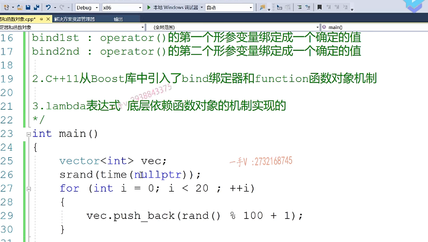

我们先调用我们算成算法sort vec的begin。VC的end传一个起始跟末尾的迭代器。我们就可以把这个容器呢，这两个迭代器区间里边所有元素呢，他是默认啊默认小到。大小到大排序。

对吧啊，默认是小到大排序的啊，在这我们可以写一个方法吧。就是专门用来输出容器的元素啊，show container啊，show container，这里边是我容器的类型吧啊。那么container CON。啊，

我们写简单一点用，其实也就是用迭代器啊，那我们可以直接也直接用迭代器吧a=CON。n的beginfor循环at不等于CON的end。啊，还有一个加加it。加加it，然后在这里边，我们来打印一下新it。啊，然后在这呢，我们再输出一个回车。

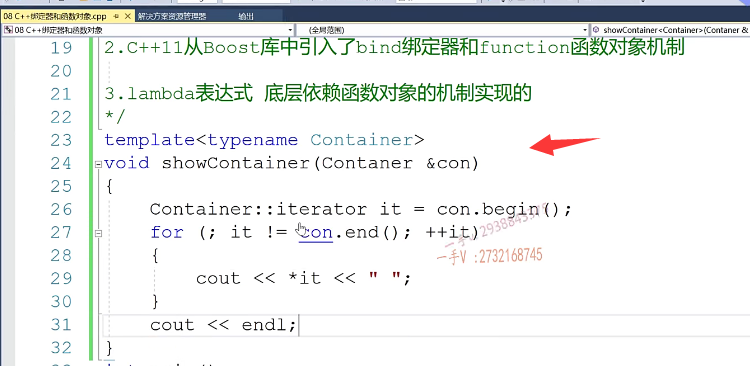

OK，我们来看一下啊，看一下说container。

这我先受一下content vec啊vec。好吧啊，然后完了以后呢，再在底下再show一下。运行一下，我们这个程序。

们这个程序。这个是未声明的标志符，拼的不太正确啊。container.还有错误，我们来再来看一下，这个错误是什么啊？这个错误的提示是？标识符预期的为一个分号是吧？呃，

我们来看看啊，看看。那在我们这个里边，==他可能认为呢，就是从上到下编译的时候呢？因为这个类型还没有实例化，对吧==？所以不知道呢，我们看先先看一下，加个这个我们之前学过的这个t是不是？这个意思啊。啊，果然是的啊。好在这的原因很明显啊，从上到下编译这个代码的时候呢，

==就是因为这个类型还没有实例化==，对吧？所以呢，他不知道编译器，不知道这里。这个类型这这这个名字后边套的这个作用域套的这个东西到底是个类型还是个变量，他不知道。是不是啊？如果类型呢？他可以定义变量的，如果本身就是个变量，那就不行了啊，所以在这里边呢，我们需要加一个typename。啊，

就告知我们编辑啊，我这后边这类型作用，底下的这个绝对是一个类型啊，告知他后边这是一个类型。因为代码是从上往下编译的是的吧啊，

==其实呢，这个问题在我们之前的就是编译器里边是不会出现问题的啊==，因为我们的这个括号里边这个代码。只有当我们这个函数实例化的时候，才会变异的，而实例化的时候，那个container类型我肯定就知道了。但是现在从VS后边比较新的版本，他对这个代码都要进行一个检查，所以呢，

前面要加一个tab name啊linux下，你再用j加加编译我们的C加加代码，这也是要加tab name。==也就是说呢，这儿都要告知明确的告知编译器，哎，将来我用不管用什么类型实例化。啊。因为我不管用什么类型，指的是我不管用什么容器类型实例化==，这个类型参数嘛，对吧？他里边都有一个aterritor给电器类型。好的吧行，那在这呢，

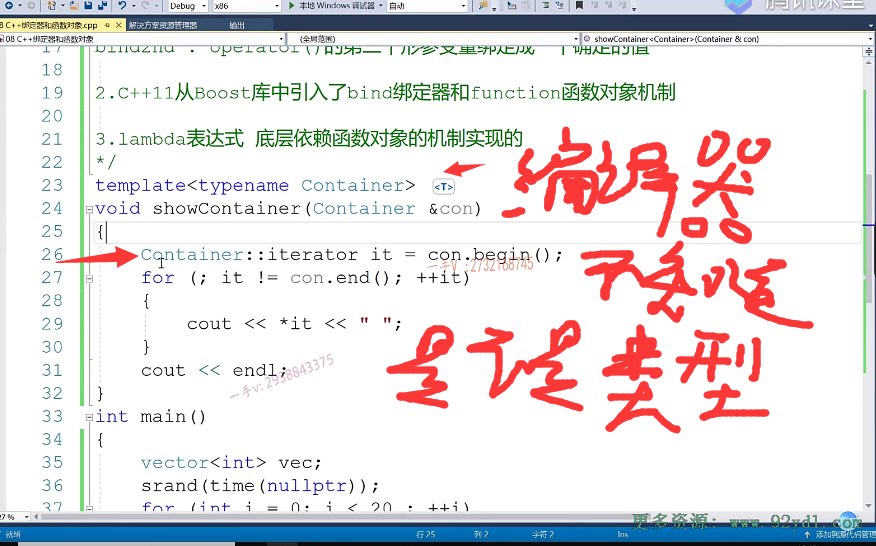

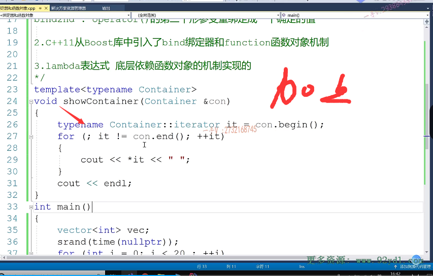

好的吧行，那在这呢，

我们来直接执行一下。第一次输出的是一个乱序的啊，然后在这输出一个小到大啊，小到大排序的。

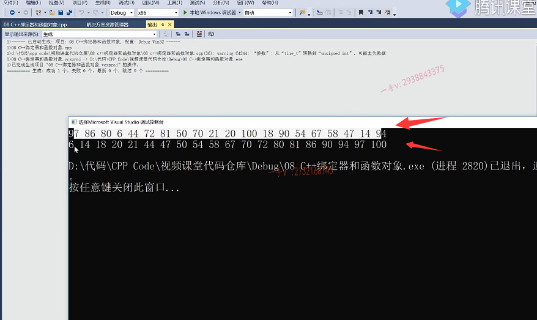

## greater<>()

那我们还可以在这里边啊，调用算法的承载版本。调用sort的重载版本啊，我们给他传一个great。还有没有记得啊？这个great是什么？首先great他是一个函数对象啊，函数对象对吧？==他是一个二元函数对象。==

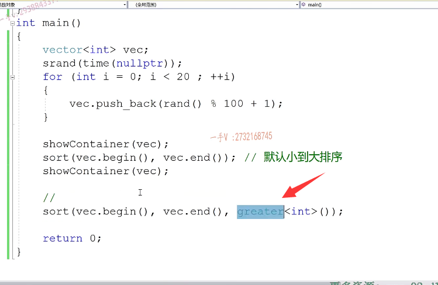

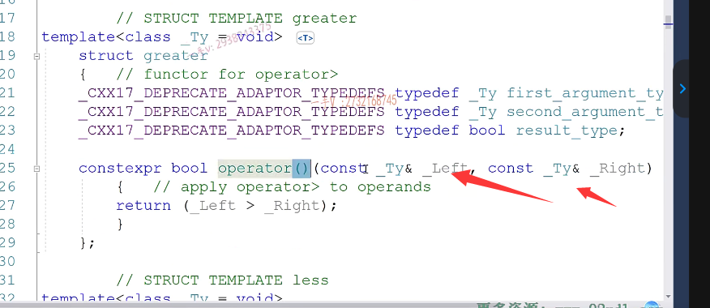

他是一个二元函数对象。我们来看一下他的小括号运算符重载函数呢，是有两个参数，

他比较是大于。我们库里边儿一般默认啊，跟排序有关的就是定制排序的方式，他默认用的都是这个less就比较小于我们现在呢，想改变一下他的排序的方式啊。我

现在用一个great，这里边肯定需要一个二元函数对象啊。肯定需要一个二元函数对象，这里边肯定需要一个二元函数对象，因为不管你用什么排序，是不是不管你用什么排序？啊，那么你在这里边啊，都得需要两个元素之间一一进行比较嘛。是不是啊？

然一次需要两个元素，从容器拿两个元素进行比较，那肯定就需要一个二元函数对象。啊好，在这呢我们。排完序以后。我们再加一个打印。这个现在就从大到小进行排序了。是不是？

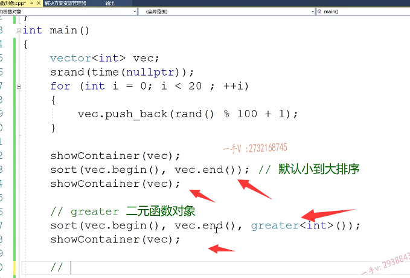

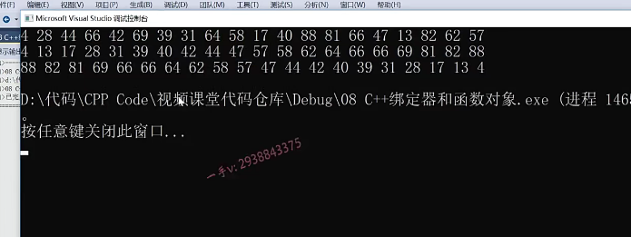

我们现在有这么一个功能啊，有这么一个功能，我们现在上边是大到小排序的啊，大到小排序这个是大。到小排序。那大到小排序了以后，

再就是我们有这么一个功能，就是把70按序。按顺序插入到vector容器当中。把70按顺序插入到vector容器当中。那在这里边呢？那也就是说，我们得需要在上边这个vector大到小排序的vector里边找第一个小于零。就是找第一个小于70的数字。对了吧唉，那泛型算法里边有find_if条件的查询，先给一个迭代器的区间。那么你注意他第三个就需要一个函数对象。那你首先想一想啊，他需要一个一元函数对象，还是需要一个二元的函数对象呢？

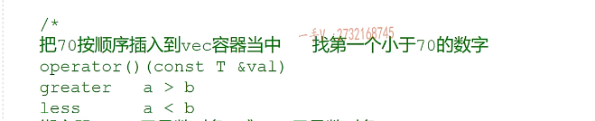

大家考虑一下。这里边需要的是一个几元的函数对象。他一次需要从容器中拿几个元素出来，对这里边需要一个一元函数对象。一元函数对象就是他的小括号运算符重载呢，只需要接收一个参数。只需要接受一个参数，那从容器里边拿一个数据跟谁比，跟我们指定的70进行比较。所以呢，唉，所以呢，我们在这儿没办法直接使用库里边的这个函数对象great less呀，greater equal啊，less equal，

==因为这些函数对象库里边提供的。都是几源的呀？他都是二元的。都是二元。==啊，都是二元。那也就是说，这里边==我们需要一个一元的函数对象==，但是库里边却只有二元的啊。那我们应该怎么去处理呢？

## 绑定器

啊，那么看一下，这里边就引入了这个绑定器啊，办的first跟办的second。如果你用greater的话啊，

他比较的是a大于b，他比较大于如果你用less的话呢，他比较的是a小于b。绑定器，他的这个功能就是绑定器加上二元函数对象就可以得到一个一元。元函数对象。我理解了啊，这个怎么理解？大家来看一下啊，

大家来看一下办的first吗？我们的这个great，你看这个great啊。呢他是不是有两个？这个小括号运算符重载函数呢？有几个参数啊？

有两个参数，那我们办的first，我们就可以把他第一个参数绑定成给他绑定成多少啊？绑定成70，那这样一来是不是也就意味着我们这个greater现在这个函数对象就只需要一个参数了，是不是就间接的变成了一个一元函数对象了？要找小于70的嘛，所以我们绑定a嘛。啊，所以加加。就可以得到我们想要的这个一元函数对象。我们找小于70的，那对于如果要使用less的话，我们就可以bind_second把第二个参数给它绑定成70。b绑定成70就是找第一个小于70的。那也就是说这个。left啊，现在我只需要你接受一个参数，因为第二个参数已经被绑定成70了

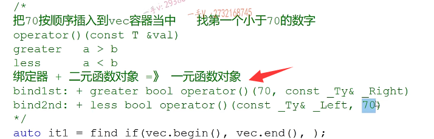

好了吧，我们来先看一下啊，先看一下，可能有些同学呢，还是觉得有点抽象啊，find first这是传great。这是传一个二元函数对象进来。那么，再传一个他绑定的值绑定谁呢？绑定70。唉，

这整个就得到了一个一元函数对象。方需要的是一个一元函数对象，你看最终呢？给这个函数对象呢？唉，给这个函数对象呢，对吧？的小括号运算符重载函数里边。他传了容器里边的一个元素过来了。那这个意思就是说找到这个元素的话，返回替代器找不着就返回end了嘛，如果不等于end就表示找到了，你找到的话我就给相应的位置插入一个元素嘛。插入谁呀？插入。

是不是70啊啊？这样就把70按序呢？就插入到我们容器当中了，我们来看一下是不是这个样子？哦，有问题啊，好，我们来看一下。啊，这个写的有这个写的有这个不对啊，不对，我们可能刚写差了。你要把这个。这是括号在外边，这是个对象嘛，

对不对？这是个对象啊，这是个对象，不要写错了啊，手误。好运行了以后，大家来看我们有没有把这个70诶我们看一下啊，这个70有没有插进去呀？找第一个小于70的，是不是元素啊啊？如果不等于表示找到了，然后给这个位置是不是插入一个70哦？我们把刚才那个打印呢，给人家去掉啊。好了，

你看一下这个70现在有没有暗区插进来啊有

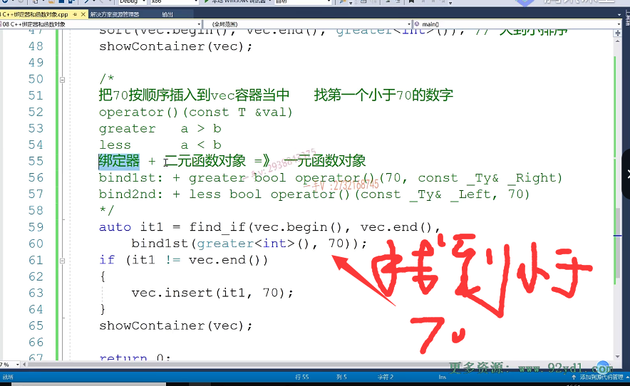

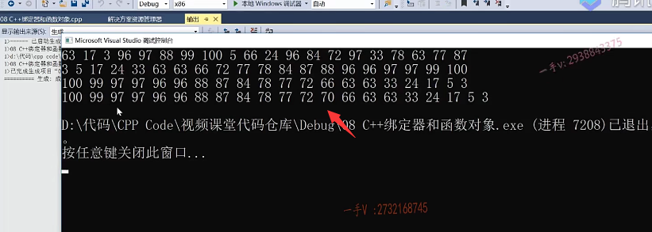

==我们C++sl库里边这个绑定器可以把一个二元函数对象给他转成一个一元函数对象==。啊，你用这个也行。你用这个也可以，就是办的second。加上匹配上less。因为他greater比较大于嘛less比较小于嘛，你现在要找小于70的数字嘛，你看你看顺序那greater的话，你就绑定第一个参数less的话，你就绑定第二个参数，因为它要找小于的关系呢。是不是啊？这个肯定也可以的。那我依然可以把70呢按序插入到我们的。

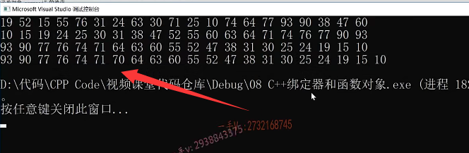

容器当中啊。对不对的啊？就是这个样子的。这里边给大家演示了一下，我们绑定器啊，我们绑定器的这么一个用法啊，绑定器这么一个用法。其实他底层实现还是一个函数对象。好，那么这节课呢？先给大家把问题引入出来啊，引入出来，

那么在这呢我们。用find f想做这件事情的时候啊，我们就需要用到这个绑定器了。这个绑定器啊，底层到底是怎么实现的？对吧？我们下节课来，我们自己呢？把这个绑定器和函数对象实现一下，这节课就先到这里。

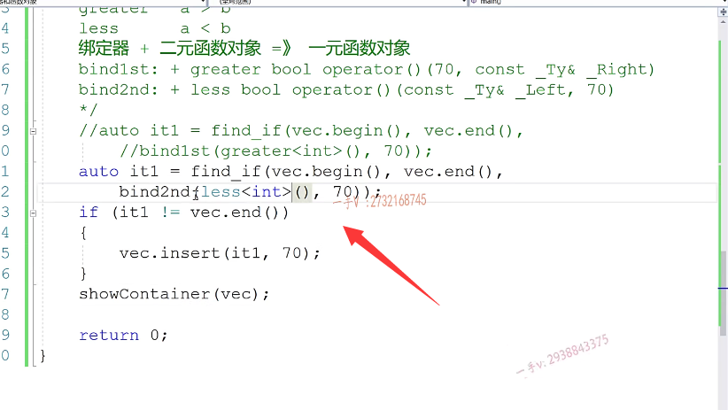

