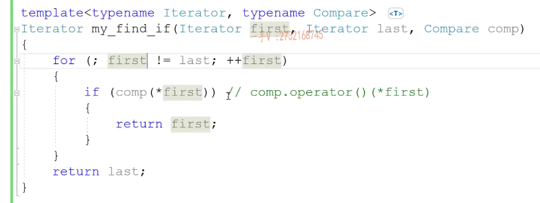
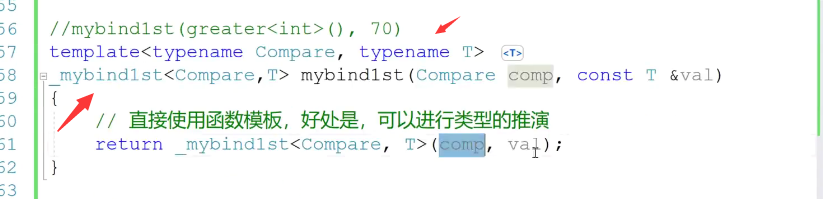
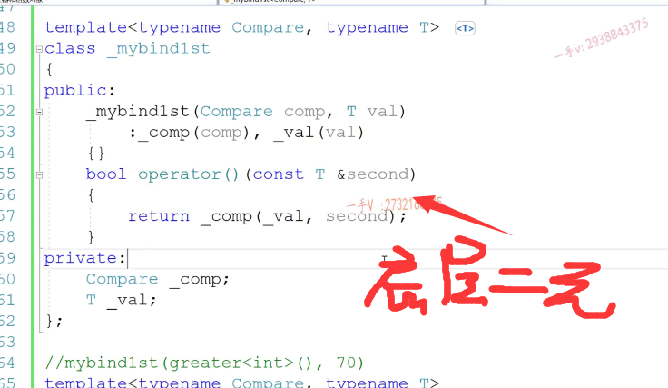
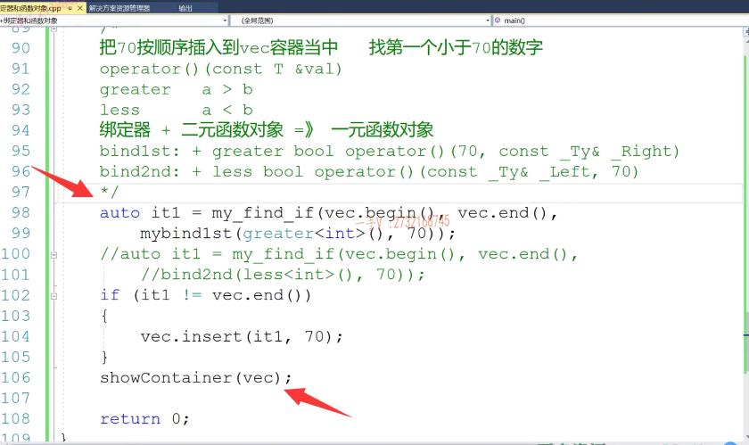
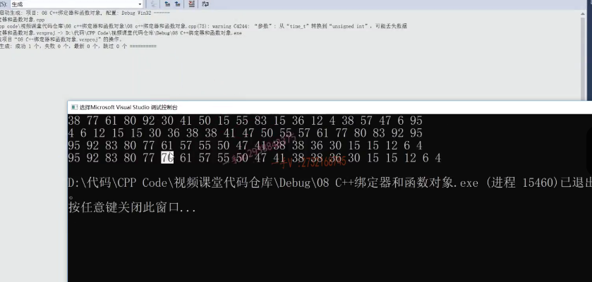
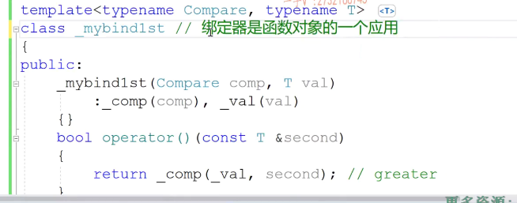
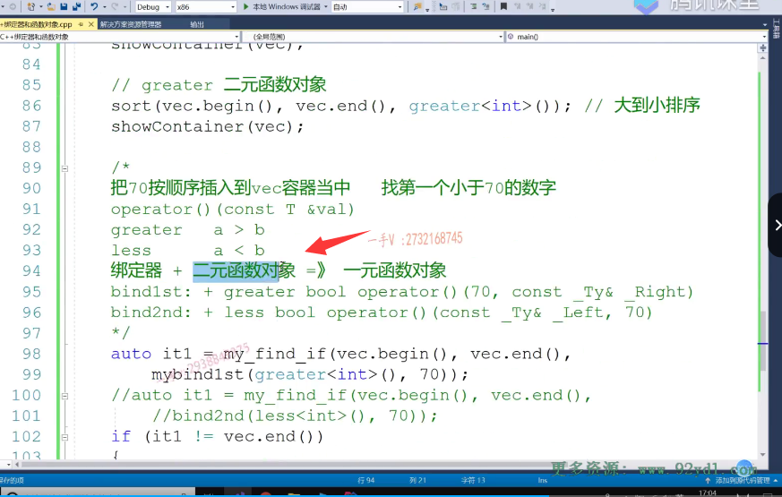
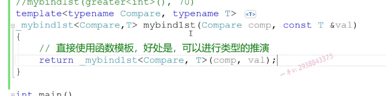
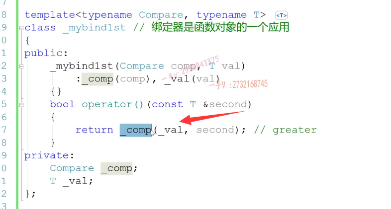
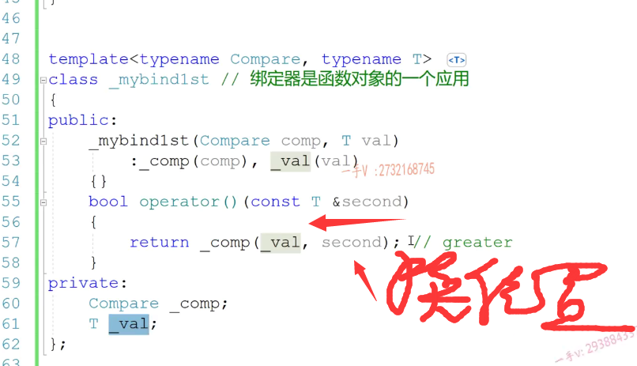

第二节课

好，大家好，这节课呢，我们主要呢，就来把这个绑定器底层原理呢，我们来实现一下啊。好，包括这个my find，if我们都实现一下，在这我们先来实现一下my find if啊，my find if这是一个。泛型算法对吧？

## 实现my_find_if 

在这呢，首先我需要定义迭代器类型，还需要呢。定义一个函数对象啊，那他返回的是一个迭代器，叫做my fun。先是first，再是。啊，再是啊，最后呢，还有一个我们的函数对象。这个my find是什么？就是说呢，==遍历这两个迭代器区间的元素，如果他满足了人家这个函数对象的运算啊，就返回当前这个元素的迭代器==。如果都不满足，

那么返回end是吧？所以for循环first。first，不等于last，然后加加first。在这儿做的事情就是==if comp把当前元素first从这儿大家也能看到==，唉，这个呢，my_find_if需要的是一个一元函数对象。因为呢，他要从容器拿一个元素跟他指定的元素呢，进行一个比较啊，进行一个比较，这儿处的话就return当前元素的迭代器，对吧？

如果呢？遍历了元素，遍历了一圈，发现函数对象的这个运算的这个结果呢，全部都是FALSE，那最终呢，就返回这个last。这个是相当于调用了函数对象的，什么对小括号运算符重载，然后从容器中取一个元素创建。注意这一块，这是我们的my find，if这个应该都能了解吧啊，所以我们说呢，my find if呢，

find if是需要一个一元函数对象，而我们库里边都是二元的。用不了，是不是啊？

### comp()一元比较

实现绑定器

好，那我们再来看一下我们的这个所谓的绑定器啊，绑定器。大家来看一下。首先呢，你从调用方式上来看的话，他肯定啊，就这个他肯定是一个函数模板啊，他肯定是一个函数模板。函数模板啊，他封装了一个一元函数对象的产生。

因为不管怎么样，买人家最终第三个参数需要的就是一个一元函数对象嘛。对吧，所以呢，我不管你这个绑定器有多复杂，你最终还是得返回一个，是不是一元函数对象啊？对来，我们实现一下啊。你看。这是绑定器了。第一个参数是什么参数啊？第一个参数，他需要的是一个二元，是不是函数对象啊？

对。compare.再有一个参数是什么呀？元素的是不是这个类型啊？元素的类型啊？好，我们来看看tab na met。那么。第一个是接收函数对象，第二个是接收一个元素的值。这个干嘛呢？这个要返回一个什么呀？这个要返回一个什么？他要返回一个，是不是一元函数对象啊？

唉，这个整体需要返回的是一个一元函数对象。那我们暂且把这个一元函数对象呢啊。你看都加个my吧好吧，这个是我们自己写的啊，我们自己写的买办的first对不对啊？给他加个下横杠吧。叫my。那么我们给他把模板类型参数呢，都给他加上啊，都给他加上。大家来看这个函数模板非常简单，他接收呢，我们用户传进来的，我把这个写到这儿啊。

把这个呢，我们给他也贴到这里边。他在这呢，接收用户传进来的一个函数对象。再接收呢，用户想绑定的一个数字。把这一股脑的都给他生成一个对象，这就是那个一元函数对象。用函数模板在这里边的好处是什么呀？好处是函数模板可以自动的进行。直接使用函数模板好处是。是可以进行类型的推演啊，根据我们船坞的实参。直接把这个函数对象跟元素类型直接推演出来。我们如果直接使用这个类的话，那这个类型参数我们就得自己写对吧？来好看一下这个啊，看一下这个

接着，我们实现这个一元函数对象了。啊，也就是我们所谓库里边的所谓的这个my band first。你既然传了一个函数对象跟值，我当然需要保存起来了嘛，是不是需要保存起来了啊？肯定是需要保存起来了comp。然后呢？还有一个t value。那么，这是他的构造函数嘛？

我们构造函数写一下comare comp，还有一个这个t value。我们都按值来接收吧啊，那么通过构造函数初始化列表，把这个传进来的函数对象跟值呢？都被他初始化了一下。大家看。mybindfirst函数模板接收外边用户，传递了一个二元函数对象跟一个需要绑定的值啊，构造一个一元函数对象出来。当然，==现在这还不能叫一元函数对象，因为他还有一个什么呀。他需要提供一个小括号运算符==重载函数对吧？

那么，在这里边data啊？这是办的first，就是第一个值是被绑定的，那么这里边是需要的是第二个值。second.就你，你给我把第二个值传进来就行了，大家会发现啊，其实呢，他的他他做的事情呢，就是一个封装底层做事情的，还是我们的谁呀？底层做事情呢，还是我们的这个。

二元二元函数对象啊，底层做事情的还是我们这个二元函数对象。二元函数对象，他需要两个参数，第一个参数是谁？对第一个参数就是我们绑定通过构造函数传进来的，这个value值。那第二个参数是谁？第二个参数现在就是这个一元函数对象，帮他在外边接收的容器里边的一个元素。你仔细的去思考一下。啊，仔细的去思考一下。

首先需要一个一元函数对象。那么，这是个函数模板，接收用户传进来的二元函数对象，跟所要绑定的参数的值。那其实呢，他无非就是封装了一下一元函数对象的产生啊，为啥要封用函数模板封装一下我们，免得我们去写。模板类型参数了，对不对啊？我们不用去写实例化的类型，他可以通过函数模板自动推导出来，你看这个函数模板实现非常简单。就是把这个函数对象啊的创建给他封装了一下啊，

封装了一下。那么这个对象呢？他是一个一元函数对象，他从容器里边接受一个元素，其实我们在这个里边现在用的，你看。用的这个comp，最终用的就是这个杠买办的first。但实际上，他底层调用的还是我们的谁啊？这里边底层其实实际上调用的还是great。的小括号运算和重载函数。啊来，我们直接使用一下啊，使用一下，

你看这都改成我们自己的了，my fun day跟my band first啊。我们来运行一下。

## 运行一下

我们来运行一下。看一下，其实。照样插进去。对了吧啊，

绑定器是函数对象的一个应用

这就是他的绑定器的实现方式，其实绑定器说白了。还是就是绑定器？是函数对象的一个应用吧。

我们刚才在这里边怎么说的呢？就是绑定器加上一个二元函数对象就得到一个一元函数对象了是吧？

你看这个绑定器帮你拿了一个二元函数对象。又拿了一个想要绑定的参数的值，

然后过来呢，唉，自己摇身一变成了一个一元函数对象，但其实做事情还是靠底层，这个二元函数对象来做事情的。啊。画的吧嗯，这就是我们这个。bindfirst C++ stl库绑定器做的事情。

那同样的，如果说是我要实现办的啊，实现办的second。那跟这就没什么区别了啊，那这个可以留给大家去实现吧，跟这是一模一样的。

办到三层呢，无非在这里边改变的就是我们绑定的值是第二个，那就是把这两个参数倒个个就行了。啊，倒个个就行了。也就是我通过构造函数拿拿过来的，这个固定的参数是给我们这个函数对象的第二个参数绑定叫半个second。对吧，给大家留成一个这个作业吧啊，作业嘛，大家可以自己去写一下啊，自己去写一下。

好希望通过这节课的讲解呢，大家对于这个绑定器啊，底层的这么一个实现原理。

能够好好了解一下啊，好好了解一下，那么实际上呢？你看啊，你如果还是有点不太清楚啊，这个到底是怎么调用的？那么，同学们一定要多多调试一下代码，你可以在这打断点调试一下。

这个首先进到my band first。然后呢？再进来这个构造函数啊，获取了跟我们的70对吧啊？好了。那么再进来，

现在就进到我们算型算法里边了啊，这个呢？获取了容器的一个元素，这个comp就是我们的刚my band，first你看就直接进入my band，first的这个小括号运算符重载函数里边。那这个其实底层标呢？是不是还是我们刚才的这个啊啊？还是我们的，你看这这能看出来？啊，相当于底层用的还是great，只不过给great把一个参数绑定出来了。啊，法定。

# 总结

好希望大家呢，多研究研究，把这个绑定器啊，bind first和bind second，他的这个机制呢？搞清楚好吧行啊，绑定器呢？应用在什么地方呢？任何地方？你对于我们C++的这个编程来说啊，你想呢，==用一个低元的函数对象，但是没有。却只有一个高元的函数对象==。OK，

那我就可以采用绑定器，把你高原的函数对象的某一个参数呢，给他绑定起来。啊，然后变成一个递元函数对象，但是你可以看到办的first跟办的second啊。在这里边只能应用于哪个啊？是不是二元函数对象啊？==那只能应用于二元函数对象==。这个C++原来库里边提供的这两个绑定器就只能应用于二元函数对象，他俩一相。一相结合就可以变成一元函数对象，

但是实际上呢，我们项目比较复杂的话呢，我们可能呢，这个函数对象啊。就是三元，四元，五元，六元可能都会有啊，所以呢，办的first跟办的second呢，他们呢，这个能处理的这个场景有限啊。所以呢，这就是我们后边所要给大家讲的，我们C++从我们boost库里边拿过来的更强大的，这个bind跟function机制。好，那我们这节课就先到这里。