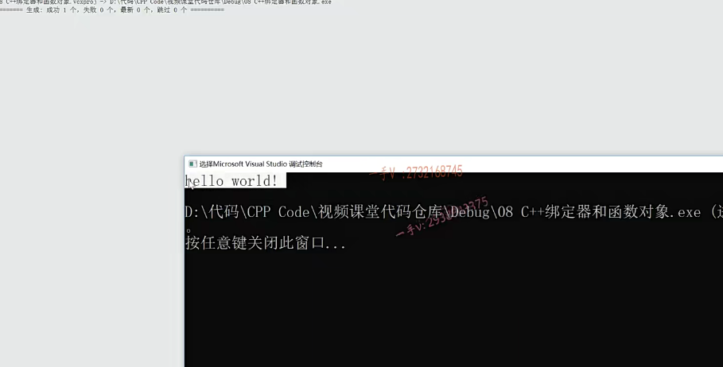

第三节课 

大家好，我们从这一节课开始呢，给大家来介绍一下C++11里边给我们提供的这个bind绑定器。bind绑定器和这个function函数对象。其实呢，我们之前讲过C++stl啊，C++stl里边儿提供的这个bindfirst和这个。和这个band second啊，==其实我们知道呢，这个绑定器的结果本身。本身它还是一个函数对象==。大家还记得吗？我们在前边讲课的时候呢，给大家说呢，==库里边提供的这个绑定器是专门绑定二元函数对象==，

==最后绑定的结果呢？那就是得到了一个一元函数对象==，

所以绑定器本身还是个函数对象啊。那我们这节课呢，先给大家来介绍一下这个function。就函数对象。到底有什么作用啊？为什么要专门搞出来一个function类？

那么，你要使用这个function类啊，我们需要包含functional头文件。使用方式，函数对象类型啊，函数对象类型。那么在这儿说一下这个它的这个。

## function使用的必要性

使用的这个必要性，为什么要使用它啊？那一般我们的这个绑定器啊，我们的绑定器或者是函数对象，我们说的函数对象或者是我们的lambda表达式。这些东西呢，其实本质上是不是都是函数对象啊？对，都是函数对象啊，他们只能使用在语句中。使用在一条。语句中。那如果说是我在这里边所用的这个绑定器啊，我最终得到这个绑定器，==最终得到的这个函数对象啊，greater less最终得到的这个lambda表达式呢，我想在多条语句中应用==。我讲我想在多个环境下应用啊，那怎么办？==就是我如何把这个绑定器呀？函数对象啊lambda表达式，它的类型我留下来了。我如何去留下它们的类型？这就是我们function它的作用==啊，它的作用。那么，这节课我们先不讲function的原理，下节课我们来讲function的原理啊，我们呃，

自己实现一下代码来剖析一下function的原理。那这节课呢？我们先讲一下它的一个简单的一个应用啊

举个例子

我们先讲一下它的一个简单的一个应用啊来，先写一个简单的，那比如说这有一个hello函数啊hello函数。啊，我这呢需要包含了C加加的字符串啊，字符串那么string。hello啊。这应该是一个STR吧啊，那么在这我就进行一个打印。大家来看一下啊，我们把这个叫hello 2吧，

我们再给一个hello 1。不带参数的啊。

不带参数的话，这个就直接输出hello word就可以了。

我们现在呢，可以定义一个function啊，那注意啊，我们这个打造这个function的这个。定义啊，库里边儿定义的地方，我们看到它的这个模板类型参数啊，根据它的名字f tap function tap。哎，也就是说呢，他希望你在实例化这个类模板的时候啊，用一个函数类型来实例化类模板。啊，

==用函数类型来实例化这个类模板==。

==从function的定义的类模板定义出。啊，看到希望用一希看到希望用一个函数类型实例化方式==。

那么我们现在呢，要通过这个函数对象来对这个函数hello 1，这个函数的对象调用进行一个包装，那么hello 1。这个函数呢？它的函数类型是什么呀？返回值是void。括号注意呢，注意同学们在这一定要区分一下啊，

函数类型跟函数指针类型是两个不同的东西，这是函数指针类型。

好吧啊，这表示呢，这是一个指针类型，指向一个返回值是Void的，不带形参的这么一个函数。

那么，我们在这里边用用函数类型来实例化我们这个方式。只给出返回值和参数列表就行了，因为这个返回值我也没有参数，所以写了空括号func1。

以写了空括号funce。你可以写等于hello 1。啊，或者是你通过这个调用的都是构造函数嘛，

对吧啊？那这个相当于呢？我们就用funce呀。就用这个函数对象类型，把这个函数类型给它留保留下来了。

对吧啊？那这个相当于呢？我们==就用func1呀。就用这个函数对象类型，把这个函数类型给它留保留下来==了。啊，然后呢？我再以这样的方式调用。那大家应该都能知道这个地方呢，==就是我们func1的什么呀，小括号运算符是不是重载函数啊==？由于呢，你用这个函数对象所包装的这个函数的类型啊，它本身就不带参数，所以呢。

这个函数对象调用它的括号运算符，重载函数的时候呢，也就没有参数。这相当于呢，==是func 1调用了小括号运算符重载函数==，

唉，里边儿==再调用了它所包装的这个hello 1这个函数==。我们先简单的看一下它的应用啊

那么我们运行一下这块程序。好，大家看到hello 1的这个函数是不是已经被调用到了？是不是已经被调用到了？okay它已经被调用到啊，已经调用到了。打印出来了hello world啊，

打印出来了hello world。好，那我们再来看一下，

## func2举例

好，那我们再来看一下，我再定一个function，现在呢？我要看hello 2。那hello 2这个函数的类型呢？==它返回值是void的，但是呢，它有形参列表，它的形参呢是一个string类型==啊，这是func 2。等于hello 2啊，等于hello 2

那么在这里边func 2调用的时候你注意了啊，你func 2这个函数对象所包装的这个函数类型呢，

返回值是无尾的，但。但是带有一个字符串。啊的形参变量，所以呢，你再通过啊这个fuz 2。这个函数对象啊。调用函数的时候呢，人家也就需要你给它传入一个字符串啦，然后呢，调用f hello 2的时候呢，也就把。小括号运算符重载函数呢啊，所接收的这个。字符串传给你hello 2。

所以呢，这个括号不能空，你要空别人就出错了啊，那么。我们写个hello hello 2。

我们来运行一下。大家来看看。这个呢，我们就调用到了，通过我们fuc 2这个函数对象调用到了我们的这个。hello 2，这个函数。OK吧啊

那么我们再写一个吧，假如说这是一个suma。

b这个呢，做的就是一个两个数字的加法，对吧嗯？那么在这里边呢，我们可以通过function。来包装一下这个类型int int，这就是函数类型，这个函数的类型呢，返回值是一个整型。有两个整形的形参啊fuc 3来获取sum函数，

那你注意这个函数对象在包装这个函数的时候呢？这个函数的类型啊，是带有两个整形参数啊，所以呢，你通过函数对象来调用函数调用sum函数的时候需要呢，

把你这两个整形的。13给人家传进去啊，传进去，所以这是计算20跟30。的加法，结果我们。对结果进行一个打印输出。能够计算出来20跟30的和对吧啊？

从这儿我们可以看到，也就是说呢，function呢，这个函数对象类型啊，非常的这个好用。啊，

它可以呢，把我们的函数类型直接给留下来，它不仅仅可以留我们函数类型啊。包括我们函数对象的类型，它依然可以留下来，因为函数对象呢？函数对象的本质是不是就那个小括号运算符的重载函数啊？

对，所以在这里边你看一下啊，你看一下我在这同样的。给你用func 4留一个函数对象，也就是lambda表达式嘛啊，好看看在这儿呢int ain TB啊，返回值是int return。

return a+b。

好吧，你看一看。这个函数对象啊，这个lambda表达式最后代表了一个函数对象的小括号运算符，重载返回，这是整型嘛，有两个整型的形参列表嘛，计算的也是a+b的和嘛。你看我们function刚说了，从它模板的定义处，我们就可以看到啊，它希望用一个函数类型来实例化function。它就是对一个函数或者对函数对象的一个包装啊，我们最后呢，

把这个分号呢加上。那然后在这，我们依然可以用fuc 4做100+200的，这个加法我们来看看。100+200，结果是300，这个没有任何问题的。

## 就是可以把全局函数赋值给function对象

那么希望呢？从这里边举的这几个简单的例子啊，大家呢？能够看到我们的这个function的，这个简单的一个应用啊，

我们function这里边简单的一个应用。注意一下它的这个使用情况啊，使用情况。这个function呢，不仅仅为我们留下啊，我们普通的这些全局函数的类型。

## 类的成员方法也可以做类型保留

对于我们类的成员方法呢，它也可以进行一个类型保留。

那你比如说在这里边儿，我们来举个例子。test public，我们给里边儿还是写一个hello。

啊string STR这个打印一下STR。

## 成员方法的调用必须依赖一个对象

那么，我们在基础课程里边儿已经给大家说过啊，指向呢，我们全局的c函数的函数指针跟指向我们成员方法的指针。是不一样的，因为我们成员方法跟普通函数不一样，不一样的地方在于普通函数直接通过调用函数名就行了。

==而我们成员方法调用啊，它必须依赖一个对象在这儿呢，==

## 函数指针的定义

你比如说啊，你比如说我要通过函数指针。调用这个函数。诶，我定义呢？这样的一个函数指针是不是就可以啦啊？我们只写类型就可以了，是不是？

## 调用成员方法的时候一定要依赖对象

## 函数指针前面需要加作用域

但是呢？在我们调用成员方法的时候就不行啦，==我们成员方法在这个指针的前边呢，一定要加一个什么类的作用域就表示呢，到时候通过函数指针去间接调用我们成员方法的时候，前边儿一定要依赖于一个test对象==，对吧？

## 注意成员函数是2个参数，因为有一个自身的this指针

function也可以的。我们来用function来用一下啊function。

但注意一下啊，在这里边返回值是void。它的参数列表只有一个参数吗？只有一个参数。不是一个参数，你要知道啊，==这个成员方法一经编译都会多一个当前类型的一个this指针嘛==。

是不是当前类型的一个this指针，所以呢，它有两个参数，哎，一个是test类型的指针，一个是string。

## func5

func5。来取一个test作用域下的hello。那么fuc 5在调用通过这个函数对象fuc 5调用我们成员方法的时候，你注意啊。第二个呢，是我们的参数。就是传的这个字符串啊hello，比如说hello。test.call text hello吧。对了吧，这是一个打印，

## 成员方法需要依赖一个对象

但是注意啊，这个成员方法对于这个成员方法调用呢，我们需要依赖于一个对象的啊。

那第一个是一个对象的指针，是不是我们给它传一个临时对象就可以了？

## 传入临时对象Test(),加上取地址

## 运行结果

你看运行。大家看到在这里边呢，==我们就通过我们的方式调用到了我们类的成员方法。==

大家先注意一下啊，注意一下它的使用，如果你想了解它的这个底层原理到底是怎么做的啊，那么我们。这个后面的课程呢，会给大家讲其function的底层，实现原理，我们用自己写代码来模拟一下啊。

## 总结：

看到这儿，相信大家对于function呢，

应该有一个基本的这个了解了啊，基本的了解，那在这儿我再强调一下，你所要注意的事情。

首先呢，function这个类模板你需要提供这个类型实例化，实例化的类型的时候必须是一个函数类型。啊，必须是个函数类型。==在这我们写一下第一个。用函数类型实例化function。==

==第二个。通过function这个调用小括号运算符函数的时候。需要根据函数类型传入。相应的参数啊，这个一定要注意。你在实例化这个方程类型的时候参数。==

没有参数那。通过呢function调用小括号运算符，重载就是调用这个函数对象的时候呢，就不用传参了。这里边儿你指定的street就是一个street，这里边儿指定两个整型就是串入两个整型啊，这里边儿指定的是我们类的一个指针，一个字符串，那我们传的就是一个对象的一个指针，一个字符串。

# 疑问补充：为什么 &Test::hello前面需要&

### 主要是显式的指定成员函数指针类型

## function的作用：保留

好的吧，那有些同学呢，可能说到这里，可能觉得你这就只能是这么一个用处，那我还不如直接是不是调用这些函数啊？啊，那function呢？能不能给我举一个例子啊？觉得function确实好用，对吧啊？那我们来。

## 举例说明function的好处

举这么一个例子。我们大家看一看function。

它的作用就是保留啊，保留它所看到的函数，成员函数，其他函数对象lambda表达式的类型，它能把类型保留下来，然后再到处都可以使用啊。

那我们在这里边举个这么一个例子啊，我们经常做软件啊，经常做一些软件，软件里边啊，面向客户呢，都有一些菜单啊，都有一些菜单。那你比如说这个样子啊choice。

这个等于0 for循环。让我们打印一下啊，打印一个菜单出来。啊。比如说我们一个图书的菜单吧，对吧？第一个呃，查看所有书籍。信息啊，查看所有书籍信息。二三四五。一二三四五。那第二个是借书。第三个是。还书。

第五个是查询书籍。啊，这个应该有一个。呃，注销吧，登录用户注销是不是啊？注销

那在这里边呢？有一个。请选择。请选择。啊，完了在这里边，我们选择一下这个choice。先测一下这个choice好吧，

我们具体的这个。在这里边，我们所模拟的就是当用户选择某一个一二三四五的时候，我们进入相应的这个功能函数，进行一个处理。

啊，我们找相应的这个函数呢进行一个处理。

那么在这里边。大家能想到的可能就是这样的操作了。case 1。case 2。case 3。case 4。case五。还有一个default。

## switch case这样的写法肯定会造成不少问题

这样操作好不好？这样操作肯定不好。不好。因为这块代码。无法闭合。也就是说，无法做到。开闭原则。这一块儿的这个功能代码呀，随着我的这个选项的增加。我这块儿代码就要更改，因为要增加新的case，

随着我哪个选项不要我在这儿呢啊，我在这儿就要把哪个case的。去掉了，也就是说这块儿代码呢，随着我们需求的更改，它是改来改去的。永远也闭合不了，所以这块儿呢，一是不好维护，二是风险比较大，很多同学我相信写代码的时候呢，都遇到过把case底下的break给人家忘掉了。导致了导致多个case两个或者多个case跑到同一个逻辑了啊。那这块代码改来改去，肯定避免不了啊，

可能会产生很多的一些问题啊，产生很多的一些问题。

## 如何处理？使用function函数对象

那我们还有什么办法能处理呢？那我们来看一下啊，我们来看一下。能不能使用到我们的这个？function函数对象的。你无非就是在这里边儿啊，那这就是不同的选项，我们要做一件事情，是不是啊？在这儿呢，我们先写一个。把每一个选项做事情的这个操作呢，我们都给它封装到一个接口里边，

比如说这个是do 查看啊，查看。这是show books。这个是查看所有书籍信息。那具体呢？可能有呃，我们就嗯，就做一个打印啊，代表呢，我们做这件事情了，做这个用户所选择的一的这件事情啊，

第二个是do借数borrow borrow。啊。借书。

那第三个。还书对吧啊back back吧？这个叫做还书。

还有呢，是查询书籍。就query query query books。这是查询书籍。

还有一个就是我们的注销。do log out啊。注销。

这是令这是呢，我们把这些操纵呢，给它封装了一下啊。

## 使用map去匹配

那我们现在做这样的事情，我们现在无非就是你选一个选项就要去做相应的一个事情嘛，对吧？那在这儿呢？我们给它定义一个map啊，我们上面包含了这个map。map的键就是我们用户所做的选项啊，我们的值。值是什么类型呢？值是一个动作类型，就是当我选了一个选项的话呢，你就要去做一个动作。啊，做一个动作。对吧啊，做一个动作。

## 一个选项对应一个动作，动作就用function来表示

那么在这里边，我就可以使用function void。啊，我就可以用使用我的这个function void。

在这里边看一下。讲一讲，那我这个方式呢？接受的就是所有返回支持位的，不带形参的，是不是函数类型的？比如说我把它叫做action map，我们可以在这里边给它添加元素嘛点insert。这个叫做一一对应的是什么呀？度数all books。

三四五一二三四五赌包肉。do back.query book读login out。

## 初始化

这种初始化的方式呢，是对于我们公有对象的这个初始化，也叫结构体的初始化，可以我们在C++11以后呢，可以这样写了。

如果你用的这个VS版本比较老的话，那你就乖乖用这个insert。make pair把这个键跟值写出来啊，写到make pair的这个。参数列表里边啊，进行一个增加。

那在这里边，我就可以这样去写了啊，你就可以这样去写了，这是你用户输入的一个choice嘛，是不是啊？

## 可以使用find函数

那我就可以用我的action map。点find find你这个choice，它返回的是一个迭代器嘛，还记着没有auto it。if这个it=action map的end的话呢，就表示。是不是一个无效的选项啊啊？是一个无效的选项，输出一下啊。输入这个数字。无效。重新。选择。那否则的话呢，在这里边我们就找到了，是不是找到了的话，

## 可以去使用函数对象去调用

那我们it指向的？值是什么呀？我们在基础课程里边儿给大家讲过了map里边儿啊，键值对儿都是打包成一个pair对象了啊，键是first。值是second，这两个就是我们pair的键值的类型，对不对啊？

类型定义的这个成员变量分别叫做first跟。second，所以指向的second。second，就是一个函数对象嘛，就是我们function函数对象在这儿呢，我们就可以去调用它了。

好，我们看一下啊。查看书籍。你看做查看数据信息二借书。写出三还书四查询书籍五注销六。输入数字无效，请重新选择啊，就是这样的一个效果。

在这里边，我们可以用方式来保留任何的。函数类型。啊，函数类型，包括函数对象类型，

## C函数指针不能去接收其他类型的函数

有的有的有的同学说在这里边呢，我用函数指针啊，我用这个c的。函数指针同样在这可以呢，来表示这里边所有的这个函数类型啊，没错，可以。但是你函数指针只能接收，只能接收我们普通的函数，

## function可以保留函数

你能接收我们其他的。比如说绑定器绑定的这个。函数对象或者是lambda表达式的这个函数对象吗？它就不能了啊，所以function在这里边呢，它的这个应用呢还是非常强大啊，非常强大的。

希望大家呢，能够在合适的地方啊，把方式呢应用起来。应用起来。好，这里边儿是给大家举了一个例子啊，说明了一下我们方程的一个比较好的一个应用，你记住它的一个特点啊，

==它就是能够把我们所见的函数啊。呃，绑定器呀，其他的函数对象啊。还有我们的这个lambda的表达式啊，它的类型给它保留起来，==我们在其他地方都可以去使用。啊，否则的话呢，我们之前见的绑定其lambda表达式呢，就只存在于语句当中啊，我在其他语句呢。要用的话呢，我还得重新写绑定器，写这个lambda表达式。

好，这就是function的一个非常好的应用啊。行，那我们这节课就到这里。
