## 研究function底层原理

## 完全特例化和非完全特例化

大家好呃，为了研究呢，这个function的这个底层的这个原理啊，函数对象的这个底层的原理啊。那么我们今天这节课呢，==要先讲两个铺垫的知识，一个就是模板的完全特例化和非完全特例化，==那就是部分特例化对吧啊？非完全就是部分特例化。

## 实参推演

那另外一个就是模板的实参推演，我们再来看看我们之前在CA加精品课程基础部分里边儿呢。讲了这个视参推演的，还有这个特例化的一些基本的知识啊，

基本的知识我们先来那个。回忆一下啊，什么叫特例化啊？什么叫特例化？

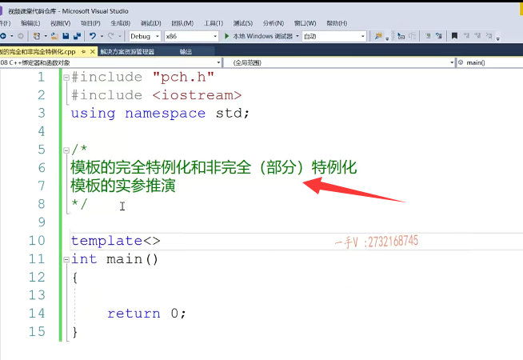

## 回顾知识

大家来看一下啊。那特例化还叫做特殊的实例化啊，那就是说呢，这个特例化呢，这个就是模板类型的，这个实例化呢，不是由我们编译器做的，是由我们用户呢，由我们开发者直接提供的。啊，因为我们觉得呢呃，对于某些类型的这个，它的实边的实例化呢，它是不符合我们逻辑的啊，不符合我们逻辑的。

## 举个例子

那在这呢，我们直接举个例子啊，我们直接举个例子。大家来看一下。当时我们给大家讲的是compare嘛ta TB。return a打于b。

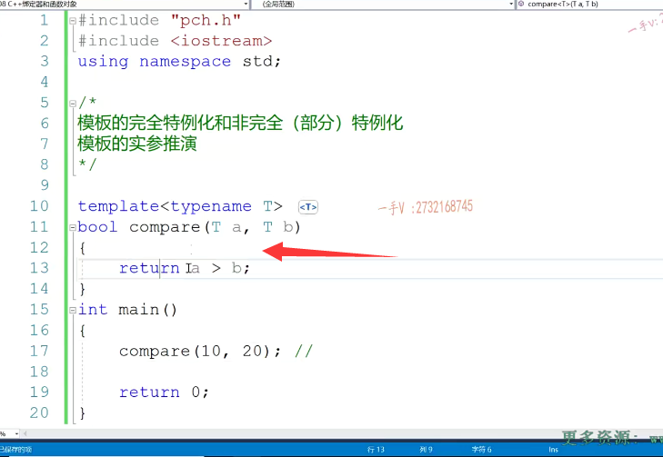

对吧啊，那在这里边呢，我们说。你在这儿比较10跟20，这里边包含了两个，

## 推导出来整形可以

一个是模板实参推演，它通过我们实参的类型啊，推演出来形参t的类型是个整型。

没问题吧啊，是个整形。

第二个呢，它会呢从原模板实例化一个专门处理整形的。我把函数出来进行一个编译啊，进行一个编译。

## 传入字符串它不是比较字典序，而是比较地址去了

## 不符合实际

那么。我们说，对于这样的字符串呢，它通过推演推演出来t的类型是const叉星。是吧呃，

但是呢？它如果从原模板里边儿呢，自己给我实例化代码，==它相当于对两个字符串呢，是两个常量字符串做大于比较，这比较的是地址，并不是比较的是字符串的字典顺序，==

所以呢？对于这个类型编辑器，现在默认的这个实例化产生的代码呢？不符合我们实际的处理逻辑，对吧？

## 需要提供特例化

那需要我们提供一个特例化。const char *   const叉星a const叉星b啊那return strcmp AB大于零。

这个才能比较两个字符串的是不是大小啊？那么这个是原始的compare模板。这个是compare的const叉新实例化的compare啊compare。

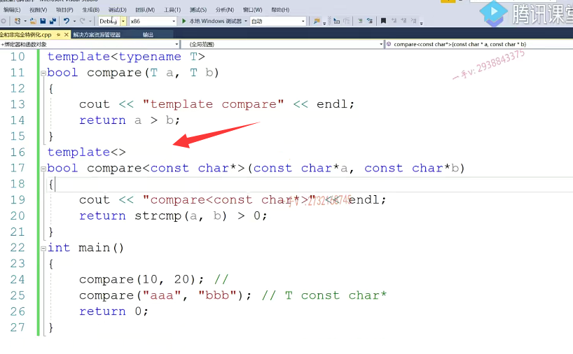

## 完全特例化

我们来看一下这两个的调用啊。你看第一个呢，调用它是从原模板实例化出来的。第二个调用呢啊，是调用的我们特例化版本。这个就叫完全特例化，因为这个类型t完全是已知的完全特例化。实参推演对吧？这是我们之前讲过的啊，

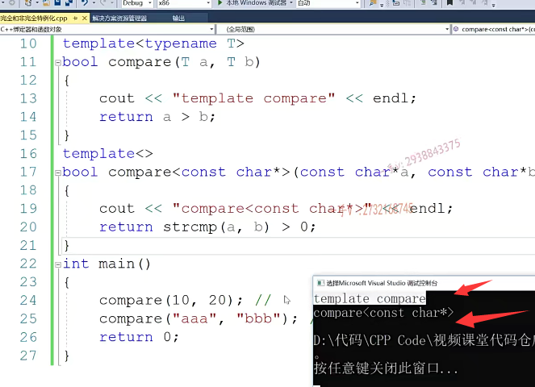

## 举更多的例子来观察

那我们今天。再来举一些例子呢，专门来看一下更多的一些特例化跟实参推演的内容啊。

好来看一下啊。假如说呢，我现在定了一个类模板，比如说我就叫做vector啊。我们不写什么功能代码，我们主要呢是为了看一下啊，为了看一下。它都定的是哪个版本？

就是call vector。template.in it.好。我们来看一下。

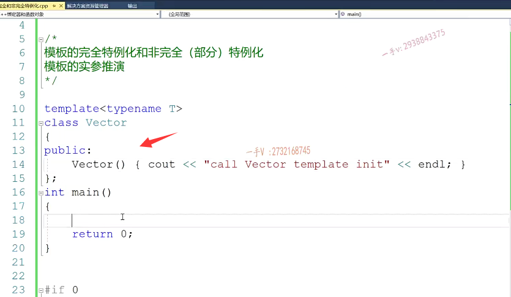

## 实例化一个整型vector

用整形实例化一个vec。那么在这儿呢，它相当于呢，用我们整形实例化了一个vector。啊，我们编译器呢？就在编译时期呢，从这个模板处理这个产生一个专门处理整形的vector的代码出来了啊，模板类出来了对吧？

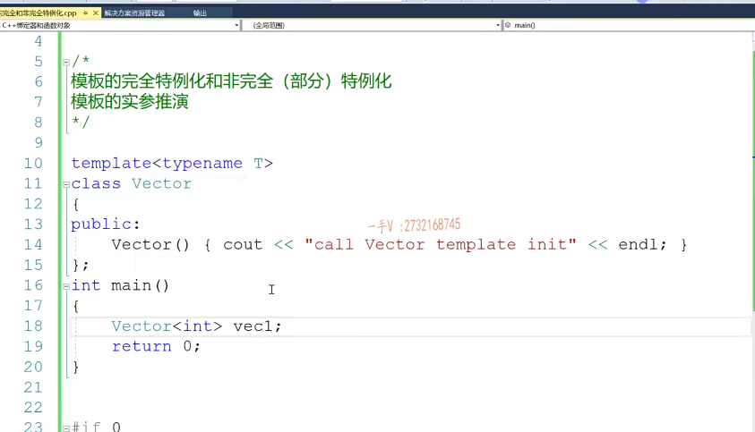

## 现在想实例化一个char*的模板

那在这儿呢，比如说呢，我想处理一个char*类型的vector。啊，但是呢，你从原模板池里画出来的这个方法的代码呢处理的可能是有问题的。

所以此时呢，我需要自己去。提供一个特例化判断。大家来看一下，这个就叫做特例化版本。call vector char *init。这个叫什么特例化呢？啊，下面这个是对。char * 类型提供的完全特例化版本。完全特例化版本为什么呢？

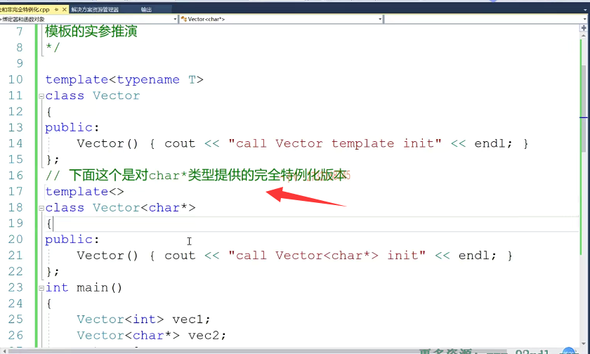

因为在这里边啊，这个类型t原模板里边儿类型t我们是已知的了，

你看这个尖括号里边儿啥也没留下，就所有的类型我们全部都是已知的，这个不能省啊，这个是特例化的这个语法。有模板，有原模板，才能提供特例化。啊，不能说是连原模板类模板都没有，直接提供一个一提供一个类模板的特例化，这是不行的啊。好，这是完全特例化，那么在这儿我们来看一下。大家来看啊，

那这个呢？就调用了我们对应对叉二星类型提供的完全特例化版本。对了吧啊，

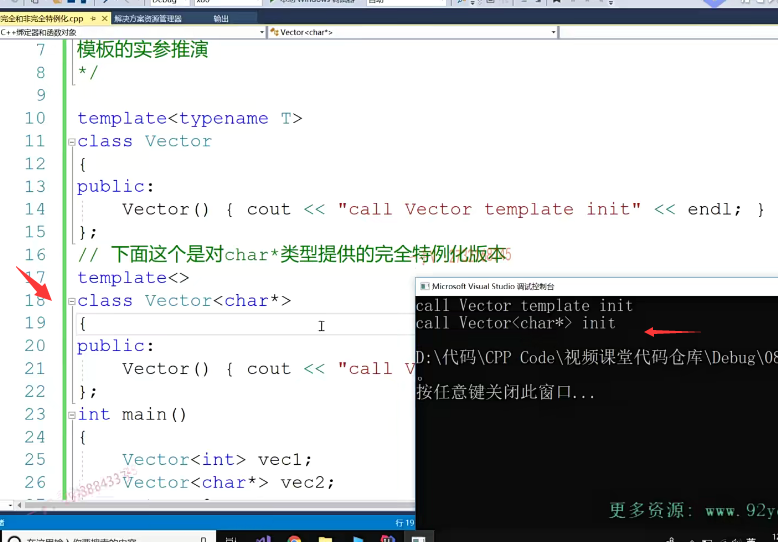

那么。还有什么呢？假如说现在啊，我又来了一个，比如说是一个嗯int* vec 3。那么，大家来看一下int *星呢？对于int *实例化的vector，它是选择调用我们的这个特例化版本呢，还是编辑自己从原模板自己实例化呢？啊，肯定是自己实例化嘛，因为这个特例化版本只针对于用char * 星类型实例化的vector。

所以用int型实例化的这个vector呢，你看还是从原模板实例画出来的啊？

## 针对指针类型提供特例化版本

而我们现在还有一种方法，就是我现在呢，就这个vector啊，针对指针类型。他的方法操作呢，可能有一些问题。但是具体这个指针是什么类型的指针呢？不确定，只知道如果是指针类型，我就要对这个vector里边方法呢进行重写。

## 特例化版本还需要类型

所以此时我们可以提供这样的一个特例化版本啊，

这个t你可以叫ty无所谓这个名字。唉，有的人说你提供特例化版本，怎么这儿还写类型啊？我们类型现在只知道一部分，只知道它是个指针类型，什么类型的指针呢？不清楚，所以在这呢，我们提供的这个版本是这个样子的啊

## 部分特例化

ty指针。好，大家来看一下啊，现在这个呢？下面这个是针对指针类型。就是指针类型提供的。

部分特例化版本，部分特例化。能了解这个部分特例化了，就是这个t呢，可能是一个很大的类型，对吧？它也可以表示任何类型，包括指针类型，但是现在呢，我对于指针类型呢，我需要重写这个方法啊，重新提供一个版本。但是具体什么类型的指针我不知道，所以类这个指针的类型啊，我们还是需要呢去参数化一下的。啊，指针的类型还是需要去参数化一下。那么，我们针对指针类型提供了一个部分特例化。

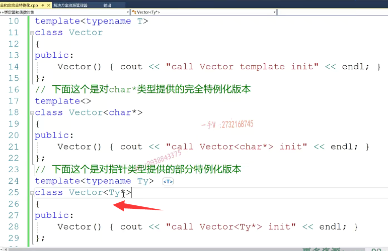

嗯，请注意理解一下这个部分的意思，部分就是指针，我知道它是个指针啊，但是指针的具体类型是什么我不知道，所以。这是部分特例化。

好，那我们来看。

这个整形唉，由于它不是叉儿型，也不是指针类型，所以它选择从原模板实例化，

第二个是叉儿型，因为我们给叉儿型提供了完全特例化，那它就优先使用完全特例化的版本印特星，

这里边儿看似好像没有对int * 提供完全特例化版本，但是有一个对指针提供的部分特例化版本，所以它就匹配这个，也就是说呢，有完全特例化就优先匹配完全特例化。啊，这是一有部分个例化就匹配部分个例化没有的话。

它就从原模板呢，自己实例化啊，我们看一下。

大家来看一下。啊，我们这里边呢。你看看。就用到了我们的这个部分特例化版本啊，部分特例化版本。啊，这就是部分特例化的这个概念啊，部分特例化的这个概念。

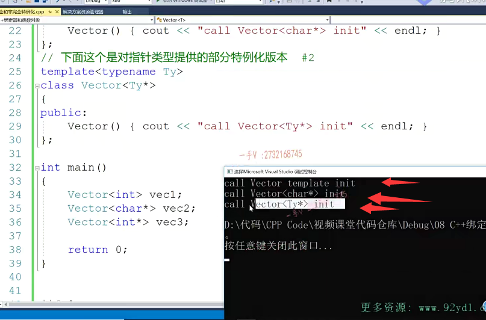

## 复杂类型

好，我们甚至呢，还可以提供更复杂的一些类型，

你比如说这里边我们之前经常用的这个sum。啊，sum是吧。来我们看看，如果说我在这里边啊，用int。新int int类型来实例化一个vector。

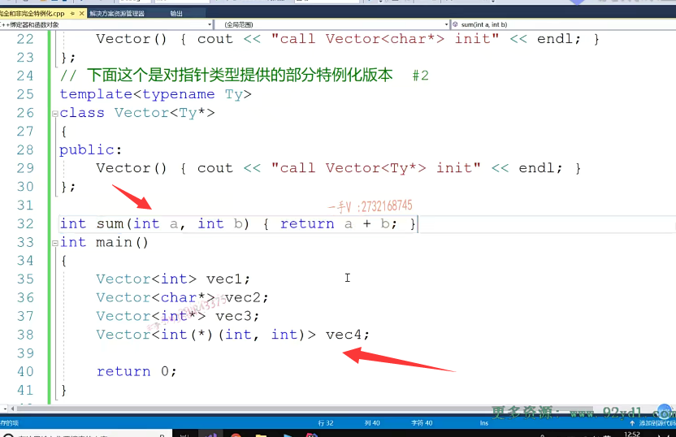

# 补充函数指针的定义

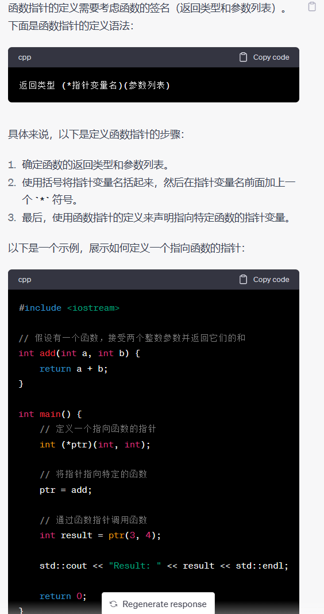

那么这个类型。就这个类型。你相当于就是这样的一个函数的类型，对吧？那这个类型。应该选择。哪个版本呢？这个肯定不会的，

因为这是叉儿星类型的完全特例化，这很明显不是叉儿星，对吧？

但是呢，==这有个部分特例化是对指针。进行一个部分特例化，那这个也是个指针，所以它优先选择这个部分特例化了嘛==。大家看。用函数指针类型实例化的，是不是还是？匹配的是这个。ty型。是的吧啊，那当然了。

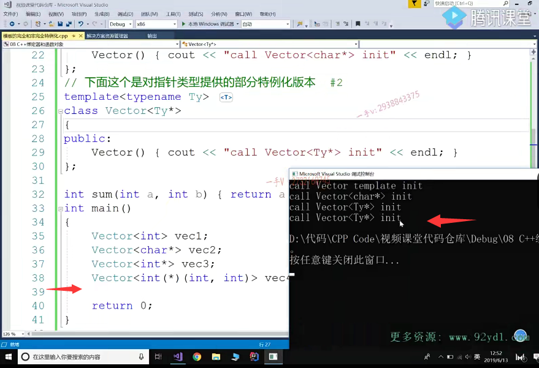

## 部分特例化这样写也可以

你可以给他提供一个。这个tap啊，tap name。返回值。a1。a2。r星a1a2。有同学说你怎么起了这么复杂的一个类型，你看啊，我们现在想给它提供一个完全特例化。啊，一个应该是部分特例化的，对吧啊，部分特例化

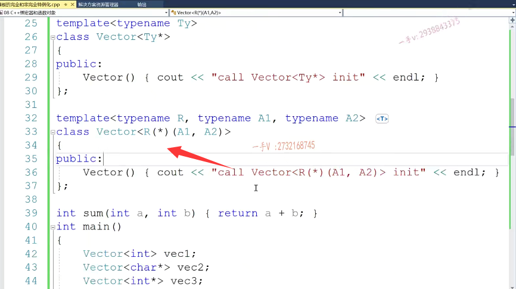

## 完全特例化写法

如果是完全特例化，那你就写成这个样子啦。

class vctorint星int int就写成这个样子了okay吧？

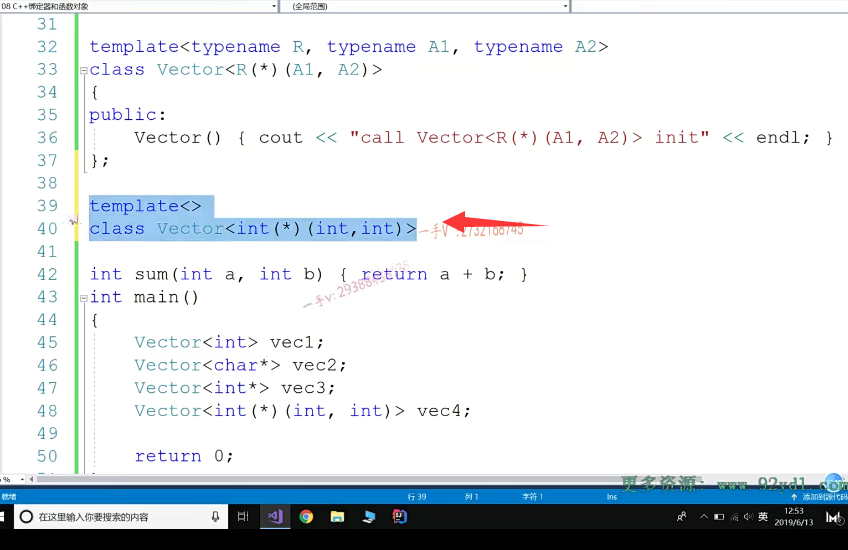

但是我们现在呢，更灵活一点，其实刚刚sum写出来给大大家看一下这个。具体指的是什么？这个类型的函数some其实我们用不到啊，我们就删了吧啊。

我们这个也叫做什么呀？部分特例化啊，部分特例化特例化。

这是针对函数指针提供的部分图案，哪种函数呢？就是。有有返回值，有两个形参变量。的函数提供的部分特例化。

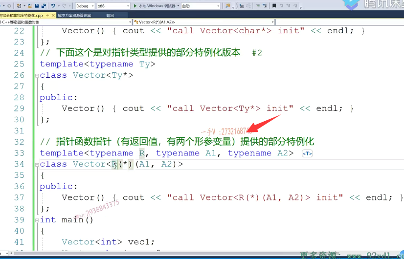

你不要管这里边儿原始的模板只有一个类型参数，你这儿怎么写了三个对不对啊？其实我们这三个合起来呢，是一个类型函数指针类型嘛。

我们相当于对函数的返回值以及两个形参都进行了参数化。

t可以表表达一个很长的类型，很大的类型。函数指针对吧，函数指针类型，我们这儿把那个呃指向我们这样的函数的返回值以及两个形参类型都给它定义了类型参数，你看这就是部分特例化，

我们也知道它是个指针，而且我们知道它是个函数指针，是有一个返回值，有两个形参变量的，这么一个函数指针类型。

## 运行结果

匹配这个不匹配。那么现在。啊，那么现在我们来看一下。

第一个int从原模板自己实例化，

第二个用char *实例化vector，因为有叉二星实例化vector的这个完全特例化，

第三个是个int星，是个指针对吧？啊，只有这是对指针提供的特例化版本，

这个虽然也是指针，但是这是人家是函数指针啊，你这个映特星跟函数指针一点儿关系都没有第四个。你看匹配到哪个了？唉，匹匹配到我们针对这个函数指针。有两个形参变量的函数指针提供的这个部分特例化版本。

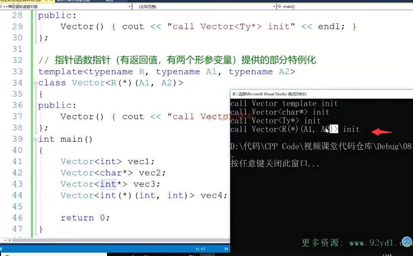

## 函数指针类型和函数类型不一样

请大家好好思考一下啊，请大家好好思考一下。这里边我们提供了。这个是完全特例化，这两个都是呢部分特例化，

==我们可以针对任何这个就是已知一部分类型，另外一部分类型不知道的情况下，我们都可以给它提供一个部分特例化==。啊，

还记得我我我们在前几节课中给大家说的啊，这个函数指针的类型跟函数类型啊，它不一样，大家注意一下，把它区分开，我们在这个function啊，函数对象类型使用的时候呢，那人家需要的是不是都是一个函数类型啊？你看这个函数类型，这个匹配的是哪个呀？啊，这是指针，

这也是指针，这是串儿型指针，那匹配哪个呀？我们来运行一下这块代码，你看一下。函数类型跟函数指针类型可是两码事儿好的吧啊，可是两码事儿它们有区别，也有相似点。那首先你看这个是不是直接就就从原模板自己实例化了啊，原模板自己实例化了，

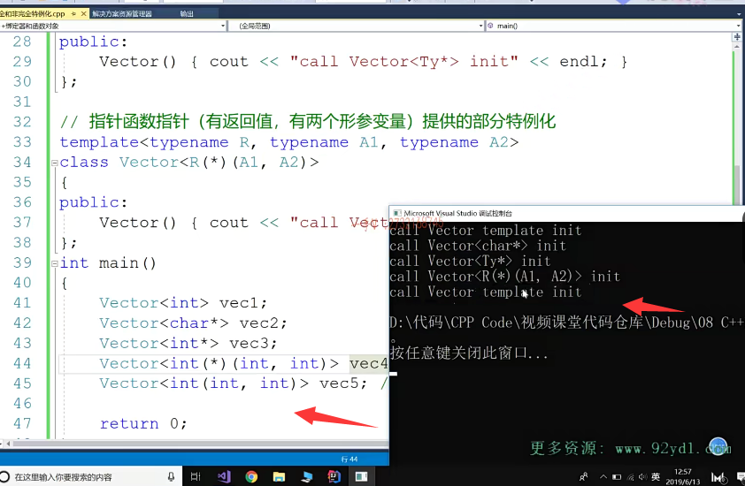

## 函数类型

那你想给它提供一个特利华版本可以type namer。a1t anf name a2。在这里边class vector。注意一下啊vector，这是ra 1a2。

这个才叫函数类型啊，这个叫函数类型。这个才叫函数类型，注意啊，函数类型啊，这是r好吧，返回值嘛啊return的意思是吧？这个呢才叫函数类型。

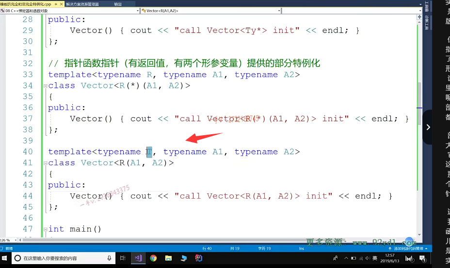

## 函数类型 模板部分特例化

那我们来看一下啊，看一下现在。我们用这个函数类型实例化的vector。匹配的是哪一个？是不是匹配到我们刚才提供的这个，这个肯定也叫做什么呀？部分特例化嘛。

这个是对函数指针类型提供的部分特例化，这是对我们函数类型。针对函数类型。提供的部分特例化什么函数类型呢啊？有一个返回值嘛，有两个形参变量嘛啊。提供的这个部分特例化。

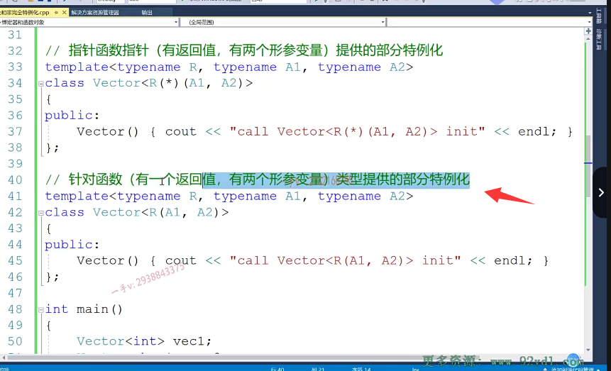

好的吧呃，希望大家注意一下这个啊，这函数指针跟函数类型。非常相似嘛，这个也是说它有区别，相似也是非常相似的啊，那你在这里边儿。你用这个类型定义的变量，它本身就是个指针嘛。是不是啊？你用这个类型定义的变量，它本身就是个指针嘛。

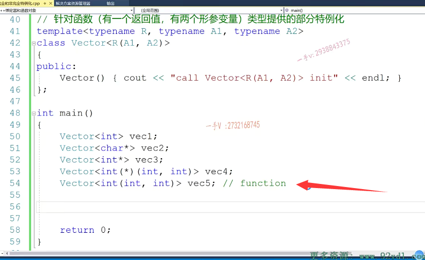

### 这样定义的PFUNC!本身就是函数指针类型了

嗯，你比如说我把这个刚才这个sum啊，给大家写出来return a+b，然后在这里边做一个简单的这个说明啊。你比如说这是tab def in。typedef in.这个类型。pf unc.那pfunz。我们定一个pfuc 1吧啊，那这个类型本身就是个函数指针的类型pfuc就直接可以等于上边儿的这个sum了啊，

直接可以等于上上边儿这个sum了。好吧，然后pf unc呢就可以计算两个。和的两个整数的，这个和了啊。

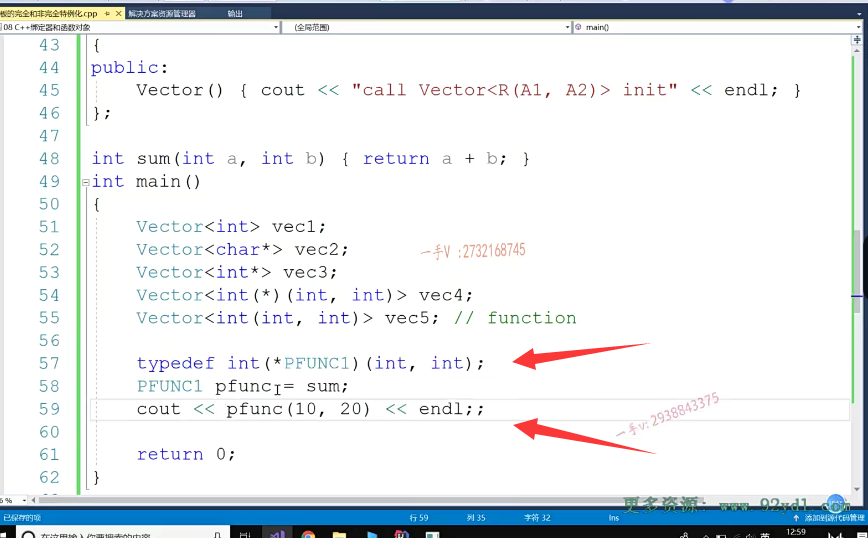

# 补充说明

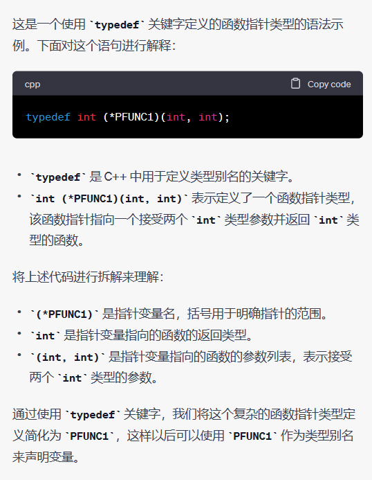

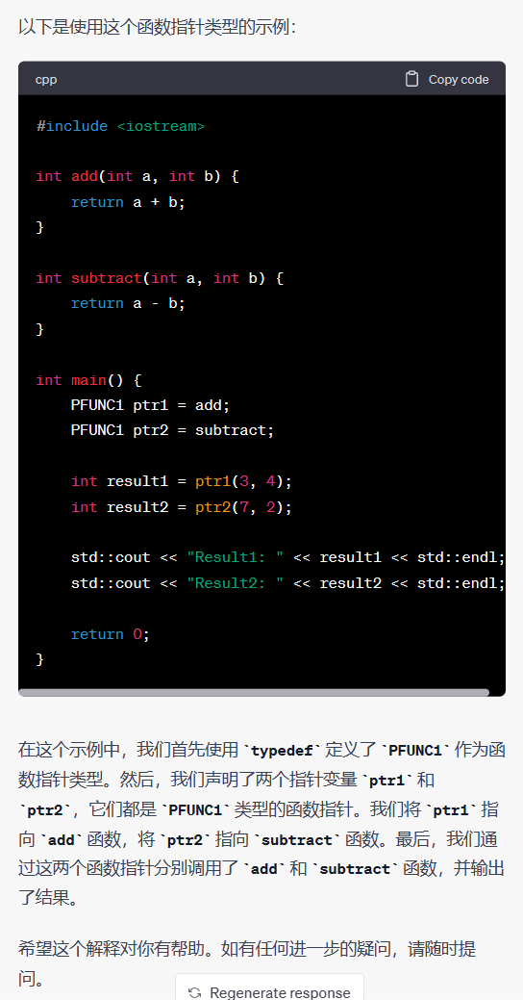

## PFUNC2为函数类型，需要加上*来定义指针

好了吧，那如果你是函数类型啊，如果你是函数类型。你比如说这个pf unc 2，你如果是个函数类型。那么，你定义的定义的时候，你必须哎。必须把这个指针你要加上函数类型上的指针，是不是才是函数指针类型啊？

好的吧啊，指向这个sum。然后呢？pf平行c2。

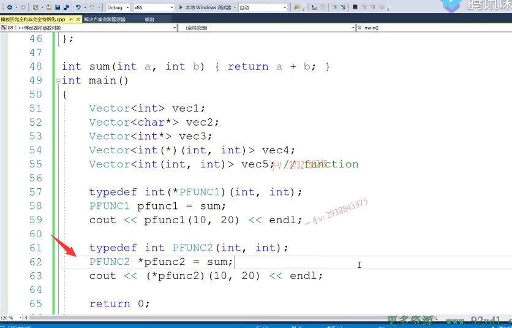

好，我们来看一下这个运行的这个结果啊。呀，都能计算出来，结果是不是啊？

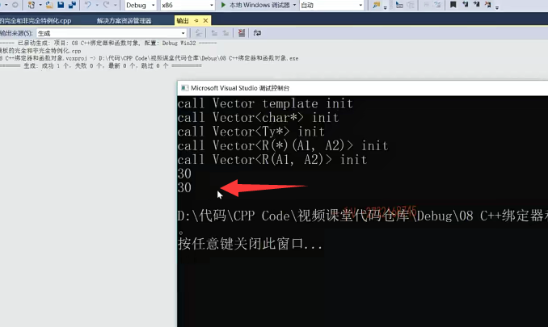

## 注意区分函数类型和函数指针类型

请注意区分一下啊。==注意区分一下函数类型和函数指针类型啊==。像这个就是我们给大家所说的这个。完全特例化和部分特例化，希望大家通过这么一个事例呀，对于。

部分完全特例化能有一个比较好的，这个理解。好吧嗯。

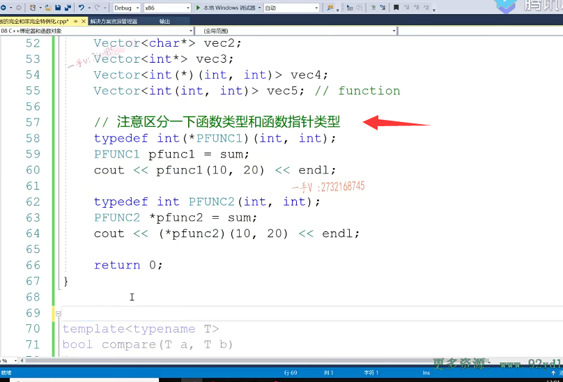

## 模板实参推演

行，那我们。特例化先讲到这里。接着我们来说一下。这个模板的这个实参推演啊，模板的实参推演。好。模板的实参推演啊，其基本概念是很简单的啊，其基本概念是很简单的基本概念。很简单，也就是说呢，

跟我们刚才一样，刚才我们写了一个函数模板，对吧？按理说呢，你用的时候呢，应该都给函数。这个模板加上是不是类型实参啊？==但是我们也可以不加，人家会根据实参呢？推演出来的。==

## 实参推演举例

啊，会根据实参推演出来的。那么，根据实参推演出来这个类型的时候呢啊，那有的时候呢，

我们就有一些说法了啊，就有一些说法。就是呢。什么说法呢？来看看我们给大家举个例子啊，举个例子。

那在这里边，首先呢，我们给大家写一个t func啊。t那在这里边呢，给大家打印一下tapi dt的这个类型。啊。你看我传了一个整形，又传了一个什么呀，又传了一个字符串。

啊。那么，我们使用的是一函数模板，但是并没有加上先括号，所以人家根据实参可以给我们把这个类型t呀。给推演出来，所以我们在这里边也打印了一下这个类型，分别是这个整形和cosnst char*

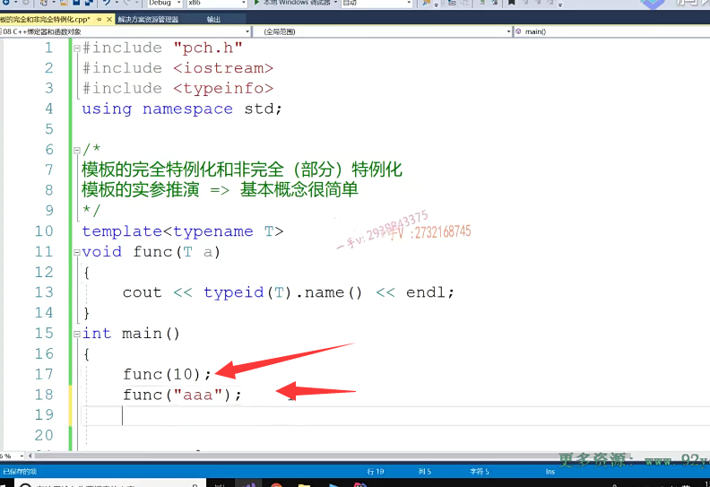

## 推演出来函数指针类型

好，假如说我现在给他传了这么一个东西。就是我们刚才的这个什么类型啊？诶，

这个函数。我给他传了这个sum进去。大家来看，那么它从这个实参呢？就可以推导出来，这个t是个什么类型啊？这个t是个什么类型？这个题是一个函数。指针类型了，大家来看。诶，它推演出来这个类型呢，就是一个函数指针类型。

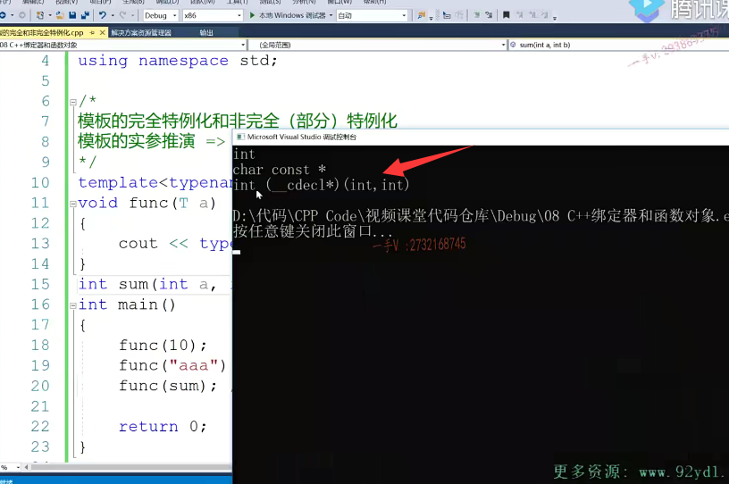

对的吧啊。当然了，

我把这两个屏蔽掉啊，你如果在这里边儿，你写个指针就是形参呢，已经是个指针了，那那么它推出来的t肯定就是个函数类型了嘛。啊，大家来看一下。唉，这时候它推出来类型就是个函数类型了，这是调用约定好吧，调用约定我们可以去掉。哎，你看。这能明白吧，

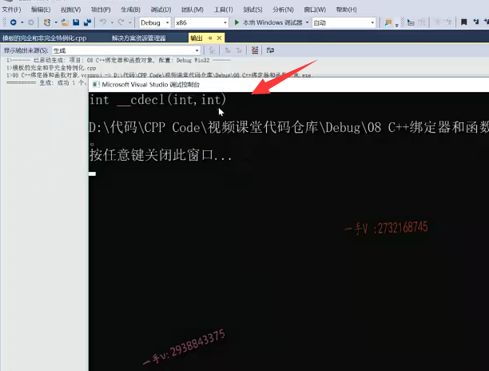

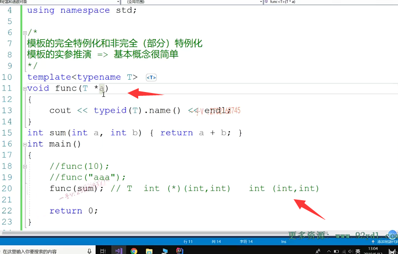

## 类型太大了，我希望把返回值和形参都取出来

刚才也举过例子给大家说了函数指针类型跟函数类型的这个异同点啊。

好，我们还是放成这个，那么现在啊，==你推出来的这个类型太大了==，就是你这个t呀。啊，这个函数指针类型啊，全部都包含了，有返回值，还有两个形参。但是也就是说，现在的这个现在这个问题是什么呀？

t包含了所有的。这个大的类型。我们现在呢，想把这个返回值跟所有形参的类型都取出来。都取出来，我都取出来。

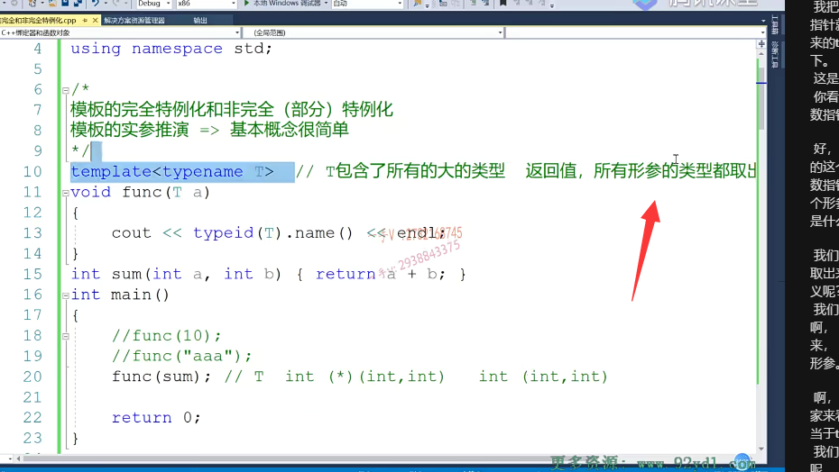

## 怎么取出来？

那我们该怎么定义呢？该怎么定义？其实我们可以这样去定义啊，我们可以这样去定义来看一下。我们重新定一个吧啊，重新定一个。我们就不删除了，把这个留下来，大家好观察啊。f平c2有一个返回值。有两个形参。

啊，在这里边呢，我是返回值。心。新a。a1a2大家来看一下啊。我们现在变成了这么一个。

刚才相当于t包含了所有的类型，整个儿的函数指针类型，我们现在把函数指针呢，返回值两个形参的类型呢，分别做了抽象化。唉，把它们合起来，组成一个函数指针类型。

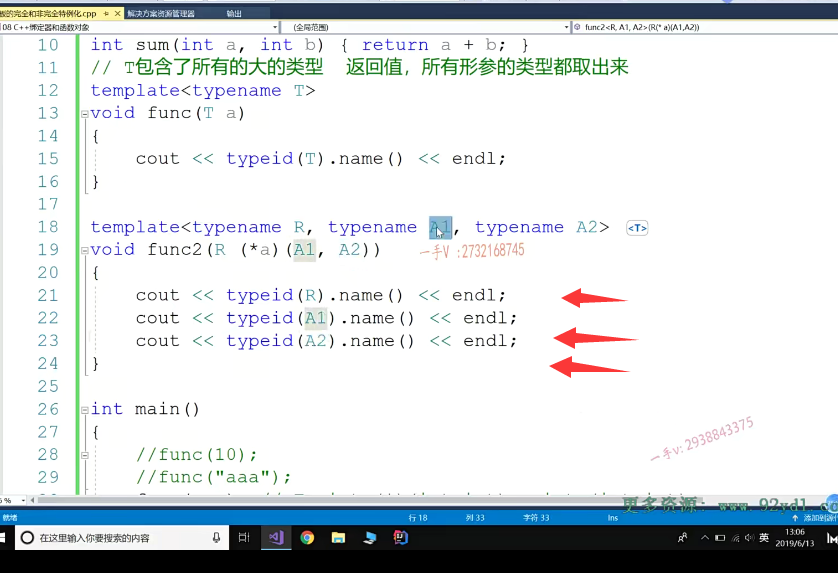

## 运行结果

那现在。我们就可以得到它细分的这个类型了，哪个细分的类型呢？返回值的类型以及两个形参的类型a1a2的类型就都可以得到了。啊，都可以得到了，我们调用一下这个func 2啊，调用一下，重新调用一下func 2。大家来看。我们类型完全可以得到，

这是第一个函数指针类型，得到这个大类型，我们用起来也不好用。唉，

我们现在呢，把它的类型呢，大类型进行了一下分解，各个小块儿类型呢，就完全部进行了一个参数化。对吧，全部进行了参数化，你看返回值两个形参的类型，我全部得到了。全部得到。

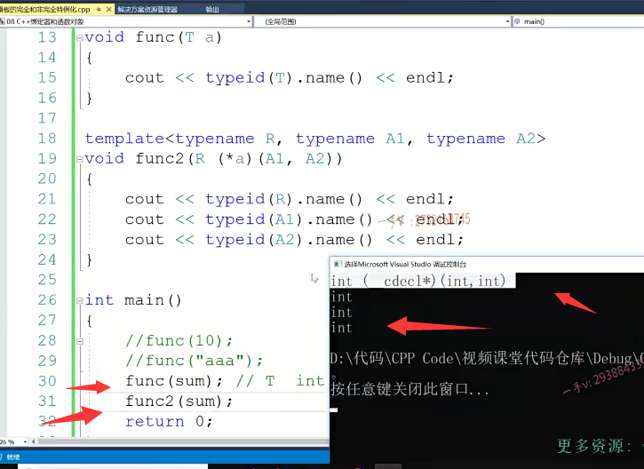

好在这里边呢，我甚至我可以定义一个类test啊test。然后在这里边public，我在这里边，我写一下。

return a+1个b。大家来看啊，我甚至我可以定一个func三把谁传进去啊，把test里这个成员方法。sum穿进去。如果说你定了fuc。那你得到的将是一个指向成员方法的函数指针类型。好，我们看一下啊。在这呢。我们哪里有问题唉，这个语句的后边这个方框加了有问题啊。

==好，大家来看啊，你得到的将是一个指向成员方法的指针类型。==对吧，你看指针前边有一类的作用域。那这个是一个大类型啊，

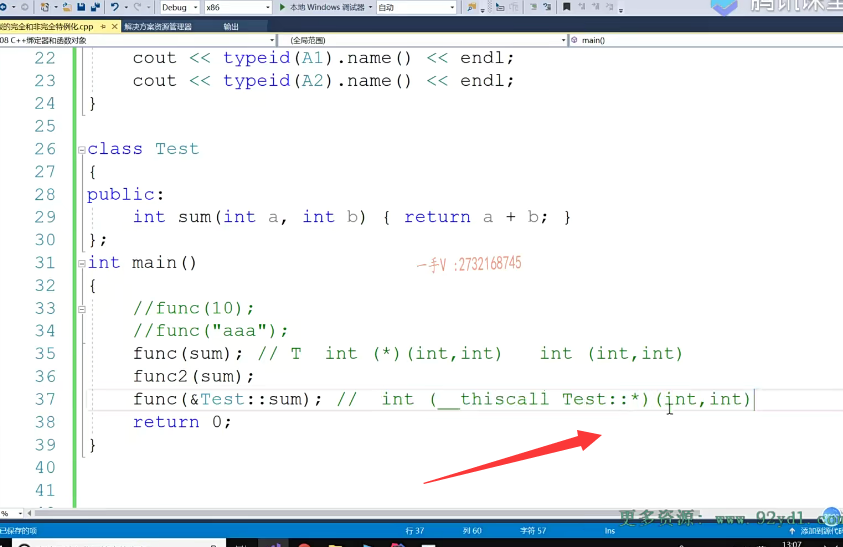

我们如何得到这里边儿，包括返回值类的作用，类类类型以及两个形状的类型，对不对？我们可以写一个fuc 3出来。大家来看。返回值的类型。这个类的类型tap啊，一个参数的类型，两个参数的类型。class啊，

不是class啊，这是个函数嘛啊fuc 3 rt。这是个参数啊arg，你写成啥都可以啊a1a2。那也就是说func 3跟func，其本质上是一样的，func用一个类型t包含了这个是。实参呢，复杂的所有的类型，而fucc 3呢，在这里边针对我们调用的情况呢。得到了我们实参这个大类型里边儿所有细分的类型。

我们看一下这个是r。再来一个t类型。大家来看一下啊。

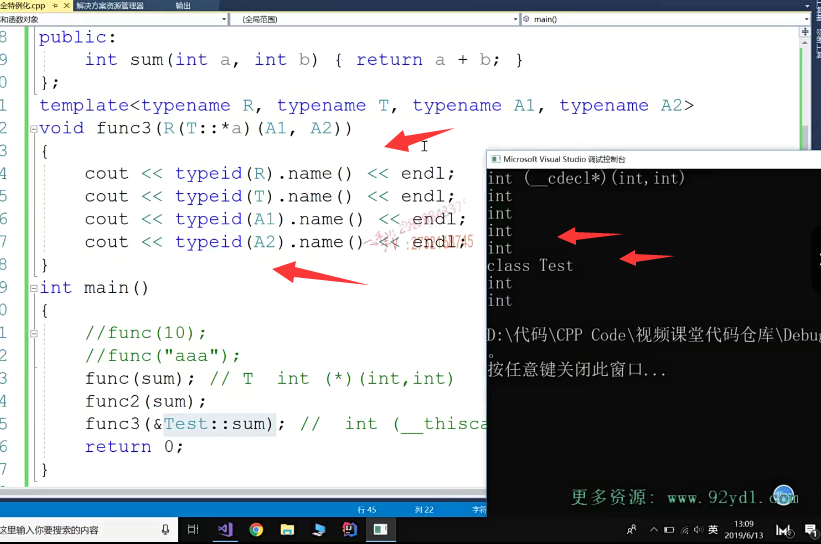

你看我把这个类的成员方法传进来以后呢？在这个方法里边儿啊，我这样去写这个模板啊，通过我们模板的实参推演。它不仅仅可以推演出来，这个返回值是整形，还可以推演出来。

我们当前的这个。类类型是test类型哎，我们甚至可以在这个函数里边用t定一个对象啊。

对不对？因为我们已经知道了这个函数属于哪个类的？这个类类型了。

还有两个形参变量的类型，这个要比完全得到，

只得到一个大的类型，是不是要灵活的多啊？非常灵活。

啊，那也就是说这个在这里边儿这几个例子指导我们啊，在进行写这个模板函数模板或者类模板的时候啊。哎，我们可以针对具体的情况呢，

## 模板实参推演 

## 大类型细分 好处

哎，把它们一个大类型的细分类型呢，全部进行一个。类型的一个参数化啊，定义相应的类型参数来接收一个大类型，里边儿所有的细分类型。这样我们使用起来会更灵活一点啊，

会更灵活一点，

因为如果呢，你只用一个t包含一个非常大的类型，基本上来说这个类型啊。你想使用也不太好使用啊，不太不太好使用。所以呢，这就是我们模板实参推演的一个魅力所在啊，一个魅力所在，它确实是功能非常非常的强大。好希望大家呢，通过我们这一节课啊，说的这两点问题啊。特例化跟部分特例化完全跟部分特例化以及模板式三推演对于复杂类型的操作，希望能够好好理解一下。

我们下节课就来剖析function函数，这个函数对象类型的，这个实现原理啊，这些知识呢，都是需要用到的。好，那我们这节课就先到这里。

