# Function函数实现原理

大家好，那我们从这节课开始呢，给大家说一下啊。这个function函数对象类型的实现原理啊。

我们呢，通过两个例子，一个是呃持有普通函数，一个是持有类成员方法啊，

我们来看一下啊，我们来看一下function的，它的原理到底是？什么啊啊，好在这里边呢，我们先来举我们。

这个第一个例子STR既然用到了string，

我们就得包含了string的这个头文件啊。好在这儿呢，它的这个实线很简单，就是打印了一下STR。

现在使用大家应该都会使用了，要使用function呢，需要包含function头文，function的头文件对吧？里边包含了函数对象类型啊，好在这呢

function，这是void，这是函数类型funce。等于hello，然后呢？通过fuc 1这就是写的hello world。

这是我们之前在应用的时候都已经讲过它是怎么应用的，那我们今天就来看一下啊，它的这个实现原理是什么？

好，首先呢，那我们把它改成my了，my function我们来实现一下这个机制啊，实现一下这个机制。那么，大家来看一下我们，

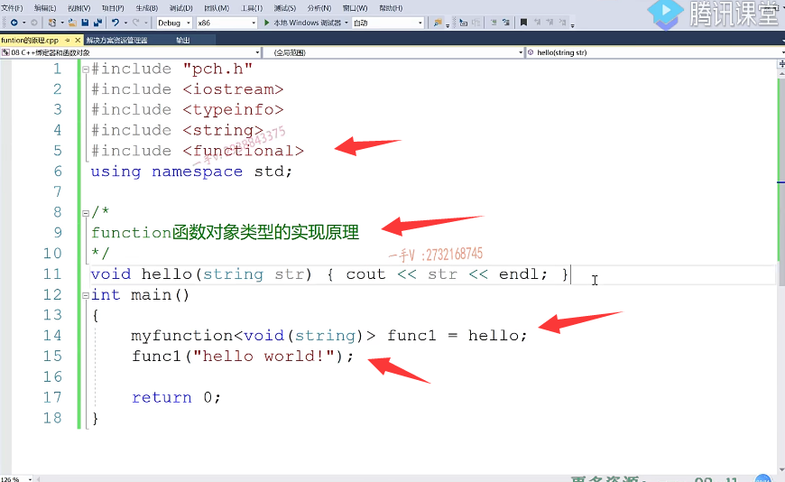

## 先提供模板

首先呢，给它提供一个啊，给它提供。那么。一个模板啊，

我们首先给他提供一个模板，比如说是fty是吧class？my function啊，这相当于先提供个模板。

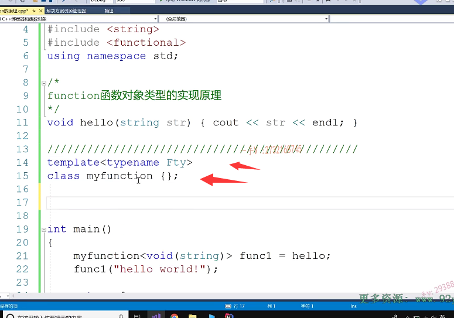

## 提供一个模板部分特例化

然后我们可以再给它提供针对于我们这个样子的一个。

来看一下啊，看一下就是返回值。然后有一个参数，这个应该叫做我们说过的，

这个部分是不是特例化啊？它是个函数类型。有一个返回值，有一个参数啊。

然后my function在这里边是ra 1，这是函数类型好的吧？

public public private.大家来看一下啊，大家来看一下。

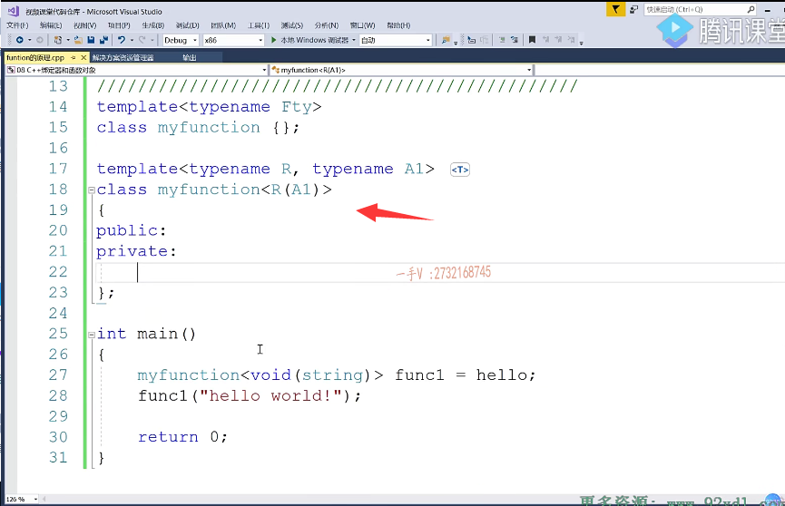

## 使用typedef 

在这儿呢。我们相当于构造函数呢，接收了一个外部传进来的，一个是不是函数啊？那这个函数的这个类型是什么类型呢？我们在这里边可以进行一个typedef fun。啊r。

这个pfunc那就是这样的一个类型。啊，就是这样的一个类型，

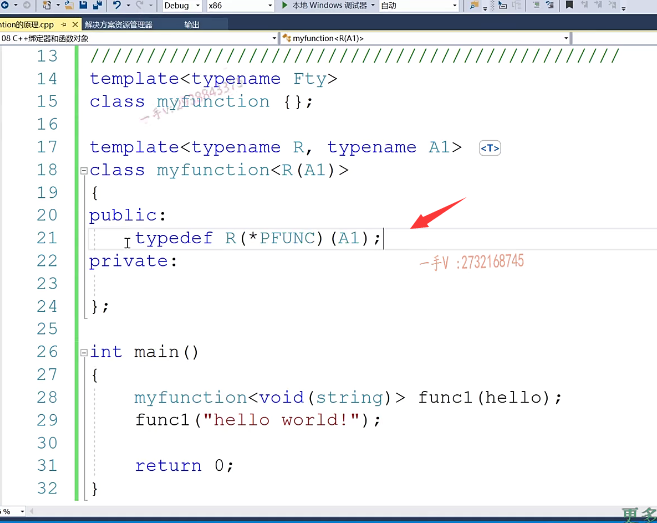

## 使用using

或者我们用using也可以啊，用using pfunc等于。这个函数指针类型。

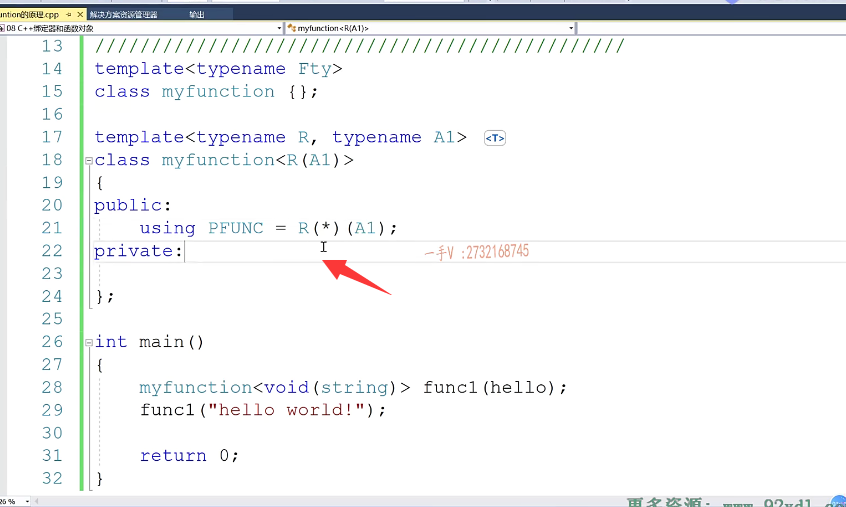

## 成员变量是函数指针，所以将外边的传进来函数名字保存起来

对吧，我们成员变量呢，

需要定一个函数指针变量，因为我们要接收外部传进来这个函数的嘛啊。然后呢，提供一个构造函数。在构造函数的初始化列表里边啊，外边传进来这个函数呢，我们保存起来，

## 小括号重载，参数是A1类型

然后在这儿呢，提供小括号运算符，重载函数，小括号运算符，重载函数呢，

它需要传，需要接收一个参数的。啊，就是我包装你的这个函数需要什么参数？我这个小括号运算符重载函数就需要帮你拿从用户那里拿这个参数，那参数是一个类型是a1嘛？

对吧，这是个arg，那也就是说。它是这样的一个调用。

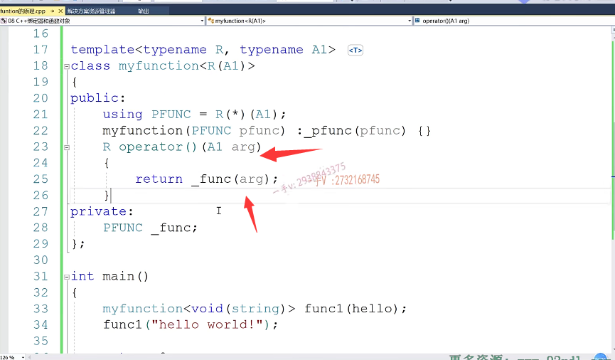

## 发生了一个错误

我们来运行一下。好在这呢，我们有一个错误啊，杠pf unc。

找不着啊，叫杠pf unc啊，杠pf unc。

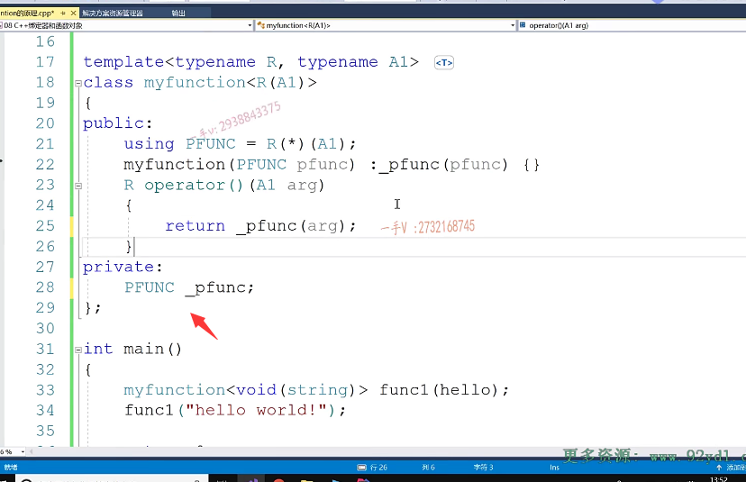

嗯嗯。大家看到。我们这个hello，这个函数通过函数对象完美的调用啊，完美的调用。

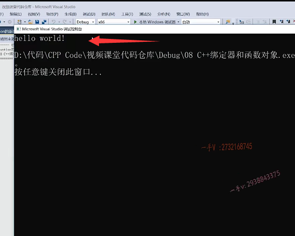

## 原理分析

它的原理其实就是这个样子的啊，函数对象嘛，用小括号运算符重载函数是吧，它把我们传入的这个函数呢，返回这一形参呢。诶，都列出来了

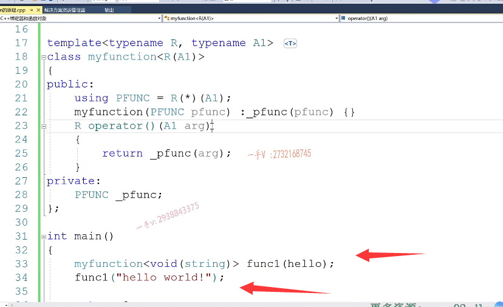

## 先是构造，传入函数指针

## 然后是小括号运算符重载，实例化的string类型的

## 底层去调用hello函数

大家来看一看啊。那么，通过我们返回值参数的类型，定义了一个函数指针类型。把呢外边儿传进来这个函数呢，哎，给它保存到我们的成员变量上了，在这里边儿相当于就是。

function呢，调用了它的什么东西呀，调用了它的括号运算符的是不是重载函数啊啊，调用了它的括号运算符的重载函数。

然后呢？把这个hello world呢传进去了。

==那这个参数类型就是hello的，就是也就是实例化，我们my function的这个形参列表，这个形参类型string类型，所以这里边用a1==。这里边就是a1这个类型定义的一个参数啊，来接收我们的这个hello world，

==其底层调用呢还是这块其底层调用的就是这个hello这个函数。==

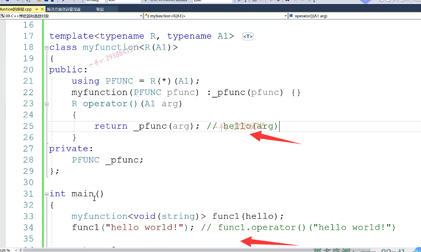

## 打断点调试

==我们可以打个断点，在这打个断点调试一下，你发现这块一定要用，就得到我们的小括号运算符重载函数里边来==。啊，

大家可以仔细的去思考一下好吧，那么同样的，

## 再举个例子  sum函数

我再举个例子啊，这里边儿是还是我们之前的这个some？sum对不对？是returna+a+BA+b。诶，就是它a+b，我们把它写到一行吧？

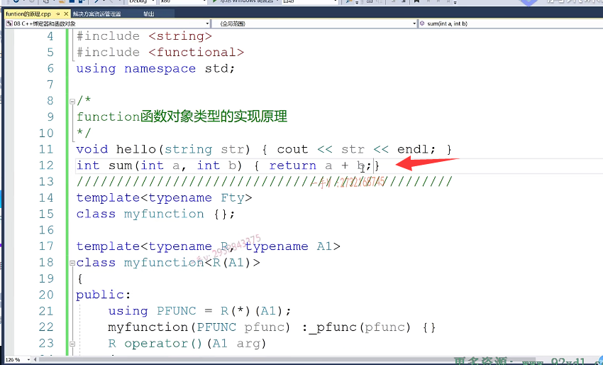

好了，那在这里边呢，我们是不是相当于要用一个my function？啊，在这里边就是int fuc 2哪个sum？

然后呢？我们就可以把func 20，20的这个运算，结果呢？我们是不是打印出来了？

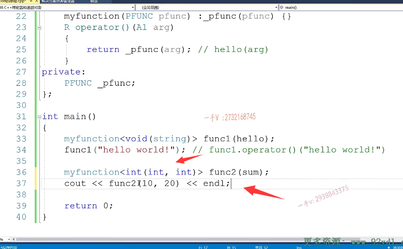

## myfunction模板需要重新写一下

那当然了。func2需要。在这里边，我们重新定义一下啊，重新定义一下。因为这个函数的类型变了嘛，现在有几个类型参数了name。

现在是不是有两个啦a1和a2啊？这里边也要加个a2。啊a1a2。

这arg 1这是a2 arg 2现在需要两个参数了它。啊arg 1 arg 2，好，那我们来一起看一看，检查一下这个是否正确，返回值是r。啊，返回值是r有两个形参类型了啊，有两个形参类型了。

a1和我们的a2啊。是不是好了？那用这个类型实例化的这个my function，最后就匹配到我们这个的。部分特例化版本了，是不是啊？

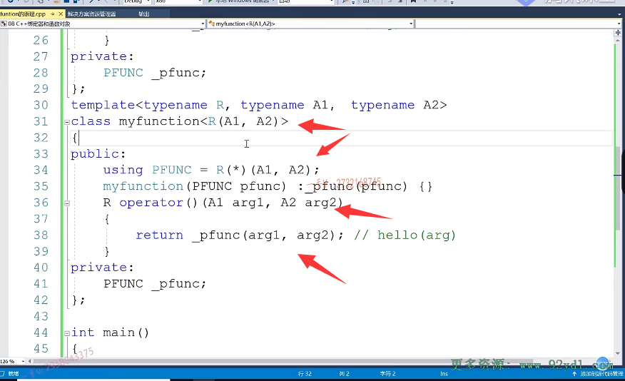

## 运行结果

好，我们得到了两个整数的加法30，这个也是没有任何问题的啊，没有任何问题的。

大家看看。其底层原理就是这个样子啊，就是这个样子。

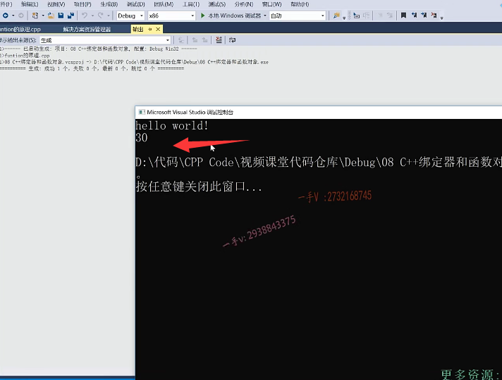

那有的人可能有疑问了啊，说是这个运行倒是能运行啊，但是呢，你这个好像。作为库的设计者，这个function呢？好像呃，一个function的费用呃，

这个完全特例化，就得对应一个函数类型哎。

这函数是多种多样的，这个function上得写多少个啊？对吧，那有的函数是两个参数，有的是一个参数，有的还有三个，有的有四个，有的有五个，难道你这永远也写不完吗？

其实呢，大家来看啊。这个不不过就是my function里边儿，不过就是函数类型嘛，

函数嘛，长得都一样，有返回值嘛啊，不管你返回值类型是什么，因为我这用r了。来抽象这个返回值类型，返回值类型只有一个，我知道它有一个就行了，至于具体是什么类型，我可以定一个模板类型参数呢？来得到它的类型。那剩下的就是参数列表不同了。这有一个参数，这有两个参数，还有三个啊，

有四个参数，对吧？

## C++提供的语法     形参的个数   解决

那其实呢，大家不用担心啊，不用担心我们CA加也有里边儿呢，给我们提供的模板的语法就非常的强大了，此时就能看出来了啊。

我们把这个代码呢，我们先给它。给它去掉啊，我们来看，我们就只写一个啊，只写一个。嗯，我们刚才写的时候，大家也发现了这两个my function，唯一不同的就是。形参的个数不同，除此之外，是不是都一样啊？

呃，那我们给大家把这个刚才写第一个拷贝过来，我们只写这一个就行了。啊，我们只写这一个就行了。那怎么写呢？这都是点点点，你注意一下啊。

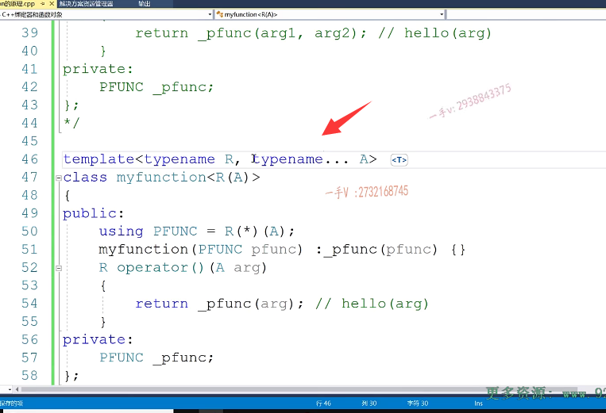

## ...表示什么？

那这个表示什么意思呢？这个表示呢？

==可变参可变参意思就是说呢？这a呢？表示的不是一个类型，而是一组类型，个数是任意的==。

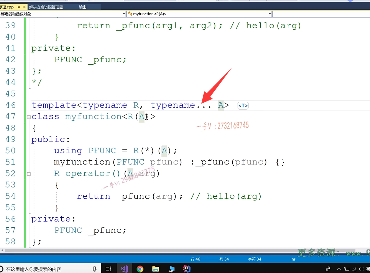

## 三个点的位置不同    加在前面还是后面需要注意

这也加三个点，这表示呢？我呢，在这儿是一个部分特例化啊，

==给哪个类型进行部分特例化呢？给函数类型什么样的函数呢？有一个返回值。==

==但是形参个数不确定是一个可变的，可变参数个数的一个函数参数列表啊，==

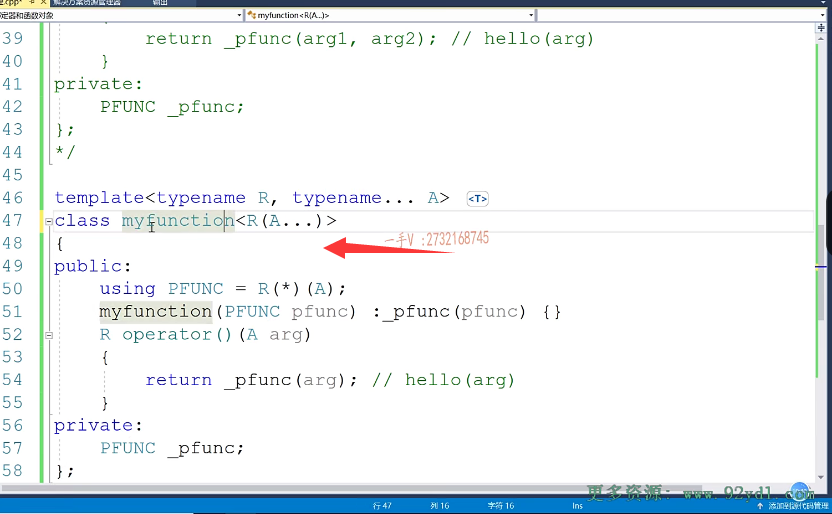

## 可变参类型

那在这儿同样。

这也是注意传入的时候啊，这个arg呢？这个arg现在表示的不是一个参数啊，表示的不是一个参数，因为这是一个可变参类型。

这是一个可变参类型，它可能表示很多类型，所以传递arg的时候呢==记住也加三个点儿，这表示呢一组。参数啊，一组形参变量。==

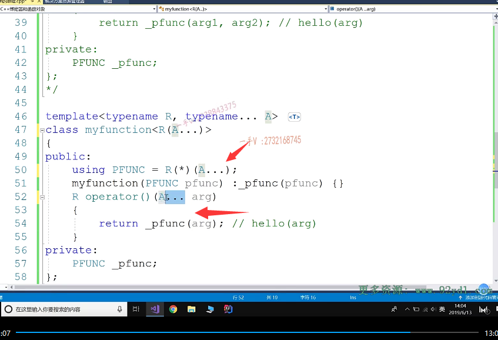

## 编译器实例化时，会给我们每个参数都作为独立的参数传递进去

它到时候转换的时候呢，就是模板实例化的时候呢，就就会给我们编译器实例化它的时候，就会给我们把这一组参数，每一个参数呢都当做一个独立的参数传递进去。

啊，都当做一个独立的参数传递进去，

## 运行结果

你看我现在就写了这么一个。我们来运行一下。没有任何问题。

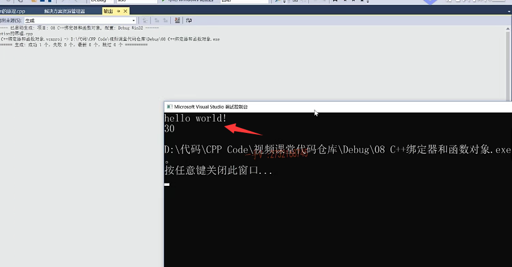

# 总结

对于这样的方式呢，你随便用任意的函数去实例化啊，它无非最终调用的就是我们所包装的这个函数，对吧？大家来看一下。啊，就是这个样子。

==这就是它的这个底层的这么一个实现的原理啊，==

底层这么一个实现的原理。我们从刚刚刚的这个扩充了两个函数，却发现呢，函数类型不确定的情况下，

这my function是不是也不知道写多少个呀？

啊，==我们C++11里边给我们提供了这个可变参的啊，可变参的这个类型参数==。啊，那么使用起来就非常方便，==我们只需要提供一个。my function就可以了啊，只需要提供一个my function就可以了==。好，大家好好的理解一下啊。

啊，希望大家呢，通过我们刚才这一块的这个内容的讲解啊嗯，实现了实现了一下代码。

希望大家能够理解呢啊，理解这个方式呢，==这个原理啊，它其实还是呢，就就是个函数对象。对吧啊，理解它这种封装的思想好==，那我们就讲到这里。