大家好，这一节课呢，我们主要给大家介绍C++11里边的这个bind绑定器啊。

那么，我们C++stl里边儿那个bind first跟bind second啊，只能用于二元函数对象。是不是啊？

## 绑定器返回的结果还是一个函数对象

我们11里边儿提供的这个bind的绑定器呢，那么它的功能呢？就非常强大了啊。绑定器呢，其实返回的这个结果啊，返回的结果还是一个函数对象啊，它还是一个函数对象。还是一个函数对象，

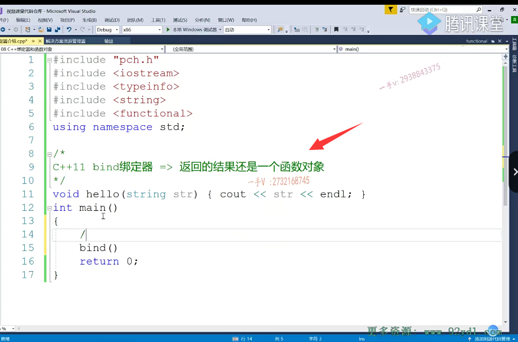

对吧？我们举个例子吧啊，先来看一下它的这个应用啊

hello，我们还举前面的这个例子。cout str 

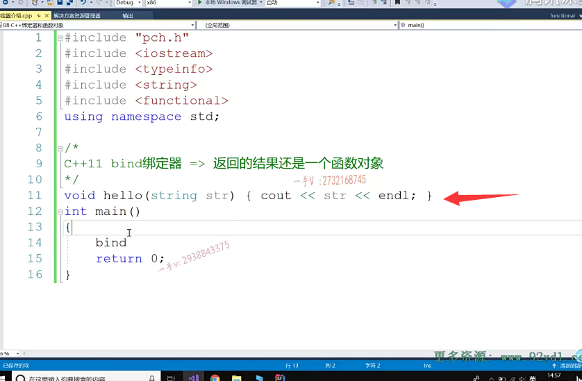

那么在这里边，我们bind的注意function，

刚才是一个类模板啊，类模板bind的呢是一个函数模板。

那么我们用的时候就可以直接用，就不用给类型了啊，因为函数模板嘛可以。bind的是函数模板，

就跟我们之前我们自己用代码写的bind的first跟bind的second一样，

==它其实呢是一个函数模板，可以自动推演这个模板类型参数对吧？可以自动推演呢？这个模板类型参数啊？然后它会返回一个新的绑定器，那个绑定器其实还是一个函数对象==啊

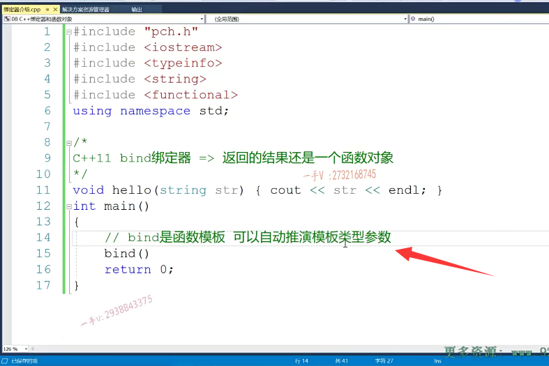

## 给绑定器绑定一个参数

hello，大家知道这个绑定器，绑定器是给函数绑定参数呢，对吧？

我们可以给这个函数绑定一个参数啊，绑定一个参数叫做hello world。

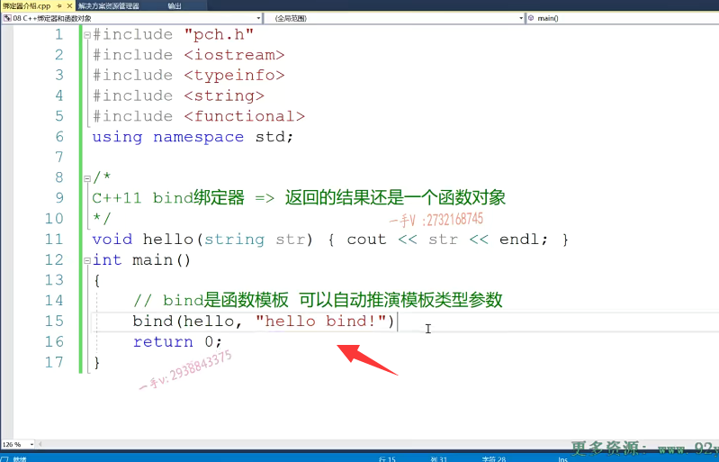

## bind(hello,"hello bind")就是返回一个函数对象

## 再调用小括号重载，就能调用函数

它应该是hello bind啊。

那么，这个返回的结果呢？就是一个什么呀？就是一个绑定器，也就是一个函数对象，

这个可以调用它的小括号运算符重载函数。啊，因为我们已经给它绑定了一个参数了，就绑定了一个hello bind的，这么一个参数了，所以我们在调用这个bind的这个。它的返回的结果呢，是一个我们暂且把它称作binder啊，就是返回的一个绑定器。那么就不用再传入参数啦啊，就不用再传入参数啦，

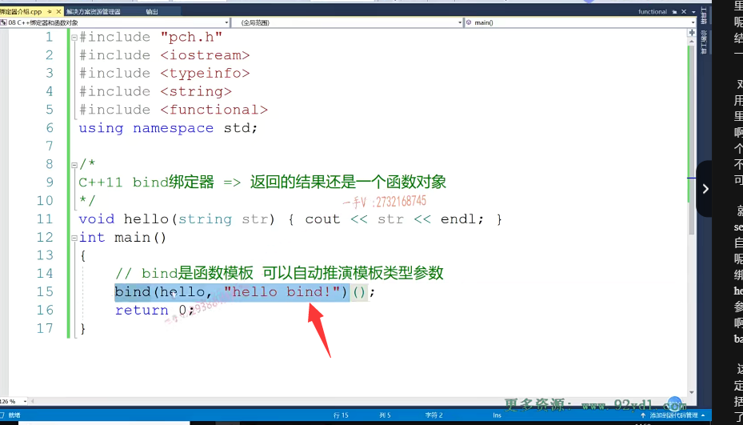

我们来看一看。hello,bind.没问题吧啊，

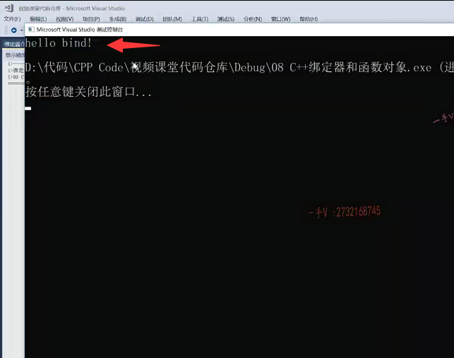

那我们还是把之前我们写的这个函数呢，我们都给它在这里边应用一下啊，应用一下。

那在这呢，我们可以打印一下bind sum十，二十，再把参数都绑定了。然后返回的这个绑定器呢在。调用绑定器，绑定器其实就是函数对象，相当于调用它的小括号运算符重载是吧？计算两个整数的，

这个加法的和啊

好30也可以计算出来。也可以计算出来，这是它的这个一种使用方式，对吧？

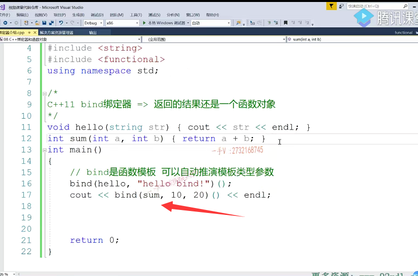

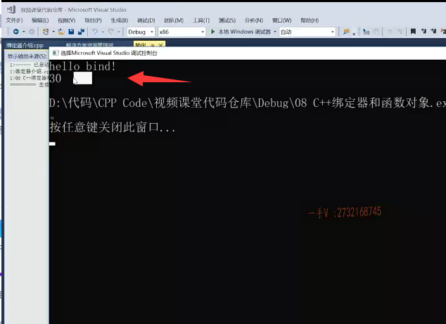

对于我们的类的成员方法呢？对于我们类成员方法也是一样的啊，

比如说这是test这么一个类。我们呢？给它里边呢，放一个sum方法啊sum方法

那在这里边儿进行bind的时候呢，那在这儿大家来看一下bind。啊bind的bind的这里边儿bind的谁呢？这是我们test的sum sum，

## 注意类的成员方法一定要取地址

注意我们类的成员方法，一定要前边取个地址，我们c函数呢，就是全局方法可取可不取好吧。

## 并且成员函数需要绑定对象，依赖对象

就一样啊。那在这儿需要绑定一个我们的test对象呢，是不是绑定一个test对象啊？

啊，绑定一个test对象，还有什么呢？还有20，30。

==因为这个成员方法的调用呢，必须得依赖于对象才能调的啊。==我们看一下这个结果。

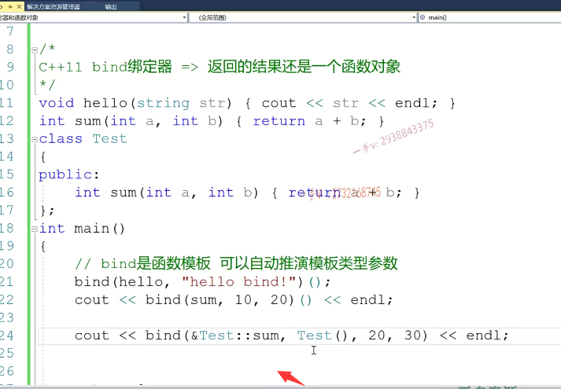

## 有点问题，少了个小括号

好，这里边有点问题啊，

有一些问题我们来看看啊。这里边儿返回的这个绑定器嘛，对吧？==返回的绑定器，需要调用它的小括号运算符重载函数啊，少个小括号。==

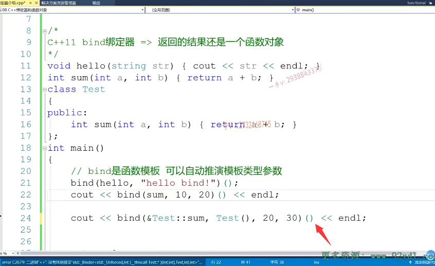

好这个照样呢。可以出来。那大家看一下啊。

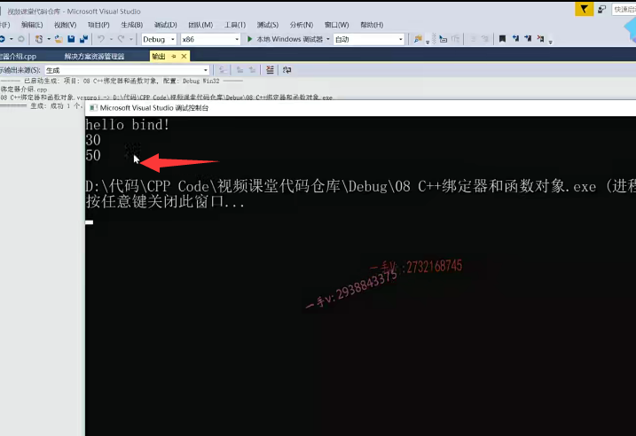

## 绑定器只能使用在语句当中

用起来呢，跟我们之前用的function是不特别相似啊啊，但是function它只能接收一个类型。

它是接触一个类型的啊，它是接触一个类型的，而我们绑定器呢，可以给我们相应的这个函数呢啊。

绑定一个固定的参数。

而且你发现啊，这些绑定器啊，这些绑定器只能使用在语句当中。是不是只能使用在语句当中啊？

啊，这些绑定器只能使用在语句当中。语句完了，这个绑定器呢，你要再用的话，你得重新写，我们如何把绑定器的这个类型留下来呢啊？

## 类型占位符

那我们就要综合运用function和bind呢？那还没有完，我们先再看一下啊，

这bind呢，可以这样用，还有一种用法呢，就是类型占位符啊，应该是参数占位符。

注意一下，比如说第一个hello，please holders杠一啊，

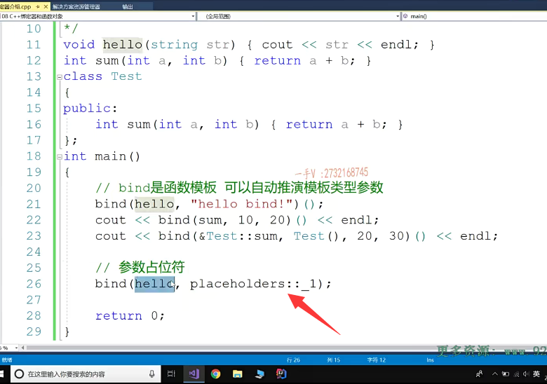

大家来看一下这个placeholders呢呃，这个也没什么特别的啊，

就是绑定器呢，最多可以绑定20个参数。你看C++11这边20个参数，这是一个参数占位符。

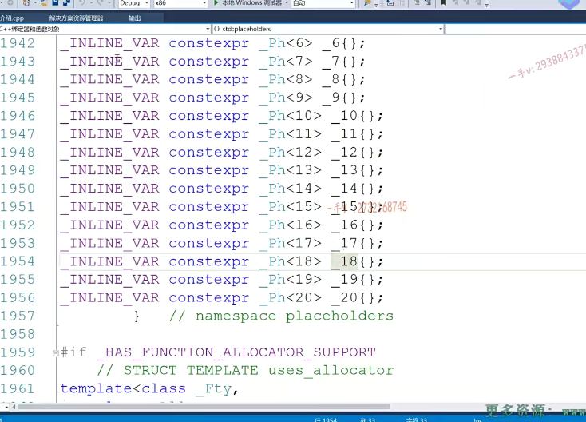

## 使用了placeholders参数占位符后，需要用户传递参数

就意思是说呢，我这个hello呢，它需要一个hello，这个方法需要一个参数，但这个参数具体是什么呢？我不知道，得等待用户传递。

==所以呢，当我们在调用这个。绑定器的时候呢，你就必须在这里边儿给人家传入参数了，因为这里边儿呢，有一个参数占位符==，

但是。还没有传，必须调用的时候才进行传递hello bind 二。

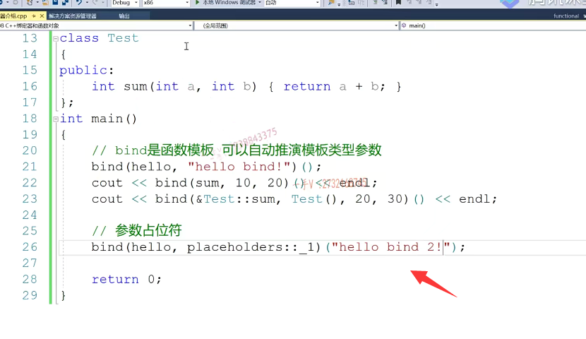

我们来看一下。没问题吧啊，在这里边。

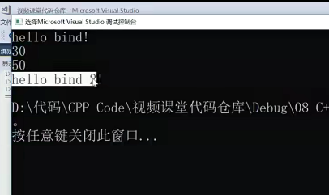

## 可以使用using namespace placeholders

那么，如果你嫌觉得嫌它麻烦的话呢，在这里边我们有namespace，你可以写一个uz。我们可以写一个using namespace啊，using namespace。please holders啊，

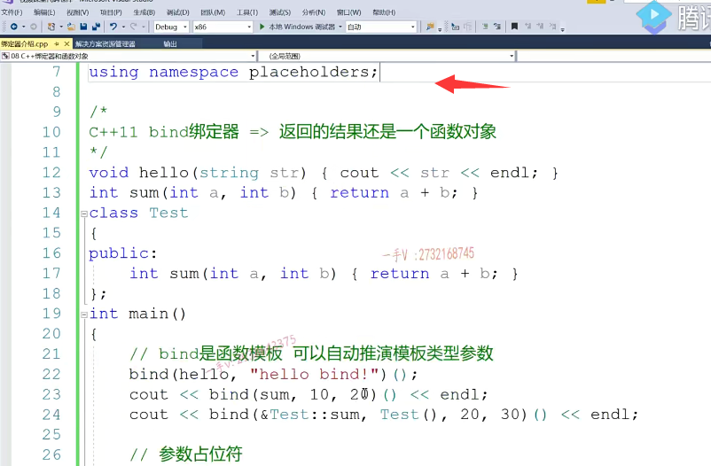

# 补充

## chatgpt表示我们这里写错了

## 表示我们不应该使用临时对象

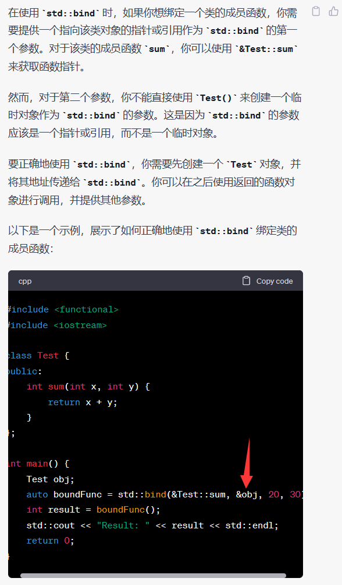

上网百度后发现，传地址和对象都行

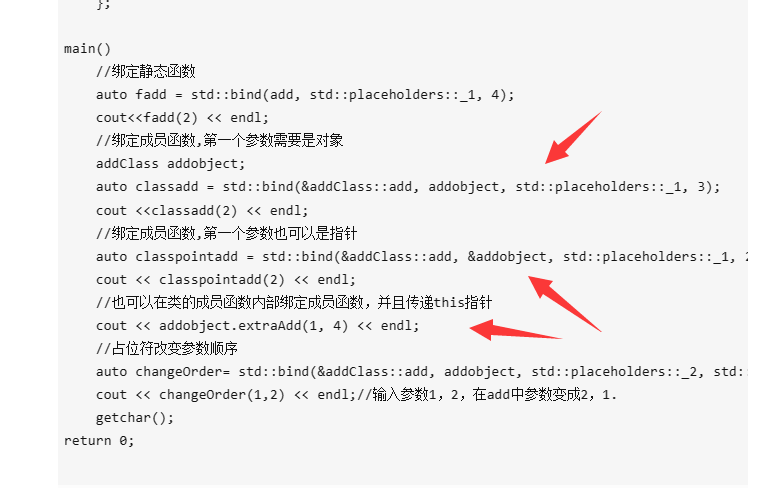

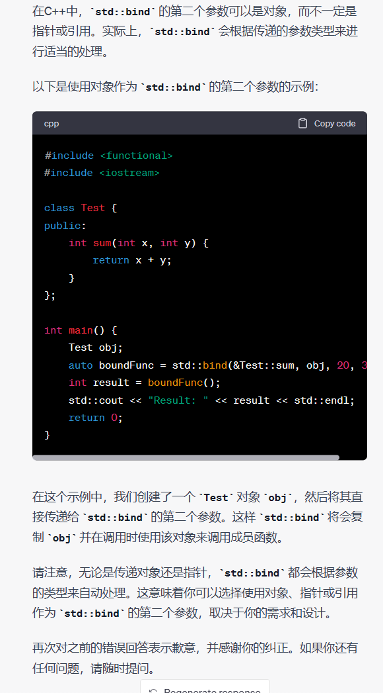

直接使用_1 就行了

我们这可以写这个。杠一杠二杠三就可以了。

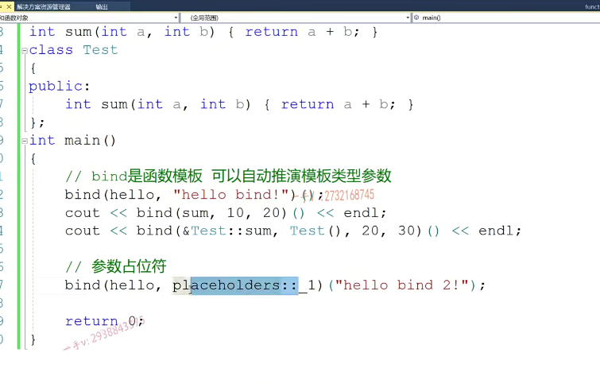

好了吧啊，

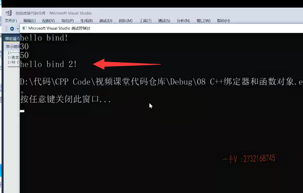

## 再举一个例子

那用的话呢，还可以这样用bind sum。

注意它的bind的呢，最多可以绑定20个参数啊，超过20个就。

不要用了20个足够我们用了，基本上很少碰到函数呢，有20个以上的参数了啊，

那在这儿呢，我们就需要传入两个参数了，比如传200和300。

这一样的，跟上面的区别，上面是把参数已经绑定好了，就不需要我们用户再传了，而这个呢是？

填入了我们参数占位符需要调用的时候，需要我们用户自己进行参数的传递啊。再看看这个，我也就能运行啦。

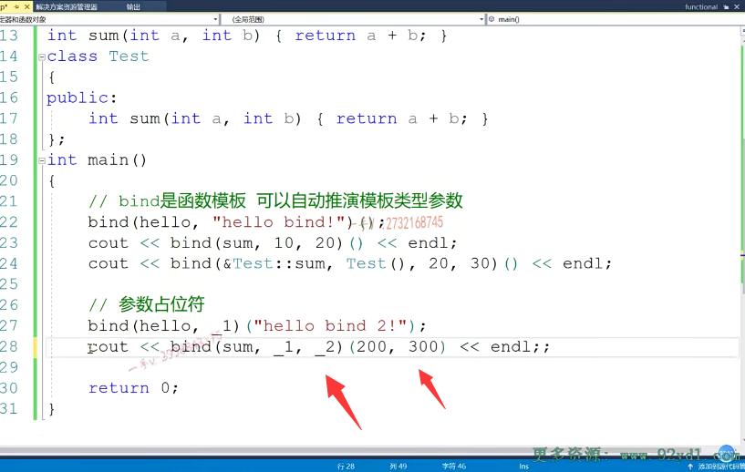

没有问题吧？绑定器啊，绑定器。但是说到这儿呢。那说到这儿啊，

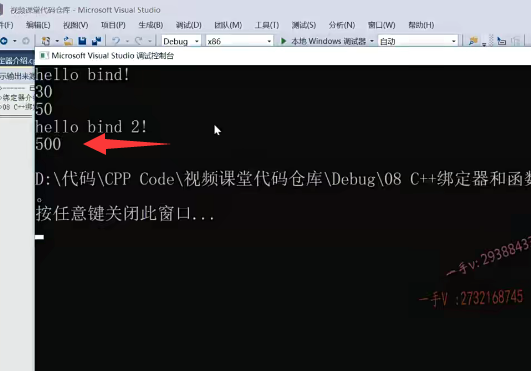

绑定器类型  通过  function 留下

说到这儿，因为我们就看到了一个问题呢，就是这个绑定器呢，它的类型是不是留不下来啊？

绑定器。出了就是出了语句，无法继续使用嘛。

啊，那怎么bind呢？那在这儿我们可以定义function。啊。定义function。对吧？那么，类型是一个返回值，

是void有一个string这个形参变量的一个函数类型，我们来获取这个绑定器啊。绑定其绑定的一个结果。啊，绑定器绑定的一个结果。看到了吧？

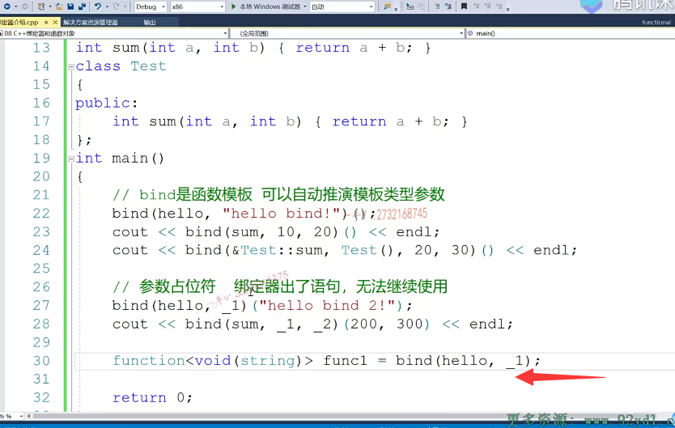

我们现在func调用的时候呢，需要传参数了，

我们现在需要传参数，因为这里边儿呢啊，这里边儿呢，应该有个参数占位符，对吧？啊，比如说是这个是hello啊China。

这个是hello，陕西啊。hello，这个四川。

对不对？我们就可以通过这个方式呢？函数对象类型呢？可以把绑定器啊给它。的类型给它留下来了，然后我们可以重复的去使用啊，重复的去使用。

好，你看这个都调用调用起来了，这个绑定器呢？在这里边就被复用起来了啊，

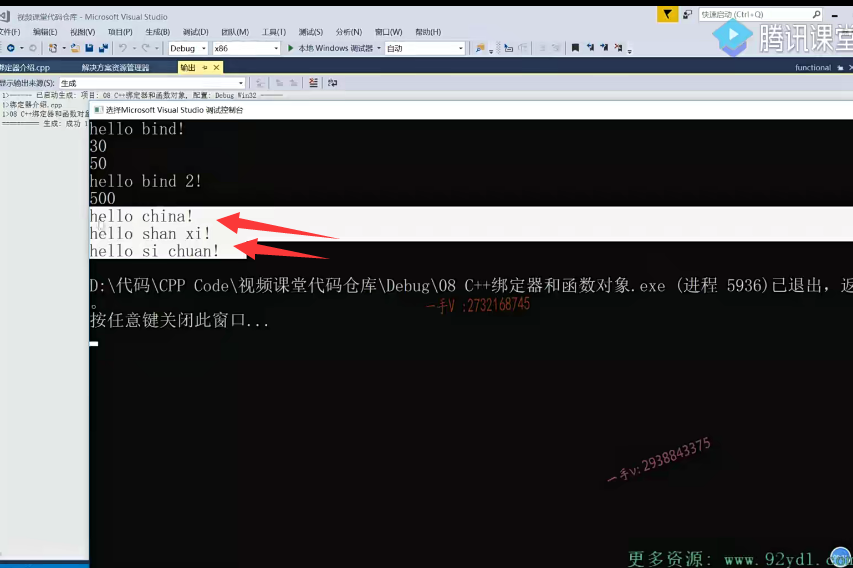

此处把。bind返回的绑定器。binder就复用起来了啊，就复用起来了。

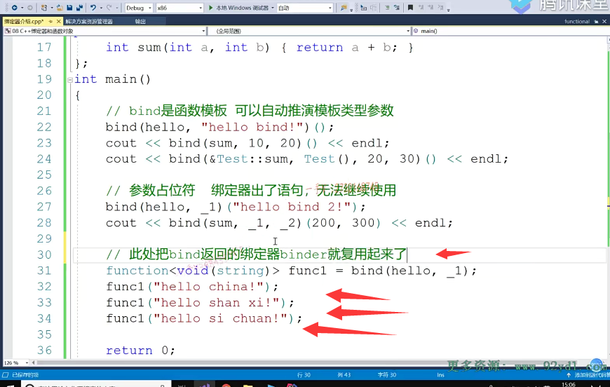

大家注意一下，在这里边的这个。绑定器的这个。应用啊，绑定器的这个应用。

那么，在我的这个。博客上呢，给大家啊罗列了。给大家这个。罗列了。

有一个。c++ muduo网络库。的一个环境搭建跟一个基本的这个使用啊muduo网络库。

那么，在这里边，大家会看到我们这个绑定器啊。

这里边儿的boost呢，是因为这个bind跟function

==原来就是一个非标准的C++开源库boost库里边儿提供的。==

现C++11里边儿呢，已经把它纳入到我们标准的C++里边儿来了啊。跟这个函数指针。啊，

## 第二个参数可以是指针

==成员方法的函数矩阵给它绑定this，因为成员方法都有一个形参就是编译后自动添加。形参就是this指针嘛，对吧？给它添加一个对象==，

这是参数占位符。那就是说on message这个方法，到时候调用的时候呢，需要用户给它传入三个参数。哪三个参数呢？

就是这里边connection buffer content。啊，这个绑定器。希望大家呢啊，能够把它看明白啊，绑定器。

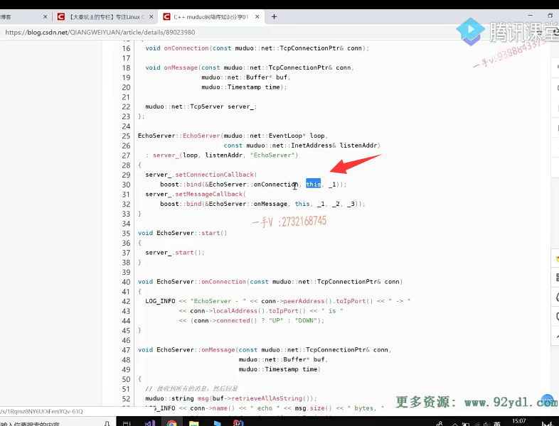

啊，大家了解了啊，通过这这么几个例子呢，了解了绑定器的这个用法啊，绑定器的用法就是这么简单啊，但是虽然简单，但是很实用。

结合function呢，我还能够把它的这个绑定器的这个类型啊，我们能够留下来对吧？

## 举个例子 实现线程池

那接下来呢？我们来。举一个例子啊，举一个例子，什么例子呢？

就是我们muduo网络库啊，用C++实现了muduo网络库。啊，在muduo网络库呢，这源码文件这个thread pool线程池点CC跟thread点CC里边呢，实现了一个非常迷你的线程池啊。

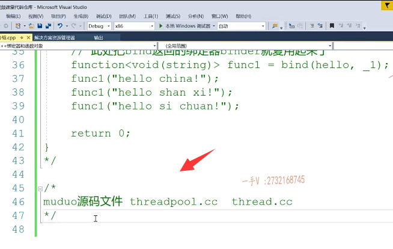

## C++模拟线程池

那么在这里边呢，我们用C++代码来模拟一下，让这个线程池的实现啊。

用到了bind和function的这个机制。

好，这里边呢，总共出现了两个类啊，

那我们这个叫做线程类啊，线程类就包含了呢？我们线程相关的一些。属性吧啊，属性跟方法对吧？

那下边这个是线程池类。啊线程池类class thread pool。

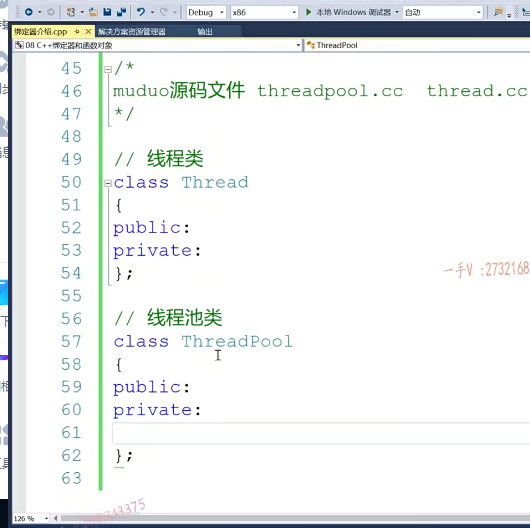

大家来看一下啊，那么首先呢，他在私有的成员方法里边儿呢啊，私私有的成员里边儿呢？那么，首先呢，先写了一个。vector用thread实例化的vector。

因为一个线程池嘛，肯定是包含很多的，是不是线程啦啊？

这个是我们可以起成一个pool。

啊，线程池好，我们里边放这个thread* 吧啊，

因为我们到时候线程类，我们都是给它new出来的，好吧啊。都是new出来的。

好在这我们来看一下啊，我们来看一下。那么在这就我们的这个线程的这个构造啊，还有它的这个吸构

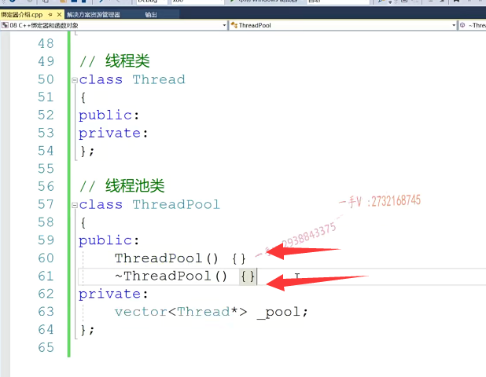

线程池在这里边有一个start方法叫start pool，

哎，我们里边呢，还有一个参数呢size。啊，这个叫启动就是开启线程池，所以开启线程池呢？

就是启动线程池里边所有的线程嘛，对吧啊？所有的线程。那么在这里边，我们来看一下。这里边应该有一个for循环嘛inti=0 I小于s，然后加加I啊。

在这我们是不是要创建size个线程啊？所以我们pull点push back啊new上面的这个thread。

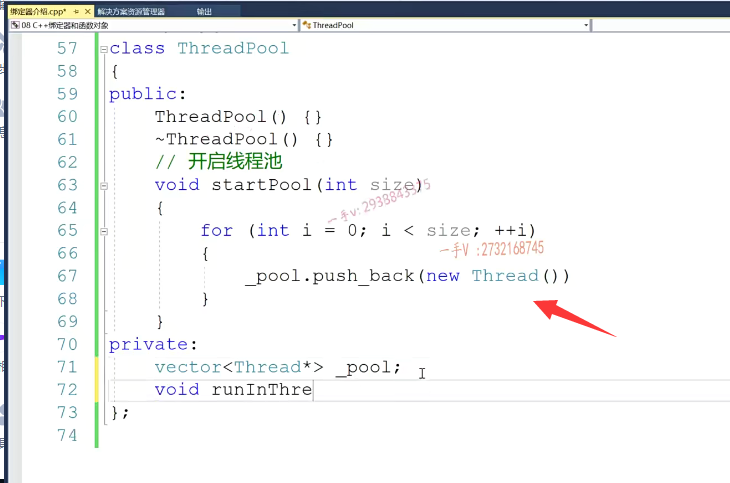

你有这个列对象，是不是啊？这个thread呢？我们需要一个线程函数的啊，线程函数的在这里边儿呢。

人家muduo库呢嗯，你看在这定义了这么一个东西啊running thread。啊把run in thread这个成员方法充当线程函数。充当这个线程函数。

大家知道，==不管是C++里边的thread还是大家学习Linux系统编程的p thread create。==

==它需要的这个线程函数呢？都是一个c函数。是不能够使用成员方法的==。

因为呢，你们这些函数它的这个函数类型呢，都是一个c的函数指针类型。啊，所以你不可能把一个成员方法的函数指针扔给一个c的函数指针接受不了。

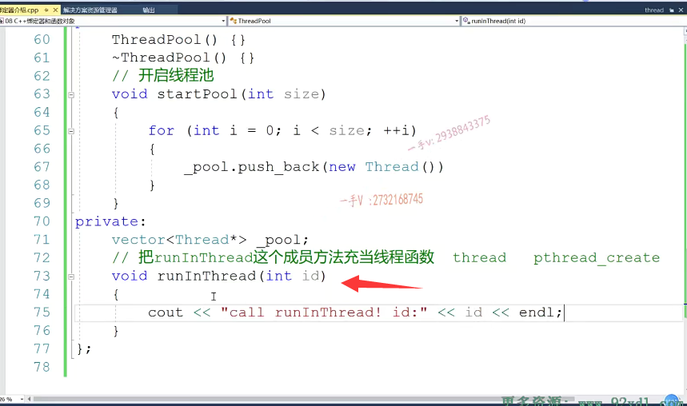

那那有没有办法呢？其实在我们c++里边当然是有bind法的啊，C+ll running thread。这个ID我们把这个ID打印一下啊。

## 使用绑定 把成员函数传进去

==大家来看呢，那就是就是所谓的绑定嘛。==

绑定thread pole里面的其实就是我们当前的这个running thread，

running thread如果要充当一个普通函数的话，

那我们就需要把它所依赖的参数全部给它绑定完嘛？你编译后是不是需要一个对象啊？那哪个对象就是当前这个对象，

所以我把this给你绑定上去，你还需要一个ID是吧？那我们就在这里边用I。

I值来充当我们线程的ID，

你看我们在这里边全部给绑定，

绑定了我们给这个running thread啊，绑定了this和I那么这样一来，

==整个儿绑定器返回的就是个函数对象==，

这个函数对象调用的时候呢，相当于任何参数都不用传了。

这个函数对象本身是不依赖于其他对象，不依赖于什么thread pool的啊，

是底下底层的这个running thread函数调用的时候需要依赖我们当前的这个thread pore对象线程池对象。

那我们已经给它绑定过。

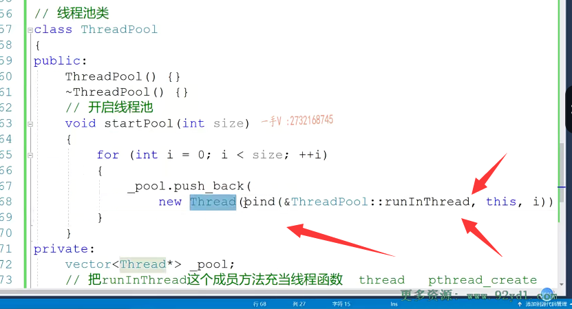

## thread类构造  使用function来接收，并且参数都已经绑定好了，就可以为空

好的吧，那我们现在来实现一下thread的构造，

你看它传进来了一个绑定器，

它传进来就绑定器，我们用什么东西能够接收绑定器的类型呢？什么东西能够接收？绑定器的类型的。

啊，那当然就是我们函数对象类型了，function在这里边。

返回值是void.

==没有参数了，这里边儿不需要参数了，为什么因为绑定器把它的参数是不是全部已经给它绑定过了？啊，全部已经绑定过了。==

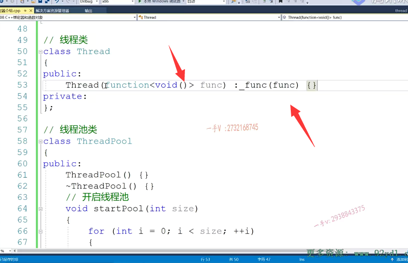

## 线程这个绑定器接收起来

所以在这呢，我们就是func来，我们给它定一个成员变量。啊接收起来，把我们传给这个线程的这个绑定器啊，给它接收起来啊，接收起来。

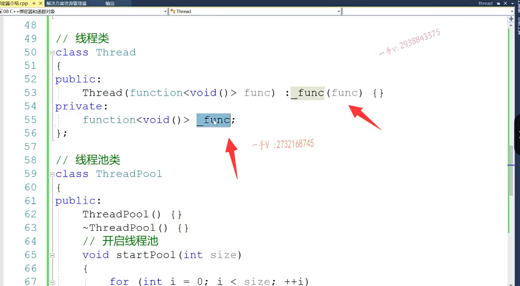

线程创建好了后，就可以调用start方法

那这就是把整个的线程现在创建完了是吧？线程创建完了以后呢？我们现在就可以。诶，调用每一个线程对象的什么了？start方法了？start方法了？那这是里边存的是一个一个的线程，我们现在给线程提供一个start方法啊。

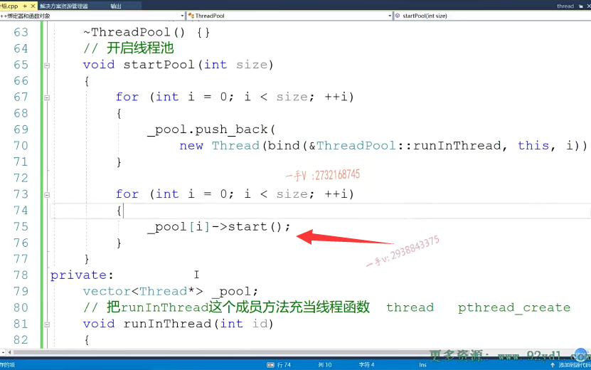

这需要用到我们C++的线程类前边呢，把thread头文件包含一下啊。好在这儿大家来看一下。

thread啊。thread，然后是star的方法啊，

star的方法在这里边儿是创建我们线程，创建线程是不是需要给个线程函数啊？

啊，我给我们的这个现在的这个绑定器对象就行了。

==给这个绑定机就行了啊，它相当于还是在这个线程库的底层直接调用我这个函数对象的括号运算符，重载函数嘛。也不需要参数了，==

==因为这个函数对象把这个run in thread所需要的参数全部绑定起来了啊，返回一个新的函数对象对我们func接收了==，

## 句柄也要返回回去

对不对？我们把它这个句柄给它返回去啊，因为我们要在主线程里边去join等待一下这个子线程运行完成好吧嗯。

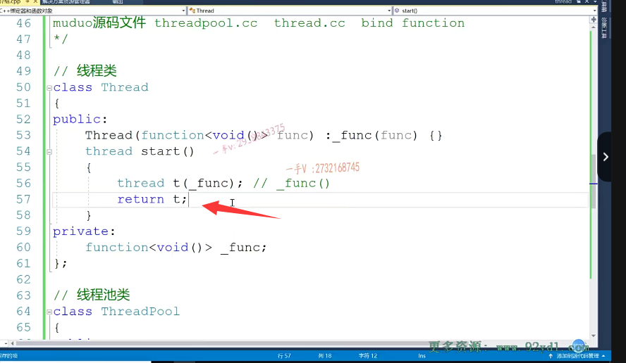

## 创建了一个句柄池来接收

那大家来看一下啊，那在这儿呢，我们再定一个吧victor。定一个thread啊，这个是我的所有的thread，这个是我所有的这个handler吧啊线程的这个句柄是吧？点push back。

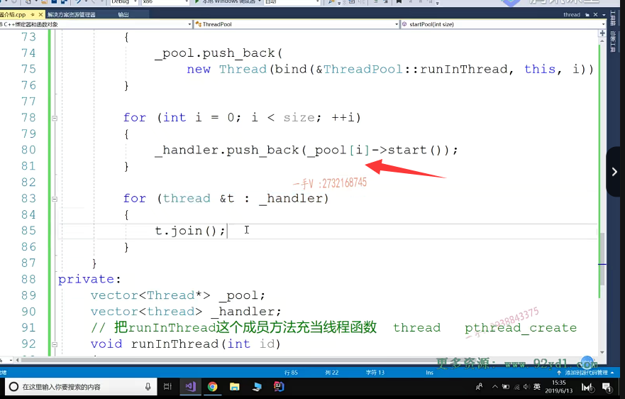

## join等待所有子线程完成以后，主线程再结束

啊，push back完了以后呢for循环thread，然后呢循环一下我们的这个handler。handler，handler，然后呢t.join。

这是等待所有子线程运行完成，我们主线程再结束。

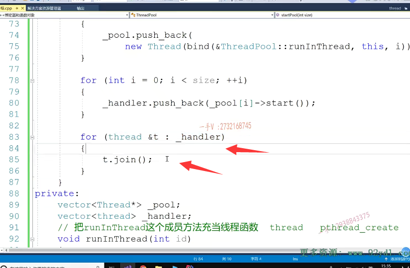

好，那我们来看一看啊，看一看这个能不能使用thread pool？定一个pool。后点start后啊，比如说我们开启十个线程吧。大家来看，

这是开启十个线程。

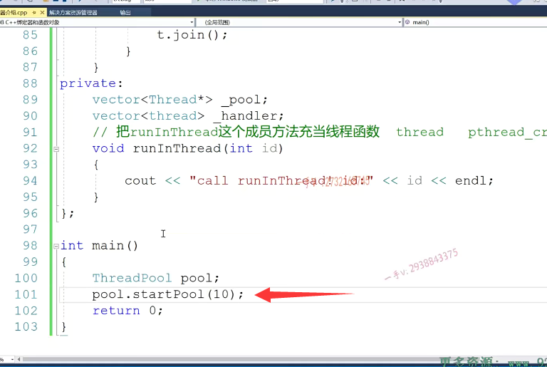

哎，这个构造呃，我们不需要做什么初始化，对吧？

这个析构呢，我们应该在这里边把。这个vector里边所有的指针给它delete掉，因为这里边呢，我们push的时候是。呃，new出来的，new出来的，这个thread的对象对吧啊啊，然后我我这这个这个no no no，

我们不用写了，不用写了。因为这个vector析构的时候呢，会把它的所有的这个啊元素呢，会调用它所有元素的，是不是析构啊？

## vector析构会对所有元素析构，但是指针需要手动析构

==但是我们这个类型是一个指针，是不是？它里边的元素类型是个指针啊，是个指针，所以呢，这个得靠我们自己去析构了==

sorry sorry啊，这里边呢。可能误导大家了啊。容器吸垢的时候是会调用它的，

吸调用它里边儿元素的吸垢，但是它现在元素是个指针指针，它没有什么吸垢函数的，是不是？所以

在这里边儿必须啊。释放啊thread。对象占用的堆资源啊，

那其实也能想来你这儿，

你new 对应的delete在哪儿呢嘛？是不是啊？后循环应答a这个。等于零啊诶小于后。pool pull点size加加I啊，在这里边儿。

啊_pool中括号I。

你看这个new对应的data就在这里呢啊。

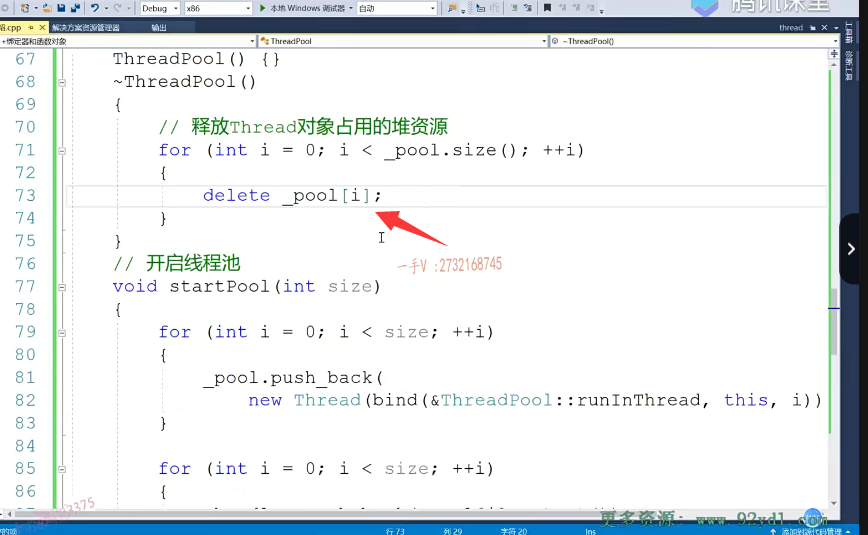

好了，那我们运行一下。看看能不能执行。

诶，看一下，看一下，你看这就是我们十个线程，因为每个线程都是。呃，独自运行的嘛，是吧？

所以打印出来呢啊，是个乱的啊，是个乱的，因为他们不是在同一个线程里边执行完的。

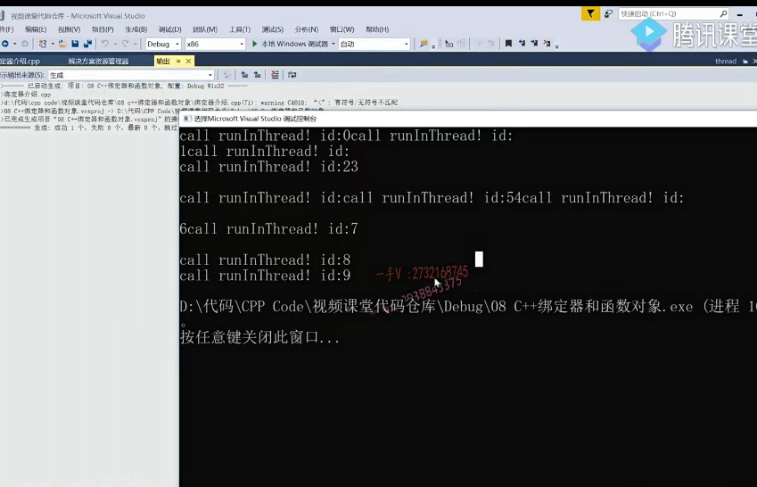

我们可以看到这个ID打印出是零到九啊，是零到九，这个不是12，这个是一跟二打一块儿的啊，打一块儿的。

## 通过绑定器实现成员函数作为线程函数

好，那么大家主要是看一看这儿啊，他把这个成员方法呢称作了一个线程函数成员方法呢。啊，充当线程函数。

本身是不可以的，但是我们可以通过绑定器做到啊，我们可以通过绑定器做到。没问题吧啊.

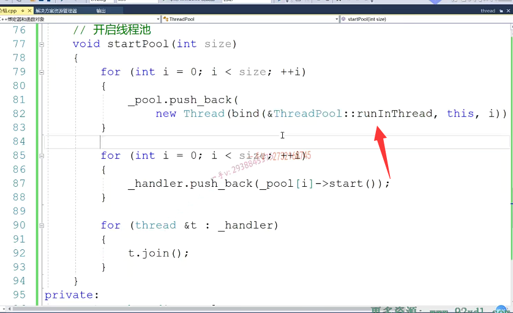

可以给它把它所需要的，

因为这跟c函数不同的地方在于呢，它需要一个对象啊，它需要一个对象，我们给它绑定this指针，就是当前对象了。是不是啊？大家注意一下啊。

## bind换一种写法

这里边儿其实还可以这样写，就是写法是多种多样的啊，你用你绑定器，你可以不传这个I这个I，

我们在这里边儿把这个I呢当做线程的一个编号是吧？

你可以在这里边儿写个杠一嘛啊，写个杠一嘛，就表示一个参数占位符嘛。

我们把I呢通过。这个构造函数呢？传进来。

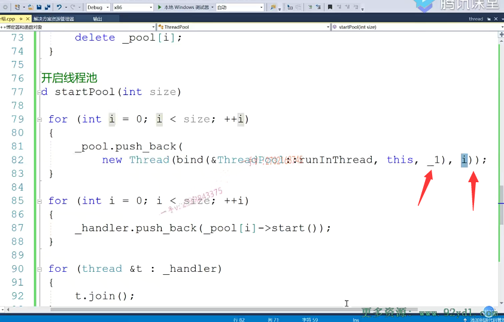

啊，那也就是说在这里边，我们再定义一个，这是number啊。number.number.通过这个number是不是传进来呀？

来通过number number传进来。

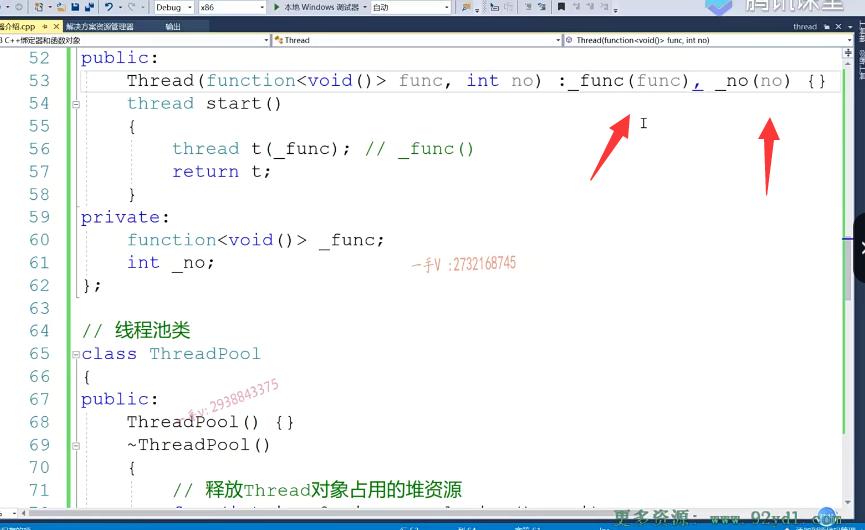

没问题吧，那通过number现在传进来的话呢，那也就意味着你现在的这个绑定器返回的这个binder啊是一个没有返回值，但需要一个整形的参数嘛，就是你需要自己传的这个binder呃，

自己传的这个下标，那你写的这些开启线程的时候呢？你把这个number自己串进去啊。那相当于底层给你调用的时候呢，调用你这个fuc的括号运算符，重载的时候就把这个参数给你放进去了。

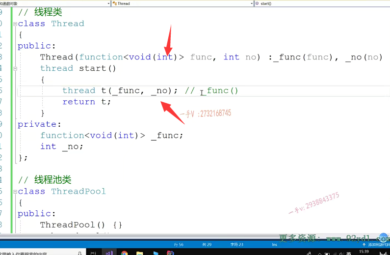

# 需要我们自己提供参数，这里要好好思考一下，这种写法

对吧啊，这是相当于用户自己传参数，

因为这里边儿呢，只给了一个参数占位符，并没有传递真真正正的参数。

那我们来运行一下，看是否正确？okay，依然是正常的。

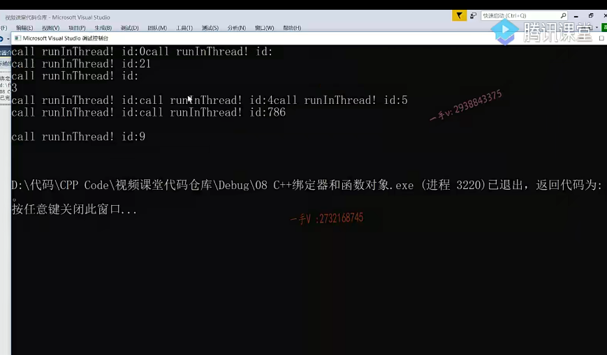

希望大家能够正确的去理解一下这个bind跟function啊，在进行我们库的开发的时候啊，或者一些功能模块儿开发的时候。

它是非常非常常用的啊，

后边儿呢，我们会给大家提供一个muduo库啊的一个详细的这个使用以及。介绍的一个视频，那么到时候我们所涉及的网络编程呢，

少不了会用到很多的，这个bind和function。

啊，希望通过这几节课的讲解呢，大家对于这个bind和function C++11里边儿提供的两个非常强大。绑定器和函数对象啊，能有一个比较深刻的认识。好，那我们这节课的这个内容就到这里。