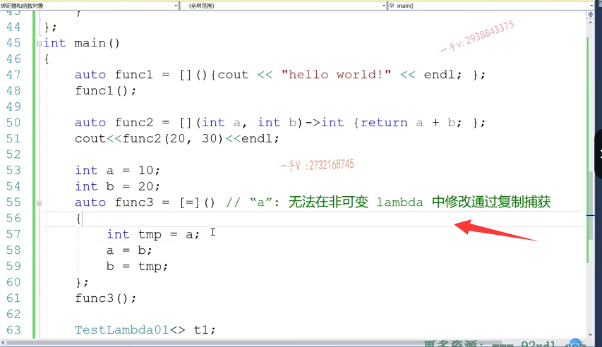
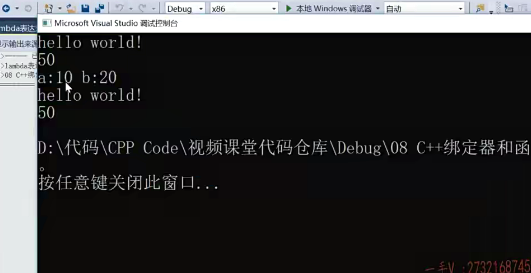

大家好，今天呢，我们开始说。说一下，我们C加加幺幺啊标准里边提供的一个函数对象的这个升级版啊。什么东西呢？就是兰布达表达式。在我们其他的oop语言里边呢，你比如像p啊JAVA也都支持兰布达表达式，对吧？这是一个非常精简的啊，小巧的。非常强大的，这么一个语法特性啊，那么如果大家对于兰博的表达式呢，

以前在CA加编程中呢？没有，就是呃，没有任何印象，对吧啊？或者对其他的oop语言里边没有见过这个兰布达表达式呢？

## 比如说我们定义优先级队列的自定义顺序，可以使用lambda表达式

它它其实在CA加里边之前呢？就是以函数对象的这种身份呢，来出现的啊，但是我们前边儿讲过课啊，大家也发现函数对象有一个非常大的，这个不好啊。函数函数对象的缺点。就是呢，我们所用的函数对象，

我们说了，我们是不会基本上是不会单独去使用函数对象的。对吧，基本上不会单独去使用函数对象，一般呢，都是使用在这个泛型算法。啊参数传递过程中。啊参数传递过程中，或者是带有比较性质的啊，比较性质的。比较性质的，或者是自定义。操作的啊，那么比如说像我们的这个优先级队列。如果我们自定义类型。

这个作为我们优先级队列里边的元素，我们想自定义啊元素的比较方式，我们就可以。给它传一个函数对象进去，对不对？但是传个函数对象最大特点就是我们需要先定义一个类型，就是函数对象的这个类型。但是这个类型可能定义以后，它定义的对象就用在优先级队列定义的地方，优先级队列定义完了，那这个类型呢？函数对象的类型可能就永远也用不到了。我没有必要为了说是我需要一个函数对象，我还得非得定一个类型出来，而这个类型呢，

就永远存在在我代码当中。啊嗯，灵活性太差了，灵活性太差，包括我们的这个前边儿讲的这个智能指针，我们自定义智能指针的删除器，对吧？都可以用到这个函数对象。但是呢呃，相比于兰布达表达式函数对象呢，有诸多的这个缺点啊，==缺点最重要的一个问题就是。需要定义出一个类出来啊，需要定义一个类出来==

那我们这节课呢，

主要讲一下兰布达未来式的这个原理，它其实原理就是函数对象的这个实现啊，函数对象的一个更高级的实现。来先看一下兰布达表达式呢。表达式的。这个语法啊，它是这个样子的，首先是以中括号，这个叫捕获变量。捕获外部变量。然后是小括号，这是形参列表。一会儿一个一个说，这是指向符，这是返回值。

然后这大括号。这里边写的是操作代码。这就是一个兰博的表达式呢，它的整个的啊语法对吧？举个例子啊，举个例子。大家看一下。

autofunce中括号小括号指向符void，在这里边我们sell它一下这个。hello world啊，hello world。那么我们看一看。这个是否呢能够打印出来？这个是没有问题的，然后我们调用一下啊，

这相当于就是。调用了一个函数对象，对吧？调用了一个函数对象啊，打印出来hello world。

## 小括号重载

那么实际上呢，它就跟我们。什么写的一样啊？class啊test。它相当于就是我们这个东西。那么。==小括号运算符重载函数cout==。world.那么我给大家写完这里边，我们不需要类型，

可以给这个模板类型参数呢，一个默认值word啊。t1t1.大家来看这两个其实是一模一样的，

## 多元，就是重载的小括号内的参数数量

首先呢，这个相当于就是产生了一个函数对象。那也就是说，类似于这里边我们的t1的角色啊，那这里边我们需要定一个类型出来，实际上呢，这个兰布达表达式呢，就是兰布达对象的这个类型呢，是我们编译器默认产生的。这个类型其实我们根本就没有必要，我们在乎的是这个对象函数对象啊，

我们不在乎这函数对象叫什么名字，往往啊，这个类型名字。就成我们的累赘了啊，就成我们累赘了，我们在某个泛型算法啊，某个泛型算法的这个语句当中。使用完这个函数对象，那我们这个类型其实就可以不用要了啊，而且呢，我们函数对象要一元的二元的。是不是啊？三元的四元的啊那个。==几元的是什么意思呢？就是小括号运算符重整函数呢？==

它参数的个数。==这个大家应该还有印象吧，参数的个数对==吧？很多时候呢，不管是一元二元三元，其实我们的这个操作代码呢，是一模一样。就是我们形参变量的这个个数不一样，没有必要为了这样的这个。差异啊，我们定义出来不同的这个类型，我们可能类起个名字都成问题了。起个名字都成问题了，这个类型的名字呢？我们其实并不需要

## []中括号

那这里边兰布达表达式呢，

就给我们提供了这样的好处啊，这个中括号啊。就捕获外部变量实际意思就是说呢。意思现在就跟这个现在一样，就是你看啊，我们现在定义的test拉姆达01呢，这个构造函数。就没有接收外部任何的参数进来，相当于就中国号空着的，那也就是说这个函数对象啊，就没有。定义成员变量也不需要接收呢，外部传进来的任何的这个其他变量啊，

这个小括号呢，相当于就是我们这个函数对象小括号运算符重载函数，

这个括号形参列表现在是空的。

指向指向符，这个返回值void相当于就是我们小括号运算符重载函数的，这个返回值void。这个操作代码相当于就是我们这个函数的操作代码是一模一样。okay吧，这个应该能能不能抢来能抢来啊

我们再举个例子autofuz 2，等于啊，你比如说在这里边呢，我们形参啊，要接收两个什么东西呢，两个整形返回值呢？我们也是一个整型，这是做两个整数的，

这个加法啊f1 nz 2，你刚才这个跟这个相当于都是调用这个兰布达表达式，也就是函数对象的小括号运算符重载函数嘛，跟这t1。调用小括号运算符重载函数是一个意思，因为现在这小括号运算符重载函数呢，人家需要是不是两个整形参数啊？那就在这我们做个20+30啊，然后返回，这是一个整型，我们直接计算这个结果。

那么，这个相当于是什么呢？这个相当于是。又生成了这样的一个函数对象的这个类型啊，

我们用模板来表示。那同样的由于呢，这个兰布达表达式呢？中括号是空着的，所以这里边相当于呢就是构造函数不接受任何外部传进来的变量，对吧？那然后呢？小括号运算符重载函数呢？结束两个参数啊，返回值是个整形，这里边返回值是个整形啊return呢。就是a+b啊return呢就是a+b。好的吧，那在这里边呢？其实呢，

我们啊，类似于这个，我们也可以写这样的一个东西t2。cout t22十三十。实际上呢，这两个是怎么样啊？一模一样，一模一样对吧啊？当然了，对于我们编译器生成的这个方法来说呢？人家一般像这样的，这个只读方法就是不写只读的方法都是写成长方法的，对吧？

你看这两个是一样的啊，我们来看看。

你看都可以计算出来20跟30的和。50对吧啊20跟30的和50都是能够计算出来的。那么，通过这个示例呢，大家应该对于兰布达表达式有一个基本的认识，是不是它确实是非常？方便啊，我们在使用函数对象非常方便，非常方便，我们开发者使用这个函数对象。

当然呢，在这里边我们再说一下啊。如果。lamb的表达式。的返回值不需要。

那么，指向符返回值？这一块是可以省略的。那也就是说在这儿呢诶，这个地方呢？你可以把指向word呢，省略的。这是可以的。

我们再来看一下啊，实际上这个形参列表大家现在知道了，这个就是小括号运算符重载函数的形参列表，对吧？这个就是小括号运算符重载函数的返回值，

## 小括号的捕获

这个就是小括号运算符重载函数的代码，一切都是函数对象啊。我先来看看这个捕获变量这一块啊，捕获变量这一块用小括号呢表示表示不？捕获。任何外部。变量啊，不捕获任何外部变量。

那么，大家来看一下啊，大家来看一下啊，再举个事例，func 3等于。中括号假如说呢，我们在这外边呢，

订了一个inta 10 in TB是个20，对吧？在这里边呢。我们想做这样的一件事情啊，我们想做这样的一件事情，就是进行一个。值交换。进行一个值的交换啊，值的交换，我们直接来运行一下啊，我们直接来运行一下。直接来运行一下。大家看一下啊，无法引式捕获，因为尚未指定默认捕获模式，

那中括号表示不捕获任何的外部变量，所以在这个蓝。兰布达表达式里边呢，你是不能够直接访问a和b的。好的吧，所以你要捕获啊，你要捕获。

那你可以写个等号啊，这个等号。是什么意思呢？这个表示以。传值。的方式捕获外部的所有变量。这个表示什么呢？这是以传。

引用的方式捕获。捕获。外部的所有变量啊，以传引用的方式呢，来捕获外部的所有变量啊，所有变量。

那么。还有这样的，那当然这是捕获外部的this指针了。是不是啊？当然你还有这个样子的。这个是以传值的方式。捕获外部的所有变量，但是a变量。以传引用的方式捕获。

这个应该大家都能理解吧，你传值的方式就是形参的修改，不影响实参的值嘛，传引用的话呢，那就是。形参修改了，是不是实参也就要被修改了？没问题吧啊。

那么在这儿呢，你甚至呢？还可以。指定具体的名字啊，指定具体的名字，这个是以。值传递的方式捕获外部变量a和。

b对吧

啊，那么这个还有a那么a。以以值传递。捕获啊b以传引用的方式捕获。好吧，它就是这么一个意思啊，它就是这么一个意思。大家看一下啊，我看一下。

可以捕获啊，可以多种这样的一个。组合啊，那么在这里边你看一下啊，你看一下呃，我在这里边呢，

捕获外部的a或者b。按值嘛，或者你写等号外部就全部都捕获了啊，全部都捕获了，那么在这儿我们来看看。这里边儿给你报了这么一个错啊，给你报了这么一个错，或者是你这儿传AB也是一样的啊，报了一个什么错呢？无法在非可变lander中修修改，通过复制捕获啊，这句子读着有点拗口，是不是？那么，同学们，

## 报错问题解决

首先啊，你要搞明白啊，你看我写的这个可能演示起来呢，大家一会看的更清楚啊。你看这错误是一样的，对吧？这相当于是什么呢？这相当于就是这个样子的。大家往前边看一下啊，我test lamber lambda表达式三。那么在这里边呢？在这里边啊，在这里边它相当于呢诶，你看中括号有两个AB啊，这相当于呢，

就是按值。按值接收了啊，两个外部传进来的整型变量，那当然了，那你这个成员变量。就定一下来保存外部传进来的变量嘛。用a来保MA来保存外部的a纸MB来保存外部的b纸，大家来看啊，这都是传值对吧？传值。

那你想一想啊，你现在做的代码呢？是这样的一个代码函数的返回值是一个void对吧？那这里边当然是MA。MA MB了。

这翻译出来就是这个样子，那很明显这是长方法，在长方法里边儿呢，长长元变量是不能修改的，这个应该给大家说过。对不对？在我们CA加面向对象基础部分呢，都给大家说过了，长方法里边儿只能读成员变量，而不能修改成员变量。你要是直接写这样，它也不行啊。是不是啊？

常方法中修改了成员变量

是不是啊？那怎么办呢？那是不是在这里边？

给它加个。==Mutable是不是就可以在常方法里边修改普通的成员变量了==，人家这成员变量本身就不是常量。只不过在长方法里边啊，这次指针被修饰成const啊，那么就不能在常方法。去修改成员变量的值，只能读啊，不能写那可以mutable那一步

那同样的啊，对于兰达表达式，如果你真的想做这件事情，按值传递。你要知道这个小括号运算符重载函数，它是一个长方法，

里边可是不能去修改成员变量的，这个中括号相当于就是这里边构造函数捕获了外边传进来的两个a跟b的值，是按值进行传递的啊。所以呢，在这里边呢，你可以给这个lander表达式的后边修饰一个mutable。就是一个mutable，他也相当于就是给他的所有的成员变量。所有的成员变量添加一个MA table的修饰，这样一来呢，在长方法里边，在长方法里边。这括号运算符，重载汉长方法里边就可以对我们成员变量呢进行一个。修改了，

是不是进行一个修改了啊？

## 加mutable但是值根本没有改变

但是呢，我们看一下啊，修改完了以后a跟b的值呢？到底变化了没有？到底交换了没有是吧？你看a还是10b依然还是20？根本没有做任何的，是不是改变了？根本没有做任何的改变，

边那个写的话呢，你你也可以这样写test lambda 3，啊t3。然后呢t三点啊t3括号。就跟这是一样的，

跟这是一样的，跟我们刚才写fuc 3那是一样的啊，没有合适的默认构造，对于我们需要传两个值一个是a，一个是b，这里边儿类似的就是上边儿这个中括号儿。是吧，传了外部的两个变量a跟b啊。还有错。我们。看一看啊，这两个参数现在不需要了。你看这括号，现在是空的嘛，括号运算符重载函数不需要传参数了，

是不是啊？okay.这毕竟是传值嘛，形参的改变是不会影响时参的，

## 捕获引用

所以外部的a跟b的变量根本没有改变是吧啊？那么在这里边呢，我们还可以写一个autofuc啊，那我不用重写了吧，那我们直接在这个上面改啊，我们直接在这个上面改吧。我来直接改到这里。按什么传递呢？这里边按什么传递呢？我们按引用是不是来进行传递呀？那这个mata我们就不用加啦啊。

为什么按引用传递这个马，我就不用加了呢？那是因为呢，这里边全部按什么来传递啦？这就全部按引用来传递了。啊tab也不用加了。加这没有必要啊，那现在MA跟MB。就可以赋值了，那在这个常方法里边儿啊，给MA MB赋值并不是改变MA MB这两个引用变量本身，你要注意。有同学说这里边为什么不加Mark，结果这又不是改变MA MB本身引用变量，所谓的引用变量本身就是它底层那四个字节就跟指针一样，

对吧？这里边相当于是==直接修改了引用所引用的内存。没问题吧，不是修改这引用变量本身，是修改的是引用所引用内存的值==，所以这是OK的啊，这是OK的。那我们来看一下啊。

那我们来看一下啊。你看现在a跟b的值修没修改啊？修改了。

好吧啊，或者是你写这么一个引用，那就是==把外部变量你定义过的外部变量全部==呢？以引用的方式传到我们的这个兰德表达式里边来了。

好的吧啊，这就是捕获外部变量，

如果你写一个空的中括号的话，那相当于它是不能够访问任何的外部变量的，类似于就是它生成了它为这个兰德表达式呢。生成了一个类型，这个类型呢，构造函数是个。这个构造函数的这个形参列表啊，是个空的，没有接收任何外部传进来的变量。好吧嗯。这意思是相通的。相信大家这个也能够明白了吧啊，你把这个learn的表达式呢，

跟我们前边讲的这些呢，你对比对比啊，你就明白了，明白它是什么意思了。好了吧啊，其实兰德表达式呢，也没有大家想的那么复杂，但它确实是非常的这个小巧啊，非常的这个小巧。那么。==通过呢举例，我们窥视了一下兰达表达式呢，底层的这么一个实现原理==。其实我们再来给大家看一看啊，再来给大家看一看，

## lambda底层实现原理

回忆一下以前它的一些。基本的用法。嗯嗯。你比如说定一个vector。给这里边呢，放上啊。20个。整数对吧？那么在这里边呢？我们原来用过这个sort。是不是salt呀啊？salt我们VC begin。VC点end。是不是啊？它默认呢，

都是进行小于比较的，我们可以给它改成大于比较，那我们在这里边。与其写一个或者记一个函数对象的类型，我们不如直接在这里边给它一个。兰德尔表达式就可以了。比较嘛，两两元素比较一次从容器里边拿两个元素出来，所以这个巧括号运算符重载函数呢？两个参数嘛，是不是返回值当然是一个布尔值了okay的吧啊，返回值当然是一个布尔值了。咳咳。在这呢，来看一下啊，

在这我来看一下。

刚把这个对齐对直接在这儿写。这就是return a大于b嘛啊，return a大于b了。好了吧，这就是sort嘛，是不是啊啊sort sort完了以后输出一下value VC？cout value.see out.end l.好看一下啊，哪里啊？这是一个中文的分号的。大家看，这是一个从大到小的，

是不是排序呀？

它默认是一个从小到大的排序，你改成小于号，这就是它默认小到大的排序。大到小的排序。是不是啊？

## 插入元素

找一个位置把我这65啊按序。按序。插入进去。插入序列，那么在这里边，我们是不是要找要找第一个小于？65的数字。对着没，

然后插不到那个位置，大到小排序的嘛。这里边我们用泛型算法就是find if嘛VC点begin啊。还有VC点n的很明显啊，对于这个泛型算法来说呢，我们需要的是一个一元函数对象。一元函数对象，因为我们。==一次只需要从容器中呢，拿一个数字出来跟我们指定的65进行比较嘛啊==，==指定的65进行比较。那库里边的greater less都是二元函数对象==，以前我们给大家举过例子啊，所以在这儿呢，我们只能去使使用啊就是。

==函数对象跟绑定器啊，才能从二元函数对象得到一元函数对象，天呐，记忆记忆理解这些东西呢，可能对于某些同学来说是致命的啊，致命的==。

==那在这我们采用lambda了，而是呢，我就不需要拘泥于什么一元二元三元，我针对我问题的场景，我想要几元我就能==。能得到几元啊？那么在这呢？我们一次性只需要从容器中拿一个。是不是元素出来呀？

返回是布尔值return是谁呢？看一下啊，就第一次第一个小于65的啊，那我这样。给他一个。三道表达式就可以了。

是不是如果找见这个元素的话呢？就会返回该元素的叠列器，如果不等于vec点n的，就证明找到了，找到了的话呢？在这儿VC点insert it d方插入一个65诶，我们的这个逻辑呢，就是这个样子的。嗯嗯。

大家来看呢，就可以把这个65原来有个65啊，再插到这个地方，应该是这个地方，我们找第一个比65小的是不是？放到这个地方了。okay吧啊，有数好。因为我们没有种随机数种子，所以每次随机数都一样啊。大家来看一下。这就是兰德表达式的这个好处，是不是？那当然了，还有我们的，

是不是？那当然了，还有我们的，

就像这个for each啊for each这个方程算法。那么。这个环形算法呢，是把我们容器里边，我们指定的容器的迭代器，这个区间里边元素啊，应用在我们第三个常用的这个函数对象。上面啊，函数对象上面我们写一个这个兰达表达式，那就非常灵活了，大家有没有注意我们这些函数对象呢？仅仅就使用在我们泛型算法的这个语语语句当中。语句当中。对不对啦啊？语句当中。

所以呢，我们没必要为了我要使用的函数对象，我还得预先定一个类出来，这是不是非常的麻烦啊啊，非常的麻烦呢？好在这儿呢，我们定一个a那在这儿，我要干什么事情呢啊？干什么事情呢？那在这我所做的事情呢，可能就是简单的啊。简单的一个容器啊，元素的一个输出。一个简单的容器元素的输出。我看看这输出了，

是不是啊啊嗯，比如说我还可以只输出它里边整数啊，模上二。如果等于零的话，我再进行一个输出，只输出整数。你看这输出了我们容器序列里边的是不是整数啊啊？==那在这里边呢，我要怎么去处理容器里边的元素或打印或操作啊？满足某些条件的==，

==我直接提供一个。这样的兰达表达式就可以了，这相当于是一个一元函数对象，对不对？我现在库里边儿虽然没有提供，也不需要去输出一个类出来。没有必要，可能呢，这个对象就用在我for each这个泛型算法当中啊，它就已经完成任务==了。是的吧啊。大家来。看一下啊，大家来看一下。那么，这就是我们使用这个兰达表达式的这么一个好处啊，这么一个好处。

咳咳。还有一个呢，

就是我们啊呃在。写稍微复杂一点的代码的时候呢，可能在啊成员方法中啊，也会使用兰德尔表达式，对吧？那么，以中括号的方式呢？可以捕获呃，当前对象的一个this指针。否则的话，你在lander表达式中呢，你是不能够随意访问对象的成员变量。是吧，我们说呢，中括号如果是空的，

那相当于不捕获任何的外部变量啊，注意这里边捕获变量的方式。好把这个呢。理解一下啊，把这个理解一下。那么我们。兰布达表达式呢？就先讲完这一部分，然后呢，剩下的内容呢，我们下一节课再说。

