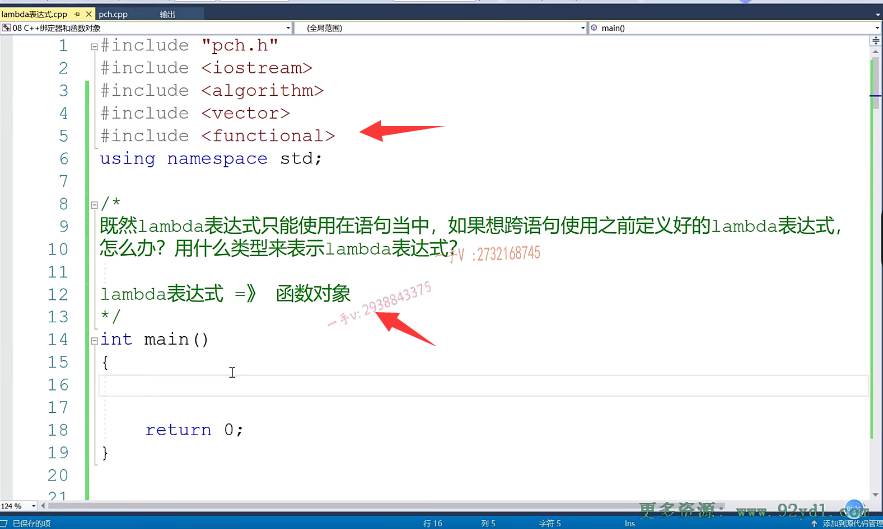
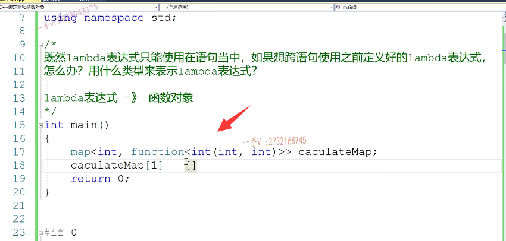
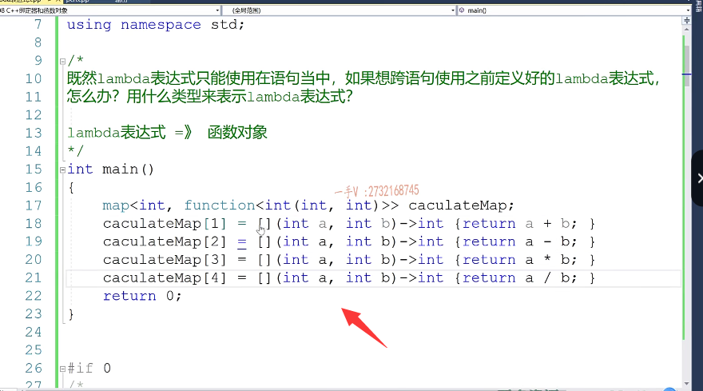
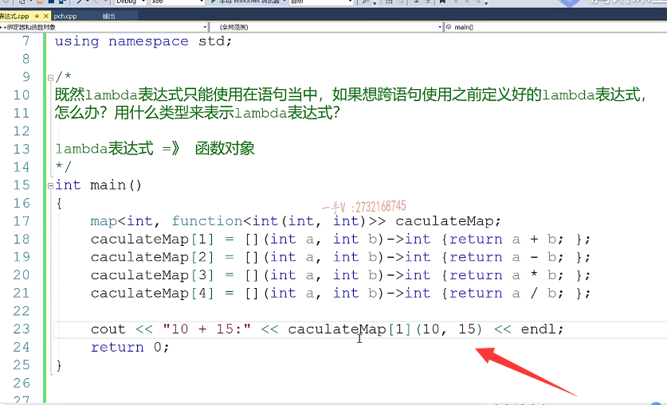
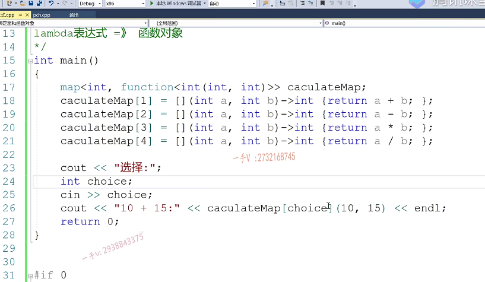
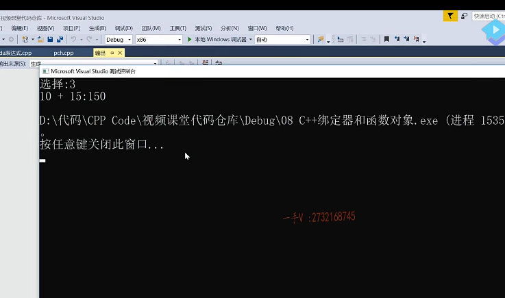
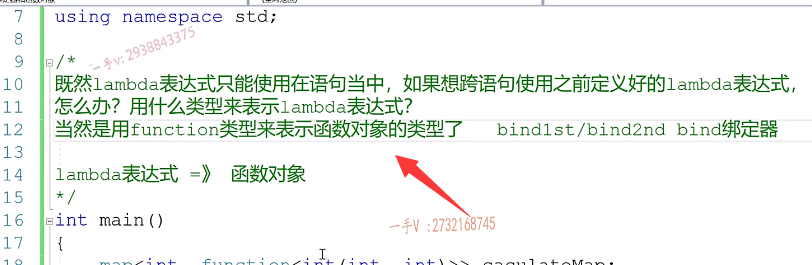

# 第8节课

## 接收lambda表达式   函数对象

好，大家好啊，我们这节课呢，还需要说。一个兰布达表达式呢，另外一个比较重要的问题啊。这个既然。兰布达表达式。只能。使用在。啊，只能使用在。只能使用在我们语句当中。对不对？如果想。

跨语句。跨语句。使用。之前定义好的，之前定义好的。lamb的表达式。怎么办？那也就是说是用什么类型？来表示。表示兰布达表达式的表达式

啊。其实呢，这个问题很简单，既然呢，你都知道兰布达表达式呢。

就是一个函数对象，对吧那？我们应该用什么类型来保留它呢？当然是用我们的function类型嘛。是不是function类型啊？啊，function类型。

那么在这里边啊，在这里边大家来看一下啊，大家来看一下呃，假如说我们举个很简单的例子啊，很简单的例子。那么，我们包含一下这个map啊，你比如说呢？

我定一个map啊，定一个map。我这map里边第一个类型是个整形啊，那比比如说表示操作一二三四，表示加减乘除是不是啊？我选择一就是加选择二就是。减选择三就是乘选择四就是除那么我一个选项对应一个操作，我对应操作那这个操作我肯定要用一个函数对象来表示嘛。对不对？那么我知道将来。给这个对应的操作一二三四要匹配一个。兰布达表达式，但是在这里边呢，我们如何去把兰布达表达式的类型？在这表示出来呢，

我们如何写呢？不可能写个auto吧啊。嗯。凹透只能出现在什么地方啊？有的人认为呃，定个凹透凹透只能出现在哎，它应用的这个。就是这种这种场景下，它可以根据我们右边的兰布达表达式呢来推导出来，左边这个funce的类型是什么？这个也只能使用在函数的，是不是局部作用域范围之内呀啊？那么像这样的，我们预先的这个兰布达表达式根本不知道。我现在还没有到写兰布达表达式的时候，

==但是我在这里边儿需要先存储一下兰布达表达式的类型==。是的吧啊。那么在这呢，==我们就用function==了吧啊，function啦。这是我的计算用的，是不是计算CA？CA clue.cul at calculate map.好的吧，这什么意思呢？这是我我因为我是计算加法，我将来肯定要传两个参数呢，传两个参数是不是函数返回值也是个整数啊？

嗯，比如说在这儿我就可以。去写这样的东西了嘛，是不是啊？写这样的东西了。那么。在这里边呢，我们给他来写两个。interainterb啊。返回值是不是也是个整型啊？跟你这个函数对象类型是匹配的啊？那在这儿做的事情呢，就是很简单return a+b。一表示加法嘛，是不是？

啊二三四嗯，这个表示减法这个表示。乘法这个表示除法。你看我分别给他了这个。对应了一个兰布达表达式，那么这是预先的function的这个类型。好不好呢？那么如果说是我现在啊，那当然这几个呢？需要语句呢？结束需要添加分号是吧？

那么比如说呢，我现在要做这个。十+15啊，那这是加法是不是？

clc a cul calculate map加法的话，那就是一嘛。是不是这个就访问了，是不是一对应的这个蓝点表达式啊，然后把十跟15呢给它传进去就行了。啊，这就是这个意思。对应的。加法啊，

就是我们可以我们这写的比较简单，就是你可以根据用户的选择，把用户的选择项直接填到这。就可以了。你比如说。选择啊。

我们int choice saying。choice就可以把choice放在这里边。就一套代码就完了。是吧啊，就这个就完了。嗯。看看我们。给大家演示一下啊嗯，这是一个一哎，再十+15就是个二。25。是不是二啊？就是个负五。三。就是个乘法，

对不对啊？四除法。啊十÷15是个零嘛，对吧啊？这都是整数运算。能明白吧，你看那也就是说是怎么办呢啊？当然是当然是用。function类型。来表示，函数对象的类型了。

当然是当然是用。function类型。来表示，函数对象的类型了。对吧，我们前面给大家说过了啊，不管是CA加标准库提供的band first还是band second。还是我们CA加幺幺里边提供的强大的半的绑定器啊，

绑定器其实呢，它结果呢，产生的都是一个函数对象，这绑定器它。我们原来给大家讲的时候，说是这两个绑定器，不就是它在CA加标准库的作用是什么？不就是它结合二元函数对象greater or less，是不是可以得到一元函数对象啊？所以它结果也是个函数对象。绑定器绑定的结果依然还是个函数对象，所以呢，只要是函数对象类型，我们当然是用function类型来表示了关于function呢。本身就是为函数对象的类型来产生的，

对吧？他就是做这件事情啊。这个应该给大家举这样的一个例子，应该都能看明白，好吧，

## 在举一个例子
