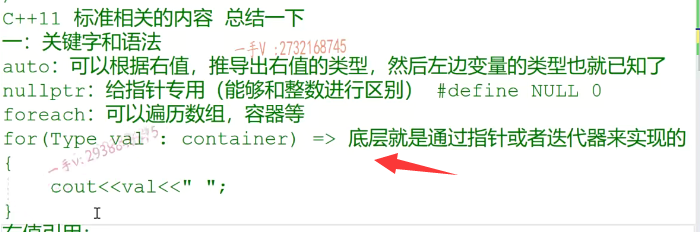
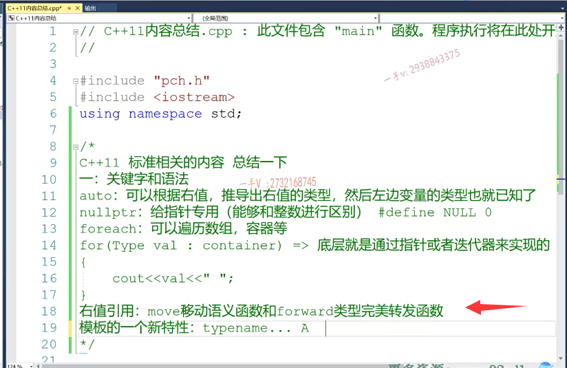
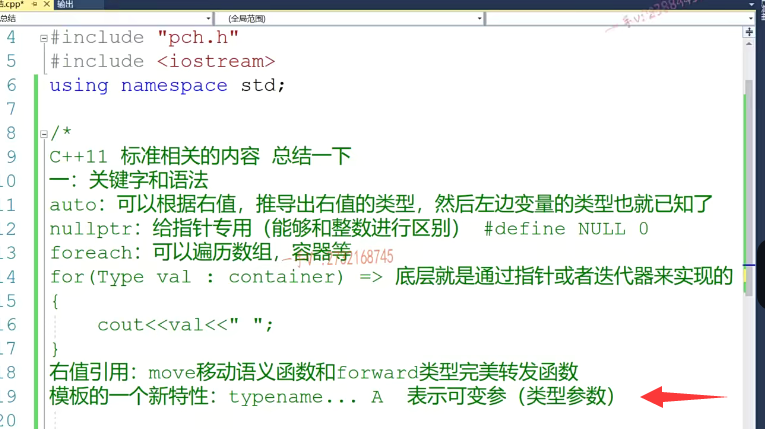
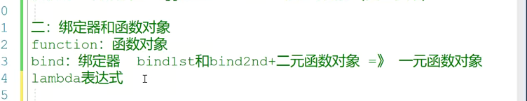
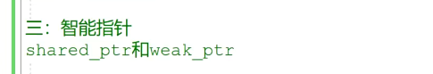
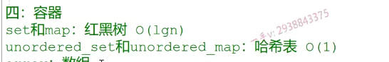
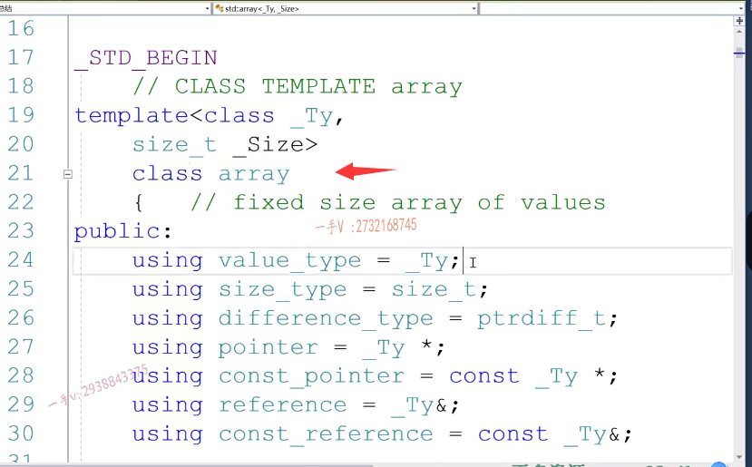
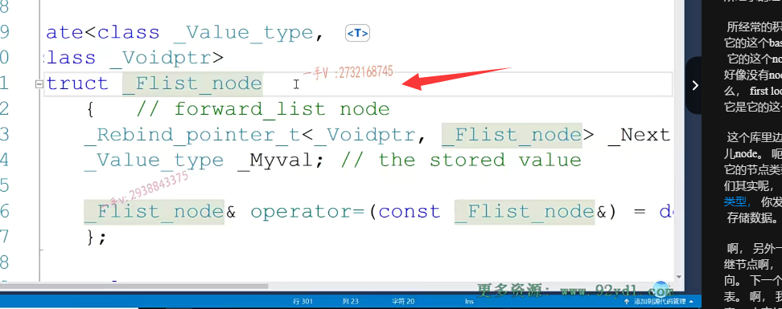

# 第一节课

大家好，从这节课开始呢，我们对于这个C++的这个呃跟语言上啊，语言上语法上。重点的一些内容呢，我们基本上该介绍的都介绍到了啊。那么这一部分呢？我们来把前边所学的啊，所有的跟C++11。啊，标准标准相关的内容呢？我们来总结一下啊，因为呢，现在到这个公司里边啊，现在到公司里边，

如果你从事呢C++相关的一些开发的话呢？C++11标准里边儿的内容呢？呃，在代码上呢？是越来越多了啊，出现的是越来越多了，包括我们一些优秀的开源代码。我们应用C++11标准的一些东西呢，也是越来越多了，那确实是能够帮我们啊，在开发项目的时候呢？呃，提高我们的开发效率啊，设代码更简洁，逻辑更清楚啊。

那C++11呢？呃，标准其实是很多的啊，其实很多的，那么这套视频课程里边儿呢？啊，附件的这个资料上也有一个啊，我也传上了一个，这个C++11相关的一个PDF啊。但是呢，对于我们开发者来说呢。呃，不一定是所有的标准呢，我们都能够用上呃，希望大家如果有空闲时间的话，

可以把C++11相关的一些新标准，可以多浏览浏览啊。那么，在这我们主要是把我们之前就我们这个C++的这个嗯课程呢，==讲课的这个所有所有涉及到的C++11的东西呢，我们都来回顾总结一下，就是在我们目前来说。在写代码的时候啊，高频出现的==。相关的测验，加油的东西啊好，

## 关键字和语法方面

那我们第一个呢？要求就是就是关键字和语法方面的啊，关键字和语法方面的。但你必须说这个auto啊，

### auto

auto auto呢？这可以根据啊，右值的类型啊。推导可以根据右值，可以根据右值推导出。左边啊。变量的类型。好吧，那也其实也就是说是幼稚的类型，对不对？可以根据幼稚呢推导出来，左边变类型啊，或者也就是说是可以根据已知。推导出啊，右值的类型是不是诶？

然后呢？然后左边。变量的类型。也就已知了啊，也就已知了这个好不好呢？当然是呃，非常不错的了啊，尤其是像我们在C++里边呢。我们如果使用C++stl里边儿，包括这个容器，迭代器的话呢，那么它的类型是非常长的啊，包括我们使用复杂一点的容器，比如说是有序容器和这个无序容器的时候啊。啊，

那类型是非常长的，那我们可以用auto来简化我们的这个代码啊，用auto可以简化我们的这个代码的书写啊，非常不错。

### nullptr

那么还有一个。空啊，这个是。啊，给指针专用啊，给指针专用啊，它能够能够和。整数进行区别。大家以前用的==这个大写的null啊，这个其实是一个宏定义啊，宏定义。==

零也就是说是。呃，我们在代码上是无法区分整数和这个地址的，对吧？==用的都是整数啊，那既可以给指针，也可以给我们的这个整数啊==。==无法区分整数跟这个指针地址==，虽然说整数跟指针呢呃，就值来说是一样的，都是四字节对不对？但是毕竟它们的这个逻辑意义是不同的啊，还是需要加以区分的啊我们。不能把一个整数直接赋给一个指针，也不能把一个指针值直接给一个整数，

对吧？所以在我们C++11以后呢？包括我们现在很多的开源C++开源代码，对于指针的初始化。啊，用的都是n啊null ptr 。

### for each

那么，在这里边还有一个for each啊，for each语句，for each语句，不管是对于我们的数组进行遍历啊，这是一个t。对吧，不管是对于数组的这个便利啊，还是对我们什么样的这个？

容器的这个便利啊，都是这个样子，都是这个样子。对吧啊，都是这个样子，那for each。可以遍历数组容器等啊。这样的方式，那我们在前边讲课，给大家都说过了，这个其实底层呢啊底层。就是通过指针或者迭代器来实现的啊。那么，如果==你以for each的方式来遍历一个数组的话呢？那其实这种方式呢？就是一个指针遍历的方式啊。那如果是你用这种for each的方式来编了一个容器的话呢，其实它底层就是用迭代器来便利，就是迭代器啊==，

给你放。翻译成迭代器的便利方式了。好吧for each也可以大大的减少我们的代码量啊，大大减少我们代码量，

### 右值引用

当然这里边还有一个右值引用啊，右值引用。非常强大，对吧？呃，在这个C++高级课程里边呢？我们第一部分应该就给大家讲了。

呃，就是带有右值引用参数的成员方法，可以对我们对象的这个。优化啊，起到非常强大的作用，==尤其是在用临时对象拷贝构造新对象==给，或者是==用临时对象给对象，其他对象赋值的时候==对不对？再有==右值引用参数的拷贝构造跟赋值重载函数==呢啊，非常的强大，非常强大，可以省了内存，开辟释放以及数据拷贝构造。对吧啊。好那么又指引用呢？

又包括它的这个==move啊，这个是就是移动语义函数==，和这个==forward。啊，类型完美转发函数==啊，某移动语义函，移动语义函数和forward类型完美转发函数呢，这个我们在前面的课程呢，也都给大家都说过了啊，那么这两个函数也是非常重要的，前边呢，我们在讲课的这个高级。各种课程讲课的过程中呢，给大家去实现了一个vector对吧？

嗯，实现了一具体实现了一个容器，实现了它的push back方法啊。那么在这儿呢，希望大家把右值引用啊，以及它的作用给我们面向对象带来的好处啊，以及这两个函数的功能啊。把它能够搞清楚啊，能够搞清楚。

## typename ....A 表示可变参（类型参数）

另外呢，我们还看到了这个嗯模板的一个。模板的哎，模板模板的一个。一个新特性就是。什么呢啊，

就这个样子是不是啊？这表示什么呢啊？表示==可变参==，比如可变参，可变参，也就是说呢，这里边的这个参数呢，可能会很多啊，就跟我们。大家之前见过的可编参函数一样，那这边儿可编参这里边儿表示类型不确定，可能有一个类型，可能有两个三个，可能有四个五个，可能有很多类型，对吧？啊，也是参数，只不过这是类型参数而已。这些东西呢，我们前面都给大家举过例子啊，这是我们C++11里边啊，确实是能够给我们带来好处的一些东西，对吧？

## 绑定器和函数对象

那么。这个第二个，第二个呢，就是我们的前面也讲过啊，

前面也讲过嗯，就是我们的这个什么东西呢？函数对象啊，函数对象一类的。函数对象一类的。绑定器和函数对象。一类的，那么请注意它的。function.band啊，绑定器对吧？绑定器。还有它function函数对象。那么希望。大家把它好好理解一下，

前面我们也花了大量的这个课程跟时间呢，去讲解这个绑定银行对象，这是我们C++里边。非常有特色的啊，一类东西对吧啊，其实这个绑定器是对我们C++标准库里边原有的这个bind first和bind second。的一个功能的升级对吧？原来那个。==bind first和这个bind second，它的功能呢？非常的。非常的少，是不是它就只能够啊嗯，结合二元函数对象？二元函数对象是不是得到一个一元函数对象==，

例如我们说==绑定器其实也是函数对象==，对吧？啊，那么它可以绑定的参数非常多啊，非常多，那当然了，还有一个==对于我们函数对象的一个升级==，也就是我们在使用一个函数对象的时候啊。

## lambda表达式

我们不需要事先先定义出一个类来啊。不灵活不灵活，对吧？lambda贝拉式，这是我们之前刚讲的啊，希望大家对这个呢。绑定几个函数对象也有一定的了解好吧啊。

### 智能指针

那么。第三个啊，第三个就是我们的这个智能指针啊，智能指针。那么C++11里边给我们带来的share的ptr和这个wake ptr啊。C++11里边的智能指针，智能指针非常强大，对吧？它==可以智能指针本身啊，基本的功能就是。呃，可以帮我们自动的管理管理资源啊，就是以防止啊代码由于不可预期的这个执行啊，导致资源泄露，资源未释放啊。==

用智能指针呢，我们就==可以保证不管代码正确运行，还是说是中间抛出了异常还是逻辑？由于某些条件满足逻辑。提前跑掉了啊，那我们都是可以保证资源是可以释放的啊==，资源是可以释放的，

另外呢啊，那么为什么要分==强弱智能指针呢？是不是在引用技术以及不带引用技术的智能指针呢？以及在多线程环境下呢，能不能直接使用智能指针啊？那智能指针呢，是如何保证多线程环境下访问共享对象的线程安全问题的。==

那么，这一类围绕着智能指针的这个内容啊，我们在智能指针那一部分呢？已经给大家讲过了啊，在这里边只是给大家做一个总结啊。C++11里边。给我们提供了智能指针。这一类非常强大的东西啊。好了

容器 unordered_map   unordered_set 

第四个就是容器了啊，就是容容器了，那其实呢，我们C++这个。stl这边啊，那就是原来已经包含了，

是不是非常常用的一些容器了，对吧啊？那么，在我们的这个C++11里边呢？又给我们啊拿来了一些容器，比如说我们。最经典的就是。unordered set.和和。unordered map啊。以前呢，我们只有以前C++标准库里边儿，只有set和map。啊，它底层的实线是一红黑树。

是吧啊，那么红黑树呢，它毕竟增删除的时间复杂度能够达到log以二为底的n。但是呢，我们很多情况下只在乎数据的增删查的效率，对于数据是否有序？就是数据呢，小到大或大到小，是否有序对数据的有序性啊，我们并没有任何的要求，那么也就是说我们可以不使用红黑树，我们使可以使用哈希表，让我们数据的增删查的效率呢？再上一个台阶啊，再上一个台阶，

那也就是能够达到log。o1啊，不是log啊，是o1红黑数是log以二为底的n好吧。那么，在线教育里边儿给我们提供的这个无序的容器啊on order order是有序吗？on order无序啊，==无序的集合跟无序的映射表底层都是哈希表==。这个我们之前呢，给大家都举过例子，是不是都举过例子啊？举过例子，希望大家呢，把它好好的去。理解一下啊，

好好的去理解一下。okay，那么。c++11里边还给我们提供了这个aray啊。和这个forward_list啊，这一个是数组吧，从名字上来看一个就是数组，一个就是。前一项是不是链表啊？在我们C++stl里边有一个list。是不是有一个vector啊啊？这其实跟这两个挺像的啊，挺像的啊，唯一不同的是就是它们比我们的vector跟list。

呃，更轻量啊，更轻量，但是呢，也不如我们vector类似的这么灵活，其实呢，怎么说啊？呃，如果有相应的应用场景的话，也是希望大家能够啊。呃，直接使用vector跟list啊，其实呢，我们可以。包括一下这个头文件，

大家来看一下这个array啊。array啊，你看array到底是个。什么东西呢啊？看array呢？有两个啊，有两个。模板参数，一个是类型参数，一个是非类型参数啊，一个是类型参数，那肯定就是这个a底底层啊元素的类型了。一个非类型参数，那就是说是需要指定array底层的数组的大小就fixed size array of values就这个array底层呢？

数组是大小是固定的啊，它是不能够变的。不能改变大小是固定的啊，固定的。

不像vector人家元素满了以后可以进行二倍的一个扩容。好的吧啊，可以进行二倍的扩容，太没用。啊，它没有，你看它底层的成员变量呢，就是一个用ty定义的，一个size定义好的，一个数组。对吧啊，

==就是不可扩容的数组就固定的==，那如果说是呃，你想用or也可以用，但是你要保证啊，你的这个解决的问题，场景下你的元素的数量是已知的。啊，你注意==array是无法进行扩容的==。如果你越界，它要抛异常，对吧啊？另外呢，

就是forward list啊，forward list跟我们list非常像啊，那list我们是一底层是一个双向的循环链表，

对不对？forward前一项往一个方向的。列表那当然就是一个链表了啊。好，我们来看看，看一看啊，看一看它的这个定义。class forward list就在这儿呢。元素的类型啊，容器的空间配置器对吧啊？那么在这儿，我们来看一下啊，它的这个node的类型呢是？my base底下的这个node my base就是它所继承的这个基类。

所继承的基类啊，看一下它的这个。嗯。看一下它的这个base类型，我们找一下啊。啊，这个是。它的这个node是吧？嗯，它的这个node first by里边好像没有node，那就只能是从基类继承来啦。那么，first lock这里边有node，它的node是？log tag它是它的这个类型参数啊呃，

这个库里边封装的比较庞杂啊。flist base types.里边儿node。呃，是。f list node啊，大家看看这就是它的节点类型啊。它写的比较复杂，那没关系，我们其实呢，也可以直接看出来它，这就是它的节点类型，你发现它有一个数据对吧啊？stored value。存储数据。

啊，另外一个就是next。这是一个successor node后继节点啊，就是单链表嘛。这是节点的数据域指向。下一个节点的是不是地址域啊啊？单链表单链表。啊，我们C++标准库里边类似的是一个双向链表，大家如果有兴趣的话，可以使用一下它啊。可以使用一下它呃。那么。我们还是建议大家呢。呃。

建议大家啊，我们用的时候呢，其实呢？用vector跟list呢，也是非常不错的啊，除非说是什么呢，除非就是说呢呃。我们的这个array跟for list在特定场景下确实是其效率可能比我们victor跟list好一点啊。那么，这个要具体情况具体看待啊，那么基本上来说，我们都可以用v list来代替它们啊，它们里边有一些针对啊。就是不扩容，数组的一些方法以及单项列表的一些方法，

大家可以使用啊，使用总结一下好吧，这就是我们C++11里边啊，对于这个。呃，顺序容器给我们增加的一个和for list啊，这个相当于是关联容器增加了一个有序的集合跟无序的这么一个集合的容器。好，那我们在这里边呢，就把C++11呢呃，相关的一些前面用过的一些相关的一些语法呀特性啊，给大家在这里边做个总结啊。啊C++加要里边这里边非常重要一点呢，就是我们的要给大家介绍一个。呃C++语言级别啊，

## 多线程编程

支持的多线程编程，也就是说呢？呃C++呢？现在可以支持呢？语言级别多线程了啊，那以前呢？

我们在WINDOWS上编写多线程可以调用create thread，像WINDOWS API。在linux下呢，得调用呢p threat create啊，或者是克隆啊这些。系统API是不是来创建本地的多线程啊？诶，同样的，你把这个代码呢拿到linux下，

你用不了，你把这个东西呢拿到WINDOWS下，你用不了，因为这是跟。本地的操作系统强相关的。没问题吧啊，它就是无法就是同一套多线程代码呢，无法做到跨平台啊，==那我们现在如果语言级别呢，支持多线程编程的话呢，那我们这个。编写的多线程程序跨平台呢，将非常非常的简单好吧==，这个留到下节课，我们专门来给大家开启C++。

对于多线程编程的这方面的支持好，这节课先到这里。=

=