## 第二节课

好，大家好！从这节课开始呢，我们给大家讲一下啊c加语言。级别的多线程编程啊。那么前面我们给大家说了啊，语言级别的多线程呢，编程最大的好处呢就是跨平台啊。啊，就是代码呢？可以跨平台，我们呢？用这个语言级别写的多线程程序呢？==我们不仅仅可以在WINDOWS上直接编译运行，还可以在linux或者可以在max上直接，我们可以编译运行==。啊，那么我们之前呢语言级别不支持我们之前在编写多线程程序的时候呢啊，都是在。都是呢，在我们当前代码中直接调用本地系统的，是不是API呀？嗯，只能在当前系统中使用。跨平台呢，就谈不上了啊。

## Thread类

好在，我们的这个多线程这里边啊，我们主要来学习thread这个类啊，那也是同文件的名字，对吧？

还有线程间的互斥。new tax互斥所啊，还有县城间的通信。叫condition。variable叫条件变量对吧？条件变量啊？条件变量。那么，我们可以做呢？线程间的这么一个通信啊，或者用信号量条件变量都是可以做的，对吧？都是可以做的啊。那么，在这里边还对于我们的这个互斥所呢？

有两个相关的这个。lock guard和。有逆clock。啊，这相当于就是一个。智能指针相关的概念一样，就是帮助我们自动的去加锁解锁的，对吧？这个我们后边呢，慢慢来，给大家再说啊，举例子来说明。那最后一个呢？atomic.就是我们的一些原子类型啊，原子类型就是基于CAS的啊，基于。CAS操作的原子类型，它也是现场安全的啊，现场安全的。啊，那当然了，还有就是我们的这个时间啊。呃，睡眠。睡眠sleep full。。那我们线程相关的啊，我们说这么多，应该就足够了啊，这个呢？嗯。这个语言级别这个多线程啊，其实呢啊，其实呢，是怎么说呢啊，就是C++。

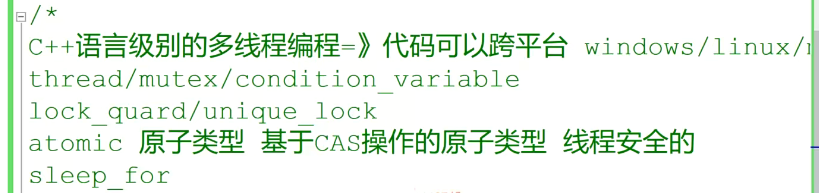

## Windows / linux  多线程编程

这个语言层面啊，语言层面。对吧，你调用的这个thread啊，调用thread其实呢，它在这个WINDOWS下边呢，用的还是谁呀？

用的还是这个create thread啊，它在这个linux下边呢？用的呢还是谁呀？用的还是这个p thread create，知道吧啊，它相当于就是把底层就是它可以通过编译器呢，它可以通过编译器的编译加到宏是吧？可以识别当前的操作系统哎来适配呢，我们通过在语言层面编写s啊，底层它自动呢，就给你调用相应的函数，其实呢，本质上还是在调用。操作系统的线程创建了API啊，它并没有说是创建了一种新的，

创建了一个线程的方式啊，其实还是。将相当于语言层面加了一层封装，对于我们开发者来说，那更简单方便了好吧，那这一点呢，我们可以在linux上啊，你编写完程序以后可以通过strace命令呢。来去查看一下啊stress就说是呃。点杠a点out对吧啊？我们可以看到我们程序启动的这个跟踪打印啊，跟踪打印它其实雕的还是我们pthread。

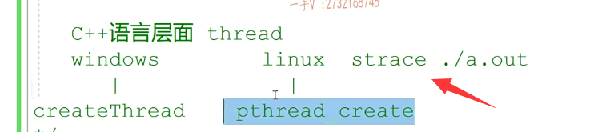

OK，那这里边儿想做多线程编程啊，想做多线程编程对吧？

那我们首先得先包含啊，这个thread。啊thread这个头文件啊，这个thread头文件我们多线程相关的都在这个头文件里边啊。

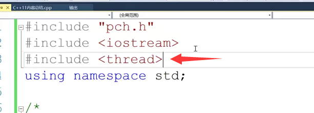

## std 作用域  自己加

好，我们先在这里边举一个简单的例子，先演示一下我们线程基本的一个使用操作啊，使用操作。那在这儿呢，大家来看一下啊，一般在公司里边儿呢，我们编写代码的时候一般不会直接写个using namespace STD的。那这样一来呢，就是可能会造成我们全局的名字冲突啊，因为毕竟我们标准库里边呢，

所有的类型啊名字。都是在STD作用域下的，对不对啊？那就是说是因为线程呃，相关的一些变量啊，类型啊。它的名字很容易跟我们大家平时起的名字冲突啊，所以我们做的时候尽量啊，能够把这个。啊，能够把这个STD作用域自己加上啊，那你如果为了图简单的话，你把这个加上的话呢也行，对不对？你看。

那。我们实际上写的这个啊，那当然，你现在把using namespace STD加上的话，那你STD作用域就可以省略了啊，就可以省略了。

## 线程对象  传入一个线程函数

这里边呢就是。thread handle啊，handle 1。那么大家看一下，这相当于定义了一个线程对象啊，定义了一个线程对象，定义了一个线程对象啊，定义了一个线程对象。然后呢，

参数传了一个什么呀啊，传入一个线程函数，一个线程对应的就是一个。线程这样的线程，这样的设一个函数是不是来作为线程的入口函数啊啊？作为线程入口函数。大家看看thread handle 1啊，在这儿呢，我们打印一下。这个是hello。thread 1。啊hello thread 1。

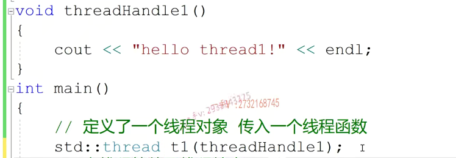

好，我们在这里边可以调用啊，这个join。join就是main，就是main,线程就是这个函数啊，==main函数就是主线程==，也可以叫主线程。啊，==在这里边等待啊子线程结束。主线程继续往下运行==。

那也就是说呢，在这里边儿啊呃主线程呢，创建一个线程对象啊，创建创建了创建了一个线程对象啊，创建了一个线程对象。线程传入一个线程函数。这个线程新线程新线程就开始运行了啊，新线程就开始运行了。这个新线程呢，就开始运行了啊，就开始运行了。==创建了一个线程对象，传入一个线程函数，新线程呢，就开始运行了啊，就开始运行了==。通讯对象，它就开始运行了啊呃，==所谓的新线程运行就是这个线程函数的执行==啊。

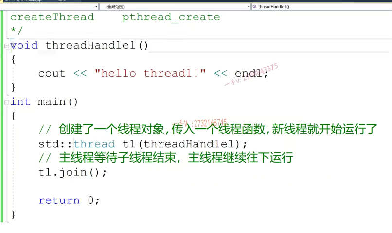

那么，由于是两个不同的线程，对吧？它就是各自运行各自的啊，它们之间呢，没有什么先后顺序可言啊，我们不可能说是main函数呢呃，就先于它运行。或者说是这个子线程呢，就限于主线程来运行，对吧？==它没有这样的顺序，它是完全随着CPU的这个调度算法==。啊来做执行的，我们在分析问题的时候呢，

==不可能去假设，哪个线程在前执行哪个线程在后执行是不是==？那么这个呢？==调用子线程的join方法啊，这里表示呢，我们主线程运行到这里边啊，我们就停下来，相当于阻塞下来了啊，我等待子线程这个。线程函数运行完，我们主线程再继续向后运行==，给我们打印一下，这是Main thread down。啊，运行完了。

对吧，看一看啊。大家来看啊，大家来看，在这里边呢，我们的这个hello thread 1是永远会运行在May th ride down之前呢啊，因为我们主线程等待子线程了，是不是在这儿呢？

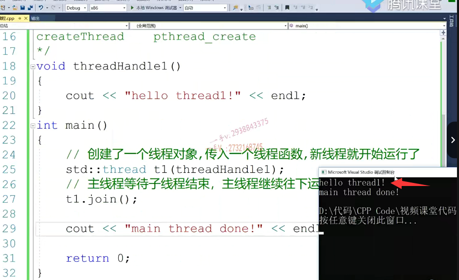

我们还可以在这儿做一个这样的操作呢啊STD this thread，大家注意啊this thread。this thread，==this thread是一个namespace啊==，还是一个namespace对吧？namespace它里边有一些方法啊，一些方法。包括get ID获取当前线程的ID啊，业务的啊，就是放弃当前这一轮儿的这个CPU时间片啊。这里边有一个。sleep until是不是到达某一个直接睡到某一个时间点，这sleep for睡多长时间啊？这与睡眠相关的，

### this_thread 命名空间

### sleep_for 命名空间里的函数

### chrono 命名空间

对吧？这是一个名字，空间thread thread底下有一个sleep for啊，sleep for。那么。这个。chrono.

这个东西呢，也是一个我们的名字空间啊，名字空间它里边定义了一些时间。跟时间相关的一些常量啊，还有方法，比如说这里边呢，你看。就定义了一些hours。microseconds.微秒million seconds，million seconds，毫秒对吧？minutes分钟。啊。这还有nanoseconds纳秒是吧？

还有一些，比如说seconds，这是秒啊秒。你比如说这是什么意思呢？这就是当子线程运行的时候呢？让子线程呢？睡眠两秒啊，让子线程。睡眠两秒啊，睡眠两秒。对了吧，你可以更换这里边的这个时间的单位啊million seconds或者是。呃，其他的啊，其他的microseconds都行，毫秒微秒。

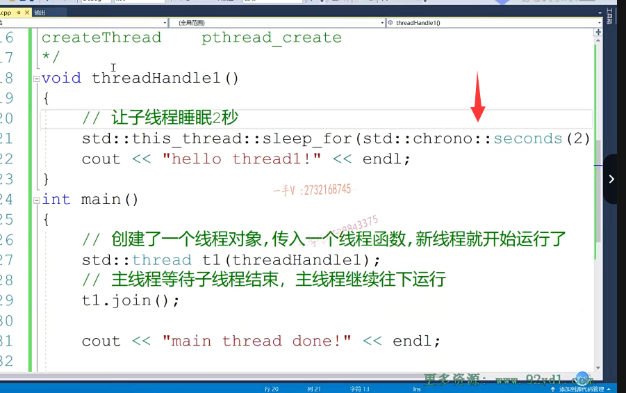

那我们再来运行一下，这个就是对时间的这么一个使用啊，你看这一直是阻塞啊，一直是阻塞。主线程等待子线程一直阻塞。子线程运行完，主线程才能运行好了吧？

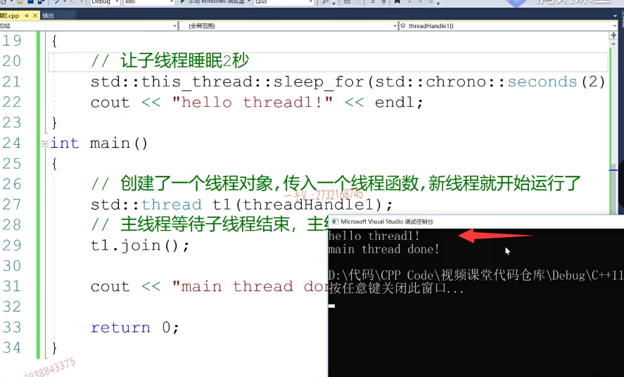

大家注意，在这里边这个问题啊，我们首先强调的这个第一个问题。啊，我们线程啊线程。问题一，线程啊，

内容这个一。就是对于。怎么创建？启动一个现场。啊，创建启动线程，直接用我们thread定义一个对象是不是就可以了啊？定义一个线程对象传入。线程所需要的线程函数和参数。啊，线程自动。开启啊，自动就开启执行了，对吧啊，自动就开启执行了，这是第一个啊，这是第一个。你要搞清楚。

### 可以添加参数

那你比如说这里边，==我们可以把睡眠的时间呢，可以当做参数传进来啊==，这是睡眠两秒。那么，大家看这里边其实呢，明眼的同学看到这儿就能明白啊，就能明白他是怎么把这个参数呢？传过来的呢啊，它是把这个参数传过来的，对吧啊time？啊，

他都在这个构造函数里边进行封装了，是不是啊？封装了。这后边呢，都是它的参数啊，你可以传任意多个可以传任意多个。无所谓，==那你传入什么样的时参就在这个线程函数添加什么样的形参==？哎，接收就行了，这是time，我们是接触到这okay，这也是没有任何问题的啊，这也是没有任何问题。

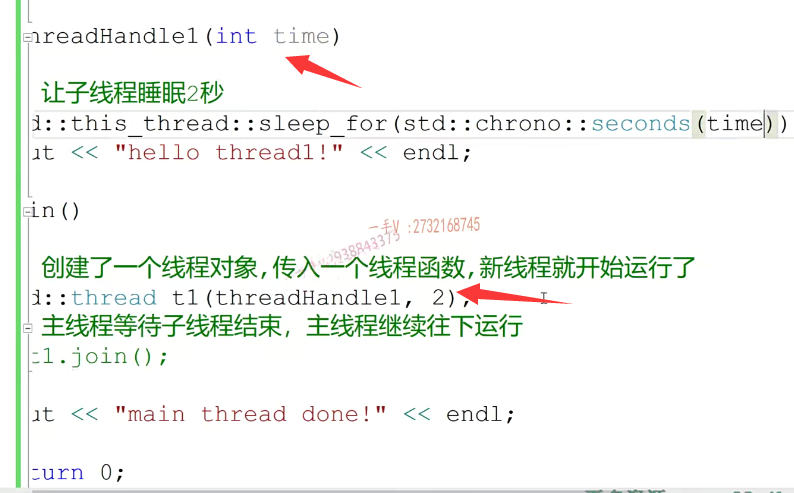

## 语言级别下，正常主线程必须等待子线程结束

就是线程一个启动，一个线程启动，大家看到啊，这里边呢，我们线程是不是执行？是不是有问题啦啊？这就是我们要给大家说的第二个问题。那我主线程一定要等待子线程结束吗？一定要等待子线程结束吗？就是在我们语言企业这里边有这么一个问题，==大家一定要需要注意一下啊，就是正常情况下啊，我们的这个线程执行呢？在主线程中，必须等待子线程结束==。主线程啊，

继续往下执行。也就是说，在这里边什么意思呢？==就是主线程运行完了。不能够存在正在运行还还未结束的其他的子线程==，此时呢，我们的整个进程呢？就要进入。就要出错了啊，就要出错了。叫抛一个异常嗯，直接。当前进程呢，就是异常终止了。异常终止啊，

没问题吧？其实呢，对于我们的这个学==Linux系统编程==的同学们，其实这其实在linux上呢，并不是什么大的一个问题啊，==等我们主线程结束了啊。我们子线程呢？我们会自动结束==的啊，自动结束的，因为主线程结束了以后呢啊，那个子线程这个运行完了啊，也就结束了，对吧？但是在我们的这个语言级别，它是对于线程的这个子线程运行的控制比较严格。

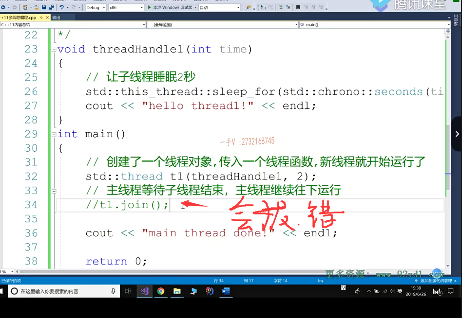

## 但也可以进行分离

### detach

你也可以不这样做，那怎么做呢？这什么意思啊？==这个意思是把子线程设置为分离线程==。哎，说人分离线程，意思就是说呢，我主线程跟你子线程呢，也就毫无关系了，我主线程呢，结束的时候啊，我看。哪些子线程未完成，我还看不看你这个线程啊？

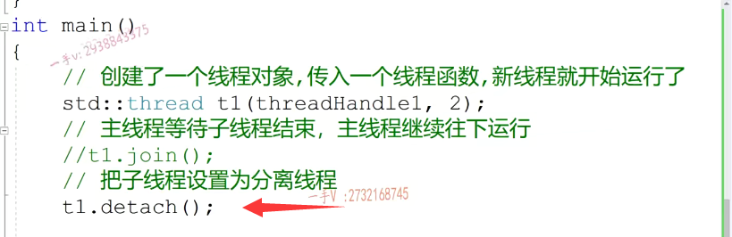

我就不看了，你这个线线程呢？运行完没运行完跟我一点儿关系都没有。啊，跟我一点关系都没有，就这么一个意思。啊，否则的话呢，我们主线程主线程运行完成啊。这个。查看如果系如果当前进程啊。还有胃。运行完成的子线程。啊，进程就会异常，

是不是终止啊啊？我们必须是等待所有主线程，等待所有子线程结束，或者直接把子线程设置为分离线程。我检查的时候就不看你这个子线程了。啊，这个也没有问题，你看miss right down我们主线程已经完了啊，这个已经打印出来了，但是子线程的那个打印你永远也看不着了。对吧，相当于你把这个字先程序设置为分离线程了，相当于从我的这个从我这一会儿从我这一会儿分离出去了啊，==我主线程完了。那我什么事也就完了==，

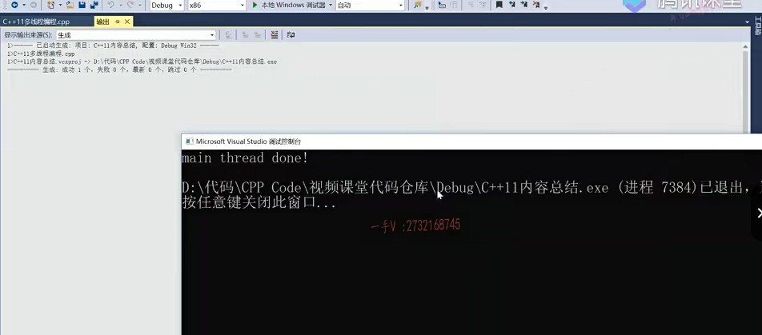

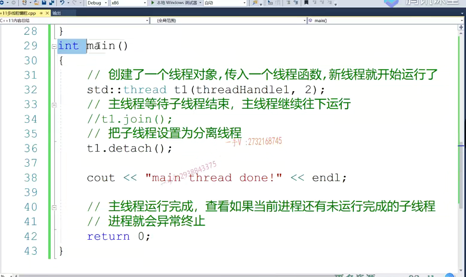

==包括我们的正常的输入输出，我们已经结束了啊==。你的子线程睡眠两秒以后进行了一个输出。我们谁也看不到。啊，大家注意一下，这里边的重跟detach方法啊。第二个就是。子线程。如何接触啊？子线程子线程子线程函数运行完成。啊线程就结束了，对吧啊？

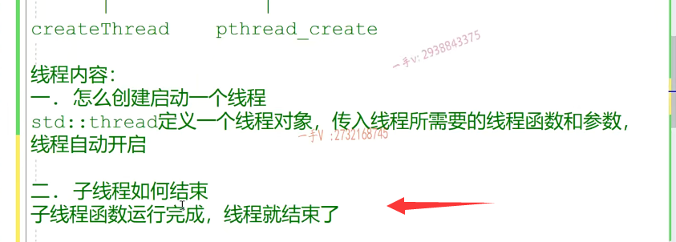

## 主线程处理子线程

第三个问题。主线程。如何处理。这个子线程呢？如何处理子线程呢？啊，那么可以有两种，==一种是等待子线程结束==，一种是呢？==把子线程设置为分离线程，==对吧啊？==那主线程就不管子线程了==，主线程只管它自己的自己运行完就完了啊，整个进程就完了。输入输出也就关闭了，==对于子线程运行的这个结果呢啊，我们也看不到，对吧？直接就全部关掉，进程结束==啊，进程结束。好吧啊。

这里边可能刚表示的，可能给大家表述的有一些不清楚啊，再说一遍啊，再说一遍这个是。等待所有子线程啊，等待这应该是用相应的线程对象来调的嘛，是不是？就是等待呢。t线程结束t线程结束啊。当前线程。

继续往下运行，一般都是我们主线程等待子线程的啊。t点detach。啊detach。好。这个表示什么呢？表示呢？把t线程设置为分。为啊，为分离线程设置为分离线程啊。主线程结束，整个进程结束。啊，相当于所有子线程。都自动结束了啊，都自动结束了，都自动结束了，注意一下啊，注意一下。

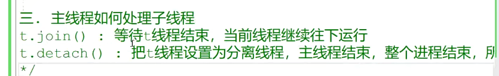

==就跟我们的那个守护线程比较相似啊，守护线程就当前进程结束，所有的守护线程呢，自动就结束了啊==，自动就结束了。好，这是对我们这个语言级别的线程的一个简单的基本的使用啊，基本的使用。好，那我们可以再定一个。TD thread t2。

thread handle.憨豆憨豆二是吧？这个睡个三秒啊，这个睡个三秒，或者是你也可以复用啊。可以复用，我们同一个函数，但是我们为了添加不同的打印啊，我们就写两个线程函数就可以了。这个是睡眠time秒，睡眠time秒这个呢，我们传的应该是三，这是hello thread 2对吧？呃，这个等待线程一二怎么样啊？

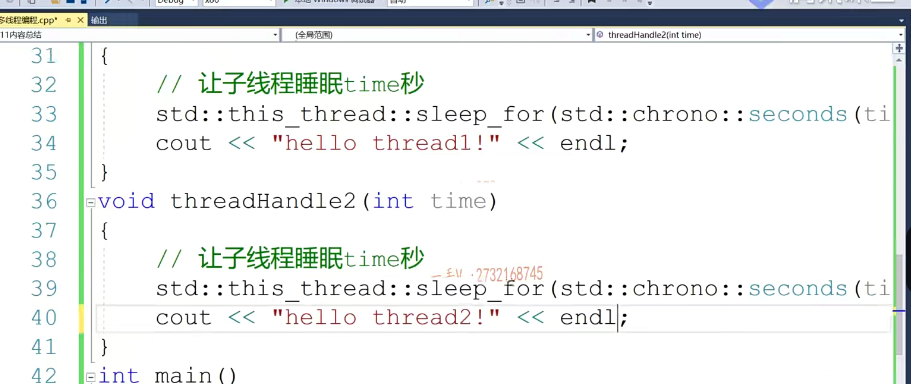

等待线程一二结束啊。很明显，线程一睡眠两秒嘛，先先执行嘛，是吧？线程二睡眠三秒后执行最后线程一线程二都执行完了，线程主线程才执行。打印顺序啊，就是这个样子的。这个大家应该能够看明白吧？啊啊，这就是我们线程最基本的一个使用啊，我们线程最基本的一个使用。

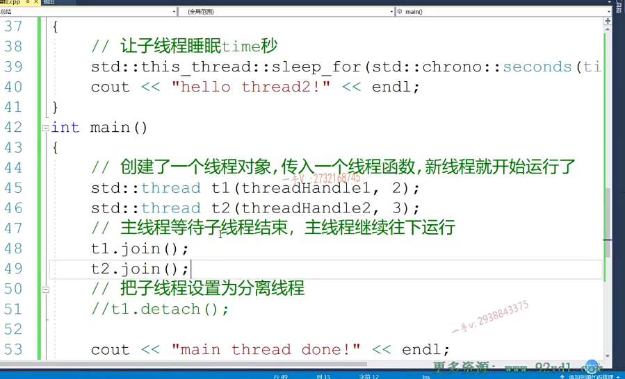

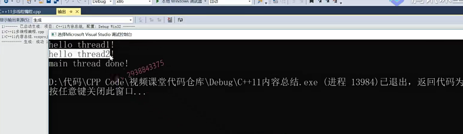

那我们下节课来通过一个例子呢，给大家介绍一下现成的这个互斥操作好，

这节课就先讲到这里。