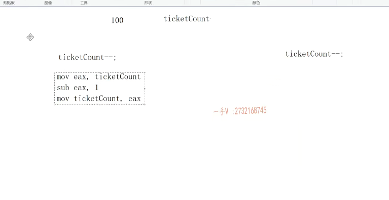

## 第三节课

大家好，这节课呢，我们来继续呢，说一下C++的thread多线程编程啊，thread多线程编程，

## thread模拟三个窗口卖票，票 从100按顺序卖到0

我们这节课呢举一个。实际的例子啊，我们来这个模拟一个这个模拟车站啊。这个窗口。卖票的这个程序啊，模拟车站。三个窗口卖票的窗区。假如说呢嗯，假如说在这里边儿啊，我们有一个count啊count就是车站的这个。

车震啊，车震有。100张。是不是车票啊啊由？==三个窗口。一起卖票有三个窗口呢==，一起卖票啊，那么大家应该知道呃，三个车口窗口是同时卖票对不对啊？可以同时进行卖票，但是呢？每张票只有一个，比如说第98张票只有一个，你不能卖两次。啊100卖完了，

就是99，99卖完了，就是98，你不可能98还没卖呢，你直接卖95了，95，94还没卖呢，你直接卖第80张票了，应该是==票是从100开始逐次往下卖的。直到卖到第一张==，你不能还去卖第零章，第负一章负二章。对吧，这是我们应该这么一，这是这么一个尝试，

对吧？我们来定义上三个线程啊，定义三个线程来模拟呢，我们的这个窗口的。卖票啊，模拟窗口这个卖票。好了，那么我们来看一下啊呃，实际上呢，我们可以。写这么一个东西啊。呃，list。你比如说呢list，这是s。

ttd threat.嗯t list对吧啊for循环。inti=0 I小于三加加I，我们从一开始吧啊，窗口一窗口二窗口三嘛，这样叫着顺口对吧？那么t list点push。push back push from都是o1，无所谓了啊，那么push back的话呢，这应该是个什么操作呢？

## 线程对象

啊，那就是定一个。线程定一个线程，是不是出来呀啊？定一个线程出来，那怎么定一个线程呢？这边相当于就是STD。thread创建一线程对象嘛啊呃sale ticket。我们应该有窗口的名称。是不是呃窗口的名称，我们直接给个i就行了啊，这是相当于我们窗口的这个卖票。

## 线程函数编写

这个index是窗口的，我们就写一个线程函数就行了啊，写一个线程函数就行了。

啊，这个。模拟模拟卖票的线程函数啊，模拟卖票的这个线程函数。

## 等待所有子线程结束

然后在这呢，我们还是需要一个std thread。tlist.

我们要在这里边等待吧，所有子线程是不是结束啊啊？等待所有子线程结束。okay，这里边表示所有。窗口卖票是不是结束啊啊？所有窗口呢？卖票结束了。

好，我们来看一下啊。来看一下。

那么，在这里边sell ticket it啊index.

那么在这里边，我们应该是if。count大于零吧。我们是不是进行一个打印啊啊？进行一个打印，那么cout什么东西呢？

就是窗口啊。窗口。index.卖出第 张票。没错吧啊，那完了以后呢？是不是还要对count进行一个什么操作呢？还需要对count是不是进行一个减减操作？嗯，没问题吧？进行减减操作啊。

## 模拟卖票   花费时间

那么在这里边呢，我们。再定一个什么东西啊？sleep for啊。seconds million seconds吧。毫秒是不是卖一张票睡100毫秒啊？睡上100毫秒就模拟我们每一个窗口卖票，

肯定得花一些时间嘛，是不是？啊得花一些时间。

## 运行一下：有点问题 名字冲突了

你看我们大概的这个程序呢，就是这个样子。对不对啦啊？大概的程序就是这么样子的，我们来运行一下啊。

嗯，这里边有点问题，是不是count count我们来看？这是什么错误啊？不明确哦，这是跟我们的库里边的名字冲突了，是不是啊？

那这里边写一个。ticket ticketcount.好了啊啊，这还还有这呢，还有这呢ticketcount。大家来看啊。呃，我如果写成这个样子，你看我们输出输出的是这么一个东西啊。

这个是窗口这打印肯定是有。呃，是这样，应该能想明白，因为是所有线程怎么样啊啊？所有线程呢？

都在进行输出。是不是都在这进行输出啊？都在这进行输出，没有一个。呃，没有一个什么呀，没有一个统一的，这么一个串行的打印，因为线程嘛，都是并行执行的。是不是啊？那都是并行执行。

## if只会卖一张票，所以改成while

好，那我们来看一下啊，我们来看一下。

那也就是说呢，我们先来。一步一步的这样做一下啊，这样做有的同学在这里边直接可能。把这写成一个。while对吧啊，写成一个while。刚才呢，我们写成什么了？写成if if的话呢，相当于就是。卖了一张票，卖了一次，是不是就结束了对啊？啊，

我们同学呢，写成这个while是逻辑上是没有问题的，while循环，只要这个票还有的话，我就继续卖票。是不是啊？刚才呢？我们不应该写成f啊。啊这这这票就这样开始卖了。

大家看啊，所有的窗口呢？是不是都在这里边进行一个？卖票的这么一个操作啊啊，卖票的这么一个操作。啊。

打印这个有。交叉是吧？这就是多线程程序嘛啊，多线程程序哎，

## 出现问题 一张票卖了多次

其实在这里边呢，如果我们不打印这么复杂的话呢，

我们先简单的给大家答应一下，这个ticket count啊。

很显然，我们大家能看到错误啊，你看这15张票还打印两次啊，17呢，18页两次加90。

18页两次，这100打印出三次。88也三次。不对啊，不对，一张比一张票不可能卖多次的，是不是一张票不可能卖多次的啊？

## 竞态条件

那么大家应应应该能知道这里边的问题啊，我们多线程程序啊，要涉及一个线程安全的问题对吧啊？==就是多线程程序里边有这么几个名词啊，名词叫竞态条件。==

什么叫竞态条件呢？就是多线程程序执行的执行的这个结果是一致的。啊，就是不会随着。随着CPU不同的对线程不同的调用顺序而产生不同的运行结果对吧？这就是竞态条件啊，

多线程序啊，执行的结果是一致。我们CPU每次呢，每次你运行这个进程啊，这进程里边儿很多的线程啊，对吧？那CPU对这些线程的调度的顺序呢，可能都有所不同，是不是？但是你虽然线程的调度顺序不同。但是你整个程序呢，

你运行结果。应该是一致的啊，应该是一致的，对吧啊？

那如果说你每次运行都会出现一种结果，每次运行多线程程序都会出现一种结果，那么也就是说这个程序中啊。存在这个竞态条件啊，竞态条件。存在竞态条件，

## 存在竞态条件，每次运行的结果有所差异

==那么很显然我们这个函数呢？存在竞态条件啊，存在竞态条件，你每次运行的这个结果呢？都有所差异。都有个差异。==你可以仔细的去看一下，都有所差异。

啊，那么。眼尖的同学一下能看出来这个操作呢，==对于全局变量减减操作对吧？==

==它不是一个线程安全的操作。不是一个线程安全的操作。==

我们每个窗口都想对这个全局变量进行一个减减操作，那么一个窗口减一次，三个窗口应该减三次，对不对？

==但实际上呢，有可能三个窗口只剪了两次，或者三个窗口只剪了一次。==

## X86下从右向左看

那么。不知道这个操作在多线程环境下，有问题的同学再来跟我回忆一下啊。

那么，假如说这个ticket的是个100初值，是个100是吧啊？初值是100。

那么这儿再做这个ticket的减减。这儿也在做ticket的减减。

这应该是先干什么呀？先木我呢啊。把这个ticketcount呀。

从内存中拿到寄存器上。然后呢？这个寄存器是不是应该是减个一呀

sub？减个一，然后呢？再把寄存器的值是不是挪到这个内存当中啊？

叉八六指令从右向左看是不是啊？那这应该也是一样。

我们假设这是两个线程，在做这两个减减操作，对吧？

每个线程在一个指令周期之内啊，那我们是要保证这个指令，一个指令是要结结束的，要运行完的，

但是多个指令。他们的运行顺序是什么样子的？

那这就完全由CPU的调度来决定了啊，每一个这个线程在运行完，每一个指令的时候呢，都有可能。CPU的时间片到了线程就要该进入阻塞了啊，该进入阻塞了，等待下一轮儿。等待下一轮。我们再轮到这个线程执行的时候呢，才能够把cpu说的时间线给到这个线程，这个线程才能继续执行指令啊。那假如说呢？在这里边啊，

你这个线程先执行。把这个原始值100，读到寄存器当中了，然后在这里边儿寄存器中把100减一九十九OK假设。==到这儿线程时间片到了，那也就是说他并没有把结果99写回是不是ticketcount里边啊==？啊，并没有。

==那在这里边读的是多少？因为并没有把99写回内存，所以这个变量现在的值是多少啊？还是个100==？没问题吧，读出来是99。啊，

这减完以后是99。

然后接下来不管这个线程怎么执行，相当于两个线程，最终都把99是不是写到我们内存里边儿去了，也就是说两个线程减减了两次。理应是从100减到98啊，但是却只减到了99，这就是我们所谓的这个操作，它不是一个线程安全的操作。能明白吧啊，

所以在这个代码中呢，我们就要对这一块儿呢，做一个线程间的一个互斥。

啊线程间的这个互斥互斥，我们常用的就是互斥锁啦，

互斥锁要使用互斥锁的话，得先包含我们的这个头文件。mutex啊，对包含这个mutex。就互斥所头文件好吧，

## 互斥锁 std::mutex

我们在这里边定义一下啊std mutex。啊，这是mutex。这是全局的一把互斥锁。做线程间互斥的，

也就是说这个操作呢，不能多个线程共同执行，多个线程要是同时进行的话，就会产生问题了啊，就会产生问题了。

这个操作我们必须互斥起来，每次呢，只有一个线程能够去做这件事情啊，每次只有一个线程能够去做这件事情。

## 这样写，运行看一看

那如果。你看lock。好的吧，做完了以后再怎么样啊？the on lock.做完后再unlock。大家看这一百九十九九吧，你看也打印，现在也。没有任何问题了。打印出来没有问题，

## 但是这样写，就是一个线程在卖

但是这个程序你仔细一分析，这个有bug，为什么有bug呢？你看啊，这什么意思呢？第一个线程进来以后。获取这把护士锁。进来做这个while循环，其他线程再进来，想获取这把互斥锁的时候，因为获取不到锁，因为我们第一个线程啊，还没有释放这把锁呢。其他线程呢，发现我获取不到这把锁，

那其他线程就阻塞住了，那这个线程在这儿，这是一个循环，它只要ticketcount不为零，它就一直卖，所以你这样写的代码呢？诶，卖票的结果倒是没什么问题，==但是。你只有一个窗口在卖票，其他的窗口根本没有卖。==

## 如何解决？核心区域加互斥锁

想想好了。那么发现这个问题以后呢？也也就是说呢，我们需要怎么样啊？

把这个。线上的互斥啊，挪到哪里来呢？挪到里边来啊，挪到里边来。嗯，闹到这儿来，这是我们卖票的核心，对吧？

这是我们卖票的核心，因为只有这一块呢。所以这这一块儿是什么呀？就是这一块儿呢？是我们减减操作这一块儿发，也有这个竞态条件啊，

## 临界区代码段保证原子操作

我们也把经常在操作系统上把这一块儿代码叫做这个临界代码段啊，叫临界区代码段啊，对临界区代码段，我们应该保证它的这个原子操作。

所以我们进行线程间互斥操作啊，

我们所用的线程的互斥的办法就是使用互斥锁啊，互斥锁保证。

## 运行结果看看

每次只有一个线程在这来。

其实我们现在要加上互斥锁的话，那么这些打印呢，我们都可以加出来了，对吧？

这都是串行打印的减减。好不好？

那我们运行一下啊。所有窗口都在卖票，对吧？199，98

你数一下。这应该是没有什么问题的，是不是啊？这应该是没有什么问题的。嗯，那实际上呢？

## 可能会出现卖第0张票的情况

## 分析

其实我们这个代码还是有问题的啊，还是有问题的，只不过多线程的一些细微的问题呢，是很难复现的，因为毕竟谁知道。你可能运行了100次，对吧？只有一次出现这个问题啊。

那么，还存在什么问题呢？你想一想啊。

就这一块儿呢。当这个ticket count为一的时候啊。这个它的值是一的时候值为一的时候就现在只剩一张票了，只剩一张票了啊，

只剩一张票了。我们这个窗口一进来了，线程一进来了，线程一发现e大于零，进来了，获取互斥锁。啊，到这儿。

比如说呢，还没有真真正正做减减的时候，也就是说ticket的count内存的值还没有被更新成零。线程2进来了。也大于零。一嘛，因为一还没有变成零嘛，

是不是线程二也进来了？是不是因为获取不到阻阻塞到这里了？

那么，当线程一就窗口一把这个票真真正正卖完，从一卖到零了以后，他是不是出了这个互斥锁？哎，那么是不是窗口二线程二还在这里边儿又获取这把锁，还要把第零张票卖了卖成，是不是负一呀？

能理解吧，也就是说在这里边还你你你还在卖第零张票呢？再说一遍，当ticketcount为一的时候，线程一进来了获取了这把锁。

在执行这些指令的时候，还没有执行到。就是还没有真真正正把ticket count更新为零的时候。很有可能，对不对？

那线程二又要开始卖票了，窗口二开始卖票。因为ticket的count并没有从一更新成零，所以它的值还是一那线程二也进来了。

由于线程一没有释放锁，所以线程二获取不到锁线程二在这儿阻塞了。

当线程一呢，真真正正把票卖了以后，

释放锁了那线程一就可以获取锁了，在这儿呢。他是不是在卖第零张票了？从零。是不是还要减到这个负一呀啊？

## 解决办法：锁+双重判断

## 判断票大于0

所以一般来说呢啊，我们所写里边呢，就要再进行一个什么操作啦。就要再进行一个判断啦啊，这叫锁加双重是不判断啊，双重判断哎，以后你还会见到的啊，以后你还会见到的。

所以加里边儿对于这个值的判断，还需要再一次判断，你看这时候呢，

如果线程二如果也进来了。但是线程一把这个执行完了，执行完了以后呢？这都已经减减了，那么项城二虽然也进这个while，但是他发现呢ticket已经是零了，他相当于获取了锁，是不是啥也不做？又释放锁，是不是又走掉了？好

==不会在逻辑上又把第零张票减减减到负一嘛==？

能想来吧。啊，你想一想，我们刚才在这里边的表述啊，所以这样子才是才是最正确的啊，才是最正确的。

## 运行结果

大家看一看。嗯。没问题吧，这才是最正确的，不管什么时候呢，都不会出错。好的吧。行啊行。

## 互斥锁没有必要手动添加，防止中途异常，其他线程获取不到锁，导致死锁

那么，在这里边儿顺便呢？这就是给大家介绍了一下，

在我们语言级别，如果你要做线程互斥啊，就可以使用这个互斥锁啊。

好不好的？啊，其实呢，你在这里边儿互斥锁的lock跟unlock呢，你其实大可不必手动添加啊，

为什么呢？

因为。这里边儿万一呢，你说是中间这一块儿啊，某些地方if什么成立return掉了，是不是我们这个锁的释放根本执行不到啊？

执行不到你这个线程把锁不是放其他的线程获取不到这把锁，

整个进程是不就死锁啦？

## 如何解决？

对，所以我们还是要采用智能指针这么一个思想啊，

只要是我把锁获取了。不管是我后边儿线程怎么执行，是正常执行临界区代码段执行完，还是说从中间呢？

我return掉了。啊，我走掉了，就一定要把这把锁释放掉，是不是好在这我们来看一下，我们两个一个是lock_guard和。叫unique_lock啊，

我们来看一下。看一下这个。lock guard.大家跟我在它源码中去。

看一下啊。好，那么在这里边你看啊，他需要的是不是就是一个互斥所的这个类型啊啊，

用互斥所的这个类型mutex类型啊？

它的成员变量其实就是拿拿一把锁啊，拿一把锁它的构造呢啊，

它的构造函数会自动的去获取这把锁啊，

吸垢呢，会自动的去释放这把锁，

==这把锁是不允许呢，拷贝构造跟复制重载的。==

## lock_guard使用

好了吧嗯，那也就是说怎么怎么实用呢？在这里边这么实用。就是你可以不用它了。

啊，你可以直接用log guard。mutex在这里边儿。这个是。lock吧啊，直接编一个lock。然后呢？mtx。直接写成这个样子就可以了。这构造函数嘛，这个log的构造函数是不是会自动的去？获取这把互斥锁啊，

## 没必要把睡眠放在锁范围，所以加个大括号，表示作用域

但相当于这个对象是一这个while里边的一个局部对象，什么时候吸垢呢？出了well才吸垢。我们不必把这个睡眠是不是放在这个锁的范围之内啊？

所以呢，没关系啊，只要加个局部作用力就行了。给这加这大括号。那现在就可以了，这个对象呢？==是不是就是这个作用域的局部对象啊？它构造的时候获取这把锁出这个作用域呢，==

==它就会析构，析构的时候呢，是不是就会把这把锁给释放掉，跟我们刚才一样？==

或者是你这个临界区代码段中间呢，你某些地方return掉了，return掉你就要出这个作用域了嘛，出这个作用域，你前边的这个lock就要析构了。==啊，因为它是一个站上的局部对象，它虚构的话就会把这把锁释放掉啊，这也是非常不错的啊，这是非常不错的==。好的吧啊，

这非常不错的。

啊，==实际上啊，这个lock_guard 像不像我们之前的scoped ptr scope ptr这个智能指针==

==是不是也是把拷贝构造跟赋值重载直接delete掉啊？啊，它不能用。所以你只能在简单的地方使用lock_guard==的。scope ptr.

那么，如果我们在函数调用过程中，参数传递过程中，我们能用log盖的吗？你就用不了了，

因为它不支持拷贝构造跟复制重载，对吧？

## unique_lock可以使用在参数传递过程中

所以我们还可以用另外一个啊，就是哪一个呢？就用unique_clock。啊，这个其实呢，就是相当于大家的。unique，unique ptr。unique ptr是不是跟scope的ptr是相当于一个升级版了是吧啊？

==它是可以转移这个指针的，但是它是一个利用了这个带右值引用参数的考虑构造跟赋值，它把左值引用的考虑构造跟赋值也是delete掉了。==

但是它公布了带右值引用参数的copy构造跟赋值，就是我们这个东西是可以使用在函数调用过程中，函数返回过程中，函数参数传递过程中。是可以允许临时对象拷贝构造一个新对象，临时对象给一个对象赋值的。对了吧啊。

我们转到去定义啊。你看一看，它也是需要一把锁嘛，是不是啊？它的成员变量呢啊，你看它的成员变量。是不是相当于一个指向一把锁的这么一个指针啦啊？

我们刚才是获取一把锁的引用嘛，对吧？

## 右值引用的拷贝构造和赋值

你看这是他的。右值引用参数的拷贝构造的赋值。好不好？

它的左值引用参数的拷贝构造跟赋值也是同样被给这个delete呢。

## unique_lock的使用

okay吧，嗯。好在这里边呢。你来看一看啊，你来看一看。那么unique lock啊，

这就是我们的unique lock。大家可以。翻开它的这个源码，浏览一下.

你执行它的这个lock，执行它的这个lock啊，执行它这个lock，它有log方法啊。你调用它底层维护的这个。所的这个。lock啊。unlock对吧？底层的锁的unlock啊，比我们直接使用的有text要安全很多。

尤其是在参数传递过程中。是不是啊？那也就是说呢，你可以在这。这样使用啊unique lock。STD mutex啊mutex。

那么在这儿，我们应该是。怎么做呢？lock啊mtx。对不对啊？那么在这儿呢，你相当于还是要怎么样啊？要自己加一个锁，自己是不是再解一个锁啊？

啊unlock就是unique lock在这使用的时候呢，它是这样使用的。是不是啊？这样使用的。

其实跟我们最开始使用new TeX一样，它只不过呢，把new TeX封装了一下啊。

==就不允许呢，对于这个mutex进行拷贝构造赋值对吧？==

==但是可以运行呃，允许右值引用的拷贝构造跟赋值啊，就是临时对象。==

好了，这个unix log应该是还要跟，就是在应该是在线程通信中呢，是要使用到，

所以在这儿呢，我们就。不困扰大家了啊，大家整的都不知道该用哪一个了。在这儿呢，我们就建议大家直接用logo盖儿的就可以。好不好啊？不涉及太多，我们后边讲线程通信，我们再给大家讲unit lock。

这个应该很明显吧，大家应该理解，这个应该是没有任何问题的啊，构造函数获取所得lock方法析构。

调用锁的unlock释放锁对吧啊？这样是最完美的。

行，那么。这节课呢，我们写了一个模拟车站窗口卖票的这么一个程序啊，给大家介绍了一下，我们C++多线程程序编程在做线程互斥的时候啊。我们所依赖的这个互斥所，

## 总结

那也就是说这节课我们主要讲的是线程间的互斥。啊，需要使用这个互斥锁mutex，由于互斥锁呢，要手动lock跟unlock。也有可能导致on lock是不是调用不到啊，

==所以在这里边我们应该用lock guard封装mutex对不对==？

==它用就跟我们的智能指针一样，利用栈帧的对象出作用域，必须析构这么一特点==。

啊，只要出这个作用域。它的析构函数里边就会把这把锁呢unlock掉。是不是啊，

## lock_guard防止死锁

==有效的防止了有这个保证，所有线程都能释放。释放锁啊，防止死锁问题的发生嘛。==

能够想来吧啊，防止思索问题的发生。要不然呢，你自己手写on lock，它就一定会调用到吗？有可能调用不到是不是啊？那这把锁呢？释放不了别人，也就获取不了了。啊，那么后边呢？如果碰到相应的问题呢？

我们要编写多线程程序，涉及到线程互斥的操作。那么主要用的呢，就是new text。the lock guard.OK吧啊，讲到我们这节课就讲到这里。

回播