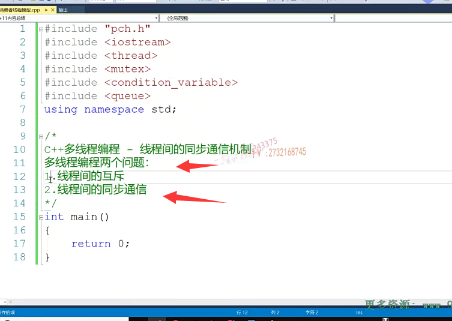
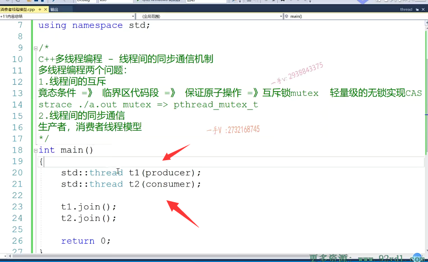

啊，大家好，那么这节课我们。来继续来讲这个CA加啊，多线程编程。什么东西呢？就是线程间的同步啊，同步通讯机制。啊，这个多线程编程啊，有两个需要注意的问题，对吧？多线程编程啊。有两个问题啊，第一个呢就是线程间的这个互斥。

啊，互斥第二个呢，就是线程间的这个同步通信，

有很多同学呢，学完系统编程啊，或者学完这个多线程编程。互斥跟同步通讯呢，还搞不清楚是吧啊，那互斥是什么意思呢？互斥就是我们多线程。这个代码呢，在呃运行的时候呢，我们存在我们上节课说过的静态条件，对吧？啊，

静态条件静态条件是什么意思呢？就是我们多线程程序呢啊？就是运行的时候呢，多次运行的时候，结果结果有可能不一致啊，就是随着呢CPU调度线程顺序的不同而产生不同的结果，这是不允许的啊。你不管用单线程去做一个呃，场景运算还是用多线程做场景运算，你的结果应该是相同的差别，差别就在效率上。啊，差别在效率上，你是一个多核的或者多CPU的系统，你想通过多线程编程啊，

来把所有CPU的能力都用上啊，你应该是提高了代码的。这个程序运行的效率，但是呢，运行的结果呢，应该是一样的，对吧？

## 临界区代码的保证原子操作

如果存在静态条件，我们把发生静态条件的代码段呢？在系统上经常称作呢，临界区是不是代码段啊？对于临界区代码段呢，我们严格上说啊，只能是每次到临界区的时候呢，只能一个。

线程进来就跟我们大家呢都呃，早上的这个操场都出完操了，出完操了，大家都想出去啊，大家一股脑的都自己走自己的啊。呃，自己走自己的，自己跑自己的，都走到我们操场的门口了，但是那个门比较小，出门的时候呢，那得一个一个人出啊，这那那个门儿呢，就是属于我们临界区代码队儿啊。那么每次呢，

到临街区代代码队儿，每次出这个门儿，走这个门儿啊，只能是一个一个人走。那么一样的临界区代码段呢？也就是只有一个线程能进来啊，所以我们要保证临界区代码段的这么一个原子操作啊，原子操作。

## 也可以使用无锁机制CAS

那保证原子操作呢？保证原子操作呢，我们通常用的就是啊，线程就是互斥索mutex啊，用的是互斥索mutex。没问题吧？当然了，

我们还会用一些轻量级的轻量级的无锁机制啊。无所。实现啊，比如说是cas的，对吧？cas机制呢？来保证我们。比较小的临界区代码段的这么一个原子操作啊。

好，这是我们之前讲的线程间的互斥，我们给大家讲了一个模拟车，这个车站的三个窗口的同时卖票的啊，这么一个。场景我们来看了一下，先呈现了互斥，

对于我们互斥所mutex的一个应用啊。

## linux下互斥锁

好，其实呢？对于我们同学们来说，如果呢，你做过Linux系统编程的话，其实呢，你可以用strace呢来跟踪一下我们同样的代码，你可以拿到linux下，你跟踪一下，你就发现了，当我们使用。这个在语言级别使用C++11提供的这个mutex的话呢，其实linux底层呢，用的也是pthread_mutex_t的。

啊，就是也用的是它的这个互斥锁啊，用的它是用的是它的这个互斥锁。没问题吧嗯。

## 为什么会有线程同步通信？

## 没有线程通信，每一个线程都完全受调度算法

那么我们这节课主要来看一下这个线程间的这个同步通信啊，线程间的这个同步通信啊，线程为什么要通信？

啊，那么首先呢，不通信的话，每一个线程呢，就是受CPU调度啊，他们没有任何执行上的顺序可言。啊线程一跟线程二呢，他们完全是根据调度算法来的，有可能这一回你运行它的时候，线程一先运行线程二后运行。

那么，那有可能下一次你再运行同样的程序的时候呢？就线程二先运行线程一后运行了。对吧，所以呢，多线程的时候，我们在分析问题的时候啊，就是线程间的顺序呢，运行顺序，这是不确定的。

所以多线程程序呢，一般出问题啊，比较难以复现，因为谁也不知道当时出现问题的时候啊，线程之间它是怎么调度的，对吧啊，调度我们一般可以得到呢，每一个线程的线程栈信息来通过分析，看是否发生了这个资源获取不到死锁的问题来解决，多线程程序出现的难易这些bug对吧啊好。

## 线程间同步通信：线程之间会存在依赖关系

我们在这里边先不从理论上给大家讲啊，线程间的这个同步通信对吧？其实呢呃，通俗的去理解一下，就是通信就是说是呃

我线程一跟线程二呢，一起运行，可能线程二要做的事情啊，必须先依赖线程一把，某一部分事情做完。然后你告诉一下线程二哎，这东西准备好了，那线程二就可以继续往下执行了，对吧？

或者是哎线程一接下来要做某些操作，那这些操作呢？需要线程二把，另外一部分事情做完，线程一才能继续做这部分操作，对不对？

那就意味着线程一需要线程二把，那一部分操作做完以后。通知一下线程一哎，我做完了，你可以继续了，那么线程一就可以继续往后执行代码完成操作，对吧？

有线程建有时候是需要进行。同步通信的啊，

## 举例：生产者消费者问题

我们先来举一个非常经典的问题，就是生产者啊，就是生产者。消费者问题啊，就是生产者消费者问题。我们来看一下啊，

看一下生产者，消费者问题。啊，这个是生产者，消费者线程模型啊，线程模型来看一下。

我们的需求是什么啊？有什么样的需求，我们才会有线程间的同步通信，是不是这么一个说法啊？嗯，那么在面试中啊，对于多线程考察啊，包括我们同学反馈的面经上啊，这个生产者消费者线程模型啊。

还是经常被问到啊？

## 创建生产者和消费者 两个线程

那么好了。大家来跟我看一下啊，那在这里边呢，我们开始写代码t1 producr。

这个相当于是我们开启了一个生产者线程啊。这个相当于开启了一个消费者线程。

## C++容器都不是线程安全的，需要封装

我们主线程等待两位线程都执行完，我们再结束是不是主线程啊？

那当然，我们还需要一个共享的一个。比如说队列，因为生产者生产好东西呢，往这个队列放，

然后消费者从同一个队列是不是拿东西呀？

在这我们选择用我们C++容器适配器queue，但是我们需要用面向对象来封装一下，对吧？

因为大家知道啊C++stl里边的C++stl里边这个。它所有的这个容器呀，都不是线程安全的啊，都不是线程安全的，不能够直接使用在多线程环境下，对吧？

那如果在这里边，我直接使用queue的话，那也就意味着用这个queue的push跟pop操作的时候呢，它涉及这个线程安全的问题。我们又不可能到人家源代码上，

是不是去把人家给人家的这个push跟pop做一个？线程互斥操作呀，我不可能改人家的源代码嘛，对不对啊？没有意思，所以我们简单的去给它封装一下啊，封装一下。

## 开始封装

那么，public private啊，那么，这是个queue放一个整形吧，好吧？啊，那么在这里边，我们可以用这个queue啊。

给它提供一个put方法，这个相当于就是生产一个物件啊对吧？push呃y0没问题吧？这个是。生产者生产value.好物品。

啊，这个就生产完了，是不是那么还有一个就是pop啊？

应该是get吧？get啊，get这相当于是从队列里边是不是拿元素相当于消费元素啊？啊，这是。生产物品啊，这个接口呢，表示呢，消费物品，

这我们把queue封装一下这个代码呢，是我们自己写的，我们就可以做线程间的互斥了，对吧？相当于value等于这个queue点front从对头出嘛啊，然后呢queue再来一个pop操作，

然后再把这个value呢返回回去。

OK吧，那么pop了以后呢？我们给大家再打印一下啊，打印这个就是消费者消费是不是消费者？消费value或物品。没问题吧嗯，大家看看这个，==当然我们说了这个操作呢。这个操作它不是这个不是线程安全的啊我们现在在两个线程里边分别进行生产物品跟消费物品，对于queue说肯定是要出错的啊。==

==那我们需要添加互斥锁，做线程间的互斥是不是好？==

我们来看一下啊，一会儿我们来添加这个线程互斥操作。

这个相当于是两个线程共享的队列啊，共享的队列我们分别呢把它。的地址呢？传进去啊，地址传进去。好在这呢！

void producer。queue，这是我们生产者线程啊，生产者线程。好okay，

再往下，这个是我们的consumer，是消费者线程啊，

## 生产者线程模型

我们在这里边儿来模拟一下，就是inti=1 I小于等于十就生产者生产十个物品，消费者消费啊，十个物品啊。这个相当于是put对吧？把I直接传进去用I呢来代表我们物品的这个序号吧啊。

呃，然后在这里边儿呢我们。来一个睡眠吧啊。

那么呃，别生产的太快了是吧？然后这里边是million seconds。我们睡上100毫秒。

## 消费者线程模型

然后这是消费者啊，消费者的话呢，就是get呢，不需要下标。消费者消费100毫米好吧嗯。

## 成员函数需要加上锁

那大家来看，在这我肯定要加一个互斥锁啦。要加一个互斥锁了啊mtx简写吧。啊，

在这里边。所以我们不要用不用直接调用互斥所的lock和on lock方法啊，

我们在这儿呢，可以直接呢。使用这个lock盖的类似于智能指针的思想来自动呢，通过站上的对象构造跟出作用域虚构自动调用我们互斥所的lock和on lock方法，对吧啊？这个还是。非常不错的。

那么。你看呢，我们给它把这个互斥所见，这个一定是要加上的啊，因为这两个方法呢，是在不同的线程里边调用的。

对吧，一个是生产者线程，一个是消费者线程啊。

好，我们运行一下这个代码，看一下结果啊。诶，看出现问题了啊，出现问题了，出现问题了。出现问题了，被queue那就是我们的容器适配器queue出现问题了啊，再来运行。你这回到四，你这回到四，

刚才是到二啊，那每次运行的这个。诶，这回到八了是吧？诶，这回也是八。对不对？这回是一为什么会出现这样的问题呢啊？

## 出现问题 因为消费者和生产者不受控，可能没有东西给消费者消费

那么大家其实仔细分析一下，应该就明白了。如果是我生产者啊，生产者这个生产啊，消费者消费对吧？应该是生产一个消费一个生产一个消费一个。

但是万一这个消费者线程啊，消费的比较快。

还没生产呢，队列都是空的，

你消费者线程就来消费来了，那么在这里边儿队列里边儿能取到东西吗？

它是取不到东西的。取不到东西。出错没有内容是不没有内容啊对啊。

那么，在这里边儿呢？

我们是不是就要进行一个？这这怎么操作呢？==就是线程间呢？我们需要有一个这么一个通信的机制啊，==那么我们想实现一个什么东西呢？

我们在想，==是实现一个呃生产者啊，生产一个物品啊，通知啊，消费者消费一个消费完了啊。在消费完了完了消费者。再通知生产者啊，继续。生产是不是物品啊啊？完了以后呢？生产好了再给消费者进行通知，消费者消费。==

那么现在呢？是一个完全不受控的啊，就是生产者线程跟消费者线程呢，两个之间没有任何的交流，就是它生产它的。他消费他。对吧，他消费的时候也不管那个队列里边儿还有没有生产好的产品，他就直接取，他根本不看。

## 如何修改？

OK了吧啊，所以这里边儿我们应该是不是有这样的一个逻辑呀？就什么样的一个逻辑呢啊？什么这样的一个逻辑，你看一下啊。看一下，大家看一下就是if。

那么，生产者线程你别别光顾着生产啊，你你每次铺它的时候，你进来看一下啊，什么意思呢？

那就是说呢啊。if如果说啊，如果说我queue呢？empty.不是empty的，也就是不空不空，意味着呢。啊，这个。

==不为空是吧？那么这个生产者应该通知消费者。去怎么样去消费啊？去消费。==

这个消费完了。消费完了啊，完了再继续。生产好了吧，消费完了再继续生产。啊，这个应该是。这么一个操作，对不对啊？

## 生产者中需要释放掉这把锁，让消费者去消费

那么，在这里边大家。想一想啊，

那在这儿呢，我们这个生产者呢，线程呢啊，在这儿我们的这个生产的线程啊。生产者。线程。你是不是应该把这个锁释放掉啊？是吧，应该把这个锁释放掉，因为你不释放这个锁的话呢。那消费者线程也抢不到这把锁，抢不到这把锁的话呢，那他也没法消费呀。是不是啊？没法去往后走，

往后去消费啊，

所以在这儿呢，生产者现场啊啊，应该怎么样应该？进入啊，进入这个。阻塞状态啊，应该进入阻塞状态。

==并且把什么把mtx互斥所释放掉。是不应该是进入这样的一个状态。==

==就生产线线程，不要再执行了，你应该呢先去通知啊，就是通知啊。通知一下。啊，通知一下这种我我们的这个消费者去消费，==

==其实你也不用通知，你只要把mtx这个锁呢？给它释放掉啊，把这个锁给它释放掉，消费者线程就能够抢到这把锁，抢到这把锁，它就可以继续向下执行了。==

## 线程间的同步通信   条件变量

好了吧啊，那么这就是我们今天呢，要给大家说的啊，所谓的线程间的同步通信，在语言级别的啊，就是条件变量。

## 条件变量比信号量更适合生产者消费者模型

条件变量啊，它可以精确的做我们这个线程间的这个同步通信啊，那么还有的同学应该知道啊，

还有信号量是不是也可以做啊？但是信号量呢啊，二元信号量只能做互斥，

多元信号量可以做通不通信，

但是呢，你用信号量来在这里边做的话呢啊，来在这里边做的话呢。如果你要做到生产一个消费一个生产一个消费一个生产一个消费一个，那它完全是没有这个条件变量。这么好用啊，

你包括我们的my server啊，我们的数据库my server，人家的这个服务器实现了这个网络模块，实现了这个线程池，对吧？线程式啊，线程式那么我们有一个mysql的请求过来了啊，

我们对于my server的这个服务器呢，这个线程啊。它是如何去消费这个请求的啊？

都是通过这个条件变量来做的啊？这个条件变量呢？其实对应的这个头文件是这个对应的，我们Linux系统呢？就是我们Linux系统的condition variable。啊好，

我们来看一下啊，来看一下，加一注释，

这是。定义互斥所啊，定义互斥所

那么首先你要用条件变量必须包含的condition variable这个头文件啊，我们现在再来定义一个。condition variable跟一个条件变量啊CV

定义条件变量做什么呀？做线程间的通信啊，

这是定义互斥所。做线程间的互斥操作。啊，这是同步通信操作对吧嗯。

那么注意一下啊，这个条件变量是需要跟一个互斥锁呢，一块儿使用的啊，一块儿使用的，

## 条件变量和互斥锁是一起使用的

我们来先看一下它的这个。实际的在应用场景中，实际怎么使用？我后边一会来给大家做一个。总结啊，我们下节课给大家做一个总结吧，好吧嗯。那么大家看啊，在这里边。我们应该。怎么样子去做呢啊？怎么样去做呢？

## wait进入等待状态，需要一把锁

那首先我们可以调用CV点wait。等待是不是啊？等待然后我们把这改一下，进入一个等待状态，对吧啊？等待状态。为什么要等待呢？你得你别你别着急生产，得等待这个消费者去消费，完了你是不是才能生产啊？但是你别光等待呀，你得把这个锁释放掉，你不释放锁，你把锁占着是不是啊？那消费者他也没法消费呀，

那消费者抢不到这把锁，消费者现场也进入阻塞状态。他也没法往后执行消费，

对吧？所以呢，这个wait大家来看一下，你看wait啊，wait的参数需要一个什么unique lock？

是不是mutex lock啊？它需要一个互斥锁的。啊，它是需要一个互斥锁的。没问题吧啊，它需要的是一把互斥锁好，那我们给它定一下啊，

这就是我们之前给大家介绍的。unique原来unique unique lock，其实呢，大家可以把它看作呢，就是一个类似于智能指针一样的啊，智能指针一样对于我们。互斥所的一个封装人家的CV的这个位置，需要这把需要这个unique_lock。对吧啊，

## 为什么不直接使用mtx?

==其实呢，为什么不直接接收这个mutex呢啊，不直接接收这个mutex呢？呃，都是因为呢呃，害怕呢资源对害怕资源呢？就是在我们这个wait里边，到时候在使用这把锁的时候，害怕外边这个锁呢？已经被释放了。对了吧，用智能指针来说的话呢啊，就更安全一点啊，更安全一点。==

## wait释放锁

好，那么在这里边大家看一下这两段代码，这两段代码是什么意思？知道吗？准确来说就是生产者线程进入。等待状态,通过条件变量的wait进入等待状态，

你看给它传了一把锁是吧？它一进入等待状态，它就会把这把锁怎么样啊？释放掉啊，他不释放的话，别人拿不到这把锁，他还进入等待状态，那整个系统是不是就死锁了？对吧啊，注意。第一个是进入等待状态，第二个。把锁释放掉了，这是他做的事情。

好吧啊。那么，在这里边儿啊，他将来可以被通知哎，消费者将来可以通知他，我们一会儿再说通知他，通知他了以后呢？唉，我我消费完了，你赶紧生产吧，它就起来了，起来了，

## 把if改成while

我们需要把这里边的if变成while当它起来的时候呢，我们循环过来再去判断一下。啊，

判断一下，判断一下，看这个queue难到底是不是为空了啊？为空了我们就出来，是不是继续进行一个是不是生产啊？

## 生产完了，通过notify来通知消费者消费

啊，那生产完了以后干嘛呢？生产完了以后干嘛呢？生产完了以后是不是要通知消费者？

你赶紧去消费吧。对不对啊？CV点notify all。

这个是通知其他所有的线程啊，我生产了一个物品。你们赶紧消费吧。

## 一个是notify all，一个是notify one

这个notify能干什么事情呢啊？

大家刚看到，这里边呢有。有两个函数是吧？

==一个是notify all，一个是notify one，这是。通知另外的一个线程的，这是。这个是通知其他所有线程的啊，所有线程的。==

这只是上面这个，只是通知一个线程啊，这是通知所有线程，

当然在这里边，我们用这个。这个notify all还是比较好一点，对吧？呃，我们可以有一个消费者，也可以有多个消费者嘛，是不是？好，这个notify all，

## 其他线程得到通知后从等待状态变成阻塞状态

## 等待和阻塞是两个不同状态，阻塞还需要获取锁

那就光通知一下啊，他到底还能做什么事情呢啊？他可以呢，其他线程得到该通知啊，

就会从等待状态。变入阻塞状态。当然，还需要获取互斥所才能继续执行。你看啊，因为呢，在这里边这把锁什么时候释放啊？这把锁呢是出了这个函数是不是才释放的，所以你在这里边光通知呢其他。得到通知的线程只能说是从等待呀，进入阻塞状态没问题吧？线程的这个状态呀，其实呢，

==阻塞跟等待呢是？是在条件变量上，是属于两个不同的状态啊，因为等待到阻塞啊，阻塞呢，还要获取锁才能够继续执行，==

## 消费者线程同样需要执行判断

我们先把这个。写完写完，我们后边来整体的去看一下啊，整体的去看一下，

那这里边呢，继续来看消费者消费物品啊，

那如果我发现了，那我们直接改成为啊，==如果我发现了你这个queue。是一个empty==，

你说我消费吗？啊，消费者线程线程发现。queue是空的啊。通知谁呀？生产者线程啊。

先生产是不是物品啊？它才能进行一个消费嘛，对不对？所以消费者线程在这里边，

==第一个是。进入等待状态啊，第二个是什么呢？把互斥所new text释放。==

所以呢，跟上边儿这个操作是一模一样的啊，是一模一样。一模一样，

这个干嘛呢？

这个就是说让当前的消费者线程先进入这个等待状态了啊，

消费者线程先来了嘛，是吧？一看是空的。啊，它进入等待状态，一定要把这个锁也要释放掉。对吧，那这个你不用管，

这是我们的这个条件变量，wait它做的两件事情。

因为他不释放锁的话，他把锁占着生产者线程，拿不到锁，他想生产，没法生产，

## 继续通知生产者线程，继续生产

是不是啊？好假如说呢，我们消费者一进来queue不为空是吧？

那有东西有东西有东西可以进行一个消费，那我们消费完了以后呢？

==那再通知一下notify all。啊。这个是通知其他线程通知其他线程，==

==我消费完了，其实就是通知生产者线程是不是我消费完了？赶紧生产吧啊，赶紧生产吧。==

好吧啊。那我们。打开这个画图板啊，给大家来画一下这个。

这个put是在我们的什么里边啊？put呢，是在我们的这个。生产者线程里边。处理的对吧嗯。

然后呢？

这是我们的get，是在消费者线程里边处理的。

好，大家来看一下啊，大家来看一下。嗯。那么假如说啊，假如说假如说我们这个是消费者，这是生产者线程啊，生产者线程。这个是。消费者现场。

假如说这个消费者线程先来了啊，消费者线程先来，我们再截取一段吧。

# 分析

好，我们先看这个，

如果假如说是消费者线程先来的话呢？那先来的话呢？

他首先获取了，是不是这个互斥所呀？

如果生产者现在呢？要要要生生产进来呢？它获取不到这把互斥锁，它就阻塞到这里了。阻塞到这里了，没问题吧？就是阻塞到这块儿。能明白吧啊，那然后呢，

消费者现场发现诶，你这堆堆是不是空的？  空的的话它就进来了。空了它就进来了哎，它干嘛呢？它做了一个条件变量的，一个wait就是说呢。唉，我消费不了嘛，那我我只能等待了，我进入等待状态，等待其实表现出来的结果跟阻塞一样，就这个线程啊。就是卡到这了是吧？就不会再往下执行了啊，

也不会占用cpu的这个时间片了，什么时候占用cpu时间片呢？啊，等待谁通知他的时候才这样，那么注意他，

这是两件事情，一是进入当前线程，进入等待状态，

另外呢，他就会把这个mutex互斥所释放掉。

我们说你不释放别的线程生产的线程是不是也拿不到这把锁，但没法生产啊？好，那么在这里边你看啊，在这呢消费者线程就阻塞到这里边啊，就阻塞到这里边了，没问题吧啊，

那生产者线程现在完了就把锁一生产。

啊，发现是空的，空的就不会进来哎，你看它就直接生产了，生产完了以后它干嘛呢？

它通知呢？它在这个条件变量上进行了一个notify all通知呢。

啊，他一通知，然后我他一通知到这儿的反应是什么呀？他一通知到这儿的反应啊。

啊，==就是这个这个CV note 5噢，到这儿呢，做了一件什么事情啊，他从这个等待状态啊。变到了什么状态了，哎，变到阻塞状态了，==

没问题吧？但是它现在还不能往下执行，为什么？因为它锁获取不到。好的吧啊，

这个wait呀，进入wait状态是。

就是调用wait啊，是进入wait状态，进入等待状态，然后把锁释放，

你要从这个wait状态呢，再到我们执行状态，你也得两个步骤。先是呢，等别人通知，把你从等待唤醒到阻塞是不是？然后呢？在这里边。

生产的线程出了这个右括号，把这把锁释放了，明太释放了，

唉，然后这块儿呢，拿到这把锁了。拿到这把锁了，拿到这把锁了。啊。获取。那个tax后。继续往下执行。啊，那也就是说呢，生产者线程在这刚执行完了以后呢，在这弄得废。消费者并没有向下执行，那得分完以后把锁释放了，

他再往下执行，哎，他去消费了，消费完了以后呢？他现在是不是又去通知啊？又去通知生产者啊？没问题吧？假如说在这里边呢，我生产者他跑得快，他又进来了，对不对啊？又进来了，又进来的话呢？呃，我们看一下啊呃，

其实没关系啊，其实没关系，这里边通知完了他就完了，是不是啊？这就完了，如果是消费者，线程又跑得快进来了，那又是刚才这个样，如果是生产者，线程跑得快呢，那在这儿进来，因为队列是空，他不进来嘛，对吧？如果是生产者跑的特别快啊，

跑的特别还没有生产，那个消费者还没有消费呢，又进来又进来的话呢，他就在这里边儿，他把。后来他把锁抢上了，对吧？但是他发现队列不为空，他就要进入等待状态，把锁释放掉，等待消费者消费完了以后呢？再进行一个生产好吧啊。那么，希望大家在这里边把这个呢？搞清楚啊，

搞清楚。

## 出现了错误，锁不可能获取2次

## unique_lock和lock_guard的使用

好好，我们来看一下这个代码啊，我们来看一下这个代码啊。那我们运行一下啊。嗯，又出现错误了是吧？又出现错误了。错误了嗯，

对，我刚想起来了啊，想起来了，我们在这里边啊，这个所用的有问题啊，这个所用的有问题。

sorry sorry，这个是我的疏忽啊，我的疏忽。所以我们之前给大家其实说过，这个lo gr的跟这个UE clock啊，它其实呢，这个lockgr的相当于就是这个scoped scoped scop tr。它把拷贝构造跟这个赋值呢全部呢呃，给它delete掉了对吧？这个unique log相当于就是unique啊unique ptr对吧？其实这两个是。但是呢，人家是有逆可的，人家提供了左值引呃，右值引用的拷拷贝构造是不是跟赋值啊？

人家的这个构造函数里边儿依然可以直接lock的。是不是啊？所以在这儿呢，我们就不需要，那既然有这个了，我们就不需要它了啊，不需要它了。

我不删，我把这放这吧，我们犯了一个错误啊。犯了一个错误。就是这个错误啊。这俩一个意思对吧？这就是要获取获取这把护翅锁，这俩一样啊，

一样这个我们说了就是scope ptr。

==这个就是呢，有逆个p点，我们不可能把锁获取两次嘛==，是吧？

## wait(lck)是拷贝构造，那么lock_guard也没有左值拷贝构造

## 所以只能使用unique_lock

刚好呢，在这里边人家的这个。condition variable就是这个条件变量啊，人家需要的就是一个。呃，这个unix log对吧？它也只能需要unix log，因为它不可能需要log盖儿的那形参呢，它是一个这个拷贝构造，对吧？

人家log盖儿的左引用的拷贝构造跟赋值全部delete了啊全部。delete了。好，那在这儿呢，我们大家直接用unit log就可以了啊。

好运行一下。那么没有问题再来看。再来看。现在是没有任何问题了。对吧，现在是没有任何问题了啊，

请大家把这个错误改一下，我们在画图上。我们要改一下这个代码，写的不正确啊，

这个代码写的不正确。这一块儿啊。重复了啊，我们的代码重复了。丰富了啊，

其实log盖儿的跟uni clog完全就可以看成scoped ptr跟unique ptr的区别，它俩做的事情是一样，都在构造函数中可以。自动的去执行了这个mutex的这个lock，在析构函数中呢，就可以自动执行这个自动调用mutex的unlock啊。

# 总结

这样这样来实现就可以了，这个互相通知就条件变量，互相通知这种一状态呢，跟刚才是一模一样的，

你看这个就叫这个就叫做线程间的一个通信机制。啊线程间的一个通讯机制。好了吧啊，生产者，消费者模型，我们代码就给大家放到这儿了，希望大家呢，借助这个模型好好的理解一下啊。我们条件变量结合这个互斥所怎么去做线程间的一个通信啊？怎么去做线程间的一个通信？好了吧啊。再强调一下啊，这个呢？会自动去做啊，自动去做，

我们让。让线程呢，进入等待状态，并且把锁释放掉啊，因为呢，它传入的这个unix lock，它还给你提供了什么方法呀？lock方法嘛，还有它的什么方法？on log方法对吧啊？它的这个。lock就是调用的是底层互斥所的lock对吧啊？unlock调用的就是底层互斥所的这个unlock。那么，这个条件变量就可以通过呢？

unique lock的是这两个方法来控制了呃，经常经常进入等待状态，并把锁匙放掉啊。当得到通知以后呢啊，他还要调用呢，这个用n的这个呃，这个log方法是不是啊？还要等待呢。把锁拿到才能完全从等待状态啊，变到可执行状态向下继续运行。好了吧啊，我们这节课呢？刚才这块呢，犯了一个错误，希望大家把把这块理解了啊，

这两个在这角色是完全是一模一样的，但是。条件变量需要的是uni clock，在这我们放uni clock穿漏盖了不行好的吧嗯。好，那么线程间的通信就讲到这里。

