好，那我们这节课呢？就是上节课在讲这个多线程间的这个同步通信的时候呢？我们用到了这个。unique lock和condition variable是吧？condition variable啊？variable这个是条件变量。是不是所以呢？这节课在这里边呢，我们主要是把它进行一个总结啊，

==我们看两个问题，第一个是就是 lock guard和。unique_lock啊。==

==第二个呢，就是再了解一下这个。他的wait和notify all方法啊，好吧，这两对方法啊，我们把这两个问题呢，我们再总结一下好不好？==

## 直接使用mutex  lock  unlock 可能会导致死锁

那么首先呢？我们说呢？

呃。这是一把互斥锁在多线程环境下，是不是可以使用啊？

那我们自己可以使用这把互斥锁调用它的这个lock方法啊。

再调用它的这个，除了临界区代码，

我们再调用它的这个on lock方法是不是啊？这个是相当于主动获取这把互斥锁，

这个是释放这把互斥锁，对不对？互斥锁呢？

只有一个线程可以拿到，其他线程试图拿到，已经被别的线程占用的互斥锁的话呢？那其他线程就会进入阻塞状态啊，那么等待占用这把锁的这个线程呢？执行完释放这把锁，那么其他线程啊，那就是。

他们竞争竞争，谁抢到这把锁，谁就可以继续执行了，是不是？

==当然我们说了啊，说了那在mutex中间呢，有可能啊，由于某些。情况啊情况，比如逻辑提前走，走掉了对不对代码发生异常了，导致我们这个锁啊的释放没有on lock==。

怎么说呢？这种不太好，容易造成我们系统是不是思索问题呀？

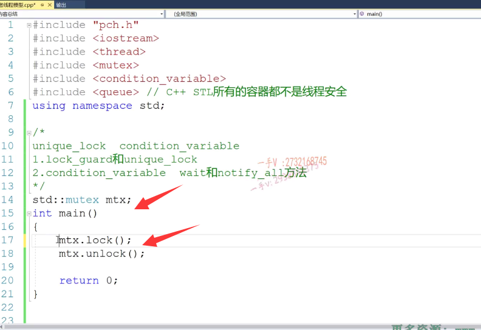

所以呢，这是我们一种使用方式啊，那么我们还有一种使用方式呢，就是使用什么？

log guard.啊lock guard。

那么，它利用的是一个智能指针的这么一个概念啊？智能指针的这么一个概念对吧啊？

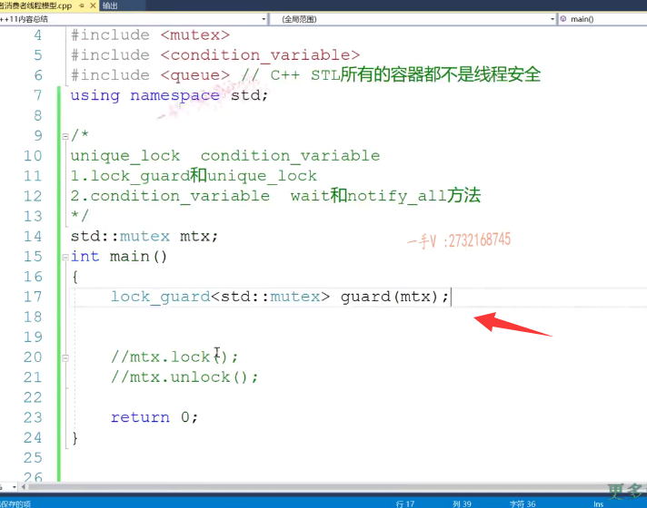

在它的构造函数里边儿，可以主动的获取这把锁，就是new text lock啊，

当这个对象出作用域，对吧？出作用域的时候，调用析构函数，

在析构函数中呢？它就可以继续调用这个互斥锁的on lock方法啊，on lock方法。

那在这儿呢，我们也能看到是吧？构造lock析构on lock，

那实现很简单啊，实现很简单。

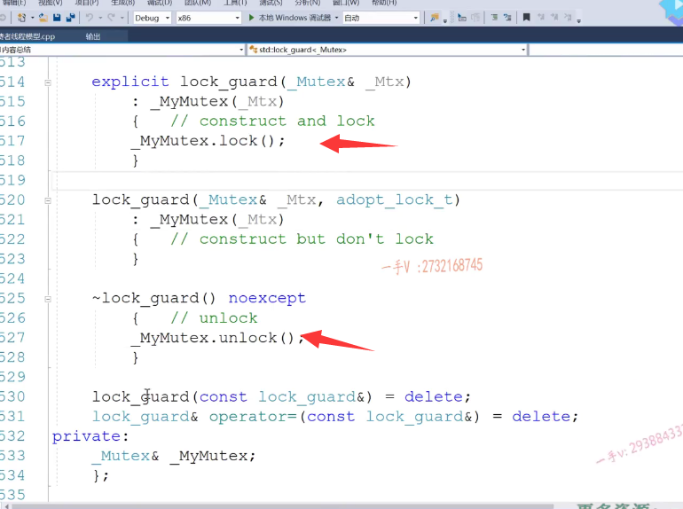

嗯，那么在这里边，它把左值引用的拷贝构造跟复值全部delete掉，

这应该是。这应该是不是拷贝构造啊？是获取一个。嗯，跟这个一样，它这里边另外一个就是。呃，可以传入这么一个，这是什么东西呢？看一下啊。它可以传入这么一个呃类型啊，可以传入这么类，匹配这么一个类型是吧？相当于提供了一个重载啊。提供了一个重载。

相当于是只是获取了对于这把锁呢，对把这把锁进行了拷贝，对吧？进行了拷贝啊。

log 2本身的这个拷贝构造跟复制是被delete掉的，是不是啊？

所以呢，这就是一个非常简单的给大家说过，这跟scope的ptr一样。

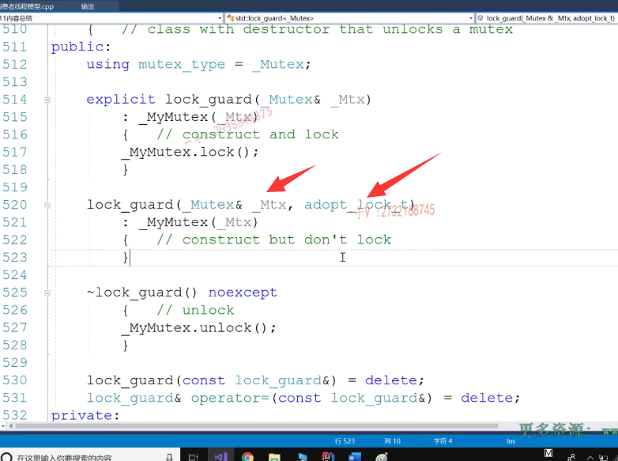

操作一模一样，也是把左支引用的拷贝构造成负值直接给。delete掉了，是不是在简单的使用场景下呢？

## lock_guard不能使用在函数参数传递和返回过程中

你可以使用这个，但是它不可能用在函数参数传递或者返回过程中

为什么呢？

因为函数参数传递或者返回过程中都要用到这个拷贝构造

是不是跟甚至赋值函数啊啊，

但是lock_guard呢？是不能够进行拷贝构造的赋值的。

对不对？你就说它只能用在啊，简单的加锁解锁的这个临界区代码段中。

啊，没问题吧啊。只能用在这个简单的。临界区代码段的互斥操作中啊。

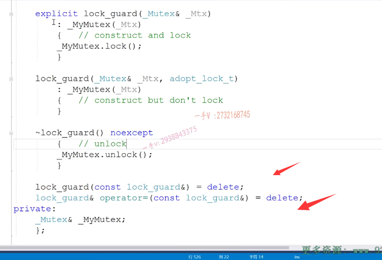

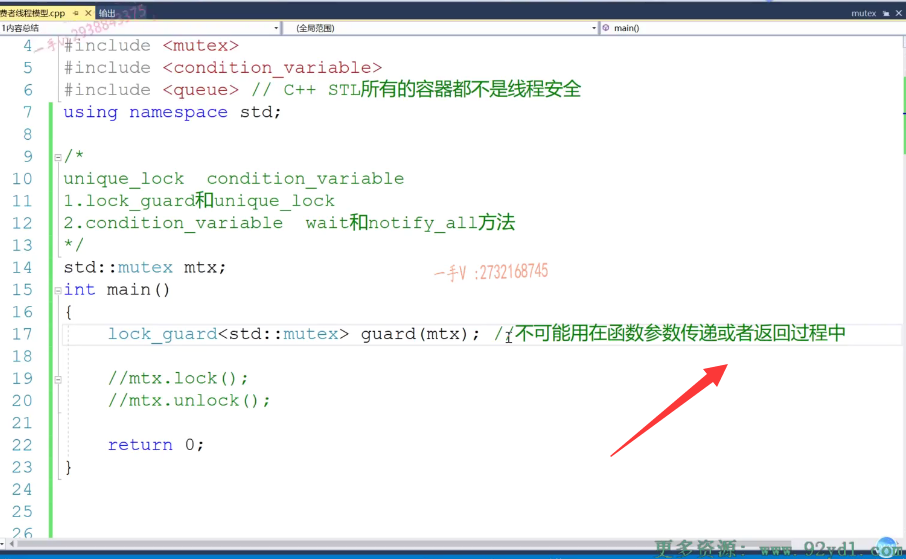

但是呢，这个unix lock呢，其实跟我们这里边呢。也比较相似，对吧？也比较相似啊，因为unit lock呢，它的方法会比较多一点啊。

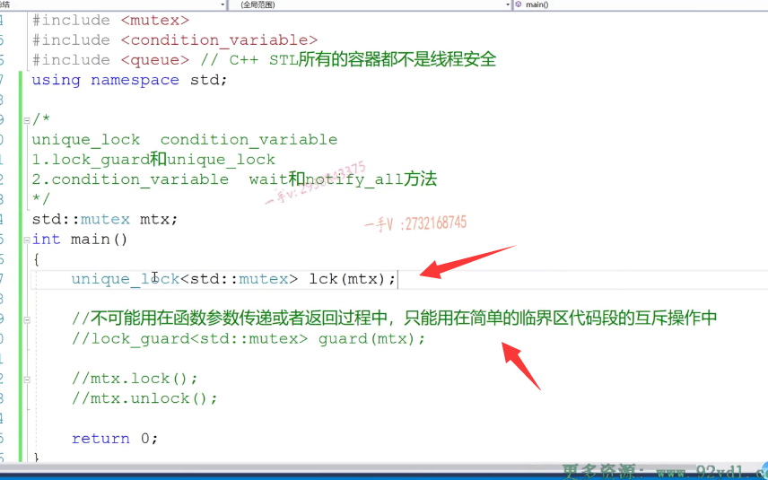

啊，它也可以获取锁啊，调用锁的这个lock方法是不是跟我们的unix ptr特别像啊？它把它的这个左值引用参数的拷贝构造跟负值也是delete掉的，

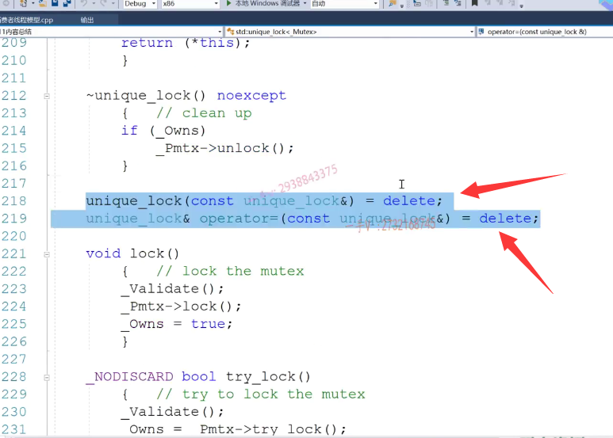

## unique_lock可以用在函数调用过程中

但是呢，它人家提供的是不是右值引用参数的拷贝构造能赋值啊，

所以也就是说什么意思呢？也就是说你这个unix lock是可以使用在函数调用过程中的啊，

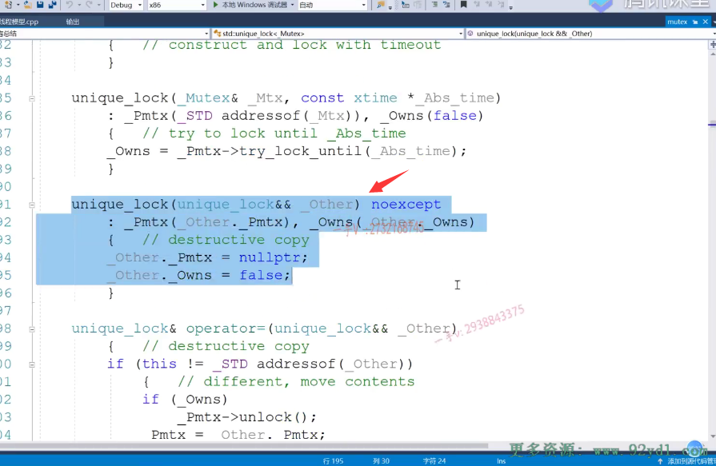

可以使用在函数调用过程中的

析构也是释放这个unlock它还提供了一对lock和unlock方法。

lock调用底层互斥所的lock unlock就是调用底层互斥所的unlock，没问题吧啊，

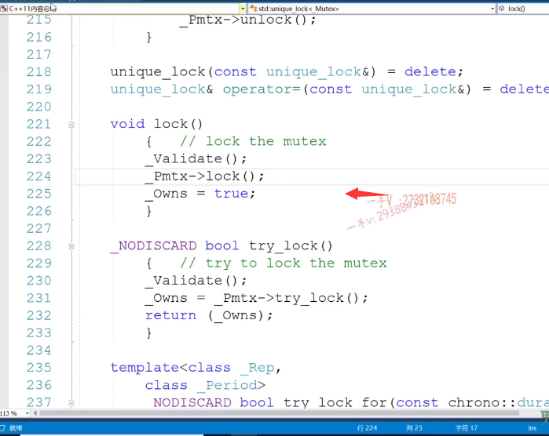

所以呢。它不仅可以。使用在。简单的临界区代码段的互斥操作中还能怎么样啊？还能用在。函数啊，调用过程中。

# 补充：gpt给出的解释，好像和右值引用没多大关系，应该是别的函数可以手动获取锁

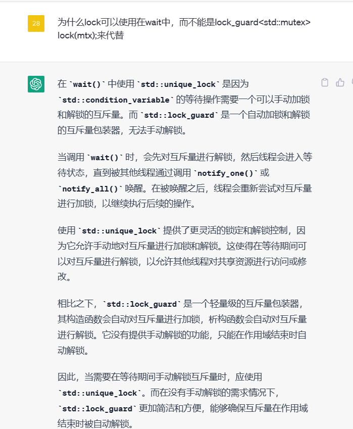

那么，这一点决定了啊，那么当我们在使用一个条件变量的时候呢？condition variable啊，

## unique_lock可以用在函数调用中，可以调用它的unlock函数

当我们在使用条件变量的时候呢，哎，我们是不是调用wait呀？那wait就是一个函数嘛，对吧？

那我们现在需要的就是一个unique lock。okay吧，这个呢，我们说了，

它会使线程两件事情，第一个是使线程进入等待状态。没问题吧，

然后第二个呢？它是不是还可以通过它持有的这个unique lock调用它的on lock方法？啊，可以把。他持有的这个mtx互斥锁给释放掉。对吧，它需要别的线程，先做事情那，所以它要把锁要释放掉，你不释放锁别的线程获取不到锁，没法做事情。没问题吧嗯，所以这是unique lock和lock guard啊，

在这里边的一个区别点好吧，希望大家通过我们这两个节课的这个讲解总结，能够搞清楚啊，它们的这个用法。

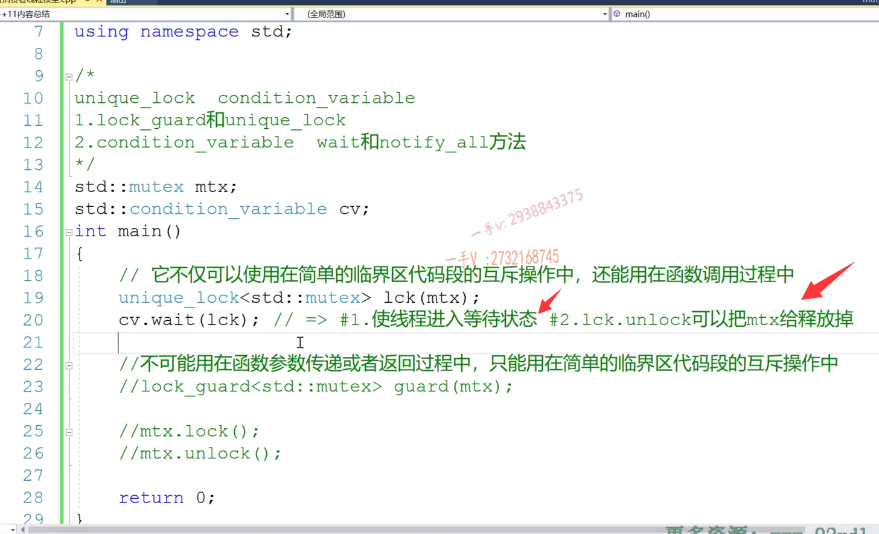

# 总结1

那也其实也就是可以说这么一句话unique lock呢，完全可以在这里边儿代替我们的log guard，

就像我们的unique ptr完全可以取代scope的ptr一样，

但如果在简单的这个方法使用中啊，简单的这个地方如果。

仅仅使用这个，我们的这个锁的这个互斥操作啊，并并没有进行线程间的同步通信，其实我们用lock_guard的。也未尝不可啊，也未尝不可。

好的吧啊。o kay,o kay.那么。

这个log 2的和unique lock呢？我们就说到这儿啊，说到这儿，

那么我们再来说一下这个condition variable的。这个wait方法我们刚说了是吧？CV点notify all这个干嘛呢？我们再来把他的这个做的事情说一下，

这个是通知在在CV上。等待的线程。啊，通知那线程这个条件成立了。

起来干活了啊，起来干活了，

那么其他在CV上等待的线程收到通知，

从等待状态啊它得先跑到阻塞状态，

它不能直接运行，为什么呀？因为你不能光通知啊，你不能说你光通知就完了。通知其他线程就能运行了no，你通知完了以后呢，

你还要把锁怎么样啊？你通知完了以后还要把锁怎么样哎？怎么把锁释放了其他线程获取锁了？获取互斥锁了。

然后其他线程继续往下。

执行好吧，一定要搞清楚他们的这个状态，转换

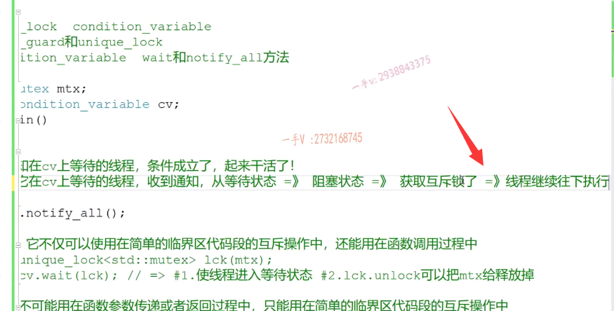

OK吧，那么这个条件变量结合我们的互斥所在，我们的这个语言级别呢，非常容易做我们的这个线程间的同步通信。

这其实呢，映射在Linux系统API的话，也就是我们p threat库的。

这就是p thread库的mutex，这个就是p thread库的condition啊。条件变量对吧？

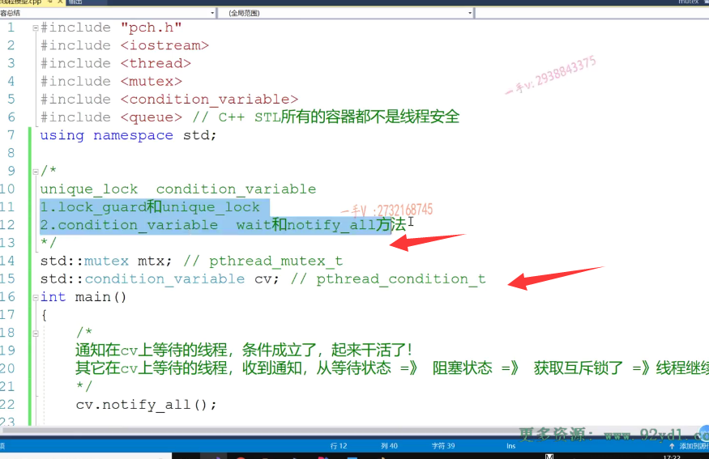

==其实用的都是我们系统API，只不过在语言层面封装了一下==，

让我们编写的代码一致性更好，可一致性更好。好吧，那么对于线程的互斥和同步通信，这里边儿呢，这几种手法，这两种手法，希望大家能够熟练掌握啊，在编写我们多线程程序的时候呢。

啊，能够更顺畅好吧，后边儿我还会更新呢，

我们相关的一些项目啊，项目集群分布式的项目，网络项目。我们肯定都会用到语言级别的这个。线程互质通不通信啊？这些东西还会用到，希望大家到时候可以留意收看啊。好，那这节课就说到这里。