## 包含atomic库，包含了很多原子类型

大家好，这节课呢，我们来给大家说一个C++11啊，在这个多线程，这个类库里边儿啊，多线程，这个类库里边儿啊，提供了另外一个非常好用的东西啊。

就是包含我们的atomic这个头文件啊，包含了很多原子类型，什么叫原子类型呢啊？我们来给大家解释一下，

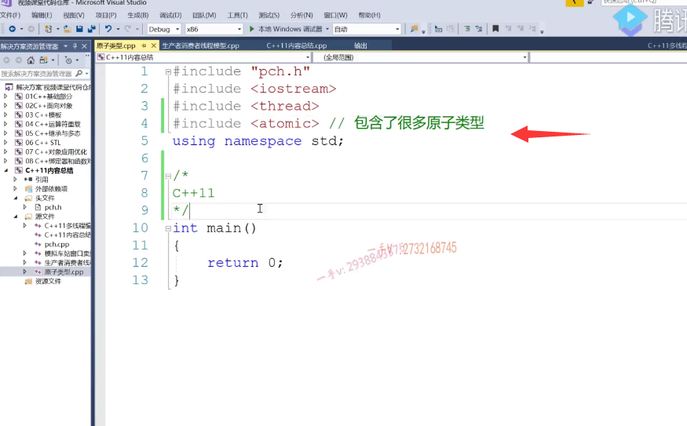

# 互斥锁是比较重的

那么大家之前。应该是。知道我们之前做的这个。呃，模拟车站窗口卖票的这么一个多线程程序，

我们给大家说过啊，用一个整形count。

对吧啊，那我们在多线程多个线程中做count的加加操作或者count的减减操作呢，

大家应该都知道啊，这种操作它不是线程安全的。对吧，就是这种两个线程，各加一次，应该在count的总值上应该加二。

但有可能只加了个一这个呢，两个线程都做减减，应该是在count原来的基础上应该减个二，但是有可能却只减个一。

所以呢，我们前边儿是怎么保证它的这个原子操作的呢？唉，我们是通过一个log guard诶。

我们是通过互斥所的时候来保证的。

啊，这是一作用域对吧？这是作用域通过互斥所来保证的，

==但是我们说啊，这个互斥是是比较重的啊，比较重的，==

如果你的这个临界区代码。做的事情稍稍复杂，稍稍复杂，而且还比较多。比较耗时间对吧啊，比较比较复杂，比较多。对不对？那我们用这个互斥锁呢？

那是没有办法对吧啊？没有办法，我们应该用，

## 不复杂的操作，应当使用CAS来保证

但是呢，像这种加加减减啊，这非常简单，我们用互斥锁呢，相当于就大炮打蚊子呢。啊，大炮打完之后用不着，

其实我们应该从系统的这个理论上来说啊，

我们应该用cas来保证啊上面就是加加减减操作的。

原子特性就足够了啊，我们一般把CS也叫做这个无锁操作啊，

无锁操作其实它并不是不加锁，只不过这个加锁解锁呢，不在我们的这个软件层面啊，软件层面。

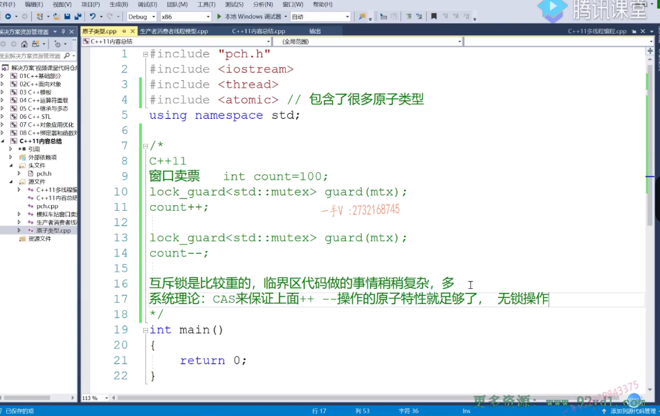

那么大家都知道CPU呢和内存之间通信都是要通过系统总线来进行的啊，

其实这个cas呢就是通过。像这个exchange。或者是这种swap的这个指令啊，

它是相当于就是给总线加锁。

当一个线程在做CPU和内存之间数据的交换，就是内存里边儿有一个数据读到CPU。

CPU进行计算，再写回内存的某一块儿，就这么一个过程啊，一个线程，如果没有做完的话呢？

它是不允许其他线程再去使用总线的啊，不允许其他线程再去使用总线，它是通过这样的方式来完成，

就是硬件上CPU必须支持就是这样的指令啊，这样的硬件上实现的这么一个加速操作，

所以我们软件层面我们可以说是无锁操作，

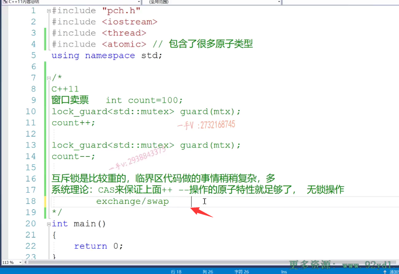

所以你像一般面经上让让你实现的这个无锁，比如说是无锁对列啊，无锁链表无所占。其实呢，并不是说是无锁，不需要线程互斥，不需要原子操作，对吧？

还是需要的啊，那实际上它的这个原子操作是通过CAS来实现。所以它就无锁数据结构，无锁队列对吧啊？那么对于这样的整形呢？

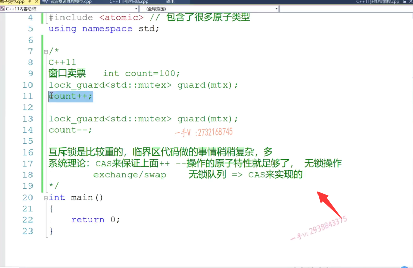

其实呢，我们啊C++11也给我们提供了atomic这个头文件，也包含了很多的原子类型，就是通CAS来保证它们的原子操作，

我们不用再通过加这么重的锁来保证呢，临界区代码段的一个互斥特性了。

有助于提高我们多线程程序的一个效率。好的吧啊，

你看atomic。你看这里边有to MM布尔atomic char。还有atomic。int对吧atomic。浪。

对不对啊？这些东西都有好不好啊？

# 举例

那我们来写一个。多线程程序给大家演示一下它的这么一个用法好吧啊，演示一下它的这么一个用法好。我们看一下啊。我们先来列举一下代码，然后给大家再解释一下。

is.is ready啊。这是一个部位值。啊布尔值，我没有定义普通的布尔是atomic布尔，对吧？对它的修改啊以及查询。

呃，现在都是通过CAS来保证的啊，

那么还有一个数值叫做atomic int。啊，就count刚开始等于零吧。

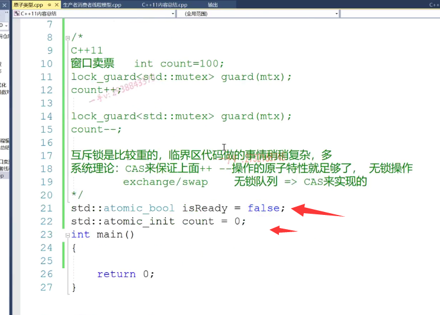

那么在这儿，我想用一个容器，那在这儿呢，定一个list啊，我定一个list。

好，那在这来，我们来继续来看。那么。在这我想定一个。

啊。t list定义成十个线程吧iti=0 I小于十。十，加加I。啊t list点push back TD。thread，然后这里边是一个我们的。handle对吧？或者叫task吧啊？一个任务okay，

然后在这里边再是for STD thread。TT list调用所有的线程的join方法。是不是？

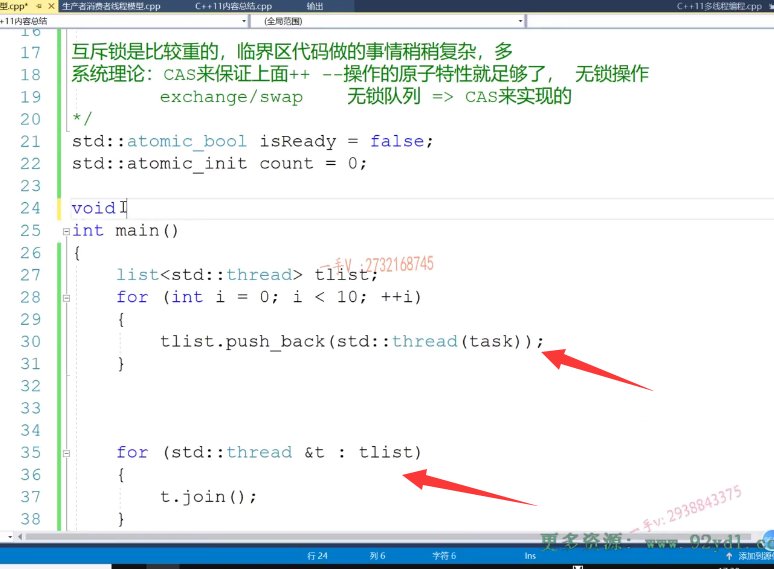

# task方法

大家来看啊，在这我写一下这个。task方法在这里边做的事情是如果说啊，如果说while。啊，你还没有准备好？

对吧，那么大家看一下啊，这里边还有这么一个yield啊，yield 

## yield函数概念：

yield什么意思呢？就是线程出让当前的CPU时间片。等待下一次调度，对吧啊？就跟我就跟我们排队一样啊，就跟我们排队一样。对不对？排队一样呃，终于到你了，但是你说是你你心比较好，你把这个。cuc pu时间片啊，你把这个买东西的机会呢，或者做业务的机会呢，又给到下一个人了啊，给到下一个人了，然后你又排到这个队后边去了，等待下一次调度好吧，

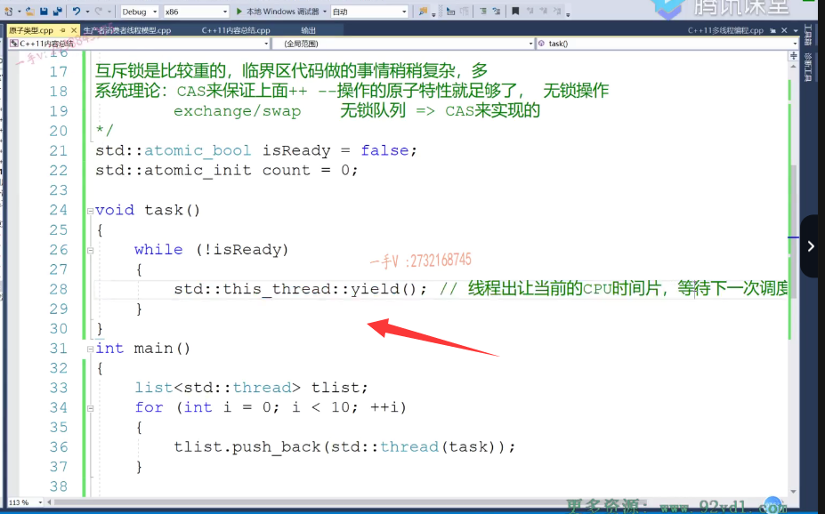

这个线程呢，也没有进入阻塞状态啊，也没有进入阻塞状态。

只不过呢，还是相当于还是一个就是就绪状态对吧？就绪状态啊，

我们呢等待这个下一次CPU时间可能就调度，

那就是说如果这个是因为这个初始化是FALSE嘛？如果没有为true的话，那所有的线程在这里边十个线程在这里边都是。循环对吧？都循环啊，都循环啊，完了以后呢？

啊，完了以后我们在这里边做一个什么样的这个？操作呢啊，我们在这儿做一个什么样的操作呢？我们。每个人。啊，都给。这个count呢？加上这个100字啊，加上100字呢，

十个线程啊，是不是就加到1000了啊？十个线程呢，应该就加到1000了。

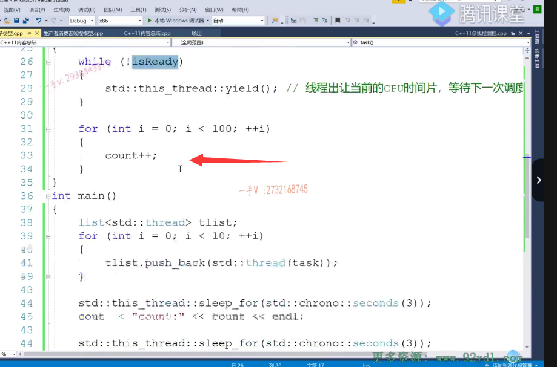

okay吧，好。那么在这儿呢，你看啊，我的主线程哎，我的主线程在这里边儿。the thread.sleep fall.我们来给它。等待一段时间啊，等待一段时间。seconds等上个三秒钟吧啊，主线程睡眠三秒钟，然后最终在这打印一下我们的这个count值。

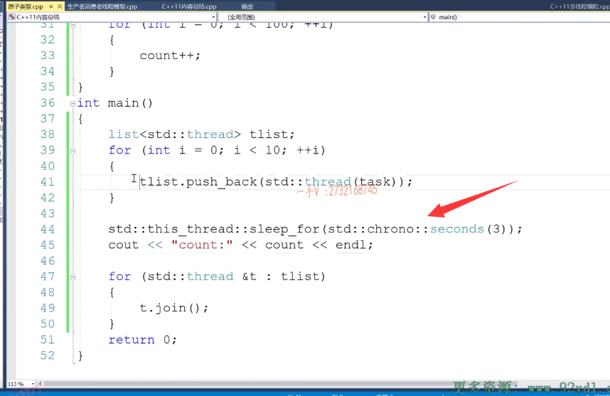

大家来看这个程序呢，逻辑应该很简单啊，

就是启动了十个线程。十个线程，

因为没有人改is ready是吧？所以十个线程都在这儿不断的业务着出让时间片啊，给别人服务，给别人做贡献，对吧？

啊，那么主线程睡眠三秒。好吧啊，主线程睡眠三秒，睡眠三秒以后呢，在这里边再把我们的这个。

## 执行3秒后，isready变为true

什么东西呀？is ready呢？制成什么？置成一个true。啊，制成一个处

以后所有线所有的子线程应该就是都怎么样了啊？都发现ready是处了不进来了，进来等这个执行是吧？等这个执行完了以后呢？

那就是所有子线程执行完了，作用完成，我们最后呢，再打印一下这个主线程，打印一下这个count值。应该是1000的是吧？

## 出现问题 是 atomic_int 不是init

嗯，运行一下。哦，这里边有点问题啊，我们看看。这是一个整形啊，这是个int，不是in it啊。

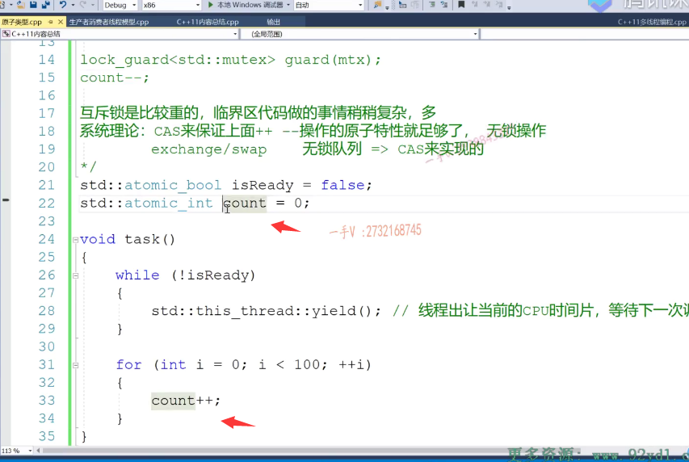

## 又出现问题，count应该是和库里面名字冲突了

呃，这个count应该是跟我们库里边的这个变量名字又冲突了啊，又冲突了，得改一改。

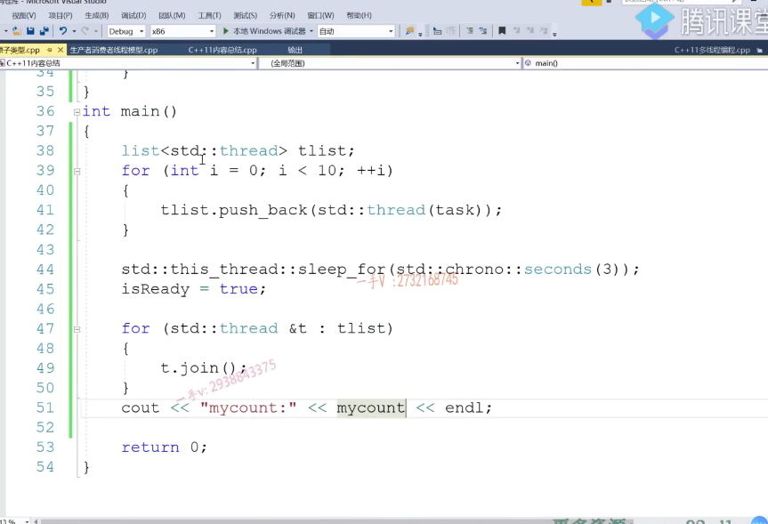

啊1000，这个应该是没有问题的。这个应该你不管怎么样运行，

都是1000是吧？都是1000啊，都是1000。好吧啊，

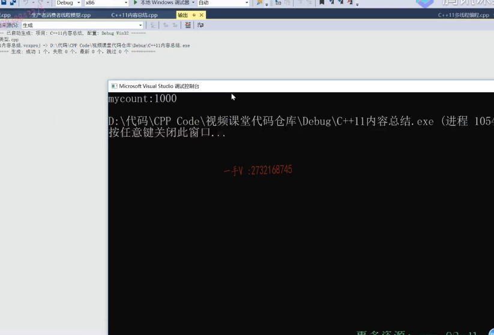

但是如果你是普通的整形的话，那就不一定是1000了，因为这本身不是一个。原子操作对吧？但是现在这个类型呢，是个atomic in的原子整形，它本身的这个加加操作呢，

就是通过这个。当然，这就是给这个类型提供的一个加加运算和重载函数嘛，对吧？

在这个里边呢，是通过CS当前系统的CS系统API呢？来实现它本身加加减减操作的这么一个原子操作的。好不好嗯？

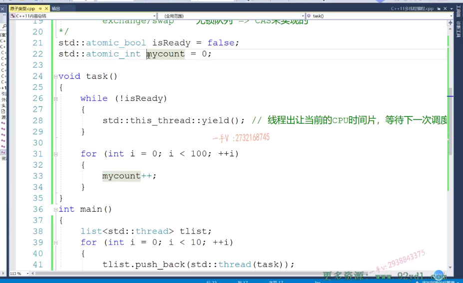

## 并不是最完美的

啊，希望大家理解一下啊，希望大家理解，

实际上呢，在这个代码中呢，还不是。就是你你你写成这个呢，它依然不是这个最完美的啊，依然不是最完美的，为啥呢？

## 因为多线程大家读自己的缓存isready,可能没有看到变成true

因为在这儿呢，你看ready，my can't啊。ready my count，

这是主线程去访问这两个变量，这是子线程访问这两个变量，其实对于这是属于我们数据段上的嘛。一个进程里边儿的线程是不同的线程，占不同的，但是都跟这个数据段都是共享的，对吧？

对于共享的变量，多线程是会进行缓存的啊。就是我这个线程呢，改成true以后呢？

其他的线程是不是能马上就看到is ready变成处了呢？

并不是。因为他读的都是自己的缓存啊。呃，大家对这个应该都有一些了解吧，

所以我们应该给他们加上一个什么东西是最好不过的啦。

## 最好加上volatile

==volatile volatile呢，就是防止多线程对共享电量进行缓存==。大家访问的都是原始内存中的这些变量的值，对吧？嗯。

但其实呢你。好了啊，那么在这个volatile大家注意一下，加上是最好的了啊，加上最好的了，防止这个就是防止多线程。

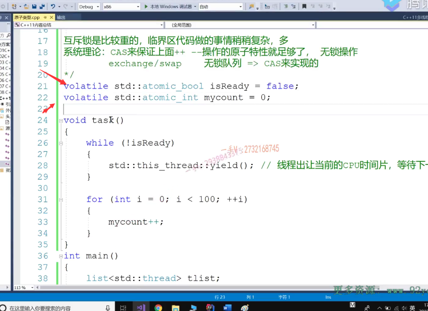

对于共享变量。进行缓存啊，进行缓存。虽然呢，就是线程缓存可以加快呢，线程运行的效率，因为线程呢，就像一个人一样，好不容易从内存上跑到CPU上，

是不是它还要不断的从内存去取东西才能做运算？那么，它好不？它好不容易占一次CPU的时间片，还要在CPU跟内存中内存之间呢，来回跑来回跑很浪费时间的，

所以呢，我们对于。呃，这个操作系统对于线程的执行来说都是会让线程来CPU执行的时候呢，把它们共享的变量都在线程。这个栈拷贝一份儿啊，统一的都带到CPU的缓存里边儿，对吧？

==那么加个volatile就是所有的线程对共享变量都不用进行缓存了。==

==啊，保证我们代码的这个正确性，==

==一个线程对共享变量的改变，另马上就能反映到另外一个线程里边儿来。好了吧，这就是原子类型啊，==

# 总结

希望大家在这里边儿理解三个东西，一个是什么是CS啊那么？什么叫无锁对吧啊，原子类型。好吧啊，像这种情况呢，我们就不需要加护士所了，太重了，效率没有这个高。

好，那我们这节课就讲到这里。