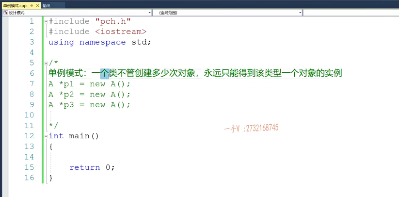
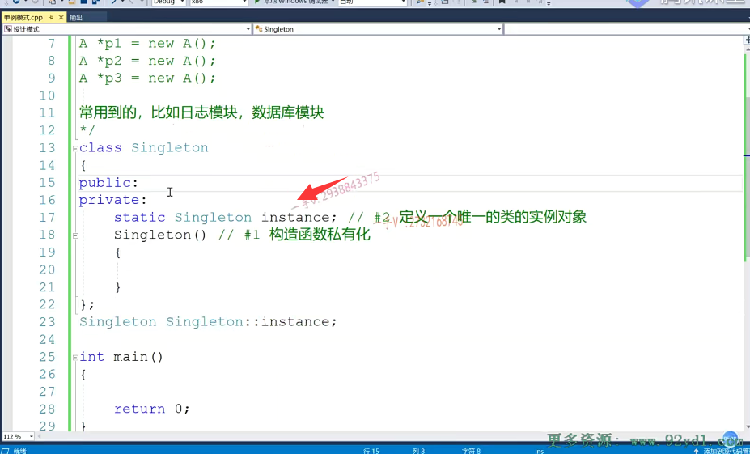
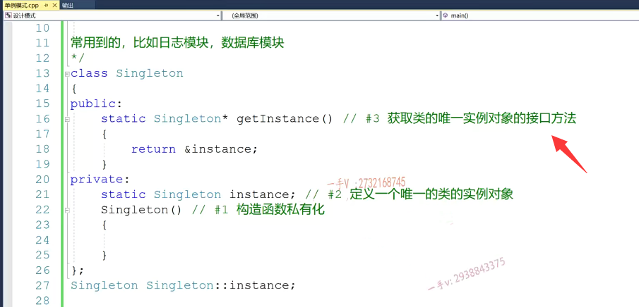
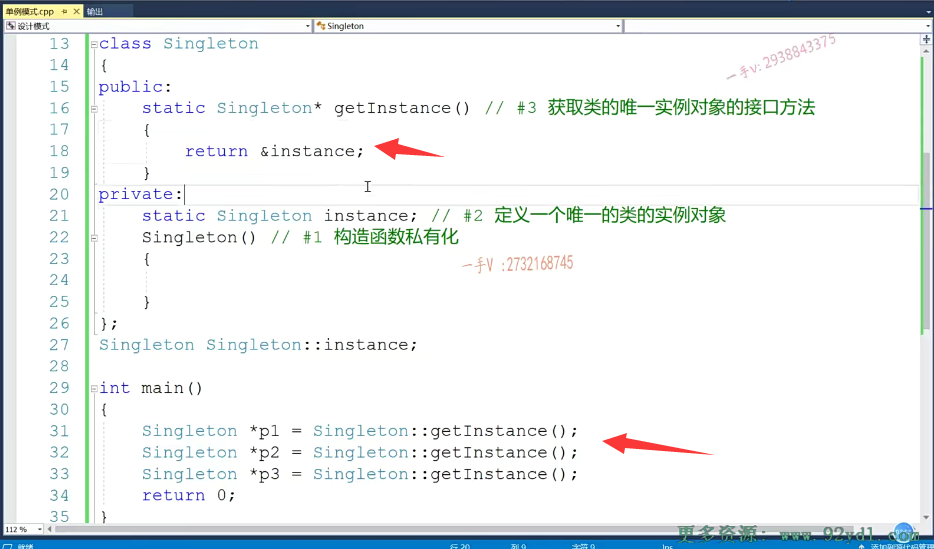
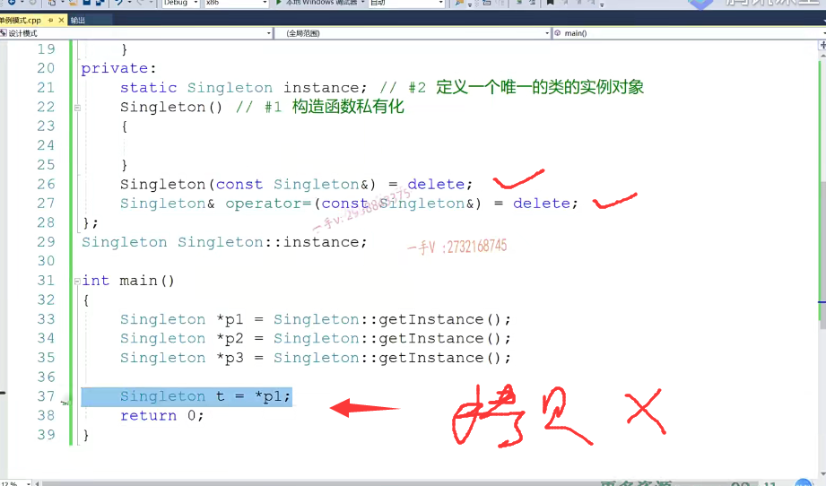
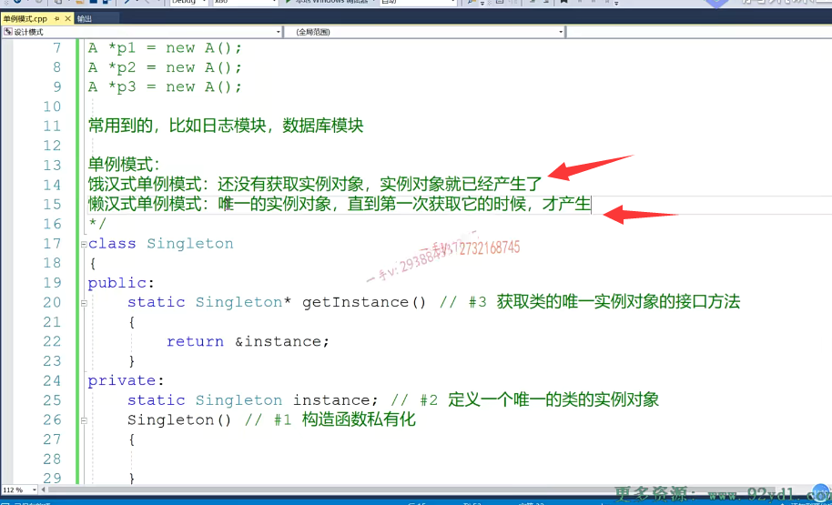
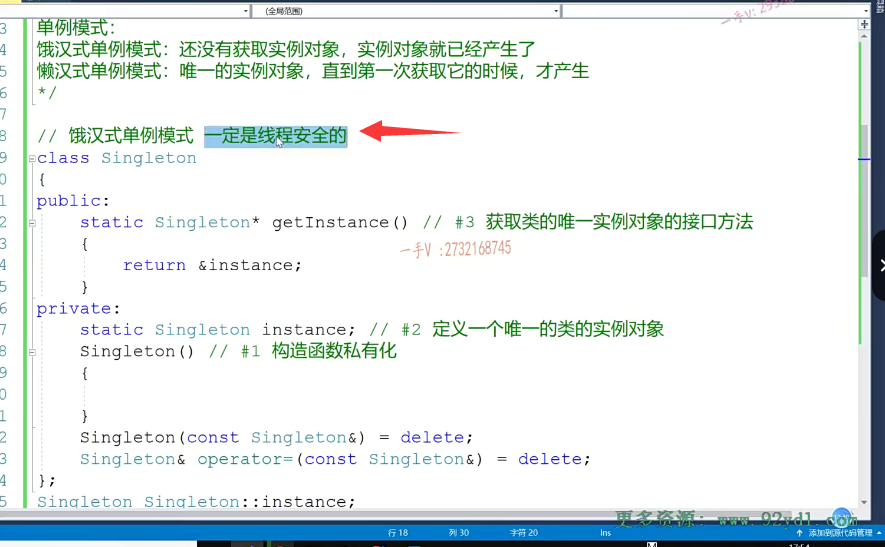
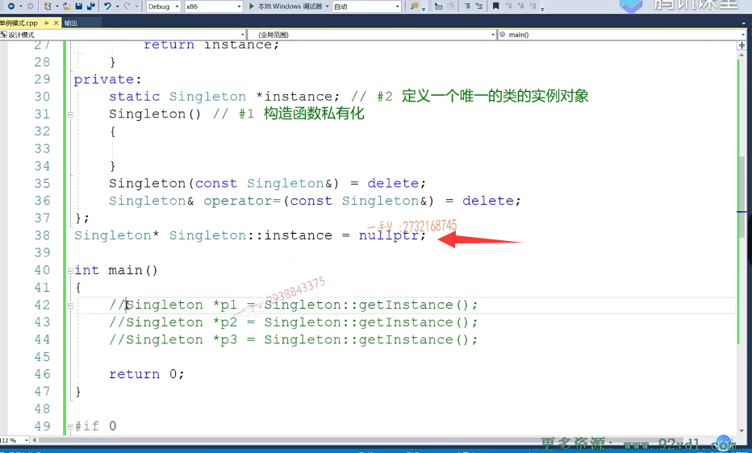
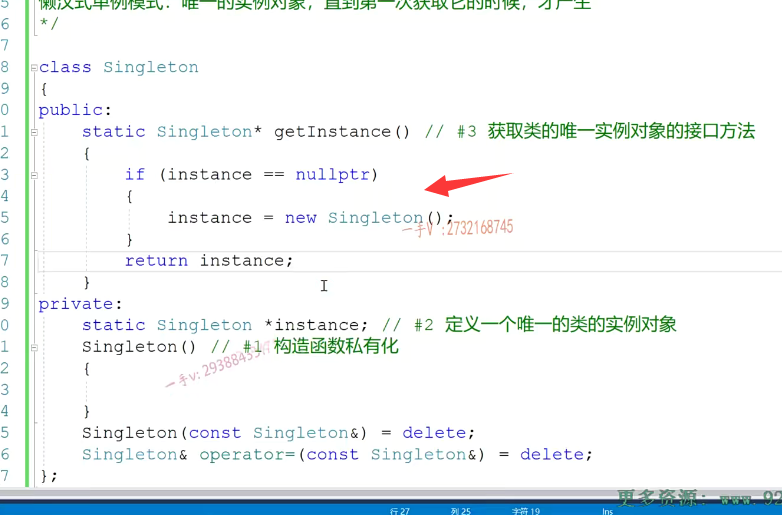
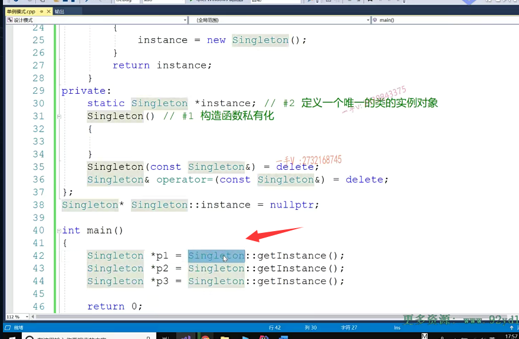

呃，大家好，那么这节课我们就主要来说一下这个单例模式啊，单例模式它是一个创建性模式，对吧？

它主要说的是对象的创建方式啊。

什么叫单例模式呢？那就是说呢，一个类啊，一个类创建对象。对吧啊，一个类不管创建多少次对象，那么永远只能得到该类型一个对象的这个实例。啊，一个类不管创建多少次对象啊，永远只能得到该类型一个对象的实例。

而大家呢，如果定一个类a啊，==我通过这样的这个new方式呢来创建对象的话啊，我通过这样new的方式来创建对象的话。对吧，那他应该是。我new三次，它就应该有三个，是不是不同的这个实例对象啊==？new四次就应该有四个，不同的是不是实例对象啊？

但是有的时候啊，我们问题场景里边儿啊，我们问题场景里边儿，我们就需要。就有这么一个限制，就是一个类，不管创建多少次对象，我们永远就只能得到该类型一个对象的实例。对吧，==常用到的，比如呢，就是我们的日志模块儿。==

我们现在用类啊，用类提供了一些方法啊，来封装了一个日志模块儿，对吧？我们软件可能软件本身呢，可能有很多的功能模块儿。对吧，那么我们==这些功能模块都要通过日志模块写一些我们软件运行的日志信息，是不到我们的磁盘上啊==？那么你们应该是不是都把这个信息呢？信息给到一个日志。模块的对象啊，==你们只管把这个信息给日志模块对象，==

那么到底怎么写这个日志的这个格式是什么？啊，日志到底往哪块儿写？对吧？日志分不分文件写？那么这个都由一个日志对象来解决这个问题。就可以了，对吧？

我们不需要这个用户自定义日志对象啊，你写到C盘，它写到D盘，它写到F盘写的乱七八糟，到处都是的，而且呢，日志的这个格式也都不一样。

我没有必要。没有必要对吧，==我们由这个同一个日志来写就行了，==而且呢，我们软件运行过程中可能写日志的地方特别特别多，不能说是我们每次写日志都要去创建一个对象，那么我们可能啊。我们的这个系统啊，它的日志对象可能就特别特别特别的多啊，甚至于已经占用了好大好大部分的这个内存。

对吧啊，日志呢，我们也不用那么急，是不是只要你最终能写进去就行，

而==我们系统呢，应该更快速的去把内存资源CPU资源包括其他的一些IO资源能尽快呢？出让出来是不是给我们客户的？请处理我们客户的请求啊==。

## 数据库模块

对啊，再比如说我们这个数据库啊模块。那么我们我们的这个应用啊，作为一个数据库my作为一个数据客户端是不是要通过这个数据库模块儿？和数据数据库服务器进行一个通信是吧？而我们这个数据库模块儿呢？也可以设计成一个单例。就是嗯，应用软件应应用软件呢，我们很多的功能模块呢，如果想需要啊，

跟my server啊，跟数据库服务器呢。进行一个通信的话，对吧？你们可以调用啊，这一个数据库模块对象的某一个方法就可以了。不需要生成那么多对象是吧？还是那句话，我们数据库的请求呢，可能在我们一些这个。这个。呃，互联网公司里边呢，可能是数据库的这个请求是特别特别多的，我不能每一次来就生成一个数据库对象，

==每次请要处理请求都生成一个数据库对象还是一样。数据库对象可能生成的太庞杂，太庞杂了OK吧==，==创建的连接也特别特别的多==，

是不是啊？那我们数据库模块像日志模块呢？==这个东西都可以采用单例模式来设计。==

## 构造函数私有化

啊，当地模式来设计。好，那我们要把一个类设计成单例，我们到底该怎么做呢啊？大家来看一下。

首先首先你要控制这个类生成的个数，你就要先控制它的构造函数对吧？

因为如果你让用户任意的访问构造函数，那么用户就可以随意的去创建对象了。你要限制对象的创建个数，首先要限制我们构造函数的这个访问方式，所以一上来要用单例设计某个类一上来就要把==当前的这个类的构造函数怎么样啊？构造函数要私有化啊？构造函数私有化==。这个是必须的。构造函数私有化，这样一来呢？我们用户呢？

在外边儿呢，就没法通过new啊啊，或者是全局啊，或者栈上啊。去定义任意定义对象了，因为构造函数无法调用私有的。是了吧啊，

### 静态成员变量需要在内外定义

那么第二步呢，我们就应该啊去定义一个唯一的实例对象了，因为用户没法去实例化一个对象了，那你得给用户提供那么一个。是不是唯一的实例化对象啊？对那这里边我们就可以提供一个static singleton啊。instance.好，

那么对于。静态成员变量，我们说了都要在内外啊，进行一个。是不是初始化啊啊？这是第二步。相当于定义一个什么。唯一的类的实例对象啊，定义一个唯一的。类的实例对象好吧，定义一个唯一的类的实例对象啊。没问题吧啊，这是第二步对不对？那么记住静态成员变量需要在内外定义，

### 第三个获取类的唯一实例对象的接口方法

那么第三步那你得。总归啊，你得定义一个接口啊啊，用户可以通过这个接口获取这个类唯一的一个实例对象，是不是？当然了，因为呢啊，用户是通过该接口啊，获取这个类型的对象的，所以这个。接口方法呢，一定得定义成静态，你要定义成普通成员方法，普通成员方法的调用是不是还得依赖对象啊？你现在没对象？

你现在是通过这个接口来获取对象的，所以它可能也是一静态方法啊，静态方法那么get instance。return.instance.那么，这是第三个。==第三个获取类的唯一实例对象的接口方法==。

好的吧，那么在这里边呢啊，在这里边呢，我们就可以这样使用了。因为。不能通过构造函数自己创建对象了啊，所以呢，在这里边儿只能通过呢类的静态方法啊类的静态方法就这个get instance。来获取这个singleton啊，这个类唯一的对象了，好吧啊，获取这个类唯一的对象。那么大家看一下。那当我去打印这三个指针的时候呢，这三个指针的这个地址呢，肯定是一模一样的啊，肯定是一模一样的。因为它是唯一的一个实例。是不是嗯？

那么。眼睛尖的同学呢，可能会发现这样的一个问题啊，就是呢，虽然你这样写呢，但是它还是可以。是不是去创建对象的呀啊？通过对象的默认是不是拷贝构造啊？所以呢，你既然想限制啊对象的生成方式，所以不仅仅要限制什么。不仅仅是不是要限制这个构造啊，连我们的什么构造啊？

啊，==连我们的这个拷贝构造==。拷贝构造。跟什么？==跟这个赋值重载==。我们都要给它怎么样啊？都要给它去掉啊。是的吧啊，我们都要给它去掉啊，去掉好。那我们再来看你还能不能做，我们刚才想做的这个事情呢。那这里边是不是就不能做啦诶？你就不能通过拷贝构造函数来生成对象了，

对吧啊好？这就是我们现在就给出了一个。就是。单例类啊，你只能通过这种方式呢，获取这个类唯一的对象啊，唯一的对象。嗯，再没有其他方式呢，来产生第二个这个类型的实例对象。好的吧啊。

那么注意，这是一个我们非常简单的啊，非常简单的把一个类设计成这个单类类的方式，==就第一个，先是构造函数私有化，第二个定义一个唯一的类的实例对象。第三个就是定一个接口，那用户可以通过访问这个接口呢？获取这个对象的是不是唯一的实例呀==？

唉，那么大家注意在实际的考察中呢，这个单例模式啊，还有这么几个叫法。叫做饿汉式单立模式啊，叫懒汉式。单例模式。

没问题吧啊，那什么叫饿汉式呢？饿汉式就是啊。就是还没有使用，还没有获取实例对象。实例对象就已经这个产生了啊，

什么叫懒汉式单例模式呢？就是啊，唯一的实例对象。直到第一次获取它的时候才产生。或者才创建才初始化，对吧？

那么大家来看啊呃，这现在是一个静态的，

我们这唯一的实例对象定的是一个静态的。静态的是不是成员变量啊？这个应该在我们内存的就是进程内存的是不是数据段上啊？数据段没问题吧？数据段。进这个数据段的这个内存啊，创建是不是啊？==初始化那这个一定是在我们函数之前的==，也就是说呢，我们现在写的这个单例呢，是一个什么样的单例啊？==是一个饿汉式的单例啊。恶汉式的单例==对吧啊，他就很快就创建了，还没有等我。

我就是。不调用接口啊，我就是不调用接口啊，那么这个。呃，实例对象对吧？实例对象啊，是在我们啊，不好意思啊，那么，在这个对象呢？是我们数据段的是不是嗯？我们还没有，我们没有调用这个接口呢啊。这个对象他就已经生成过内存实例化过啊，因为它是相当于就是落在了类作用域里边儿的一个全局变量嘛，对吧啊？

恶汉时，他一定是线程安全的嘛。一定是线程安全的，对吧？哎，因为我们多线程执行，你是不是先要执行函数啊？对吧我们？线程函数启动，我们才说是这个线程开始执行了，那么静态的这个成员变量在数据段，数据段是整个。程序一启动啊，所有函数呢？在我们main函数之前都已经创建好初始化好的了，是不是所以？它是不是现场安全的，根本就不用考虑，肯定是线程安全的。

### 饿汉式的缺点：

但是呢，饿汉式有时候不好，为什么？因为。他把对象的这个实例化，对吧？对象的实例化还有可能调用构造呢？实际的项目中，这个构造函数可能会做很多很多的事情，对吧？包括可能加载我们什么配置信息呀？读文读磁盘文件啊。==访问数据库啊，是不是啊？那么这些东西呢？应该是放在我们第一次需要访问这个实例对象的时候==，你才去创建这个类的实例对象。

对吧，==万一我们整个儿这个业务执行过程中根本就没有试图获取过该类型唯一的对象，那你初始化这个费老半天劲，初始化这个对象岂不是白费时间了嘛==。

对了吧。而且呢。你想我们整个软件启动过程中，那么我们数据段要进行内存创建，初始化构造，函数调用。构造函数又要做很多事情，这无形中呢，你太多这样的单例类，这样的恶汉式，

这个狼呃恶汉式，这个单例。对吧==，单例对象。你在软件启动过程中初始化，你肯定势必会让我们软件的启动过程会时间加长==。对了吧啊，试想一下，我们在使用一个软件或者玩儿一个游戏，等我们双击它的时候呢，突然发现五分钟十分钟才启动，那么这个软件呢？那肯定是。我们使用一次，

我们就会使用第二次了，是不是啊？所以我们在设计的时候呢啊，设计的都要考虑到这些问题，都要考虑到这些问题，所以呢，我们可能更受欢迎的，更受欢迎的。可能是我们的这个懒汉式单立模式，对吧？我们把这个呢给它。屏蔽掉啊，

## 懒汉式

我们再来写我们第二个啊，第二个那么要写一个懒汉式的单例模式呢，其实也是非常简单的啊，

其实也是非常简单的。也是非常简单的。那么。我们很容易呢，就上手了，把它定义成指针。那么在类外呢？初始化的时候把这个指针呢？初始化成什么呀？初始化成空对吧啊？初始化成空那么在修改这个get instance的时候呢？就判断一下if。如果这个instance呢？为什么为空？那么呢，

就要给这个instance呢？去怎么样啊？new一个什么呀？你有一个是不是该类的唯一一个实例对象啊？如果instance不为空，就直接返回该类的唯一的实例对象。

啊，大家来看一看，这是个懒汉，还是一个恶汉单立模式呢？那么，当我们程序启动的过程中，在数据段上就只有一个指针，就跟个整形变量一样，只有一个指针，

是不是啊？只有指针，没有任何对象的创建啊？当我们第一次调用这个get instance。想访问我们这个类型，唯一的实例对象的时候呢，在这里边get get instance，这个方法进来instance呢，指针为不为空？为空吗？肯定是为空的嘛，我们初始化是空的，对吧？所以他第一次进来才去new这个对象。第二次进来的时候get instance的时候呢，哎if instance为空吗？不为空了，所以他就返回了已经。第一次创建过的那个唯一的实力对象。

大家来想一想，==这就是我们所谓的这个懒汉式单例模式了，就是把对象的实例化。啊，延迟到我们第一次获取该实例对象的时候，这个对象才构造才初始化==.

好吧嗯，大家想一想啊。好，这个达到我们的目的了啊，

那我们再来考虑一下这个懒汉式单类模式是不是线程安全的呢？是不是线程安全呢？那这个类设计的这个get instance函数呢啊？get instance函数呢？是不是可重入函数呢啊？是不是可重入函数呢？对吧啊，请大家思考一下这个问题啊，我们下节课呢，给大家揭晓答案。