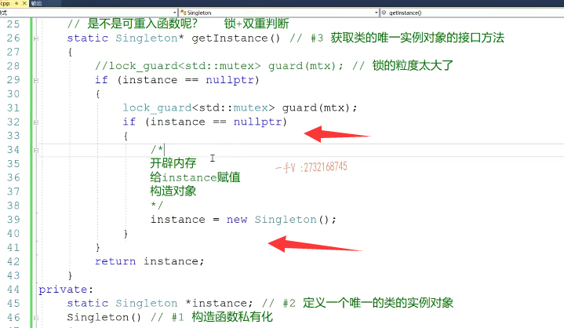
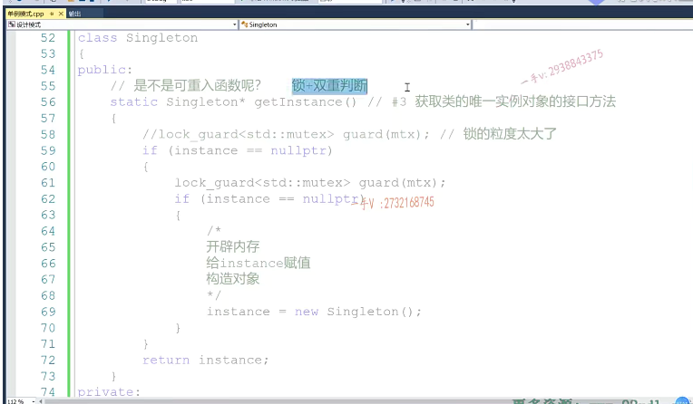

好，那我们来继续讲解这个懒汉单例模式的线程安全特性啊，那我们上节课最后讲到问这个函数是不是可重入函数啊，

## 可重入函数的定义

其实一个函数是不是可重入函数，可重入什么意思呢？

就是说。这个函数啊，还没执行完，能不能再被调用一次？对吧，在我们==单线程环境下来说，一个函数不可能说是在没有执行完，又被调了一次==，对不对啊？

如果可以的话，如果是这样的话，也是我们所谓的递归是吧？

那我们现在不考，我们就考虑这个啊，只有一个函数，==只有在多线程环境下。对吧，那就这个线程线程一还没运行完呢，线程二又来运行这个函数了，是不是如果说这个函数可以直接在多线程环境下运行，而且不会发生静态条件，那么这个函数就是一个可重入，可被多个线程不断重复的调用的函数。==

## 静态条件科普

嗯，那如果说这个函数呢？

它在多线程环境下运行呢，会发生静态条件，对吧？会发生静态条件啊，那我们这个函数呢？就不是可重入的函数，就要考虑线程安全的问题了啊，

## 这个函数不是可重入的

很明显在这里边，我们这个函数是有问题的。为什么有问题呢？大家首先要搞清楚啊，大家要搞清楚这一步。这不有三点事情。这不有三件事情啊，

## 三件事情

首先肯定是。

开辟内存对吧？开辟内存，然后是构造什么构造对象，然后是给。instance赋值。okay吧，我按正常来说呢，就是这个样子。对不对啊？正常来说就是这个样子，

## 2个线程，可能会进来2次，所以不是线程安全的

那么大家应该前面给大家讲过CA加多线程啊，应该对于线程的一些基本的内容应该都是知道的啊。

那假如说线程一第一次定get instance进来了，instance肯定是为一个空的，对吧？

肯定是为一个空的啊，肯定是为一个空的。那么进来了以后，假如说这个县城呢？假如说啊，假如说这个县城。开辟内存构造对象了，构造对象了，对吧？当然还没有给instance赋值。那么，现在这个线程的时间片到了，该下一个线程进来了，下一个线程因为刚才那线程没有给instance赋值啊。对不对？

没有给instance赋值啊，所以呢，instance依然还是空，所以第二个线程也进来了。对了吧啊，所以这个单例模式从逻辑上来说就是不能够直接在多线程环境下运行的。我们这个if instance等于空instance去实例化一个对象，这里边儿必须是一个单例的对象，不可能进来两次的。好的吧啊，不可能进来两次。对不对？所以呢，我们说这是不是线程安全？这个不是这个不是线程安全。这会进来两次没问题

## 赋值和构造可能顺序会被调换

那么大家应该还要明白一个问题，就是我们。这个编译器会对我们高级源代码c跟CA加这种高级语言写的源代码的指令会进行那个顺序导换的啊，它为了加速呢。

我们代码的执行。开辟内存肯定是在前，但是构造对象跟给instance赋值这两个操作完全是没有关系，完全没有关系的，这个指令逻辑呢，完全有可能在。真真正正翻译成汇编指令的时候呢，顺序就倒换了

## 另一种静态条件

## 返回未经构造的对象

那么还存在的这个静态条件就有可能是这个样子。

什么样子呢？就是第线程一进来了，线程一给这个对象开辟完内存，给instance赋值了。英特尔赋值了，但是现在还没构造呢，线长，而且呢，发现instance是不为空，它直接返回了，返回了一个什么，返回了一个，还经未经构造的对象。对吧，那现在访问那个对象，

那就有问题了。是不是啊？所以无论从哪个角度来说呢？这个函数都不是可重入函数啊，不是可重入函数，

# 加锁

那怎么办呢？那我们就要做线程的互斥还是通信啊？肯定要做线程的，互斥了，这相当于是一个临界区代码段，临界区代码段一定要保证它的原子操作，对吧那？那我们就要包含什么东西啦？啊mutex是吧我们？在这儿来看一看啊。

我们给它定一个全局的。mtx.用一下log guard。得用一把锁来保证线程间的安全，是不是啊？多线程执行的这个安全。那那么在这儿呢？大家看一下啊，这儿是加锁完了以后解锁。这肯定是没有问题的，这肯定没有问题的。啊，这肯定没有问题。让大家看看。嗯，

## 没有考虑单线程，锁的粒度太大了

但是这个不妥，为什么不妥呢？你这又考虑了多线程，没有考虑单线程，那你看单线程啊，不断调用该的instance，每次进来都要干嘛呀？加速解，所以你在你说在单线长环境下，我有没有必要频繁的进行加速解锁啊？根本没有必要啊，是不是所以这个锁的力度啊？怎么样啊？锁的力度。是不是太大了啊？

是不力度太大了？导致我这个单线程环境下也要不断的加速解锁。所以呢，我们这个啊，锁的力度，锁的范围缩小一些啊。

okay吧。那也就是说，在这儿怎么样加锁？除了这个f怎么样解锁是吧？嗯OK。这样就好，单线程下呢，只有第一次生成对象的时候加速。

啊，后边儿再通过get instance获取对象实例的时候呢，就不用进f那就不用加锁解锁了是不是？

## 多线程环境下仍然存在问题

在多线程环境下，我们看这个正不正确？假如说线程一先进来。开辟内存还没有给instance赋值那么线程二也进来了，

由于instance还没有被赋值，所以线程二也进来，线程二也进入if语句了，对吧？线程二呢，尤其获取不到这款互斥锁，所以线程二阻塞了。

当线程一在这里边儿是开辟完内存构造完对象，给instance赋值以后，出这个括号儿释放锁。

那么，线程二也获取这把锁进来，又要去new一个对象。

==很明显，这个还是存在什么？还是存在这一个线程安全问题的==，

## 需要加双重判断

所以这就是我们前边应该给大家说过了。所加几重判断啊，双重判断你要把所挪到里边儿，一定要再加一重判断instance。等于空的时候啊。

因为你把锁加里边了，就有可能多个线程呢，

都跑到里边来了。对不对啊？都跑到里边来了，那么里边这个实例化对象呢？它可不能进行两次，对吧？它可不能进行两次，你现在就无所谓了，刚才那个线程二进来线程二获取锁的后呢？

但是由于线程一已经做完了instance，也赋过值了，对吧啊？那instance线程二在获取这把它，其就是获取这把锁。==他一看，哦instance已经不为空了，他就不会进来再去实例化一个新的对象了，这叫所加双重的判断。==

好的吧啊，这才是一个最合适的啊，最合适的线程安全懒汉式单立模式啊，现场安全的懒汉式单立模式。

## cpu会拷贝一份共享内存到自己的线程缓存中

但其实呢，就还是我们前面给大家讲过的啊，因为instance这是一个指针，是在数据端，对吧？是属于我们同一个进程，多个线程共享的内存，那么大家知道呢？==CPU在执行线程指令的时候，为了加快呀，指令的这个执行啊，会让线程呢，把它们共享的这个内存呢都。共享内存的值都拷贝一份带到自己的。线程缓存里边是不是放到CPU的缓存里边啊？==

## 需要加volatile关键字

所以对这个instance我们最重要的还是要加一个。这么一个。什么东西啊，

这么一个关键字。没问题吧，==这关键字儿给指针假不是给指针指向加==啊，这个好处是什么好处？

## volatile好处

就是当第一个线程，当某一个线程给这个instance赋值的时候，其他的线程呢，马上就能看到instance改变了。因为线程现在已经不对这个共享变量进行缓存了啊，大家看的都是原始，都是它内存里边儿。内存里边的值。okay吧啊。好，那这就是一个我们非常不错的啊，

非常不错的。线程安全的懒汉单理模式，懒汉代理模式。okay了吧。

## 另一种线程安全的懒汉单例模式，不用互斥锁

嗯，希望大家把这这个把这个说的这个好好。想一想啊，好好想一想，单例模式呢？呃，记得曾经有一个面，大家有给我反馈的一个面经上啊，有一个单例模式，一面面了四五十分钟啊。你这个单例模式虽然说是非常简单的一个设计模式，

但是它跟多线程结合啊，会有很多可以有很多考察的这个内容啊，包括懒汉单例模式，恶汉单例模式。对不对啊？懒汉恶汉单立模式，还有加上现场安全的这么一个考虑。好，实际上呢，这种懒汉单立模式，这是一种啊，我们可以再给大家再输出一种。懒汉单立模式啊，也是。线程安全的啊，

也是线程安全的。而且呢，我们还不用互斥锁啊。好，我们来看一看到底是什么样子的啊？

修改修改，这也不要啦啊。

那我们这个实例对象定义到哪里呢？我们的实例对象就在这里。大家看啊。我现在把这个实例呢写成一个静态的，是不是函数函数静态的这个局部变量了？对吧啊？这运行起来，我们看一看啊。

啊，这是返回指针，所以在这呢，我们也。返回一下它的这个地址。可以吧啊。那刚才这个代码呢？可能写的就没有运行，这应该返回的是。啊啊，刚才这个instance本身就是指针对吧，没有问题，现在呢，我们instance成一个对象了啊，所以要否取它的地址？

好，那么大家来看啊。

## 局部的静态变量

这是一个静态的函数，静态的局部变量，它的内存呢？我们程序一开始程序运行阶段，启动阶段呢？它的内存就已经有了它的内存在数据端上。对吧，但是大家知道啊，静态的这个对象啊，第一次初始化是什么时候呢？就是第一次运行到它的时候才进行了初始化。

## 静态局部变量科普

## 也是懒汉式单例模式

OK吧，第一次运行到它的时候才进行了初始化，

所以呢，当我们软件运行的时候呢啊，我们如果没有调用get instance函数，那么这个对象是不会去构造的。这个对象不会去构造啊，不会去构造，不会去调用构造函数，做构造函数里边。可能书写了很多的初始化动作。好吧，==那这个实例呢？相当于也是我们第一次调用get instance的时候，是不是才产生才初始化的，所以它也是一个懒汉式单例模式，==

## 分析是否是线程安全的

那它是不是现场安全的呢？那有没有可能发生这样的问题就是。第一次定get线程一定get instance的时候，这个对象要初始化，那么这个初始化会定构造函数，构造函数可能有很多代码。啊，这里边可能有。很多初始化的代码对不对？这里边有很多初始化代码啊，那么当这个对象还没构造完，也就是说构造函数只执行了一部分代码，有没有可能现在线程二又调用这个函数？函数，哎。

那么，线圈发现这个对象没有构造完，他又去初始化，又去构造了。有没有可能发生这样的事情啊？因为大家知道本身呢，函数的静态的局部变量应该只初始化一次的，对吧？但是在单线程环境下呢？那因为它是。串行调用的嘛okay吧，它不可能存在两个线程，是不是这个函数同时是被调用两次啊嗯？那么，在多线程环境下，

就有可能两个线程呢？同时调用它了，对不对啊？

## linux下gdb调试

其实呢，这个东西呢？哎，这个东西呢？大家也可以看一下我的博客啊，我的博客上其实也给大家说了。这个东西你可以在这个linux下啊，用stress跟踪一下它的这个可执行文件啊，然后呢呃，这个不用不是用stress了，这个你编译的时候呢？啊编编译的时候。

就是比如说是呃杠o啊杠o，这个可执行文件呢？叫run是吧？这个叫单例模式。点cpp完了，加个杠g啊，用g db调试一下我们的这个run啊，系统调试一下这个run用dissemble。来获取一下呢，这一块儿这个代码所生成的汇编指令啊，所生成的汇编指令，

## 静态函数静态局部变量的初始化，自动加上了线程互斥

你会发现呢，对于这个静态函数，==静态的局部变量的初始化函数静态局部变量的初始化在汇编指令上已经自动添加线程互斥指令了。也就是加锁跟解锁的过程啊==，大家呢，可以登一下我的这个。登一下我的这个博客啊，大家可以登一下我的这个博客啊。登一下我的这个博客。就是我的在这里边儿。呃。看啊，这个不是不是这个不是这个，

是我们的设计模式啊，是设计模式设计模式单例模式。啊，单例模式。来看最后的这个问题啊。最后的这个问题啊，这我我这已经给大家列了，对吧？这有一个获取所对于静态函数进来的get instant进进来的这个。呃，函数的静态局部变量对于它的初始化，由于加速解锁的过程。好吧，所以呢，这个静态局部变量。

就对象对吧？现在在这里边儿是对象啊，它的初始化本身就是一个线程互斥的动作，所以我们不用。担心它有线程安全的问题，好不好啊？我们不用担心它有线程安全的问题OK吧？啊那。对于这个来说，应该是一个非常精简的。线程安全的。懒汉单立模式啊，线程安全的懒汉单立模式。

这里边呢，我的博客的这个。

主页呢啊，应该就是这个了。对吧哦，我的博博客的主页就是这个大家呢。可以看一下啊，大家可以看一下我对单例模式，这里边的一个。博文的一个讲解，尤其是这个啊，如果你对这个呢不太熟悉的话，你可以以前之前没看过，可以看一下。我的这个指令的操作啊，查看一下它的指令，看一个这个函数静态的局部对象呢，

是不是线程安全的啊？好，那么单例模式呢？我们就讲到这里啊，单例模式我们就讲到这里，

## 总结 懒汉 饿汉

那么单例模式这里边主要搞清楚呢？==我们饿汉的，懒汉的。==

以及==因为恶汉呢，不用考虑线程安全==，==因为那是在我们程序启动的时候，我们对象都已经开辟内存构造过了==，对吧？懒汉，

当你模式是把实对象实例的，这个产生啊延迟到啊。第一次调用get instance获取实例的接口的时候。

## 懒汉单例模式 用的时候才生成对象

啊，那么懒汉单立模式就要考虑一个线程安全问题了，==是不是因为它用的时候才生成对象啊==？生成对象它绝对不是一个原子操作，它包含很多指令。所以我们就要考虑它的这个线程安全问题，我们可能要。如果你这样写，叫引入忽视锁对吧？还要引入锁加双重判断，既考虑了单线程的这个效率问题，

又考虑了多线程的线程安全问题。或者我们来这么一个简单实用的啊，简单实用的这个线程安全的懒汉单理模式。好吧，行，那么单例模式我们就讲到这里。

