好，我们这节课呢，给大家来主要讲一下我们的。第二个，我们要说的创建型模式啊，就是工厂模式，那么工厂在这里边分为了这个简单工程啊，简单工程也就是simple。simple factory啊，还有这个。工厂方法，还有就是factory method还有什么呀？还有抽象工程啊，还有抽象工程就是abstract factory。啊abstract factory。

好了吧啊，简单工厂工厂方法。和抽象工程啊，和抽象工程。好吧啊，

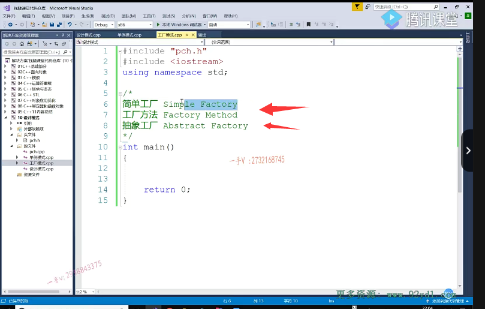

## 简单工厂不包含在我们这标准设计模式

那么其实呢，这个简单工程啊，这个简单工程其实并不包含在我们的这个标准的设计模式里边啊，

## 工厂方法和抽象工厂是包含的

其实呢，工厂方法跟抽象工厂呢啊，是包含在啊，是包含在我们的这个。标准的这个OP 23种设计模式里边的啊。好，

那我们来一起讲一下，看它们之间有什么区别啊？有什么区别？主要是对比它们之间的区别，如果它们之间没有区别的话，那我们要一种一一种工厂就可以了，是不是？啊，正是因为它们之间有区别，所以才分为了三种啊，才分为了三种。

## 工厂模式：主要是封装了对象的创建

好，首先呢，我们为什么要工厂对吧啊？为什么要工厂？

模式那工厂模式主要啊，主要是封装了。对象的创建就是我们需要呢那呃呃，这个相当于是废话了，创建型模式本来就是体现的是对于对象的是不是？产生的一个封装隐藏啊嗯，那么。工厂模式这个封装了对象的，是不是创建了啊？不封装怎么样？不封装我们就是扭来扭去的对不对？但是当我们的项目里边啊，我们的这个类名比较多的时候，需要实例化类名比较多的时候啊。我们可能在new对象的时候，

就要需要记住很多很多啊，很多很多比较庞杂的。我们类的名称是不是？而且呢，当这个类需要改变的时候呢，我们调用的地方是不是也要改来改去的呀？比如说这类名更改的时候。对的吧啊，我们要改来改去的，那我我们也有了一种工厂的这么一种思想啊啊，你比如说呢，我们去买车，车也是从工厂产生的。啊，我们不管是。

想要买什么东西，对吧啊？车的附件，包括手机，包括电脑，它都是从工厂产生的，我们向工厂申请，我需要一个什么样的对象啊？工厂给我返回相应的对象。啊，这比较符合我们就是实际的啊，面向对象处理的这么一个思维是吧啊？

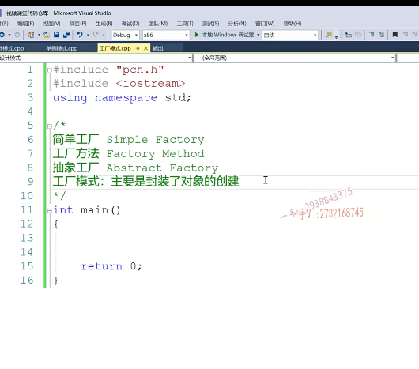

## 汽车作为例子

那么，我们来看一看啊，当然。

一般工厂模式呢，我们说了，前提是当我们当前呢，需要创建的这个类比较多的时候，对不对啊？创建类比较多的时候，如果我们的。这个项目中呢，可能总共设计的类就那么几个，那可能我们也不需要啊，去用工厂模式啊，去设计我们的软件了，是不是？啊，好了，

我们来看一下啊，我们来看一下我们呢，在这里边儿呢，就拿一个我们的这个。啊，汽车啊，汽车来做一个这个例子吧啊，来做一个例子好。

## 基类Car

我先写了一个car啊，我先写了1 car。每一块都有个名称，我想用一下string，所以我包含了一下string类型啊。string name.okay吧，

这里边是我们的。string name.在构造函数的初始化列表里边呢，对它进行了一个。初始化了吧啊，

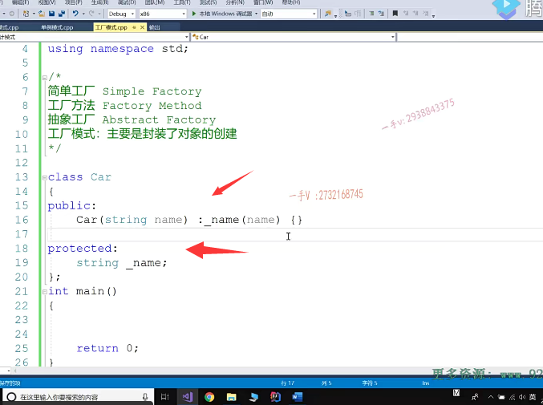

## 派生类 BMW

那在这里边呢？我们再来给它提供一个。这个纯虚函数啊，给所有的派生类，具体的汽车呢，保留了一个重写的接口，这写一个vertu啊，我们就写一个简单的这个show方法吧，好吧？

那么，大家来看在这呢？我们有一个。BMW是吧public c。car啊，那么在这里边呢，我们得提供一个。这个构造函数。当然，还需要重写一下。从基类继承来的。这么一个。纯虚函数对吧嗯。这是获取了一辆。啊，

宝马汽车。

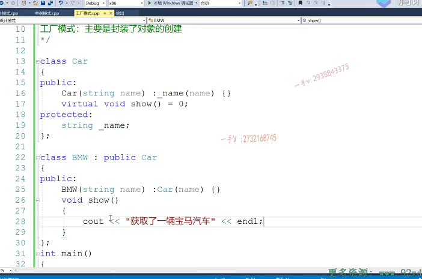

## 派生类 Audi

啊，那我们还可以再写一个。这是获取了一辆奥迪汽车，对吧？

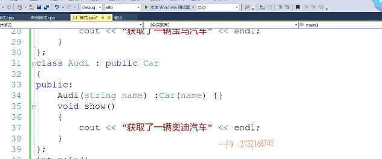

好，大家来看啊，我们原来呢，在写的时候呢啊，我们原来在写的时候呢，是怎么写的呢？就是car *p1=new BMW。对不对？比如说 X1 啊，比如说X1吧

我们。在这里边呢，打印一下，从基类继承来的这个name。

==name相当于打印了一个车的型号==，对不对啊？叉一，然后在这里边呢，

我们再用这个car *p 2=new比如说是一个a6。

## 坏处：

对不对？我们是这样使用的对吧啊？我们说这这个不好的地方呢？

在于我们必须呀，==作为开发者，我们必须记住这些派生类的这个。==名字啊，这名字我们必须记得，否则我们都不知道你有谁是不是啊？

那另外一个呢？相当于就是。==我们在创建对象的时候，直接使用的就是对象==。是吧啊。

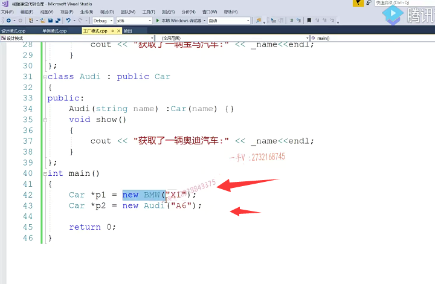

## 逻辑上我们是不需要知道对象的创建的具体内容

其实呢？我们在逻辑上不应该是这个样子。对不对？我们不需要了解对象的这个创建的，这个具体的这个内容啊，

我们不需要了解对象创建的这个具体的内容。我们呢？就像我们买车一样，我们直接去4s店是不是啊？我们看好了直接问他要来给我一辆车就可以了，那么4s店呢会？是经销商，他会从工厂呢给你整一辆车过来，对不对啊？那这样写的话，相当于我要一个对象。啊，我要一个对象，我要一个宝马嗯，相当于我还我我我作为调用方，

我作为客户方啊，对吧？调用你这个代码，我还得知道宝马怎么造？啊，你有一个奥迪，我还得知道奥迪怎么造，是不是就像我士兵要上战场打仗，你得给我士兵发支枪？诶，其实对于士兵来说，你给他支枪就行了。对不对？你直接让士兵还要扭一把枪啊？士兵还得需要知道枪具体是怎么制造的。

这个是不是跟我们实际的这个逻辑有点不符啊？

# 将对象封装工厂

所以呢，我们把这些对象呢，都给它封装在一个简单的工厂里边，大家来看啊，我们第一个class。我们simple factory.啊，simple factory，我们在这里边给它定义这样的一个接口啊，就说。create.car上。

有creat car，creat car好。大家来跟我看一下啊，大家来跟我看一下那create car这里边呢，我们可以通过传入什么东西啊，

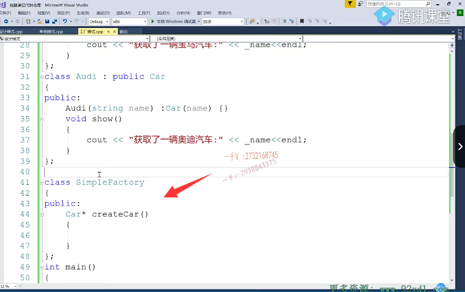

你比如说我们可以通过传入一些枚举值。啊枚举值我们的car tap啊BMW。audi.那么在这儿呢，我们可以传一个。car type  switch CT.

case如果是BMW的话。

case audi 对不对啊？好，那么大家来看啊。

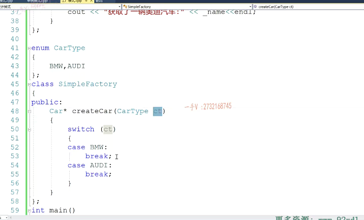

好，那么大家来看啊。当用户调用这个工厂，简单工厂的这个方法的时候呢啊，这个方法的时候呢，根据传进来的这个参数呢。我们在这儿呢，就给它直接去创建这个。相应的一个对象了啊。给他去创建相应的一个对象return。好了吧啊，那这儿就是一个return空了。

选啥没有？

是不是我们可以写default啊dfult？那么，这个表示什么意思呢？这个表示呢呃cl吧啊。传入工厂的参数是不是不正确呀啊？不正确打印一下。等一下，这值是不是嗯？好，那我们用的时候怎么用呢？

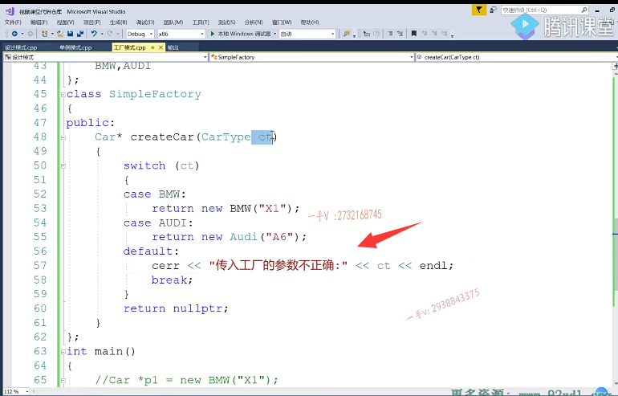

# 怎么使用 

## 先获取工厂

首先呢，我们可以获取一个什么？首先，我们可以获取一个。

工厂啊new simple factory对不对？

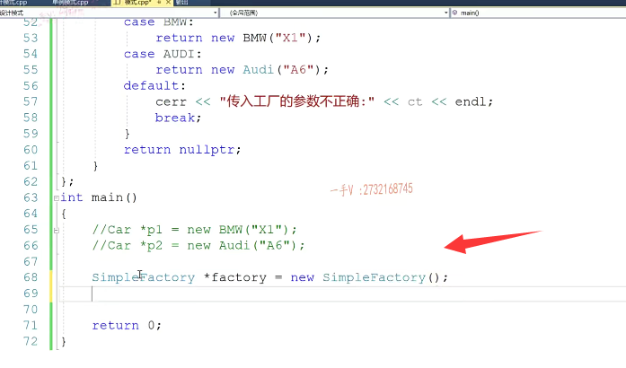

## 再在工厂创建

## 通过传入不同参数，得到不同对象

那然后我们就可以可以通过car *p 1=factory。点create car，只需要我们创一个BMW就行了啊，你还可以。诶，再创建一个从工厂里边。这相当于就是比较符合我们的逻辑了啊，比较符合逻辑了，我站在这个BMW工厂说给我来辆BMW。那工厂就给我返回一个BMW，至于这个b=w到底怎么创建不归我管，我也不需要知道。同理，对于奥迪汽车也是这个样子的，

那也就是说呢，我们通过这么一个简单的工厂啊，把所有对象的创建给它怎么样封装起来了？

通过传入不同的参数，甚至来得到不同的。对象啊，找到不同的对象，对不对啊？

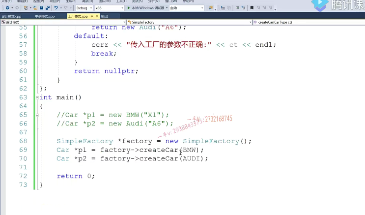

## 当然也可以全部使用智能指针

那在这里边，我可以调用p1的show啊。p2的这个show对不对？完了以后呢？对吧p1？

p2.跟我的factory。啊，called factory。都给它怎么样啊？都给它delete掉对吧啊？你如果想要delete资源呢？你这里边可以都使用什么智能指针？是不是全部都使用智能指针？也是没有任何问题的。好OK，我们看一下。

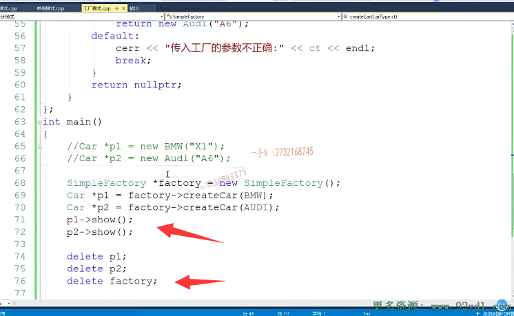

## 枚举类型 与 类名冲突 改一下重新生成

在这呢。看看啊嗯，这是什么样的一个问题？

这个应该是。BMW这个枚举名称跟我们的类名是是重复的是吧嗯？咱们把这个类名改成一个小写是吧？好吧，数字母大写啊。数这么大写okay，我们这儿都改一下。这都改一下。这个枚举名跟类名重复了啊。调用一下。没问题吧，

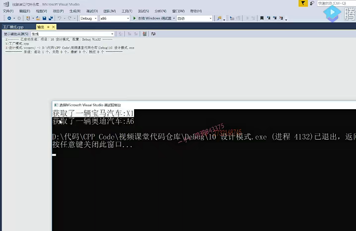

# 使用智能指针来完成工厂模式

## 头文件 memory

你看。我选了宝马汽车打印或者奥迪汽车的这么一个打印。是不是啊？好吧，

回到家看一看这个啊，看一看这个。那么在这呢，如果你不想呢，去自己管理资源的话，你在这还可以适用。智能指针是不是智能指针啊？还有我们俩用一下吧啊，包含一下这个。memory是吧？包含一下这个memory啊，

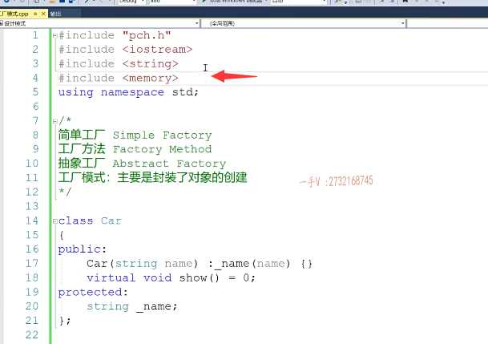

## 出了点错，不能复制构造和赋值操作符

我们这里边返回一个。unique啊。那直接在外边使用吧。好，

大家来看啊，在这儿我们都使用uni cui qu ni CP tr。okay.factory.对吧啊。这个factory是不是再用一个unique car？p1.啊，factory。这unic car PR。单纯的后边就没有这些东西了。这个使用起来就。非常的舒服是吧？

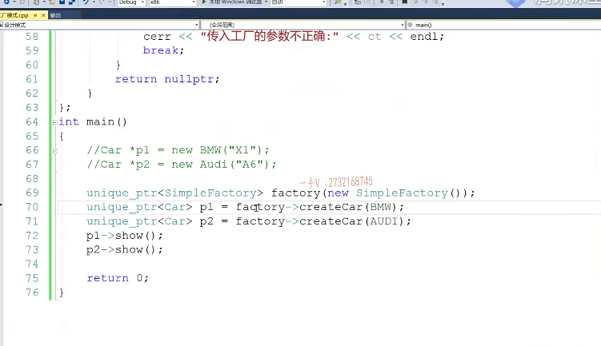

## 直接进行初始化

我看看啊，这个有什么问题啊？

有什么问题？哦，这个直接进行一个。初始化啊，这个直接进行一个初始化。好，大家看看，没有问题了啊，没有问题了。在这呢。自动释放资源，这就是我们使用智能指针的，是不好处啊啊，使用智能指针的好处好。大家看看。

这就是我们使用这个简单工程啊，简单工程。

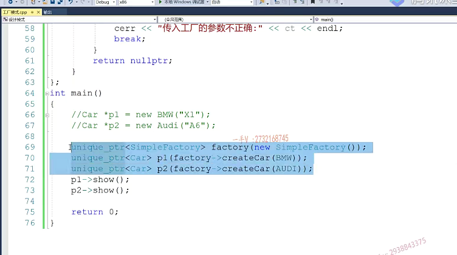

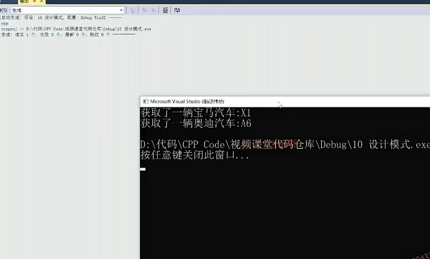

## 简单工厂的坏处

## 不符合实际 不符合开闭原则

但是简单工厂呢，也有它的这个不好的地方啊，也有它不好的地方。对吧啊，有什么不好呢？呃，首先大家这个来看一下啊，大家来看一下。从逻辑上来讲啊。你这个同一个工厂不可能又建宝马，又建奥迪，又建手机，又建电脑。

对不对？我不可能用一个工厂啊，把所有对象的创建是不都得封装起来呀？这个工厂做的事情太多了，是不是啊？不符合。实际的情况啊，实际情况肯定是产生宝马汽车的，这个工厂跟产生奥迪汽车的工厂肯定是两个不同的工厂。对不对啊？再者啊，我们这个工厂的设计根本不封闭呀。啊，那我们经经常说软件设计要达到开闭原则，开闭原则，

开闭原则是不是啊？对修改关闭对扩展开放。你看我们这对修改也不关，对修改也是开放的，对扩展更是开放的。啊，我没有增加新的对象，就得去重写这个接口。是不是我们要删除已有的对象，我们得修改这个接口，这个接口总是变来变去，变来变去，永远也不封闭。对不对啊？所以这样设计不太好，

这样的设计不太好，

==首先呢，这个逻辑上不符合应该一个工厂负责。一种产品的时候创建啊啊==，

==另外一个你用一个工厂来封装所有。这个产品的创建的话呢，这个也做不到软件设计的开辟原则呀。这个接口的设计根本就不封闭呀==。对不对？总是改来改去的，会产生很多问题的啊，会产生很多问题的，

# 工厂方法编写

所以呢，基于这样的缺点啊，基于我们简单工厂这样的缺点啊，

我们才有了。我们第二类的东西啊，叫什么东西呀？就是叫工厂方法啊，这个下边这个是。下边这个是。简单工厂啊，简单工厂。那我们现在来看我们所谓的工厂方法啊，工厂方法，工厂方法呢，在这里边首先大家往上面，我们不变，上面都是产品嘛，对不对啊？

上面都是产品。

好吧啊，那工厂方法在这里边呢，首先它有一个。工厂啊，他首先有这么一个工厂好吧啊。这么一个工厂。那么，这个工厂里边有一个方法啊。叫做。credit card.那么，

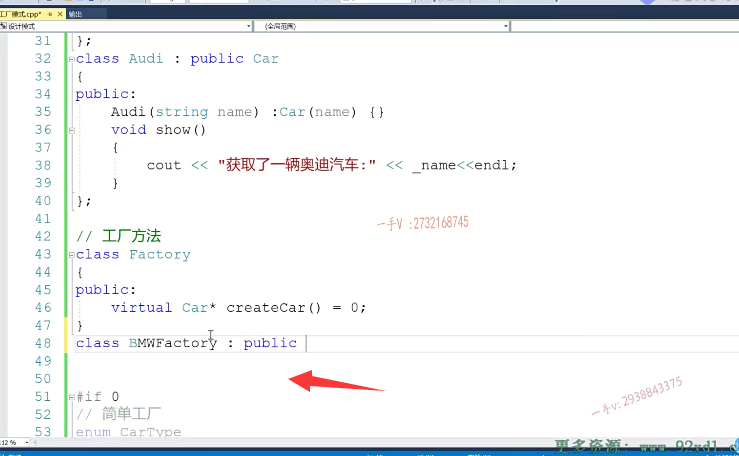

## BMW方法

从这个方法里边呢？我们得到了一个BMW factory。public这个factory。

既然是继承关系，所以派生类一定要重写一下，从积累继承来的。这个方法，这当然是宝马工厂了，宝马工厂当然是负责创建什么？宝马汽车的吧。是不创建宝马汽车的呀啊？创建宝马汽车的，那就是return我们刚才的。是不是BMW这个对象呢？没问题吧啊。那如果每个汽车都有一个标识的话，我们还可以给这个credit card传一个什么呀？比如型号是不是啊？

创业name啊，就都创业name啊你。我们把这个name给它。

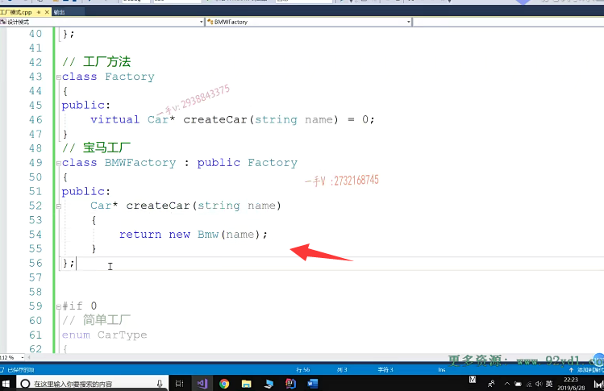

## 奥迪工厂

好，我们再来一个audi factory public factory。那么。这是奥迪工厂嘛，是不是这是奥迪工厂嘛？奥迪工厂那当然是创建奥迪汽车的嘛。对的吧啊，奥迪工厂当然是创建奥迪汽车呀。

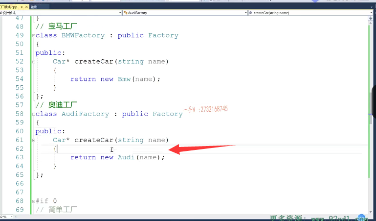

## 先给出一个工厂基类

首先大家来看啊，这跟刚才的简单工厂方法来比，并不是说是用了一个工厂，一个方法通过传入不同的一个标识。啊，通过不同的标识来创建不同的对象，它相当于就是给了一个工厂的基类

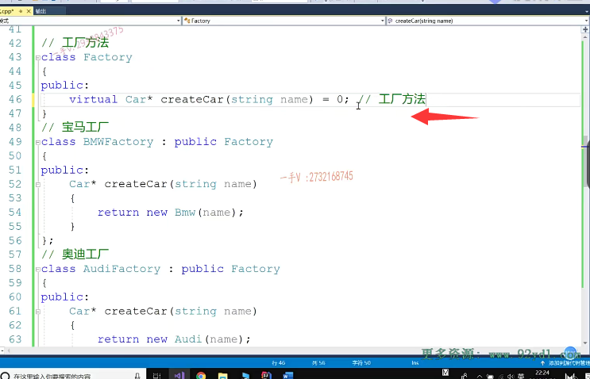

## 具体产品工厂生产产品

然后呢，通过实现具体的。产品的工厂用具体产品的工厂来生产，具体的产品。看到了吧啊，跟刚才工厂这里边有变化，那这个就是我们所谓的这个工厂方法了。great card工厂方法没问题吧？

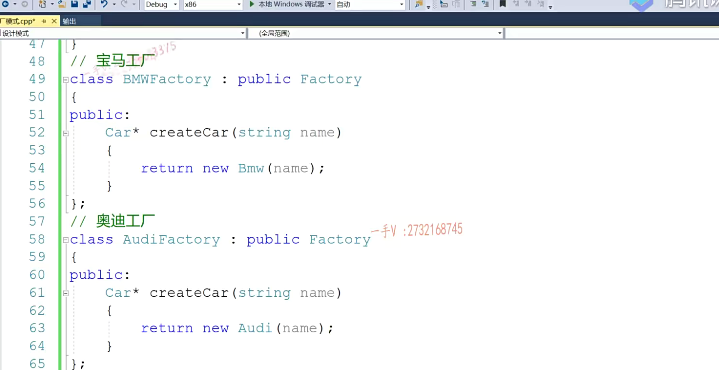

## 应用

那我们应用的时候呢？我们先来看一下。怎么用好吧啊？那么在这儿呢，

大家来跟我看，我把刚才的代码我们来拷贝一下啊，拷贝一下放到这里边儿。那这已经不是我们的simple factory了，是不是啊？这是我们的什么啊？factory啊，factory。第一个是我们的。BMW factory b.mw.FAC.fty吧factory啊。这是我们的audi。奥迪。

factory.好吧，那你需要。宝马汽车需要奥迪汽车，是不是啊？这create car，这是我的叉六啊。这是奥迪的a8。大家来看一下。大家来看一下。那现在呢？就是这么一个情况，我们先来运行一下，看一下运行的这个结果啊。我们的class这儿上面这个class忘了加分号，

对吧？再来执行一下。好了，你看分别获起了宝马叉六奥迪a8是不是？

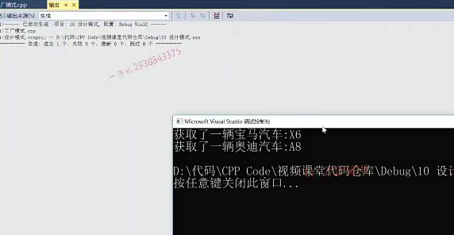

那么，在这里边这个设计是？这样设计，首先它把工厂呢划分成了一个继承结构，工厂有一个有一个基类啊，封装了一个工厂，方法叫做credit card。是不是现在呢？就是一个派生类，就代表一个具体的工厂，一个具体的工厂呢？

产生一个具体的产品。啊，产生一个具体的产品。好吧。那在这里边很明显，相应的工厂创建，他自己相应的产品，这是没有任何问题的吧，

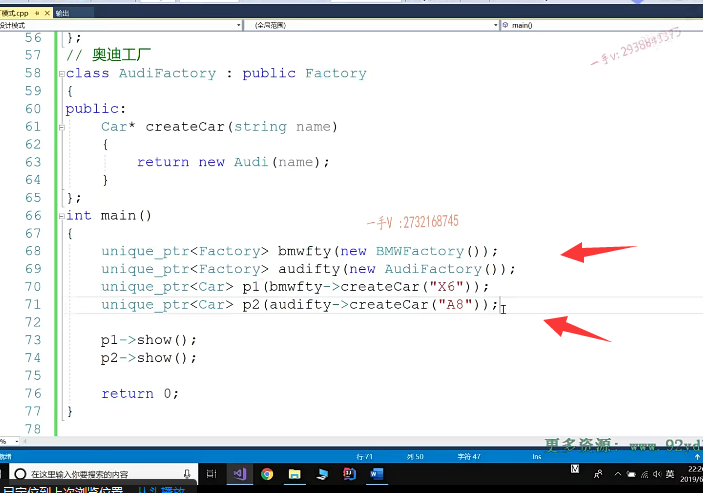

## 是否符合开闭原则

## 符合

再来看一下。我们这样做，是否符合软件设计的开闭原则？那么，当我想增加，比如说奔驰的话，我根本不需要动这个宝马工厂跟奥迪工厂不用动吧？

我们只需要再增加一个奥迪factory啊，再再增加一个奔驰factory，从这个factory积累是不是继承而来，然后重写一下这个create car就行了。==既然是奔驰工厂，那当然是造奔驰汽车的，不可能造你宝马或者奥迪呀==。

所以呢，==当我们需要增加新的这个产品，新的工厂的时候，我们原有的工厂和产品呢，根本不需要改动啊，根本不需要改动，这就是对已有的功能封闭对修改关闭==嘛，

但是对扩展是开放的，这就是所谓的开闭原则是吧？那么如果呢？

==你想删除已有的工程跟对象，那也你就删除相应的一个派生类就行了，也不需要改动我们其他的类==。

是不是所以这个呢？这个简单工厂方法啊，完美的解决了，我们在简单工厂里边儿碰见的这些问题。啊，碰碰见了这些问题。大家仔细想一想啊，仔细想一想。

产品我们是还是有这一组产品car啊？我们说的car汽车本身BMW 奥迪对吧？

# 总结

嗯，我们看到吗？工厂呢？拆分成基类跟派生类用具，具体的工厂类来创建，具体的产品。好的吧啊，一是我们达到了一个工厂。创建其相应的产品，这个比较符合我们实际的逻辑，另外一个就是做到软件设计的开辟原则啊，对已有的工厂我们不需要做任何改变，我们需要。

增加新的产品，新的这个工厂，我们只需要写一个新的类就可以了啊。好，

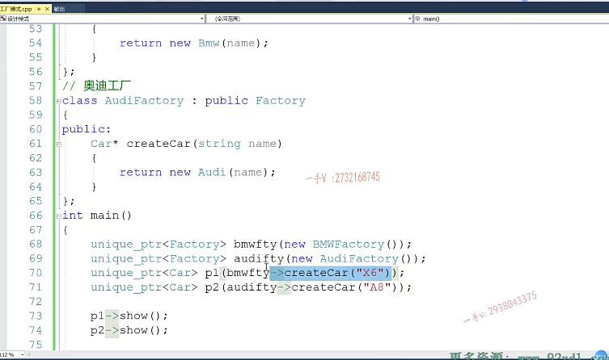

这就是我们这节课主要给大家讲了一下这个简单工厂和工厂方法，它们两个的区别。以及应用场景好吧。

## 好处

==借助这样的这个设计手法呢，我们在调用的时候呢，我们想获取对象只需要调用我们工厂相应的一个工厂方法就可以了啊，不需要了解的，具体的这个派生类叫什么名字呀啊？怎么拼啊？对不对啊？==

我们不需要不需要知道不需要知道，==我们只需要从工厂拿到相应的对象的对象就可以了，至于具体的对象怎么创建，名字怎么写，我们不需要关心对象创建的细节，这些细节呢，都由工厂来帮我们维护好吧==，那我们下节课给大家来讲一下啊，讲一下那么我们在这里边儿。检这个工厂方法又有什么问题，以及我们为什么还要有一个抽象工厂啊？好，那我们这些问题下节课再说。

