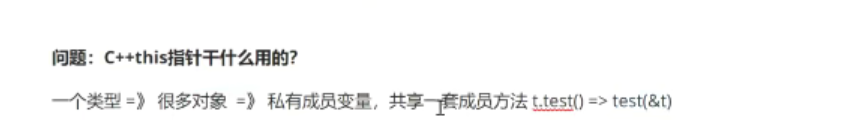
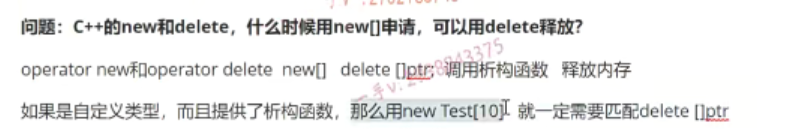

大家好，从这节课开始呢，我们主要给大家讲一下啊，我们主要给大家讲一下这个面经啊。就是。2017到2018还有应该是2017年2018年啊，春招秋招2019年春招啊2019年，现在这个秋招还没到啊，对吧？纯蒸，我们在大家交上来的这个面筋里边啊，就是把很多嗯，重复的我们也去掉了啊，重复的我们也去掉了。呃，

然后呢？一些比较重要的重要的啊，我们都给大家列了一下啊，其实呢，大家会发现很多东西呢。还是有重复啊，还是有重复啊，还是有重复2019年啊，还是有重复？那我们通过这些东西呢？通过这些面筋啊，这个CA加相关的这个呃梳理出来呢？我们发现了它重点还是在设计模式，智能指针。CA+stl容器啊。

那么这些方面啊，这些方面。那么，我们在这个视频课堂上啊，讲这个面经啊，最重要的并不是说是为了给大家。这个给出这个问题的参考答案啊，给出参考答案是肯定是会给出的，但是我们最根本的目的是什么呀？根本的目的呢？是教会大家呢如何？在面试中啊，去回答这些问题对吧啊，如果有效的进行回答，我们的回答这个问题的角度呢？

应该站到哪里？对不对？如何在众多的这个面试者中啊，回答相应的问题呢？能够给面试官留下更深的一些印象啊，更深的一些印象。那么，还有一些对于技术性问题的，一些面试的技巧啊，回答的技巧呢，我们都会在这个课程中啊。给大家说一下啊，给大家说一下。希望大家呢呃，听完这几节课呢啊，

并不是只会去解决一些问题啊，更重要的是。不管是现场面试还是电话面试啊，我们知道对于技术性的问题呢，我该怎么去回答啊？我该怎么去回答？好吧啊。那么在这里边呢？嗯，首先呢，跟我这个。搞清楚这几个问题啊，搞清楚这几个问题，我们在面试过程中啊。

## 技术面试过程中回答问题应该注意的事项

技术面试过程中啊回答。问题应该注意的事项啊，应该。技术面试啊，技术面试。面试过程中回答问题啊，应该注意的这个事项啊，应该注意的这个事项。那么在这里边啊

1.

第一个是什么呀？第一个就是。当啊，面试官啊。提问问题后。啊，

不要。着急作答啊，不要着急作答应该。适当啊。停一下，停一下，比如说是几秒钟的时间是吧啊？几秒钟的时间，如果问题稍有稍有复杂啊，你可以直接给面试官说一下。你说好的啊，那我思考，比如说我思考一下啊，我思考一下组织之类的，这个措辞对吧？

应该去停一下啊，不要着急作答，哪怕是简单的问题呢啊，也稍微停顿上个两三秒去整理一下逻辑思路，对吧？当面试官提问问题后，不要着急作答，应该适当停一下啊，整理一下逻辑思路。对不对？你说我本来就会嘛啊，这个我为什么要停呢？那么在面试过程中啊，我们同学们这个。啊，

跟平时呢去对这些技术问题的回答啊，心理状态肯定是不一样的啊，他你这个精神上的压力肯定是会有的。那么，稍微停顿一下啊，稍微停顿一下是吧啊，然后呢，整理一下这个逻辑思路，大概的在脑子里边。过一下是不是我应该多说哪些东西啊？不要在回答的时候语无伦次，对不对？一会儿扯这个，一会儿扯那个。啊，

然后呢？嗯，扯了一分钟，然后停停下来了啊，面试官以为你回答完了。是不是但其实呢，你可能对于某个问题，某些重要的点还没有回答到呢。对吧啊，那么当面试官提问问题后呢，不要着急作答，应该适当停一下，整理一下这个。逻辑思路。啊。好吧啊。

2.

对于呢，简单的这个问题。对于简单问题的这个回答啊，对于简单的问题的回答。尽量啊，尽量不要照本宣科。尽量不要照本宣科，对于简单的问题呢，可能大家心里边都有一个答案，对不对？大家心里边都有答案，而且这个答案应该很近似，因为问题简单嘛。所以呢，

不管是大家在书上看，或者是平时呢，在课堂上啊，听老师讲可能答案都非常一样。那么这样你直接回答的话呢啊，也不是说是我们是不是把这些细节就要注意这么多对吧？那么你回答的时候尽量啊，找一找合适的一个角度去描述啊，我们把细节做好，不管是简单难啊，我们回答的都有条有理，而且跟别人呢稍微。稍稍有那么一些区别，对吧？对于简单问题的回答，

尽量不要照本宣科啊，找准找准问题。回答的这个角度或者是层次。对吧啊啊，争取简单问题回答的。啊，回答的。比较有亮点啊，比较有亮点。比如说呢？虽然是简单问题啊，虽然是简单问题呢，但是呢呃，你回答的呃，这个你的回答在知识的深度跟广度上啊，

都有所体现。你比如说啊，你比如说那个我我们的这个就有的同学在回答，

3.

比如说像解释static这个关键字的时候啊，解释static这个关键字。那有些同学就很简单，就解释一下static呢，都修饰什么啊，修饰变量，修饰函数，但是呢，那有些同学解释static就是从我们的el elflinux系统下啊，这个文件格式啊。elf.这个文件格式处罚来解释呢？

static修饰变量，修饰函数到底对于符号有什么样的影响？对吧，这就就是完完全两个不同层次的回答了啊，你光回答它的这个基本概念呢，流于表面啊，你回答它底层呢？那这个呢，一是对于这个简单问题的回答，可以逐渐你学习的这个深度，对吧？第二个啊，你也在一定程度上呢。把面试官从这个static关键字引入到编译链接的详细过程。你已经把编译链接详细过程都准备好了，

是不是啊？那么当我们在给他回答其他问题，比如说这个static问题的时候呢，我们就可以刻意的。把我们的这个呃讨论的这个话题呢啊，给我们面试官适适当的去渗透，是不是啊？告诉人家我哪块儿比较？比较好一些，我哪块比较强一些，我哪块比较熟悉一点？啊，好，对于呢？相对复，

这个相对啊，相对复杂的这个问题，或者是比较难以。阐述的啊，比较难以阐述的问题相对相相对复杂的问题啊，比较难以阐述的问题。啊，思考上。要花要花啊，要花一些。一些时间对不对？如果是电话面试啊，如果是是现场面试。最好呢啊，思考要花一些时间整理好这个逻辑思路。

啊，以及。问题。大致。该大致描述的这个顺序。对不对啊？那如果是现场面试最好呢？呃，用纸笔。啊，用用纸和笔呢？对吧，边画啊。边讲。对不对啊？

边画一边画一边给人家讲对吧？现场面试，如果人家你就自己把纸笔就带上好吧，你就自己把纸笔就带上啊。啊，一般来说，人家现场面试，人家都会也也都会准备纸笔的okay吧啊。那对于这个复杂的问题呢，比较难以阐述，我们同学们啊，不思考，一上来就说啊，那个比较差的就是说着说着突然发现呢，自己的这个回答跟问题呢。

牛头不对马尾是不是啊？那根本就是不是在解十年的问题，或者说着说着把自己给说到坑里边儿去了啊，自己的话圆不上了。或者说呃，或者是回答了一堆东西，感觉也都是这对于这个问题的解答，但是呢，没有任何的这个。前后逻辑啊，乱七八糟的是吧啊，面试官听起来也特别不舒服。那么，对于生难的问题呢？你稍稍可以花上稍微长一些的时间，

整理好逻辑思路，你大致呢？我要从哪些点开始说对吧？对于复杂的问题，你就不要这个。想着想着说出花儿来了，对吧啊？因为这个问题本身比较复杂，可能描述起来呢，也内容也比较多啊。呃，所以呢，对于复杂的问题呢，你就是最好是让我们所谓的深入浅出，对吧？

从简单的地方一下到达深入的地方，哎，再出来。是不是啊？那么在脑子里想一想啊，这个还是一样，我大概要说哪些东西，就我描述的这么一个顺序啊。那么，如果是现场面试呢？你最好用纸笔啊，边画边讲对吧？这样呢，面霜可能听得更清楚一点啊，那对于你来说，

在纸上呢列出。呃顺序列出点也能指导你更好的去阐述问题，是不是啊？

## 电话面试

如果是电话面试，那么这个。回答问题的过程中啊，需要和需要和面试官。面试官嗯，经常。经常沟通啊，不要自顾自的。滔滔不绝对吧，

不要自顾自的滔滔不绝啊，那么如果是电话面试，因为我们也见不上面，对吧，也不可能用纸笔。来给你进行这个呃，这个这个这个表述对吧啊？如果是电话面试的话呢？那回答问题的过程中。啊呃，可能由于一些外部因素啊，比如说信号不好啊之类的，对吧？呃，一一般来说呢？

那你碰上这个负责任一点的面试官呢，可能会跟你不断的询问啊，你说的这个东西对不对啊？这个还有哪些东西啊？还有哪些东西？那可能呢，对于某些面试官来说啊，我们说多少他就听多少，对吧啊，对于这个。电话面试呢，我希望大家在回答问题的时候呢，需要跟面试官经常沟通一下啊，经常沟通一下对吧？比如说我们在回答这个像嗯Linux系统的这个，

比如说是地址映射对吧？逻辑地址映射啊，虚拟地址映射的时候是不是我们可以简单的先从理论上来回答？对吧，理论上来说一下啊，那么。你比如说你说完理论啊，你还因因为你剖析过它的这个源码，是不是因为你剖析过它这个虚拟内存的源码，那么你可能还想给它说一下。那么，在这个地址映射过程中呢？那么，在Linux内核上，到底涉及了哪些的？

具体的数据结构？对不对？比如说有序列表，比如说红黑树，对吧？比如说页目录页表。对不对啊？那的数相设计的相关的数据结构，那你可以直接在电话上问说是呃，那我现在这个理论说完了，我还这个看过这个。它的在内核上的这个实现对吧？呃，你就会跟面试官问一下，你说是那我有呃，

我是否需要把这块儿呢？也说一下。对吧啊，你在回答一个大问题，复杂问题的时候呢，本来呢，逻辑就比较难，可能回答内容也比较多啊嗯，你切记不要光自顾自的滔滔不绝，是不是？啊，自顾自的滔滔不绝，你说着说着说时间长，人家那边儿没反应，你是不是也很尴尬啊，

你都不知道人家在在没在听？对吧啊，你跟面试官呢，聊起来要聊起来是不是啊，尤其是这种见不上面的这个面试啊，聊起来。不要光是你在说啊。啊。好，那当然了，在这里边现场面试，

在这里边现场面试，我们现场面试还有一种就是视频面对吧啊，视频面试跟现场面基本上都差不多啊，人家。呃，

有那个可以看见你的桌面，你可以在桌面上用那个画图板啊，对吧？一边画一边讲啊，一边画一边讲。好希望大家在这个复杂问题上呢嗯，也有一个好的这个。问题回答的一个办法啊，这这些东西呢，这这些场景啊，大家最好在面试之前呢，你都去模拟一下，在自己的心里边想一想，针对不同的问题呢，我跟。

怎么去回答？是吧啊。那么。对于这个对于啊对于。面试中啊，被提问到。自己不知道的内容啊。如果你被提问到自己不知道的内容，我觉得这个不知道的内容啊，我觉得可以划分成两点吧啊，一种是真的是自己不知道，听都没听过，对吧？听都没听过啊。嗯，

比如说是嗯。比如说是我们同学们在这个面试中被问到啊，被问到被问到这个区块链，了解区块链吗？是不是啊？那可能我们同学真的没有看过啊，真的没有看过，所以呢，也没有了解过，所以啊，像这样的问题不知道不知道也就行，对吧啊，不知道也就行。那么。这些问题呢，

属于技术性的问题，是不是像区块链啊？呃，人工智能啊，对不对？哎，人工智能啊。机器人啊嗯，大数据。这个大数据。这个。离线。分析呀，是不是啊？大数据这个离线分析呀啊，

用户这个像用户行为分析呀。像现在的这个智能推荐啊，是不是啊？智能推荐啊，像这些东西呢，都是我们现在比较。在互联网里边比较流行的这个APP啊啊，或者是我们的一些应用啊，对吧啊？后台呢？嗯，比较常用的一些流行的技术吧，对吧？那我希望大家呢？平时呢？

没事儿也多去看一看，不要。只关注自己学习的那一亩三分地啊，把我们现在社会上流行的这些东西呢，可以都看一看对吧啊，像551 CTO啊csd n啊。对不对啊？这些这个。it网站上呢，都有很多不错的这个帖子，大家扩展一下自己知识的广度啊。但是还有一类这个问题并不是说不知道，可能就只知道一点，只知道一点，对吧啊？

只知道一点。呃，那么相关的可能你也知道对吧呃，那么？不要，我只说个我自己不知道啊，就把这个问题就过去了啊，这我觉得是一种非常不负责任的这个回答啊。那你假如说给大家举几个例子啊，你比如说呢，还是你被问到呢，这个比如说你被问到啊。这个你有没有了解过linux的虚拟内存啊？对吧啊，那么假如说你没有看过，

那你就直接说我不知道嘛，那你可能看过了linux剖析了linux其他的是否模块的这个内核源码？比如说进程线程的管理啊，比如说文件系统的是不是管理啊啊，那么你虽然没有看过这个嗯，地址映射啊，虚拟内存管理这一块儿的，你可以。你可以说是你，你这个。回答啊，回答你要饱满是吧？我我我确实我我这块儿没有看啊，我这块儿没有看，但是呢linux的进程线程管理，

还有这个文件系统管理呢这块儿。我是进行了一个呃，很好的，这个源码的这个剖析啊，我可以把这块儿说一下。对吧啊，我们跟人家聊对不对面试官？面面试你的时候对你又不是非常了解，对吧啊？可能你很多东西呢，在简历上也并没有体现出来啊，体现出来。那么，我们需要在跟面试官不断的这个沟通过程中啊，我们我对于我们面试者，

我们了解人家面试官问问题的意图。对于对于面试官来说，我们也也需要靠我们面试者不断的去沟通，跟他的这个回答啊，跟他。呃，回答的这些内容啊，告诉他我们擅长哪一块啊，我们做了哪些事情，怎么体现我们的自己的学习能力？学习的深度以及广度。是吧，好。所以呢，对于我们。

面试官呢，可以提问到啊，提问到我们自己不知道的这个问题的那个内容的时候呢啊，希望大家呢。呃，不要仅仅说一个不知道啊，不要仅仅说一个不知道呃，相关性的跟你现在目前脑子里边儿啊所掌握的知识相关的，其实你都可以去。说一说啊，其实你都可以去提一提，对吧啊，提一提嗯，比如说问到这个。区块链这个人工智能这些东西的啊，

那你不要太严肃对吧？你说是啊，我经常上一些这个。嗯it的这个网站，比如说是啊，在git HUB上找开源代码对吧啊？在这个csd n上浏览技术，博客技术论坛。是不是啊？在overflow上找一些问题的bug啊，那么找一些这个比较不错的啊，比较不错的这个项目啊。那么。呃，我主要关注的呢，

都是我学习上的啊，比如说linux方面的啊c跟c加方面对吧，我并没有关注到。啊，区块链这些东西的。是不是啊？我希望大家的回答能够更加饱满一点，而不仅仅是只是个不知道三个字。啊，好了。那。这个这四点呢，是我们在面试过程中啊，需要大家注意的啊，那第五点那我们今天说的主要是技术面试HR的面试呢，

我们就不说了啊。那么第五点，我们经常面完了以后呢啊，面完了以后呢，被问到你还有什么问题？对吧，你还有什么问题啊？啊。对于这个问题来说啊，大家就不要问啊，我今天的面面试，请问您我今天的面试能不能通过？对吧啊？或者是那？什么时候给我发offer之类的，

对不对啊诶？该发offer你就是问了，他也给你发发不了的，你就是问了他也发不了，对吧啊？公司里边儿都有流程啊，不是说你面完了，今天中午面完了啊，面完了下午就给你发。啊，它也没这么快啊，除非是补录对吧？除非是补录啊。那么，当面试，

当技术面试被问到还有什么问题的时候，我希望大家呢？提的问题更能关注一些，比如说呢啊，我将来在公司呢，我可能接触到。的技术有哪些对吧？我在公司，我用什么样的技术，比如我现在掌握的c跟CA加去公司里边需不需要转型？比如说是做啊PHP啊go，或者是其他的东西，对不对？或甚至是JAVA，对吧？

我需不需要进行转型啊？那主要用到的这个技术有哪些？是不是啊？那么。另外就是嗯，请面试官呢嗯，对我的这个技术面试呢嗯，请面试官能不能对我的技术面试做一个点评？给我一些提出一些宝贵的经验啊，对吧？这都是对你能够嗯，非常有效的，这个帮助的啊，一些问题对吧？呃，

希望大家呢？嗯，知道啊，我们面试过程中，对于我们问题的回答，去跟面试官沟通起来啊，那我们应该。去准备啊，准备些什么，对吧？以及该怎么去？回答这些问题，我们的思有什么样的思路啊行？好，那我们这个一些其他的这个跟我们具体的问题不相关的啊，

内容就说到这里啊。那我们接下来就开始把这个面试的这个问题呢，我们来过一下啊，面试问题我们来过一下。

## 第一题

首先看这第一个CA加的this指针是干什么用的啊？CA+this指针是干什么用的？啊，这个简单的问题铺给我们很多同学啊，他回答出来的啊，回答出来的并不见得有多么深刻啊，并不见得有多么深刻，甚至呢，就是把书上的那些简单的定义呢。回答一下就行了啊。那么你自己想一想啊，

如果让你回答这个问题呢啊，那我们该怎么回答？因为C加加this指针干什么用的？我们不可能说是每天在脑子里边儿把这个问题都过一遍。对吧，这个问题呢，可能当我们第一次学习这个this指针的时候呢，我们了解它是干什么用的，过后我们可能就一直用了，根本没有去想过这个问题，我该怎么回答？突然，我们走到这个面试的这个现场，或者电话面试，或者视频面，

人家突然问起来我们这个问题。你如果不想的话，你。你你的这个问题的回答啊，基本上啊。就谈不上什么饱满了，对吧？谈不上什么饱满有层次的啊，有高度。

那么，同学们对于这个呃CA+z次指针啊，干什么用的啊？就是。坑坑支持的啊，说一些不相关的一些定义。

对吧啊，听起来就没有那么高大上了啊，

### 回答

那么类似指针是干什么用的？大家应该知道啊，我们一个类型啊，定义的对象。对不对？他们都有各自的，是不是成员变量啊？但是他们共享一套成员方法。他们是共享一套成员方法。对吧，那在成员方法里边啊，在成员方法里边。在成员方法里，

啊啊访问成员变量到底访问的是谁的成员变量？对了吧啊，那就是靠这次指针来区分的那首先对于这个问题呢，我觉得这个核心点啊。

首先是。看一个类型。啊，定义呢，这个很多对象。对吧，==一个类型定义了很多对象啊，他们都是。私有成员变量就是各自有各自的，这个成员变量，但是他们共享一套成员方法。对吧，那在成员方法里边访问访问其他成员的时候呢？那我们怎么知道是访问哪个对象的成员呢==？你比如说成员变量对吧？那就是通过前边呢，加一个this指针，==用this指针来区分的。==

那我们的C++的一个类的普通成员方法被编译后，是不是都会多出来一个this指针啊啊？都会多出来一个this指针。大家应该知道呢，像t调用test啊，它其实也被转换成了。

test.把调用方法的对象的地址是不是当做实参传进来了啊？所以普通方法被编译器编译以后呢，就是类成员方法都会多一个this this的形参变量。在这个成员方法里边，通过这次指针就可以区分啊，就可以区分我这个方法，现在到底操作的啊，现在操作的。是哪个对象的？成员好吧。那么，这就是我们对于这次指针呢？干什么用的啊？

==它的核心就是一个类定义的很多对象，他们都有自己的成员变量，但是他们共享一套方法。啊，那么。当对象调用方法的时候，方法是怎么知道处理的是哪个对象的成员呢？对吧？就是通过这次指针来区分的啊。好，这是第一个问题啊，这是我们说的第一个问题啊，

## 第二题

第二个问题呢CA加呢new和delete什么时候用new？中括号申请可以用delete释放啊。那么。嗯。

这个问题呢，都是我们面试以后的这个同学们啊，输出出来的，有的时候呢，可能这个。问题呢，描述的不是很清楚啊，或者描述的不是很全面，我们就暂且拿这个问题就直接来看吧啊。

那么我们说过这个new跟delete对吧？它其实呢，本质上啊，本质上是一个。运算符重载好print new。啊和这个operator是不是delete呀？

当我们用new中括号啊new中括号。来开辟一个数组内存的时候，我们相应的在释放这个内存的时候，是不是得用delete中括号？是不是一个指针啊啊？那大家知道呢，delete相对于free呢，它有两个事情要做，第一个呢是利用析构函数。是调用虚构函数，第二个是什么啊？第二个是释放。是不是内存啊？第二个是释放内存啊，第二个是释放内存。

那么大家应该还记得啊，那什么时候用new释放可以用delete呀，那什么时候不能呢，对吧？如果是如果是自定义类型。而且提供了析构函数。啊，那么用扭中括号开辟，就一定需要匹配谁呀？delete中括号ptr。那么这个应该还记得吧？啊，这个应该要记得啊，这个呢，如果你不记得的话，

你可以看一下我腾呃，我这个视频课堂上啊，我视频课堂上。那么，对于这个new跟delete啊，运算符重载函数的这么一个讲解啊讲解。

那么，德利的中国号，首先呢，他知道现在是要。释放一个数组内存，那么他就要呢把这个。数组的每一个对象呢，都进行一个析构，对吧啊？

然后呢，调用析构函数的时候呢，需要传入每一个对象呢，是不是内存的起始地址啊？唉，那他就要知道这个内存上有多少个对象？它需要把ptr指针呢，减个四才能去取到啊，我们这块儿内存上呢，存储了多少个对象就是对象的个数。因为如果是自定义类型定义的对象，而且提供了析构函数，那么当你new中括号啊，比如说是new test。十的时候呢，

它其实实际上啊，除了开辟十个test对象的内存，还需要额外的开辟，是我四个字节的内存啊。用来记录什么？啊，用来记录呢，我们这个对象的个数啊，因为new底层开辟内存是通过mo loc来开辟的，也都是按自己来开辟的。析构的时候，那你析构函数要知道呢，每一个对象在哪里，所以开辟的时候就要记录一下对象的个数。啊，

这个我在前边的这个录屏上呢，应该也讲的这个很清楚啊，很清楚大家如果呢，记得不太清楚呢。那么可以回过头去看一下相关的这个内容啊。

那也就是说这个问题该怎么CA加呢？new和delay的什么时候用new中国号申请可以用delay释放啊，那我们可以把这个说一下，如果是自定义类型，而且提供了析构函数。为什么我们一定要用？为什么我们用new中国号儿来开辟，就一定得匹配这里的中国号儿？对不对啊？那除了这个是必须匹配的，

那其他的情况呢？嗯，其实互换。都没有任何问题的，对吧？但是大家尽量不要。这个乱写，尽量匹配写上是不是啊？尽量匹配匹配的写上OK吧？好，这就是对这个问题的回答的一个思路啊。

