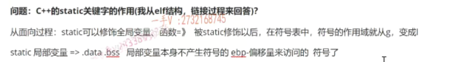
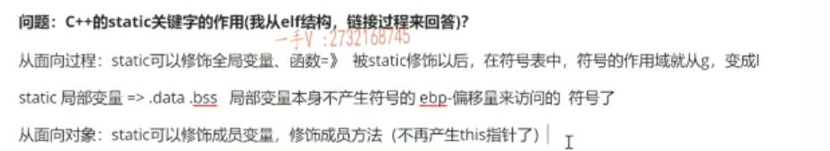
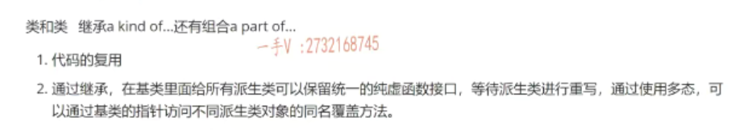
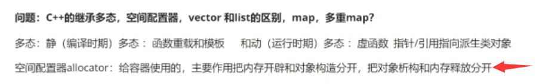
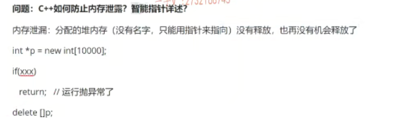
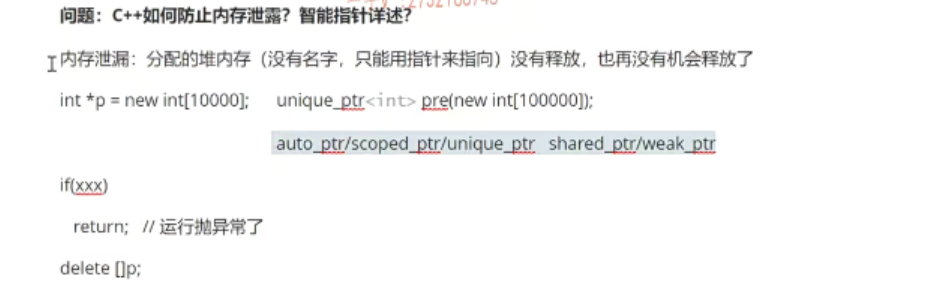

# 第三题 C++的static关键字的作用

好，接下来我们来看一下第三个问题啊CA加关键字的作用啊。在回答这个问题的时候呢，让大家也稍微整理一下，因为这个问题呢，简单，但是比较零散，对吧？我们尽量呢，对于这个问题呢，回答的能够全面一点。是不是啊？你比如说呢？

## 回答

==从这个从面向过程来说static==可以。这个修饰全局变量、局部变量、函数对吧啊？那么其实呢？对于这个。

对于static修饰全局变量跟函数，那么从概念上来说，大家应该都知道呢，它就把全局变量跟函数呢，**本来是整个儿工程可见**的就是。在这个原文件中写的全局变量跟函数呢，这些其他的这个原文件中通过声明一下，是不是都可以使用呢？但是如果加一个static的话就不行了。加static的话呢，相当于当前的全局，当前文件的全局变量跟函数呢，就**只变成当前文件可见**啊。

这是定义那人家，你看人家在这儿注明了，我是从演究结构，链接过程来回答的，对吧？那如果你知道变异链接的原理的话，你你就会知道它为什么就变成了？这个符号就变成当前文件可见了，

因为呢，在符号表中啊，

因为对于它们两个啊。因为对于他们两个来说。啊，被static修饰以后啊，在符号表中啊。啊符号的作用域。就从global就d啊。变成l就变成变成local了啊，变成这个local了。变成local了啊，变成这个local了。在符号表中呢？符号的作用域就从这个g变成这个l变成local了，对吧啊这个？对这块没接触的同学呢，

可以看一下我CA加精品课程基础部分的这个变异链接原理啊。

那么static如果修饰。局部变量的话啊，局部变量的话，那么这个变量呢啊，那这个变量的这个内存呢，就变到我们的这个。数据段了啊data段或者bss段那到底放data还是bss就看我们局部变量有没有初始化的，是不是或者初始化为不为零了？初始化的不为零的都在data，没有初始化的以初始化为零的是不是都在bss段啊？这应该就是从我们面向过程的角度来说呢，它这个修饰的内容。咳咳。那么，

修车中全局变量函数以及局部变量啊？嗯，那么你还可以说局部变量是程序，因为在数据段嘛，程序一开始就要开辟空间嘛，开辟内存了，但什么时候初始化第一次它运行到它的时候是不是才进行初始化呀？对，而且呢，只初始化一次对吧？那么你也可以呢，从更底层的角度呢来说一下它这个修饰这个全局变量函数对于符号的这个。改变是不是啊？

当然这个你也可以说了，局部变量属于指令啊，

在战上的变量，它是不产生符号的，对吧？但是呢啊，局部变量。本身啊，不产生符号的啊，因为局部变量都是通过在站上都是通过ebp减上一个。偏移量来访问的啊，偏移量来访问的。就是剪一个片面来访问。对吧啊，那么现在static呢？修饰了局部变量，局部变量变成一个数据段上的一个数据呢，

它要产生符号了，是不是它要现在就要产生产生符号了？但是它的符号呢，也是一个logo，就对于链链接来说的话呢，链接其实不看logo的符号，只看global的，对吧啊？

## 面向对象

从这个面向对象的这个角度来说呢啊，从面向对象的这个角度来说呢，这static呢。啊，可以修饰啊，成员变量。

也可以修饰呢，是不是成员方法啊啊？可以修饰成员方法啊，当然呢，你也可以在成员方法里边定义静态的局部变量。啊，这个就跟上边这个是一样的啊，那修饰成员变量啊，这个成员变量就从。嗯，对象私有的变成对象所共享的。是不是修饰成员方法一样啊？其实修饰成员方法的话，相当于成员方法。

不再产生this指针了吧。不再产生this指针，也就是说呢，这些方法就不需要用对象是不是再来调静态方法，对吧？直接通过类作用域调就可以了。

啊OK，那么这个还属于比较简单的问题吧，那大家可以从这些角度去回答一下，那回答的意义是否全面？二是是否深入？对吧？希望能给大家一个提示啊。可以把这些问题呢，自自自己整理一下啊，

整理一下，不仅仅要记到纸上，可能更要把它记到脑子里啊，我们对于问题的回答呢。是否足够全面啊？是否有简单的有深入的对吧啊？好。

# 第四题 C++继承

那么我们再来看一下这个下一个问题CA加的这个继承啊，继承。那么，这个问题很明显呢？面试官不可能这么简单的，他只是在在我们学生只是在面经上就说了这么一个先进的，这个继承对吧？那我们就暂且把这个问题看作CA加的，

这个呃继承是。是不是啊C加加的这个继承有什么样好处？对吧啊那首先呢

继承是属于类和类之间的关系啊，

## 1

首先呢，我回答这个问题的时候呢，==就是继承属于类和类之间的关系==啊。类和类之间长短的关系呢，除了继承，还有组合是不是啊？除了这个继承，还有这个组合。啊，都是呢，组织类跟类关系常用的一种方式啊，

那组合是part of关系。那继承是。a kind of 的关系对吧啊，满足谁谁谁的一种组合者，part of满足谁谁谁的一部分啊？那么，继承啊，继承有两大有两大好处，第一个呢，那就是继承的基本的这个意义就是代码的复用了。是不是==我们通过一个简单的继承，就可以把基类啊，它代码把基类的成员直接复用到是不是派生类里边儿==啊？啊，这继承的好处嘛，代码复用是不是嗯

## 2

二啊，那就是说呢，在基类里边呢，通过继承啊，通过继承是不是在基类里面？给所有派生类啊，派生类可以保留统一的纯虚函数接口啊，那基类不用实现是吧啊等待。==派生类进行是不是重写啊==？等待派生类进行重写，然后通过使用多态。

什么是==多态呢？就是基类指针或者引用嘛，指向是不是从这个基类派生的不同的派生类对象==啊啊？这个==基类指向谁？就可以访问谁的方法==，对不对啊？通过使用多肽。==通过使用多肽可以通过基类的指针访问不同，派生类对象的。生理对象的重写方法。啊，或者说同名同名覆盖是不是方法同名覆盖方法？啊，这就是非常好的了

## 总结

是不是这就非常好的，一是代码复用，二是通过继承在基类里边，可以给所有派生类保留统一的程序，函数，结构等待派生类进行重写，通过使用多肽。可以通过基类指针访问不同派生类对象的，是不是同名覆盖方法呀啊？这样的好处呢？不言而喻啊，不言而喻，但是呢？对于这个问，对于第二点这个问题的理解可能稍微需要大家有一些CA加代码量的积累啊，

你才能体会它的好处是不是它的好处就是。我不用提供很多接口，每一个接口呢，适配每一个适配一个，是不是派生类对象啊？我只要提供一个接口就行了，因为我只要持有基类的指针。对吧，我只要持有激励的指针，我不管。我不管，你给这个指针穿进来是哪个对象？唉，因为你只要是这个基类的派生类对象，你传进来，

我就可以通过这个基类指针是不是访问你派生类对象的同名覆盖方法了？啊，那么以这样方式，这个提供的这个函数接口基本上都可以做到，这个我们的开闭原则啊，就是不用修改了。好，不用，你要通通过添加新的这个功能啊，你只需要添加一个额外的派生类，从我们的这个基类啊，继承上来再重写一下基类的纯虚函数接口就可以了。啊，好吧啊，那希望大家呢？

这个把这个好好理解一下啊，好好理解一下，我们现在继承的一个好处啊，继承的一个好处。好吧。行，那我们把这个先暂且放到这儿啊，

这个大家好好理解一下吧，这句话呢啊，多看几遍。

# 第五题 C++的继承多态，空间配置器，vector和list的区别，map和多重map

那么。这是问CA加的集成多态空间配置器vector和list的区别map多重map啊？这可能。这个问题可能基本上啊，就面试官把这个CA加的stl的这个内容呢，

可能都过了一遍啊，都过了一遍。啊，都过了一遍呃好。那我们来把这个问题说一下吧啊，

把这个问题说一下C加加的这个继承多态啊，继承多态。唉，我们刚才在这里边已经给大家说了，是不是继承了啊？继承了好吧啊，那如果在这里边要说多肽的话，那我们也可以给大家说一说啊，多肽。

### 静态多态

多肽那有静多肽是不是和这个动多肽啊啊？

动多肽那么静多肽指的是变异时期的多肽啊？变异时期，变异时期的多态那么动脱态，指的是什么时期啊？运行时期的。是不是多肽呀啊？那多肽就是多种多样的状态嘛，是不是就呈现出来呃很多状态啊？那比如说是我们什么叫静编异时期的这个静多肽呢？比如说是函数重载和模板，那函数重载哎，一个函数名是不是展现出来很多不同的状态呀啊，因为它参数列表不同啊。对吧，那么到底调用的是哪个函数创建的版本呢？

这个在调用点在编译时期就要确定下来了。包括模板啊，我们写了一套模板，是不是可以通过不同类型的实例化展现出来啊？好像是。一个类是不可以处理很多类型，这么一个这么一个感觉啊对啊，那么到底用什么类型？从模板实例化代码呢？啊，这个也是在编译阶段就要确定好的，所以这都属于呢。变异时期的静态多态啊，

### 动态多态

动态多态指的就是我们的这个。虚函数啊哈，

虚函数了。虚函数了以及。有没有？就是多态，基本使用原则就是用。指针或者是引用啊。指向。是不是？派生类指向派生类对象啊，派生类对象。好了，那么动态的多态啊，在这里边儿它的这个好处就是我们可以用统一的基类指针或者引用啊。通过指向不同的派生类对象来访问不同派生类对象的同名覆盖方法。是吧啊，

这就是它的这个好处啊，所以我们在。写接口的时候，我们也要刚说了啊，我们在写接接口，我们写对外的接口的时候呢，我们就可以啊，在接口里边放的全部是基类的指针或引用。就不用放具体的派生类的派生类那么多啊，派生类十个你就要写十套相同的。API接口，每一个接口呢啊，接触的都是相应派生类的，是个类型，这样肯定不妥，

对吧？因为派生类呢，我们可以不断的增加，不断的减少，难道不断的增加派生类，不断的减少派生类？我对外提供的API接口也有不断的增加，减少嘛，肯定是不可能的嘛，是不是啊？

### 空间配置器

那么这个空间配置器啊，这个空间配置器，这个空间配置器，我们应该在。

讲课的过程中也已经给大家说的很清楚了啊。空间配置器是给谁用的呀？是给容器使用的啊？给容器使用的它的这个主要作用啊就是。把对象的内存开辟和对象构造怎么样分开啊？把对象析构和。内存释放动作是不是分开呀啊？原来没有分开啊，因为原来我们一直用的是new。对吧，在容器底层呢，开辟空间，用new new的话，不仅仅会开辟空间，还会去构造对象啊，

还会去构造对象。呃，在我们容器初中与析构的时候呢？我们在容器的析构函数里边直接用了delete。那么，它也是会进行对象析构以及内存释放。是不是那我们为什么把它分开啊？分开分开的原因呢？也很简单，对不对啊？当我们。去初始化一个容器的时候呢，这个容器里应该是空的。就是它底层只有内存，不应该有对象对吧？

但是如果呢，你在容器构造的时候直接用new。那不仅仅它会给你开辟内存。还会怎么样啊？还会是不是给你构造很多无用的对象啊？那些对象根本就不是我需要的。对吧啊。当我们呢？这个从这个容器删除一个元素的时候，应该只是把那个对象吸够掉，并不需要释放对象的内存。因为那个内存是我们容器的内存，我们容器后边可能还要用。是不是你就不能直接你从我们容器里面删除一个对象，你不能使用delete，

你应该只是把对象的析构是不是调用一下呀？啊好，这个我们在课堂上其实也讲的很清楚了啊，那如果回答这个问题的话，我们主要站在的就是。控线适配器呢？配置器呢？不可能单独使用的，它主要是给容器啊，应用的CA+STR里边的这个。所有的容器都得需要依赖一个空间配置器啊，空间配置器的作用呢，就是为容器呢，把对象的内存开闭和对象构造。啊，

把内存开辟和对象构造分开，再把对象机构和内存释放，是不是分开呀啊？它这样做是有。意义的啊，因为容器这个。初始化一个容器，只需要给容器底层开辟空间，并不需要呢。在那个空间上去构造很多无效的对象，所以呢，不能使用new啊，因为new就可以构造的。当我们从中去删除对象的时候。当从容器删除对象的时候啊，

那么需要把这个对象吸够掉，并不需要释放这个对象的内存，对吧？当这个容器啊，出作用率以后应该只是把容器里边有效的对象吸够掉。是不是在释放内场啊啊？如果你用delete的话呢？它相当于会把容器底层所有位置上的。都当做一个对象，是不是给你吸够掉啊啊？好，这就是对于空间配置器啊的这么一个回答。好大家在脑子里边呢。总结一下这个思路啊，总结一下这个思路。

## vector和list的区别

那再来看一下这个vector和list的区别啊，vector和list的区别。那么，vector和list的区别呢？那这区别就比较大了，==这应该说白了就是数组和这个是不链表的区别呀。==

vector底层是一个内存可以二倍扩容的，是不是数组啊啊？那么它提供了这个尾部的增加删除push back跟pop back。都是o1的操作啊，类似的是一个循环的双向链表是吧啊，那么它比较适合于这个。增加删除多，它是比较适合于随机访问多，因为随机访问嘛，

给一个下标访问三个下标的元素是不是？这是对于我们数组的一个非常大的一个特点啊，内存是连续的嘛，那类似于双向链表，每一个节点都是new出来的，是不是每一个节点都是new出来的，不连续。但是因为它是链表，所以它首尾push back pop back push front跟pop front啊，它的时间复杂度都是o1。是吧啊，那主要就是数组和链表的这个区别，那vector呢，适合做随机访问多。对不对啊？

比如说我们的这个容，这个容器适配器啊，比如说容器配适配器这个优先级。队列就是基于呢。基于vector来实现的对不对？因为优先级队列呢，底层它默认实现的是一个大根堆，大根堆呢。是要把我们的这个嗯，这个节点呢，想象成一个二叉树，对吧啊，想象成一个二叉树。啊，那么这个二叉树呢？

呃，父节点跟孩子节点都是通过呢，下标的这个偏移。来访问的那负结点是I左s就是2 I+1，右s就是2 I+2，对不对？那那你。元素必须得连续嘛，连续呢才能够用，这个索引是不是来访问啊啊，用用数组下标来访问啊，效率也非常高嗯，随机访问的是o1嘛。啊，那么这个链表呢？

就是list呢？适合什么呀？适合增加删除多嘛？因为。它的节点内存不是连续的，每一个节点都是自己new出来的，对吧啊？增加一个节点或删除一个节点呢？都是o1的操作，因为其他节点是不用改动的，但是对于数组来说，增加一个元素，删除一个元素从中间，对吧？它都是一个on的操作，

因为数组增加一个元素，增加的位置到后边的元素都要往后挪，删除一个元素。当前位置到后边的元素都要往前时候弄啊，设计数据的移动啊是on的操作。对不对啊？那在这呢，就是把它的这个数底层的数据结构说一下。啊，它们的一个特点数组就是随机访问嘛，链表就是增加删除嘛。是吧啊。然后他们提供的相应的一些方法啊。说一下。就可以了。

### map和多重map

好吧呃。那么这个map呢？在解释这个map的时候，这个map的底层就是一个什么东西了？这个map的底层就是一个。首先呢，解释一下它基本映射表呃，什么叫映射表呢？就是它里边存的元素呢？不是一个k，而是1k value。建支对儿。是不是啊？是一个电子对儿。啊，

它底层呢？实现是一颗。红黑树啊，是一棵红黑树，对吧啊？它底层实现的是一棵红黑树，那大家知道红黑树它也是一棵二叉排序树嘛？是不是或者二叉搜索数对吧？它有一个特点就是进数的元素是要进行比较的啊，左孩子的值永远小于负极点，负极点也小于右孩子的。是不是啊？那么它对于这个传进来这个k value呢？主要是对k做一个元素比较，通过快速的查找k。

来找到k对应的这个value。

啊，那么普通的这个map和这个多重就是multi map啊？multi map.的区别是什么呀？那就是。这个是。允许k重复的啊，允许k重复的。那这个是不允许可以重复的啊？这个是不允许k重复的。对吧，这就是它俩的区别，除此区别呢，它俩都一样了，

是不是全都都是k value啊？底层实现的是共和系数。那么，对于这个问题呢？可能啊，他把你的这个。嗯，脉谱表的一个基本操作呢，问完以后可能就会深入的去问红黑树了。是不是啊，深入的区分这个红黑树了。那么，对于红黑树的这个回答呢啊，你应该也准备一下对吧啊？

## 红黑树的性质

首先，

红黑树的五个性质。是不是啊？五个性质，每个节点都得需要有颜色，第二个根节点必须是黑色，第三个叶子节点必须是这个黑色，对吧？呃，第四第四个呃，从根节点到每一个叶子节点的路径上不允许出现，连续的是不是红色节点啊？第五个啊，红色节点不允许。不允许出现两个连续的红色节点，对不对啊？

这就是红黑树的五个性质，然后呢？它的插入的这个三种方式啊，插入的这个三种方式。以及删除需要考虑的四种方式啊，四种应该是情况，对吧？三种情况啊。包括插入最多。最多旋转两次，是不是啊？删除呢？这个是。最多旋转。三次对吧？

三次这些内容呢？你可能都要准备一下啊，这些内容你可能要准备一下，都有可能要回答的。没问题吧啊，这就是我们的面试中啊，被问到这么一个问题的时候呢，我们该回答的一些点。啊，我们该回答的一些点，我们需要准备一些东西，我们脑子呢？被问到这个问题以后，我们花上几秒钟十几秒钟的时间再去想怎么回答的时候呢？我们脑子里边应该把这些东西呢？

啊，都要过一遍啊，都要过一遍，脑子里边能想出来这些东西啊，以备他问。这个问题相关的内容的时候，比如说问map的时候问到红黑树了。啊，我不至于说是没有任何的准备，对吧？好。那么，这个问题我就给大家总结到这里了啊，总结到这里，希望能够给大家一些嗯，

回答问题的这么一个。提示啊提示。

# 第六个问题 C++如何防止内存泄漏？智能指针详述

那么，下一个问题是。问，我们CA加中如何防止啊内存泄露对吧啊？在C加加这个里边，防止这个内存泄露啊，防止这个内存泄露。呃，当然有一个非常大的呃，大的好处呢，就是使用智能指针了呗。是不是啊？

## 内存泄漏

什么是内存泄露啊？

内存泄露就是我们。啊，分配的内存没有释放啊，这一般指的就是对内存吧。因为堆内存是没有名字的。没有名字的，是不是我们只能用啊？只能用这个指针来指向啊？只能用指针来指向，所以呢，万一你给这个指针重新复一个值，让这个指针指向其他地方去。那你之前开辟的这个堆内存就再也找不着了。找不着，那你也不可能去释放它了。

对吧啊，所以内存就泄露了。是不是啊？分配堆内存没有释放。

也。再没有机会，是不是释放了啊？他没有机会释放。那有的时候呢，也并不说我们没有释放，对不对啊？在这里边呢，开辟的这个空间是不是啊？我们在后边呢？其实呢，

释放了，但是呢，由于中间呢，怎么样啊？某些逻辑呢诶，满足诶，我们提前给return掉了。导致我们的这个资源释放代码并没有运行到，或者是我们中间这块代码怎么样运行，怎么样抛异常了？那抛异常了，是不是也就是直接结束这个函数的战争了啊？返回上一层调用了去寻找处理异常的try代始代码了，对不对？诶，

那么导致是不是我们这个释放资源的代码也没有被执行到啊？也没有被执行的？好的吧嗯。那么，这都是属于内存泄露了是吧？都属于内存泄露，

## 智能指针防止内存泄漏

防止这个内存泄露啊一个。非常有用的方法呢，就是使用智能指针嘛，是不是智能指针我们在前面的这个视频课程中也给大家去详细的讲解了啊，详细的讲解了。智能指针利用的就是站上对象出重率，自动析构是不是这么一个特点啊啊？然后呢？在智能指针的析构函数里边儿，

就把资源给释放掉了。那假如说这个啊，这个如果我们用尤尼克ptr用一个整形啊ptr。然后这里边是一个new int啊，new int这么多的，是不是诶这么多的？你后边儿你不管是啊，你不管是代码从什么哪儿return了，抛异常了。只要你出这函数战争，我这对象就要析构啊，只要你出这个函数，我对象就要析构。那么，在这个对象的析构函数里边儿呢？

它就会去释放这个资源，但所以智能指针主要利利用了什么？利用对象自动析构，因为析构函数本身就是编译器。给我们在指令上添加了，是不是？那他也不会忘的，所以析构函数只要调用，那么就可以保证呢？我们资源是一定会释放。

## 智能指针类型

是不是那么在这里边，可能你把这个问题呢，就切换到智能指针上来了啊，切换到智能指针，你可能就要说一说智能指针了是吧？

只能指针了。我这里边有auto。ptr啊。scope e dp tr.有腻，可是不是ptr还有带饮用技术的she dp tr跟wake ptr。这些智能指针详细的内容，我们在这个视频课程里边儿都给大家讲了啊，都给大家讲了啊，在这里边儿，你能不能很好的把这块儿呢说出来呢？对于不带引用技术，带引用技术指针，智能指针为什么要分带引用技术跟不带引用技术呢？对吧，

这是一点，另外这三个不带引用技术的智能指针之间又有什么区别呢啊？那么，当我们使用不带引用技术的智能指针的时候，我们应该推荐使用哪个呢？啊带引用技术的智能指针是这个啊，一是带引用技术能干什么？好处是什么啊？其次呢，带引用技术的智能指针，它们是不是现成安全呢？啊，这个带引用技术的智能指针还要分一个强智能指针跟弱智能指针对吧？强弱智能指针。有什么好处，

为什么不使用？不只使用强智能指针呢？我们知道，交叉引用问题是不是交叉引用啊？如何解决对不对？还有我们这个非常强大，我们这两个智能机器人，人家本身就是CA加幺幺引入的啊，就是从原来的不死库拿过来。那它们本身也是一个线程安全的智能指针对吧啊，而且还可以很好的解决呢，多线程访问共享对象的线程安全问题啊。很好的，很好的。那么，

希望大家在这里边啊，借着这个问题，能否把智能指针在这儿全部汇总一遍啊，它只要能够被问到。内存泄露，你脑子里边就能够想起来智能指针啊，我用智能指针。来在CA加上防止内存泄漏是一个非常好的办法。是不是一个非常好的办法啊？

