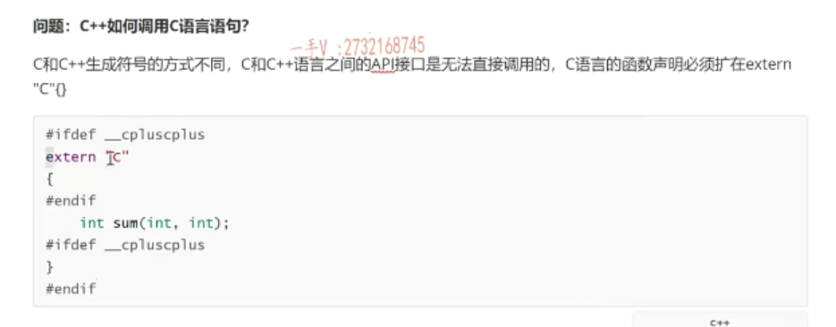

# 第七个问题 C++如何调用C语言语句

我们来看这个问题啊，这个是CA加如何去调用这个C语言对吧啊？CA加呢？如何去调用这个C语言？啊CA加在这里边啊，调用这个C语言那应该是。大家应该。应该都清楚吧。啊，我们看一下啊，看一下看一下okay？嗯，稍等一下

## extern "C"

、CA加调用这个C语言，由于呢c和这个CA加啊？生成这个符号的这个方式啊，

生成符号的方式不同。对吧啊c和c加这个生成符号的这个方式不同啊。所以呢，c和c加语言之间的API啊接口。是无法直接是不是调用的啊？那么。因为CA加。这个CA加调用的这个C语言就是C语言的这个。函数啊，声明必须括在。什么里边啊EX tenn。c里边。没问题吧啊。

## 宏  _cplusplus

但我想起呢，我们这个二零一九啊，

最近的这个春招啊，最近的这个春装有些同学被问到了这么一个问题啊，有些同学被问到了这么一个问题。就是呢。如果有定义这样的一个宏是吧？就括上x ten c啊。然后在这里边是n等于负。在这里边是n=- 2。然后呢？那他就在问啊问，比如说这是一个计算两个整数的加法，这么一函数声明。

就问我们同学们就是这个c plus plus，if define c plus plus这个东西呢？这个红啊，

一般我们在看我们第三方库的这个头文件当中啊，我们对于函数的声明啊，前后都有这么一个修饰，问这同学。是干什么用的对吧啊？那大家知道，只要是CA加边缘器呢？边缘器呢？我们内置了这么一个红c plus plus CA加嘛，对吧啊？CA加这个红。那也就是说，如果是C语言编辑来编译这个代码，就是我们现在c环境来使用我们的这个库的话呢，使用我们这个sum。

那也就是说cb nt没有这么红，所以这个不会展开，那么相当于呢，就直接使用我们c接口就行了，对吧？那如果是ci加环境的话呢？因为我们这个红有那么extent c就会展开。那么，也就是告诉CA加编译器这个函数呢？是在C语言下生成的对吧？是由C语言编译的啊c编译器编译的，那么你现在b要用的话呢？你得按照C语言的这个符号规则。来去找它啊，来去找它，

不要按照CA加的符号规则去找它啊，

简单来说，按照C语言的符号规则去找它，就是sum按照CA加的符号规则。去找的话，是不是相当于因为CA加生成函数符号是和函数名，还有参数列表是不是都有关系呀？啊，那这个的意思呢？那就很明显了，相当于c。生成的函数接口是不是啊？可以在。可以在这个c和C加加环境下。直接使用啊，

那如果呢？你没有这么一个东西的话，那相当于呢？你的这个接口如果是在c下生成的c。边缘环境下生成的这个接口的话，是无法直接使在CA加环境下使用的。OK吧，所以CA加在调用C语言的时候呢啊，这不是调用C语言语句啊，是调用C语言的这个。函数接口对吧啊？肯定是这么一个意思啊，函数接口的啊，这里边有些描述这个这个题并不是我们出的题啊，这个描述呢，

有时候是也是。呃，都是学生啊，都是我们学生呢，是从反馈上来面经上的问题啊。那有的时候呢，它本身的描述就有一些披露啊，就有一些披露不准确好吧，函数接口。大家把这个问题搞清楚好吧啊。

# 第八个问题 C++什么时候出现访问越界

1.访问数组元素越界

那么再来看下一个啊CA加什么时候会出现这个？访问越界啊，访问越界。嗯。那对于这个问题来说的话可能比较大啊，

可能比较大，可能就考察大家的一个。可能就考察大家的一个，这个可能你见过的有哪些这个？访问是不是越界了啊？访问越界呢？最经典的就是嗯。是。访问数组元素越界了。是不是啊？防风出土元素越界了。好了，这是我们出现的这么一种。呃，最常见的这个越界的方式呢？

是不是啊？访问这个。访问越界啊，这应该就是最常见的这个访问越界啊，当然了。嗯，其实我觉得呢，在这个它上面的这个问题描述呢，我觉得。并不是很准确啊。

那么，访问越界的话呢？一般越界访问就是说是从本质上来说，越界访问是什么呢？越界访问就是。

系统给我们分配了。是不是这么大内存？对不对啊？既定大小的内存，但是我们理应在这个既定大小内存之内访问嘛？但是，由于某些原因呢，我们访问的这个内存呢，超过了我们系统分配给我们的，是不是机电内存啊？这种方式就叫访问越界嘛，对吧？只要符合这种情况的访问，都叫做访问越界啊，我觉得这里边儿可能人家主要还是想问。

这个一一一肯定有访问越界的可能啊，另外就是内存的非法访问，对吧？内存非法访问啊。呃诸如此类的嗯，可能都是人家想问的啊，那在这里边儿不仅仅是数组啦，那你像容器啊，我要给它容器。容器访问。是不是啊呃，容器访问你定义了？这么一个vector，是不是啊？你定义了这么一个vector。

对了吧啊，你定义了这么一个vector，然后你直接就访问它的这个第二个元素去了，这个也访问越界了。是不是啊？这个也访问越界了，因为这个vector是一个空容器，里边任何元素都没有，你直接访问它的第二号位元素，那肯定是越界了。好了吧啊，像这些东西呢，大家应该。都给它是不是告诉一下？那比如说还有CA加里边的这个字符串嘛啊，

这也是空字符，串字符串也提供了下标运算符的重载函数啊，那你这样访问它也越界了。是不是？但是实际说本质上啊，这都属于数组的越界，对吧？但是你可以说一说，人家也有可能说是考察，就是看你。在使用过程中啊，都都遇到过哪些？越界的方式对吧？你使用过的这些容器类型啊啊？好吧嗯。

那我们看看还有什么样的访问越界啊？方程越界。那当然，还有这个。

那当然，还有这个。什么了？有这CA加幺幺给我们提供的这个AR对吧？内存不可扩容的AR啊，那它也有下标运算符承载函数。对不对啊？那你要访问一个太大的下标，超过它范围的下标，那它也是访问越界啊。是吧，这都属于访问越界啊，都属于访问越界。

OK吧，大家可以把这个说一下啊，我觉得你可以给人家就是说一下，你去访问越界的本质呢？嗯，无非就是。访问就是我们访问了超过访问的内存啊，超过系统给我们分配的呢，是不是？就是放一个键，另外一个呢？那还有这个字符串。字符串处理啊，没有添加。这个杠铃是不是字符啊啊？

导致访问字符串的时候。越界了。因为大家知道访问字符串，它是从你指定的地址开始一直访问，直到杠遇到杠零是不是才结束啊？嗯，那么如果字符串没有正确处理，没有正确添加杠铃的话呢？那字符串访问肯定会越界。是不是啊？这这方法肯定会越界的。嗯。好。那另外一个就是嗯，你你可能使用这个使用类型强转使用类型强转。

嗯，让一个让一个这个大类型。的指针指向一块小内存了啊，那然后呢？指针解引用。指针节引用对不对啊？访问的内存。就越界了。绝界了，是不是啊？那比如说什么叫大类型的呀？那就是。派生类类型的指针指向了一个基类，是不是对象的小内存啊？本身它是不能够指向的，

对吧？在继承结构是。永期类指针可以指向派生类对象，但是你你使用类型强转了，它也可以指向对吧？但是呢？由于派生类类型肯定比基类类型大，所以派生类的这个类型的指针呢？一键应用访问的这个内存。肯定已经超过了积累对象的内存了，所以。如果你通过这个派生类指针来访问派生类，试图访问派生类的成员的时候，不好意思，内存里边儿根本就没有派生类的成员。

你肯定是内存越界访问了。是吧啊。呃，大家你可以。嗯，在这里边，我给大家提供了一些思路啊，提供了一些思路，那大家可以再想一想，想一想我们大家呢？啊，在学习过程中还遇到过哪些内存访问越界的是不是情况啊啊？被问到这样的问题，这样的问题比较大是吧？大家不要着急回答啊。

呃，稍微想一想对不对？想上个两三条三四条，我们再统一的再进行解答啊，统一的进行回答。呃，我们看一下啊CA加什么时候会出现防越界啊？好。

那基本上啊，我们能常用到的常见的啊，我们由于防约界导致代码挂掉的可能。结果不正确的可能就是这里边列出来的这么多了。对吧嗯。好，那我们。

就给大家这提供这么多思路了啊，

# 第九个问题 C++类初始化列表

那我们再来看下一个问题CA加中类的初始化列表啊类的初始化列表。可以。可以这个。可以对，可以指定。对象成员变量的是不是初始化方式啊啊？可以指定对象成员变量初始化方式，尤其是。指定谁呀？指定成员对象的构造方式，那是一定是不是要放在类的初始化列表当中呢啊？因为放在当前类的构造函数中的话，相当于那个成员变量都已经产生过初始化过了，对吧？

如果这个成员变量是个成员对象的话。那它需要指定相应的构造方式了，一定得需要在那的初始化列表中指定。另外，我们之前给大家讲过呢，就是成员变量的初始化方式啊，初始化顺序呢，是跟它们定义的先后顺序有关，跟它们在。初始化列表里边出现的顺序呢，是没有关系的。好吧，这个是没有关系的okay啊。好，

# 第十个问题 C和C++的区别？C和C++内存分布有什么区别？

