总的C++课程内容复习总结

思维导图

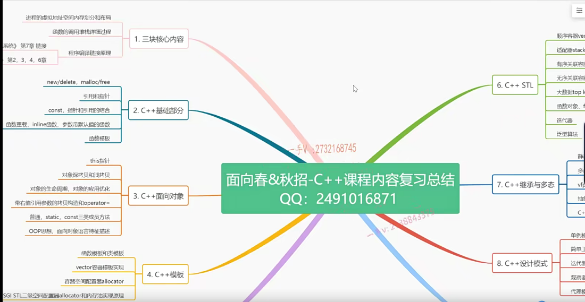

广度和深度，知道别人要问到多深、多广


# 第一节课  掌握进程虚拟地址空间区域划分

进入大厂必会

第一章

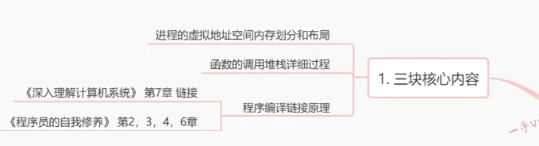

第二章

c语言   与  C++ 不同点

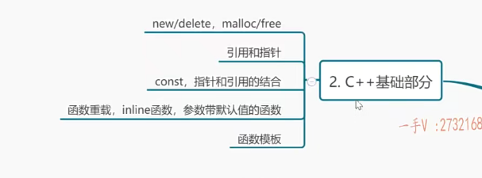

第三章

C++ 面向对象

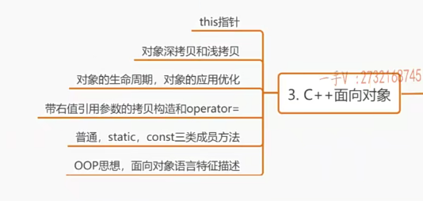

第四章

模板考察较小，但是经常考察STL ,其中用到了模板

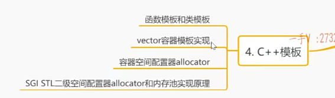

第五章

C++运算符的重载

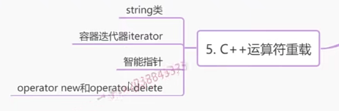

第六章

容器和底层实现

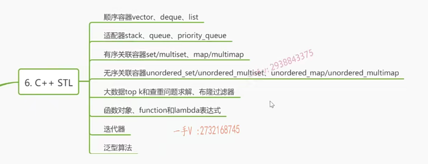

第七章

多态

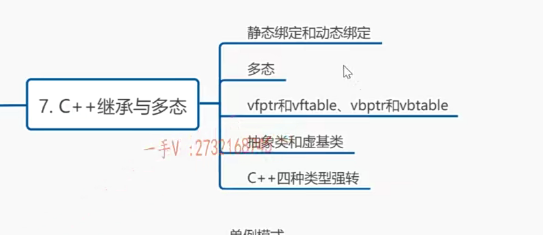

第八章

oop语言  设计模式

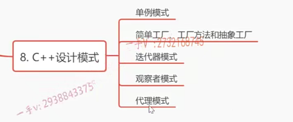

第九章

C++ 11

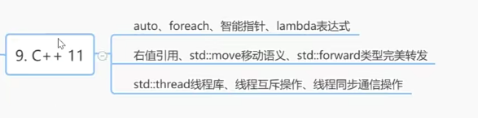


数据和指令放在内存那里？

静态内存区、静态区 、 全局变量区，这些都不准确。

面试要说出来，多练，多刷题


```C++
#include "pch.h"
#include<iostream>
using namespace std;

int gdate1=10;
int gdate2=0;
int gdate3;

static int gdate4=11;   //初始化的
static int gdate5 =0;    //初始化为0的
static int gdata6;		//未初始化的


int main(){
    int a=12;
    int b =0;
    int c;
    
    static int e =13;
    static int f=0;
    static int g;
    
    return 0;
}

```

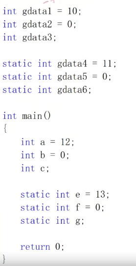

编译链接完成后生成一个可执行文件，window下，xxx.exe,磁盘上的，CPU运行时把程序从磁盘上加载到内存中。

加载到内存中，它都是如何存放内存？有没有区域的划分？划分了以后到底是什么样子啊？

但是  是不可能直接加载到物理内存

学习C++ x86体系，32位linux下学习

Linux系统或者说是内核会给当前进程，分配一个32位大小的一块儿空间。一块空间是二的32次方，它的大小呢？就是四个g。那这块空间呢？我们给它一个名字，这个叫我们进程的虚拟地址空间。进程的虚拟地址空间

大家都明确这一点啊，当我们一个程序运行的时候啊，我们内核系统都会给我们当前进程。开辟一个二的32次方，就是4g大小的。虚拟地址空间。虚拟的注意可不是直接在物理内存上，这是一个虚拟的地址空间。


IBM提出的虚拟内存的一个概念


虚拟内存和虚拟地址空间也不是一回事。


虚拟地址空间啊，其实是不存在的，不要把它想象成我们物理内存上的一块空间。其实，从底层原理上来说呢，这个虚拟地址空间只是我们内核创建了一系列的数据结构而已。


大小是四个g，当然这是跟我们系统的位数有关。空间大小二的32次方，如果是个64位的Linux系统呢？那它的这个每个进程的虚拟地地址空间呢？那就非常大了。2的64次方。


默认被划分成了两部分。

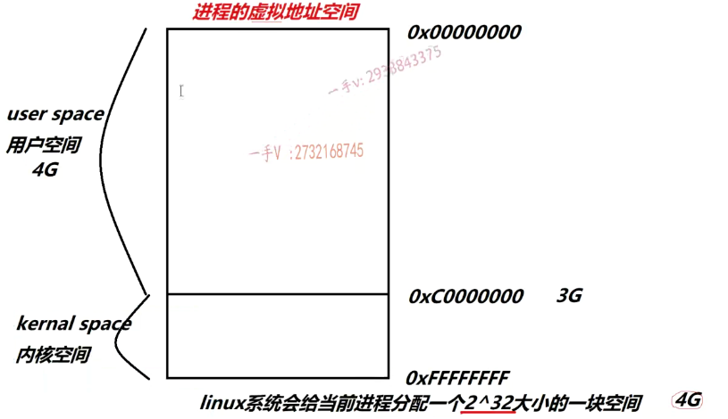

在我们32位linux下，每一个进程的虚拟地址空间，系统默认。就是内核空间是占1g的，用户空间是占3g的，当然这个可以通过修改。这个修改这个操作系统的配置来调整每一个进程。虚拟地址空间中内核空间跟用户空间的大小比例的，当然这是一个默认的那么，注意注意一下。**每一个进程都有这么一个虚拟地址空间。**


每一个进程，在用户空间。它的一个划分是什么样子的呢？它并没有从零地址开始存放内容啊，它前面空了一段从0x08048000。开始存放我们的内容。那么，同学们注意一下啊，那么，这一段空间，那也就是说。

它是预留的。是不能够访问的，那有些同学呢？经常会访问这个空指针啊，经常会访问空指针，比如说。这是一个。空指针，然后呢？他在操作这个字符串的时候呢啊，调用字符串函数，把这个空的叉指针呢传进去了。

通常程序运行垮它就崩掉了，或者说说是它调用了string copy。对吧，strong copy啊，这是我们的一个呃ptr，这是我们的一个dest啊，这是src。对吧呃，这里是叉二氢s2 c=1个钠。从零地址那那就是零地址对吧？从零地址打算拷贝一个字符串，遇到杠铃结束往dest里边拷贝。程序运行直接挂掉，因为呢，上边的这一块空间是不允许访问的，

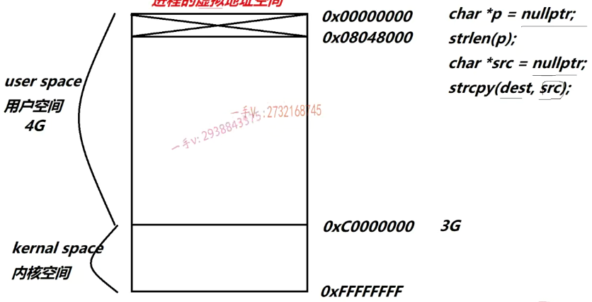

不能读也不能写。啊，不允许访问，你要是访问这一块儿的话呢，我们程序就要崩溃啊，这个系统就要给你报异常。好，那从0x08048000开始放的是什么东西呢啊？同学们这里边儿。你搞清楚一下。这一块呢？啊，**主要放的就是我们所谓的.text**。


**这个指令在运行的时候放在内存哪块区域**，不要说全局变量区或者什么静态区。你就直接说**代码段**啊，或者说**点text段**就可以了，这是呢，在我们一些。就是比较权威，书籍上的一些专业的一些用语啊，这个一一定要阐述清楚。这一部分呢？通常啊，还会有一段叫做.rodata，read only就是只读数据段啊


比如，p指针在栈上，常量字符串就在 .rodata段


只能读不能修改，可以编译通过，但是运行报错

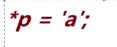

有点编译器必须像这样声明，

大家要知道这一点就是.text跟.rodata段呢。是不允许去写的，只能读。

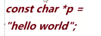


下面   是  .data段，从这个名字就能知道这里边放的是我们数据，对吧？数据那data下边呢，还有一个。点bss，点bss也叫数据段，也叫数据段，这两个段儿呢，它存放的数据有什么不同呢啊，有什么不同呢？**那么.data呢？是专门存放初始化了的，而且初始化的值是不为零的。**

**点bss存保数据就是未初始化的以及初始化为零的。**


同学们还有没有印象？当我们在全局的作用域里边去写一个。全局变量没有初始化，当我们去打印它的值的时候呢，我们会发现它是一个零。它为什么是零？那因为呢？==**它存放在bss段==。**程序运行的时候，把**我们内核给当前的进程分配地址空间**，把我们的程序的数据，也就是**未初始化的数据放在bss**。我们内核呢，会自己负责把bss段的数据全部置成零,未初始化的全局变量，它没有初始化，我们却打印出来一个零，**这都是因为操作系统啊，默认对bss段做的这么一个零初始化**


下一块表示一下这块空间呢，就叫做==堆。我刚说了嘛，这会儿还没有呢，只是个空的啊，我们程序运行以后呢，调用了new或者malloc才会在这儿去给它分配堆内存==。对内存呢？再往下。就是我们的。当前，程序在运行的过程中会加载一些。==共享库也就是动态链接库====,动态链接库WINDOWS上就是.dll linux下就是.so库


函数运行或产生线程时，每一个线程都独有的这么一个stack栈空间啊，函数运行在栈上分配空间，每一个线程在当前进程啊，私有的也只有栈。对吧，那么这占空间呢，是非常非常重要啊，

非常重要的占空间跟其他不一样的地方是。==栈是从下往上进行一个增长==那么。而==堆呢，分配的时候是从低地址到高地址，从低地址到高地址，这么一个增长的这个方向==。


是放我们命令。行参数和环境变量的啊，和环境变量的地方。和环境变量的地方。对吧啊，命令行参数，我们在运行一个命令的时候呢，我们通常呢，会给我们程序呢，传入一些，比如说linux下运行一个。如下

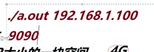

这主要就是我们用户空间啊，用户空间的一个内存的划分，内存的布局，我们内核空间呢？啊，

内核空间，它分成了三块儿区域，一个是dma，大概是一个16m的一个大小，然后是==zoo normal，这个就是我们比较大的，有大概有个800多兆。啊800多兆，这里边儿就是我们经常进程内核空间的PCB块儿，就是task struct的PCB块儿进程，控制块儿都在这里存放，以及我们内核。空间的线程啊，以及内核函数在运行的时候所依赖的占空间，对吧？都在这一部分了啊==。那么，这是我们用==最后一部分，用我们的high memory啊，是一块高端内存，高端内存它是映射我们这个高地址的物理内存的时候，做地址映射用的啊，做地址映射用的这一块，因为不涉及跟我们今天讲的这个这一部分讲的虚拟地址空间==。

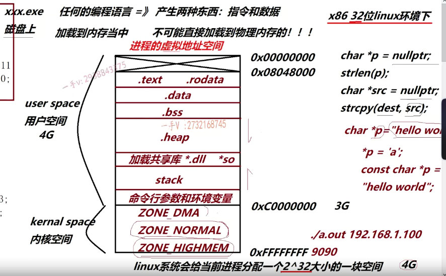


==全局变量不管是。普通的还是静态的他们。都叫做数据，他们都叫做数据啊，每一个data 1 DOTA 2 data 3以及456。他们在编译以后，在符号表中都会产生符号的，都会产生符号的。这叫数据==


.data1 ,data4 在 data段   data2 3 5 6 在.bss段


下面main函数中，这三个局部变量啊，这三个局部变量。它们产生符号吗？我们在符号表中会出现ABC三个符号吗？不会产生。它们对应生成的是指令，比如说a。在我们叉八六体系下啊，叉八六的汇编里边，

它生成的。就是move 指令

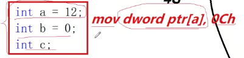

内存里边移到我们a的内存里边啊，它是指令这三个都是的。所以呢，这三个局部变量的定义，

最终产生的就是三个木物指令，这是指令大家都知道，最终是放在.text段里边儿的。


这三个静态的局部变量，静态局部变量，大家都知道它也是放在数据段的，对吧？啊，但是程序运行的时候呢？程序启动的时候，它不会初始化的，它们是第一次运行到它们的时候再进行初始化。==所以e初始化初始值不为零，

所以它也放在data段。虽然初始化了，但是零以及即为初始化f跟g，它们放在bss段==

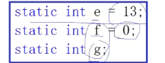


如果我在这打印这个**c的值局部变量c的值。肯定不为零**，它是站上的无效值，但是如果打印g的话，它一定是零，为什么因为g在bss段存放？我们刚才说了。内核起来以后会把进程的bss这一部分的内容**全部清零，所以记得打印出来是零啊**。


但是搞清楚 int a=10 这个指令是在.text段，但是指令运行后 是在栈上 开辟4字节空间 放12


==每一个进程的。用户空间。是私有的。但是内核。空间是共享的。这一句话一定要搞清楚啊==


用户空间这个是私有的。但是呢。但是同学们。这个内核空间。内核空间是共享的啊，这一块儿呢，是大家都是共享的。共享的。共享的。当然了嘛，操作这个内核空间放的就是我们运行的是内核嘛，内核我们操作系统只有一个嘛，在这个操作系统上我会创建很多很多的进程嘛，每一个进程有自己的用户空间嘛。没有问题吧啊


进程和进程之间通信比较难的原因就是因为他们的。用户空间是隔离的嘛？谁也访问不到谁隔离的被隔离开了，谁也访问不到谁。


匿名管道通信，说白了就是什么意思呢？就是在我们内核空间划分了一块内存。哎，

这样一来呢，我进城一。往这个。内核的这块儿内存里，共享的这块儿内存里边儿呢，写一个数据，我进程二和进程三我就都能看得见了。同样的进程二或者进程三往这里边写的这个数据呢，其他进程也看得见。啊，也看得见。好了，这就是我们进程的这个地址空间。