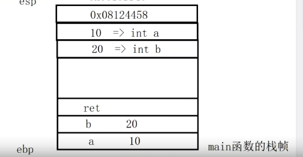
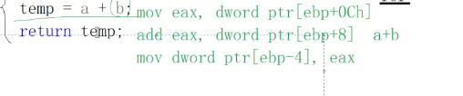

第二节课

```C++
#include"pch.h"
#include<iostream>
using namespace std;

int sum(int a,int b){
    int temp=0;
    temp=a+b;
    return temp;
}

int main(){
    
    int a=10;
    int b=20;
    int ret=sum(a,b);
    cout<<"ret:"<<ret<<endl;
    
    return 0;
}
```

第一个，main函数调用sum。sum执行完以后。怎么知道回到哪个函数中啊，比如说在这里main调用完sum,sum执行完了以后，他怎么知道？我又要回到main函数中的.

第二个问题二。这个sum函数执行完，回到main以后，怎么知道？从哪一行指令继续运行的？

为什么不是回到main函数第一行运行


从汇编指令来看：

esp 栈帧栈顶  低地址

ebp 栈帧栈底 高地址

栈是从下网上，所以是高地址到低地址

**普通局部变量是不产生符号的**，没有一个符号叫做a，这个只不过是编译器给你做的一件事情。你写个**eb- 4**呢，很多人不知道在哪儿不好阅读啊，那么如果你**写个a，我们这阅读这个通过这个它的查看汇编器**。查看这个汇编代码的时候呢，你阅读起来就比较流畅而已啊，你知道呢，==实际上呢，这个生成的汇编指令。就是这个样子的ebp- 4==嗯，就是说呢，在指令上在函数代码指令上访问局部变量，==**局部变量都是通过ebp就是栈底指针的一个偏移。==**


那么ebp为什么要减呢？因为占比是高地址嘛，往上走就是低地址对不对


现在重点来了。到这个这一句代码的运行，第三行代码运行这个sum函数了。**一个函数的调用**。大家还记不记得一个函数的调用要先做什么事情？**对了。先压参数**。从左向右压，还是从右向左压呀？从==**右向左压==**,压栈往哪里压啊？

压栈往哪里压？这里边儿有有同学，有的同学学习很糊涂啊，问老师啊，你这里边==**mov怎么没往栈顶放==**呢？==这里边不是压栈，压栈是push==好不好？这个指令上已经告诉你了。把这个相应的值呢，放到哪块儿内存ebp占比指针的一个偏移的地址。  ==mov不是压栈==


sum函数的调用，一个函数的调用。

首先啊，首先会做的事情呢，就是压栈。压栈把谁先压呢？把b先压b压到栈顶的话呢？是什么样子呢？大家来看。就是这个样子。b的值是多少嘛？b的值现在是20嘛？对不对？把20压到站点20。其实同学们，

你知道这是谁的内存吗？我们画了一个方块儿，你知道这是谁的内存吗？对啦，这就是sum函数形参变量。b的内存。形成变量b的内存。哎，所以同学们从这儿你就能知道啊，函数调用过程中形参变量的内存开辟是在哪里做的？对，是调用方函数这里边儿都已经开辟好的。没问题吧，都已经开辟好了，因为是调方的这个函数的这个实参要压占。


从右向左   push  栈顶


从b内存里边取值。d位儿的ptr b是谁呀？ebp减几对减八，先从b的内存里边儿拿值放到**寄存器**里边儿，再把这个值。push到站上，你看是不是push指令啊？push指令就要压站了啊，就要压站了。没问题吧，接下来该a了，是不是move，比如EX dy的p tre dp- 4。

对从ebp- 4  ebp- 4现在就是a的内存的起始位置嘛，取四个字节的值。就是10放到寄存器里边儿，再把这个东西进行一个压栈。那也就是说呢，在这上边，我需要再画一个框。再画一个框，这里边放谁呢诶？就是放这个十。聪明的同学已经知道这个所谓的压栈，==这个在栈上新分配的这个四字节的空间。就是形参变，就是sum函数形参变量a的内存。==


那么这个函数调用参数已经压完了，压完了该干什么了？哎，接下来呢，同学们注意就是一个。call指令。call指令函数调用指令call指令。函数调用之类啊，这个呢搞清楚。这个。call指令这个call指令会做两件事情啊。


==call一个函数，首先要把下一行指令的地址入栈==。嗯嗯，同学们，你应该能知道吧？对吧？你能想来到时候这一从这儿就进sum函数了，到时候sum函数。它得知道sum函数运行完，

得知道从哪一行指令继续运行啊，你说你不存你下一行指令的地址行吗？你不存这一行指下一行指令的地址，你到时候sum还是运行完，你都不知道上哪儿再继续运行代码去。对不对？这也是我们刚才说的第二个问题嘛s函数运行完了，回到幂以后呢，它是怎么知道从哪一行指令继续运行的？是不是啊？好注意那靠做完这件事情以后呢？当然做完这件事情呢？压榨压榨，你要把这个。是往上提一下啊对。




==esp永远指向的是栈顶啊==，这个不要忘了。那么在这里边。完了以后第二件事情就是进入Sam哎，进入Sam就往上看，就到这儿来了。左括号。有很多同学学了很长时间的c跟C++。呃，**永远觉得函数进来第一第一句话执行的就是我们这里边的这个。inttmp=0.稍微往底层说一点啊，啥也不就啥也不知道。**


在这儿首先第一句话。第一句话展开来看它。注意每一个函数的左括号进来都是这么一个同样的操作push ebp。

啊，这个什么意思呢？==现在进入sum以后，这个ebp指向哪儿了诶？ebp指向的还是main函数的栈底。还指向的是main函数的栈底。那么，现在进入sum以后呢？它首先呢？大家来看push压占指令，它要把ebp。那也就是main函数的栈底地址就是这个东西。先入栈。==

更新一下esp,绿色的就是栈底的地址


第一步 是push ebp 

第二步是赋值  esp给ebp，图2


第三步 sub esp 4ch  相当于开辟栈帧空间


第四步：栈帧初始化

就是一个reps tos的这么一个命令，

这相当于在我们代码上就是一个for循环的命令啊，就是我们for循环的一个命令。for循环命令干嘛呢啊？干嘛呢？那么在我们。gc cg加加下边。函数左括号进来以后呢？左括号进来以后，这三行指令就完了，并没有对栈进行一个初始化操作，但是在我们WINDOWS下VS系列的编译器里边。我们给函数开辟战争。战争开辟完了以后，都会有这么一个类似复循环的人会编指令，把我们战争呢？

嗯，都==全部初始化成0xccccccc==对吧？那么大家肯定见过这个啊，当我们定义一个局部变量inta没有初始化去打印它的时候呢，可能新的一些VS BN其实。直接报错，不允许你直接去打印，直接去访那个未初始化的局部变量啊，但是如果它允许呢，==你打印出来可能是一个负的。858993460==啊，这个其实就是0x0x ccc。ccc作为一个有符号整数打印出来的一个数值。啊，也就是战争初始化了。


刚才ebp这个指针里边存放的就是这个地址嘛，把这个地址入站以后。我就可以让ebp指向我当前的这栈底比了。啊，指向我当前的这个战力啊。这样这样的，然后呢？sub esp减到4 ch，这是esp往占顶地方再往上跑。这就是==给sum函数在开辟战争==。啊，栈帧开辟完后呢，说了WINDOWS上VS系列的编译器会对栈进行一个CC的，==一个栈的初始化==

这边就把sum(int a,int b)的汇编指令执行完了。


这个左括号的汇编指令就完了啊，那这个就到我们中间的这三个代码了。int tmp=0这个对应的汇编指令非常简单，就是一个move dword ptr。ebp- 4，零   p- 40。没问题吧？ebp现在是不是已经到这个sum函数的栈底啦？所以这里边儿。就是在这里边。这是谁的空间啊？是谁的空间？对，这就是temp的空间，

它的值现在给的是个零啊。那么，现在中间的这一句话，


中间的这句话BB从哪儿取啊？嗯b从哪儿取？你看形参变量，这是形参变量，刚说了形参变量。a跟b在哪儿呢？这个是形参变量b的内存，这个是形参变量a的内存，所以在访问a的时候。嗯，逢a的时候诶ebp+4




temp值保存在寄存器


第一步：调用完了，mov esp ebp

注意sum函数现在调用完了，现在得到这个右括号了，哎，右括号了，注意这个右括号的对应的这个指令是什么呢？换成不同的颜色吧啊，对比一下好看。首先，他做的第一件事情呢，就直接是move  esp ebp。大家看我把ebp的值赋给esp，那就直接让esp从上边儿。跑到下边来了


他这就是在回退栈帧嘛。把这个栈sum函数的栈空间交还给系统。大家注意，这个回退栈空间非常简单，就==直接把esp的这个指针从上边儿直接让它esp指向ebp指向的地方。这就是说这样归还给系统了。对站上的数据并没有进行清空。==


啊func，比如说返回一个指针啊，这个是intdata=10。这个return data地址同学们，这个代码肯定是不安全的，对不对？因为fun函数运行完，战争回退。这个占空间已经交还给系统了。啊，但是我我在外边儿有一个函数里边儿啊，比如说int星p=func。哎，我在打印星辟的时候能不能打印出来呢？啊，

能不能打印出来呢？这个是可以的，为什么因为大家看到了战争回退，并没有对战胜的数据进行清理？虽然你把这个局部变量的地址返回来了，在这里边儿在给指针p减引用的时候，相当于是非法访问内存。但这块占占内存的空间数据还在，但是尽量我们不要去写这样的代码，对吧啊？那这样代码很危险的，**因为你在这两行代码中间，比如说你再调用了一个fuz 2，其他函数。哎，**

**那因为这个fun c 2这个函数调用的时候呢，就会在刚才你回退的这块儿站上，是不是继续开辟战空间初始化呀？那把这个值就覆盖了。你在这个函数用完以后再打引擎p就访问不到了data原来的支持了啊，这代码本身就是不安不安全，不要去写这样的代码。**


第二步：pop ebp ==弹出之前的ebp        这样ebp又指向之前的栈底==

接下来再往下看啊，再往下看pop ebp。pop是干嘛呢？不是出战。出站并把出站的元素的值赋给ebp你出站。出战现在战领里边放的是0x0018 ff 40啊。你把这个出出来付给ebp那同学们，你说ebp指向哪里了？哎ebp又回到我们幂函数的这个占底了。现在知道我们幂函数调用sum sum是怎么回到MI函数的吧？唉，那么因为从MI函数进sum的时候呢？啊，进丧门的时候呢？啊，

这个函数第一个就是把调用方占比的地址是不是先压到我当前函数的占比里边来呀？走的时候呢，我从。我我把这个东东西呢，从站底一弹出，从从站从站顶一弹出。以后复给edp，就让我edp指针指向我，刚才调用我的调用方函数的占地地址。


第三步：处理ret 返回值

ret     把出栈的内容 放入CPU的PC寄存器


接下来是RET。也做两件事情，首先呢，它有一个出栈操作。他有一个出战操作。占顶，现在放的是谁呀？这是个0x08124458，这个是谁？

哎，这个就是刚才呢，扩散==（栈顶）下一行指令的这个地址==。出栈啊，然后呢？把出站的内容放入CPU的PC寄存器。PC寄存器里面。大家如果没有忘记的话，应该知道啊==CPU的PC寄存器里边儿放的就是下一行。有执行的指令的地址。CPU是怎么知道上哪去运行指令对不对？它看的就是它的PC寄存器program counter程序计数器啊，我们就称作PC寄存器。PC寄存器里边儿放哪个指令的地址？CPU运行完当前，指令就会去PCB PC寄存器里边儿一看。就知道接下来我该运行这个地址上的一个指令了。==

好，你现在是不是出站把0x08124458这个地址呢？放到PC计算器里边来啦？所以哎，我们CPU执行完这个RET指令，就直接跳到这个地址上。去执行下一行指令了，要调到谁里边呢对？就跳到这里来了。随着。除占esp呢哎，是不是就跑到这里边来了？跑到这来了。

就是这个a的起始内存的起始地址，这就是来了。所以呢，sum函数运行完，它是怎么回到main函数？啊，回到内函数呢，又是怎么知道从这一行指令靠的下一行指令继续运行的呢？对了。==它在进入sum呢sum函数的时候呢，早已经把指令下一行指令的地址呢入栈了。当这个sum函数调用完最后一个右括号，最后一个指令RET的时候出站。把下一行指令的地址呢，直接放到CPU的PC寄存器里边。==


进行下一行指令add esp 8  


相当于esp向下8个字节


是不是交还给系统啊？对，就是这。那到这儿了esp又回到了main函数刚才的栈顶了，哎esp跟ebp就都归位了。一个是指向main函数的栈底，一个指向main函数的栈底。啊好，接下来呢？接下来这个函数调用完了，函数调用完，大家还记得没sum函数刚return的时候啊。它tmp的值放到哪儿了？对，放到EX计算器里边儿，

结果30现在它就把这个30 EX计算器30。30直接放到ebp- 0 ch，也就是放到谁里边了，放到RET里边了。30.啊30。再继续打印。return啊，这就是整个函数调用的过程，函数堆栈啊，函数堆栈。调用了这么整个的这么一个过程。啊，大家一定要把这个汇编指令好好理解一下，我们目的不是为了掌握汇编指令怎么写？


### 总结

一个是call指令做的什么事情，call指令它首先会把下一行指令的地址。入战啊，每一个函数的左括号跟右括号呢都会产生。这个指令的都会做事情的函数的，左括号儿会出现呢，战争就是把我们调用方的占比地址先压到我当前函数的占比。给当前函数呢开辟。啊，就是让ebp呢，再指向我当前函数的占比。再给我们当前战争依据，我们当前战争呢定义的需要的空间的大小啊，给我们当前函数的值。开开辟战争。

开辟完战争以后呢，就可以执行我们被调用函数的这个。代码指令。右括号，右括号是在归还占空间并试图回到我原来的地方。尤其是RET啊RET RET呢，首先是出站啊RET执行的时候呢esp已经指向了我下一行指令地址这个内存了。所以把下一行指令地址呢，直接出站，并把它放到CPU的PC寄存器，那么CPU执行完RET指令下一个该执行什么指令呢？它看的就是PC寄存器里边存的地址。然后他一看PC计算器存的是这个地址OK，那就跑到这个地址上执行指令，哎，

这就是esp加等八。再回退形参内存给系统，那么到这儿esp跟ebp又回到了内函数的占比跟占比。哎，这个就是把。sum函数啊，返回的值在寄存器里边儿携带出来了，携带出来了以后呢，再赋给这里边儿的。RET.对吧，大家还记不记得呢？在C语言里边儿小于等于四字节，是通过EX寄存器呢带的返回值。