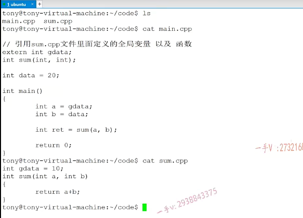
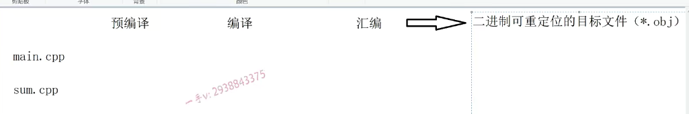
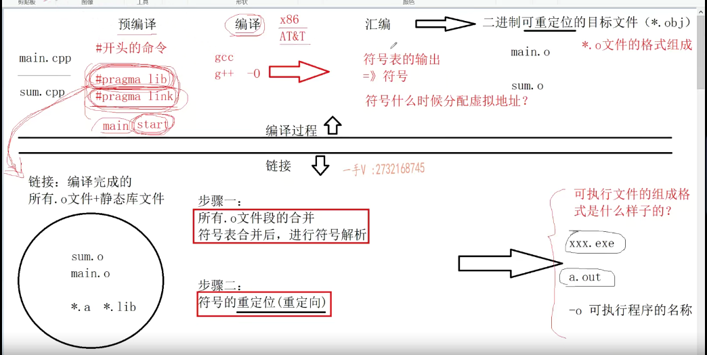
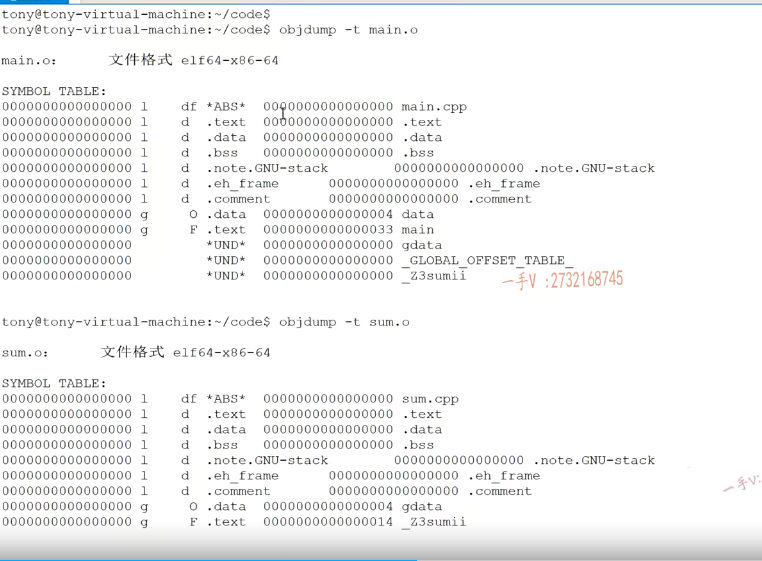

比如说内联函数  从 汇编语言角度来写。

大家可以从前面声明看到，这个g data啊，跟sum它不是main函数这个原文件定义定义的，但是引用了外部文件，这两个都是一个全局变量的声明。

一个是函数的声明，那这两个函这个变一个全局变量，一个函数的声明啊，

曾经面试中啊，我们有的同学给老师反馈，他问我obj文件为什么不能运行啊，那obj文件呢，不是可执行文件，它是可重定位，

它是带重定位的文件。啊，所以它运行不了。那什么叫重定位呢啊？

好。这个呢，最终我们就得到了，我们说linux下了啊me点o跟sum点o这个二进制可重定位目标文件。那么，这是我们上边儿的，上边儿的这个过程呢？就是我们所谓的编译的过程啊，这个是上边儿，这个就是编译的过程。

链接的时候是。编译完成的所有ob ob j或者是.o文件，对吧？.o文件。加上啊，加上静态库文件*.a。那加上动态库文件*.lib。就参加链接了。

那链接里有两个核心的步骤啊，步骤一。步骤一。是什么？步骤二是什么？

我先把这个东西都写出来啊，那么同学们到时候呢，如果我们被问到代码的编译链接原理，你知道它底层是什么过程的，我们不要稀里糊涂的，我们只知道链接。根本不知道链接里边发生过什么事情，对吧？第一个是。所有obj，所有o就是点o文件，段的合并啊，什么叫段的合并，我们后边再讲。

然后进行符号表。合并后。进行符号解析啊，进行符号解析。

那么，步骤二，核心就是符号的重定位。定位或者叫做重定向都行啊，大家看到这个词儿出现了重定位是吧。

这个链接第二步符号重定向或者重定位完成以后呢？我们最终哎就在我们的工程目录下得到了一个。得到了一个啊WINDOWS下，就是我们某某某点儿EXE的文件linux下呢，默认的话就是a点儿out文件，当然大家可以用点儿。

杠o来指定我们可执行程序的是名名称啊啊，这都可以的。对，都可以的，然后然后呢，我们就可以通过呢window下双击WINDOWS下点杠out。来执行我们编译链接好的这个程序。

你需要关注的点啊，你需要关注的这个点有这么几个？有关注的点有这么几个啊，首先在这里边。*.o, a点o。文件的格式。组成是什么样子的？在这里边儿就是可执行文件，可执行文件的组成格式。是什么样子的啊？然后在这里边这两步。做的是什么事情？这两步做的是什么事情啊？

在这里边有一个非常重要的就是。**符号表**。的输出啊，符号表里边符号表里边当然放的都是符号了啊，都是符号了，那符号怎么理解？对不对啊？符号怎么理解？啊，这个东西该怎么理解？那么在这里边。还有我们符号。符号什么时候？生什么时候分配地址啊？写全吧什么的虚拟地址还记不记得我们？

#pragma lib 不在预编译  #pragma link 

这是指定啊，我们==当前程序运行的时候，需要链接的库==。啊，需要链接的库，所以呢，这条指令是必须存活在链接阶段的。因为链接库只有在链接的时候才进行库的链接嘛，所以这个井号处理在预编译阶段是不可能处理的。而这个是什么意思呢？大家都知道啊，大家都知道我们的这个程序运行呢，默认的函数呢，入口函数是不是就是main函数啊？

对，那我现在写了一个，==**比如说我现在写了一个start函数，我现在想让程序运行，以后呢，直接以我start。这个函数名字为入口函数==**，==那我们就可以用program link==。来进行一个指令，这也都是在链接过程中啊，链接以后一会儿讲了以后，大家都知道啊，链接以后呢？哎，链接以后我们会指定当前程序第一行指令的地址啊，

就是入口指令的地址，我们就可以用这个东西呢来修改。啊，我们当年程序运行，不会以内函数作为入口函数，而是以我们指定名字的函数作为入口函数，这些命令呢，就是以井号program。开始呢，这个命令都得持续到链接阶段，因为他们做的事情就是给链接器提供一些材料。啊，指导链接器做事情的，所以他们不会在预编译阶段处理，除此之外呢，

除此之外呢，

井号开头的都在预编译阶段处理啊。编译阶段啊，大家呃，这这个东西呢，就是做我们什么语法分析语义分析对不对？还有词法分析，包括我们代码的这个优化啊，我们代码优化都在这一步。做都在这一步做，大家还记得没用jcc或者是j加加，你可以用大o啊作为命令行参数来指定它的这个优化级别啊0123对吧啊，指定它的优化级别。那么，代码的优化这些东西呢？都是在我们编译阶段做的啊，

### 编译

编译阶段处理完成以后呢？编译阶段处理完成以后，哎，就要生成我们相应平台的这个汇编代码啊，汇编代码，汇编代码的我们汇编呢，有两种，一个是叉八六体系的汇编。啊，一个是at mt就是unix体系下的这个汇编啊，来根据你当前的系统，根据你当前的系统啊。生成特定。架构下的这个汇编指令啊，汇编指令我们前面几节课呢，

也给大家写过一些简单的这个汇编指令对吧啊，你别不需要了解太多，你知道它是什么意思就行了。

### 汇编

在汇编这里边呢？就会最终呢？哎，生成我们的这个点o。啊，可重定位的二进制目标文件啊，目标文件这个汇编呢，就是把我汇编码转成特定平台的这个机器码就是01码。就行了啊，就行了，这就是我们编译过程，

### 链接

链接啊，所有编译完成的这个点儿o文件，加上静态库文件啊。它们合到一块儿。进行链接，链接分两步两步两个核心的步骤，第一步呢，合并所有obj文件的这个段，**这个段是什么意思呢啊？我们后边再说啊**，。然后呢？那当然，这个符号表段也是属于。这个其中的一个段啊，

有好多段子啊ob呃，这个点o文件里边有好多段子，那符号表合并了后进行符号解析。啊符号解析，这是非常重要的一个概念。啊符号解析。我们链接呢，经常会出现很多错误，都是符号解析给我们。出现了错误啊，

最终呢，链接如果不会出错啊，完成以后呢，就会生成我们的这个可执行文件啊，可执行文件，那可执行文件的格式是什么意？是什么东西呢？对不对啊好？那么我们大概呢，先围绕这个，

过程

g加加啊，先杠c对吧，先把它。这个点o文件。sum点cpp点o文件，我们给它。编译出来。编出来好吧啊，编出来。那么点o文件在这里边呢，它里边都组成格式是什么啊？还有我们，

g++ -c main.c -o main.o

### 符号表

包括我们刚才说的这一些内容。符号表这这些东西都是什么意思？好了，大家还记不记得我们第一节课给大家说的啊？那我们不管什么程序呢它？最终产生的两个东西就是指令和数据啊，指令和数据那在这呢，首先大家要接受的。第一个东西obj down可以查看我们点o文件和跟可执行文件啊的一些详细的信息啊，详细的信息好，我们一个一个看一下啊。我们先看它的这个符号表吧啊。上点o。好了，大家一定要理解这个符号表啊，

下面就是打印出来的.o文件的符号表

und是什么意思？你可以这样理解，就是这个符号呢，我现在呢？在代码上用到它们了。用到他们。对的吧啊，用到他们。但是呢，我却并不知道他们是怎么定义的。所以我生成符号，在我当前的me点o的符号表里边，只能给它们这个符号一个und，这叫。

符号的引用啊，不是符号的定义，你看这两个，我们就是在当前的这个文件中定义的，所以一个在data段，一个在代码段，这就是它们符号定义的地方。这是对于符号的这个引用。und。

local g是global的意思啊，local的符号呢，只能在当前文件中看得见。啊global符号呢？在其他文件中也看得见那链接的时候呢？大家知道是所有obj文件在一块链接的对吧？所以呢？对于链接器来说呢，它只能看得见点儿文件里边global的符号。对于local的符号呢，连接器根本就看不见了啊，看不见了。

那比如说我定义了一个静态的全局变量，哎，静态的全局变量大家都知道，

只能是当前文件是不是？可见啊啊，其他文件呢？是不是看不见了？包括静态函数是不是一样的？那在这里边儿有什么区别呢？你当你编译生成的这个点o文件里边儿，你会发现呢？普通的啊，都是global。哎，都是global。啊，静态的都是local

==一看不是und，就知道这是这个符号定义的地方==，一看some这是这个符号定义的地方，那因为这是个函数嘛，函数升的符号是函数名字。这里边儿的函数最终生成的指令将要放在这个代码段上啊，代码段上。这能看出来了吧，而且它俩都没有贝斯塔利的修饰，所以符号都是global的，链接的时候链接起都能看见这个点o文件里边这些符号。哎，首先呢，大家把这个东西呢，