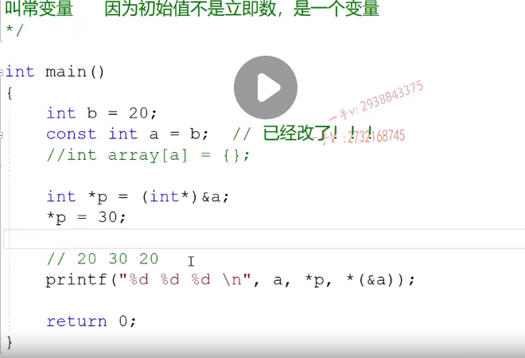

# 全面掌握const的用法

这一课,我们主要开始讲一个新的内容啊，而且这个内容呢是在我们c,c++里边啊，大家。呃，虽然非常常见，但是用起来总感觉是不顺手的，这么一个东西==const==。在后面的这几节课里边呢，我们主要要讲==const以及const和指针的结合，以及const指针。跟引用的结合，以及他们在函数当中的这个应用==啊，力求通过这几节课，

接下来这几节课的讲解呢，大家能够在我们。代码以及函数调用过程中啊，对于==const指针引用，不管是作为形参接收时参的值，还是接时还是作为函数的范围值==。不管是什么情况，大家都能够把它搞清楚啊，因为c跟c将来属于也是可以处理啊，比较偏底层的这个。这应该是他俩本身也是这个处理底层的语言，对吧？所以呢嗯，对于这些方面呢啊，对于这对于这些方面，

大家应该是要胸有成竹，理解清楚，不要稀里糊涂。啊，这样这样呢，我们不管是做笔试题还是面试题啊呃，错误率就会非常非常的低，对吧

**const  指针 引用  在函数当中的引用**

**const  怎么理解？ C和C++中const的区别是什么？**

### C语言中

大家第一次接触const的时候呢，应该都知道啊，就是跟我们普通的变量有一个特点，就是可以作为左值。定义一个a=10作为左值，可以把20赋给a，就是a的内存的值是可以修改的，对吧？

那么定一个const。第一一个变量，前面加一个const就说明这个量呢，它不能够再作为左值啦。啊，你要是写这样的代码的话呢，编译器就会认为啊，不行这个b呢，已经被const修饰了，已经不能再作为左值了，左值就是左边的位置的这个。b变量是吧？不能作为左值了啊，值不能被修改，这就是我们对于const的最初的理解啊.

就是说const修饰的变量,不能够再作为左值。也就是它的值,不能被修改，被修改值。初始化完成后。值不能被修改。

const的修饰的量不能被作为左值嘛，你要这样写的话就错了。下面虽然可以不用初始化（可以过编译），但是我们最好还是初始化（因为之后不能作为左值修改了。）如下图。

在这个C语言里边啊，你把这个const修饰的量。跟普通的变量啊，不要分的太清了。它跟普通的变量一样长，变量它也是变量啊，它跟变量唯一不同的是，它不能作为左值了，除此之外，它没什么区别。

你比如说定义常量它。能用这个a来定义数组大小吗？可以吗？你看看可不可以应输入常量表达式？你这不是常量，==你这是个变量，常变量==。**所以它不能够当做常量来使用或者常量表达式来使用是不能够的啊**。

如下图  a 还是变量，编译无法过去。

通过指针及引用呃把指针所指向的内存的值给改成30了。啊指针现在指向的就是这个a这个内存对吧啊？你注意啊，我们是说呢const修饰的量不能作为左值，就是a不能作为左值赋值，但是不是const修饰的这个量，这个量的内存就不能被修改了。内存是。可以修改的，没有关系，通过指针，我们一下就可以给它修改了，你注意啊const只是语法上的。保证a不能被作为左值修改啊，其实内存是可以修改的，

对吧？我们有很多种办法去修改它。我们也可以直接通过插入汇编指令。

大家看结果呢，全部是不是都是30啊？那也就是说在这里边儿啊，就所谓的a星p跟h地址皆应用。

**都是30**，因为a的这块儿内存值已经被改为30了，不管是哪一种表达式访问的都是a这块儿内存。30嗯。搞清楚啊，搞清楚，因为同学不知道怎么想诶，打印出来是20啊，星p打印出来是30，那这个又不知道是多少了。啊，这都是30在c里边儿，它就是个变量，就是变量啊，就是变量不能作为左值而已。叫长变量，

不叫常量。

### C++中

是必须初始化的。必须初始化啊。叫做常量。

所以呢，既然是个常量呢，那它能不能用作来定义数组的大小呢？作为数组的下标呢？可不可以？啊。看一下这个是没有任何问题的吧呃。

好，那么同样的把我们刚才的C语言里边这里边。得到的这个代码呢，我们。拿到我们C加加里边来，这个在C加加里边printf函数也是照样可以使用的啊，照样可以使用的。我们来打印一下看题，结果呢，跟我们刚才在。

这个。水里边啊。c里边儿的一样不一样，很明显不一样啊，刚才c打印出来的这个东西呢，都是还记着没是3030是不是三个30啊？

就是c跟c++这种const。的编译方式不同。c种count。

就是。当做一个变量。来编译生成指令的啊，那就是一个变量是怎么做的？那么const修饰的两常变量就怎么做？但是呢，在CA加中不同CA加中啊。==所有出现count常量名字的地方。都被常量的初始值替换==。一定要注意这个编译方式啊，替换。那也就是说呢，看着呢，

这叫常量啊，因为这叫常量，所以它能定义数组no no no，那在这里边主要是因为在ci加里边const编译啊。出现名字的地方都被它的初值替换了，所以在这里边儿啊，它是用20再定义数组的长度。啊，用20来定义数组的长度。

星p到底有没有把a内存的值给改成这个30呢？改了，已经改了啊。已经改了。说没改的都是糊涂蛋啊，都是糊涂蛋。在这里边打个断点呢，在内存上去看一下，

你就发现a的内存已经被改了。啊，在这里边之所以没有打印出来30呢？因为这跟a没关系啊，跟a的内存没关系。那这里边儿指针接引用，那取的是真真正正a内存里边儿的数据，这个也就20是由于cons在编译阶段。就已经啊，用常量值了。啊，出现常量民族地方替换了，这就是为什么CA加里边儿啊const量必须初始化啊，不初始化那谁替换呢？对不对啊？

好了，注意一下，这是在笔试过程中出现的问题啊，希望大家对于const在CA加中。啊，这么一个编译阶段替换的过程。

**常变量**

我是用一个变量给你初始化的变量的值是多少？我只有在运行的时候才知道啊。那你说啊，现在在这里边儿啊，你当然你也可以这样认为，它现在在替换的时候就都用b来替换。啊，能够了解吧，那在这里边呢，现在已经不叫常量啦。现在叫什么啦？叫==常变量==了就退化成常变量了，

同学们退化成常变量了，因为呢？初始值不是立即数啊，是一个变量。哦，大家都就不要在这里边进行替换，它现在也成一个长变量了，跟C语言里边一模一样的啊，首先呢，它不能够再定义数组了no。不能够定义数组了，那其次呢？这里边儿也没有什么替换的啊，这里边儿也没有什么替换的，那是打印出来就跟C语言里边儿的一模一样啊。

啊，一模一样的。我们直接运行一下。303030.啊，注意一下啊，在C语言里边，它就是叫做常变量。在C加加里边，它初值是一个立即数的话。就是常量数字，它就是一个常量啊，有这么一个替换的过程，如果初始值是一个变量，那么。

这个也不叫常量了，==就叫常变量了。因为它一样，除了不能当做左直编译方式，跟普通的变量是一模一样的啊==，一模一样的。啊，注意一下这个注意一下这个，这就是const在c跟CA加中啊，他们。的不同啊，他们的不同。大家。理解一下啊，大家理解一下。

