大家好，欢迎继续收看石磊老师的这个视频课程啊呃，这节课呢？我们继续来讲，这个const上节课呢？我们讲了这个c跟CA加里边儿啊。对于const修饰的这个变量，我们叫常量还是叫常变量啊？就是在c跟C加加里边const修饰的量有什么特征？我们讲了一下啊，这节课呢，我们主要讲一下啊const这么一个应用啊应用。就是const和一级指针的这个结合，还有const和二级指针的这个结合。啊const和一级指针的结合以及const和二级指针的结合，

那么这个二级呢？你也可以理解为。多级指针的结合对吧啊？一样的，我们不管是在写代码呢，还是在做一些。题的时候啊，我们。不管是接收函数返回值。或者是实参到行参的传递啊。呃，那么我们经常呢会用到const这么一个东西，那么在跟指针进行结合的时候，它有一些什么样的特征呢？这就是我们这节课啊。

主要要讲的东西。

# 第二节课

我们在CA加里边儿啊，现在我在cpp文件里边儿，这是一个常量。啊，这是一个常量。那么这个常量呢？我用普通指针。能不能去指向它呢？

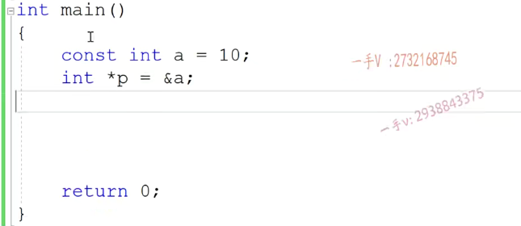

修饰的量在C++里边儿，是不是叫常量啊？叫常量。

它跟普通变量和普通变量的区别在哪里啊？和普通变量的。

区别是什么呢啊？是什么呢？那首先呢，我们说在C++里边啊const就在C++里边呃。

有两点。有两点区别，

第一点呢，就是它编译方式不同。编译方式不同，那么在这个。编译过程中所有出现这个常量名字的地方，都会用常量的这个初值来替换，对吧？嗯。

第二个呢？那就是说呢。不能作为左值了。就是初始化完成后，不能再作为左值了。

那么在这儿呢，你看啊，很明显a本身有没有作为左值啊？a本身没有出现类似于这样的代码。没有出现。没有出现吧对啊。那但是呢？在这里边啊，我们在这给大家写上。

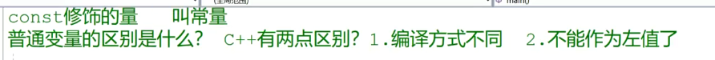

const修饰的量常出现的错误是：

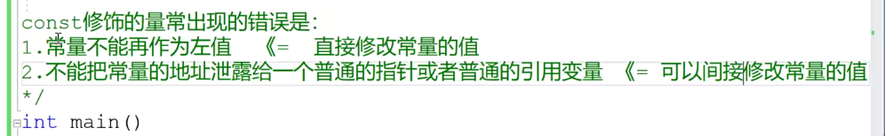

下图是肯定无法通过编译的

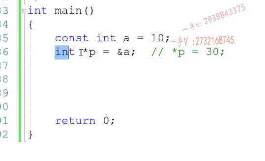

右边的这个类型本身是const int，取个地址，那就是const int *。

==那就是说呢，你不能够试图把一个count int * ,给一个int *。==

其实就是第二点说的星，我们就有地址嘛，学名就是指针嘛，对吧？把一个整形常量的。地址给一个普通的指针，你看不能把一个长远的地址给一个普通的指针，因为这个普通的指针。==可以仅引用赋值的一，仅引用赋值就把常量的值给改了。这是不允许的.==

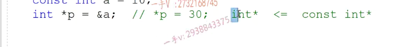

一级指针与const 应用

在C++的这个语法规范上呢？有这么一句话啊，在C++的语法规范上啊C++的这个。语言规范上有这么一句话const修饰的是离它。最近的类型，那也就是说在这个代码中啊啊const修饰的。类型注意是类型离它最近的类型啊。当然是int了，不用说int* 啊，int人家本身就可以组成一个类型了对吧？

但是往往呢，==我们关注的不是const，修饰的是什么类型？我们关注的是const，修饰的是什么表达式==对吧，因为const修，我们关心的是const修饰的什么表达式哎，什么表达式就不能够再被赋值了。

### 去掉const修饰的类型,关心const修饰剩下的表达式

那么很简单嘛，你把这个类型去掉呃，去掉去掉这个它修饰的最近的这个类型啊呃，

**剩下的表达式。那也就是const修饰的表达式**。所以在这第一个里边儿呢啊，离const的最近的类型是整形，那么也就是说counts的修饰表达式就是星p。那么，也就是在这个里边星p还能不能再被赋值啊？不能被复制了。也就是说呢，如果你定义这样的一个指针。呃，==你通过指针可以指向一块儿内存，但是你能不能通过指针仅仅用来修改这块儿内存的值呢？no是不允许的。==

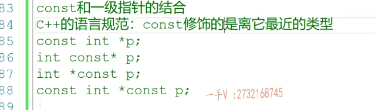

对吧，因为星p被修饰成const，也可以说这个const修饰了指针的指向就是指针。指向的东西不能被赋值了。那么，指针本身能不能被赋值呢？哎我p有可能是刚才指向了这个a。那我现在让p指向b，

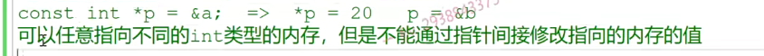

看这个里边儿呢const修饰的最近的类型是谁？有的同学说是星。能不能是星啊？我们能不能用星定义一个变量啊？不可能吧，所以离这个抗子最近的类型啊。

还是整形那么这个抗体的修饰的表达式就是形体，所以呢，这个跟上边这个是一样的啊，是一样的。一样，所以我们一般把这个const写到这个类in这个int类型啊，写成这个类型的左边还是右边呢？其实都是一样的，我们经常啊把它写到这个左边儿，写到这个左边儿啊，就写成这个样子，所以。==这个跟上面一样。啊，同学们。==

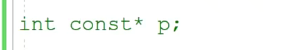

1.但是这个东西就不一样了，这就不一样了。啊，那么这个const修饰的是谁呀啊？离这个const最近的类型是谁？是int星。哎，这回必须是int星了，因为星不可能单独组为类型，所以再往前扩展一下int星，对吧？所以这个const修饰的就是p这个。指针本身啊。

呃，那这个指针什么意思呢？那同学们相当于p这个变量本身是常量了p，能不能再被修改啊？不能也就这个p初始化的时候，常量初始化了啊，==初始化指向哪块儿内存，它就永远指向这块儿内存。你不可能再给它赋值==，让它指向其他的内存。这是不可能的啊呃，它指向这块儿内存能不能通过指针节引用来修改？这块儿内存呢？可不可以？星辟有没有被修饰啊？

2.有没有被抗似的修饰没有？所以星辟。是可以复制的，那么就是。这个。这个p这个指针p现在。是常量，就是指针本身是常量，上边是指针的指向是常量啊p，现在是常量。不能啊，这个不能再指向其他内存。啊，==但是可以通过指针节引用节引用啊，修改指向的内存的值==。

啊，它是可以通过仅引用修改它所指向的这个内存的值啊，这是可以的，那么最后这个呢，相当于就是

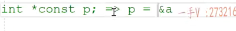

这个指针呢，那就是非常的严格，当你定义这个变量指针变量的时候呢，它指向a那么也就是说p不能再指向其他内存了，由于这个cons的修饰。那这个const呃规定了。p虽然可以指向a，但是不能够通过借引用来修改。它所指向的内存的值啊。

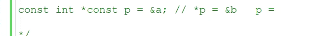

啊，能够明白吧，好了，所以const跟一体指针的结合呢，应该有几种情况啊？

啊，应该有两种，是不是有两种情况啊啊？有两种情况，有两种情况。一种是这个。一种是这个，第一种是const修饰指针的指向，一种是const修饰指针本身

那这个就不行啦，这个不行的，==主要原因是害怕星p用把常量的内存给改了是吧，所以要修改这个，我们应该是定义。就是告诉编译器我们不会修改*p==

这样的一个指针呢？还是这样的一个指针呢？哪样的一个指针啊？嗯，想一想。应该定义什么样的一个指针呢？啊，我们应该在这里边儿，

主要的错误是因为呢，你把刚才把常量的地址泄露给一个普通的指针啦。害怕普通指针仅引用修改常量的值，那你现在只要告诉编译器这个指针不可能仅引用，仅引用是不能作为左值的。编辑就放心了啊，编辑说我把常亮的地址给你就给你，反正你也修改不了我的值，对吧？所以应该选择这种。这种因为对下边这个呢，星脾依然是可以复值的嘛，解决不了问题，对吧哎，所以。

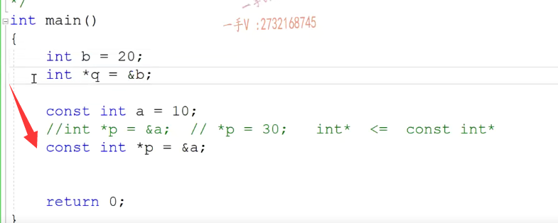

左支是int型，右支是const int型。这个转换。是错误的。啊左直是const int型，右直是int型。啊右直是int型对吧？右直是int型。那这个转换可不可以呢？这个是可以的。

不能把一个整形常量的地址赋给一个普通的指针，这是不行的，那通过这个普通的指针减引用是不是就可以把常量的值给修改了。

可以把一个普通变量的这个地址给一个const行指针，因为普通变量它又没有什么。约束啊，不能作为做这这样的约束没有的。

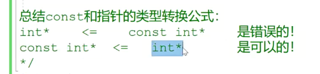

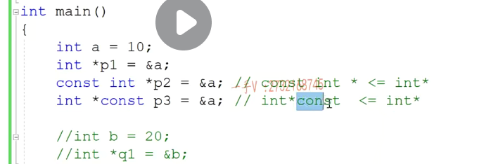

自学的这个指针的时候呢，给的都是这个NULL。不要再用之前的这个指针的，

这个难了，这时候宏 是个零是个整数，这个难呢是不区分指针还是整数的，可以给指针也可以给给整数也可以给啊。这个不好，这个容易跟指容容易跟指这个整数啊，混用啊C++11以后呢，给我们指针专门给了一个初值。n ptr这是专门给指针用的，这是不会和整数进行混用啊，希望大家以后用指针的话都用null ptr啊。

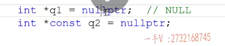

打印出类型

注意那也就是说我问同学们q2的类型是什么？你不要说int星const。==它就是int星==，因为这个const右边儿右边儿是没有星号儿的，所以对于q2来说它就是一个int星类型，不要说它是个int星const。那么，在这里边儿，同学说cons那const做啥了？const表示呢？q2本身是个常量。

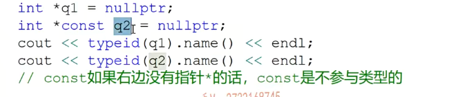

它不能作为左值，不能把它的地址呢泄的泄露给一个普通的二级指针，对吧？这个我们到后边儿讲const跟二级指针结合的时候我们再说。行吧，那你就说这个cost起它起啥作用？这是q2是常量，不能被当做组织来用啊。const是。不参与类型的。

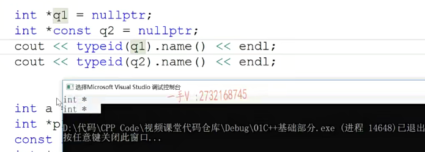

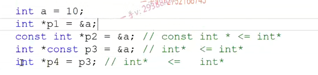

## 课间

==上面交了下const修饰谁，之后教类型转换是否正确==

就是这样的一个问题。啊，那么同学们呢？在这里边啊？一上来基本上大家都能判断是个错误的，尤其是我们今天讲完课以后呢，对这个类型转换，大家已经明白了，左边儿是int型。右边是什么类型？右边的p是个什么类型？是个const int型。对的吧，这个类型转换对不对呢？这个类型转换呢？

用这个公式一看就是错的。对不对？counts in t星是不能转给int星的。啊，那这个const右边有类型的，所以在进行类型这个这在进行类型。这个分析的时候一定要把这个count要加上，这个刚才呢？我们用同样的方式给大家去打印一下，你看打印上边那个p啊，打印上边那个p。我先把这个最后一句话给屏蔽了吧，因为主要的问题就在最后一句话上给大家打印一下，大家把这个搞清楚，你看int count ST型。

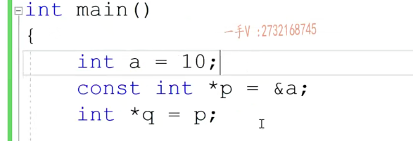

const int *类型

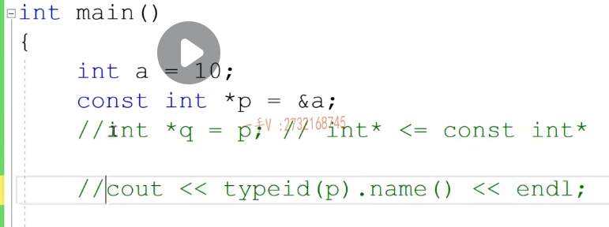

这一判断就是错的，但是面试官会这样捣你啊，会这样捣你捣怎么捣你呢？他问屁。

**放的是不是a的地址，你说是。那么，把p给q那是不是相当于把a的地址也放到q里边了？你说你也说是，那么a是个普通的变量。值可不可以修改？你说可以修改，那么人家就问你，那这有什么错？啊p里边存的是a的地址，把p给QQ里边存的也是a的地址a是个普通的变量，可以修改。所以用普通的指针来指向这个a，没有任何的错误呀。**

所以不要在这里边被这个a捣混了呃，这个类型转换呢，本身就不行，为什么不行呢？不能把整形常量的地址。给到普通指针啊

### 总结一下

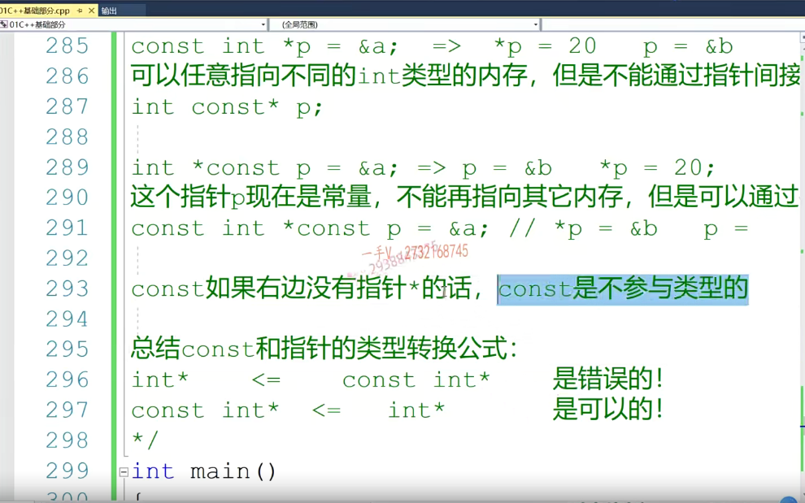

## const 二级指针的结合

