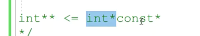

# 二级指针

先看经典题

那有很多同学还是老套路，觉得诶，多了一个const嘛，就跟这儿，你看这一级指针嘛，

这不是转换的时候，这多了一个const。没错啊，没错的。那这个到底有没有错儿呢？==首先这个const参不参与类型一定要参与，因为这个const的右边呢是有指针的，==所以在考虑类型的时候不可能不考虑它。cost如果在这儿的话呢，我们就可以不考虑它了。对吧，一看我的右边没有指针了啊。这个类型转换到底是正确还是错误的呢？啊，要考虑这个问题呢，

目前都是对的

相应的const跟二级指针的结合呢？有三种方式，分别是const int星星q啊。int新const新q。还有int星星const q。就这三种。就是这三种啊，

就是这三种。

第一个 这个const修饰的最近的类型是int的，所以它修饰的表达式是**q，不能被赋值。但是 *q能不能 可以被复制？q本身也是可以被复制的。

第二个 离这个const最近的类型是谁啊？最近的类型是int星。所以这个const修饰的表达式呢，就是星q。

星星q，q可以被赋值，*q不能被赋值

第三个 离这个抗子最近的类型是谁？是int星星。那这个表示呢q本身不能被复制。啊q不能被负。但是新q能复不？星星q能负不？这两个都是可以的。

总结：

onst呀和多极指针结合的时候啊，多极指针结合的时候，两边儿必须都有const或者都没有const。一边有一边没有，是绝对不行的啊，是绝对不行的。

下面这个是一级指针，不是二级，但是也是错误的，看const 右边有没有* 号

总结   下面第二个是正确的，同样是一级指针

这一句话所做的事情。啊，所做的事情达到的这个效果呢？同学们，我问一下同学们是不是就是说呢心q？和p。这两个是属于同一块内存啊。就p访问的也是这个一级指针的内存。星q访问的也是一级指针的内存。对着没？你看在图上p是一级指针的内存。星q的话，访问的也是这个一级指针的内存。对着没有，都是这块一级指针的内存。

### 需要反复想

那么现在也就是说呢我。给星q赋值。是不是相当于就是放到了这个把一个？值啊，放到了这个一级指示的内存里边就放到p里边。能理解不？你看星q我，我要给星q复制那星q的类型是什么？星q里边存的是？整形。常量的地址。那也就是说呢，我现在可以啊，把这样的一个东西就是把这样你看整形常量的一个地址。是可以赋给星q的。

这是没有问题的啊，因为这两两边这个类型是完全一样的啊，类型是完全一样。p取地址是const int型星q是什么类型？是const int型，也就是说我可以把一个整形常量的地址呢？付给新q。啊，四个星球。那你要赋给新q的话，是不是相当于把这个整形常用的地址放到了这个普通的指针变量里边儿啊？因为这块儿内存现在现在有两个名字p。或者星q都代表的是这块内存。啊，你赋给新课友了，

以后呢？那是不是相当于在这个普通的指针里边儿？拥有了一个常量的地址啊。行不行啊？我们前边说了，你能不能把一个常量的地址啊泄露给一个普通的指针啊？const的这个表达式出现错误，我们最终我们都会找见啊，这样的一个出错的原因。常量不能作为左值，这个原因是很明显的嘛，是不是哎一般呢？很好看出来啊，不好看出来的就是我们把常量的地址呢？泄露给了一个普通的吃神了。

它泄露给了一个普通的指针。这个能不能想嘞

就是如果让你这个表达式成立的话，你就有可能把一个常量的地址。泄露给普通的指针。也就是说，把常量的地址赋给星q是没有问题的，但是赋给星q我就跌坑了，就赋就把这个常量地址放到普通的指针里边

你不就是想把常量的地址放给一个普通的指针p吗？==那我现在不是普通的指针了，我现在const修饰星p了==。啊星p不能被赋值了也，你也就不用担心我通过这个指针减引，用把常量的值给修改了，那这个可以不？完美，这个是不是就解决了啊？

为什么会把一个常量的地址放到一个普通的指针p里边？那就是因为呢，你让这个表达式成立，我给星q赋值。由于星q的类型整成常量的地址，我可以给星q赋值，就把这个常量的地地址呢放到你p里边，那它来了，我不让我星q赋值。可不可以呀？==我不让星q复制，我给星q修饰了const，那也就是说现在星q不可能复制==，也就不可能通过这样的方式把常量的地址泄露给一个。普通的指针里边行不行呢？

# 第二节课

我们就随着这个const跟二级指针呢，我们就继续来说吧啊。那么其实呢？嗯，掌握这些类型转换呢？其实呢？就足够了啊，足够了。具体的表达式中呢，再分析一下它这个具体的原理啊，那看这节课呢，我们来。来直接我们这里边儿呢，把以前在面经上啊，就是笔试上呢，

出现的有关跟const指针结合的一些选择题呢。我们给它的综合到一块儿，放到这儿大家来。

**1.错误**

左边儿是const，左边儿是const int型，右边儿呢a取地址a是整形，取个地址就是int型。

啊int星转成const int星，还记着这个对着没有没有问题，这个对着的啊，这个类型呢哎，左边呢是一个int星，右边是什么类型呢？右边p是什么类型是const？特特性。呃，那这个类型转换可不可以？不可以你不能把一个整型常量的地址。放到一个普通的值阵里边，那这样一来呢啊，星q1赋值就把常量的值给修改了。

2.对的

要觉得 int * const ，证明上节课所讲的东西没理解呀。在考虑类型的时候，考不考虑const，主要是看const右边有没有指针，考不考虑它现在不考虑p的类型是什么，不要跟我说星int，星const是int星。count在这里边只修饰p是常量，不能作为左值好吧？那右边儿类型a取缔是什么类型啊？a是整形取缔者就用的行int型转int型这一句类型转换是没有任何问题的。对吧，那这个左边q是int型，右边是什么？

右边pp也是int型。对吧p也是int型，这个类型转换没有问题吧？哎，没有问题，所以这个没有任何的错误。

==不是说是常量，就是把常量的值给别人了，值给别人了，==

3.对的

const 不参与类型

4.d对的

这个呢，第二个是左边是印的星，右边是印的星转换没问题，这个呢，左边是const int星，右边是什么呀？右边是。int星。这个没有，这个p是int型，这个类型转换行不行？可不可以的？

这个类型转换可以的吧？啊，可以的，所以这个也没有问题。

### 第二题

1.错的

*q访问的是一个整形常量的地址赋给把整形常量地址赋给星q，相当于放到这个普通的指针p里边儿了。

2.对的

千万不要说成跟CON const跟二级指针的结合了，const只看右边的指针。所以呢，这个相当于是把前面的类型就当没看见一个整体的类型，给它去掉就是一级指针多了一个。可以不啊，这没有任何问题的，

应该是这样的，const只看右边，将两边*去除

3.对的

const右边没有* 那就是int **

4.

最后这个呢，来看左边儿是int星星，右边儿呢，它本来是int星const，对吧？因为他取了一个地址，所以多了一个星，这个抗史也得考虑了啊。这是const跟几级指针结合呀？对跟一级指针结合，把前面儿这个类型当做一个大的类型去掉，这是const跟一级指针结合呢？const没了。行不行的？错误的啊，

错误的这不行。

const 和一级指针结合

5.错的

是不是const呀啊？各论个儿的就行了啊，各论个儿的就可以了。那么，看这个cost，这个cost跟一级指针结合。对了吧，跟意志之争结合。多雷const这个是正确的吧？哎const跟一级指针结合，多雷const正确再来看这个const啊，再来看这个const。那其实呢啊，这个结合了就把它去掉，对不对啊？

结合了就把它去掉。啊，没有问题嘛。那这个抗磁行不行啊？这个抗磁是不行的，对不对？可以结合了这个指针把抗磁弄没了啊？是不是有错的啊？对，这是有错的，所以e也是错的，要选的啊，要选。好，那在这里边儿呢，

结合的去掉

