# 第四节课

好呃，大家好，欢迎收看石磊老师的视频课程啊呃。那么，从这几个开始呢？我们讲一个新的东西就是CA加的这个引用啊C++的这个引用。科学家的引用啊。呃，这个东西呢？我们。看一下啊，看一下这里边最重要的一个问题，就是==引用和指针的这个区别====啊，引用和指针的这个区别。应用和之间的区别，

这个问题一定要回答啊，这个问题一定要回答。啊，这个问题呢？不回答的话呢？啊，显不显不出来呢？我们。深入啊，或者是。这个。特别的熟练CA加对吧？嗯，就或者精通CA加啊，体现不出来我们的能力啊。

那么，引用和指针的区别呢？回答的时候呢，可以简单的回答也可以。比较深的这个方式来回答啊，那我们今天这节课讲完，希望大家呢，对这个问题的这个理解呢，更深刻一点。那都讲什么内容呢啊？那我们主要是讲这个普通的这个左值引用。和右值饮用啊。那么再讲一些呃，引用的这个。实例啊，

应用的实例，我们有什么好处对吧嗯？

引用首先记住的第一句话就是我们经常看见这句话。==引用是一种更安全的这个指针==。

啊，有这么一种说法，对吧？那这个说法到底对不对呢？我们来看一下。那我们定一个变量。然后定义个指针去指向它啊，那在这儿呢，我就可以定义一个变量。什么样的变量呢？叫引用变量啊，

引用变量。来引用这个a内存啊。

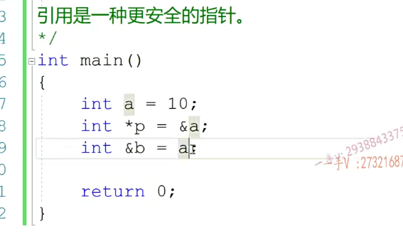

这两句话非常相似啊，这个是用指**针指向a内存，因为指针有自己单独的内存，所以这里边需要取a的地址。**

而**引用的话，直接让它。直接给它指定了引用的这个内存就可以了啊，引用内存就可以了**

==引用是必须初始化的。指针可以不初始化==对吧啊？因为指针你可以直接定义个指针啊，比如说我定一个。这么一个指针，当然最好你初始化一下，不知道指向谁，你就是初始化成一个n啊，但是引用呢，不能只定一个引用变量而不给它。指定它所引用的这个变量啊，引用的内存引用是必须初始化的。所以呢，为什么说是引用数据更安全的指针呢？

因为我们在用引用的时候，我们可以保证它一定会引用一块内存。而当我们用指针的时候呢？那这个指针有可能是一个野指针，或者是一个null指针对吧啊？那就需要我们有开发者来自己来保证。啊，它的正确性了。

这三个东西呢？属于同一块内存的。是属于同一块内存的啊，同一块内存。那么，星号p大家知道是a啊，引用变量哎，

引用呢？我们经常说呢，它是。它所引用内存的一个别名，也就是说呢，现在a这块内存的名字叫a，也可以叫b，也代表a这块内存

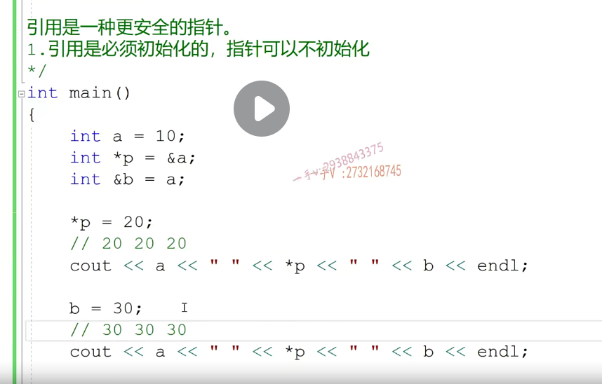

启动一个调试。当程序到达这里的时候呢，我右键啊，我转到这个反汇编这里边儿。那么大家看啊，定一个引用变量。跟定一定一个指针变量，跟定一个引用变量，在汇编上有区别，lea是一地址的move是移植的，它把a的地址呢？先放到eax寄存器当中，再把这个eax放到p的内存里边。没有问题，当我定义为引用变量，

引用a的时候，大家看也是先把a的地址呢放到寄存器里边l1a。拷贝地址，然后再把eax寄存器呢放到b。的四字节的内存里面。那就证明定义一个指针和定义一个引用呢，是一模一样的。一模一样。

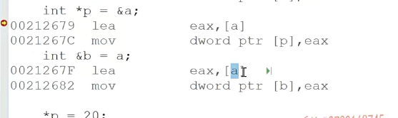

所以可以看到啊，==在这个指令在汇编汇编层面啊，指令层面呢？这个没有引用，或者是指针之分的啊，都是通过我们地址的操作，也就是指针的操作来进行的。==

那么你可以这样认为，就是对于引用的处理来说呢，底层都是通过指针的方式来进行的。啊，而只不过呢？用引用我们说了嘛，它是一种更安全的指针，当我们定义引用变量，其实指令上呢，也是在定义一个指针。

当我们引用变量赋值呢，它会自动做一个指针的解引用操作啊，

当我们定义引用变量的时候呢？一是要初始化，二是你初始化的，这个值一定要能够取地址。因为它在指令上生成的时候是把右边儿这个它所引用的这个值的地址啊，拿出来放到底层的一个指针内存里边儿。对吧，然后呢，通过引用变量赋值的时候又是从底层的指针呢，拿出来地址再做地址解引用复制。所以呢，当我们直接去写这样的一个东西的时候呢。

**这个表达式是不行的啊，是不行的，**

为什么不行呢？因为20是无法确定值的。所以这条指令，这条引用变量的定义呢？其指令根本就无法生成啊，其指令根本就无法生成了。

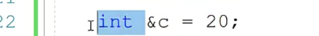

==引用只有一级引用==

一级引用。啊，没有多级应用。那不像指针呢，指针可以有一级。指针也可以有，是不多级指针啊啊，也可以有多级指针？这个都是没有任何问题的啊，引用只有一级引用，没有多级引用指针呢，可以有一级指针，也可以有多级指针。

之前学习基础时常用到swap

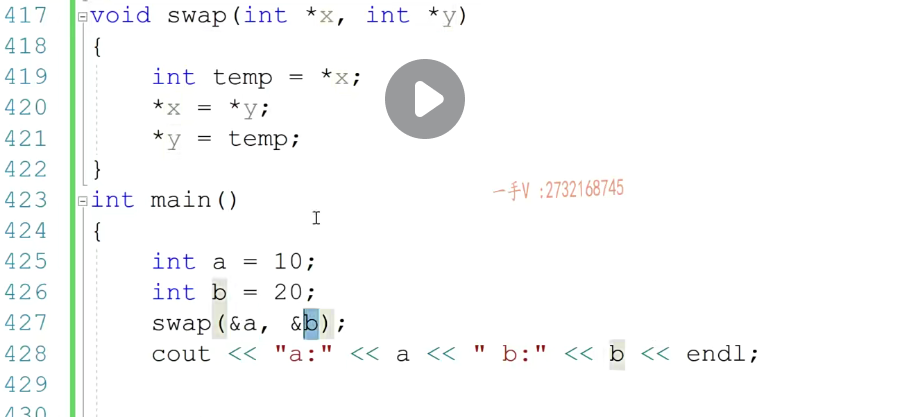

引用

那我们还可以写一种swap。啊。那这个是用来接触什么东西呢？看一下，这个是用来接受什么东西啊？这个是用来接受引用，对吧？接受引用。哎，那我们现在呢？接受引用的话，

我们就不用自己取地址了，因为呢？用引用变量来接收这个。变量的话呢，接收一块儿内存的话呢，我们自动呢，是会把这个a跟b的地址呢给取出来存进去。其实呢，从汇编上来说，这个东西呢，跟这个东西呢，没有任何的区别的，没有区别啊，没有区别，没有区别。

引用底层就是转换成指针来实现，那也就是说问AB这两个实参传给型参的时候传的到底是值还是d值嘛？传的当然还是地址了，对吧？这里边操作x的时候，你操作x的时候，它会把它所引用内存的地址。取出来自动做一个解引用操作，跟上面是一模一样，但很明显用引用是不是就方便很多啊？对，就方便很多啊，方便很多，这个也是。能交换没有任何问题啊。

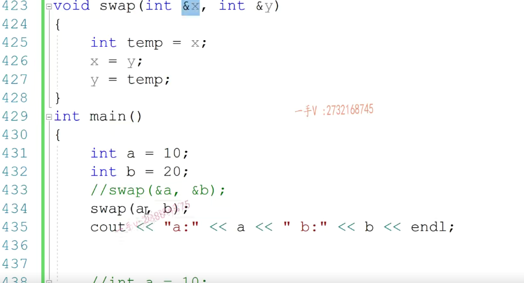

没有任何问题。所以呢，希望在学完引用以后呢，希望大家以后在代码上啊，包括我们以后在写代码的时候呢，代码上。我们如果能够用于应这个应用引用的地方呢？我们尽量选择这个引用它，相对来说是。使用起来，==一是简单，二是更加安全一点啊==但是当然了c跟CA加里边儿肯定是离不开指针的，对吧？指针的应用也是非常广泛的啊，

==定义一个引用变量。和定义一个指针变量。其汇编指令。是是。一模一样的啊，==

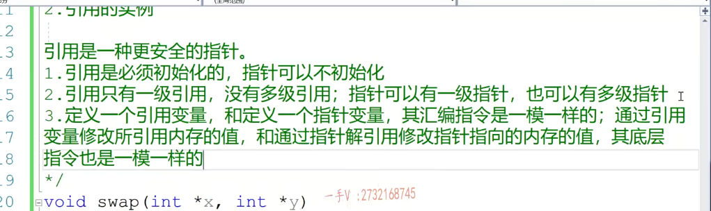

下面语句，打印出来一个20 ，一个4

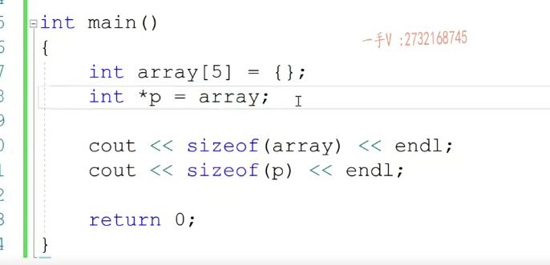

那么定义引用变量

如果是数组

先用指针的方式，就是数组指针

int （*q)[5]=array;

转化为引用  int （&q）[5]=array;

==此时打印引用值为20==

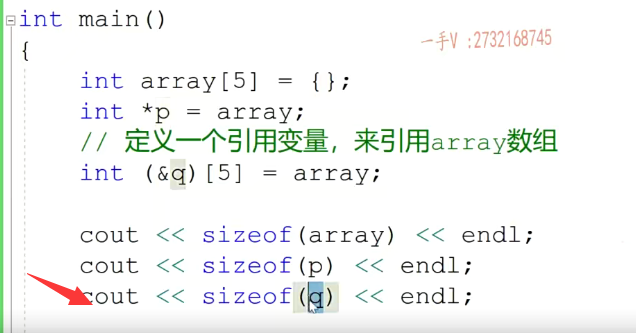

通俗来讲，就是引用是它所引用内存的别名，所以你打印size of q就是在打印size of rain。诶，或者说我们看看指令了嘛，当你使用引用变量的时候，它总是会做一个解引用操作的，就是从它底层呢。

把它所引用内存的地址拿出来，然后做一个解引用，所以你访问q就是在访问a。这两个是一回事。所以，把引用变量跟指针呢，要区分开，现在相当于呢，给这个数组啊，数组又起了个名字叫做t5。啊orange跟q是一回事儿。好吧，注意一下这个引用的一个使用。

**定义引用变量，如果对于复杂点儿的引用变量。你不会定义的话，你可以先定义指针变量啊。先给你所要引用的这个东西取个地址。哎，然后看我这指针变量该怎么定义个指针指向它？哎，定义指针指向它了，以后我们右边的这个。取历史符，把左边的星号一覆盖，这就变成了一个。**

**非常标准正确的一个引用变量啊，引用变量。没有问题吧？好了，希望大家把这个搞清楚啊，把这个搞清楚。**

## 下半节课

左值。

什么叫左值啊？左值嘛，就能作为左知就是它。它有内存，有名字啊，内容可以。不是内容就是值可以修改的。啊指可以修改。我们就把它叫做左值啊，把它叫做左值对吧？有内存有名字值是可以修改的。

就是左支。对吧，那么比如说我们这个a就是左支，我们左支的话呢，就可以用我们刚才学的这种引用呢来直接引用。它因为它有内存嘛，==有名字可以取地址==嘛，是不是呃？那我们定义引用变量，意思就是说呢，把右边这个东西的这个地址取出来，放到它底层的一个指针变量里边。是不是刚才说了，你能不能定义这样的一个引用变量呢？可以吗？

定义引用，变量引用一个20行不行？这个20是不是左值啊？啊，它要是能它要是左值的话就可以当做左值了，你能不能给20负40啊？肯定不行，==所以20叫做右值==。==它是右值，只能放在我们。这个操作符的这个右边==，右值，你可以这样认为啊。

没内存。这个20当然没内存，它是个==立即数在相当于直接放在CPU的寄存器==里面对不对？没有内存啊，没有内存。它没名字。没名字，没有内存，没名字。是不是啊？所以用左值引用，能不能直接引用呢？我们直接运行一下呗。你看是不行的。对吧

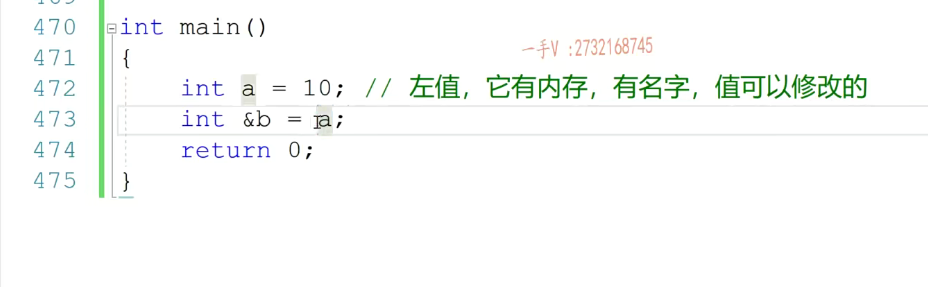

### 右值引用

看起来好像像一个二级的引用一样，就有两个引用符号

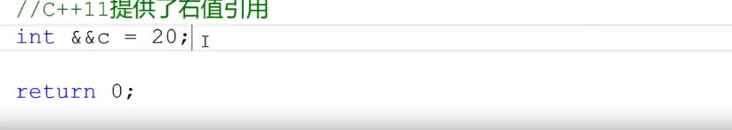

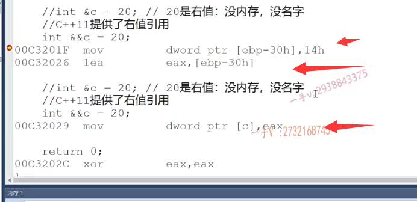

这是左值引用，直接引用这个右值行不行呢？这是不行的，对吧？但其实呢，我们是可以通过一个const引用来引用这个常量的。

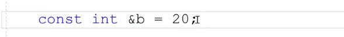

const int &d=20；

和上面右值引用的汇编指令一样，但是不能修改。

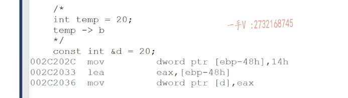

能不能大家能不能理解这个对于右值引用变量本身呢啊？那它到底是一个左值还是右值？它有没有名字？有没有内存呢？你就这样考虑就行了嘛，对不对啊？那这个代码编译是没有任何问题的，所以呢，

这里边你能不能理解这句话一个？右值引用变量。本身是一个左值啊，==本身是一个左值==，右值引用变量呢，它可以引用右值，但是变量本身呢，==它是一个左值，因为它有内存，有名字嘛==。是不是就是个左直嘛，所以它在引用的时候得用左直引用来引用啊，你能不能用一个右直引用来引用一个左直呢？你看一看。这不行的。

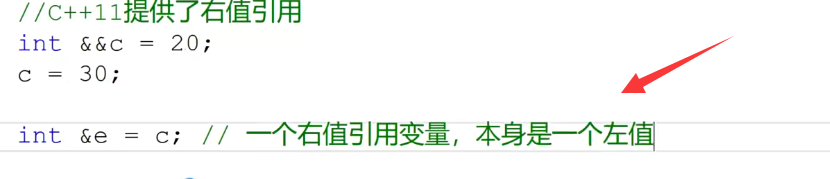

右值引用是必须来引用一个引用的，因为右值引用在生成指令的时候，==你们看它是必须生成临时量的。你这个有内存，人家给你生成临时量干啥呢==？是不是啊？所以呢，右直引用就是用来引用右直的啊，你对于左直变量，你不能用右直引用来引用。

==当我们用右值引用 来 引用左值，是不行的==

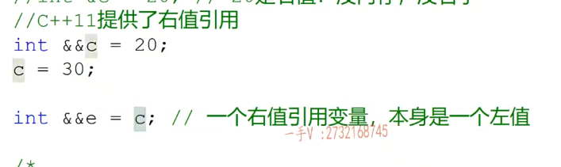

总结：

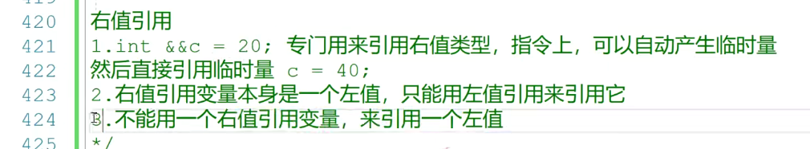