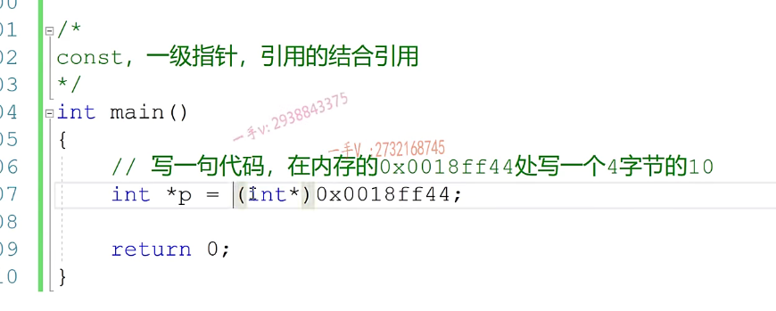

# 第四节课

好同学们好啊，大家好，这个欢迎收收看嗯，石磊老师的视频课程。今天这节课我们主要讲了const和一级指针和这个引用的。这个结合应用啊，结合应用我们来举一些非常简单的例子呢，先来看一下它们在一块的话呢。呃，结合的时候我们该。有怎么样的一个理解啊？怎么样的一个理解在我们后续写更多代码的时候，我们用起来就得心应手了啊，得心应手了。那么，

写一个四字节的一个整数啊，整数是对吧？呃，那这个大家应该都会写。嗯，定义的引用变量呢？先保留这个内存地址，但是在这里边儿啊，不要直接。写这个东西啊，你写这个东西的话呢，这是个整数对吧？一定要进行一个类型强转啊，==大家一定要进行一个类型强转====，这个才是可以的。

