# 第5节课 

### 简介

大家好，欢迎继续收看石磊老师的视频课程，今天这节课呢，接着上面的部分，我们继续讲啊，前几节课我们主要讲了这个。构造函数、析构函数、拷贝构造、跟复制运算符的重载、对吧？那么这节课我们讲的这个还是opp c++面向对象基础这一部分的，接下来的一个问题就是。==构造就是那个构造函数的初始化列表啊==，构造函数的初始化列表。这也是我们在编写类的时候，尤其是在构造函数的时候呢，非常重要的一点啊，非常重要的一点，==那么构造函数的初始化列表是干什么用的==？啊，是干什么用的？它到底有什么样的功能呢啊？我们来通过一个示例呢？我们给它看一下。

## 举例

还记得我们第一节课呢，学OOP的时候举的这个商品的这个类啊，举的这个商品的这个类。那么在这里边呢，我们给它一些成员变量，这是**商品的这个名称**。对吧，还有**商品的数量**啊，还有**商品的这个单价**。我们可以在这里边儿给商品提供啊**构造函数**。那么，大家来分析分析啊，你看看这个类里边儿，这个类产生的对象会这个它做默认的拷贝构造或者赋值。操作呢，就是内存的拷贝会不会产生问题呢？你想一想。这是等于a。再用外部传进来的这个单价price p来给我的price初始化。这里边儿构造的时候没有占用外部的资源，所以我们的析构函数依赖编译器给这个类产生的默认的析构就可以。编辑本身还可以给这个类产生默认的构造，就是不带参数的构造，那就是空函数嘛，对吧？什么也不做，但是我们现在自己提供了一个带三个参数的啊，叉儿星int tab带三个参数的构造函数。那么，现在编译器就不会再给这个类产生一个默认构造了，所以呢，我们这里边儿析构函数，我们也不用提供了。啊，不用提供了。

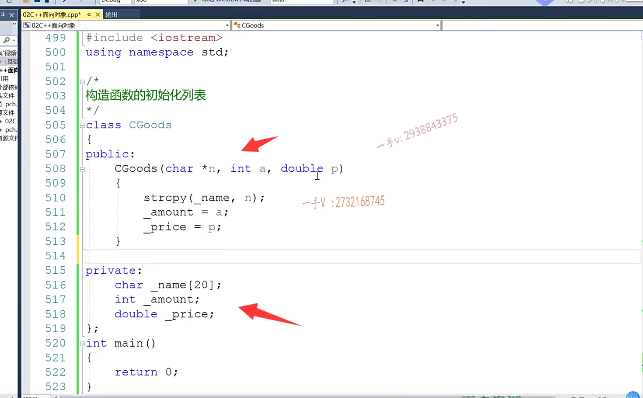

### 给个show()方法

在这儿呢，我想给这个商品提供一个show方法啊，这个show方法主要是打印一下相关的一些信息。比如说这里边的是name啊，打印一下name。再打印一下这个amount。啊，再打印一下，我们把这个数的这个函数括号加上啊。然后呢，再给它打印一下它的这个price。啊。那么就是把这个对象的三个成员变量打印了一下，前几节课说过呢，我们成员方法一经编译都会多一个this指针对吧，用来指向呢，调用该方法的对象啊。大家注意一下，包括构造函数跟析构函数里边儿呢，都是有这个this指针的啊。

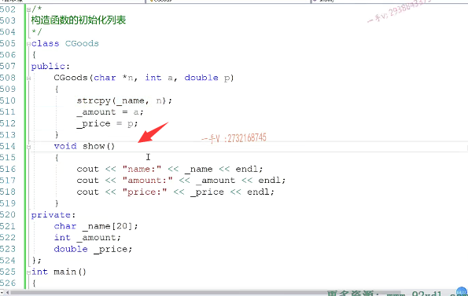

## Date类

现在我们来考虑这样的一个问题啊，我们想给这个商品啊，添加一个，比如说生产日期，那就是年月日的这么一个信息啊。当然了，我们有些啊，同学朋友呢，我们考虑这个问题的时候呢，就觉得在这里边儿，我们加一个。给它加上相应的属性就行了，比如说年。月。日。对吧，加上相应的这个属性就可以了，是不是啊？那当然这样可以这样可以，但是不通用，也就是说呢，你添加这个年月日的这个信息，只对这个商品要用，因为你把它作为商品的这个属性。但是这个年月日不仅仅可以作为商品的生产日期，还可以作为商品的这个。就是过期的这个日期对吧？它可以作为我们比如说人这样实体的这个生日 日期，入学 日期，各种各样需要日期的地方都可以使用到我们的年月日。

### 年月日不写成成员变量，而是抽象成一个类

所以基于这一点考虑呢，我们把这个。单独写了一个，比如说是date日期类。我单独把它抽象出来，抽象成一个日期类，描述日期的啊，这么一个类。

当然了，它可以用在我们任何需要用到日期的地方，比如说是这是年。这是月。这是日。没问题吧，在这里边儿呢，我们给它啊，我们给它添加了int y int min int day。在这里边儿呢，我想啊，对用户传进来的这些年月日给我们的成员变量进行一个。初始化啊，month month。

### 也提供一个show方法

在这里边儿又有一个。d啊。那在这儿又有一个show()方法了，这个show方法呢，就是提供给外部啊，调用这个show接口。来打印我这个年月日的信息啊，我这个打印出来呢年。啊，再打印。month月。再打印这个日啊，我打印一下这个年月日的信息也di了啊，打印一下这个。年月日的信息。

啊，没错吧好。

## 两个类的关系：组合

那我现在写的这两个类啊，我怎么去组建这两个类的关系呢啊？信息是我们商品。啊，就是这个日期啊，日期是我们商品信息的一部分，这个是一个。date信息啊，信息是我们cgoods。这个商品信息的啊。商品信息的一部分。对吧啊，就是满足呃。part of的关系。==那么这两个类呀，适用于组合的关系啊==，适用于组合的关系。我们后边儿再讲oop，还会讲到oop的继承，那继承是满足一种呃，看的谁谁的一部分的关系。好。那我们来看啊，所以两个类是组合关系，到底怎么样？写在代码上体现出来它们的组合关系呢？那也就是说用这个类。所定义的一个对象。

date对象，大家看啊date是时日日期时间的意思啊date对应的一个对象。作为c goods这个类的一个成员变量，那因为这个变量本身就是个对象，所以我们也把它叫做成员。啊，这就是组合，那么在这里边儿体现了一种组合的关系啊，那属性嘛，就是我们当前这个商品呢，是不是所有的一些属性信息呀？那我们的日期信息属于是属于你商品信息的一部分组合的关系。那我在这里边啊，

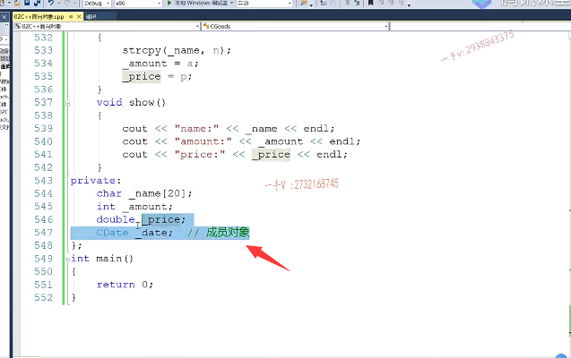

## 编译出现错误

直接编译一下代码啊，编译一下代码，大家会看到这里边我们有一个错误啊。就是在c固子的构造函数这里给我报了一个错误。什么错误呢？就是这个c beta啊，他他说这个没有合适的默认构造函数可用。啊，告诉我这个CD at a没有合适的默认构造函数可用。CD的没有合适的默认构造函数，他为什么问我要CD的默认构造？

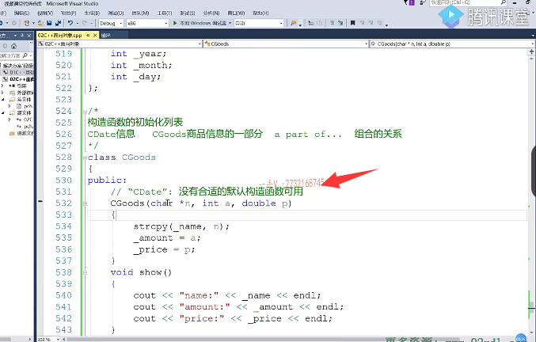

### 有了自定义的构造函数，所以不产生默认构造函数

大家来看这东西毕竟是一对象。前边儿我们说了一个对象的生成有两部分啊，第一个是。分配是不是内存啊？

第二个是构造函数，第二个是调用构造函数。还记得吧，那一个对象的生成这两步是不可或缺的啊，这两步是不可或缺的。那么，在这里，我们考虑一个问题啊，这个信息这个对成员对象，既然作为我商品的一个成员变量，那么也就是说呢，唉，当我给这个类型。定义的对象开辟内存的时候，它的内存就已经有了。

但是它作为成员变量，它需要构造的，我们在这个c goods类里边儿写代码，写的代码从来没有在任何地方去指定过date的。构造函数。没有指定过，是不是那么注意在CA加里边OP语言里边？当你定义一个对象，你却没有指定。它的构造方式的时候它。用的就是它的默认构造函数，我们没有在这里边儿给data指定任何的构造方式，没有指定我们根本没有指定，所以在这里边儿编译器调用的就是data的默认构造函数。但是很可惜CD at a现在没有默认构造函数，

为什么呢啊？编辑本身会给这个类产生默认构造，但是因为我们在这里边儿啊。自定义了一个啊，自定义了一个构造函数自。定义了一个构造函数，此时呢，编译器就不会再。再产生默认构造的。所以在这里边编译出错啊，

很明显我们date这个对象啊，它的构造函数需要我们用户传入一个年月日这么三个整数，是不是信息呀？那么来看一下，

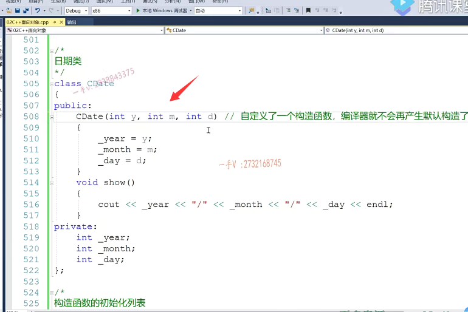

## 初始化列表的使用

那我们现在定义商品的时候，给商品的这个构造函数去添加年月。日，那我们的这个年月日这个信息是如何传递给这个date的？如何传递。我们如何在我们c库的代码中去指定date的这个构造方式？那么，这就是我们今天所要说的构造函数的初始化列表的功能啊，那么我们可以这样去写在构造函数后边加一冒号。唉，然后就可以指定它的。y md.然后就可以指定它的构造函数呃，这个date date对象的构造方式，这一行太长，

我们往往呢，也会把它进行一个回车啊，写到第二行来。这就是指定了这个对象的构造方式，就是初始化方式。我们经常呢，就把构造函数这个右括号啊的冒号后边这列表呢称为。构造函数的初始化列表，这个列表是做初始化用的，初始化列表，初始化用的，它的初始化呢？这个呢，叫做。构造啊，

当前类类型。构造函数体啊，构造函数的函数体。这个构造函数初始化列表先执行的。然后呢？当前，类类型构造函数体呢是？第二次执行啊，是第二次执行。这个先执行，这个执行完了以后这个执行。啊，大家搞清楚这一点啊，大家搞清楚这一点。所以呢，

我们可以在构造函数的初始化列表里边儿。去指定我们当前对象成员变量的初始化方式。

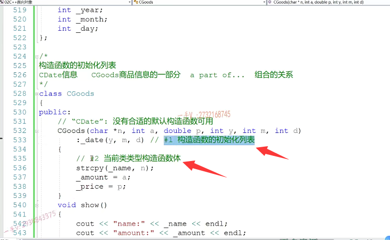

### 初始化列表只能简单的初始化

其实同学们，你可以在这里边啊，把这个amount啊。就是a跟price呢？都写到我们构造函数的初始化列表当中。注意构造函数的初始化列表只能写简单的初始化啊，==你像这种对于name的初始化，我们是需要调用c函数的，==那么在构造函数初始化列表里边儿，我们是。没有办法去继续啊，这就是构造函数的初始化列表啊，构造函数的初始化列表呢？在这儿呢唉，我们可以对我们的当前对象的成员变量指定初始化方式。

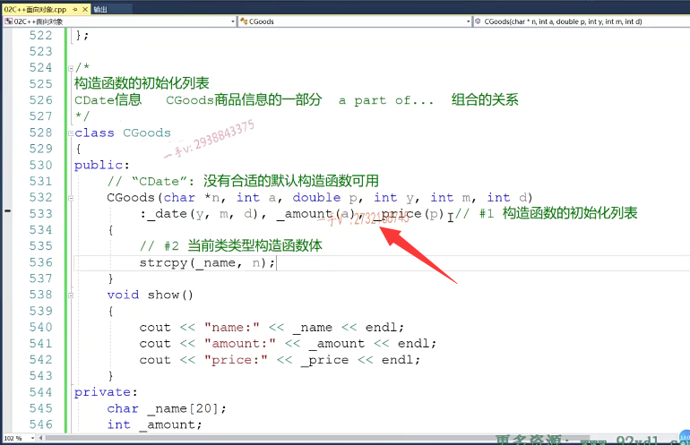

### 初始化列表与在构造函数体中初始化的不同

那有的人说。你在初始化列表里边写初始化。跟在构造函数的函数题写初始化。有个啥区别呢啊，那为了告诉大家区别，我把这个都换行一下啊，我们一般在CA加的开源代码上看到人家包括CA加的标准库的源代码。人家的这个初始化啊，一个初始化都写到一行对吧啊，看起来比较方便一点啊，

就这个呢。把这个初始化写在构造函数的初始化列表，相当于你相当于呢，就是定了一个这个。啊，先定义这个变量的时候，直接做了一个初始化。没有问题吧啊，定义变量的时候直接做了一个初始化，而把它写在构造函数的函数体呢，是相当于这个操作的。唉，这个你能看来吧，这个是直接初始化，这个是先定义了这个amount变量。

然后呢？用这个a给amount赋值，这个叫初始化是吧？它正在定义的时候呢？给它一个初值，这个叫做赋值，就是它已经存在了。它在存在的情况下，给它赋个初值a，当然大家如果把这两个代码呢啊放在我们的内函数中打个断点，看一下它的返回边。那我们会发现呢，这两个对于简单类型，对于内置类型来说，编辑内置类型这个整形嘛，

对吧？他们的汇编指令是一模一样，没什么区别啊，没什么区别。

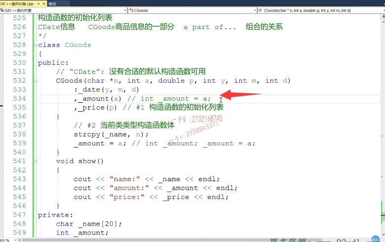

## 类的列表初始化

### 指定了对象的构造函数

但是呢，同学们来想，如果这个类型这个类型是我类类型，比如说在这里边CD的话。哎CD的话，那在这儿他们就不同了。它们就不同了，在这里边，你写这个相当于是c date啊，我把这改过来啊，这是intc date杠。

杠date哎，相当于y md，大家现在应该能看明白了吧？在这儿是直接呢，是不是指定了date这个日期对象的？构造方式啊。你看对不对？是不是指定了这个日期对象的构造方式？==指定了日期对象的构造方式。==

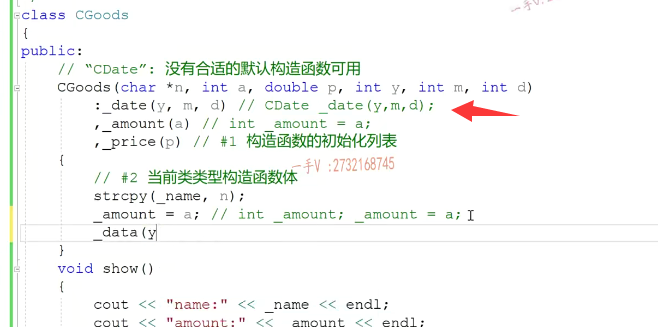

### 写在函数体中没有默认构造，会报错

那么，如果呢？把它写在呢？就比如说有的同学可能会这样写吧啊，其实这样写呢。这样写呢啊，

有有同学可能是这样的啊c date。y md乱七八糟写成这样是吧？那么如果你这样写的话，相当于。他先把这个对象构造起来，然后在这里边给这个对象赋值呢。但是很可惜，==你要先把对象构造起来，你没有指定任何参数，它用的是默认构造，刚说了它没有默认构造==。所以在这里边，我们必须把这个成员对象的初始化，就是指如何指定它构造函数。且在当前类的构造函数的初始化列表当中好了，

### 因为没有默认构造函数

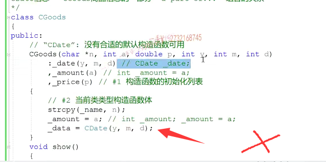

## main函数运行

希望大家呢，对这个类的初始化列表呢？有所理解啊，那现在我就可以了，现在呢？在这里边我再打印一下，调用一下data的show方法。我打印了当前我自己的商品的name amount price，再想打印date的话，我在这里边儿无法直接访问这个对象的。year month day，因为他们是私有的，对吧？在这里边儿，我可以通过访问date对象的show函数啊show函数。

来打印他们的私有的这些年月日信息啊，私有的这些年月日信息。大家来看。啊，好了，那我现在在在这个幂函数中呢，我们去定义一个对象出来啊，定义一个对象出date。故诶。good对象啊。商品名称啊，这是商品，然后呢？这第二个是个amount是吧？库存有100件儿。

单价是35块钱一个，生产日期是二零零零年一。二零咱写这个今年吧，二零一九年啊，二零一九年5月12号。对的吧，good点show。利用商品的show方法好，我们来编译一下这个代码，看一看这个运行的结果啊，这里边有问题啊。无法将参数一啊，这里边儿常量字符串，我们前边儿说了啊，

老编机上是可以用普通指针指向常量字符串的。但是在我们新一点儿的编译器呢，对于常量字符串都必须得用常指针来接受。我们之前在讲课过程中写代码，是不是也出现过这个问题啊啊？大家不要忘记它啊，大家不要忘记它。

常量字符串用const char *接收

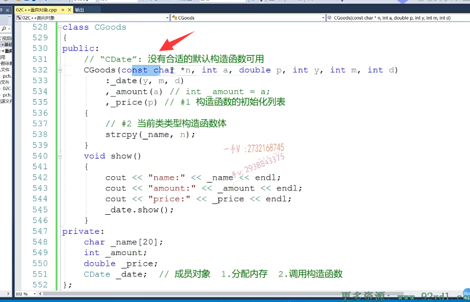

好在这儿大家看唉，我这商品的名称是商品库存是100件儿，单价是35块钱一个，生产日期是二零一九年。5月12号啊，5月12号。好那么。在这里边儿呢。

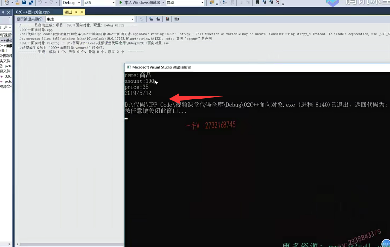

## 总结

我们对于构造函数的初始化列表有了这么一个清晰的认识，主要是干什么的呢？唉，初始化列表呢？就是。可以指定啊，可以指定当前对象成员变量的初始化方式。尤其是对于这个成员对象而言。尤其是对于成员对象而言，对吧？对于成员对象而言，我们需要指定它的。构造方式，我们怎么指定呢？就是在这个构造函数的。

初始化列表当中来制定啊，构造函数的初始化列表当中来制定。

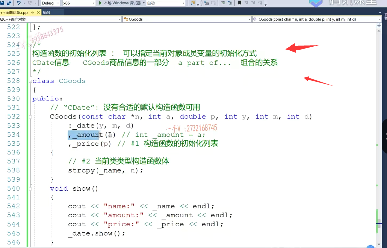

# 举另一个例子

啊，我们再来通过一个实际的啊，再来通过一个。实际的这个在我们。笔试面试中出现过的这么一个问题，我们再来看看这个初始化列表啊，再来看看这个初始化列表ten。零。那么在这呢，我们有一个test这么一个类public啊，

private有一个intmaintmb有这两个。成员变量啊，那么这里边儿提供了一个date的构造方法，它的参数默认是个十。用呢data给MB初始化了，再用MB呢给MA初始化了，然后在这里边呢打印了一个数方法。啊，我访问MA。在访问MB。好，那在这呢，我们test定义了一个对象t点数。先给大家一些时间来看一看这个代码，分析一下啊，

分析一下，那么在这里边定义一个test对象TT do show。==那问最终打印出来的这个MA和MB的值。到底是多少呢==？大家思考一下。

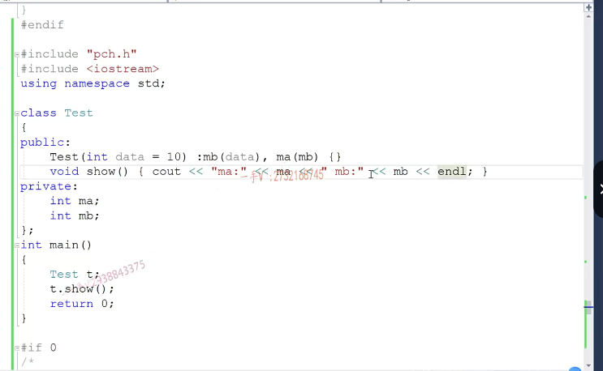

## 不是全部打印出来都是10

那么在这里边呢，大家来看啊。在这儿呢，构造函数初始化列表可以指定我们成员变量初始化，对吧？但是注意啊，千万不要认为在这里边儿，我先写的先先初始化。啊data用户定义对象没有传参数，那么它用的就是默认的十啊，

把十给MB。对吧，那MB是十了，再十给MA，所以MA MB打印出来呢，都是十，我们看一看是不是打印出来都是十啊？大家看啊，这这个并不是十。这这是一个无效值，

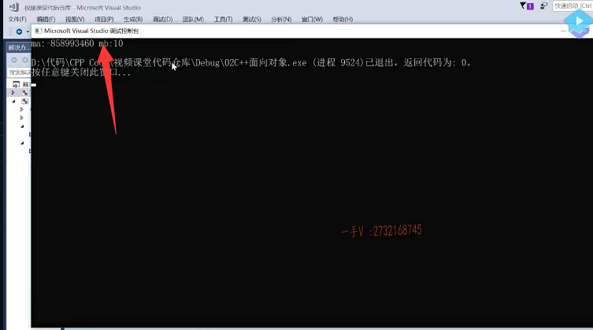

### 构造函数初始化列表 与 成员变量定义的顺序有关

### windows下栈内存开辟也会赋值为0xcccc,而linux 下只负责开辟

大家注意啊？当我们生成一个对象的时候啊。对象的这个成员变量，它是按照就是对象的成员变量，

它的初始化的方式啊，你是可以在构造函数初始化列表中去指定。如果你没有指定它，就默认构造，它就默认初始化，那相当于就是内存中。分配完内存内存之后，现在是什么垃圾值什么无效值，它现在就是什么值？对不对？相当于就是没有没有做初始化一个意思，那如果你在构造函数初始化列表，想给成员变量指定初始化。那么，成员变量初始化的顺序是以他们定义的顺序相相关联的，

比如说MA你看。在类成员变量写的时候MA先定义嘛MA先定义就是MA先初始化。MA初始化的时候MB还没有值呢，这个对象在占上，我们在第一部分讲的时候占的这个。站开辟和初始化在我们VC编辑上呢。占的初始化都成ccc了，就是负的八五八九九三四六零。对吧？此时呢，你拿MB给MA初始化，那MA肯定就是一个负的八五八九九三四六零零了。然后再是MB初始化啊data是十那MB能得到一个10 MA，却是一个我们刚才看到的。这个叫什么呀？

负的八五八九九三四六零对吧？这是0x ccc，还记着没有？我说了，在我们这个函数调用在我们。linux平台下GCC下边啊，战争只负责开辟，不负责初始化啊，在win这个WINDOWS上我们VS编译器啊，都对战争开辟以后，战争都初始化成CC了。注意啊，注意这个成员变量的初始化和他们定义的。顺序有关。和构造函数。

初始化列表中出现的先后顺序无关。

## 总结

啊，出现的情况顺序无关，大家注意一下这个构造函数初始化列表啊，一是它可以初始化，二注意一下它的它所指定的初始化的顺序。好在后边的我们在OP编程过程中呢，我们在构造函数进行成员变量初始化的时候呢，==我们建议大家尽量的把成员变量能写在初始化列表。就写到初始化列表当中啊，就写到初始化列表当中==。那么，初始化。

==在构造函数的大括号之间，里边呢，相当于都是一**个赋值操作**==，对吧啊？好，那我们今天呢？这一部分呢？主要讲的就是构造函数的初始化列表，希望对它呢能有一个比较深刻的理解，通过我们的代码示例。好，今天这节课就到这里。

