# 第六节课

大家好，欢迎继续收看石磊老师的视频课程啊。这一节讲的这个内容呢啊，这一节讲的这个内容呢，我们主要讲这个。类的各种成员啊类的。各种成员，那我们这节课呢，主要涉及呢这个成员方法啊，当然我们也涉及一些不同的这个成员变量。

那么，在这里边总结一下啊，我们之前呢见过的这个成员方法都是普通的成员方法。唉，普通的成员方法对吧？

就像我们嗯，上一次课呢，看的这个good商品good商品啊，我们这个show方法这都是普通方法，普通成员方法。这个成员方法呢，调用必须得用对象来调，大家记着为什么吗？因为它编译以后呢，就会把这个对象的地址呢，当做时参传给这个函数啊，那么在编译过程中啊，这些成员方法就会多加一个this型参变。用来接收调用它的对象，对吧？

因为呢，我们说一个类产生的对象呢，他们有各自的成员变量，但是他们共享同一套成员方法的。在一个一套成员方法里边儿，如何去区分呢？那么多的对象啊，==那它就是通过this指针来区分的。==

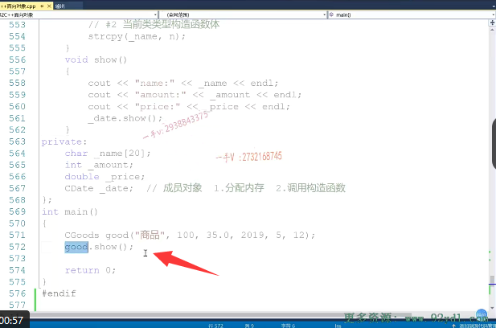

## 总结普通成员函数

普通成员方法有这么一个特点，首先它属于类的作用域啊，它跟我们全局的方法不一样，它是属于。类的作用域第二个就是调用该方法时啊，调用该方法时需要依赖。需要依赖一个对象，

必须得用对象来调啊，没有对象的这个成员方法是普通成员方法是调不了。啊，那第三个就是可以访问啊，可以任意访问啊对象的。私有啊，成员变量。对象的私有成员变量，有些同学还说啊，保护的是不是也可以访问啊？那我们在这儿呢，我们先不考虑保护好吧，因为保护呢，只有在继承的时候才会起作用。我们现在没有说继承，

所以我们现在不考虑保护，我们现在就考虑呢，公有的和private私有。那么，对于类的公有的成员，在外部是可以任你访问的啊，对于类的这个private的成员，私有的成员呢在？例外，你是无法随便访问对象私有的成员，但是我们可以通过公允的方法啊，这个方法里边呢，是可以任意访问自己的。私有成员变量自己的方法当然能访问自己，私有的成员了，

对不对啊？好在这里边儿呢，我们来看一下啊，

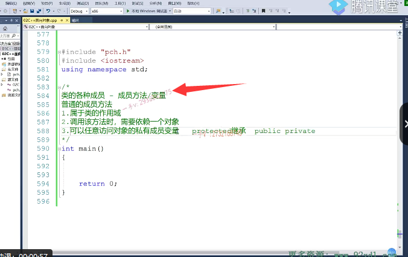

我们来看一下呃，比如说我们把上节课呢。所写的这个什么类啊？这个商品这个类我们用上吧啊，商品这个类我们用上上节课，

我们在学构造函数的初始化列表的时候呢。我们举的这个代码的应用示例对吧啊？来我们看一下。那在这里边儿，我们定义了一个商品，对吧？定义了一个商品啊，

定义了一个商品。那商品一。呃，商品一。在这里边儿，我再定义。四个商品吧。这是商品二商品二啊，商品三还有商品三。商品四这里边是商品四啊。今天呢，鼠标有点儿问题啊，所以呢，在选择内容的时候稍微有点儿费劲啊。商品一商品二商品三商品四我们进行了他们的一个打印，

大家来看啊，不同对象呢，调用呢不同的。那调用同一套方法啊，调用同一套方法，哎，我们这个妹已经有了是吧？那就把这个妹我们删掉啊，这个妹我们删掉。好，我们直接来执行，看一看这个对象打印出来的信息。

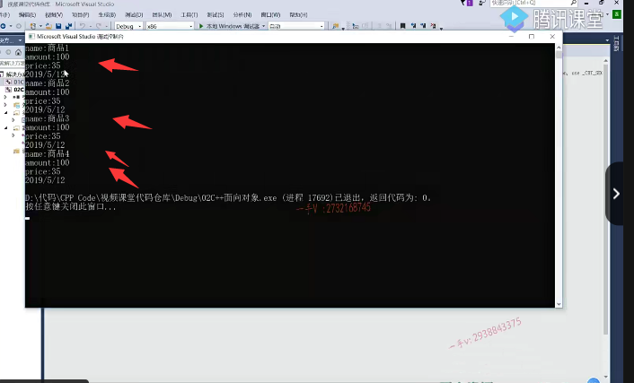

# 怎么样记录这么多商品总的数量

啊，商品一商品二商品三跟商品四没问题吧啊，好了，

那在这里边我们来继续看，现在我有这么一个需求啊。我想统计统计啊，所有所有商品的数量。总数量总数量啊，就是我现在有四个商品了。对吧，有四个四个商品啊，我要统计一下商品的商品对象的总数量。那我需要一个变量来记录啊，商品的数量。

那在这里边儿呢，我们用全局变量来记录行不行？可以的，但是我们现在在讲oop啊，

我们尽量不要用全局的

那在这里边，我定义一个普通的，比如说在这定义一个整形，比如说是count啊，这个用来记录。这个商品对象的总数量。这个是否可以呢？用这个count来记录商品对象的总数量，这个行不行？这个是不行的啊，这个不行的，为什么呀？因为我们把count定义成了一个普通的成员变量。这就意味着呀，

当我们用c故事定义对象的时候啊，每一个对象都有自己的一个count，也就是说呢，你定义的这个count值呢，是只能描述一个对象，一个商品对象的信息。你能描述所有商品对象的信息吗？描述不了啊，描述不了，因为你这是普通的成员变量，是隶属于。某一个对象，我们现在是想统计所有c固子定义对象的个数，所以它肯定是用不了的。

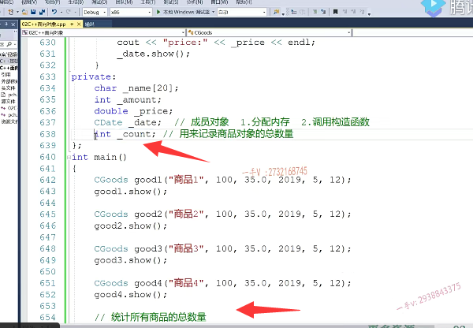

### 使用静态变量记录商品的总数

哎，那我们这时候呢，我们就用到了静态的成员变量。

同学们，静态的成员变量啊，静态成员变量在这里边啊，仅仅只是一个声明。

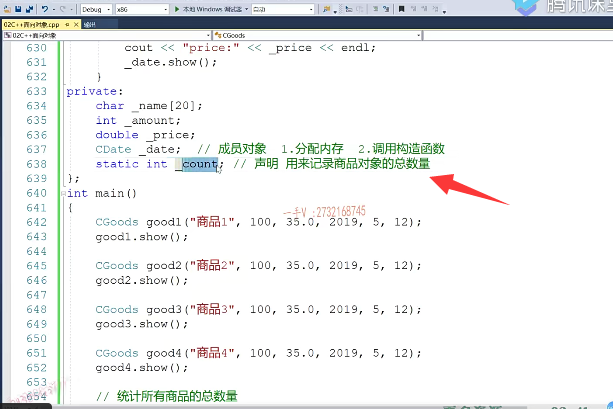

### 类内定义  类外初始化

那么，它需要在内外呢进行一个定义啊，需要在内外呢进行一个定义，怎么定义呢？就是这样定义的c。啊，这是。这是属于静态。成员变量一定要在内外。

进行定义并且初始化啊，并且初始化。

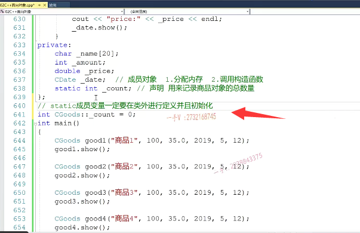

### 静态成员变量不算在对象内存中

那么，在类里边写这个只能算声明。那么，同学们，这个static静态成员变量是所有对象所共享的。当我们再再次啊，计算对象。大小的时候呢，我们静态成员变量是不纳入对象内存的，你想一想吧，==这些对象good 1 good 2 good 3 good 4这些对象在哪块儿内存中啊？这是在栈上啊最终==。是不是最终在站上对

==那么静态的成员变量？这在哪里？这在我们数据段中，这初始化为零，是在bss段，==也是属于数据段的一部分。对吧，

==所以呢，我们在计算对象大小的时候是不考虑静态成员变量的，==我们说静态成员变量，他是。不属于不。属于对象，而是属于类级别，属于类级别。

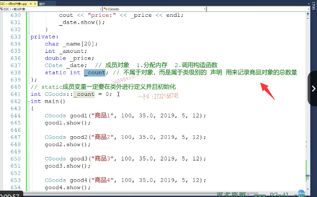

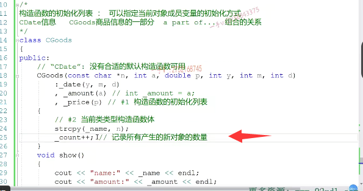

它相当于就是个全局变量，只不过现在落在了类的作用域里边而已。那么我们现在就给抗的初始化为零哎，什么时候会产生新对象呢？对吧？在构造函数一个对象，新的对象产生一定会调用构造函数的，所以我在构造函数这里边儿啊。给count进行一个加加在这里边儿用来记录啊，所有产生的新对象的数量。这是肯定是没有问题的，用count加加啊，用count加加。这是肯定可以的。那么在这里边呢，

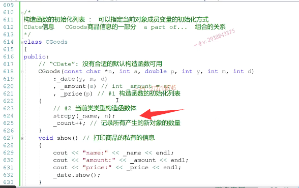

我们啊。想访问一下这个count，看一下我们到底现在在代码中创建了多少个商品对象，但是现在这个无知无法直接访问。因为这是私有的，所以在这里边我们写了一个函数show, show这个say goods count。答应了一下。啊，这个所有商品的种类。数量是。是。count.所有商品的种类数量是。

count count那么这个是干嘛的呢啊？这个show呢是打印商品的。啊，私有的信息对吧？这个是打印的，是所有商品共享的信息，因为这个count呢？==因为这个count唉，就是一个所有对象共享的变量对了==吧，然后呢，我用对象来调用一下啊，因为我写的是一个普通方法，我得用对象来调用一下show say goods count。我们看现在我们定义了四个对象，它统计出来应该就是个四。

啊，应该就是个四。看一下所有商品的种类，数量是四。

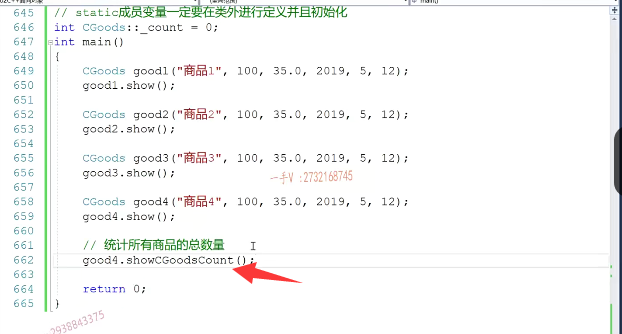

### 所有对象共有的成员变量，那么应该用类名去调用

这个完成我们所要求的功能，倒倒是能完成，但是呢，很明显啊，

这个不符合我们的逻辑呀，为什么呢？因为这是打印的，是所有商品共享的信息，你为什么要用good 4来调呢？你用过的四调的话呢，从代码语义上来说，好像啊，这打印的只是商品四的。相关的信息，但其实我们打印的是所有商品的信息啊，但是在这个里边呢，我只用类名类名调它。行不行呢？这是不行的，

因为这是一个。==普通的成员方法唉，编译器编译他的时候就会产生这个this指针，那么既然产生this指针，就是说呢，在调用的时候一定要给他传一个。调用他的对象的地址进来，==

你现在根本就没有对象。现在根本就没有对象。啊，所以呢，==我们这是既然是想访问所有对象共享的信息，所以我们就不能说是把它写成普通方法，用某一个对象去调用它。我们应该用类名去调用它。==

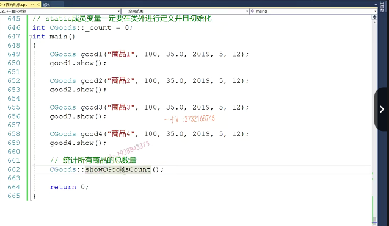

### 将普通的成员函数申明为static静态方法，可以用类名调用方法

这样看起来才是访问我所有c goods类型定义的对象的一些共享的信息，对吧？此时呢？我们就可以把这个方法呢写成一个。静态的方法啊，写成一个静态的成员方法。这个数是一个普通的。成员方法。这个方法呢，是一个静态成员方法啊，这个方法是一个静态的成员方法。好吧，是一个静态的成员方法啊。那你看静态成员方法的调用是用什么调的？对，

是用类的作用域来调，而不是用对象来调，所以很明显。

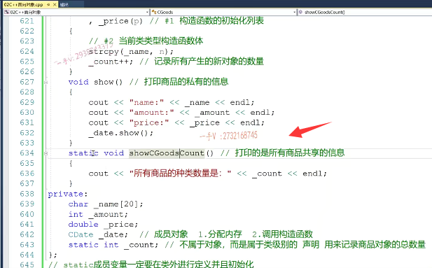

## 普通方法和静态方法的区别

别人在问我啊，普通方法跟静态方法的区别是什么的时候啊？啊，区别是什么的时候？很明显。这里边这个有一个长得这么模样的，一个this指针。而静态方法是没有this指针的。是没有this指标的，所以在这个方法调用的时候，他是不需要依赖于一个对象的。啊，==你调用这个静态方法，不需要对象。不需要对象的话，那也就是说那就没必要产生this指针了==，因为它本身呢，本身访问的就是所有对象共享的信息，注意一下啊，注意一下。

我们被问到普通方法跟静态方法区别的时候，总是可能会回答呢啊，普通方法得用对象来调，静态方法是用类作用域调。这个没有问题，但是我们能能不能反着角度去说一下，因为普通人可能都会像我刚才那样去表述。

那么，他们本质的区别就是受方法，那受方法为什么需要用对象调？因为它边会产生this指针嘛？产生this指针，接收一个当前对象的地址，你就一定得用对象来调它呀，它才能把调用它对象的地址是不是当做实参传进来？

啊，那这个方法呢？为什么说是不用对象来调，因为他不产生this指针，也就是说不需要接收一个对象的地址。不需要接收一个对象的地址。好了，这就是我们普通方法跟静态方法，在这里边一个本质上的一个区别啊。

我们如果啊，==这个方法呢，访问的是所有对象共享的信息的话，那么你注意我们最好把这个方法写成静态方法==。啊，那调用的时候呢，就用静态的，==这个就是静态的方式来调就是类的作用域去调用他们==。啊，注意一下，注意一下，在这里边我们除了普通方法，又说了一下静态方法。

### 静态方法里只能打印不依赖与对象的成员变量

那么，在这里边，在静态方法里边，我想打印。将打印这个name啊，打印商品的name。甚至我在打印商品的amount price，商品的生产日期能不能打印呢？想一想，在这里边。大家想一想。可以吗？这是绝对不可能的。绝对不可能的，为什么？因为这是谁的name啊？你说当前对象的name。当前对象在哪呢？this指针指向。的对象的内容，那请问这个传员方法里边有没有z4指针啊？会不会生成z4指针？它是不会的。静态方法里边没对象，没对象，所以在静态方法里边是无法访问普通的成员变量。你只能访问那些不依赖于对象的成员变量，比如说这个静态的成员变量。OK.

好在这里边呢，我们通过这种方式呢，给大家把这个。

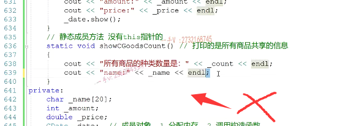

## 总结

好在这里边呢，我们通过这种方式呢，给大家把这个。嗯，静态方法给大家讲了一下，在这儿我们总结一下啊，在这儿我们总结一下。这里边是static静态成员方法。那第一个它属不属于类的作用域啊？也属于类的作用域啊？也是属于类的作用域第二个调用。方法啊，就是用啊类名。作用域来调用方法啊，用这个方法不用对象来调，

不用对象来调，类名作用域啊。第三个啊，可以任意访问对象的私有成员。但是注意啊，这里边儿访问成员呢，我们可以不仅仅局限于成员变量，因为成员变量，成员方法都可以访问。在静态成员方法访问的时候，可以任意访问。访问对象的私有成员，但是仅限于什么成员啊？仅限于不依赖对象的成员。因为静态方法里边儿没this，

所以也就是说呢，仅限于那就是它只能调只能调用。其他的是不是static static静态成员啊？只能调用其他的。它的一个静态成员。注意一下啊，大家注意一下，这是静态方法。核心的区别就是任何他们体现出来的不同啊，其核心的区别都是因为普通的成员方法。会编译器会。添加一个this型参变量。==啊，静态方法呢？但是不会生成。this形参==。核心的区别就在这啊，核心的区别呢？体现就是让他们体现出来不同的一些应用。好了吧啊，这是我们三个成员方法，里边儿比较重要的两个普通成员方法跟静态的。成员方法。

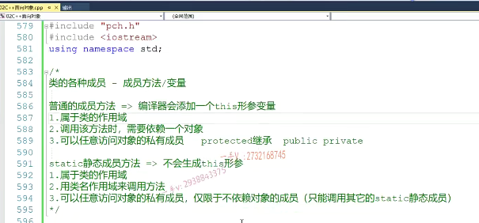

### 对象定义为const, 然后调用show方法来看下，会不会出错

那么再来看我们，再举个例子啊，比如说呢，我们这个书籍呢，这个商品呢，是我们的这个，比如说是有一个镇店之宝。啊，

有个镇店之宝c goods是good 5啊，是good 5，这个是一个非卖品商品。不啊，你不能买对吧？不能买其他的信息，我随便填吧啊2019。五月幺二。其他的信息我随便填了，大家看我把它定义成了一个什么对象cons的对象cons的对象，就是说呢，这个对象的信息是不允许你修改的。非卖品只能看不能动啊。那我看吧，看一下。

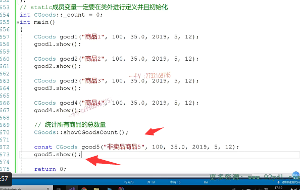

那我们瞅一眼调用他的show方法对不对啊？好边运行一下啊，大家会发现呢，我们这个代码出错了。在这里边儿出错。这就有点出错。

常对象就是const的修饰的对象 ,常对象调用普通方法，对吧？这个show是一个普通方法吧？show在这是一个普通的方法。对不对啦？那常对象调用普通方法在这里边儿给我报错了，唉，我知道呢，

### show方法其实传入的是this指针，就是对象的指针，是普通的指针类型

### 但是const 修饰的对象指针是 常量指针类型

### const * -> *this 报错

这里边儿其实呢，==相当于是调用了show方法。把good对象的地址呢传进来了==

那么，实参是一个什么类型呢？

good5是一个const goods类型，加个取地址就成了const  good*的。这是一个常量的指针。

而我这个==普通方法是生成的，这个this。形参变量是个什么类型呢？唉，是个普通的指针类型==，那么这里边问题就很明显了，

请问可==不可以把一个常对象的地址就是cons tc good*传给一个普通成员方法的 good * 呢==？可不可以呢？很明显啊，我们之前讲过const跟一级指针的结合以及类型转换的错误啊，这样的转换。这样的类型转换呢，是有问题的，是错误的，不正确的。对的吧啊，是错误的，不正确。那在这里边，你要能够接收实参的这个cons的c故事型，你形参必须也得是const goods * 这样才能接受。那怎么接收呢？。

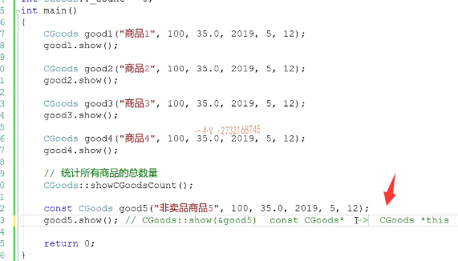

### 成员方法后面加const可以接收const goods *类型指针

那怎么接收呢？嗯，怎么接收呢？这里边我怎么可能控制编辑给他生成 const  goods *this的,

时候给他前面加const呢？啊，==你不用控制，我们只需要给他提供这样的一个方法就可以了==。

==你看到这个方法的后边啊，加一个const啊。那编辑在给这个方法生成类似指针的时候，你看就生成这样一个。this之身了。就生成这样的一个this指针。==

啊。上面这两个方法呢，这个是普通的方法，==这个叫做常成员方法啊，常成员方法==，这两个是可以，这两个是==重载的关系函数名==相同吗？参数列表不同嘛 goods* ，这是cons t goods* 。==之前我给大家说过const 如果右边有指针的话，它是要参与类型的，这两个形参类型明显不同==。是的吧啊。注意一下啊，

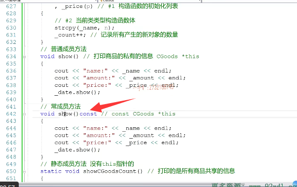

注意一下。那在这里边相当于就是这个this就是一个this指向的，就是被修饰成const了。

所以在这里边呢date调用show的时候呢，也就是在常方法调用。那么。在这里边儿相当于哎传进来的这个当前对象的this呢，又是一个。又是一个什么东西啊？const是不是const星啊？那我们先来给大家编一下啊，编一下。编一下，大家先看一下我们的问题所在啊，问题所在。

嗯，点错了啊。看一下我们的输出。就是这啊，这个为什么错了？这个就是说在这个长方法里边啊，哎，在这个长方法里边。那我们在这呢，相当于呢？this指向的对象啊，this指向的对象都有啥都有name amount price date是不是啊？这些东西都是不能改变的，相当于也是一个常量。那么，

它调用方法的时候就不能是一个普通的方法，这个show也得是个什么方法？常方法。啊，其实在这里边就告诉大家一点啊，==普通的方法啊，常对象是调不了的==。

### date成员对象中的show方法也要改为const修饰

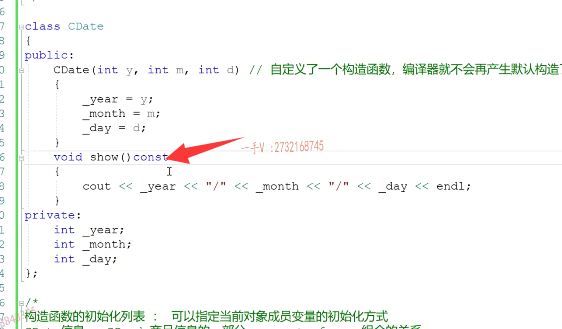

### 只要是只读操作的成员方法一律实现成什么const常成员方法

因为长对象呢，传进来的实参对象的实参地址是一个const型。而普通的成员方法呢，是一个普通的型。啊，普通的方法是一个普通的线，这个根本实参到行参的类型是没法传递的啊。所以我们给大家一建议就是啊，

我们这些方法你看这个树方法里边儿。他对成员变量只做了读操作，并没有做。写操作那么对于这样的方法，我们尽量把它写成什么方法呀？长方法这样一来呢？

普通对象也扔掉。长对象也能调。啊，大家要注意一下，这个很多同学在写oop代码的时候呢，因为我们oop代码的时候很多的形参呢。啊参数都被const修饰了，成长对象长对象一调用方法，哎呀，

这儿错误那儿错误好多，错误自己都不知道为什么。那也要知道啊，常对象调用的方法必须得是常方法，因为常方法呢，生成的this才是const型this。这样才能接收一个长对象的地址。所以我们在写方法的时候记住一点啊，记住一点，==记住一点，只要是只读操作的成员方法一律实现成什么const常成员方法啊==，一律实现成常成员方法这样普通对象可以调。长对象，它也能进行一个调用啊，长对象也能进行一个调用。好吧，希望大家呢，把这个搞清楚啊，希望大家把这个搞清楚。

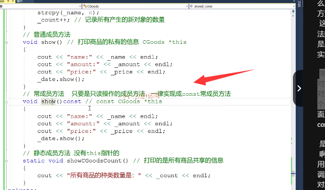

## 总结

好了，在上面儿呢，我们给它常成员方法，也做一个总结啊const这个叫常成员方法。它产生this呢，

是会产生this，==但是它产生的这个this是一个const类类型的一个this==。没问题吧啊，属不属于类作用域呢？它也属于类的作用域。没问题吧啊。这个调用依赖一个对象，但是他依赖的这个对象，普通对象或者常对象。都可以。你想一想啊，我们前面这个==普通方法能用长对象调==吗？能不能用长对象来调？不长对象五长啊，

### 普通方法无法用常对象调，const 方法普通和常对象都可以调

长对象是。是无法调用的。哎，因为长对象的这个时参类型。是什么类型？是cons tc goods型。而邢台呢，却是一个普通的故子青。这个实参的类型根本就传递不到行参，行参呢，这个类型无法接受实参的，这个类型对不对啊？注意这一点啊

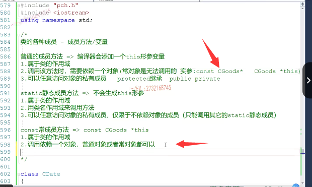

第三个当然是可以任意访问对象的私有成员。但是只能读。

而不能写为什么呀？因为在长方法里边this的指向你看是不是被修饰成const了？是不能写的，写的话就会出错啊，

你比如说在这里边儿啊，我对amount进行一个或者对price进行一个修改。啊，进行一个修改。看一下，在这里边，由于正在通过常量对象访问price，因此无法对其进行修改。this的指向的修容const因为对于成员变量的访问都是访问this指向的对象的成员变量。类似的指向既然已经为修饰成const，所以他是。

这就是不能被修改的啊。不能被修改的，对吧？

### const  goods  * this ->price 是不能被修改的 

### 去掉const修饰的类型 关心剩下的表达式

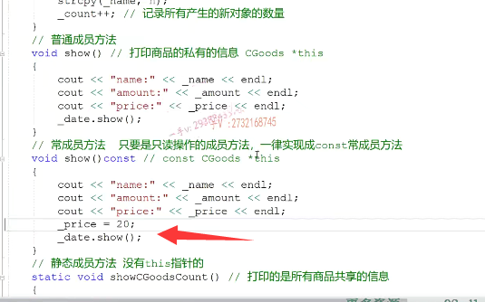

### this->price

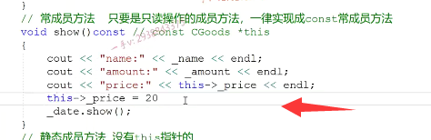

在这里边儿，记住我们给大家建议的就是以后写成员方法啊，只要这个方法呢，是只做读操作，而不做写操作，一律实现成常成员方法。这个一定要记住。好的吧。好，那么在这里边，我们通过一个商品的实例啊，

这节课我们主要给大家讲了这么几个东西，第一个。我们在给类啊，实现成员变量的时候呢，我们有这几种方式，一个是普通成员变量，这个是每一个对象都私有的一份数据。啊，不同的对象不一样。那如果我想定义成员变量来统计所有对象共享的一些信息的话，怎么办呢？唉，我们可以通过添加静态的成员变量。来做到这一点，静态的常用变量。

是不属于对象的，而是属于类作用域类级别静态，===是在数据端啊，跟对象的内存根本就不在一块儿==。

# 总结

对吧，另外一个呢，我们给大家讲了，我们成员方法有三种，我们最常用的普通方法。还有静态的成员方法，还有常成员方法，记住他们表现的形式多种多样，但是。为什么表现出来多种多样的形式呢？其核心原因就是他们玩儿的都是z4指针玩儿的不一样。

普通方法是个普通的星。this长方法是一个抗性this，而静态方法干脆没有。this指针没有this指针。啊，所以在这里边，我们在应用的时候呢，在不同的应用场景下，我们到底使用普通方法长方法还是静态方法？我们要做一个合理的区分啊，合理的区分普通情况下，我们肯定写的都是普通的成员方法。

==我们建议，如果这个方法只做了读操作，而不做写操作，那么尽量把这个方法都实现成常方法==。这样普通对象和长对象就都可以调用。然后就是我们的静态方法，如果呢啊，我想统计，我想访问的这些信息啊，是我们所有对象所共享的。对吧，而不是隶属于某一个对象。啊，两甲一对所有对象之上，那我们呢？就可以把这个方法定义成一个静态的方法。啊，希望大家在这个应用中呢，

多去体会这三种成员方法的这个区别。好，那我们这一部分就先讲到这里。

