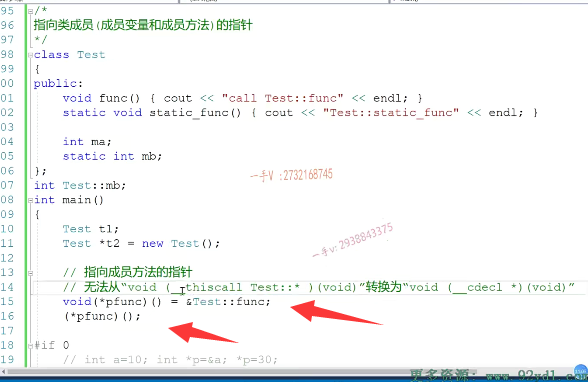

# 第7节课

大家好，欢迎收看施磊老师的视频课程啊，这一部分呢，我们主要讲一下我们C++面向对象啊。这个基础课程的这个指向类成员的指针。啊，那么。==关于我们对第一部分面向对象对象的各种优化以及成员方法带左值引用，右值引用参数的在我们函数调用过程中，传参过程中，函数返回值过程中的一些对象的优化==，

到时候大家可以留意石磊老师的这个C++进阶课程的相关的一些视频啊。

好，那我们学这个指向类成员的指针到底？

在哪里能够使用到的啊？我们今天这一部分小结的这个内容呢？是对于这一部分相当于是一个扫盲操作啊，扫盲操作。让大家了解啊，==指向类成员的这个指针跟我们以前用的指针在哪里有有不同的地方啊==？

我们后边儿会学到C++11稍微高级一些的应用，比如说绑定器，取款器啊，在那个地方呢，我们==会涉及到我们模板啊的特例化,完全特例化和非完全特例化涉及到我们类型的这个推导啊==。那边儿呢，会用到的很多的地方都会用到我们类成员的指针用来推导我们成员方法的返回值跟。形参的个数以及形参的类型啊。

### 能不能普通的指针指向整形的成员变量

那具体的应用我们到时候再看，那今天呢？我们先来学一下==基础的指向类成员的指针==，到时候我们再用到相关知识的时候呢？大家脑子里边能有一个印象，不至于什么都不知道。在这儿我们写了一个test，这么一个类型啊，为了缩短一下我们课程的呃时间啊。就不浪费了，大家看我的这个写代码了啊，这里边儿把一个简单的类直接我们先列出来，这个类呢，有一个普通的成员方法。

一个静态的成员方法，还有一个普通的成员变量。啊，那这个普通的成员变量是一个整形的成员变量，==我能不能用一个普通的指针。去指向它呢。普通的指针指向一个整形的成员变量。==大家想一想，这个操作是否可以？

我们以前呢，在写代码的过程中，要是定一个整型变量。对吧，我们呢？

肯定会定义这样的一个指针去指向这个整形变量，然后通过这个指针仅引用。去修改指针，减引用去修改这个整型变量的值。没有问题的吧？

但是大家想一想啊，这个属性啊，这个MA现在是test类型的一个属性。啊，也就是说呢，它test类型来描述一个实体，那个实体有一个属性是MA。但是如果我们现在剥离实体，剥离对象，脱离对象，

我们直接说MA，我们能不能知道这里边儿到底说的是谁的MV，比如说呢，这个test表示人。这个MA表示人的姓名。我们现在能不能直接说？我让定义一个指针p。指向一个人的姓名或指向一个人的年龄。到底是谁的年龄？我们说啊，当我们去谈论普通成员的时候，我们一定要指定对象，没有对象，我们谈论这些成员是没有任何意义的。

没有任何意义。那么在这儿我们看一下到底呢？这个指针怎引用？是否可以啊？我们重新生成一下。这里边儿呢，给我们报了一个错啊，报了一个错，我们看一看到底是什么样什么样的错误啊？==无法从int类作用域型转成整形指针==。那我们可以看到。

他认为呢？这个类型啊，==已经不是一个普通整形的指针了。而是加了一个类的作用域的一个指针==，所以我们在定义指针的时候也应该去这样定义。这样的指针很明确的告诉编辑，我指向的是一个整形的变量，但不是全局的，而是这个类作用域里边儿的一个整形的变量。那么，==当通过仅引用访问这个MA的时候，一定要给我前边加一个对象。脱离了对象==，==我访问类的成员变量是没有任何意义的，在这里边儿是不允许这样操作的==。因为你定义的时候已经告诉编译器了啊，你已经告诉编译器了。

大家想一想，所以在这里边儿，为了让它正确呢，我们必须得定义一些对象啊，假如说在这里边儿，我们定义两类对象吧，一个是在站上的啊，一个是在。堆上的我们分别来给大家演示一下，当然堆上的对象呢？我们最后呢？要用这个delete呢？是去释放一下，释放一下这个指针所指向的内存，对吧？那么我们好多同学呢，

在写CA加代码的时候，涉及内存管理呀。呃，舍弃new delete。一会儿是m lock delay，一会儿是new跟free，哎，用过来用过去的乱七八糟。大家在写c代码的时候，设计内存管理呢，可以使用mo log跟free这一对儿函库函数啊，这一对儿库函数。这就是库函数专门是做内存，开辟内存释放用的，但是如果我们在写ci加代码的时候呢，

尽量就用new和delete。啊new和delete。这是一个我们在使用语言编写代码的时候，必须遵守的一些规范，对不对？我们在C加加里边儿用mo log跟free，在某些情况下也。不能说是有错。啊，不能说是有错，会让我们会让别人认为看我们的代码，你到底是写的是c的还是c加的？对不对啊？所以大家在写。代码的时候涉及到堆内存管理，

请注意一下这一点啊。

好在这呢，我们来继续来看，所以我们在通过指针。简引用在访问这个MA的时候啊。那我们一定啊，要把这个对象要加好，要依赖的这个对象一定要加好啊，一定要加好。

### 指向类成员的指针 需要使用对象来解引用

啊，这个对象。那这样呢，可不可以访问呢？有没有把对象的值呢？MA对象的值。

MA就是t1对象MA成员变量值改成20呢，我们来运行一下这个。这段代码啊。嗯，我们看是可以的。对吧啊，那我们再来。通过呢t2，我们把指这个指针指向堆上的这个对象的成员变量MA改成30。然后我再进行一个打印输出。当然，贴上是个指针，我就得用指向符了啊，能不能改成30呢？我们看一下，

是没有任何问题的吧啊，没有任何问题的，没有任何的问题。那么，大家注意一下啊，注意一下这一块儿。那么所以说呢，我们定义指针指向类的普通成员变量，注意呢，它前面呢，需要加一个类的作用域

## 指向类静态成员的指针

### 可以用普通指针，不需要依赖对象， 指向类静态成员

如果这是一个普通的静态的成员变量MB。啊MB。没问题吧啊，

那==静态的成员变量需要我们在类外再进行一个定义==好好吧。大家不要把这个忘了啊。

==那这个MB是否依赖于某一个对象呢？是否依赖对象不依赖啊？它不依赖对象==，所以在这儿呢，==我们可以直接通过普通的指针指向它就行了==。

test.MB通过指针建议用来修改呢MB的值是40，然后进行一个p1的星号p1，建议用的一个打印啊。

我们看一看。看看这个，这个是否可行s是没有问题吧，所以大家也可以看到啊，因为呢，这个指针指向的MA是普通成员变量，是要依赖于对象的。啊，依赖于对象的，所以呢，在它进行简用的时候呢，是必须依赖于一个对象。啊，

### 总结

那么MB虽然也是属于类的作用域啊，类的作用域，但是呢，它却不依赖于对象。它跟我们普通的原来普通的定义的全局变量啊是一样的，只不过现在落在类的作用域里边而已。它在仅引用访问MB的时候，**不依赖于对象**，所以我们不用在前边儿加一个对象。**在定义p1的时候，前边儿也不用加类的作用域。okay吧，就跟我们原来使用的普通指针是一样的。好，这是我们的。成员变量啊，定义指向成员变量的指针，**

打印出40

# 指向类成员方法的指针

好，这是我们的。成员变量啊，定义指向成员变量的指针，

现在来看一下指指向成员方法的指针啊。看一下我们指向成员方法的指针在这儿呢，我们把这一段代码呢。先毙掉啊，先毙掉。好，我们看指向指向。成员方法的指针啊，指向成员方法的指针。

在这里边，这是一个我们普通的成员方法，返回值是void。形参列表是空的啊，不带任何的形参的这么一个成员方法。那么，

在这个成员方法里边呢？我们如何去定义一个函数指针？指向这个函数呢？能不能像我们以前定义的这个汉书指针呐？嗯，我指向这个。类的这个函数。可以吗？然后再通过函数指针接引用。啊。来调用这个指针。指向的这个函数呢？间接调用函数，这可以吗？==这个要是放在我们原来的c函数中，是绝对可以的，==

但是它要放在这儿，我们看一下啊，到底行不行？这个是报哪一句的错呢？我们来具体看一下啊，这一句的错误。==这里边代码上编译器给我们的提示是。这里边儿没有办法呢，从这个类型函数指针类型转成这个函数指针类，==

### 定义指向类成员方法的指针 也需要依赖于对象

这个函数指针类型我们一看啊。这是我们的CD呀，标准的c标准约定啊。型就是我们这个类型，这个类型呢，

大家看到啊。这个可不是一个普通的c函数啊，这是一个类的成员方法，对吧？所以你看它指针，前面又加了一个类的作用域。==所以我们在定义的时候，我们必须得这样定义和刚才指向类成普通成员变量的方式是一样的。这样才能告诉编音器这个指针指向的是一个返回值，是void的，不带形参的一个函数==。

但是呢，它指向的不是一个普通的函数，它指向的是test这个类里边的一个普通的成员方法。所以当你用这个指针间接去调用方法的时候，==普通成人方法调用是要依赖于对象的嘛==，所以你再通过这个指针间用调用这个方法的时候。一定要用对象来表达。否则呢。调用是无法成功的啊，无法成功的。

### 测试

### 调用也需要依赖于对象

我们来看一看。好，这里边有两个func。函数的调用就是我们这两个啊，那成员方法的调用呢，不管你是直接还是通过指针间接？你普通成员方法是一定要依赖于对象的。大家在这里边注意一下啊，

注意一下。那么，在这里边相信大家呃，这块我就不写了，在这里边如何定义函数指针

## 定义函数指针指向类的static静态成员方法

## 定义一个普通函数指针就行

啊，如何定义函数指针指向类的static静态成员方法呢？啊，是定一个函数指针指向我类成员的函数的函数指针呢？还是定一个普通的函数指针就可以了？哎，跟我们刚才这种情况一样，这个成员方法现在已调用，已经不依赖于对象了，

它不需要对象，它就是一个普通的一个c函数。只不过现在落在了类的作用域里边而已。啊，希望大家在这里边可以自己呢去测试一下对应的指针。

好，总结大家注意一下啊，这个是我们指向类成员方法的指针，这是指向我们类成员变量的指针，不管哪一种。在指针前边儿都需要加一个类的作用域，然后通过这个指针间接访问的时候呢，前边儿必须要加上对象。啊，前面必须要加上对象的调用对象的调用。

用对象才能调用访问相应的普通的常用变量。或者普通的成员方法。好希望大家呢，自己能够动手啊，自己能够动手呢，把我我在这里边列出的这些事例呢，去调用一下啊，

在我们后边相应。内容学习的时候呢，能够想起来我们如何定义一个指针来指向我们类的成员变量或者类的成员方法。啊，这就足够了。好，那我们这一小部分的知识呢，就讲到这里。