C++里边这个模板啊的意义呢，是可以对这个类型。也可以进行参数化了啊，以前呢，

我们在写代码过程中建立函数过程中呢，我们的形参变量，比如说我们写一个sum。int a int b那对于这个函数来说呢，我们这里边儿两个形参变量a跟b。是干什么用的呢啊？他的作用呢？就是用来接收实参的值，那也就是说AB在这里边是对实参的值进行了一个参数化。啊，但是实参的类型必须是确定的，因为在这里边形参呢AB的类型呢，已经定义好了，就是个整型。

所以实参呢，你在进行调用这个函数传递实参的时候呢，必须传入整型的实参。

那么我们现在对于这个类型也可以进行参数化啊，也可以进行参数化，非常的方便。呃，那么这就是我们模板的意义。

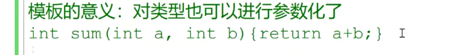

在讲模板的时候呢？大家搞清楚呢，围绕模板的这几个内容啊，什么叫这个函数模板，什么叫模板的实例化，

什么叫模板函数？啊，以及模板类型参数，还有模板的非类型参数。还有模板的实参推演。还有模板的这个实参推演模板的实参推演，另外呢，就是模板的特例化。特例化或者也叫专用化，

模板函数以及。这个模板的特例化，还有嗯。特例化，还有这个。非模板函数啊，还有这个非模板函数。非模板函数的重载啊关系。那我们来在讲解函数模板的时候呢，大家呢，把这些相关的跟模板相关的名词儿，

它的理论搞清楚啊，我们就可以说是过关了啊，我们可以过关了，模板这一部分单独在这个。笔试面试中啊，单独考察模板呢，还是比较少的啊，还是比较少的，那么模板主要是用在我们开发库。开发库的时候呢

我们会经常用到模板，因为我们开发的这一套库呢，是针对很多类型都可以应用的，而并不指定某一种特定的类型才能用。那么，我们用模板的意义就是对我们类型进行参数化啊，你想把它呢我们写好的代码应用于某个类型的时候呢，你只要用某个类型对模板进行实例化就可以了。

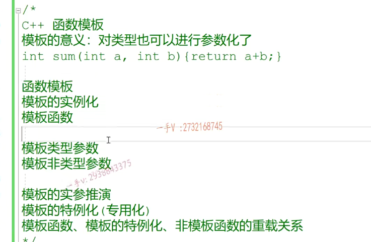

我们现在通过一个具体的实例呢，来看一看我们刚上面列的这些有关模板，需要让大家了解的内容啊。

在这儿呢，我们写一个compare来用来比较两个数的大小啊，很多很多的这个类型呢。

可能比较大小的时候都用的是这个大于号，如果像我们原来在写的时候呢，比如说呢啊，我们在写这个int a int b，我们在进行一个return a大于b的时候呢。这个写这个函数呢，那就只能做整形的大小比较啊

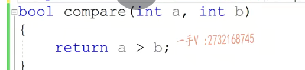

这个template这就是模板的关键字儿啊，用这个关键字儿加一个尖括号儿啊，再表示定一个模板参数列表。那么就可以在这个尖括号里边定义很多的这个类型参数名称了啊，或者是非类型参数名称，我们主要是先看类型参数名称。在这儿，我们可以用tab name。ti type name e在这里边，我相当于就定义了啊，两个类型参数。我相当于定义了两个类型参数。啊，

两个类型参数，一个叫t，一个叫e，那后面呢？他们分别用来接触一个类型啊。你可以呢，定义多个类型参数，他们之间用逗号隔开就行。当然，定义类型参数呢，还可以用关键字class也也是可以定义的，大家在看库代码的时候呢，看到我们template的这个尖括号里边这个。参数类型的时候，我们用class也是可以啊，

但是用class呢，很容易让我们误会啊，后边儿这个t呢，必须是一个类名称啊，所以我们建议大家在一些新的CA加库里边儿呢。我们模板类型参数尖括号里边呢啊，模板类型参数定义的时候都是用type name来定义。好的吧啊，那在这呢，我们就可以用t。t我们用这个t类型啊来定义呢，我们具体的形参变量。那么在这我两个形参变量用的是同一个类型p。啊，那不管是什么类型比较大与小呢？

我们都是通过返回一个布尔值进行的，所以返回值在这里边儿，我就写成布尔了。就不写成具体的这个t类型了啊，在这我加一个打印，这是我们。compare模板的啊，模板的。打印。这是我们compare模板的打印。好，接下来看一下啊。当我使用的时候啊，我现在传个这个东西，大家注意跟我看一下，

此时这个compare这个名字呀。啊，它是一个嗯函数的模板。也就是说呢，它实际上现在只是个模板，它是一个函数的模板，通过这个模板啊模板。对吧？可以创建出来一个具体的函数比较大小的函数，它是一个模板名称，那我们在调用这个东西的时候呢，是希望这括小括号前面是一个模板名称。还是一个函数名称呢啊，那我肯定是不是希望它是一个函数名称啊，所以在这里边儿啊，

模板名加上我们这个参数列表才能够是一个函数名

这合起来才叫做。函数名。啊==函数名加模板名，参数列表才是函数名==。啊，这个调用起来是没有问题的。我们测试一下。好了，看到我们调用了，是不是compare的模板啊？

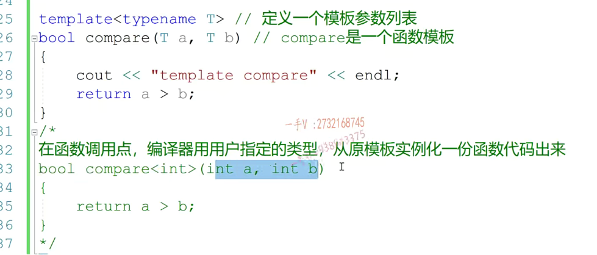

这个叫模板函数

它是个整形in taint b。return a大于b。对吧，就实例化了这么一个函数模板出来了啊，实例化了这么一个函数模板出来了。那么在这里边呢，大家看一看啊，当我再去调用一个compare的时候呢啊，在这里边比如说是double。十点五二十点五唉，那就是说在调用点呢，编辑器又会用double去实例化一份专门处理double类型的。代码函数代码。啊，像这两个呢，

我们把它叫做模板函数，因为它俩呢是从模板用指定的类型实例化出来的。真真正正需要进行代码编译的函数叫做模板函数啊，模板函数。大家看一下，那也就是说呢啊，模板的好处是我们可以只用写一套代码，实现逻辑就行了。那至于用什么类型对吧？至于我们这个模板，最终呢是用什么类型实例化，这个我们可以在调用的地方呢？去指定类型。那么，编辑呢，

就会从原模板用指定的类型去实例化一份代码出来啊。

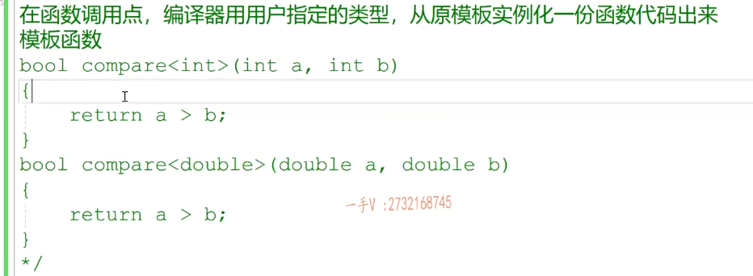

模板的实参推演 

模板的实参推演啊，模板实参推演在这，我们来看一下compare我传的实参是20和30啊20和30。那么，这是实参通过实参推导出来的类型，是个整形。那么在这里边呢，我们a跟b的类型呢，唉，这呢也都是我们整形了。都是整形的。

你第一次用整形实例化了这个。模板啊，最终产生出来这么一个函数，那么在这儿你还是通过模板时仓推演啊，在这里边儿通过了模板。实参的推演啊，这个函数模板实参的推演。你凸显出来的这个形参的这个t类型呢，也是个整数，那么这个函数是不是要重新再生成一份呢？肯定不用再生成。要是呢，它再重新生成这一份函数那一模一样的，

就成函数的重定义了。对了吧啊，就成函数的重定义了，这个呢，==最终我们要在相应这个文件的点o文件里边的符号表要产生这个函数，相应的符号了==。啊，==这个名字的符号只能出现一次，我们在我们最开始讲三大核心模块的时候，代码的编译链接原理的时候已经给大家讲过这里了==。讲过程里边的内容。对了吧啊，希望大家回忆一下诶，同这个一个函数呢，就用某个类型实例化的模板产生的函数，

只产生一份。像==这个是第一次产生，第二次使用的时候呢，就直接调用我们第一次实例化的这个模板函数就行了，处理整型类型的模板函数就可以不用再产生新的函数==。

我们推导出来，这个t是个整清。通过第二个传的这个时参推导出来，这个t是一个double类型。那么t到底是整型还是double类型呢？就不知道了，所以这里边儿就产生问题了啊，就产生问题了。我们来看一看。大家看啊，未找到compare，未找到匹配的重载函数啊，对于模板参数t是不明确的啊，可能是double。也可能是啊int，

所以未能从这个我们实参啊给t啊推导出具体的这个类型来。对不对啊？因为你这里边依赖的是函数模板的实参推演，你用了一个模板名，想做一个函数名调。那么，编辑肯定要给你从时参的类型推导出t来，那么这里边儿解决的方法呢？你可以另外定义一个新的模板类型参数a跟b用不同的模板类型参数。那么，各自推各自的不影响，但是现在你AB两个形参呢？用的类型是一模一样的这个类型。所以在这里边儿呢，实际上的类型却不一样，

我们编辑就无法确定这个t类型到底用采用什么类型的

那么当然，你在这里边还可以指定我们的模板类型参数t是什么类型？是整形。那么，第一个13式整形传给整形没有问题，第二个是个double，那么它就要把double类型转换成我们的这个整形。啊，转换成我们的这个整形。没问题吧，这个也能运行了，==当然这里边涉及了一个警告，从double呢到t可能丢失数据，因为t是一个整形==。

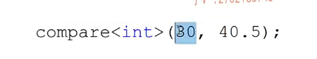

这是一个函数模板。函数模板是无法编译的，你想一想吧，在a跟a跟b的这个类型啊，都不确定的情况下，让编去去编译a大于b。他知道怎么编译吗？他根本不知道，如果a跟b是一个简单编译器，内置的简单类型的话呢？比如说整形a等AB呢？它它倒是能够编译。那如果这里边t是一个自定义类类型AB，是两个对象的话a大于b，他要怎么编译？

对象他怎么编译？这怎么去处理大于小于呢？当然呢啊，如果知道这块内容的同学呢，应该是明白啊a大于b，如果AB是对象的话。这肯定最重要，电用a对象的大于运算符的重载函数，把b当做实参，是不是传进去啊？我们现在可以大可不不必去理解这一块儿。很明显，代码从上往下编译的时候。便利到这一块儿的时候，由于不知道t的类型是什么，

根本无法知道这个AB怎么编译。啊，所以就是说函数模板啊，是不进行编译的这大括号之间的内容是不进行编译的啊，不进行编译的编译，它没有任何的意义啊。啊，编译，它没有任何的意义。

那么什么地方模板要进行实例化呢？==就是在调用点调用点进行实例化==，根据我们用户指定的类型，或者说像这个用户没有指定类型，那就根据我们函数模板调用的时候呢？根据用户传用的实参进行一个模板类型参数的推演推导出来，

我们这个模板应该用什么类型实例化？实例化的过程呢，就是用我们指定的类型，或者是推导出来的类型，从原模板呢。你看实例画出来，真真正正处理某一种类型的代码。啊，==那这个代码实例化以后的这个模板函数啊？才是要真真正正经过编译器所编译的啊，经过编译器所编译的。==啊，模板类型参数那在这里边就尖括号里边呢，你可以用这个tab name定义模板类型参数，你也可以用plus来定义模板类型参数。

对吧？你可以定义多个类型参数。用逗号隔开就可以了。那有这么一个模板的这个功能啊，我们以后写函数的时候呢，就只用注重于。功能的实现，我们并不需要注重于这个，我们所处理的数据的具体类型是什么啊？

字符串比较

我们现在。是==想比较这个类型啊。compare.aaa.bbb.比较两个字符串==。看看啊。他也确实能够比较是吧？他也能比较。可以，他也可以比较的，但是你想一想啊，在这里边啊，我们得用这个模板的时候并没有指定啊，这个参数列表。

没有指定参数列表，那它就得使用这个函数模板的，这个实参的推演了。从我们传播的这个实参啊，推导出来形参t是什么类型啊啊？是const char * 。这是常量字符串推导出来，类型就是const char *是不是那得到的我们实例化以后的模板函数呢？就是这个样子。大家来看，在比较两个字符串的时候呢，用a大于b。

很明显，在这里边儿，我们都看出来问题所在了，对于两个字符串来说，你a大于b，只是在比较这两个字符串的地址谁大谁小，但这是。没有意义的，我们比较字符串呢，肯定是想啊，来比较这两个字符串的字典顺序。就阿克西玛的顺序。对着呢吧。嗯，比较他们ascii的顺序。

那么也就是说，在这里边，我们应该实际上啊，应该调用啊。这个字符串。操作函数。字符串操作函数。来进行一个大小的比较啊，来进行一个大小的比较。来进行一个大小的比较而不应该啊，用大于号。但是编辑器没有办法，因为你模板给的是a大于b。编辑在进行模板实例化的时候，他只能用你指定的或推导出来的类型来确定类型，

而并不能够呢。根据具体的类型来改变你的代码。

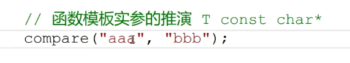

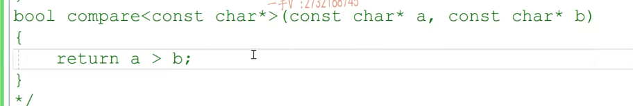

对于某些类型来说啊，对于某些类型来说。依赖编译器默认产生的啊，

==默认实例化的这个模板代码呢？啊，处理的这个代码逻辑啊，处理这个代码代码处理逻辑啊逻辑。是有错误的==。比如说这个类型。const叉型字符串类型对吧？对于字符串类型来说的话呢啊，在这儿呢，我们并不能用它默认的a大AB来比较字符串的大小。那这时候怎么办呢？

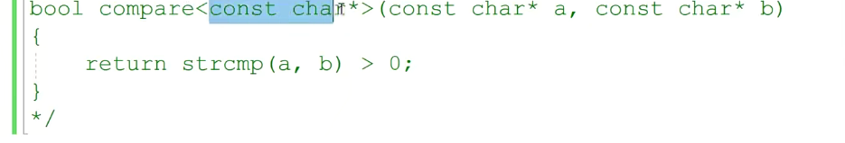

这时候我们就需要给模板啊。提供特例化的特例化的。特殊的实例化还是模板的实例化？特殊，特殊在哪里呢？特殊这个。不是编译器提供的。而是开发者提供或者是用户提供了。

针对compare函数模板提供const。串星类型的特例化。实例啊，特例化版本，那就是说呢。首先，==这个template的括号不要省略啊==，这表示呢，==我们这个实例化也是从这个模板来的啊，得先有模板才有特例化，不能说没有模板，你就直接给个特例化==，

对不对？虽然呢，这个实例化是你自己写的，编辑还是要检查你这个到底符不符合人家特例化的这个语法，实例化的这个语法好不好？尖括号之所以空着，是因为这里边t我们已经知道了嘛。我们现在就是给这个类型提供特例化版本

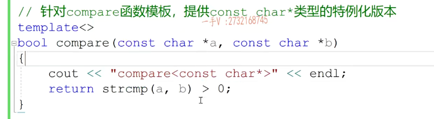

最好加全了

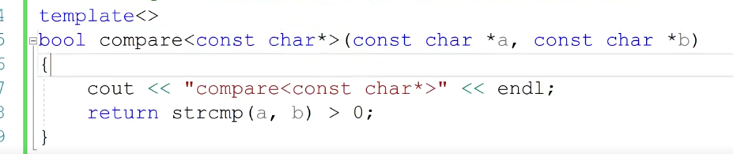

我们最后的这个其他的调用都是从自己从原模板实例化的。而唯独这个呢，是调用的是我们指定的特例化的版本。哎，这样一来呢，对于我们叉星周创类型的比较就没有问题了。

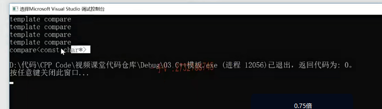

stl标准模板库啊standard。呃template library标准模板库，它里边呢给所有的容器啊。基本上都提供字符串类型的特例化版本的，因为其他类型是比较统一的，而==唯独字符串==呢，这个经常用的操作呢，跟其他类型呢？有诶，有一些不一样的地方，对吧？

所以我们会看到进==库里边儿经常给模板提供特例化==，==经常就会给char *类型提供特例化==。啊，它也是实例化特殊的实例化。

是一个普通函数啊，跟模板不相关。这是个普通函数啊

非模板函数，非模板函数在很多资料上把这三个的共存称作一个重载。啊，其实呢，同学们呃，看书可以，但是不要尽信书啊，重载是什么呀？重载是函数名相同参数列表不同对不对？其实，这还说明相同相同，人家这个。产生的这个符号儿啊，

==不是重载==

是compare const叉二星啊，我们可以通过查看符号儿表都能看出来，而这儿函数名只是一个compare。这根本就不能称得上是承载函数名，根本就不一样对了吧啊，只不过他们长得确实非常像模板名，在这里边拿模板名来说，模板名就是compare跟我这非非模板函数普通函数的函数名是一样的。一样compare。是吧，我们暂且就把它看作一个共存的关系吧，它们是可以共存的。当我们以这样的方式调用的时候呢，边际边际优先呢，就把这看成函数名了。

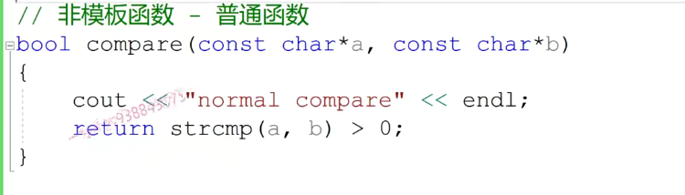

#### 它对用这个非模板函数呢，是最舒服的了，因为直接调用函数就可以了。

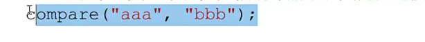

但是呢，如果说在这里边，你写成这个样子，那编译器无论如何就不可能把compare当做函数名了。因为函数名后边是不可能加尖括号的。只有模板名的后边儿才能加<>儿，所以呢，编译器呢，

就去看compare模板的啊模板的。他刚要通过康斯特查尔星自己实例化模板，唉，他突然发现呢，用户呢，已经针对const char *呢提供了该compare模板的特例化版本。所以它直接用这个特例化就行了。嗯，所以他直接用这个特例化就可以了。看到了吧，他直接用这个特例化就行了。啊，请注意一下，请大家注意一下。

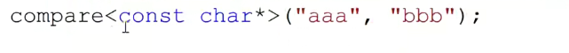

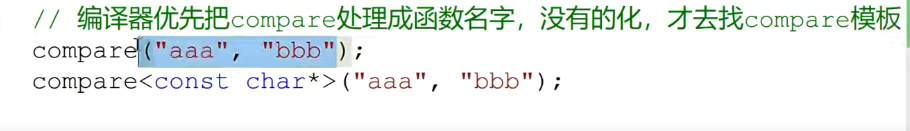

#### 我们在写多文件工程的时候呢，

经常会做这样的一件事情啊，经常会做这样的一件事情。啊，分多文件啊，实现我们多文件的这个。工程的时候经常会做这样的一件事情。就比如说呢，把我这个函数的这个定义呢？啊，定义呢？诶，模板，你看我们把这都放到这儿啊，模板那在这儿呢，我们把这个头文件呢，

也都是拷贝一下，因为这里边儿用到了cout，对吧？啊，拷贝了一下，这里边有我们的compare模板。对于const char *的特例化以及非模板函数。啊，然后呢？我们在另外一个文件中用的时候呢？我们呢？给了这么一个东西的啊。模板的声明哎，给了一个模板的声明在这啊。模板的声明。

开发这个compare模板的人呢，跟我们实际中使用他们的人并不是同一个人，对吧？他们分别在不同的文件中啊。定义的啊，它们分别在不同的文件中，定义的.

==我们来看这个能不能分文件去定义模板和使用模板的？啊，在这里边，我们看一下啊，在这里边，我们看一下==。这块儿呢噢，     好在这儿看一下啊，我们出现了链接错误啊，链接错误，这里边是。这个无法找到。还有谁无法无法解析的，是不是外部符号啊啊？无法解析的外部符号。也就是说呢，他没有找到compare int这个函数，也没有找到compare double这个函数。但是呢，    

他找到了compare函数。

因为这里边声明的时候呢，我们相当于得到了一个用const叉新类型实例化的一个compared。一个函数的一个引用，就是声明对着没，就这个函数符号的。一个und，这是我们讲编译链接时候说过的，大家还记着没有啊？他在链接的时候是不是要在其他文件中去找一下这个符号定义的地方啊？他肯定能找到的啊，

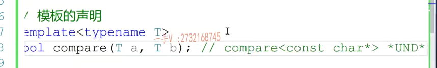

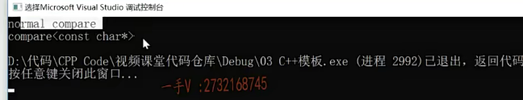

我们之前给大家说过模板本身呢，是不编译，因为它类型不知道。啊，什么时候啊？编译呢？在调用点啊，用类类型从模板实例化得到的模板函数。就是得到了这些东西，这才是需要进行一个。变异的，这才是需要进行一个变异的。啊。所以模板呢，千万不能是一个文件定义，

然后在另外一个文件使用，那么他就找不着相应的这个符号，因为这个符号现在。你在这个文件中调用的时候用int，用double实例化的对吧？用int，用double实例化啊，那在这儿呢？==它只能是产生这些符号的und==，==但是它却找不着这些符号的点态定义的地方，所以呢？链接的时候就会出现这样的错误啊，==链接的时候就会出现这样的错误。所以在这注意一下啊，我们。

模板代码是不能在一个文件中定义。在另外一个文件中使用啊使用

#### 只能产生int ,double这些und,但是找不到定义的地方

==模板代码调用之前一定要看到模板定义的地方。这样呢，这样我们模板啊，这样的话。模板。这样的话啊，话字不对啊，这样的话呢，模板。才能够进行正常的，是不是实例化产生？能够被编译器编译的代码啊，产生能够被编译器编译的代码。就是我们这些东西。==

能够被编译器编译的代码啊，产生能够被编译器编译的代码。就是我们这些东西。啊，所以呢，一般模板代码呢？放在哪里呢？所以一般模板，所以呢，模板代码都是放在。头文件当中的，因为你看我们在使用CA+stl库的时候，直接包含vector这类型。我们可以直接在头文件中看见他们的源码对不对？没有办法，

模板代码必须放在头文件当中，然后呢再？在原文件。当中直接进行。==include包含。include呢，是在预编译过程中啊，把头文件的代码直接在当前原文件中展开==。对着没有那么这也就意味着我们在当前原文件中，在调用模板代码之前呢，都能看到模板定义的地方。啊，都能看到模板定义的地方。都能看到模板定义的地方，这样我们模板就能够进行正常的这个实例化了啊，

进行正常的实例化了。

你就直接给我实例化相应的函数吧compare int啊。int int还有template，tl plate，double compare。doubled able double啊，double double。这是告诉编译器进行模板指定类型的实例化，进行指定类型的。模板实例化，也就是说你别管了，你给我直接升用整形跟double实例化吧，本来呢，我们应该是在调用点我们编辑器看，然后用户调用时候调用的时候用什么类型就用什么类型实例化。现在呢，

你不用看到调用点了啊，你不用看到调用点了，你直接用用户指定的类型。进行这个模板的实例化就可以了。啊，产生相应处理相应类型的这个代码就可以了啊，这个呢，我们就可以。

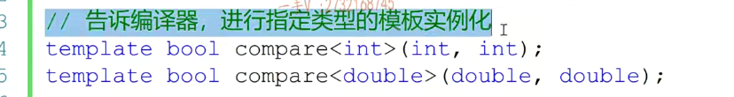

所以模板代码我们刚刚说了啊，模板代码我们都把它放在头文件当中。哪个原文件要用，直接把模板代码include包含进来就可以了啊，这才是最正确的使用模板的这个方式。啊，最正确的使用模板的方式。

在我们写一些通用算法的时候，就是说呢，我这套算法处理任何类型都可以。那么注意啊，我们就可以在使用算法的时候，如果出现具体的类型，就不要==用什么整形double类型了，我们可以直接把它实现成一个模板==。让我们写出来的算法呢，更加通用，适用于任何类型。好，那这一节课的这个内容就到这里